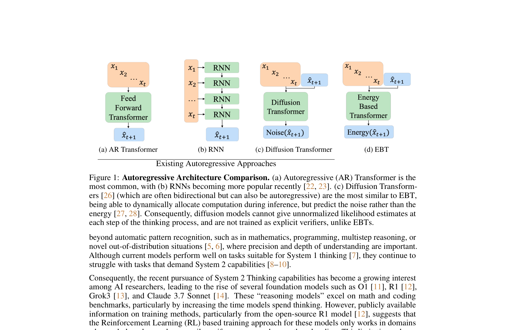
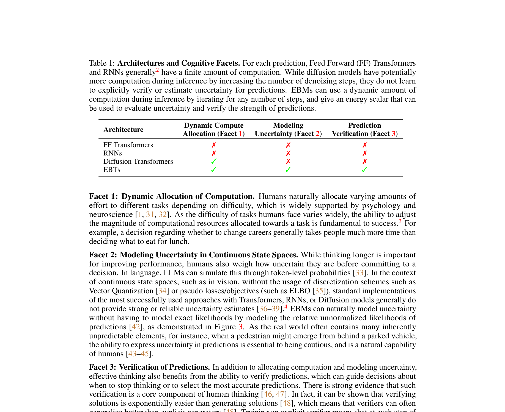
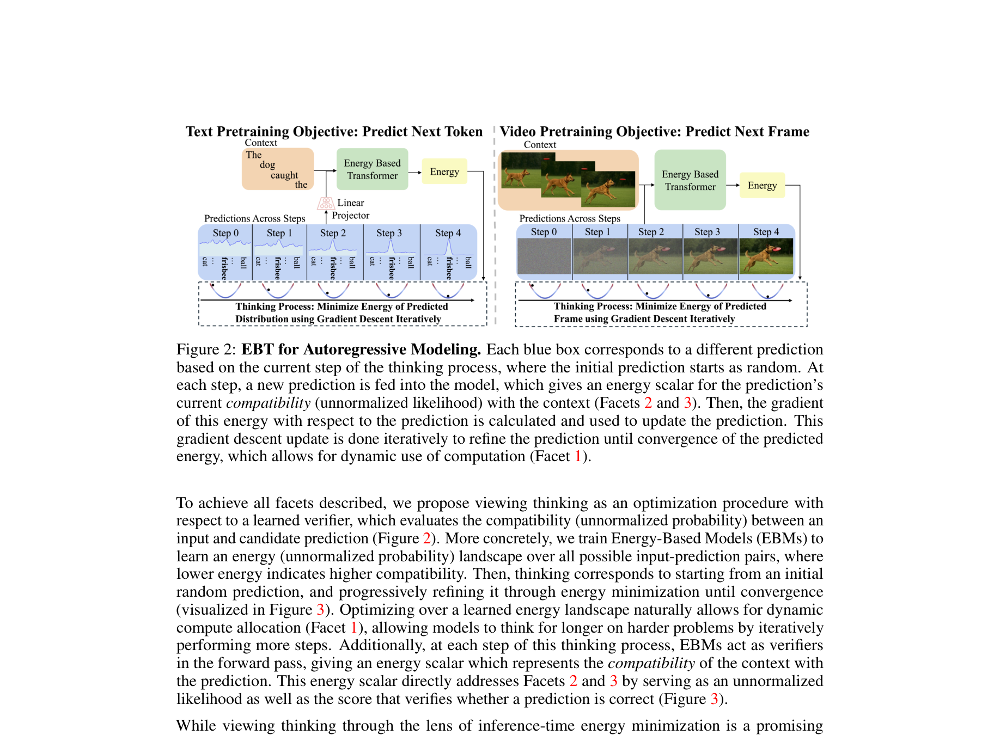
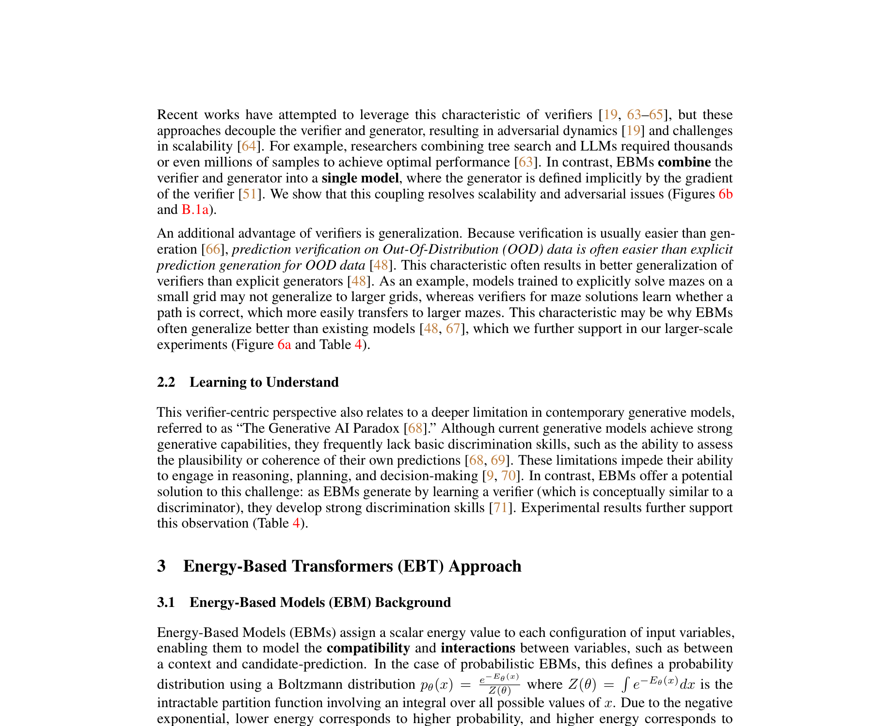
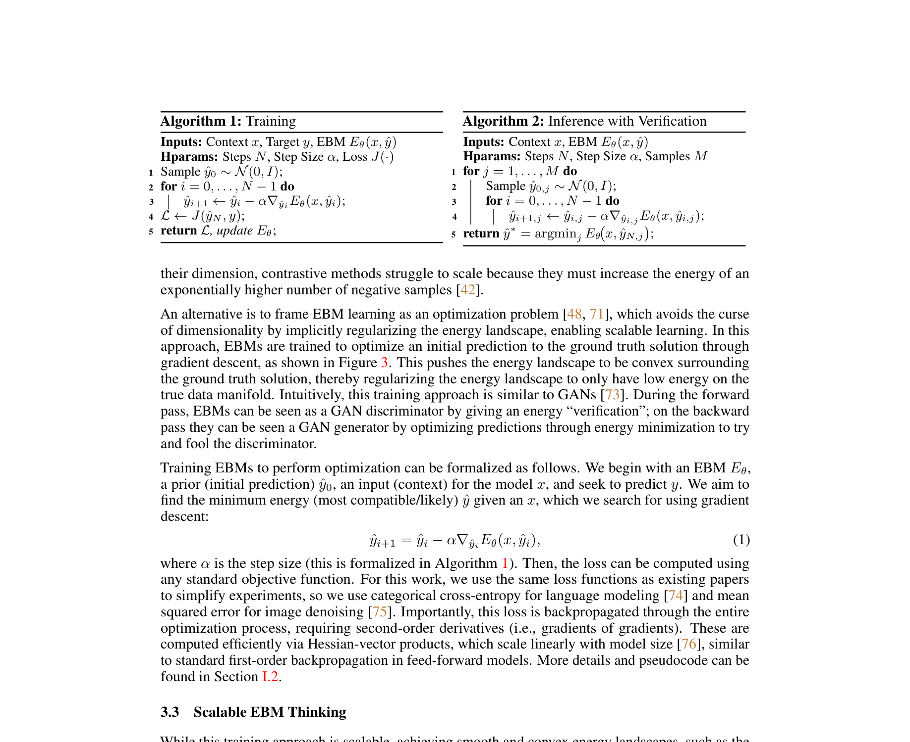

# AI Daily

## Energy-Based Transformers are Scalable Learners and Thinkers

- **Authors**: Alexi Gladstone, Ganesh Nanduru, Md Mofijul Islam, Peixuan Han, Hyeonjeong Ha, Aman Chadha, Yilun Du, Heng Ji, Jundong Li, Tariq Iqbal (UVA, UIUC, Amazon GenAI, Stanford University, Harvard University)
- **Conference**: ICLR 2026 (Oral)
- **Paper URL**: [https://arxiv.org/abs/2507.02092](https://arxiv.org/abs/2507.02092)
- **Keywords**: Energy-Based Models, Transformer, System 2 Thinking, Scalable Learning, Multi-modal
- **先備知識**：如果你對 Energy-Based Models 不熟悉，建議先閱讀 → **[先備知識：Energy-Based Models (EBMs) 核心概念與原理](Energy_Based_Models_Prerequisite.md)**

---

### 核心貢獻與創新點

近年來，賦予 AI 模型「System 2 Thinking（慢思考）」能力成為提升模型推理表現的熱門方向。然而，現有的方法大多存在明顯的局限性：它們通常依賴特定的模態（如僅適用於文字）、局限於特定領域（如數學或程式碼等可驗證的領域），或者需要額外的監督與訓練（如依賴外部的獎勵模型或驗證器）。

為了解決這些問題，來自 UVA、UIUC、Amazon GenAI、Stanford 與 Harvard 的聯合研究團隊提出了一個核心問題：「我們能否僅依靠無監督學習來發展出 System 2 Thinking？」答案是肯定的。他們提出了一種全新的模型架構——**Energy-Based Transformers (EBTs)**，這是一種基於能量模型（Energy-Based Models, EBMs）的 Transformer 變體。

EBTs 的核心創新在於，它學會了明確地「驗證」輸入與候選預測之間的相容性，並將預測問題重新構建為基於該驗證器的優化過程。具體而言，模型會為每個輸入與候選預測對分配一個能量值（未歸一化的概率），然後通過基於梯度下降的能量最小化過程來生成預測，直到能量收斂。

這項工作的主要貢獻包括：
1. **提出 Energy-Based Transformers (EBTs)**：結合了 EBMs 的靈活性與 Transformer 的可擴展性，並提出了確保訓練穩定且可並行化的關鍵技術。
2. **無監督的 System 2 Thinking**：在推理時，模型能夠通過增加前向傳遞次數（優化步數）來動態分配計算資源，展現出強大的思考與自我驗證能力。
3. **卓越的擴展性 (Scalability)**：在離散（文字）與連續（視覺）模態中，EBTs 在預訓練階段的擴展速度均超越了傳統的 Transformer++ 架構，最高可達 35% 的提升。
4. **強大的 OOD 泛化能力**：實驗證明，數據越是偏離訓練分佈（Out-of-Distribution, OOD），EBTs 通過 System 2 Thinking 獲得的性能提升就越顯著。

---

### 技術方法簡述

EBTs 的架構設計旨在解決傳統 EBMs 在擴展性上面臨的挑戰。研究團隊將訓練 EBMs 視為一個優化問題，從而避免了對比學習中常見的維度災難。

#### 1. 基於能量最小化的預測過程
在推理階段，給定輸入上下文 $x$ 和一個初始預測 $y_0$，EBTs 通過梯度下降來尋找具有最小能量（即最相容、最可能）的預測 $\hat{y}$：

$$ \hat{y}_{i+1} = \hat{y}_i - \alpha \nabla_{\hat{y}_i} E_\theta(x, \hat{y}_i) $$

這個過程在概念上類似於生成對抗網路（GANs）。在前向傳遞中，EBT 扮演判別器的角色，給出能量「驗證」；在反向傳遞中，它扮演生成器的角色，通過最小化能量來優化預測。

#### 2. 能量景觀正則化 (Energy Landscape Regularization)
為了確保在高維空間中能量景觀保持平滑且呈凸性（Convexity），從而實現強大的思考能力，研究團隊引入了三項關鍵技術：
* **Replay Buffer**：模擬更長的優化軌跡，使能量景觀在其最小值附近定義得更明確。
* **Langevin Dynamics (隨機噪聲)**：在梯度下降更新中加入隨機噪聲 $\eta_i \sim \mathcal{N}(0, \sigma)$，鼓勵模型探索能量景觀，避免陷入局部最優解。
* **隨機化優化步長與步數**：在訓練時隨機改變步長 $\alpha$ 和優化步數，顯著提升了模型的泛化能力。

#### 3. System 2 Thinking 的三個認知面向
EBTs 的設計完美契合了 System 2 Thinking 的三個關鍵認知面向：
1. **動態計算分配**：模型可以根據問題的難度，動態調整優化步數（思考時間）。
2. **不確定性建模**：在連續空間中，EBTs 能夠通過能量標量自然地表達對預測的不確定性（能量越高，不確定性越大）。
3. **預測驗證**：模型在每一步思考過程中，都能夠通過評估能量值來驗證預測的質量。

---

### 實驗結果和性能指標

EBTs 在多個模態和任務上進行了廣泛的評估，展現了其作為下一代基礎模型架構的巨大潛力。

#### 1. 語言模型擴展性 (Language Learning Scalability)
在自迴歸語言建模任務中，EBTs 在數據量、批次大小、模型深度、參數數量、FLOPs 以及嵌入維度等六個縮放軸上，均顯著超越了傳統的 Transformer++ 基準。這是首個在不修改分詞器的情況下，在多個縮放軸上全面超越 Transformer++ 的方法。

#### 2. System 2 Thinking 性能
在推理階段，EBTs 能夠通過「思考更久」（增加優化步數）和「自我驗證」（生成多個候選並選擇能量最低者）來顯著提升性能。
* 在多個基準測試中，EBTs 通過額外的計算量可將性能提升高達 **29%**。
* 相比之下，標準的 Transformer++ 無法通過增加每個 token 的計算量來降低困惑度（Perplexity）。

#### 3. OOD 泛化能力與視覺任務
* **泛化能力**：實驗顯示，下游任務數據越是偏離預訓練分佈（OOD），EBTs 通過思考獲得的性能提升呈線性增加。這表明 EBTs 的思考機制對於強健的泛化至關重要。
* **圖像去噪 (Image Denoising)**：在雙向訓練設置下，EBTs 在分佈內（In-Distribution）和 OOD 圖像去噪任務上均顯著超越了 Diffusion Transformers (DiTs)。更重要的是，EBTs 達到更優性能所需的**前向傳遞次數僅為 DiTs 的 1%**。

---

### 相關研究背景

* **Energy-Based Models (EBMs)**：傳統的 EBMs 訓練通常依賴對比方法（Contrastive methods），這在高維空間中面臨嚴重的擴展性問題。EBTs 採用了將學習框架化為優化問題的替代途徑，成功實現了規模化。如果你對 EBM 的基礎數學不熟悉，建議閱讀 **[先備知識：Energy-Based Models (EBMs) 核心概念與原理](Energy_Based_Models_Prerequisite.md)**。
* **System 2 Thinking**：近期的模型如 OpenAI o1/o3、DeepSeek-R1 等通過強化學習（RL）實現了 System 2 Thinking。然而，這些方法依賴於規則明確、易於驗證的領域（如數學和程式碼），難以泛化到其他任務。EBTs 則提供了一種純粹基於無監督學習的通用解決方案。
* **JEPA 架構**：JEPA（如 I-JEPA, V-JEPA, TC-JEPA）在潛在特徵空間中進行預測，同樣旨在學習豐富的表示。EBTs 則進一步將預測過程轉化為能量最小化，賦予了模型動態推理的能力。

---

### 個人評價和意義

Energy-Based Transformers (EBTs) 是一篇極具突破性的研究，被 ICLR 2026 接收為 Oral 論文實至名歸。它不僅在理論上優雅地將 EBMs 與 Transformer 結合，更在實踐中證明了這種架構在擴展性和推理能力上的巨大優勢。

這項工作的核心意義在於：
1. **打破了 RL-based System 2 Thinking 的局限**：它證明了我們不需要依賴複雜的強化學習 pipeline 或特定領域的驗證器，僅通過無監督預訓練和能量最小化機制，模型就能自然湧現出 System 2 Thinking 能力。這使得慢思考能夠應用於任何模態和任務。
2. **為下一代基礎模型提供了新範式**：EBTs 在數據效率和計算效率上全面超越 Transformer++，且其思考能力隨著模型規模的擴大而增強。這暗示著在未來的超大規模訓練中，EBTs 可能會成為比現有自迴歸 Transformer 更優的選擇。
3. **優雅的不確定性建模**：模型學會了利用能量值來表達不確定性，這對於提高 AI 系統的可靠性和可解釋性具有重要價值。

對於關注大模型架構演進、Energy-based models 以及 System 2 推理機制的研究者來說，這篇論文提供了非常深刻的洞見，是近期必讀的佳作。
