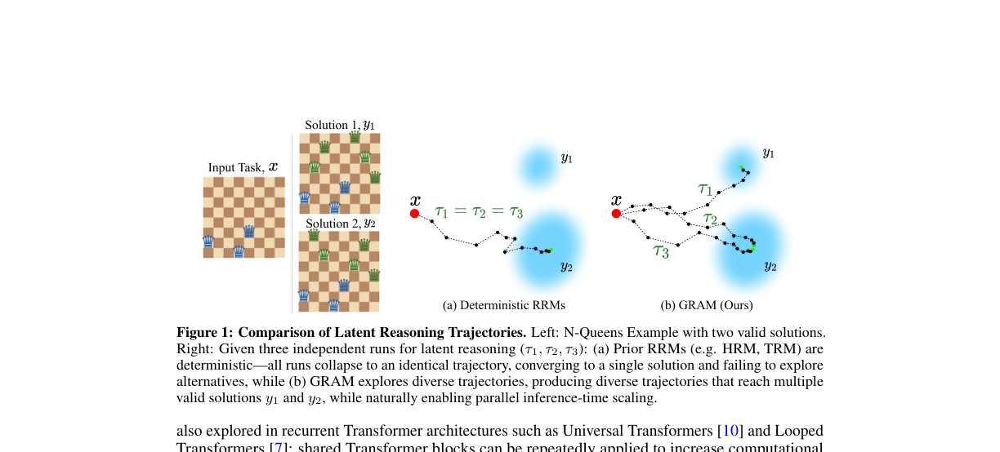
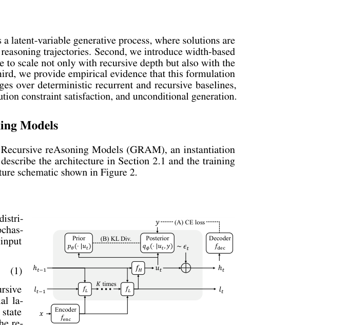
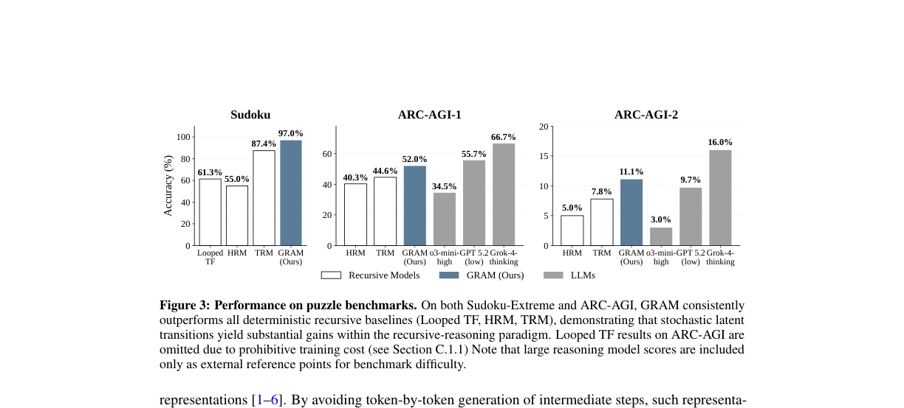
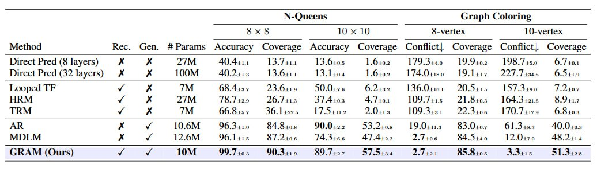

# AI Daily

## GRAM: Generative Recursive Reasoning

**論文標題**：Generative Recursive Reasoning
**作者**：Junyeob Baek, Mingyu Jo, Minsu Kim, Mengye Ren, Yoshua Bengio, Sungjin Ahn
**發表機構**：KAIST, Mila — Québec AI Institute, New York University, Université de Montréal
**發表時間**：2026年5月19日 (arXiv)
**論文連結**：[arXiv:2605.19376](https://arxiv.org/abs/2605.19376)
**項目主頁**：[GRAM Website](https://ahn-ml.github.io/gram-website/)

---

### 核心貢獻與創新點

未來的神經推理系統應如何實現擴展計算（Extended Computation）？遞歸推理模型（Recursive Reasoning Models, RRMs）透過共享過渡函數進行迭代的潛在狀態優化，為自迴歸序列擴展提供了一個極具潛力的替代方案。然而，現有的 RRMs 大多是確定性的，遵循單一的潛在軌跡並收斂到單一的預測結果。

本文介紹了 **Generative Recursive reAsoning Models (GRAM)**，這是一個將遞歸潛在推理轉化為**概率多軌跡計算**的框架。GRAM 將推理建模為隨機的潛在軌跡，支援多種假設、替代的解決策略，以及透過遞歸深度和並行軌跡採樣實現推理時間的擴展（Inference-time Scaling）。

**主要創新點包括：**

1.  **概率多軌跡計算**：將傳統確定性的潛在狀態更新改為隨機過渡，使模型能夠探索多條推理路徑。
2.  **新的 Test-time Scaling 軸**：除了增加遞歸深度（Depth）外，還引入了並行採樣多條軌跡的寬度（Width）擴展。
3.  **無條件生成能力**：在沒有輸入條件的情況下，相同的遞歸過程定義了一個無條件生成模型 $p(x)$。
4.  **強大的謎題解決能力**：在 Sudoku 和 ARC-AGI 等挑戰性謎題任務上顯著超越確定性基線模型。

*圖 1：確定性 vs. 概率性遞歸推理。(a) 先前的 RRMs 是確定性的——所有運行都崩潰為相同的軌跡，收斂到單一解。(b) GRAM 探索多樣化的軌跡，到達多個有效解，自然地實現並行推理時間擴展。*

---

### 技術方法簡述

GRAM 將推理過程本身視為一個隨機潛在軌跡：在每個遞歸步驟中，模型根據輸入和當前的推理狀態對過渡進行採樣，而不是確定性地更新到單一的下一個狀態。

#### GRAM 架構
在單一的隨機潛在過渡中，經過 $K$ 次低級優化（透過 $f_L$）後，高級更新 $f_H$ 產生一個確定性的提議 $u_t$。然後，將可學習的隨機引導 $\epsilon_t$ 添加到 $u_t$ 中：$h_t = u_t + \epsilon_t$。其中，均值編碼了依賴於狀態的方向，而變異數控制了探索的程度。

*圖 2：GRAM 架構。單一的隨機潛在過渡。*

#### 推理時間擴展 (Inference-Time Scaling)
GRAM 支援兩個互補的推理時間擴展軸：
*   **深度 (Depth)**：透過改變遞歸過渡的數量。
*   **寬度 (Width)**：透過並行採樣多個潛在推理軌跡。
為從多個候選軌跡中選擇最佳結果，作者訓練了一個**潛在過程獎勵模型 (Latent Process Reward Model, LPRM)**，從潛在狀態預測輸出的正確性。

---

### 實驗結果

#### 1. 挑戰性謎題任務
在 Sudoku-Extreme 和 ARC-AGI 挑戰上，GRAM 始終優於所有確定性遞歸基線（Looped TF, HRM, TRM）。
*   **隨機引導改善推理**：透過在更豐富的解路徑分佈上進行訓練，GRAM 獲得了更強健的推理能力。
*   **Test-time Scaling 的有效性**：在 Sudoku 任務中，使用 16 次迭代並行採樣 20 個樣本（N=20）的 GRAM 達到了 97.0% 的準確率，顯著超越了在 320 次迭代下運行的確定性模型 TRM（90.5%），儘管兩者的計算預算相當。

*圖 3：GRAM 在 Sudoku 和 ARC-AGI 上的表現，展示了其相對於確定性模型的優勢。*

#### 2. 多解任務 (Multi-Solution Tasks)
確定性遞歸模型在多解任務（如 N-Queens 和圖著色）上失敗，因為它們在結構上無法捕捉多個解，導致模式崩潰（Mode Collapse）。GRAM 不僅達到了與生成模型（如 AR, MDLM）相當的高覆蓋率，而且由於遞歸優化，它實現了更嚴格的約束滿足。

*表 1：GRAM 在多解任務中展現出高覆蓋率和低衝突率。*

#### 3. 無條件生成 (Unconditional Generation)
透過將輸入替換為空的條件信號，GRAM 可以進行無條件生成。在 Sudoku 生成中，它以 10.9M 參數和 16 個監督步驟達到了 99.05% 的有效性。在二值化 MNIST 上，GRAM 產生了可識別的數字，克服了確定性基線 TRM 的模式崩潰問題。

---

### 總結與個人見解

Yoshua Bengio 團隊的這篇 **GRAM** 論文為 Energy-based 和 Latent Variable 模型在推理任務上的應用開闢了新視角。
*   **核心價值**：將遞歸推理從「單一路徑的確定性優化」轉變為「多路徑的概率性探索」。這不僅解決了確定性模型在多解任務中的模式崩潰問題，更重要的是，它為緊湊型模型提供了一種全新的、基於並行採樣的 Test-time Scaling 策略。
*   **與現有趨勢的聯繫**：當前 LLM 領域（如 OpenAI o1, DeepSeek-R1）強烈依賴 RL 和長 Chain-of-Thought (CoT) 來實現 Test-time Scaling。GRAM 展示了另一種可能性：透過在潛在空間（Latent Space）進行隨機探索和遞歸，小型模型（10M 參數級別）也能在結構化推理任務上展現出驚人的擴展能力和準確率。
*   **未來潛力**：這種架構對於需要探索巨大解空間的任務（如規劃、代碼生成、數學證明）具有極大的啟發意義。LPRM（潛在過程獎勵模型）的引入也類似於 Value Network 在 MCTS 中的作用，這為結合基於搜索的規劃和遞歸神經網絡提供了一個優雅的框架。
