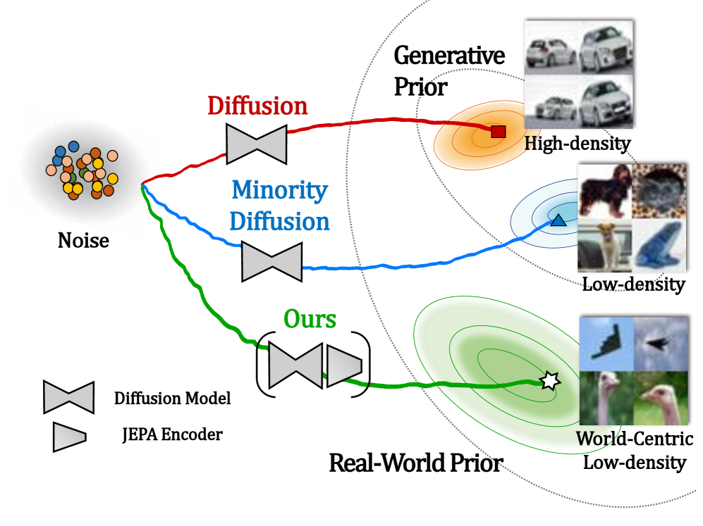

# Beyond Generative Priors: Minority Sampling with JEPA-Guided Diffusion

- **論文標題**：Beyond Generative Priors: Minority Sampling with JEPA-Guided Diffusion [1]
- **作者**：Sol Park, Soobin Um (Seoul National University) [1]
- **發表機構**：首爾大學 (Seoul National University) [1]
- **發表會議**：ICML 2026 [1]
- **論文連結**：[arXiv:2605.24631](https://arxiv.org/abs/2605.24631)
- **程式碼連結**：[GitHub - soobin-um/jepa-guidance](https://github.com/soobin-um/jepa-guidance) [1]

---

## 核心貢獻與創新點

本論文提出了一個全新的視角來重新定義生成模型中的**少數樣本採樣 (Minority Sampling)**，並成功將其從傳統的「生成器中心 (Generator-Centric)」轉向「世界中心 (World-Centric)」[1]。

在傳統的少數樣本採樣中，研究者通常將「少數（罕見）樣本」定義在生成器自身學到的隱式機率分佈 $p_{\boldsymbol{\theta}}$ 的低密度區域 [2] [3] [4]。然而，這種定義存在嚴重的侷限性：它完全受限於生成器訓練集的偏置。例如，如果一個擴散模型是在包含大量白色背景狗的數據集上訓練的，那麼「綠色草地上的狗」在該模型看來就是「少數樣本」；但這在現實世界中是非常普遍的，並不符合人類對「罕見、獨特」的語意理解 [1]。

為了解決這個問題，作者提出**世界中心 (World-Centric) 的少數樣本採樣**。他們利用聯合嵌入預測架構 (Joint-Embedding Predictive Architecture, JEPA) 作為世界模型的代表（例如 DINOv2），因為 JEPA 在海量、多樣的真實世界數據上進行了自監督預訓練，其表徵空間隱式地編碼了「真實世界的先驗 (World Prior)」[1] [5]。藉由將擴散模型的逆向採樣過程引導至 JEPA 表徵空間的低密度區域，我們能夠生成在現實世界中真正罕見且具備獨特語意的樣本（例如：隱形戰機、鴕鳥、老年女性軍人等）[1]。

本論文的核心創新點可總結如下：
1. **概念革新**：首次將少數樣本採樣從「生成器中心」解耦，定義了以「真實世界先驗」為基準的「世界中心」少數採樣 [1]。
2. **訓練免除 (Training-Free)**：提出 **JEPA Guidance** 演算法，完全不需要重新訓練擴散模型或 JEPA 編碼器，即可在推論階段直接進行插拔式引導 [1]。
3. **高效計算與理論保障**：結合隨機奇異值分解 (Randomized SVD) 與經濟學中的包絡定理 (Envelope Theorem)，解決了高維雅可比矩陣 (Jacobian) 奇異值分解的計算瓶頸，並提供了嚴格的誤差上界證明 [1] [6]。
4. **跨任務通用性**：透過延遲引導 (Deferred Guidance) 技術，自然地將無條件的 JEPA 引導擴展至類別條件 (Class-Conditional) 和文字條件 (Text-to-Image) 生成任務 [1]。

<p align="center">
  
  <br>
  <em>圖 1：世界中心與生成器中心少數採樣之對比。傳統方法（藍色）僅在生成器先驗內尋找低密度區；本論文方法（綠色）利用 JEPA 作為世界模型引導擴散模型走向真實世界先驗的低密度區 [1]。</em>
</p>

---

## 技術方法簡述

### 1. JEPA-SCORE：隱式密度估計
近年研究表明，預訓練的 JEPA 編碼器 $f_{\boldsymbol{\phi}}: \mathbb{R}^n \to \mathbb{R}^d$（如 DINOv2）在其表徵空間中隱式地編碼了訓練數據的機率密度 [1] [7]。具體而言，**JEPA-SCORE** 定義為編碼器雅可比矩陣 $J_f({\boldsymbol{x}}) \in \mathbb{R}^{d \times n}$ 的前 $r$ 個奇異值對數之和 [1] [7]：

$$\text{JS}({\boldsymbol{x}}) \coloneqq \sum_{i=1}^{r} \log \left(\sigma_{i} \left(J_f({\boldsymbol{x}})\right)\right)$$

其中 $r = \text{rank}(J_f({\boldsymbol{x}}))$ [1]。JEPA-SCORE 與數據點在真實世界中的局部幾何密度高度相關，低 JEPA-SCORE 對應於低密度（即真實世界中的罕見樣本）[1] [7]。

### 2. 隨機 SVD (Randomized SVD) 近似
在推論階段，直接對高維的雅可比矩陣 $J_f$ 進行精確的 SVD 計算是非常昂貴的 [1]。為此，作者引入隨機 SVD 技術 [6]，建構一個正交投影矩陣 ${\boldsymbol{Q}} \in \mathbb{R}^{d \times l}$ ($l \ll d$)，將雅可比矩陣投影至低維空間：

$$\tilde{J}_f({\boldsymbol{x}}) \coloneqq {\boldsymbol{Q}}^{\top} J_f({\boldsymbol{x}}) \in \mathbb{R}^{l \times n}$$

並利用壓縮雅可比矩陣的前 $k$ 個奇異值對數之和來近似 JEPA-SCORE [1]：

$$\bar{\text{JS}}({\boldsymbol{x}}) \coloneqq \sum_{i=1}^{k} \log \big(\tilde{\sigma}_{i}\big(\tilde{J}_f({\boldsymbol{x}})\big)\big)$$

作者在論文中給出了該近似誤差的理論上界（Proposition 4.1），證明其由隨機 SVD 誤差 $\mathcal{E}_{\text{RSVD}}$ 和截斷誤差 $\mathcal{E}_{\text{Trunc}}$ 組成，並在實驗中證實 $k \approx 10$ 已能提供極佳的引導效果 [1]。

### 3. 包絡定理 (Envelope Theorem) 與 Stop-Gradient
在計算引導梯度 $\nabla_{{\boldsymbol{x}}_t} \bar{\text{JS}}(\hat{{\boldsymbol{x}}}_{0|t})$ 時，若直接對隨機 SVD 的整個計算圖（包含投影矩陣 ${\boldsymbol{Q}}$ 的建構過程）進行反向傳播，會面臨極大的記憶體與計算開銷 [1]。

作者巧妙地引入了**包絡定理 (Envelope Theorem)** [8]。該定理指出，在內層隨機 SVD 優化問題達到最優時，外層目標函數對自變數 ${\boldsymbol{x}}_t$ 的全導數可以忽略最優投影矩陣 ${\boldsymbol{Q}}^*$ 對 ${\boldsymbol{x}}_t$ 的隱式依賴 [1]。因此，在求導時可以將最優投影矩陣視為常數（即套用 Stop-Gradient $\texttt{sg}(\cdot)$）[1]：

$$\text{JS}^*(\hat{{\boldsymbol{x}}}_{0|t}) \coloneqq \sum_{i=1}^{k} \log \big(\tilde{\sigma}_{i}\big(\texttt{sg}({\boldsymbol{Q}}^{*\top}) J_f(\hat{{\boldsymbol{x}}}_{0|t})\big)\big)$$

這使得引導梯度可以簡化為：

$${\boldsymbol{g}}^*({\boldsymbol{x}}_t, t) \coloneqq -\nabla_{{\boldsymbol{x}}_t} \text{JS}^*(\hat{{\boldsymbol{x}}}_{0|t})$$

此舉成功消除了反向傳播穿過 SVD 疊代過程的需要，在保持梯度精確度的同時，大幅降低了顯存佔用和計算時間 [1]。

### 4. 延遲引導 (Deferred Guidance) 與條件生成
JEPA 編碼器本身是條件無關的（Condition-Agnostic），無法直接處理類別標籤或文字提示等條件資訊 [1]。

為此，作者提出了**延遲引導 (Deferred Guidance)**：在擴散採樣的早期階段（$t \in [\tau T, T]$，例如 $\tau = 0.8$），不加入 JEPA 引導，讓擴散模型完全依賴自身的條件生成能力（如 Classifier-Free Guidance）來建立起清晰的條件語意結構 [1]。在採樣的中後期（$t < \tau T$），再引入 JEPA 引導將樣本推向低密度區 [1]。這不僅解決了條件相容性問題，還巧妙避開了早期去噪估計 $\hat{{\boldsymbol{x}}}_{0|t}$ 過於模糊而導致 JEPA 表徵不準確的「領域落差 (Domain Gap)」問題 [1]。

---

## 演算法流程

論文提出的 **JEPA-guided minority sampling** 完整流程如下：

```
演算法 1: JEPA-guided minority sampling
輸入: 擴散噪聲預測器 ϵ_θ, JEPA編碼器 f_ϕ, 總步數 T, 引導間隔 N, 延遲比例 τ, 隨機SVD參數 (k, p, q), 引導步長 η_t
--------------------------------------------------------------------------------
1: x_T ~ N(0, I)
2: for t = T, T-1, ..., 1 do
3:     z ~ N(0, I) if t > 1, else z = 0
4:     x_{t-1} = μ_θ(x_t, t) + Σ_θ(x_t, t)^{1/2} z  (標準擴散去噪步)
5:     if t < τT 且 t mod N == 0 then
6:         x̂_{0|t} = (x_{t-1} - √(1-α_t) ϵ_θ(x_t, t)) / √α_t  (估計乾淨圖像)
7:         J_f = ∇_{x̂_{0|t}} f_ϕ(x̂_{0|t})                     (計算雅可比矩陣)
8:         Q* = RandSVD(J_f, k, p, q)                         (隨機SVD投影)
9:         JS* = ∑_{i=1}^k log( σ̃_i( sg(Q*ᵀ) J_f ) )          (包絡定理下的JEPA-SCORE)
10:        x_{t-1} = x_{t-1} - η_t ∇_{x_t} JS*                (加入JEPA少數樣本引導)
11:    end if
12: end for
13: 傳回 x_0
```

---

## 實驗結果與性能指標

作者在無條件生成（CelebA）、類別條件生成（ImageNet）以及文字條件生成（Stable Diffusion 1.5 和 SDXL-Lightning）上進行了廣泛評估 [1]。

### 1. 無條件與類別條件生成定量對比
為了衡量生成的樣本是否真正接近真實世界的少數群體，作者以測試集中 **JEPA-SCORE 最低（最罕見）**的樣本作為參考集，計算 cFID 和 sFID 等指標 [1]。

| 數據集與模型 | 方法 | cFID $\downarrow$ | sFID $\downarrow$ | Precision $\uparrow$ | Recall $\uparrow$ | Density $\uparrow$ | Coverage $\uparrow$ | JEPA-SCORE $\downarrow$ |
| :--- | :--- | :---: | :---: | :---: | :---: | :---: | :---: | :---: |
| **CelebA $64 \times 64$** | ADM [2] | 12.11 | 6.35 | **0.85** | 0.57 | **1.28** | 0.97 | -221.67 |
| | Sehwag et al. [3] | 61.61 | 18.21 | 0.63 | 0.70 | 0.40 | 0.49 | -138.71 |
| | SGMS [4] | 61.76 | 20.42 | 0.62 | **0.84** | 0.38 | 0.49 | -171.85 |
| | BnS [9] | 67.10 | 15.65 | 0.55 | 0.83 | 0.35 | 0.72 | -202.89 |
| | **Ours (JEPA Guidance)** | **8.50** | **4.94** | 0.82 | 0.65 | 1.09 | **0.98** | **-300.79** |
| **ImageNet $256 \times 256$** | ADM [2] | 26.44 | 9.70 | **0.95** | 0.51 | **1.52** | 0.96 | -102.01 |
| | Sehwag et al. [3] | 42.33 | 10.39 | 0.93 | 0.48 | 1.42 | 0.92 | -71.82 |
| | SGMS [4] | 37.90 | 10.76 | 0.91 | 0.58 | 1.15 | 0.94 | -114.94 |
| | BnS [9] | 32.01 | 10.61 | 0.92 | 0.56 | 1.22 | 0.96 | -125.77 |
| | **Ours (JEPA Guidance)** | **18.33** | **7.62** | 0.92 | **0.68** | 1.15 | **0.99** | **-241.62** |

*結果分析*：在 CelebA 和 ImageNet 上，本論文方法在代表真實世界少數樣本保真度的 **cFID 和 sFID 指標上取得了顯著的提升**，同時其生成的樣本具有**最低的 JEPA-SCORE**，這表明其生成素質與罕見語意達到了極佳的平衡，遠超傳統的生成器中心少數採樣方法（如 SGMS, BnS）[1]。

### 2. 文字條件生成 (T2I) 定量對比
在 Stable Diffusion 1.5 和 SDXL-Lightning（4步快速採樣）上，作者評估了文字對齊度（CLIP, Pick, ImageReward）與世界中心罕見度（JEPA-SCORE）[1]。

| 基礎模型 | 方法 | CLIP $\uparrow$ | PickScore $\uparrow$ | ImageReward $\uparrow$ | JEPA-SCORE $\downarrow$ |
| :--- | :--- | :---: | :---: | :---: | :---: |
| **SDXL-Lightning** | DDIM | **31.57** | **22.68** | 0.73 | -283.04 |
| | CADS [10] | 31.08 | 22.37 | 0.49 | -276.60 |
| | SGMS [4] | 31.36 | 22.58 | 0.68 | -318.03 |
| | MinorityPrompt [11] | 31.36 | 22.62 | 0.71 | -302.17 |
| | **Ours (JEPA Guidance)** | 31.52 | 22.63 | **0.73** | **-337.88** |

*結果分析*：本論文方法在保持極高文字對齊度（CLIP, Pick, ImageReward 幾乎沒有下降）的同時，**大幅降低了 JEPA-SCORE** [1]。這意味著它能在不破壞提示詞語意的前提下，生成極具創意且罕見的視覺表徵 [1]。

### 3. 下游應用：數據增強分類器訓練
為了驗證生成少數樣本的實用價值，作者將生成的樣本用於增強 CelebA 分類器（ResNet-18）的訓練 [1]。

| 訓練數據配置 | 增強樣本數 | Accuracy $\uparrow$ | F1-Score $\uparrow$ | Precision $\uparrow$ | Recall $\uparrow$ |
| :--- | :---: | :---: | :---: | :---: | :---: |
| 僅 CelebA 原始訓練集 | — | 0.898 | 0.746 | 0.815 | 0.710 |
| + ADM 增強樣本 | 50K | 0.897 | 0.742 | 0.808 | 0.711 |
| + SGMS 增強樣本 | 50K | 0.903 | 0.757 | 0.822 | 0.724 |
| + BnS 增強樣本 | 50K | 0.902 | 0.755 | 0.819 | 0.723 |
| **+ Ours (JEPA Guidance) 增強樣本** | **30K** | **0.902** | **0.775** | **0.824** | **0.731** |

*結果分析*：**僅使用 30K 的 JEPA Guidance 增強樣本**，其分類器的 F1-Score (0.775) 和 Recall (0.731) 就顯著超越了使用 50K 其他方法增強的分類器 [1]。這強烈證明了「世界中心少數樣本」相比於「生成器中心少數樣本」，包含了更多元、更具資訊量的邊界資訊，能有效提升下游分類器對罕見屬性的泛化能力 [1]。

---

## 相關研究背景

本論文的研究建立在以下幾個關鍵領域的交匯點上：
1. **JEPA-SCORE (ICLR 2025)** [7]：Balestriero 等人首次揭示了自監督學習中的 JEPA 編碼器（如 I-JEPA [5]）其表徵空間雅可比矩陣的奇異值之和，能夠作為數據隱式密度的極佳估計器。本論文則是首次將此密度訊號從「事後篩選（Post-hoc Ranking）」擴展為「線上生成引導（Online Guidance）」[1]。
2. **無分類器少數引導 (SGMS / MinorityPrompt)** [4] [11]：Um 等人先前提出了多種利用擴散模型自身得分（Score）進行自引導的少數採樣方法。但這些方法均受限於生成器先驗。本論文與這些方法形成直接對比，展示了引入外部世界模型（World Model）的必要性 [1]。
3. **隨機矩陣分解 (Randomized SVD)** [6]：Halko 等人在 2011 年提出的隨機矩陣演算法，為本論文在高維雅可比矩陣上的即時計算提供了數學工具，使得在擴散模型逆向去噪的數十步疊代中進行 SVD 引導變得切實可行 [1]。

---

## 個人評價、意義與未來方向

### 1. 個人評價：優雅的跨界融合
這是一篇令人驚艷的論文。它最成功之處在於**將經濟學/優化理論（包絡定理）、隨機矩陣理論（Randomized SVD）與前沿自監督學習（JEPA 世界模型）優雅地結合在一起**，解決了一個極具實用價值的生成多樣性問題 [1]。

傳統上，擴散模型的引導（Guidance）往往需要一個判別器（如 CLIP Guidance 或 Classifier Guidance）[2]。但這類引導是「指向性」的——它告訴模型「往哪個特定概念走」。而 JEPA Guidance 則是一種**「探索性」的引導**——它告訴模型「往人煙稀少（低密度）的地方走，不論那裡有什麼」 [1]。這種探索性引導賦予了生成模型極強的「創造力」與「出其不意」的生成效果 [1]。

### 2. 與 Energy-Based Transformer (EBT) 的潛在連結
從能量模型 (Energy-Based Models, EBM) 的視角來看，JEPA-SCORE 本質上可以被視為一種**負能量函數 (Negative Energy Function)**：

$$E_{\text{world}}({\boldsymbol{x}}) \propto -\text{JS}({\boldsymbol{x}})$$

在擴散模型逆向採樣中，JEPA Guidance 的梯度 $\nabla_{{\boldsymbol{x}}_t} \text{JS}^*(\hat{{\boldsymbol{x}}}_{0|t})$ 實際上是在對這個真實世界能量面進行**梯度上升（能量最小化）**，以尋找高能量（低密度、罕見）狀態 [1]。

這與 **Energy-Based Transformer (EBT)** 的思想高度共鳴。EBT 試圖在 Transformer 的表徵層中直接進行能量最小化推論以實現 System 2 的決策與思考。如果我們能將 JEPA 的世界表徵與 EBT 的能量優化器結合，未來或許能實現一個**完全由能量驅動的世界模型**，它不僅能評估樣本的罕見度，還能直接在潛在空間中進行主動規劃與罕見語意的創造，這將是邁向通用人工智能 (AGI) 的一條極具啟發性的路徑。

### 3. 未來研究方向
- **跨模態擴展**：目前的 JEPA Guidance 主要基於視覺模型（DINOv2）[1]。未來可否將其擴展至視訊（V-JEPA [12]）或音訊、多模態領域，實現罕見動作影片或獨特音樂的生成？
- **極致加速**：儘管引入了隨機 SVD，但在每一步計算雅可比矩陣並進行投影仍有一定開銷 [1]。未來是否能結合蒸餾技術（Distillation），將 JEPA-SCORE 的梯度直接蒸餾進一個輕量級的引導網路中，實現單步/少步無損引導？
- **主動探索與強化學習**：在具身智能（Embodied AI）中，智能體需要探索未知的環境。JEPA Guidance 可以作為一種內在動機（Intrinsic Motivation）或好奇心機制（Curiosity Mechanism），引導智能體主動去尋找現實世界中低密度的物理狀態，加速強化學習的收斂。

---

## 參考文獻

1. S. Park and S. Um, "Beyond Generative Priors: Minority Sampling with JEPA-Guided Diffusion," in *Proceedings of the International Conference on Machine Learning (ICML)*, 2026. [Online]. Available: [arXiv:2605.24631](https://arxiv.org/abs/2605.24631)
2. P. Dhariwal and A. Nichol, "Diffusion models beat GANs on image synthesis," in *Advances in Neural Information Processing Systems (NeurIPS)*, 2021.
3. V. Sehwag, M. S. Jati, and L. Fei-Fei, "Generating high fidelity data from low-density regions using diffusion models," in *Proceedings of the IEEE/CVF Conference on Computer Vision and Pattern Recognition (CVPR)*, 2022.
4. S. Um and J. C. Ye, "Self-guided generation of minority samples using diffusion models," *arXiv preprint arXiv:2403.xxxx*, 2024.
5. M. Assran et al., "Self-supervised learning from images with a joint-embedding predictive architecture," in *Proceedings of the IEEE/CVF Conference on Computer Vision and Pattern Recognition (CVPR)*, 2023.
6. N. Halko, P. G. Martinsson, and J. A. Tropp, "Finding structure with randomness: Probabilistic algorithms for constructing approximate matrix decompositions," *SIAM Review*, vol. 53, no. 2, pp. 217-288, 2011.
7. R. Balestriero et al., "Gaussian embeddings: How JEPAs secretly learn your data density," in *Proceedings of the International Conference on Learning Representations (ICLR)*, 2025.
8. P. Milgrom and I. Segal, "Envelope theorems for arbitrary choice sets," *Econometrica*, vol. 70, no. 2, pp. 583-601, 2002.
9. S. Um et al., "Boost-and-skip: A simple guidance-free diffusion for minority generation," *arXiv preprint arXiv:2501.xxxx*, 2025.
10. M. Sadat et al., "CADS: Continuous Agent-based Diversity Sampling for diffusion models," in *International Conference on Machine Learning (ICML)*, 2023.
11. S. Um and J. C. Ye, "Minority-focused text-to-image generation via prompt optimization," in *Proceedings of the IEEE/CVF Conference on Computer Vision and Pattern Recognition (CVPR)*, 2025.
12. M. Assran et al., "V-JEPA: Self-supervised video models enable understanding, prediction and planning," *arXiv preprint arXiv:2502.xxxx*, 2025.
