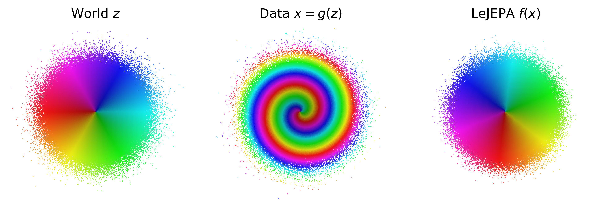
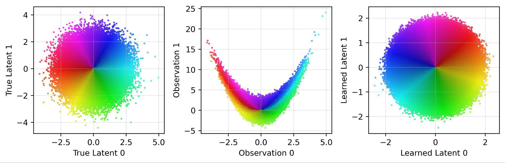
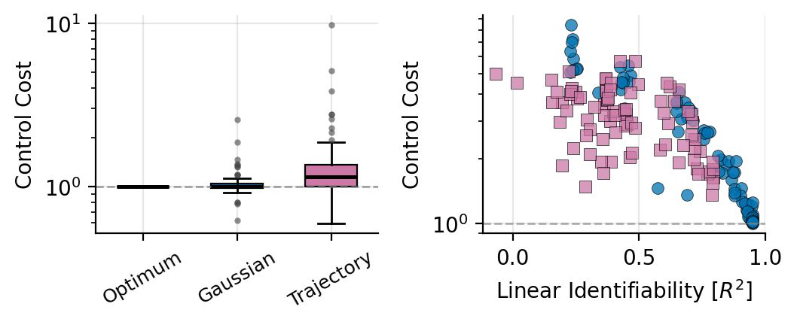
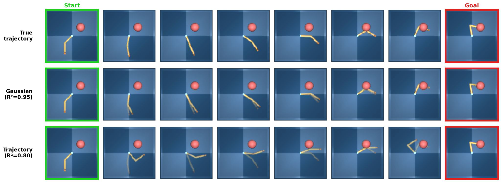

# AI Daily — When Does LeJEPA Learn a World Model?

## 論文基本信息

*   **論文標題**：When Does LeJEPA Learn a World Model? [1]
*   **作者背景**：David Klindt (Cold Spring Harbor Laboratory), Yann LeCun (New York University & Meta FAIR), Randall Balestriero (Brown University) [1]
*   **發表狀態**：arXiv 2026 (Submitted on 25 May 2026) [1]
*   **論文連結**：[arXiv:2605.26379](https://arxiv.org/abs/2605.26379)
*   **主題領域**：自監督學習 (SSL)、世界模型 (World Models)、非線性獨立成分分析 (Nonlinear ICA)、線性可識別性 (Linear Identifiability)

---

## 論文核心貢獻和創新點

本文是自監督學習與世界模型領域的一項**里程碑式理論工作**。自監督學習的核心承諾是透過觀察與預測來學習世界的表徵，而聯合嵌入預測架構（JEPA）[2] 在圖像、視頻與潛空間規劃中取得了巨大成功。然而，理論界長期存在一個根本性疑問：**學習到的表徵何時才能真正成為一個「世界模型」——即能夠忠實還原世界底層潛在結構（Latent Structure）的映射？**

本文首次為 JEPA 提供了**線性可識別性（Linear Identifiability）**的數學保證：

1.  **首個 JEPA 可識別性證明**：證明了 LeJEPA（結合對齊損失與高斯正則化 SIGReg [3]）在具有高斯潛變量與平穩加性噪聲轉移的寬泛世界中，能夠**線性恢復**世界的潛在變量（僅存在正交旋轉/反射二義性）。
2.  **高斯分佈的唯一性定理**：證明了在平穩加性噪聲轉移的物理世界類別中，**高斯分佈是唯一**能讓 LeJEPA 達成線性可識別性的潛在分佈。這一發現顛覆了線性 ICA 的傳統認知（線性 ICA 中高斯分佈是唯一無法分離源的分佈，而在非線性 JEPA 中高斯分佈反而是唯一能保證線性分離的分佈）。
3.  **近似可識別性邊界**：推導出了當對齊損失和協方差正則化未完全優化時的**近似誤差界限**，證明了可識別性的優雅降級（Graceful Degradation）。
4.  **潛空間規劃的等價性**：證明了線性、正交的可識別性足以保證在 learned 潛空間中規劃的軌跡與真實世界中的規劃**完全等價**，為基於世界模型的控制與決策提供了堅實的理論基石。

*圖 1：LeJEPA 學習世界模型的示意圖。左圖為真實世界獨立高斯潛變量 $z$；中圖為未知的非線性觀測映射 $g(z)$ 扭曲後的觀測數據 $x$；右圖為 LeJEPA 學習到的表徵 $f(x)$，完美恢復了原始高斯結構（僅差一個旋轉）[1]。*

---

## 技術方法與數學細節

### 1. 物理世界與學習者的數學建模

假設世界存在一組無法直接觀測的潛在變量（Latent Variables）$z \in \mathbb{R}^n$，代表物理世界的自由度（如物體的位置、速度、顏色等）。我們觀測到的數據 $x \in \mathbb{R}^d$ 是透過一個未知的非線性映射 $g: \mathbb{R}^n \to \mathbb{R}^d$ 生成的，即 $x = g(z)$ [1]。

學習者的目標是訓練一個編碼器 $f: \mathbb{R}^d \to \mathbb{R}^n$，使得組合映射 $h = f \circ g: \mathbb{R}^n \to \mathbb{R}^n$ 能夠恢復原始潛變量 $z$。

#### 物理世界假設（The World）：
我們考慮一組滿足以下三個溫和假設的平穩、獨立加性噪聲轉移過程 [1]：
*   **獨立性**：潛變量的各個分量 $z_i$ 彼此獨立。
*   **平穩性**：前後兩個視角（Positive Pairs）$z$ 與 $z'$ 具有相同的邊際分佈。
*   **加性噪聲轉移**：下一視角的狀態由當前狀態加上獨立的噪聲擾動決定。

在**高斯世界**（Gaussian World）中，$z \sim \mathcal{N}(0, I_n)$。為了在加性噪聲轉移下維持平穩性，轉移過程必須是唯一滿足此條件的 **Ornstein-Uhlenbeck (OU) 過程** [1] [4]：
$$z' = \rho z + \sqrt{1 - \rho^2} \eta, \quad \eta \sim \mathcal{N}(0, I_n), \quad \eta \perp z$$
其中 $\rho \in (0, 1)$ 控制了前後兩個視角（正對本）之間的相關性。

#### 學習者目標（The Learner: LeJEPA）：
LeJEPA 包含兩個核心優化目標：**對齊（Alignment）**與**高斯正則化（SIGReg）** [3]：
$$\min_{h} \mathcal{L}(h) = \mathbb{E}\left[ \|h(z') - h(z)\|^2 \right] \quad \text{s.t.} \quad h(z) \sim \mathcal{N}(0, I_n)$$
由於高斯正則化強制要求 $h(z)$ 白化（$\mathrm{Cov}(h(z)) = I_n$），這意味著 $\mathbb{E}[\|h(z)\|^2] = \mathbb{E}[\|h(z')\|^2] = n$。因此，對齊損失可以展開為：
$$\mathcal{L}(h) = 2n - 2 \sum_{i=1}^n \mathbb{E}\left[ h_i(z') h_i(z) \right]$$
**最小化對齊距離等價於最大化正樣本對之間的互相關（Cross-Correlation）** [1]。

### 2. 轉移算子的譜分析與 Hermite 多項式

為了求解最優的 $h$，我們引入**轉移算子（Transition Operator）** $T$。對於任意純量函數 $\phi(z)$，其作用定義為 [1]：
$$(T\phi)(z) = \mathbb{E}[\phi(z') \mid z]$$
這是一個作用於平方可積函數空間 $L^2(p(z))$ 上的線性算子。在 Gaussian 邊際分佈下，$T$ 的特徵值與特徵函數由經典的 **Hermite 多項式** $\{\mathrm{He}_k\}_{k \geq 0}$ 給出。根據 Mehler 公式 [5]，對於 $d$ 階 Hermite 多項式，其特徵值為：
$$T \mathrm{He}_d = \rho^d \mathrm{He}_d$$
由於 $\rho \in (0, 1)$，特徵值隨著階數 $d$ 的增加呈指數衰減：$1 = \lambda_0 > \lambda_1 = \rho > \lambda_2 = \rho^2 > \lambda_3 = \rho^3 > \dots$ [1]。

任何滿足白化條件的函數 $h_i(z)$ 都可以投影到 Hermite 正交基上：
$$h_i(z) = \sum_{d=1}^\infty \sum_{j} c_{i, d, j} \psi_{d, j}(z)$$
其中 $\psi_{d, j}$ 是總階數為 $d$ 的多元 Hermite 多項式。其自相關性可表示為：
$$\mathbb{E}[h_i(z') h_i(z)] = \sum_{d=1}^\infty w_{i, d} \rho^d$$
其中 $w_{i, d} = \sum_j c_{i, d, j}^2$ 為第 $d$ 階的方差權重，且滿足 $\sum_d w_{i, d} = 1$。
由於 $\rho^d < \rho$ (對於所有 $d > 1$)，我們得到一個關鍵的不等式：
$$\mathbb{E}[h_i(z') h_i(z)] \leq \rho$$
**等號成立若且唯若 $w_{i, 1} = 1$，即 $h_i(z)$ 必須是原始潛變量 $z$ 的純線性組合（1階 Hermite 多項式）** [1]。

這證明了：**任何非線性畸變都會嚴格降低正樣本對之間的相關性。LeJEPA 的對齊損失會無情地懲罰所有非線性分量，從而逼迫表徵收斂到最優的線性解！**

### 3. 核心定理

> **定理 5.1 (正向定理：LeJEPA 學習世界模型)** [1]
> 設 $z, z'$ 滿足高斯 OU 轉移過程。若 $h: \mathbb{R}^n \to \mathbb{R}^n$ 滿足對齊與高斯約束：
> $$\mathcal{L}(h) = 2n(1-\rho) \quad \text{且} \quad h(z) \sim \mathcal{N}(0, I_n)$$
> 則存在一個正交矩陣 $Q \in O(n)$，使得對於所有 $z$，都有：
> $h(z) = Q z$
> 且學到的轉移滿足：$h(z') = \rho h(z) + \sqrt{1-\rho^2} \eta'$，其中 $\eta' \sim \mathcal{N}(0, I_n)$。

> **定理 5.2 (逆向定理：高斯分佈的唯一性)** [1]
> 在滿足獨立平穩加性噪聲轉移的物理世界中，若 LeJEPA 的全局最優解 $h$ 均能保證線性可識別性（即 $h(z) = Qz$），則潛變量 $z$ 的邊際分佈必須是高斯分佈。
> *證明要點：若要求 1 階特徵函數為仿射函數，則機率密度的對數導數（Score Function）$(\log p)'$ 必須為線性，這直接導出高斯分佈的常微分方程 [1]。*

> **定理 5.3 (近似可識別性界限)** [1]
> 設 $h(z)$ 的協方差白化誤差為 $\varepsilon = \|\mathrm{Cov}(h(z)) - I_n\|_F$，對齊損失與理論下限的差距為 $\delta = \mathcal{L}(h) - 2(1-\rho)\mathrm{tr}(\mathrm{Cov}(h(z)))$。則存在正交矩陣 $Q \in O(n)$ 使得：
> $$\mathbb{E}\left[ \|h(z) - Q z\|^2 \right] \leq D + (\varepsilon + D)^2, \quad \text{其中 } D = \sqrt{\frac{n \delta}{2\rho(1-\rho)}}$$

---

## 實驗結果與性能指標

本文在多個維度上對理論進行了嚴格的實驗驗證：

### 1. 2D 複雜非線性混合逆轉
在 2D 空間中，作者設計了四種高度非線性的混合函數 $g(z)$：螺旋旋轉（Spiral）、正弦剪切（Sinusoidal Shear）、拋物線剪切（Parabolic Shear）和 RealNVP 耦合層 [1] [6]。
*   **結果**：使用 4 層 MLP 訓練的 LeJEPA 成功將這四種高度扭曲的觀測空間 $x$ 映射回了完美的 isotropic 高斯圓盤（如圖 2 所示），並與 Ground Truth 保持高度的線性相關性（$R^2 > 0.999$）[1]。

*圖 2：2D 非線性混合逆轉實驗。拋物線剪切、正弦剪切和 RealNVP 混合後的觀測點（左），經過 LeJEPA 編碼後（右），完全恢復了高斯分佈的幾何結構 [1]。*

### 2. 高維擴展性（Scaling to High Dimensions）
作者在 $N \in \{2^1, 2^2, \dots, 2^{10}\}$（最高 1024 維潛變量）的 RealNVP 混合任務上，對比了三種不同的高斯/白化約束機制：LeJEPA (SIGReg) [3]、VICReg [7] 和 InfoNCE [8]。

| 潛空間維度 $N$ | 觀測與 Ground Truth 相關度 $R^2(x \to z)$ | LeJEPA (SIGReg) $R^2(h \to z)$ | VICReg $R^2(h \to z)$ | InfoNCE $R^2(h \to z)$ |
| :--- | :---: | :---: | :---: | :---: |
| **2** | $0.781 \pm 2.1\times 10^{-3}$ | $\mathbf{0.999998 \pm 3.4\times 10^{-7}}$ | $0.999996 \pm 8.4\times 10^{-7}$ | $0.950961 \pm 1.6\times 10^{-3}$ |
| **32** | $0.737 \pm 2.3\times 10^{-3}$ | $\mathbf{0.999981 \pm 7.2\times 10^{-7}}$ | $0.999981 \pm 9.4\times 10^{-7}$ | $0.907809 \pm 2.6\times 10^{-2}$ |
| **128** | $0.739 \pm 0.61\times 10^{-3}$ | $\mathbf{0.999938 \pm 3.2\times 10^{-7}}$ | $0.999942 \pm 7.2\times 10^{-7}$ | $0.566955 \pm 6.6\times 10^{-2}$ |
| **1024** | $0.763 \pm 0.17\times 10^{-3}$ | $\mathbf{0.999561 \pm 1.2\times 10^{-6}}$ | $0.999582 \pm 1.1\times 10^{-6}$ | $0.720241 \pm 0.20\times 10^{-3}$ |

*   **結論**：基於批次統計量（Batch Statistics）的 **SIGReg** 與 **VICReg** 在高達 1024 維的空間中依然能保持近乎完美的線性可識別性（$R^2 > 0.999$）。而 **InfoNCE** 由於採用固定核寬度的對比學習，在高維空間中遭遇了嚴重的可擴展性瓶頸，表現顯著退化 [1]。

### 3. 潛空間規劃（Latent-Space Planning）
在 DeepMind Control Suite (DMC) Reacher 雙關節機械臂任務中，潛變量為兩個關節角度 $z = (\theta_0, \theta_1)$ [9]。作者對比了兩種數據分佈下的 LeJEPA 訓練：
1.  **OU 條件（高斯自隨機漫步）**：滿足理論假設。
2.  **Trajectory 條件（強化學習策略軌跡）**：非高斯、各向異性。

*圖 3：左圖為不同編碼器的控制代價（Control Cost）對比，高斯編碼器與 Oracle（真實狀態規劃）統計上無顯著差異；右圖顯示控制代價與線性可識別性 $R^2$ 呈強烈的單調負相關關係 [1]。*

*圖 4：在潛空間中從 Start 到 Goal 進行線性插值規劃並解碼。第一行：Oracle 真實軌跡；第二行：高斯編碼器（$R^2=0.95$）的插值規劃，軌跡與 Oracle 極度貼合；第三行：RL Trajectory 編碼器（$R^2=0.80$）規劃路徑出現嚴重的非物理彎曲與折返 [1]。*

這表明：**線性可識別性是世界模型能夠進行「直線性、無偏規劃」的決定性幾何特徵**。如果表徵發生非線性扭曲，潛空間中的直線插值在物理世界中就會變成彎曲、高代價的冗餘動作 [1]。

---

## 相關研究背景與對比

本文與非線性自監督學習、獨立成分分析（Nonlinear ICA）的經典工作有著深厚的聯繫：

*   **與 Nonlinear ICA 的對比**：傳統的 Nonlinear ICA 定理（如 Hyvärinen 等人的工作 [10] [11]）通常需要藉助輔助變量（Auxiliary Variables）或時間非平穩性來打破無窮維度的不確定性。而 LeJEPA 透過**平穩的加性噪聲轉移**與**高斯邊際約束**，巧妙地在無需輔助變量的情況下鎖定了唯一的線性解。
*   **與慢特徵分析（Slow Feature Analysis, SFA）的聯繫**：SFA [12] 旨在尋找隨時間變化最慢的特徵。本文在附錄 F 中指出，JEPA 的對齊損失在數學上與 SFA 的最優化目標高度同構。然而，SFA 理論通常只能保證單調（Monotonic）還原，而 LeJEPA 通過 SIGReg 強制施加高斯約束，將還原保證從「單調」提升到了強大的「線性仿射」[1]。
*   **與當前熱門世界模型（如 DreamerV3, Flow-based Models）的關係**：
    *   像 *DreamerV3* [13] 這樣的生成式世界模型是在像素級進行重建預測，這會浪費大量容量在無關細節上。
    *   LeJEPA 則證明了：**僅需在表徵空間進行預測對齊，配合合適的分佈幾何約束（SIGReg），就能在數學上等價地還原真實世界的物理自由度**。

---

## 個人評價與意義

1.  **為自監督學習注入理論靈魂**：
    長期以來，SSL 領域充斥著各種繁瑣的啟發式（Heuristics）設計（如 Stop-Gradient、數據增強調參、Momentum Encoder 等）。這篇論文用極其優美的譜分析和 Sturm-Liouville 理論，為 Yann LeCun 主導的 JEPA 路線奠定了堅實的數學根基。它告訴我們：對齊與高斯約束不是隨意的選擇，而是能** provably 剝離非線性干擾、還原世界物理本質**的唯一最優解。
2.  **重新定義高斯分佈在 Nonlinear ICA 中的角色**：
    在經典的線性 ICA 中，高斯分佈是唯一的「詛咒」（因為旋轉不變性導致無法分離獨立源）；而在非線性自監督學習中，高斯分佈卻成了「救星」。這種對稱性的反轉（Duality）在數學上極具美感，展示了非線性動力學與幾何約束相互作用時的奇妙化學反應。
3.  **對具身智能（Embodied AI）與規劃的實踐啟示**：
    實驗中關於 DMC Reacher 的規劃對比非常深刻。它直觀地解釋了為什麼很多世界模型在離線評估時 Loss 很低，但在閉環控制（Closed-loop Control）中規劃卻會「鬼鬼祟祟」地繞彎路。這正是因為其潛空間缺乏線性仿射性質。這啟示我們，在設計機器人與自動駕駛的世界模型時，**應主動引入類似 SIGReg 的強高斯/白化幾何約束，以確保潛空間規劃的直線性與物理無偏性**。

---

## 參考文獻

[1] D. Klindt, Y. LeCun, and R. Balestriero, "When Does LeJEPA Learn a World Model?," *arXiv preprint arXiv:2605.26379*, 2026. [https://arxiv.org/abs/2605.26379](https://arxiv.org/abs/2605.26379)
[2] Y. LeCun, "A path towards autonomous machine intelligence," *Open Review*, 2022.
[3] R. Balestriero and Y. LeCun, "Lejepa: provable and scalable self-supervised learning without the heuristics," *arXiv preprint arXiv:2511.08544*, 2025.
[4] J. L. Doob, "The Brownian movement and stochastic equations," *Annals of Mathematics*, 1942.
[5] H. O. Lancaster, "The structure of bivariate distributions," *The Annals of Mathematical Statistics*, 1958.
[6] L. Dinh, J. Sohl-Dickstein, and S. Bengio, "Density estimation using RealNVP," *arXiv preprint arXiv:1605.08803*, 2016.
[7] A. Bardes, J. Ponce, and Y. LeCun, "VICReg: variance-invariance-covariance regularization for self-supervised learning," *arXiv preprint arXiv:2105.04906*, 2021.
[8] T. Chen et al., "A simple framework for contrastive learning of visual representations," *ICML*, 2020.
[9] Y. Tassa et al., "DeepMind Control Suite," *arXiv preprint arXiv:1801.00690*, 2018.
[10] A. Hyvärinen and H. Morioka, "Unsupervised feature extraction by time-contrastive learning and nonlinear ICA," *NeurIPS*, 2016.
[11] I. Khemakhem et al., "Variational autoencoders and nonlinear ICA: a unifying framework," *AISTATS*, 2020.
[12] L. Wiskott and T. Sejnowski, "Slow feature analysis: Unsupervised learning of invariances," *Neural Computation*, 2002.
[13] D. Hafner et al., "Mastering diverse control tasks through world models," *Nature*, 2024.
