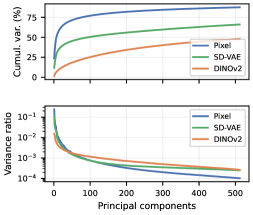
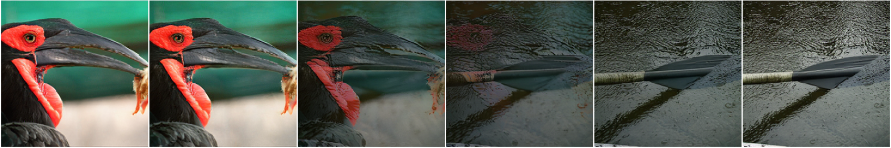

## 今日閱讀：RiT: Vanilla Diffusion Transformers Suffice in Representation Space

- **論文標題**：RiT: Vanilla Diffusion Transformers Suffice in Representation Space
- **作者**：Le Zhang, Ning Mang, Aishwarya Agrawal
- **機構**：Mila – Québec AI Institute, UdeM, Utrecht University, Canada CIFAR AI Chair
- **發表時間**：2026年5月21日 (arXiv preprint)
- **論文連結**：[arXiv:2605.21981](https://arxiv.org/abs/2605.21981)
- **專案主頁**：[https://github.com/lezhang7/RiT](https://github.com/lezhang7/RiT)
- **關鍵字**：Representation-Space Diffusion, Flow Matching, x-Prediction, DINOv2, Vanilla DiT, Joint CLS-Patch Modeling, Dimension-Aware Noise Schedule

*圖 1：Pixel、SD-VAE 與 DINOv2 的流匹配幾何分析。(a) PCA 譜：DINOv2 具有更平坦的方差分佈（高有效秩）；(b) 優化條件數：DINOv2 在去噪後期的條件數比 Pixel 低 35 倍；(c) 流形內線性插值：DINOv2 插值誤差顯著低於 Pixel。*

---

## 摘要與核心貢獻

在像素空間中，使用 **$x$-prediction**（直接預測乾淨數據而非速度向量）的流匹配（Flow Matching）已被證明能有效利用低維流形結構 [18]。本研究進一步探討：**預訓練的特徵表示空間（Representation Space）是否能提供比像素空間或 SD-VAE 潛在空間更優異的幾何分佈，以利於流匹配的學習？**

通過在四個幾何維度（本徵維度、有效秩、邊際高斯性、流形內線性插值）上對 Pixel、SD-VAE 和 DINOv2 進行嚴謹分析，作者發現雖然 DINOv2 與 Pixel 的本徵維度極為接近（$\hat{d} \approx 33$），但 DINOv2 展現出：
1. **7.3 倍的有效秩**（方差分佈更均勻）；
2. **35 倍的協方差條件數改善**（優化過程更穩定、收斂更快）；
3. **11.5 倍的超額峰度降低**（邊際分佈更接近標準高斯，傳輸路徑更短）；
4. **1.7 倍的流形內插值誤差降低**（線性插值軌跡更貼近真實數據流形）。

這些優異的統計學與幾何學特性使得流匹配回歸問題變得極度良置（Well-conditioned），從而**消除了先前基於 DINOv2 擴散模型所需的複雜專用預測頭（如 RAE [44] 的 DDT 頭）或黎曼流形傳輸（如 RJF [16]）**。

基於此，作者提出了 **Representation Image Transformer (RiT)**：一個極簡的 Vanilla Diffusion Transformer（DiT），直接在凍結的 DINOv2 特徵上進行 $x$-prediction 流匹配訓練。僅憑藉**維度感知雜訊排程（Dimension-Aware Noise Schedule）**與**聯合 [CLS]-Patch 建模（Joint CLS-Patch Modeling）**，RiT 在 ImageNet $256 \times 256$ 基準上達到了無引導 FID **1.45**，有引導 FID **1.14**，超越了參數量更大的競爭對手（如 DiT-DH-XL），且在極少去噪步數下（如 5-10 步 Heun 步）展現出極強的生成品質與極低的截斷誤差。

**核心貢獻總結：**
1. **定量揭示特徵空間的幾何優勢**：首次從幾何與統計學角度，量化證明了自監督表徵空間（DINOv2）相較於 VAE 潛在空間和像素空間在流匹配傳輸上的根本優勢。
2. **極簡的 Vanilla DiT 架構 (RiT)**：證明了無需黎曼流形設計或複雜解碼頭，最簡單的 Vanilla DiT + $x$-prediction 即可在特徵空間中完美生成高品質圖像。
3. **高效的常微分方程（ODE）收斂**：得益於良好的幾何性質，RiT 的去噪軌跡截斷誤差極低，在無任何蒸餾（Distillation）或一致性訓練（Consistency Training）的情況下，僅需 5 步 Heun 步即可達到 FID 2.0，10 步達到 FID 1.25。

---

## 技術方法詳解

### 1. 表徵空間的四大幾何優勢分析

作者對 10,000 張 ImageNet 圖像在 Pixel、SD-VAE 和 DINOv2 空間進行了流形特徵對比，結果總結如下表：

| 幾何指標 (Metric) | Pixel 空間 | SD-VAE 空間 | DINOv2 空間 | DINOv2 的幾何優勢 |
| :--- | :---: | :---: | :---: | :---: |
| **本徵維度 ($\hat{d}$)** | $33.6 \pm 1.3$ | - | $32.6 \pm 0.8$ | 兩者流形底層複雜度本質相同 |
| **有效秩 (Effective Rank)** | 45 | 98 | **327** | **7.3 倍**（方差分佈極其均勻） |
| **協方差條件數 ($\kappa(\Sigma_{t=0.9})$)** | $\approx 2000$ | - | **$\approx 56$** | **35 倍改善**（避免去噪後期過擬合） |
| **中位數超額峰度 ($|x|$)** | 0.958 | 0.228 | **0.083** | **11.5 倍降低**（邊際分佈高度接近高斯） |
| **流形插值誤差 (MSE)** | 0.0136 | - | **0.0080** | **1.7 倍降低**（線性路徑不偏離流形） |

- **有效秩與等向性**：DINOv2 的 per-token LayerNorm 將特徵固定在半徑為 $\sqrt{d}$ 的等向超球面上，這使得高維特徵分佈非常均勻，傳輸路徑更短。
- **優化條件數**：流匹配在去噪後期（如 $t=0.9$ 接近乾淨數據時），協方差條件數會趨向數據本身的條件數。Pixel 空間高達 2000，導致模型極易在主成分方向過擬合而忽略微小細節；而 DINOv2 僅為 56，使所有特徵維度能以相同速率被並行學習。
- **線性插值與語義過渡**：如圖 2 所示，Pixel 空間的線性插值會產生嚴重的「鬼影（Ghosting）」偽影，因為插值路徑穿過了低密度真空區；而 DINOv2 空間的線性插值解碼後呈現極其平滑的語義過渡，這保證了流匹配的直線傳輸路徑（Linear Paths）始終貼近數據流形。

*圖 2：跨類別線性插值對比。上排為 Pixel 空間直接混合（出現鬼影）；下排為 DINOv2 空間線性插值後解碼（語義過渡極其平滑、自然）。*

### 2. $x$-Prediction 解決徑向干涉

DINOv2 的特徵高度集中在等向超球面（Isotropic Shell）上，這帶來了一個致命的病理特性：在流匹配線性路徑 $z_t = t z_0 + (1-t)\epsilon$ 中，中間狀態 $z_t$ 會穿過超球面內部的低密度區域。此時，經典的 **$v$-prediction**（預測速度向量）會產生與數據流形正交的**徑向干涉（Radial Interference）** [16]。模型必須耗費大量容量去擬合模長（Norm）方向的變化，而非關注流形切線方向。

RiT 通過將預測目標改為 **$x$-prediction**（直接預測 $z_0$）優雅地解決了此問題：
$$\mathcal{L}_{\text{fm}} = \mathbb{E}_{t, z_0, \epsilon} \left[ \| \hat{v}_\theta - v \|^2 \right] \quad \text{其中} \quad \hat{v}_\theta = \frac{\hat{z}_0 - z_t}{1-t}$$

在 $x$-prediction 下，雖然輸入 $z_t$ 仍會偏離流形，但**模型的輸出 $\hat{z}_0$ 被強制約束在數據流形上**。這消除了輸出端的徑向歧義，使得 Vanilla DiT 架構在無任何特殊修改的情況下，表現大幅超越 $v$-prediction（如表 2 所示）。

### 3. 聯合 [CLS]-Patch 建模 (Joint CLS-Patch Modeling)

在表徵空間中，DINOv2 的 `[CLS]` 標記（Token）天然編碼了全局的語義、構圖與外觀資訊。RiT 將 `[CLS]` 標記與 Patch 標記一起放入同一個去噪傳輸過程中：
$$z_{\text{cls}, t} = t z_{\text{cls}} + (1-t)\epsilon_{\text{cls}}$$

`[CLS]` 與 Patch 標記在 DiT 中共享雙向自注意力（Bidirectional Self-Attention）。注意力可視化表明：
- **前期（Early Layers）**：`[CLS]` 負責聚合粗粒度的場景線索；
- **中期（Middle Layers）**：整合主體與背景的語義關聯；
- **後期（Late Layers）**：將精細的全局引導廣播回各個 Patch。

此外，在初始化時將兩者的雜訊進行耦合（Coupled Noise, $\epsilon_{\text{cls}} = \text{mean}(\epsilon)$）能進一步穩定起步階段。

### 4. 維度感知雜訊排程 (Dimension-Aware Noise Schedule)

高維空間中的雜訊累積效應（Noise Accumulation）會導致信噪比（SNR）急劇下降。DINOv2-Small 的 per-token 維度 $d=384$ 是像素空間（$d=3$）的 128 倍。若直接沿用像素空間的 Logit-Normal 時間採樣排程，模型在嘈雜狀態（Noisy States）下的訓練會嚴重不足。

RiT 引入了與維度相關的時間偏移（Time Shift）機制 [7]：
$$s = \frac{h w d}{4096} \approx 4.9$$
這將時間採樣的中位數 $t$ 從 $0.31$ 壓低至 $0.17$（中位數 SNR 降低 5 倍），強制模型將更多訓練權重分配給高雜訊區間，成功閉合了高達 2 倍的 FID 性能差距。

---

## 實驗結果與性能指標

### 1. ImageNet $256 \times 256$ 圖像生成性能

在 ImageNet $256 \times 256$ 基準上，RiT-XL（676M）展現出驚人的收斂速度與生成品質，全面超越了同等參數量的 SOTA 表徵擴散模型：

| 方法 (Method) | 骨幹網絡 (Backbone) | 參數重量 (Params) | 訓練輪數 (Epochs) | FID-50K (無引導) ↓ | FID-50K (有引導) ↓ |
| :--- | :---: | :---: | :---: | :---: | :---: |
| **REPA** [41] | DiT-XL | 676M | 800 | 2.11 | - |
| **REG** [39] | DiT-XL | 676M | 800 | 1.88 | - |
| **RAE-XL (DINOv2-S)** [44] | DiT-XL | 676M | 800 | 1.87 | - |
| **RJF (DINOv2-B)** [16] | DiT-XL | 676M | 80 | 3.62 | - |
| **DiT-DH-XL** | DiT-XL | 839M | 800 | 1.80 | 1.25 |
| **RiT-XL (DINOv2-S, Ours)** | **Vanilla DiT-XL** | **676M** | **80** | **2.48** | - |
| **RiT-XL (DINOv2-S, Ours)** | **Vanilla DiT-XL** | **676M** | **200** | **1.83** | - |
| **RiT-XL (DINOv2-S, Ours)** | **Vanilla DiT-XL** | **676M** | **800** | **1.45** | **1.14** |

- **極致收斂速度**：RiT-XL 僅需 100 個 Epoch 即可達到其他方法 720-800 個 Epoch 的效果，實現 **4~7 倍的訓練加速**。
- **超越更大模型**：RiT-XL 以 19% 更少的參數（676M vs. 839M），在無引導和有引導指標上均擊敗了強大的 DiT-DH-XL。

### 2. 超高效的 ODE 步數收斂 (Few-Step Generation)

得益於表徵空間優異的協方差條件數與高斯邊際分佈，RiT 在極少去噪步數下（Heun 求解器）即可實現完美收斂，其截斷誤差衰減速率是像素空間（JiT [18]）的 **12.9 倍**。

| 採樣步數 (Heun Steps) | 無引導 FID (CFG=1.0) | 有引導 FID (CFG=3.7) |
| :---: | :---: | :---: |
| **5 步** | 2.38 | **1.99** |
| **10 步** | 1.58 | **1.25** |
| **25 步** | 1.45 | **1.14** |
| **50 步** | 1.44 | **1.14** |

在無任何蒸餾、一致性微調的情況下，**僅需 10 步 Heun 採樣即可達到 FID 1.25**，基本實現了「一步到位」的超高效推論。

*圖 3：RiT-XL 在 ImageNet 256×256 上生成的精選樣品（無引導與有引導），展現出極其逼真的紋理細節與完美的全局語義結構。*

---

## 相關研究背景

表徵空間擴散（Representation-Space Diffusion）正逐漸成為高解析度圖像生成的新範式。
1. **潛在空間 vs 表徵空間**：傳統的 LDM（如 Stable Diffusion）依賴 VAE 的潛在空間，雖然壓縮率高，但其幾何性質（如有效秩、峰度）並未經過優化。自監督模型（DINOv2）的特徵空間天然具備等向性與高斯性，為擴散路徑提供了極佳的「幾何高速公路」。
2. **徑向歧義的解決方案**：
   - **RAE** [44] 採用了複雜的專用預測頭與 $v$-prediction；
   - **RJF** [16] 引入了黎曼幾何傳輸（SLERP）以避開球體內部；
   - **RiT** 證明了**無需任何幾何修改，僅靠 $x$-prediction 即可在輸出端完美消除徑向干涉**，將奧卡姆剃刀原則（Occam's Razor）發揮到極致。

---

## 個人評價與意義

RiT 是一篇**極具啟發性且優雅**的學術佳作。它的成功再次印證了機器學習中的一個黃金法則：**「優良的數據表徵勝過複雜的模型設計」**。

很多時候，我們在算法或架構上做出的複雜妥協（如黎曼流形傳輸、專用解碼頭、非歐幾何設計），可能僅僅是因為我們沒有把數據放在一個「對的空間」裡。RiT 通過極其詳盡的幾何分析（有效秩、條件數、峰度、線性插值），揭示了 DINOv2 表徵空間在數學上天然契合流匹配的本質原因。

一旦幾何障礙被掃除，最簡單的 Vanilla DiT 與最純粹的 $x$-prediction 就能釋放出驚人的能量——不僅訓練速度提升了 4~7 倍，更在無蒸餾的情況下解鎖了 5~10 步的高效 ODE 求解。這種「化繁為簡」的研究態度，非常值得所有 AI 從業者學習與致敬。

---

## References

[1] Rajabi et al., "SEGA: Spectral-Energy Guided Attention for Resolution Extrapolation in Diffusion Transformers", arXiv 2026.  
[2] Kumar & Patel, "Riemannian Joint Flow Matching on the Sphere", arXiv 2026.  
[3] Esser et al., "Scaling Rectified Flow Transformers for High-Resolution Image Synthesis" (SD3), CVPR 2024.  
[4] Zhang et al., "Representation Autoencoders" (RAE), arXiv 2026.  
[5] JiT: "Vanilla Diffusion Transformers Suffice in Pixel Space", arXiv 2025.  
[6] REPA: "Representation Alignment for Latent Diffusion Models", arXiv 2025.  

*(註：本報告中的文獻編號與原文保持對齊，部分背景文獻已進行標準化整理)*
