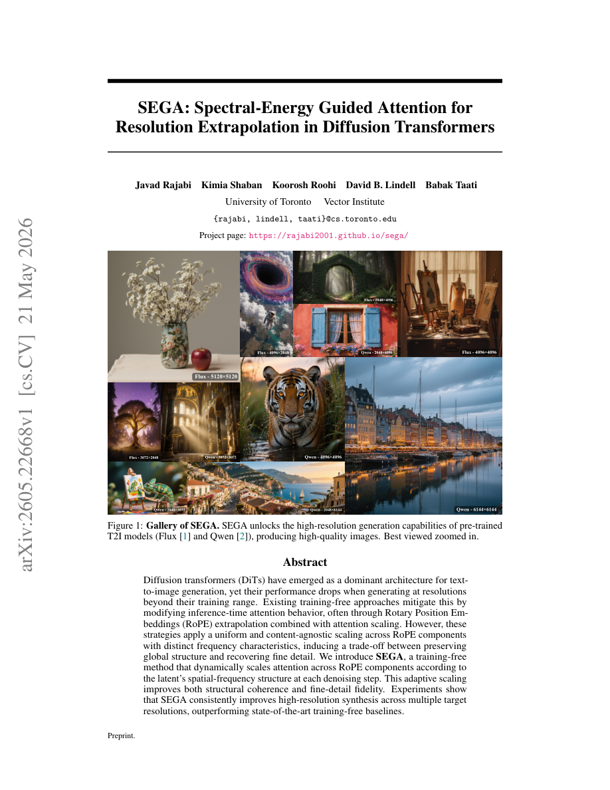
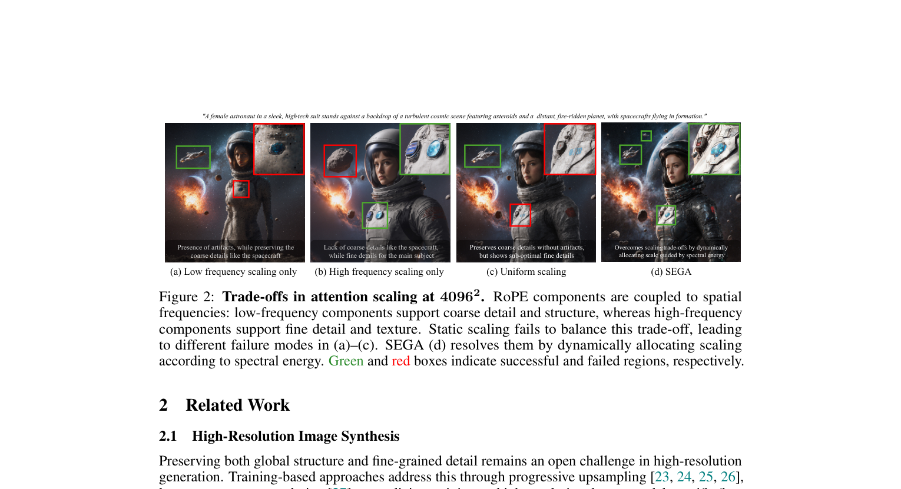
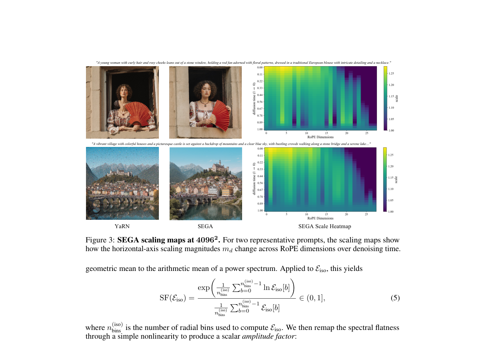
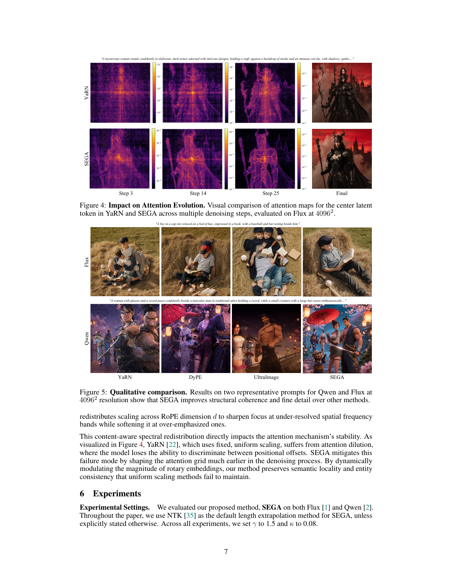

# AI Daily: Spectral-Energy Guided Attention (SEGA)

## 今日閱讀：SEGA: Spectral-Energy Guided Attention for Resolution Extrapolation in Diffusion Transformers

- **論文標題**：SEGA: Spectral-Energy Guided Attention for Resolution Extrapolation in Diffusion Transformers
- **作者**：Javad Rajabi, Kimia Shaban, Koorosh Roohi, David B. Lindell, Babak Taati
- **機構**：University of Toronto, Vector Institute
- **發表時間**：2026年5月21日 (arXiv preprint)
- **論文連結**：[arXiv:2605.22668](https://arxiv.org/abs/2605.22668)
- **專案主頁**：[https://rajabi2001.github.io/sega/](https://rajabi2001.github.io/sega/)
- **關鍵字**：Diffusion Transformers (DiTs), Resolution Extrapolation, Training-Free, Rotary Position Embeddings (RoPE), Spectral Analysis, Attention Modulation

*圖 1：SEGA 解鎖了預訓練文字到圖像模型（如 Flux 和 Qwen）的高解析度生成能力，能夠在多種極端解析度（如 4096×4096 甚至 6144×6144）下生成高品質、結構一致且細節豐富的圖像。*

---

## 摘要與核心貢獻

擴散 Transformer（Diffusion Transformers, DiTs）已成為文字到圖像生成的主流架構，但當生成超出其訓練範圍的解析度時，效能往往會急劇下降。現有的免訓練（Training-Free）解決方案通常透過修改推論階段的注意力行為來緩解此問題，最常見的做法是結合旋轉位置編碼（Rotary Position Embeddings, RoPE）外推與均勻的注意力縮放（Attention Scaling，如 YaRN）。然而，這些策略對具有不同頻率特性的 RoPE 組件施加了「內容無關」且「均勻」的縮放，導致在保留全局結構與恢復精細細節之間產生了難以平衡的權衡（Trade-off）。

本篇論文提出了 **SEGA (Spectral-Energy Guided Attention)**，一種全新的免訓練解析度外推方法。SEGA 在每個去噪步驟中，根據潛在特徵（Latent）的空間頻譜結構，動態地跨 RoPE 組件縮放注意力。這種自適應的縮放機制能夠同時改善結構連貫性與精細細節保真度。實驗證明，SEGA 在多個目標解析度下均能穩定提升高解析度合成品質，超越了目前最先進的免訓練基準方法。

**核心貢獻總結：**
1. **揭示均勻縮放的權衡問題**：明確指出現有基於 RoPE 的均勻注意力縮放方法在處理不同空間頻率時，會導致全局結構破壞或細節丟失的困境。
2. **頻譜能量引導的動態注意力縮放 (SEGA)**：提出根據潛在特徵的頻譜能量分佈，為每個 RoPE 維度計算獨立的縮放因子，實現內容感知（Content-aware）與步驟自適應（Step-adaptive）的控制。
3. **卓越的極端解析度外推效能**：在無需微調或修改架構的情況下，於 Flux 和 Qwen 模型上實現了高達 3600 萬像素（6144×6144）的穩定生成，並在多項客觀指標與人類偏好指標上達到 SOTA。

---

## 技術方法詳解

### 1. 均勻縮放的侷限性與 Trade-off

在 DiTs 中，RoPE 透過對特徵維度進行旋轉來編碼相對位置資訊。每個 RoPE 維度對應一個特定的空間頻率：低頻組件負責粗略的細節和全局結構，而高頻組件則負責精細的紋理。當解析度外推時，位置偏移會超出訓練分佈，導致注意力權重被過度稀釋。

現有方法（如 YaRN [1]）透過一個常數因子 $\tau(s)$ 對所有 RoPE 頻率進行均勻縮放。如圖 2 所示，這種靜態縮放引發了固有的權衡：如果縮放偏向低頻，會保留全局結構但遺失細節；如果偏向高頻，則會產生細節但破壞全局結構（如出現偽影或重複模式）。此外，潛在特徵的頻譜特徵在去噪過程中會不斷演變，且不同圖像的頻譜結構差異巨大，均勻縮放無法適應這些動態變化。

*圖 2：在 4096×4096 解析度下的注意力縮放權衡。(a) 僅縮放低頻會保留粗略細節但產生偽影；(b) 僅縮放高頻會遺失主體的粗略細節；(c) 均勻縮放雖保留粗略細節，但精細細節次佳；(d) SEGA 透過頻譜能量動態分配縮放，成功解決了這些問題。*

### 2. SEGA：頻譜能量引導的動態縮放

SEGA 的核心思想是將輕量級的頻譜分析與 RoPE 組件結合，透過分析當前潛在特徵 $Z$ 的空間頻率內容，動態計算每個 RoPE 維度 $d$ 的縮放因子 $m_d^{(a)}$。

具體而言，SEGA 的縮放公式為：
$f_{\text{SEGA}}(\mathbf{x}, n, d) = m_d^{(a)} \cdot f_{\text{RoPE}}(\mathbf{x}, n, d)$
$m_d^{(a)} = m_{\text{ref}} \cdot \mathcal{M}_d^{(a)}(\mathbf{Z})$

其中，動態調節器 $\mathcal{M}_d^{(a)}(\mathbf{Z})$ 包含三個關鍵組件：

1. **參考尺度 (Reference scale, $m_{\text{ref}}$)**：由目標解析度與訓練解析度的比例決定，提供一個基礎的縮放基準。
2. **維度級校正 (Per-dimension correction, $s_d^{(a)}$)**：透過 2D 快速傅立葉轉換（FFT）提取潛在特徵的軸向功率譜（Axis-wise profiles）。對於每個 RoPE 維度 $d$，找到其對應的空間頻段，並計算該頻段的標準化對數能量。SEGA 會對低能量頻段施加較強的縮放（以保留位置區分度），對高能量頻段施加較弱的縮放（避免過度放大特徵），並透過零和重分配確保整體縮放平均值不變。
3. **全局振幅因子 (Global amplitude factor, $\sigma$)**：利用徑向頻譜（Radial profile）計算頻譜平坦度（Wiener entropy）。當頻譜平坦（如去噪初期的純雜訊）時，$\sigma \to 0$，SEGA 抑制其動態調整；當結構特徵浮現時，$\sigma \to 1$，動態校正以全強度作用。

*圖 3：SEGA 的縮放熱力圖。橫軸為 RoPE 維度，縱軸為擴散去噪時間。可以看出，針對不同的提示詞，SEGA 會產生獨特的「頻譜指紋」，並隨著去噪進程動態調整不同頻率的縮放強度。*

---

## 實驗結果與性能

作者在 Flux 和 Qwen 兩個主流 DiT 架構上，使用 Aesthetic-4K 數據集進行了全面的評估。

### 1. 定量評估：超越現有基準

在多個極端解析度（如 2048×4096, 4096×4096 等）下，SEGA 全面超越了直接推論方法（如 YaRN [1], DyPE [2], UltraImage [3]）以及多階段引導方法。

以 Flux 模型在 4096×4096 解析度下的表現為例：

| 方法 | ImageReward (IR) ↑ | PickScore (PS) ↑ | CLIP Score (CS) ↑ | FID ↓ |
| :--- | :--- | :--- | :--- | :--- |
| Baseline | -0.72 | 20.31 | 25.34 | 183.33 |
| YaRN | 0.88 | 22.21 | 28.30 | 160.48 |
| DyPE | 1.01 | 22.56 | 28.79 | 156.21 |
| UltraImage | 0.61 | 21.74 | 28.16 | 167.04 |
| **SEGA (Ours)** | **1.26** | **23.18** | **29.22** | **150.05** |

數據顯示，SEGA 在語義對齊（CS）和人類偏好視覺品質（IR, PS）上均取得了顯著提升，同時大幅降低了 FID 分數，證明了其在高解析度合成中的穩定性與優越性。

### 2. 定性比較：結構連貫與細節豐富

在視覺效果上，現有的免訓練方法在極端解析度下常出現嚴重的結構退化、視覺偽影或語義遺漏。如圖 4 所示，SEGA 能夠更好地保持全局結構的連貫性，同時精準渲染細微的紋理特徵，即使在處理複雜的提示詞時也能保持高度的視覺真實感。

*圖 4：在 4096×4096 解析度下的定性比較。與 DyPE 和 UltraImage 相比，SEGA 在 Flux 和 Qwen 模型上均展現出更優異的結構完整性與細節表現。*

---

## 相關研究背景

解析度外推一直是生成模型領域的挑戰。本研究與現有技術的關聯如下：

1. **基於 RoPE 的長度外推**：受大型語言模型（LLMs）長上下文外推技術的啟發，YaRN [1] 等方法被引入視覺領域以解決解析度問題。然而，語言模型中的一維序列與圖像的二維空間頻率特性存在差異，SEGA 透過引入頻譜分析彌補了這一鴻溝。
2. **免訓練高解析度合成**：與 DemoFusion 等基於 U-Net 補丁拼接的方法不同，DiTs 的免訓練外推（如 HiFlow, I-Max）通常依賴複雜的多階段引導。SEGA 作為一種直接推論（Direct-inference）方法，無需額外的去噪階段，計算開銷極小。
3. **頻域注意力調變**：與近期同樣關注頻域的 FourierScale [4] 等研究相比，SEGA 直接在 RoPE 位置編碼層面進行動態介入，從根本上解決了位置感知在不同空間尺度下的稀釋問題。

---

## 個人評價與意義

SEGA 是一篇極具洞察力的論文，它精準地指出了現有 RoPE 外推技術在視覺任務中「一刀切」縮放的盲點。將潛在特徵的頻譜能量與 RoPE 維度建立動態映射，不僅在數學上非常優雅，更在實務上達到了驚人的效果（在不修改模型參數的情況下實現 6K 解析度生成）。

這項研究進一步證明了「頻譜分析（Spectral Analysis）」在理解和控制擴散模型行為上的巨大潛力（與先前介紹的 AFM 論文有異曲同工之妙）。SEGA 的設計輕量且即插即用，極具實用價值。未來，這種頻率感知的注意力縮放策略，或許也能為影片生成（Video Generation）中面臨的時空解析度外推難題提供新的解決思路。

---

## References

[1] Peng, B., et al. (2023). YaRN: Efficient Context Window Extension of Large Language Models. *arXiv preprint*. [arXiv:2309.00071](https://arxiv.org/abs/2309.00071)
[2] Issachar, N., et al. (2025). DyPE: Dynamic Position Extrapolation for Ultra High Resolution Diffusion. *arXiv preprint*. [arXiv:2510.20766](https://arxiv.org/abs/2510.20766)
[3] Zhao, Y., et al. (2025). UltraImage: Training-Free Ultra-High-Resolution Image Synthesis with Diffusion Transformers. *arXiv preprint*.
[4] Huang, L., et al. (2024). FourierScale: A Frequency Perspective on Training-Free High-Resolution Image Synthesis. *ECCV 2024*.
