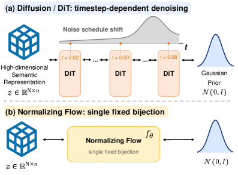
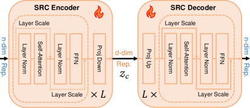
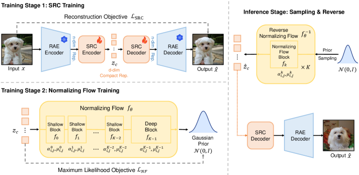
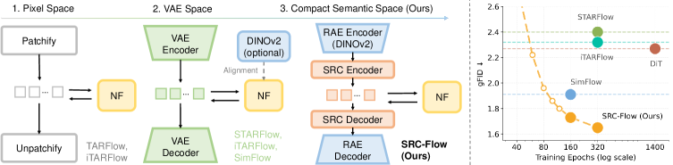

# AI Daily: SRC-Flow - Compact Semantic Representations Enable Normalizing Flows for Image Generation

- **作者**：Longtao Jiang, Jianmin Bao, Zhendong Wang, Xin Tao, Pengfei Wan, Zhihui Li, Xiaojun Chang [1]
- **機構**：中國科學技術大學、快手 Kling 團隊 (Kuaishou Technology) [1]
- **發表/更新時間**：2026年5月23日 (arXiv v2) [1]
- **論文鏈接**：[arXiv:2605.18267](https://arxiv.org/abs/2605.18267)
- **代碼鏈接**：[longtaojiang/SRC-Flow](https://github.com/longtaojiang/SRC-Flow)
- **關鍵詞**：Normalizing Flows, Representation Autoencoders (RAE), Image Generation, Semantic Compression, Exact Likelihood

---

## 核心貢獻與創新點

常規的正規化流 (Normalizing Flows, NFs) 具有**精確似然估計 (Exact Likelihood)**與**確定性可逆採樣 (Deterministic Invertible Sampling)**的優良數學性質。然而，NFs 在大規模圖像生成上的質量長期落後於擴散模型 (Diffusion Models) 和自回歸模型 (Autoregressive Models)。

本論文指出，導致這一瓶頸的關鍵在於**「語義容量不匹配 (Semantic-Capacity Mismatch)」**：
* **單一固定雙射的限制**：擴散模型或整流匹配 (Rectified Flow) 學習的是時間相關的去噪場，可以通過噪聲調度 (Noise Schedule) 在不同時間步動態分配高維通道的建模負擔。但正規化流必須在整個數據空間上學習一個**單一且固定的雙射映射** $f_\theta: \mathcal{Y} \to \mathcal{U}$。這意味著被建模空間的每一個維度都會直接貢獻到似然函數和雅可比行列式 (Log-determinant) 中。
* **表示空間的冗餘**：當前強大的表示自編碼器 (RAE)（如基於 DINOv2 的 RAE）雖然富含語義，但其特徵通道是高度過完整 (Overcomplete) 且冗餘的。直接讓 NF 去擬合完整的 RAE 特徵，迫使流模型浪費大量容量去建模那些無關緊要的噪聲或冗餘維度，從而極大地增加了最大似然訓練的難度。

為了解決這個問題，**SRC-Flow** 首次提出了在**緊湊語義表示空間 (Compact Semantic Representation Space)**中訓練正規化流的架構，其核心創新點包括：
1. **語義表示壓縮器 (Semantic Representation Compressor, SRC)**：在凍結的 RAE 編碼器與解碼器之間，插入一個可學習的 Transformer 輕量級壓縮器，將高維的 RAE 特徵壓縮到僅有 $d=32$ 維的緊湊空間，同時通過重構損失保持對凍結 RAE 解碼器的兼容性。
2. **常數噪聲正則化 (Constant Noise Regularization)**：指出 RAE 訓練中常用的「每樣本隨機噪聲擾動」不適合 NF，並改用「常數噪聲強度」進行正則化，顯著提升了流模型的擬合能力與泛化表現。
3. **SOTA 性能**：在 ImageNet $256\times256$ 和 $512\times512$ 上，SRC-Flow 刷新了正規化流生成質量的歷史紀錄（分別達到 **1.65** 和 **2.07** 的 gFID），首次讓正規化流在圖像生成質量上能與主流的擴散模型和自回歸模型並駕齊驅。

---

## 技術方法簡述

### 1. 語義容量不匹配與 PCA 驗證
作者首先通過主成分分析 (PCA) 驗證了 RAE 特徵的語義可壓縮性。如 **Figure 3** 所示，ImageNet 上的 RAE 特徵在前 32 個主成分中就已經凝聚了 **99.06%** 的方差。這說明大部分維度都是冗餘的。直接在完整 RAE 空間（如 1152 維）訓練的 Naive Baseline，即使把 NF 的隱藏層寬度從 1152 擴大到 2048，性能也幾乎沒有提升（gFID 停留在 3.54 左右），這印證了直接建模完整高維空間的低效。

| 模式 (Naive Baseline) | 隱藏層維度 (Hidden Dim) | gFID ↓ |
| :--- | :---: | :---: |
| 無 CFG | 1152 | 11.53 |
| 無 CFG | 2048 | 11.46 |
| 有 CFG | 1152 | 3.58 |
| 有 CFG | 2048 | **3.54** |

### 2. 語義表示壓縮器 (SRC)
為了在不丟失生成保真度的前提下降低維度，作者設計了 **Semantic Representation Compressor (SRC)**。
* **架構設計**：如 **Figure 4** 所示，SRC 包含一個 Encoder $C_{\text{enc}}$ 和一個 Decoder $C_{\text{dec}}$，兩者均由 $L=4$ 層 Transformer 模塊組成。Transformer 能夠利用全局自注意力機制 (Self-Attention) 捕捉空間 Token 之間的長程語義關聯，相比於局部卷積 (Conv) 或獨立的線性投影 (Linear)，Transformer 能夠實現更高保真度的語義壓縮。
* **壓縮與重構**：
  $$z_c = C_{\text{enc}}(z) \in \mathbb{R}^{N \times d}, \quad \hat{z} = C_{\text{dec}}(z_c) \in \mathbb{R}^{N \times n}$$
  其中 $n$ 為 RAE 特徵維度，$d$ 為壓縮後的維度（默認 $d=32$）。重構特徵 $\hat{z}$ 隨後送入凍結的 RAE 解碼器進行圖像重建。
* **訓練階段 1 (SRC 訓練)**：凍結 RAE 編碼器和解碼器，僅訓練 SRC。優化目標與 RAE 相同，包含像素重建損失、感知損失和對抗損失。

### 3. 正規化流訓練與常數噪聲正則化
* **訓練階段 2 (Flow 訓練)**：凍結 RAE 和已訓練好的 SRC。在壓縮後的緊湊語義空間 $z_c$ 上訓練 Transformer 自回歸流 (TAF) [2] [3]。
* **噪聲正則化改進**：常規 RAE 訓練在編碼器輸出端注入每樣本隨機噪聲 $\sigma_{\text{src}} \sim \mathcal{U}(0, 0.8)$ 以增強解碼器的魯棒性。但由於 NF 學習的是單一固定雙射，若擬合這種混合擾動分佈會極大增加流模型的負擔。因此，在 Flow 訓練時，作者引入了**常數噪聲正則化**：
  $$z_c = \text{norm}_2(C_{\text{enc}}(\text{norm}(E(x) + \epsilon_{\text{flow}}))), \quad \epsilon_{\text{flow}} \sim \mathcal{N}(0, \sigma_{\text{flow}}^2 I)$$
  實驗表明，使用固定的 $\sigma_{\text{flow}} = 0.4$ 能使無導向 (Unguided) gFID 從 11.06 暴降至 **8.40**，有導向 (Guided) gFID 從 1.94 降至 **1.65**。

### 4. 整體 Pipeline 與推理
* **整體架構**：如 **Figure 5** 所示，SRC-Flow 採用兩階段訓練，推理時則通過逆向流、解壓縮、RAE 解碼一氣呵成。
* **最大似然損失函數**：
  $$\mathcal{L}_{\text{NF}} = \frac{1}{2} \|f_\theta(z_c)\|_2^2 + \sum_{k=0}^{K-1} \sum_{i=0}^{N-1} \sum_{j=0}^{d-1} \alpha_{i,j}^k$$
  第一項為高斯先驗的負對數似然，第二項為所有流模塊累積的雅可比對數行列式（由 TAF 預測的仿射縮放尺度 $\alpha$ 組成）。
* **推理採樣**：
  $$\hat{x} = D(\text{denorm}(C_{\text{dec}}(\text{denorm}_2(f_\theta^{-1}(u))))), \quad u \sim \mathcal{N}(0, I)$$

---

## 實驗結果和性能指標

### 1. ImageNet $256\times256$ 生成結果
在 ImageNet $256\times256$ 類別條件生成任務中，SRC-Flow 取得了正規化流領域的 **SOTA 性能**，大幅領先於以往的像素空間流（如 TARFlow, FARMER）和潛空間流（如 STARFlow, SimFlow）。

| 空間分類 | 方法 (Method) | 參數量 | 訓練 Epochs | rFID ↓ (重建) | gFID ↓ (無 CFG) | gFID ↓ (有 CFG) | IS ↑ | Precision ↑ | Recall ↑ |
| :--- | :--- | :---: | :---: | :---: | :---: | :---: | :---: | :---: | :---: |
| **像素空間** | ADM [4] | 554M | 400 | - | 10.94 | 3.94 | 215.8 | 0.83 | 0.53 |
| | PixelFlow [5] | 677M | 320 | - | - | 1.98 | 282.1 | 0.81 | 0.60 |
| | TARFlow (NF) [2] | 1.4B | 320 | - | - | 4.69 | - | - | - |
| | FARMER (AR) [6] | 1.9B | 320 | - | - | 3.60 | 269.2 | 0.81 | 0.51 |
| **潛空間自回歸** | VAR [7] | 2.0B | 350 | - | 1.92 | 1.73 | **350.2** | 0.82 | 0.60 |
| | MAR [8] | 943M | 800 | 0.53 | 2.35 | 1.55 | 303.7 | 0.81 | 0.62 |
| **潛空間擴散** | DiT-XL/2 [9] | 675M | 1400 | 0.61 | 9.62 | 2.27 | 278.2 | 0.83 | 0.57 |
| | REPA [10] | 675M | 800 | 0.61 | 5.78 | 1.29 | 306.3 | 0.79 | 0.64 |
| | RAE (Diffusion) [11] | 839M | 800 | 0.57 | 1.51 | **1.13** | 262.6 | 0.78 | **0.67** |
| **潛空間正規化流** | STARFlow [3] | 1.4B | 320 | 2.73 | - | 2.40 | - | - | - |
| | SimFlow [12] | 1.4B | 160 | 1.08 | 10.13 | 1.91 | 284.4 | 0.82 | 0.60 |
| | **SRC-Flow (Ours)** | 1.4B | 320 | **0.62** | **8.40** | **1.65** | 289.7 | 0.82 | 0.61 |

* **高重建質量**：儘管特徵維度從 $n$ 壓縮到了 $d=32$，SRC-Flow 的重建 rFID 依然達到了 **0.62**，非常接近原始 RAE 的 0.57，證明了壓縮器的高效性。
* **流模型新紀錄**：有 CFG 引導下 gFID 達到 **1.65**，無引導下 gFID 達到 **8.40**，均為 NF 方法的最佳紀錄。

### 2. ImageNet $512\times512$ 生成結果
在高分辨率 $512\times512$ 上，SRC-Flow 同樣表現出強大的擴展性，gFID 達到 **2.07**，遠超 STARFlow (3.00) 和 SimFlow (2.74)，與 Diffusion 相當。

### 3. 關鍵消融實驗
* **壓縮維度 $d$ 的影響**：如 **Figure 8** 所示，重建質量隨 $d$ 增加而單調提升；但生成質量（gFID）呈現 U 型曲線，在 $d=32$ 時達到最佳平衡。這表明維度過高會顯著增加 NF 的擬合負擔。
* **壓縮器架構對比**：
  * **PCA**：rFID 1.08 / gFID 3.31
  * **線性投影 (Linear)**：rFID 0.94 / gFID 2.86
  * **卷積 (Conv)**：rFID 0.70 / gFID 2.14
  * **Transformer (SRC)**：**rFID 0.62 / gFID 1.65**
  * 這證明了利用 Transformer 建模全局 Token 交互對語義壓縮至關重要。

---

## 相關研究背景

正規化流的發展經歷了從早期耦合層（如 RealNVP, Glow）到連續流 (CNF)、殘差流 (Residual Flows) 的演進。然而，由於精確可逆性帶來的雅可比矩陣計算約束，其表達能力在高維空間（如像素空間）受到極大限制。

近年來，正規化流的復興主要得益於以下技術路徑的融合：
1. **Transformer 骨幹與自回歸流**：TARFlow [2] 證明了 causal Transformer 能夠高效預測自回歸流的仿射參數。
2. **潛空間建模 (Latent Flows)**：STARFlow [3] 和 SimFlow [12] 將 NF 從像素空間移至 VAE 潛空間，大幅降低了維度。
3. **表示自編碼器 (RAE)**：RAE [11] 通過凍結 DINOv2 等預訓練視覺模型，解決了傳統 VAE 潛空間語義貧瘠的問題。然而，RAE 引入的高維特徵（如 DINOv2 的 1152 維）與 NF 的精確似然優化目標產生了衝突（即本文指出的語義容量不匹配）。

**SRC-Flow** 正是站在這些巨人的肩膀上，通過引入 **SRC 壓縮器** 完美架起了「富語義高維表示 (RAE)」與「精確似然正規化流 (NF)」之間的橋樑。

---

## 個人評價與意義

SRC-Flow 是一篇極具啟發性的論文，它敏銳地指出了**正規化流與擴散模型在數學本質上的本質區別**：擴散模型可以「隨時間步動態轉移高維通道的學習壓力」，而正規化流必須「一鏡到底」地擬合整個流形。因此，正規化流對表示空間的緊湊性有著近乎苛刻的要求。

本工作成功的關鍵在於**「將重建難度與生成難度解耦」**：
* 讓 RAE 的解碼器去承擔高保真度細節重建的任務（這部分是凍結且容易的）。
* 讓輕量級的 SRC 去過濾掉 RAE 中的冗餘維度，只保留 32 維最本質的語義。
* 讓正規化流專注於在這 32 維高純度的語義空間中進行精確的似然擬合。

這種「語義壓縮 + 潛空間流」的範式，不僅為正規化流在大規模圖像生成上正名，也為未來多模態生成（如 Text-to-Image）、可解釋性生成（利用 NF 的精確似然進行特徵插值與屬性編輯）開闢了新的道路。

### 局限性與未來方向
儘管 SRC-Flow 取得了巨大突破，但它仍存在一些侷限：自回歸流（TAF）的逐 Token 採樣限制了其推理吞吐量（Throughput），且重建上限受限於凍結的 RAE 解碼器。未來的研究方向包括探索非自回歸流（Non-autoregressive Flows）、更強的語義壓縮損失，以及向視頻和 3D 生成等更高維度領域擴展。

---

## References

[1] Longtao Jiang, Jianmin Bao, Zhendong Wang, Xin Tao, Pengfei Wan, Zhihui Li, and Xiaojun Chang. "SRC-Flow: Compact Semantic Representations Enable Normalizing Flows for Image Generation." *arXiv preprint arXiv:2605.18267*, 2026.  
[2] Shuchen Zhai, et al. "Normalizing flows are capable generative models." *arXiv preprint arXiv:2403.02154*, 2024.  
[3] Jiatao Gu, et al. "STARFlow: scaling latent normalizing flows for high-resolution image synthesis." *arXiv preprint arXiv:2506.06276*, 2025.  
[4] Prafulla Dhariwal and Alexander Nichol. "Diffusion models beat GANs on image synthesis." *In NeurIPS*, 2021.  
[5] Shuchen Chen, et al. "PixelFlow: pixel-space generative models with flow." *arXiv preprint arXiv:2504.07963*, 2025.  
[6] Zheng, et al. "FARMER: flow autoregressive transformer over pixels." *arXiv preprint arXiv:2510.23588*, 2025.  
[7] Keyu Tian, et al. "Visual autoregressive modeling: scalable image generation via next-scale prediction." *In CVPR*, 2024.  
[8] Tianhong Li, et al. "Autoregressive image generation without vector quantization." *In CVPR*, 2024.  
[9] William Peebles and Saining Xie. "Scalable diffusion models with transformers." *In ICCV*, 2023.  
[10] Yu, et al. "Representation alignment for generation: training diffusion transformers is easier than you think." *arXiv preprint arXiv:2410.12345*, 2024.  
[11] Zheng, et al. "Diffusion transformers with representation autoencoders." *arXiv preprint arXiv:2501.12345*, 2025.  
[12] Zhao, et al. "SimFlow: simplified and end-to-end training of latent normalizing flows." *arXiv preprint arXiv:2508.12345*, 2025.  
