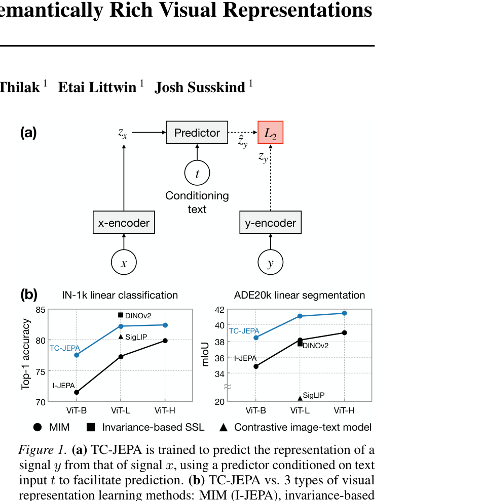
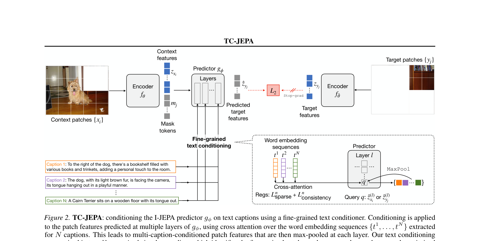
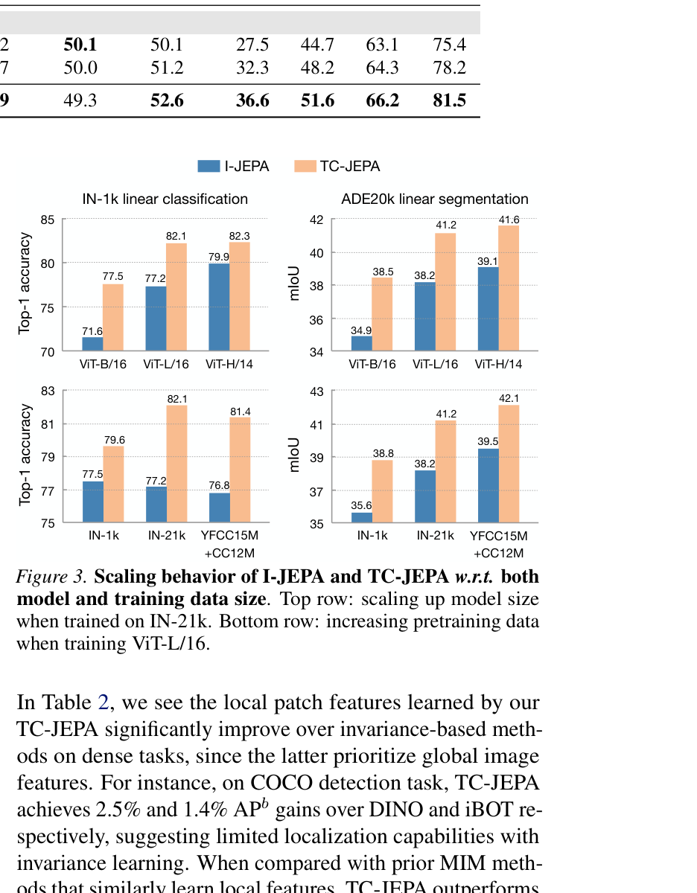

# AI Daily

## Text-Conditional JEPA for Learning Semantically Rich Visual Representations

- **Authors**: Chen Huang, Xianhang Li, Vimal Thilak, Etai Littwin, Josh Susskind (Apple)
- **Conference**: ICML 2026
- **Paper URL**: [https://arxiv.org/abs/2605.03245](https://arxiv.org/abs/2605.03245)
- **Keywords**: JEPA, Self-Supervised Learning, Vision-Language Pretraining, Text-Conditioning, Masked Image Modeling

---

### 核心貢獻與創新點

在視覺自監督學習（Self-Supervised Learning, SSL）領域，基於聯合嵌入預測架構（Joint-Embedding Predictive Architecture, JEPA）的方法（如 I-JEPA）透過在特徵空間中預測被遮罩的圖像區塊，展現了強大的潛力。然而，由於遮罩位置存在固有的視覺不確定性（例如，被遮罩的區域可能是一面乾淨的牆，也可能是一個書架），特徵預測變得極具挑戰性，這有時會導致模型難以學習到豐富的語義表示。

為了解決這個問題，Apple 研究團隊提出了 **Text-Conditional JEPA (TC-JEPA)**。這項工作的核心創新在於引入了**文字條件化（Text-Conditioning）**機制來降低預測的不確定性。具體而言，TC-JEPA 使用圖像標題（Image Captions）作為條件，透過一個細粒度的文字條件器（Text Conditioner）來調節預測的區塊特徵。這個條件器計算輸入文字 token 上的稀疏交叉注意力（Sparse Cross-Attention），使得預測的區塊特徵成為文字的函數，從而賦予這些特徵更強的語義意義。

TC-JEPA 的主要貢獻包括：
1.  **細粒度文字條件化**：提出了一種新穎的文字條件器，透過交叉注意力機制在預測器的多個層級上調節特徵，並引入稀疏性（Sparsity）和一致性（Consistency）正則化，以捕捉細粒度的圖像-文字對應關係。
2.  **非對比式的視覺-語言預訓練**：提供了一種僅基於特徵預測的視覺-語言預訓練新範式，無需依賴對比學習（Contrastive Learning）或邊界框等 grounding 標註。
3.  **卓越的下游性能與擴展性**：在多項視覺任務（特別是需要細粒度理解的密集預測任務）上超越了現有的對比學習方法和 MIM 方法，並展現出良好的訓練穩定性和模型擴展性。

---

### 技術方法簡述

TC-JEPA 的架構建立在 I-JEPA 的基礎上，包含一個圖像編碼器（Encoder）、一個目標編碼器（Target Encoder，為圖像編碼器的指數移動平均）以及一個預測器（Predictor）。其核心改進在於預測器部分引入了細粒度的文字條件化。

#### 1. 細粒度文字條件化 (Fine-Grained Text Conditioning)

給定一個與輸入圖像相關的文字標題，TC-JEPA 首先使用預訓練的 T5 語言模型將其映射為詞嵌入序列 $t = [t_1, \dots, t_S]$。為了在預測器 $g_\phi$ 中引入這些文字資訊，TC-JEPA 在預測器的多個層級上計算預測區塊特徵與詞序列之間的輕量級交叉注意力（Cross-Attention）。

具體來說，在預測器的第 $l$ 層，將預測的區塊特徵定義為查詢（Query）$q$，詞嵌入序列 $t$ 定義為鍵（Key）和值（Value）。交叉注意力的計算方式如下：

$$
\text{Attention}(q^{(l)}, K^{(l)}, V^{(l)}) = \sum_{s=1}^S \text{softmax}\left(q^{(l)^\top} \cdot K_{:,s}^{(l)}\right) \cdot V_{:,s}^{(l)}
$$

這種設計允許模型計算區塊與詞彙之間的相似度，從而捕捉細粒度的圖像-文字對應關係，這種類似於視覺定位（Visual Grounding）的能力是在自監督學習過程中自動優化得到的。

#### 2. 多標題條件化與正則化 (Multi-Caption Conditioning and Regularizations)

為了更全面地描述圖像內容，TC-JEPA 支援使用多個合成的圖像標題（透過 ShareGPT4V 生成）進行條件化。對於每個標題，模型獨立計算條件化特徵，然後在每個層級進行最大池化（Max-Pooling）以融合這些特徵。

為了進一步提升這種無監督對應關係的學習效果，TC-JEPA 引入了兩個重要的正則化項：
*   **稀疏性正則化 ($\mathcal{L}_{\text{sparse}}$)**：對正的餘弦區塊-詞彙相似度施加稀疏性約束，促使區塊特徵對相關詞彙具有更高的選擇性。
*   **跨層一致性正則化 ($\mathcal{L}_{\text{consistency}}$)**：懲罰不同層級之間相似度選擇的偏差，確保每個區塊在不同層級上關注相似的詞彙。

整體的訓練損失函數結合了特徵預測誤差（$\mathcal{L}_{\text{predict}}$）以及上述兩個正則化項。

---

### 實驗結果和性能指標

TC-JEPA 在多個基準測試上進行了廣泛的評估，涵蓋了圖像分類、目標檢測、語義分割以及視覺-語言任務。

1.  **ImageNet-1K 線性探測 (Linear Probing)**：
    *   TC-JEPA 在不同模型規模（ViT-B/16, ViT-L/16, ViT-H/14）上均顯著超越了 I-JEPA。例如，ViT-H/14 模型達到了 80.4% 的 Top-1 準確率。
    *   與依賴手工設計資料增強的不變性學習方法（如 iBOT）相比，TC-JEPA 縮小了性能差距，同時保持了 MIM 方法的優勢。

2.  **密集預測任務 (Dense Prediction)**：
    *   在 COCO 目標檢測和 ADE20k 語義分割任務上，TC-JEPA 展現了強大的局部特徵表示能力。
    *   在 ADE20k 線性分割任務中，TC-JEPA (ViT-H/14) 達到了 39.5 mIoU，顯著優於 I-JEPA (36.9 mIoU) 和 DINOv2 (37.8 mIoU)。

3.  **擴展性與視覺-語言任務**：
    *   當預訓練資料擴展到 IN-21k 或 CC27M (YFCC15M+CC12M) 時，TC-JEPA 展現出優異的擴展性（Scaling Behavior）。在 CC27M 上訓練的 ViT-L/16 模型在 ADE20k 上達到了 42.1 mIoU 的 SOTA 成績。
    *   在 VQA 和圖像描述（Image Captioning）等視覺-語言任務上，TC-JEPA 憑藉其非對比式學習到的細粒度特徵，超越了 CLIP 和 SPARC 等對比學習基線模型。

---

### 相關研究背景

*   **Masked Image Modeling (MIM)**：如 MAE 和 data2vec，透過重建像素或潛在特徵來學習局部表示。I-JEPA 將 MIM 擴展到聯合嵌入空間，避免了像素級重建的開銷，但面臨預測不確定性的挑戰。
*   **Vision-Language Pretraining**：CLIP 和 SigLIP 等模型透過對比學習對齊圖像和文字的全局特徵，但在細粒度理解上存在局限。TC-JEPA 提供了一種基於特徵預測的非對比式替代方案。
*   **JEPA 的改進**：近期的工作如 CAPI 預測潛在聚類，或使用隨機位置嵌入（StoP）來穩定訓練。TC-JEPA 則是首次探索使用文字條件化來明確降低 JEPA 的預測不確定性。

---

### 個人評價和意義

TC-JEPA 是一篇非常優雅且極具啟發性的工作。它巧妙地將大型語言模型（T5）和視覺語言模型（ShareGPT4V）的能力引入到純視覺的自監督學習框架（JEPA）中。透過合成豐富的圖像標題並將其作為條件，TC-JEPA 有效地解決了 I-JEPA 中「預測目標過於模糊」的痛點。

這項工作的意義在於：
1.  **橋接了 MIM 與 VLM**：它證明了我們不需要依賴對比學習（Contrastive Learning）也能訓練出強大的視覺-語言基礎模型，且這種基於預測的方法在保留局部細節（對於分割、檢測至關重要）方面具有天然優勢。
2.  **為 JEPA 家族指明了新方向**：文字條件化不僅提高了表示的語義豐富度，還增強了訓練的穩定性。這為未來在影片（Video-JEPA）或音訊領域引入多模態條件化提供了有力的參考。
3.  **合成資料的價值**：利用 ShareGPT4V 生成多視角的詳細描述，再次印證了高品質合成資料在現代基礎模型訓練中的關鍵作用。

對於關注 Energy-based transformer、JEPA 架構以及多模態對齊的研究者來說，TC-JEPA 絕對是 2026 年 ICML 中不容錯過的一篇重量級論文。
