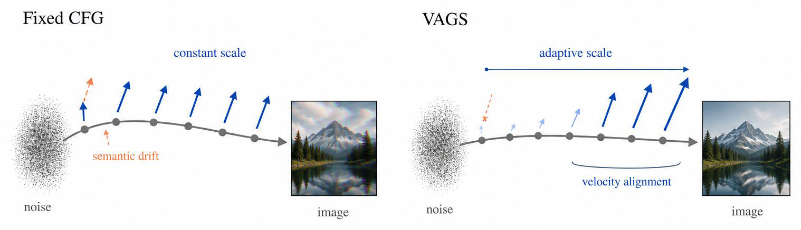
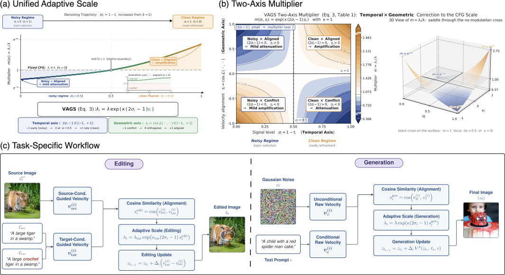
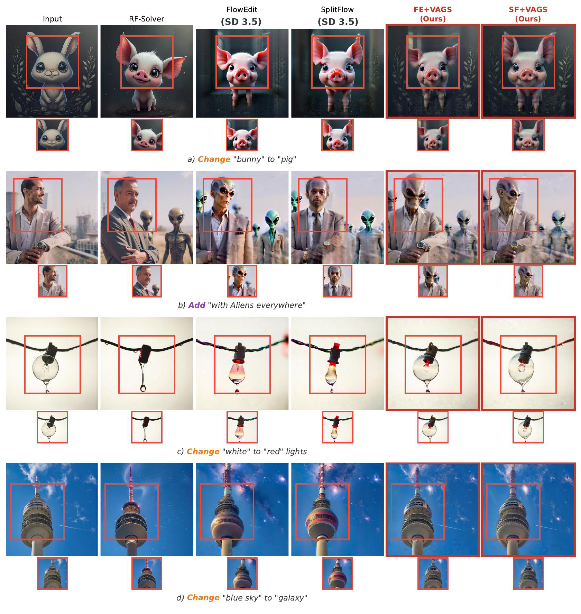
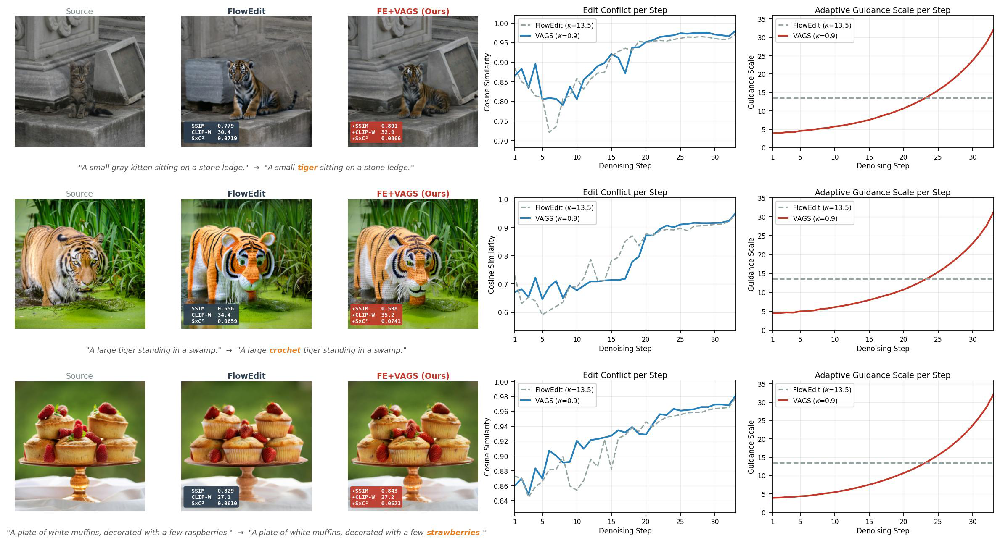

# AI Daily

## VAGS: Velocity Adaptive Guidance Scale for Image Editing and Generation

**論文標題**：VAGS: Velocity Adaptive Guidance Scale for Image Editing and Generation
**作者**：Yan Luo, Ahmadou Aidara, Jingyi Lu, Jeremy Moebel, Kai Han, Mengyu Wang
**發表機構**：Harvard University, The University of Hong Kong, Kempner Institute
**發表時間**：2026年5月15日 (arXiv)
**論文連結**：[arXiv:2605.15661](https://arxiv.org/abs/2605.15661)

---

### 核心貢獻與創新點

在基於流匹配（Flow Matching）和擴散模型（Diffusion Models）的圖像生成與編輯中，無分類器引導（Classifier-Free Guidance, CFG）是控制文本語義強度的核心機制。然而，標準做法是在整個常微分方程（ODE）軌跡中保持 CFG 尺度固定。這導致了一個根本性的不匹配：早期的去噪步驟由噪聲主導，語義信號微弱；而後期的步驟則需要更強的方向性承諾來確立圖像結構。更關鍵的是，任何引導強度的價值都取決於被引導的速度（Velocity）是否與模型當前的動態一致。

為了解決這個問題，本文提出了 **Velocity-Adaptive Guidance Scale (VAGS)**，這是一種 **Training-Free** 的即插即用方法。VAGS 通過結合時間信號級別項和任務相關速度場之間的餘弦相似度，動態調整每一步的引導尺度。

**主要創新點包括：**
1. **識別固定 CFG 的瓶頸**：指出統一的尺度忽略了 ODE 的時間結構和引導速度的逐步兼容性。
2. **提出 VAGS 統一框架**：結合信號級別（時間軸）與速度對齊（幾何軸），在幾乎不增加計算開銷的情況下動態調整 CFG。
3. **無需訓練的雙任務應用**：將 VAGS 應用於免反轉（Inversion-Free）圖像編輯和文本到圖像生成，無需額外的網絡或模型前向傳遞。

*圖 1：固定 CFG 與 VAGS 的對比。固定 CFG 會累積語義漂移，而 VAGS 根據速度對齊動態調整尺度，增強可靠方向並抑制有害方向。*

---

### 技術方法簡述

VAGS 的核心思想是將固定的目標尺度 $\lambda$ 替換為依賴於步驟的尺度 $\lambda_{i}$。這個動態尺度由兩個信號共同調製：當前的信號級別（時間因素）和相關速度場的角度對齊（幾何因素）。

數學公式定義如下：

$$ \lambda_{i} = \lambda \exp\left(\kappa (2\sigma_{i} - 1) s_{i}\right) $$

其中：
- $\lambda$ 是基礎的 CFG 尺度。
- $\kappa \geq 0$ 控制調製強度。
- $\sigma_{i} = 1 - t_{i} \in [0, 1]$ 是步驟 $i$ 的**信號級別（Signal Level）**，從 0（純噪聲）單調增長到 1（清晰圖像）。
- $s_{i} \in [-1, 1]$ 是**速度對齊（Velocity Alignment）**信號，定義為兩個任務特定速度場之間的餘弦相似度。

**雙軸調製機制：**
1. **時間軸 $(2\sigma_{i} - 1)$**：在噪聲階段（$\sigma_{i} < 0.5$）為負，在清晰階段（$\sigma_{i} > 0.5$）為正。這反映了採樣過程中的質變：早期需要抑制過強的引導以避免偏離流形，後期需要增強引導以細化結構。
2. **幾何軸 $s_{i}$**：測量局部速度幾何是否支持更強的引導。當速度一致時（$s_{i} > 0$），在清晰階段會放大引導；當速度衝突時（$s_{i} < 0$），會減弱引導以保護已提交的結構。

*圖 2：VAGS 的雙軸乘數與任務特定工作流程。左圖展示了時間與幾何因素如何共同決定乘數；右圖展示了在編輯和生成任務中的具體應用。*

**任務特定應用：**
- **圖像編輯（Inversion-Free Editing）**：$s_{i}$ 計算為源條件引導速度（Source-Conditioned Guided Velocity）與目標條件引導速度（Target-Conditioned Guided Velocity）之間的餘弦相似度。這使得每一步的編輯強度反映了保留與轉換之間的局部兼容性。
- **圖像生成（Generation）**：$s_{i}$ 計算為無條件速度（Unconditional Velocity）與條件速度（Conditional Velocity）之間的餘弦相似度，作為與數據先驗兼容性的衡量標準。

---

### 實驗結果和性能指標

作者在多個基準數據集上對 VAGS 進行了廣泛的評估，涵蓋了圖像編輯和生成任務。所有實驗均基於 Stable Diffusion 3.5 Large 模型。

#### 圖像編輯
在 PIE-Bench 和 DIV2K 數據集上，VAGS 被整合到 FlowEdit 和 SplitFlow 中。
- **背景保留與編輯強度**：FlowEdit + VAGS 在 PIE-Bench 上將結構距離（Dist）從 30.31 降低到 13.84，MSE 降低了 62%，同時 CLIP 分數保持穩定甚至有所提高。這表明 VAGS 在不犧牲編輯強度的情況下，顯著改善了源圖像的保留。
- **定性結果**：與固定 CFG 相比，VAGS 產生了更清晰的語義變化，同時更好地保留了未編輯的內容（如背景紋理、身份和佈局）。

*圖 3：PIE-Bench 上的定性編輯比較。VAGS 在實現目標編輯的同時，顯著減少了對背景和無關區域的破壞。*

#### 圖像生成
在 COCO17、CUB-200 和 Flickr30K 數據集上，VAGS-Gen 展現了卓越的性能。
- **生成質量**：在 COCO17 上，VAGS-Gen 將 FID 從 28.46 降低到 26.07，IS 從 33.64 提高到 35.15，超越了固定 CFG 以及最近的 Training-Free 引導變體（如 A-Euler 和 Self-Guidance）。
- **軌跡分析**：軌跡診斷表明，VAGS-Gen 利用無條件/條件速度對齊重塑了 CFG 路徑，而不是簡單地改變平均 CFG 尺度。

*圖 4：編輯軌跡分析。展示了每步的餘弦相似度和自適應引導尺度，VAGS 在衝突較大時自動降低引導，在一致時增強引導。*

---

### 相關研究背景

- **Flow Matching 與 Rectified Flow**：這些模型學習一個速度場，將噪聲傳輸到數據。CFG 直接調製驅動採樣 ODE 的速度場。
- **Inversion-Free Image Editing**：這類方法（如 FlowEdit, SplitFlow）通過直接整合源和目標速度差異來避免反轉誤差。VAGS 針對這類方法，通過調整目標引導尺度來優化編輯。
- **Guidance Scheduling**：雖然動態調度（如 Muse 的時間調度）已被證明有效，但它們通常是單調的或需要搜索。VAGS 的獨特之處在於它利用了採樣器內部已有的速度對齊信號，實現了 Training-Free 的細粒度控制。

---

### 個人評價和意義

VAGS 是一篇非常優雅且實用的論文。它精準地指出了固定 CFG 在 Flow-based 模型中的局限性，並提出了一個極具直覺的解決方案：**既然模型每一步都會輸出速度（Velocity），為什麼不利用這些速度之間的幾何關係來指導 CFG 呢？**

這項研究對 **Training-Free** 和 **Attention Modulation / Guidance Manipulation** 領域有重要啟發：
1. **Zero-Shot 的強大潛力**：VAGS 完全不需要微調或額外的網絡，僅通過一個簡單的數學公式（餘弦相似度 + 時間衰減）就實現了 SOTA 的編輯和生成效果。這證明了在現有大模型（如 SD3.5, FLUX）的潛在空間中，仍有大量未被充分利用的幾何信息。
2. **動態控制的範式轉移**：從全局的標量控制（固定 CFG）轉向局部的、依賴於狀態的向量控制。這種思路可以擴展到其他基於 VAR 或 Flow 的模型中，例如在視頻生成中利用幀間速度對齊來保持時間一致性。
3. **計算效率**：VAGS 的計算開銷幾乎可以忽略不計（僅增加約 1.3% - 1.8% 的時間），這使得它非常容易被整合到現有的開源工具鏈（如 Diffusers）中，具有極高的工程實用價值。

對於關注 VAR-based 和 Zero-Shot 編輯的研究者來說，VAGS 提供了一個全新的視角：**不要與模型的自然動態對抗，而是順勢而為（Velocity Adaptive）**。
