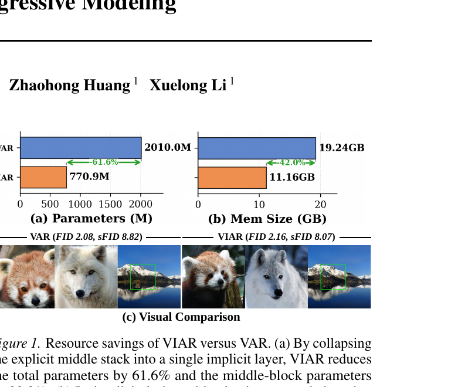
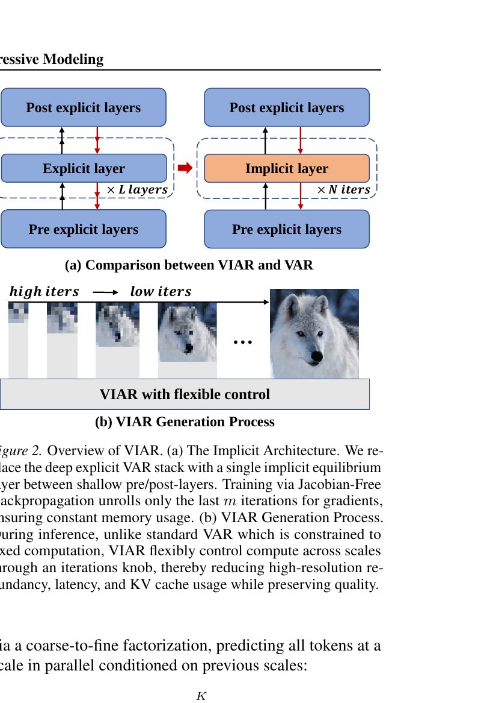
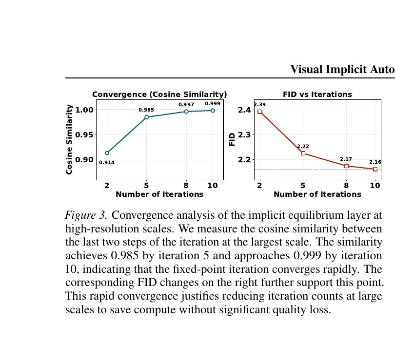
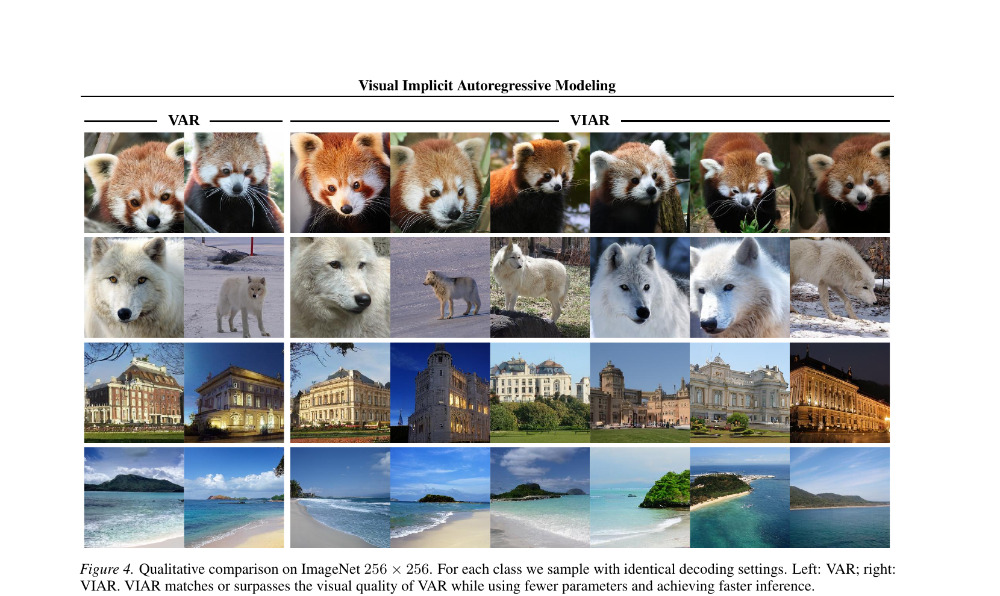
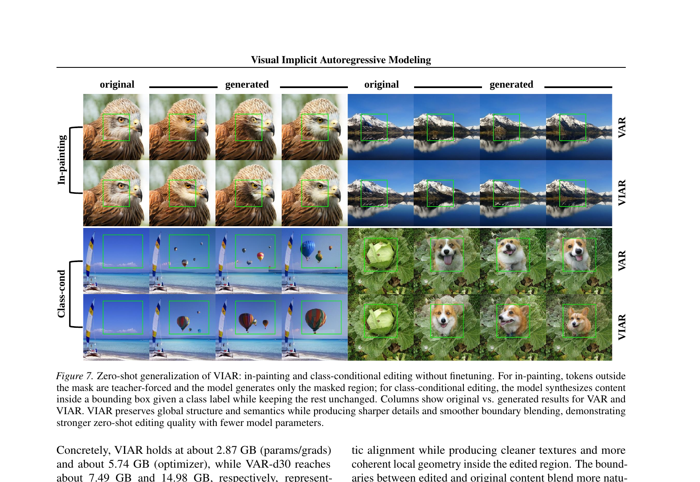

# AI Daily

**[VIAR — 2026-05-29：視覺隱式自迴歸模型 (VIAR)：將顯式深層堆疊塌縮為單一隱式均衡層，解鎖常數訓練記憶體與每尺度彈性計算控制 (ICML 2026)](https://arxiv.org/abs/2605.01220)**

---

## 核心貢獻與創新點

本文提出 **VIAR (Visual Implicit Autoregressive Modeling)**（TeleAI），這是一個發表於 **ICML 2026** [1] 的突破性視覺自迴歸生成框架。傳統的視覺自迴歸模型（VAR）[2] 雖然將自迴歸重新定義為自粗至細的「下一尺度預測（next-scale prediction）」，並實現了尺度內的並行化，但其在每個尺度轉換中仍依賴於深度堆疊的顯式 Transformer 網路。這導致隨著影像解析度的提高與模型寬度的增加，記憶體開銷（特別是 KV 快取）急劇膨脹，且每個尺度的計算量被固定，無法實現靈活的「按需計算（compute-on-demand）」。

VIAR 的核心洞見在於：**可以利用深層均衡模型（DEQs）的隱式固定點（fixed-point）層，來替代 VAR 中深層的中間顯式堆疊。**

VIAR 的主要貢獻包括：
1. **極致的參數壓縮**：將顯式中間層塌縮為單一隱式均衡層，使得中間區塊參數減少 **93.3%**，整體模型參數減少 **61.6%**（從 2.0B 壓縮至 770.9M）[1]。
2. **常數級訓練記憶體**：利用隨機雅可比無梯度反向傳播（S-JFB）訓練隱式層，使訓練時的反向傳播記憶體與網路「深度」解耦，訓練參數/梯度記憶體減少 **61.6%** [1]。
3. **推理端彈性計算控制（Compute Control Knob）**：推理時，模型「深度」轉化為可隨意調整的固定點迭代次數 $K_{\text{iter}}$。在細尺度（高解析度）上減少迭代次數，可在幾乎不損失影像品質的前提下，將峰值記憶體降低 **42.0%**，吞吐量提升 **2.1 倍** [1]。

---

## 技術方法簡述

VIAR 的整體架構如下圖所示，它在淺層的顯式前置/後置投影層（Pre/Post-layers）之間嵌入了一個隱式均衡層（Implicit equilibrium layer）。

### 1. 多尺度預測與輸入注入（Input Injection）

在第 $k$ 個尺度中，給定前一尺度的標記嵌入 $e_{k-1}$ 和條件 $c$。首先通過由 $p$ 個顯式 Transformer 區塊組成的 $f_{\text{pre}}$ 進行前置投影，得到注入向量 $x_k$：

$$x_k = f_{\text{pre}}(e_{k-1}, c; \theta_{\text{pre}}) \in H_k$$

該 $x_k$ 在後續的隱式迭代中作為恆定的**輸入注入（Input Injection）**，以防止隱式層在多步迭代中發生語義漂移。

### 2. 隱式均衡層與融合投影（Fusion Projection）

隱式層的核心是一個收縮映射 $f_{\text{imp}}$。隱式狀態 $z_k$ 透過與靜態注入 $x_{\text{inj}} = \text{clone}(x_k)$ 的非線性融合來進行更新。融合投影（Proj）採用兩層 MLP 結構（包含 GELU 激活函數）：

$$\tilde{z} = W_2 \left( \text{GELU} \left( W_1 [z_k, x_{\text{inj}}] + b_1 \right) \right) + b_2$$

其中 $[ \cdot, \cdot ]$ 表示通道維度上的拼接。隨後，利用單個 Transformer 區塊 $f_{\text{blk}}$ 計算下一步狀態：

$$G(z_k; x_{\text{inj}}, c) = f_{\text{blk}}(\tilde{z}, c; \theta_{\text{blk}})$$

在無限次迭代下，系統將收斂至唯一的不動點（固定點）均衡狀態 $z_k^*$，滿足：

$$z_k^* = G(z_k^*; x_{\text{inj}}, c)$$

### 3. 隨機雅可比無梯度反向傳播（Stochastic JFB）

為了避免對隱式層進行極其昂貴的精確隱式微分，VIAR 採用了**隨機雅可比無梯度反向傳播（S-JFB）** [1] [3]：
- **無梯度前向傳播**：隨機採樣 $n \sim \text{Uniform}\{0, \dots, N\}$，進行 $n$ 步無梯度的固定點迭代以接近均衡點：
  $$z_k^{t+1} = G_{\text{ng}}(z_k^t; x_{\text{inj}}, c), \quad t = 0, \dots, n-1$$
- **帶梯度前向傳播**：隨機採樣 $m \sim \text{Uniform}\{1, \dots, M\}$，進行 $m$ 步帶梯度追蹤的迭代：
  $$z_k^{t+1} = G_{\text{wg}}(z_k^t; x_{\text{inj}}, c), \quad t = n, \dots, n+m-1$$
- **梯度近似**：最終狀態記為 $\hat{z}_k$，僅通過最後 $m$ 步的計算圖進行反向傳播：
  $$\frac{\partial \mathcal{L}}{\partial \theta_{\text{imp}}} \approx \sum_{k=1}^K \frac{\partial \mathcal{L}_k}{\partial \hat{z}_k} \cdot \frac{\partial \hat{z}_k}{\partial \theta_{\text{imp}}} \Bigg|_{\text{last } m \text{ steps}}$$

這種隨機多步 JFB 在訓練穩定性與記憶體開銷之間取得了極佳平衡。

### 4. 尺度感知計算控制（Multi-scale Compute Control）

在推理時，VIAR 允許為不同尺度 $k$ 靈活指定不同的迭代次數 $c_k$。總隱式計算代價為 $\sum_k c_k$。
收斂性分析表明，高解析度（細尺度）下的隱式層收斂極快，在第 5 步時餘弦相似度已達 0.985，10 步時已達 0.999 [1]。

因此，VIAR 採用了**遞減排程（Decreasing Schedule）**：在粗尺度（負責全域結構）分配較多迭代次數，在細尺度（僅負責細節修飾）分配極少迭代次數（如 $Dec._{(20, 5)}$），從而大幅削減高解析度下的冗餘計算。

---

## 實驗結果和性能指標

### 1. 主要生成性能（ImageNet 256×256）

在 ImageNet $256 \times 256$ 基準上，VIAR 僅用 **38.4%** 的參數（770.9M vs. VAR 2010.0M），就達到了與 VAR 幾乎等同的生成品質，甚至在空間保真度（sFID）上表現更佳 [1]。

| 模型 | FID $\downarrow$ | sFID $\downarrow$ | IS $\uparrow$ | 參數量 | 推理記憶體 (RTX 4090) |
| :--- | :---: | :---: | :---: | :---: | :---: |
| **VAR-d30** (cfg=2.0) | **2.05** | 8.86 | 328.5 | 2010.0M | 19.24 GB |
| **VAR-d30** (cfg=1.5) | 2.08 | 8.82 | 306.8 | 2010.0M | 19.24 GB |
| **VIAR** (cfg=2.0) | 2.35 | **7.92** | **330.7** | **770.9M** | **11.16 GB** |
| **VIAR** (cfg=1.5) | 2.16 | 8.07 | 300.1 | **770.9M** | **11.16 GB** |

### 2. 彈性推理效率對比

透過調整推理時的迭代排程旋鈕，VIAR 展現出了極其平滑且優秀的「品質-速度-記憶體」權衡曲線。最激進的 $\text{VIAR}_{s4}$ 排程將記憶體壓低至 **8.53 GB**，吞吐量提升至 **32.08 images/s** [1]。

| 方法 | 迭代排程 | FID $\downarrow$ | sFID $\downarrow$ | 峰值 GPU 記憶體 $\downarrow$ | 吞吐量 (images/s) $\uparrow$ |
| :--- | :---: | :---: | :---: | :---: | :---: |
| **VAR** (基線) | 顯式固定 | 2.08 | 8.82 | 19.24 GB | 15.16 |
| $\mathbf{VIAR}_{s1}$ | 保守迭代 | 2.16 | 8.07 | 11.16 GB | 21.50 |
| $\mathbf{VIAR}_{s2}$ | 中度遞減 | 2.22 | 8.08 | 9.60 GB | 26.92 |
| $\mathbf{VIAR}_{s3}$ | 快速收斂 | 2.27 | 8.02 | 9.40 GB | 28.12 |
| $\mathbf{VIAR}_{s4}$ | 極致加速 | 2.43 | 8.28 | **8.53 GB** | **32.08 (2.12x)** |

### 3. 常數級訓練記憶體與 FLOPs 節省
- **訓練記憶體**：VIAR 的參數與梯度記憶體（2.87 GB）及優化器狀態記憶體（5.74 GB）在訓練過程中**不隨深度增加而增長**，相比 VAR-d30 減少了 **61.6%** 的訓練記憶體開銷 [1]。
- **推理計算量**：VAR-d30 需要 **1.88 TFLOPs**，而 VIAR 僅需 **0.84 ~ 1.46 TFLOPs**（視排程而定）[1]。

---

## 相關研究背景

視覺自迴歸生成（VAR）自 2024 年提出以來，因其突破了傳統 1D 掃描式自迴歸的局限，成為比肩 Diffusion Models 的重要影像生成範式。然而，後續研究發現其在細尺度（高解析度）存在嚴重的計算冗餘。
- **FastVAR** [4] 與 **ScaleKV** [5] 分別嘗試在推理階段透過「標記剪枝（Token Pruning）」和「KV 快取壓縮（KV Cache Compression）」來緩解高解析度下的冗餘。
- **VIAR** 與上述「免訓練後處理」方法不同，它直接從**骨幹網路（Backbone）**層面進行重新設計。將顯式中間堆疊替換為隱式均衡層。這與 FastVAR、ScaleKV 的技術路線是完全**正交且互補**的，未來兩者可結合以達到更極致的性能 [1]。

---

## 個人評價和意義

VIAR 是一篇令人興奮的「深度均衡模型（DEQ）」在視覺生成領域的成功實踐。

### 1. 理論與實踐的精妙結合
DEQ 雖然在理論上非常優雅（常數訓練記憶體、無限深度表徵），但在過去因其訓練不穩定和收斂緩慢，很難在主流生成任務中擊敗顯式堆疊網路。VIAR 聰明地保留了 VAR 的前置與後置顯式層（$p=5$），僅將中間堆疊隱式化，並配合 S-JFB 訓練與融合投影，成功在 2B 級別的大模型上實現了極其穩定的隱式訓練。

### 2. 徹底解鎖「彈性邊端部署」
在實際部署中，最令人頭疼的是不同硬體平台（如伺服器、手機、邊緣設備）需要訓練不同參數規模（如 100M, 1B, 2B）的模型。VIAR 實現了**「一次訓練，多端自適應部署」**。在伺服器端，我們可以使用保守迭代（如 20 步）獲取極致的生成品質；在手機或低算力邊緣端，我們可以一鍵切換至極致加速排程（如 5 步），而無需重新訓練或微調模型。這對於實用化部署具有巨大的商業價值。

### 3. Zero-shot 影像編輯中的優勢
在 Zero-shot 影像修補（In-painting）和類別條件編輯任務中，隱式均衡層展現出了獨特的優勢。由於均衡狀態 $z^*$ 是透過多次迭代與周圍 teacher-forced 的上下文資訊進行全局交互而達到的，它天然具有更強的全局一致性約束。實驗中，VIAR 在邊界融合處的過渡比 VAR 更加平滑自然，細節（如羽毛、毛髮）也更為清晰。

---

## 參考文獻

[1] P. Jiang, J. Luo, L. Lin, Z. Huang, and X. Li, "Visual Implicit Autoregressive Modeling," in *Proceedings of the International Conference on Machine Learning (ICML)*, 2026. [arXiv:2605.01220](https://arxiv.org/abs/2605.01220).

[2] K. Tian, Y. Jiang, Z. Yuan, B. Peng, and L. Wang, "Visual Autoregressive Modeling: Scalable Image Generation via Next-Scale Prediction," in *Advances in Neural Information Processing Systems (NeurIPS)*, 2024. [arXiv:2403.11202](https://arxiv.org/abs/2403.11202).

[3] S. W. Fung, H. Heaton, Q. Li, D. McKenzie, S. Osher, and W. Yin, "JFB: Jacobian-Free Backpropagation for Implicit Networks," in *Proceedings of the AAAI Conference on Artificial Intelligence (AAAI)*, 2022. [arXiv:2103.12890](https://arxiv.org/abs/2103.12890).

[4] H. Guo, Y. Li, T. Zhang, J. Wang, T. Dai, S. Xia, and L. Benini, "FastVAR: Linear Visual Autoregressive Modeling via Cached Token Pruning," *arXiv preprint arXiv:2503.23367*, 2025. [arXiv:2503.23367](https://arxiv.org/abs/2503.23367).

[5] K. Li, Z. Chen, C. Yang, and J. Hwang, "Memory-Efficient Visual Autoregressive Modeling with Scale-Aware KV Cache Compression," *arXiv preprint arXiv:2505.19602*, 2025. [arXiv:2505.19602](https://arxiv.org/abs/2505.19602).
