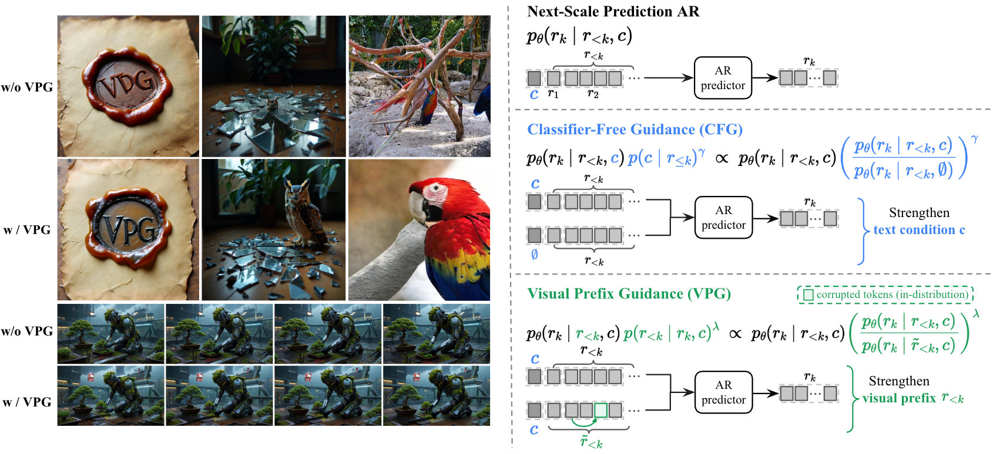
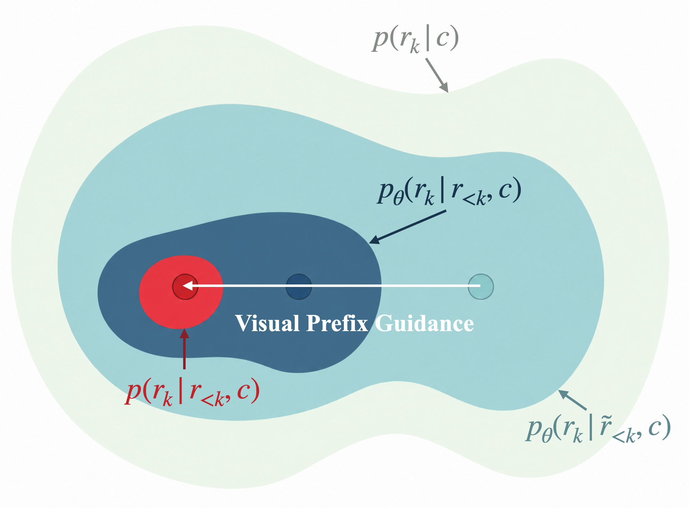
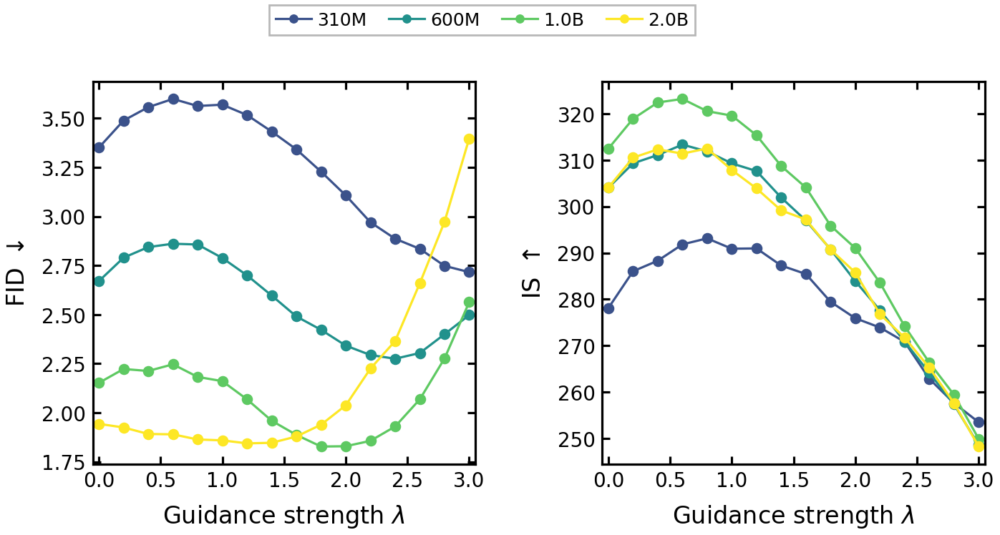
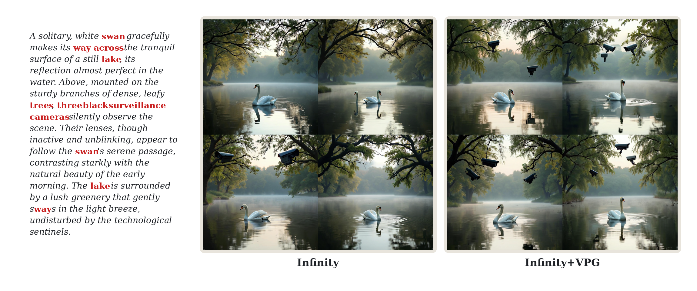

# AI Daily: VPG — 2026-05-28：Visual Prefix Guidance 視覺前綴引導，免訓練對抗自回歸曝光偏差，解鎖超強 compositional 生成 (NUS & HUST)

本篇研究 [1] 提出 **VPG (Visual Prefix Guidance)**（新加坡國立大學 NUS 與 華中科技大學 HUST），一個專為視覺自回歸模型（Visual Autoregressive Models）設計的**免訓練（Training-Free）**、**即插即用（Drop-In）**的推理端引導採樣規則。
其核心洞見在於：自回歸模型在訓練時使用 **Teacher Forcing**（以 ground-truth 歷史為條件），但在推理時必須以自己生成的歷史（即 **Prefix**）為條件，這種訓練與推理的不匹配會導致嚴重的 **Exposure Bias（曝光偏差）** 與 **Prefix Drift（前綴漂移）**。
先前的方法（如 CFG [2]）主要是在引導外部語意條件（如 text prompt），而忽視了歷史前綴本身的累積誤差。VPG 通過引入一個在推理時構建的**損毀前綴（Corrupted Prefix）**作為對照分支，並在 Logit 空間中進行外推，強制模型在每一步預測時優先選擇能增強已生成前綴後驗支持（Posterior Support）的候選 token。這在無需任何額外訓練、不增加任何模型參數的情況下，顯著提升了自回歸圖像（VAR [3]、Infinity [4]）與視頻（InfinityStar [5]）模型的生成品質，特別是在解決物體遺漏、計數錯誤和空間關係混亂等組合性（Compositional）生成難題上表現優異。

*圖 1：VPG（Visual Prefix Guidance）與 CFG 的概念與生成效果對比。左側展示了在相同 Prompt 與隨機種子下，有無 VPG 的生成對比；右側展示了 CFG 強化外部條件 $c$，而 VPG 強化內部視覺歷史前綴 $r_{<k}$ 的機制對比。*

---

## 論文核心貢獻與創新點

自回歸模型在自然語言處理中取得了巨大的成功，並在近年被成功推廣到圖像生成（如 VAR [3]）與視頻生成（如 InfinityStar [5]）領域。然而，自回歸解碼中固有的曝光偏差問題在視覺生成中表現得尤為致命，通常會導致高頻細節不穩定、物體結構混亂或長視頻語意漂移。本研究的主要貢獻可以概括為以下三個方面：

1. **提出全新的推理引導維度**：不同於傳統的 Classifier-Free Guidance (CFG) [2] 專注於拉大「有條件 $c$」與「無條件 $\emptyset$」之間的差距，VPG 開闢了另一個維度——專注於歷史前綴的相容性。它通過引導模型預測那些能夠最大化前綴後驗概率 $p(r_{<k} | r_k, c)$ 的 token，直接在推理端對曝光偏差和前綴漂移進行干預。
2. **免訓練且即插即用的設計**：VPG 不需要對預訓練模型進行任何微調，也不需要引入額外的分類器或輔助預測頭。它完全在推理時通過在同一個凍結的 Transformer 中進行雙路前向傳播（Genuine Prefix 支路與 Corrupted Prefix 支路）來實現，並在 Logit 空間中進行極簡的外推。
3. **高難度基準上的廣泛驗證**：在 ImageNet $256 \times 256$ 類別條件生成、GenEval 組合性圖像生成、DPG-Bench 以及 VBench 視頻生成等多個極具挑戰性的基準上，VPG 均帶來了顯著的品質提升。特別是在 VAR 圖像模型上，平均降低了 **0.36** 的 FID；在 InfinityStar 視頻模型上，取得了 VBench 多物體生成與語意對齊指標的 **SOTA** 表現。

---

## 技術方法簡述

### 1. 視覺自回歸模型與 CFG 的局限性
在 next-scale 視覺自回歸模型（如 VAR [3] 或 Infinity [4]）中，圖像或視頻被多尺度離散化編碼為 $K$ 個由粗到細的殘差 token 映射 $R = (r_1, \dots, r_K)$。生成過程被建模為：

$$p_{\theta}(R | c) = \prod_{k=1}^{K} p_{\theta}(r_k | r_{<k}, c)$$

其中 $c$ 為外部文本或類別條件，$r_{<k}$ 為歷史前綴。

在標準的 CFG 採樣中，模型通過在 Logit 空間中將有條件分支與無條件（空文本 $\emptyset$）分支進行對比外推：

$$\ell_k^{\text{CFG}} = (1 + \gamma) \ell_k(c, r_{<k}) - \gamma \ell_k(\emptyset, r_{<k})$$

這等價於強化了後驗概率 $p(c | r_{\le k})$。然而，此時歷史前綴 $r_{<k}$ 是保持凍結不變的，CFG 無法對前綴本身可能包含的累積誤差進行任何修正。

---

### 2. VPG 數學推導
VPG 的目標是希望下一個預測的 token $r_k$ 不僅符合外部條件 $c$，還能與已經生成的歷史前綴 $r_{<k}$ 具有極高的相容性。因此，我們在採樣分佈中顯式地引入一個前綴相容性項（由超參數 $\lambda$ 控制其強度）：

$$p_{\theta}^{\text{VPG}}(r_k | r_{<k}, c) \propto p_{\theta}(r_k | r_{<k}, c) \cdot p(r_{<k} | r_k, c)^{\lambda}$$

根據貝氏定理（Bayes' Rule），前綴的後驗概率可以展開為：

$$p(r_{<k} | r_k, c) = \frac{p_{\theta}(r_k | r_{<k}, c) \cdot p(r_{<k} | c)}{p(r_k | c)} \propto_{r_k} \frac{p_{\theta}(r_k | r_{<k}, c)}{p(r_k | c)}$$

其中 $p(r_k | c) = \int p_{\theta}(r_k | r_{<k}, c) p(r_{<k} | c) d\mu(r_{<k})$ 是將前綴邊際化（Marginalized）後的預測概率。

將其代入目標公式，我們得到：

$$p_{\theta}^{\text{VPG}}(r_k | r_{<k}, c) \propto p_{\theta}(r_k | r_{<k}, c) \cdot \left( \frac{p_{\theta}(r_k | r_{<k}, c)}{p(r_k | c)} \right)^{\lambda}$$

這表明，VPG 的引導方向是由「前綴條件概率」與「前綴邊際化概率」之比（即似然比）決定的。

---

### 3. Corrupted Prefix 的構造
在實際推理中，邊際化概率 $p(r_k | c)$ 是無法直接計算的，因為它需要對所有可能的前綴進行積分。
為此，VPG 提出使用一個**損毀前綴（Corrupted Prefix）** $\tilde{r}_{<k}$ 來作為一個單樣本代理（Surrogate）：

$$p(r_k | c) \approx p_{\theta}(r_k | \tilde{r}_{<k}, c)$$

為了使 $\tilde{r}_{<k}$ 既能破壞歷史前綴中的具體語意/空間綁定關係，又不會引入超出預訓練模型分佈（Out-of-Distribution）的噪聲，作者設計了**同尺度全嵌入替換（Same-Scale Full-Embedding Replacement）**機制：

在每一步採樣時，隨機選取比例為 $n_p$ 的前綴位置集合 $\mathcal{S}_k$。對於每個被選中的位置 $(j, u)$（其中 $j$ 為尺度，$u$ 為空間位置），將其全嵌入（包含 visual codebook 激活與尺度-位置編碼 $PosEmb$）替換為同一尺度 $j$ 下另一個隨機位置 $u'$ 的全嵌入：

$$\tilde{e}_{j,u} = \begin{cases} e_{j,u'} & \text{if } (j,u) \in \mathcal{S}_k \text{ and } (j,u') = \pi(j,u) \\ e_{j,u} & \text{if } (j,u) \notin \mathcal{S}_k \end{cases}$$

這種設計巧妙地保留了模型在各個尺度上的激活統計特性，但徹底打亂了前綴的語意結構，完美地扮演了「弱前綴」的角色（類比於 CFG 中的空文本 $\emptyset$）。

*圖 2：VPG 在概率空間中的引導機制。在無引導時，自回歸模型容易漂移到邊際概率 $p(r_k|c)$ 的高頻但無效區域；VPG 通過與損毀前綴分支 $p_{\theta}(r_k|\tilde{r}_{<k},c)$ 對比，將預測拉回與真實前綴高度相容的後驗分佈 $p(r_k|r_{<k},c)$ 中。*

---

### 4. Logit 外推與 CFG 組合
在 Logit 空間中，VPG 的引導規則可以極簡地寫為：

$$\ell_k^{\text{VPG}} = \ell_k^{\text{gen}} + \lambda (\ell_k^{\text{gen}} - \ell_k^{\text{corr}}) = (1 + \lambda) \ell_k^{\text{gen}} - \lambda \ell_k^{\text{corr}}$$

其中 $\ell_k^{\text{gen}} = \ell_k(c, r_{<k})$ 為真實前綴 Logit，$\ell_k^{\text{corr}} = \ell_k(c, \tilde{r}_{<k})$ 為損毀前綴 Logit。

當與 CFG 組合使用時，我們先分別在真實前綴和損毀前綴上應用 CFG（強度為 $\gamma$），得到 $g_k^{\text{gen}}$ 與 $g_k^{\text{corr}}$：

$$g_k^{\text{gen}} = (1 + \gamma) \ell_k(c, r_{<k}) - \gamma \ell_k(\emptyset, r_{<k})$$

$$g_k^{\text{corr}} = (1 + \gamma) \ell_k(c, \tilde{r}_{<k}) - \gamma \ell_k(\emptyset, \tilde{r}_{<k})$$

最後在兩者之間進行 VPG 外推（強度為 $\lambda$）：

$$\ell_k^{\text{CFG+VPG}} = g_k^{\text{gen}} + \lambda (g_k^{\text{gen}} - g_k^{\text{corr}})$$

---

## 實驗結果與性能指標

### 1. Class-Conditional Image Generation (ImageNet 256x256)
在官方發布的 VAR 模型（不同參數規模）上，VPG 展現了穩定的性能提升。實驗設定損毀比例 $n_p = 0.1$，並對每個模型大小掃描最優的引導強度 $\lambda$：

| 模型 (Model) | 參數規模 (Params) | 最優引導強度 $\lambda$ | 基準 FID $\downarrow$ | VPG 輔助 FID $\downarrow$ | 性能提升 $\Delta$FID |
| :--- | :---: | :---: | :---: | :---: | :---: |
| **VAR-d16** | 310M | 3.0 | 3.35 | **2.72** | -0.63 |
| **VAR-d20** | 600M | 2.4 | 2.67 | **2.28** | -0.39 |
| **VAR-d24** | 1.0B | 1.8 | 2.15 | **1.83** | -0.32 |
| **VAR-d30** | 2.0B | 1.3 | 1.94 | **1.84** | -0.10 |

**關鍵結論**：
- VPG 在所有模型尺寸上都降低了 FID，平均降幅達 **0.36**。
- **VAR-d24 + VPG** 的 FID（**1.83**）甚至超越了參數量兩倍的 **VAR-d30 基準模型**（1.94），顯著提高了小模型的推理效能。
- 隨著模型容量增加，VPG 的邊際收益有所收窄（VAR-d30 上提升 0.10），這說明模型本身容量越小，越容易受到曝光偏差的影響，此時 VPG 的推理端修正作用最為關鍵。

*圖 3：在 ImageNet $256 \times 256$ 基準上，不同 VAR 模型大小在 VPG 引導強度 $\lambda$ 掃描下的 FID 與 IS 變化曲線。可以看出，較小模型（如 310M、600M）需要更強的引導強度。*

---

### 2. Text-to-Image Generation (GenEval & DPG-Bench)
在 Infinity-2B 模型上，作者使用 $n_p = 0.1, \lambda = 0.2$ 的設定，在專注於語意組合與空間關係的 GenEval 和 DPG-Bench 基準上進行了測試：

| 方法 (Method) | 類型 (Type) | 參數規模 (Params) | GenEval Two-Object $\uparrow$ | GenEval Position $\uparrow$ | GenEval Color $\uparrow$ | GenEval Overall $\uparrow$ | DPG-Bench Overall $\uparrow$ |
| :--- | :---: | :---: | :---: | :---: | :---: | :---: | :---: |
| **SDXL** | Diffusion | 2.6B | 0.74 | 0.15 | 0.23 | 0.55 | 74.65 |
| **PixArt-$\Sigma$** | Diffusion | 0.6B | 0.62 | 0.14 | 0.27 | 0.55 | 80.54 |
| **SD3 (d=24)** | Diffusion | 2.0B | 0.74 | 0.34 | 0.36 | 0.62 | 84.08 |
| **Show-o** | AR | 1.3B | 0.80 | 0.31 | 0.50 | 0.68 | 67.48 |
| **Emu3** | AR | 8.5B | 0.81 | 0.49 | 0.45 | 0.66 | 81.60 |
| **Infinity** | AR | 2.0B | 0.83 | 0.39 | **0.56** | 0.70 | 83.46 |
| **Infinity + VPG (Ours)** | AR | 2.0B | **0.85** (+0.02) | **0.41** (+0.02) | **0.56** (+0.00) | **0.71** (+0.01) | **83.80** (+0.34) |

**定性與定量分析**：
- VPG 成功提升了 Infinity 在「多物體計數（Two-Object）」和「空間位置關係（Position）」上的得分（均提升 **+0.02**），使 Overall 分數達到 **0.71**，在所有自回歸模型中名列第一。
- 定性對比（如圖 4 所示）表明，當 Prompt 要求生成較為複雜的物體組合時（例如：在湖面上有天鵝，且樹枝上安裝有三個黑色監視器），原版 Infinity 容易遺漏物體（只生成天鵝，忽略了監視器），而 VPG 通過強化歷史前綴的相容性，成功強迫模型在後續步驟中把監視器合理地「畫」在樹枝上，實現了精準的語意組合。

*圖 4：Infinity 與 Infinity+VPG 的定性對比。在複雜組合 Prompt 下，VPG 能夠有效防止物體遺漏、計數錯誤和空間綁定失效。*

---

### 3. Text-to-Video Generation (VBench)
在 InfinityStar-8B 視頻模型上，作者採用 $n_p = 0.05, \lambda = 0.25$。由於長序列生成對擾動極其敏感，因此視頻模型需要更小的損毀比例。

| 模型 (Model) | 類型 (Type) | 參數 (Params) | 動作品質 (Action) | 場景 (Scene) | 多物體 (Multi-Obj) | 畫面品質 (Quality) | 語意對齊 (Semantic) | 綜合得分 (Overall) |
| :--- | :---: | :---: | :---: | :---: | :---: | :---: | :---: | :---: |
| **CogVideoX-5B** | Diffusion | 5.0B | **99.40** | 53.20 | 62.11 | 82.75 | 77.04 | 81.61 |
| **HunyuanVideo** | Diffusion | 13.0B | 94.40 | 53.88 | 68.55 | 85.09 | 75.82 | 83.24 |
| **Goku** | Diffusion | 2.0B | 97.60 | **57.08** | 79.48 | 85.60 | 81.87 | **84.85** |
| **Wan 2.1** | Diffusion | 14.0B | 98.80 | 53.67 | 81.44 | **85.64** | 80.95 | 84.70 |
| **InfinityStar** | AR | 8.0B | 98.00 | 54.51 | 87.50 | 84.14 | 82.74 | 83.86 |
| **InfinityStar + VPG** | AR | 8.0B | 98.00 | 56.61 (+2.10) | **89.63** (+2.13) | 84.56 (+0.42) | **83.51** (+0.77) | 84.35 (+0.49) |

VPG 為 InfinityStar 帶來了全面提升，綜合 VBench 得分提高了 **0.49**。特別是在**多物體生成（+2.13）**和**語意對齊（+0.77）**上，InfinityStar+VPG 取得了所有評測模型（包括強大的 Diffusion 視頻模型）中的 **SOTA 表現**。

---

### 4. 損毀前綴設計的消融實驗 (Ablations)
為了驗證「同尺度全嵌入替換」機制的合理性，作者在 VAR-d16（ImageNet $256 \times 256$，固定 $n_p = 0.1$）上對不同的損毀前綴構造方法進行了對比：

| 損毀前綴變體 (Replacement Variant) | 最優 FID $\downarrow$ | 性能變化 $\Delta$FID | 結論與物理意義 |
| :--- | :---: | :---: | :--- |
| **None (Unguided Baseline)** | 3.35 | 0.00 | 基準線 |
| **Random Codebook** (隨機碼簿代碼) | 7.26 | +3.91 | **極差**。引入了嚴重的 OOD 噪聲，破壞了 Transformer 隱空間分佈。 |
| **Same-Scale Token** (僅替換 token，保留位置編碼) | 5.87 | +2.52 | **差**。位置編碼與 token 內容不匹配，同樣產生了分佈偏移。 |
| **Same-Scale Position** (僅替換位置編碼，保留 token) | 4.46 | +1.11 | **差**。機制同上，破壞了特徵統計的一致性。 |
| **Same-Scale Embed. (VPG, Ours)** | **2.72** | **-0.63** | **優秀**。將 Token 與位置編碼作為一個整體進行同尺度替換，既打破了語意綁定，又完全保留了尺度內特徵的邊際分佈。 |

---

## 相關研究背景

視覺自回歸生成近年來取得了爆發式增長。其演進路徑和 VPG 的生態定位可以梳理如下：

1. **視覺自回歸框架的演進**：早期的自回歸模型（如 VQ-GAN [6]）採用光柵掃描（Raster Scan）順序，效率極低。**VAR (Tian et al., 2025)** [3] 創新性地提出了 next-scale 預測，將二維圖像生成轉化為多尺度殘差特徵圖的預測，實現了並行化與高品質的統一。**Infinity (Han et al., CVPR 2025)** [4] 則進一步將其擴展為 Bitwise（二進制）編碼，解鎖了高解析度圖像的極速生成。
2. **曝光偏差的解決方案**：先前解決曝光偏差主要依賴訓練時方法。例如 **reAR (He et al., 2025)** [7] 在訓練時對 Token 施加輕量級、退火的擾動，以增強生成器對漂移前綴的魯棒性。然而，訓練時方法需要昂貴的重訓練成本。
3. **推理端引導機制的啟發**：VPG 的設計靈感來源於擴散模型中的推理引導。例如 **PAG (Ahn et al., ECCV 2024)** [8] 通過損毀自注意力機制（Self-Attention）來構建弱條件分支；**SEG (Hong, NeurIPS 2024)** [9] 通過平滑注意力特徵的能量。VPG 則是首個將這種「自對照」思想完美移植到視覺自回歸前綴軸（Prefix Axis）上的工作。

---

## 個人評價與意義

VPG 是一篇非常精緻且極具啟發性的論文。在擴散模型引導機制（如 PAG、SEG）大行其道的今天，自回歸視覺模型在推理端引導上的研究一直相對匱乏。VPG 敏銳地抓住了自回歸模型的核心痛點——**曝光偏差**，並給出了一個極其優雅的數學解釋。

其最大的亮點在於**損毀前綴的構造（Same-Scale Full-Embedding Replacement）**。這是一個非常精妙的「Surrogate Trick」：直接在預訓練好的、凍結的 Transformer 內部，通過將 $Token + Position$ 作為整體進行同尺度隨機置換，既打破了語意連貫性（使其退化為 Marginal Likelihood 的代理），又沒有引入任何 OOD 噪聲。這種「用模型自己的激活來對照自己」的思路，不僅成本為零，而且物理意義極其明確。

從實用價值來看，VPG 平均降低 0.36 FID 的表現非常紮實，特別是 **VAR-d24 + VPG 幹掉 VAR-d30** 的結論，對於端側部署、輕量化模型推理具有極大的實踐指導意義。在視頻生成上，VPG 顯著改善了長序列的語意漂移，為未來構建更加穩定的自回歸世界模型（World Models）提供了全新的技術路徑。

---

## 參考文獻

[1] Xinyao Liao, Qiyuan He, Yicong Li, Jiayin Zhu, Xiaoye Qu, Wei Wei, and Angela Yao. "VPG: Visual Prefix Guidance for Autoregressive Image and Video Generation." *arXiv preprint arXiv:2605.30317* (2026). [https://arxiv.org/abs/2605.30317](https://arxiv.org/abs/2605.30317)

[2] Jonathan Ho and Tim Salimans. "Classifier-free diffusion guidance." *arXiv preprint arXiv:2207.12598* (2022). [https://arxiv.org/abs/2207.12598](https://arxiv.org/abs/2207.12598)

[3] Keyu Tian, Yi Jiang, Zehuan Yuan, and Joshua B. Tenenbaum. "Visual Autoregressive Modeling: Scalable Image Generation via Next-Scale Prediction." *Neural Information Processing Systems (NeurIPS)* (2024). [https://arxiv.org/abs/2404.02905](https://arxiv.org/abs/2404.02905)

[4] Jian Han, Jinlai Liu, Yi Jiang, Bin Yan, Yuqi Zhang, Zehuan Yuan, Bing Peng, and Xiaolin Liu. "Infinity: Scaling Bitwise AutoRegressive Modeling for High-Resolution Image Synthesis." *IEEE/CVF Conference on Computer Vision and Pattern Recognition (CVPR)* (2025). [https://arxiv.org/abs/2412.04431](https://arxiv.org/abs/2412.04431)

[5] Jinlai Liu, Jian Han, Bin Yan, Heng Wu, Fan Zhu, Xu Wang, Yi Jiang, Bing Peng, and Zehuan Yuan. "InfinityStar: Unified Spacetime Autoregressive Modeling for Visual Generation." *arXiv preprint arXiv:2511.04675* (2025). [https://arxiv.org/abs/2511.04675](https://arxiv.org/abs/2511.04675)

[6] Patrick Esser, Robin Rombach, and Björn Ommer. "Taming transformers for high-resolution image synthesis." *IEEE/CVF Conference on Computer Vision and Pattern Recognition (CVPR)* (2021). [https://arxiv.org/abs/2012.09841](https://arxiv.org/abs/2012.09841)

[7] Qiyuan He, Yicong Li, Haoran Ye, Jingyi Wang, Xinyao Liao, Ping Heng, Stefano Ermon, James Zou, and Angela Yao. "reAR: Rethinking Visual Autoregressive Models via Generator-Tokenizer Consistency Regularization." *arXiv preprint arXiv:2510.04450* (2025). [https://arxiv.org/abs/2510.04450](https://arxiv.org/abs/2510.04450)

[8] Dongjun Ahn, Hyoungwoo Cho, Jaesung Min, Wooseok Jang, Jungwoo Kim, Sang-gil Kim, Heung-Seon Park, Kyong Hwan Jin, and Seungryong Kim. "Self-rectifying diffusion sampling with perturbed-attention guidance." *European Conference on Computer Vision (ECCV)* (2024). [https://arxiv.org/abs/2403.17377](https://arxiv.org/abs/2403.17377)

[9] Sumin Hong. "Smoothed energy guidance: guiding diffusion models with reduced energy curvature of attention." *Neural Information Processing Systems (NeurIPS)* (2024). [https://arxiv.org/abs/2405.15582](https://arxiv.org/abs/2405.15582)
