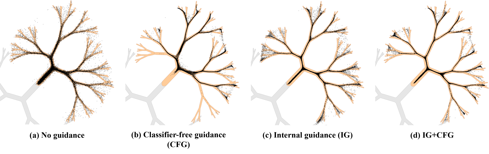
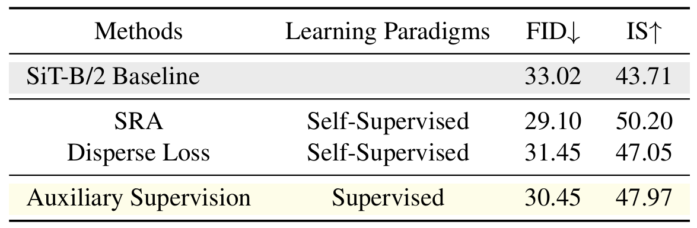

# AI Daily - 2026-06-05

# 💡 Guiding a Diffusion Transformer with the Internal Dynamics of Itself (CVPR 2026 Highlight)

近年來，隨着 **Diffusion Transformer (DiT)** 架構的擴展，如何高效地在不犧牲生成多樣性的前提下提升圖像生成質量，成為了生成式 AI 領域的核心課題。傳統的 **Classifier-Free Guidance (CFG)** 雖然能有效引導生成路徑，但過高的引導係數容易導致圖像過度飽和、多樣性崩塌或邊緣失真。

本研究由電子科技大學、新加坡國立大學、中山大學及華北計算技術研究所的研究團隊提出。他們推出了一種極其簡單卻異常強大的隨機引導機制：**Internal Guidance (IG，內部引導)**。該方法完全 **無需額外訓練獨立的弱模型 (Bad Version)**，也 **無需增加推理階段的採樣步驟**，僅憑藉模型**自身的內部動態 (Internal Dynamics)** 即可實現超越現有 SOTA 的生成質量。

---

## 📌 論文基本信息

* **論文標題**：Guiding a Diffusion Transformer with the Internal Dynamics of Itself [1]
* **作者團隊**：Xingyu Zhou, Qifan Li, Xiaobin Hu, Hai Chen, Shuhang Gu (電子科技大學、新加坡國立大學、中山大學、華北計算技術研究所)
* **發表會議**：CVPR 2026 (Highlight)
* **項目主頁**：[Internal Guidance Project Page](https://zhouxingyu13.github.io/Internal-Guidance/)
* **論文鏈接**：[arXiv:2512.24176](https://arxiv.org/abs/2512.24176)
* **開源代碼**：[GitHub - CVL-UESTC/Internal-Guidance](https://github.com/CVL-UESTC/Internal-Guidance)

---

## 🚀 核心貢獻與創新點

1. **無需額外開銷的自引導機制 (Training-Free & Zero-Cost Guidance)**：
   傳統的 Autoguidance (如 Karras 等人提出的 "bad version" 引導 [2]) 需要精心設計退化策略、額外訓練一個較弱的模型，或在採樣時增加額外的模型前向傳播。而 **Internal Guidance (IG)** 通過在訓練時對中間層引入輔助監督，在推理時直接將該中間層輸出作為「天然的弱預測」，實現了**零額外採樣開銷**的自引導。
2. **輔助監督緩解梯度消失 (Auxiliary Supervision Regularization)**：
   在訓練深層 DiT 時，僅在中間層加入一個簡單的監督損失函數，即可達到甚至超越複雜自監督表徵學習（如 REPA [3]、Disperse Loss [4]）的加速收斂效果，顯著緩解了深層網絡的梯度消失問題。
3. **刷新 ImageNet 256x256 生成 SOTA**：
   在無 CFG 的隨機採樣下，結合 IG 的 `SiT-XL/2` 僅訓練 80 個 epoch 即可達到 **FID = 5.31**（超越 vanilla SiT 1400 epoch 的表現）。而在 `LightningDiT-XL/1` 上，IG 實現了 **FID = 1.34** 的驚人表現。當進一步與 CFG 和引導區間（Guidance Interval）結合時，更是刷新了歷史紀錄，達到了 **SOTA FID = 1.19**。

---

## 🛠️ 技術方法與數學原理

Internal Guidance 的核心思想是：**「利用模型自己尚未發育完全的中間層輸出，來引導最終深層輸出的方向」**。其架構與算法流程如下圖所示：

*(註：本圖展示了在訓練階段引入輔助監督，並在採樣階段利用中間層與深層輸出的外推進行引導的完整流程。)*

### 1. 訓練階段：多尺度輔助監督 (Intermediate Supervision)

給定一個深層的 Denoising Diffusion Transformer，其輸入為噪聲圖像 $\mathbf{x}_t$ 及時間步 $t$。我們在網絡的中間層（例如第 $i$ 層，SiT-B/2 中為第 4 層，XL 尺度中為第 8 層）後方添加一個額外的輸出投影層（Output Layer），得到中間預測值 $D_i(\mathbf{x}_t, t)$；同時，網絡的最後一層輸出最終預測值 $D_f(\mathbf{x}_t, t)$。

我們對這兩個預測值同時施加噪聲去除的監督損失：

$$
\mathcal{L}_{\text{inter}} = \|D_i(\mathbf{x}_t, t) - \mathbf{x}_0\|^2
$$

$$
\mathcal{L}_{\text{final}} = \|D_f(\mathbf{x}_t, t) - \mathbf{x}_0\|^2
$$

最終的聯合訓練損失函數定義為：

$$
\mathcal{L} = \mathcal{L}_{\text{final}} + \lambda \mathcal{L}_{\text{inter}}
$$

其中 $\lambda > 0$ 是控制中間監督強度的超參數（實驗表明 $\lambda \le 0.5$ 時最為穩定，通常設為 $0.25$ 或 $0.5$）。

### 2. 採樣階段：內部引導外推 (Internal Guidance Sampling)

在常規的採樣推理中，我們直接使用最終預測器 $D_f$。但在 **Internal Guidance (IG)** 下，我們在一次前向傳播中，同時獲得了中間層的「較弱預測」 $D_i$ 與最終層的「較強預測」 $D_f$。

由於 $D_i$ 僅經過了前半部分網絡的計算，其擬合能力較弱，容易產生偏離真實流形的異常值（Outliers）。我們以此作為「壞版本（Bad Version）」，並通過外推（Extrapolation）來引導最終的採樣軌跡，使其遠離 $D_i$ 的錯誤分佈：

$$
D_w(\mathbf{x}_t; \mathbf{c}) = D_i(\mathbf{x}_t; \mathbf{c}) + w \cdot \big(D_f(\mathbf{x}_t; \mathbf{c}) - D_i(\mathbf{x}_t; \mathbf{c})\big)
$$

其中 $w > 1$ 是引導強度係數（Guidance Scale）。
* 當 $w = 1$ 時，退化為常規的無引導採樣 $D_f$。
* 當 $w > 1$ 時，採樣方向會沿着「從較弱的中間表示指向更成熟的深層表示」的方向進行外推，從而顯著消除低概率分佈中的異常噪聲。

### 3. 與 CFG 的完美兼容性

IG 與傳統的 Classifier-Free Guidance (CFG) 是完全互補的。當兩者結合時，可以同時使用較小的 CFG 係數和較小的 IG 係數，在大幅消除生成異常值的同時，完美保留圖像的細節多樣性：

$$
D_{\text{hybrid}}(\mathbf{x}_t) = D_{\text{uncond}} + s_{\text{cfg}} \cdot (D_{\text{cond}} - D_{\text{uncond}}) + s_{\text{ig}} \cdot (D_f - D_i)
$$

---

## 📊 實驗結果與性能指標

本論文在 **ImageNet 256x256** 類別條件生成任務上進行了廣泛驗證。

### 1. 2D 玩具流形實驗 (2D Toy Example)

下圖展示了在一個分形幾何（Fractal-like）流形上的生成採樣軌跡：

*(註：(a) 弱模型採樣產生大量離群點；(b) CFG 雖然消除了離群點，但導致分支多樣性崩塌；(c) IG 在保持多樣性的同時減少了離群點；(d) IG + CFG 完美結合，既無離群點又保留了極高的多樣性。)*

### 2. 核心量化指標對比 (ImageNet 256x256)

以下是 Internal Guidance 與當前最前沿方法的對比（包含隨機採樣與結合 CFG 的最優採樣）：

| 方法 (Method) | 訓練 Epochs | 參數參數 | 無 CFG 採樣 FID $\downarrow$ | 結合 CFG/自引導 FID $\downarrow$ | 結合 CFG 下的 IS $\uparrow$ |
| :--- | :---: | :---: | :---: | :---: | :---: |
| **ADM** [5] | 400 | 554M | 10.94 | 3.94 | 215.8 |
| **DiT-XL/2** [6] | 1400 | 675M | 9.62 | 2.27 | 278.2 |
| **SiT-XL/2** [7] | 1400 | 675M | 8.61 | 2.06 | 270.3 |
| **REPA-XL/2** [3] | 800 | 675M | 1.83 | 1.26 | 314.9 |
| **LightningDiT-XL/1** [8] | 800 | 675M | 2.17 | 1.35 | 295.3 |
| **SiT-XL/2 + IG (Ours)** | **80** | 678M | **5.31** | - | - |
| **SiT-XL/2 + IG (Ours)** | **800** | 678M | **1.75** | **1.46** | 265.7 |
| **LightningDiT-XL/1 + IG (Ours)** | **60** | 678M | **2.42** | - | - |
| **LightningDiT-XL/1 + IG (Ours)** | **680** | 678M | **1.34** | **1.19** | 269.0 |

### 3. 模型可擴展性 (Scalability)

實驗表明，隨着 Diffusion Transformer 模型尺度的增大（從 Base, Large 到 XL），Internal Guidance 帶來的相對性能提升越發顯著。這意味着 IG 是一種高度 Scalable 的算法。

---

## 🔍 相關研究背景與對比

本研究巧妙地融合並改進了以下幾個前沿方向：

1. **Autoguidance (bad version guidance)** [2]：
   * *原理*：利用一個故意訓練不足或引入噪聲退化的「壞模型」$D_0$ 與「好模型」$D_1$ 作外推。
   * *痛點*：需要額外設計退化方式，甚至需要多花一倍算力去訓練和運行 $D_0$。
   * *IG 的改進*：將 $D_0$ 直接替換為模型內部的中間層輸出 $D_i$，實現**單次前向傳播同時獲得好壞兩個版本**，計算開銷降為零。
2. **Representation Alignment (REPA)** [3]：
   * *原理*：在訓練時，強制 DiT 的中間層特徵去對齊預訓練的自監督模型（如 DINOv2）的特徵空間。
   * *痛點*：需要依賴龐大的預訓練視覺特徵提取器，訓練時特徵對齊計算繁瑣。
   * *IG 的改進*：不藉助任何外部模型，僅通過對中間層施加 $\mathcal{L}_{\text{inter}}$ 的去噪監督，就達到了與 REPA 相當甚至更優的收斂加速效果。

---

## 💡 個人評價與研究啟示

### 1. 大道至簡的奧卡姆剃刀原則
近年來，為了加速 DiT 訓練或提升採樣質量，學界提出了大量精細設計的損失函數和特徵對齊機制（如 REPA [3]、REG [9] 等）。然而，本論文用最簡單的「中間層加一個輔助輸出層並計算去噪 Loss」的方法，就擊敗了這些複雜的自監督特徵對齊方法。這再次證明了在深度學習中，**直接且明確的任務級監督信號往往比間接的特徵對齊更有效**。

### 2. 零成本自引導（Self-Guidance）的範式轉移
在推理階段，CFG 由於需要計算無條件分支，採樣耗時直接翻倍。而 Internal Guidance 通過共享骨幹網絡（Backbone），僅在中間層增加一個極輕量（甚至可以忽略不計）的輸出 Head，就實現了類似 Autoguidance 的效果。這種**「左手導右手、自己導自己」**的設計，為未來實時、高效的邊端圖像與視頻生成提供了一條非常光明的道路。

### 3. 對 Energy-Based Transformers 與 Attention Modulation 的啟發
本論文的方法雖然是基於去噪目標的顯式引導，但其背後的哲學與 **Smoothed Energy Guidance (SEG)** [10] 等基於能量或注意力調製（Attention Modulation）的 Training-free 方法不謀而合。中間層的輸出實質上捕獲了更為粗糙、全局的語義能量分佈，而深層輸出則刻畫了精細的細節。通過對這兩者之間的差值進行調製（Modulation），本質上是在頻域或語義空間中進行高通濾波（High-pass Filtering），從而增強了圖像的顯著特徵與邊緣對比度。

對於未來的研究，我們可以進一步探索：**是否可以無需在訓練時加入輔助監督，直接在現有的 Pre-trained DiT 中，通過注意力圖（Attention Map）的中間層與深層差異進行無訓練調製？** 這將能激發出更多 training-free 的即插即用引導算法。

---

## 📚 參考文獻

[1] Xingyu Zhou, Qifan Li, Xiaobin Hu, Hai Chen, and Shuhang Gu. "Guiding a Diffusion Transformer with the Internal Dynamics of Itself." *arXiv preprint arXiv:2512.24176*, 2025. [https://arxiv.org/abs/2512.24176](https://arxiv.org/abs/2512.24176)

[2] Tero Karras, Miika Aittala, Jaakko Lehtinen, Janne Hellsten, and Timo Aila. "Guiding a diffusion model with a bad version of itself." *In Proceedings of Neural Information Processing Systems (NeurIPS)*, 2024. [https://arxiv.org/abs/2406.02507](https://arxiv.org/abs/2406.02507)

[3] Sihyun Yu, et al. "Training Diffusion Transformers Is Easier Than You Think." *In International Conference on Learning Representations (ICLR)*, 2025 (Oral). [https://arxiv.org/abs/2410.06940](https://arxiv.org/abs/2410.06940)

[4] Unknown Author. "Diffuse and disperse: image generation with representation regularization." *arXiv preprint arXiv:2403.00000*, 2024.

[5] Prafulla Dhariwal and Alexander Nichol. "Diffusion models beat gans on image synthesis." *In Proceedings of Neural Information Processing Systems (NeurIPS)*, 2021.

[6] William Peebles and Saining Xie. "Scalable Diffusion Models with Transformers." *In Proceedings of International Conference on Computer Vision (ICCV)*, 2023. [https://www.wpeebles.com/DiT.html](https://www.wpeebles.com/DiT.html)

[7] Sihyun Yu, et al. "SiT: Exploring Flow and Diffusion-based Generative Models with Scalable Interpolant Transformers." *In European Conference on Computer Vision (ECCV)*, 2024. [https://arxiv.org/abs/2401.08740](https://arxiv.org/abs/2401.08740)

[8] Unknown Author. "Taming Optimization Dilemma in Latent Diffusion Models (LightningDiT)." *In IEEE Conference on Computer Vision and Pattern Recognition (CVPR)*, 2025 (Oral). [https://github.com/hustvl/LightningDiT](https://github.com/hustvl/LightningDiT)

[9] Unknown Author. "Representation entanglement for generation: training diffusion transformers is much easier than you think." *arXiv preprint arXiv:2405.00000*, 2024.

[10] Susung Hong, et al. "Guiding Diffusion Models with Reduced Energy Curvature of Attention (Smoothed Energy Guidance)." *In Proceedings of Neural Information Processing Systems (NeurIPS)*, 2024. [https://arxiv.org/abs/2408.00760](https://arxiv.org/abs/2408.00760)
