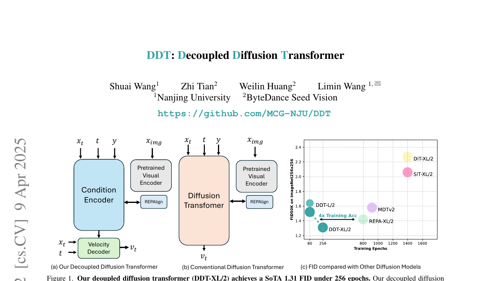
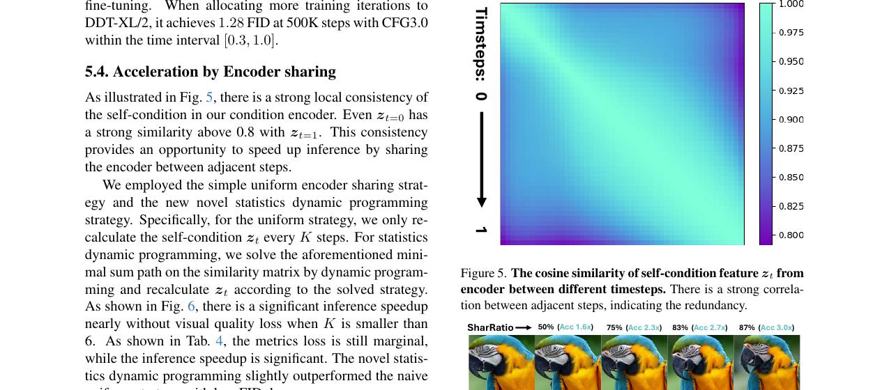

# AI Daily: DDT - Decoupled Diffusion Transformer

**論文標題：** DDT: Decoupled Diffusion Transformer
**作者：** Shuai Wang, Zhi Tian, Weilin Huang, Limin Wang (南京大學, ByteDance Seed Vision)
**發表會議/來源：** CVPR 2026 (arXiv:2504.05741)
**領域：** Image Generation, Diffusion Models, Transformer Architecture
**代碼開源：** [https://github.com/MCG-NJU/DDT](https://github.com/MCG-NJU/DDT)

---

## 核心貢獻和創新點

這篇論文針對當前擴散模型（Diffusion Models）中 Transformer 架構（如 DiT, SiT）面臨的訓練收斂慢和推理成本高的問題，提出了一個全新的**解耦擴散 Transformer (Decoupled Diffusion Transformer, DDT)** 架構。

其核心創新點包括：
1. **解耦的 Encoder-Decoder 架構**：打破了傳統擴散模型中單一 Decoder-only 的設計，將模型拆分為專門負責提取低頻語義的 **Condition Encoder** 和負責解碼高頻細節的 **Velocity Decoder**。
2. **解決優化困境**：傳統架構在同一個模塊中既要編碼低頻語義（需要減少高頻），又要解碼高頻細節，這兩者存在內在的衝突。DDT 的解耦設計成功化解了這個「優化困境 (Optimization Dilemma)」。
3. **動態編碼器共享策略 (Encoder Sharing)**：利用 Encoder 提取的自條件特徵在相鄰時間步之間的高度一致性，提出了一種基於統計動態規劃的共享策略，在幾乎不損失生成質量的情況下顯著加速推理過程。
4. **極致的訓練效率與 SOTA 性能**：DDT-XL/2 模型在 ImageNet 256x256 上僅需 256 個 Epoch 即可達到 1.31 的 FID，訓練收斂速度比之前的擴散 Transformer 快了近 4 倍。在 ImageNet 512x512 上更是達到了 1.28 FID 的新 SOTA 性能。

---

## 技術方法簡述

### 1. 傳統架構的優化困境

在線性流匹配 (Linear Flow Matching) 框架下，隨著噪聲的減少（時間步 $t$ 增加），模型更容易提取語義（因為噪聲變少），但解碼細節的難度卻增加了（因為殘留的高頻細節變多）。傳統的 Diffusion Transformer 使用相同的模塊處理這兩個矛盾的任務，導致了嚴重的性能瓶頸。

### 2. Condition Encoder (條件編碼器)

Condition Encoder 的目標是從帶噪聲的輸入 $\boldsymbol{x}_t$、時間步 $t$ 和類別標籤 $y$ 中提取出低頻的自條件特徵 $\boldsymbol{z}_t$。

$$ \boldsymbol{z}_t = \text{Encoder}(\boldsymbol{x}_t, t, y) $$

為了保證 $\boldsymbol{z}_t$ 在相鄰時間步之間的局部一致性，作者引入了 REPA [1] 中的表示對齊技術 (Representation Alignment)，將 Encoder 輸出的中間特徵 $\mathbf{h}_i$ 與 DINOv2 提取的特徵 $r_*$ 進行對齊：

$$ \mathcal{L}_{enc} = 1 - \cos(r_*, h_\phi(\mathbf{h}_i)) $$

這不僅加速了訓練收斂，還為後續的推理加速奠定了基礎。

### 3. Velocity Decoder (速度解碼器)

Velocity Decoder 接收噪聲輸入 $\boldsymbol{x}_t$、時間步 $t$ 以及 Encoder 提取的自條件特徵 $\boldsymbol{z}_t$ 作為輸入，預測速度場 $\boldsymbol{v}_t$。

$$ \boldsymbol{v}_t = \text{Decoder}(\boldsymbol{x}_t, t, \boldsymbol{z}_t) $$

Decoder 通過 AdaLN-Zero 機制將 $\boldsymbol{z}_t$ 注入到特徵中，並使用標準的流匹配損失 (Flow Matching Loss) 進行訓練：

$$ \mathcal{L}_{dec} = \mathbb{E} \left[ \int_{0}^{1} \| (\boldsymbol{x}_{data} - \epsilon) - \boldsymbol{v}_t \|^2 \mathrm{d}t \right] $$

*圖 1：DDT 的解耦架構設計，包含 Condition Encoder 和 Velocity Decoder。*

### 4. 統計動態規劃加速推理

由於 Encoder 輸出的自條件特徵 $\boldsymbol{z}_t$ 在相鄰時間步之間具有高度的餘弦相似度（如圖 2 所示），作者提出在推理時，不需要每個時間步都重新計算 $\boldsymbol{z}_t$。

他們將尋找最優的重新計算時間步集合 $\Phi$ 轉化為一個經典的最小和路徑問題 (Minimal Sum Path Problem)，並通過統計動態規劃 (Statistic Dynamic Programming) 來求解。這使得模型可以在保持高生成質量的同時，實現顯著的推理加速。

*圖 2：左側為相鄰時間步自條件特徵的餘弦相似度矩陣，呈現出強烈的局部一致性；右側展示了不同共享比例下的生成效果，即使加速 2.7 倍視覺質量依然沒有明顯下降。*

---

## 實驗結果和性能指標

DDT 在 ImageNet 數據集上展現了壓倒性的優勢：

- **ImageNet 256x256**:
  - DDT-XL/2 (22層 Encoder, 6層 Decoder) 在僅僅 **80 個 Epoch** 時就達到了 **1.52 FID**。
  - 訓練到 **256 個 Epoch** 時，達到了 **1.31 FID** 的 SOTA 成績。相比之下，REPA 需要 800 個 Epoch 才能達到 1.42 FID，DDT 實現了近 4 倍的訓練加速。
  - 訓練到 400 個 Epoch 時，進一步達到了 1.26 FID，逼近了 VAE 的極限。

- **ImageNet 512x512**:
  - 基於 256 解析度預訓練模型微調 500K 步後，達到了 **1.28 FID**，大幅超越了之前的 SiT-XL/2 (2.62 FID) 和 REPA-XL/2 (2.08 FID)。

**消融實驗的有趣發現**：作者發現，隨著模型規模的增大，**分配更多層數給 Encoder 會帶來更好的性能**。例如，DDT-L/2 的最佳配置是 20 層 Encoder 和 4 層 Decoder，這打破了傳統模型中對稱或偏重 Decoder 的直覺。

---

## 相關研究背景

DDT 的提出建立在近期幾個重要研究方向之上：
1. **Diffusion Transformers**: 從 DiT [2] 到 SiT [3]，Transformer 架構已經證明了其在擴散模型中的強大潛力，但訓練成本高昂一直是個痛點。
2. **Representation Alignment**: REPA [1] 等工作證明了引入外部視覺先驗（如 DINOv2）來指導擴散模型的特徵學習，可以顯著加速收斂並提升語義理解能力。DDT 巧妙地將其應用於專屬的 Condition Encoder 中。
3. **Training-Free Acceleration**: 像 DeepCache [4] 這樣的方法試圖通過緩存相鄰時間步的特徵來加速 UNet，但 UNet 缺乏強大的表示對齊，特徵一致性較弱。DDT 則通過架構設計和動態規劃，將這種 Training-Free 的加速策略發揮到了極致。

---

## 個人評價和意義

這篇 CVPR 2026 的論文非常精彩，它精準地切中了當前 Diffusion Transformer 架構的核心痛點。將原本混雜在一起的「語義提取」和「細節生成」任務進行解耦，是一個非常直覺但卻極其有效的設計思路。

特別值得關注的幾點啟發：
1. **非對稱的計算資源分配**：論文證明了「重 Encoder、輕 Decoder」的非對稱架構在大模型中表現更好。這與我們在理解圖像時「先抓大體語義，再摳細節」的認知過程非常吻合。
2. **架構設計帶來的免費午餐**：解耦架構不僅解決了訓練難題，其副產品——高度一致的自條件特徵，直接為 Training-Free 的推理加速提供了完美的溫床。這種「一石二鳥」的設計非常優雅。
3. **對未來 Transformer 架構的啟示**：這項工作可能會引發一波對 Diffusion 模型底層架構的重新思考，未來的模型可能會越來越多地採用這種任務解耦的專用模塊設計，而非單一的同質化模塊堆疊。

對於我們近期關注的 Energy-based transformer、JEPA、training-free 和 zero-shot 領域，DDT 中關於**表示對齊（類似 JEPA 的精神）**和**基於特徵一致性的 training-free 加速**的思路，都提供了非常好的借鑒意義。

---

## References

[1] Yu, S., et al. (2024). Representation alignment for generation: Training diffusion transformers is easier than you think. arXiv preprint arXiv:2410.06940.
[2] Peebles, W., & Xie, S. (2023). Scalable diffusion models with transformers. In Proceedings of the IEEE/CVF International Conference on Computer Vision (pp. 4195-4205).
[3] Ma, N., et al. (2024). Sit: Exploring flow and diffusion-based generative models with scalable interpolant transformers. arXiv preprint arXiv:2401.08740.
[4] Ma, X., et al. (2024). Deepcache: Accelerating diffusion models for free. In Proceedings of the IEEE/CVF conference on computer vision and pattern recognition (pp. 15762-15772).
