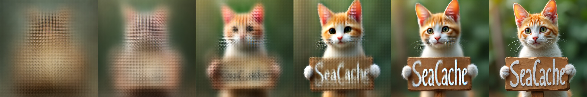

# AI Daily: SeaCache: Spectral-Evolution-Aware Cache for Accelerating Diffusion Models

## 論文基本信息
- **標題**: SeaCache: Spectral-Evolution-Aware Cache for Accelerating Diffusion Models
- **作者**: Jiwoo Chung, Sangeek Hyun, MinKyu Lee, Byeongju Han, Geonho Cha, Dongyoon Wee, Youngjun Hong, Jae-Pil Heo (Sungkyunkwan University, NAVER Cloud)
- **發表會議**: CVPR 2026 (Oral)
- **arXiv 連結**: [2602.18993](https://arxiv.org/abs/2602.18993)

## 核心貢獻與創新點
隨著擴散模型 (Diffusion Models) 和 Rectified-Flow (RF) 模型在視覺生成領域取得巨大成功，其多步迭代去噪過程導致的推理延遲成為實際應用的主要瓶頸。雖然現有許多加速方法（如蒸餾、量化、高效注意力機制），但這些方法通常需要額外的訓練成本或修改模型架構。

近期基於快取 (Caching) 的加速方法（如 TeaCache, DiCache）透過重用相鄰時間步 (timesteps) 的特徵來減少前向傳播次數，且無需重新訓練 (training-free)。然而，**現有動態快取策略直接在原始特徵空間中測量距離，忽略了擴散模型的「頻譜演化 (Spectral Evolution)」先驗特性**。

**SeaCache 的核心創新在於**：
1. 提出了**頻譜演化感知快取 (Spectral-Evolution-Aware Cache, SeaCache)**，這是一種無需訓練、即插即用的動態快取排程策略。
2. 引入了 **SEA Filter**：基於最優線性去噪器的理論推導，設計了一個隨時間步變化的頻域濾波器。該濾波器能放大與內容相關的低頻信號 (Signal)，同時抑制由隨機變化主導的高頻噪聲 (Noise)。
3. 透過在 SEA 濾波後的特徵空間中測量相鄰時間步的距離來決定是否重用快取，使得快取決策更聚焦於生成內容的實質變化，而非隨機噪聲的擾動。

*(上圖：SeaCache 概念圖。展示了模型在去噪過程中的頻譜演化，以及 SEA Filter 如何將特徵轉換到更適合評估內容變化的空間。)*

## 技術方法簡述

### 1. 頻譜演化先驗 (Spectral Evolution Prior)
擴散模型在生成過程中展現出明顯的頻譜演化特性：早期的時間步主要建立低頻的全局結構 (low-frequency structure)，而後期的時間步則專注於細化高頻細節 (high-frequency detail)。如果直接計算相鄰時間步原始特徵的 $\ell_1$ 距離，高頻噪聲的變化會干擾距離測量，導致快取決策不準確。

### 2. Spectral-Evolution-Aware (SEA) Filter
為了解決這個問題，作者從最優線性最小均方誤差 (MMSE) 估計器出發，推導出時間步依賴的頻率響應 $G_t(f)$。在線性混合模型 $x_t = a_t x_0 + b_t \epsilon$ 下，最優頻率響應具有類似 Wiener filter 的形式：

$$ G_t(f) = \frac{a_t S_x(f)}{a_t^2 S_x(f) + b_t^2} $$

其中 $S_x(f)$ 是乾淨樣本 $x_0$ 在頻率 $f$ 的功率譜。這個濾波器在早期時間步主要通過低頻信號，在後期逐漸允許高頻信號通過，完美契合了擴散模型的頻譜演化特性。

### 3. 特徵濾波與距離計算
為了讓不同時間步的濾波特徵具有可比性，作者對 $G_t(f)$ 進行了密度歸一化，得到 $G_t^{\text{norm}}(f)$，確保其在所有徑向頻率上的平均增益為常數。

SeaCache 將這個歸一化的 SEA Filter 應用於模型的中間特徵（例如 Transformer 第一層的輸入 $I_t$）：

$$ \mathcal{P}(G_t^{\text{norm}}, I_t) = \text{iFFT}\left( G_t^{\text{norm}}(f) \odot \text{FFT}(I_t) \right) $$

然後，在濾波後的特徵空間中計算相鄰時間步的相對 $\ell_1$ 距離：

$$ \tilde{\Delta}_t = \frac{\| \mathcal{P}(G_t^{\text{norm}}, I_t) - \mathcal{P}(G_{t+1}^{\text{norm}}, I_{t+1}) \|_1}{\| \mathcal{P}(G_{t+1}^{\text{norm}}, I_{t+1}) \|_1} + \xi $$

最後，採用與 TeaCache 類似的累積距離閾值策略：當累積的 $\tilde{\Delta}_t$ 超過預設閾值 $\delta$ 時，執行完整的前向傳播並更新快取；否則直接重用上一次的快取特徵。

## 實驗結果和性能指標

作者在三個最先進的視覺生成模型上進行了廣泛評估：**FLUX.1-dev** (Text-to-Image), **HunyuanVideo** (Text-to-Video), 和 **Wan2.1 1.3B** (Text-to-Video)。

### 定量結果
*   **FLUX.1-dev**: 在相似的計算預算下（約 30% 和 50% 的刷新率），SeaCache 的 PSNR、SSIM 均顯著高於 TeaCache 和 TaylorSeer，同時 LPIPS 更低。在 CycleReward 人類偏好指標上也獲得了最佳的平均排名。
*   **HunyuanVideo & Wan2.1**: 在影片生成任務中，SeaCache 同樣展現了卓越的 Latency-Quality Trade-off。例如在 HunyuanVideo 上，SeaCache 在更低的延遲下，PSNR 比最強基準方法高出約 8 dB。

### 定性結果
SeaCache 能夠更好地保留原始模型生成的語義內容和感知質量。在較激進的加速設定下，TeaCache 和 TaylorSeer 經常會遺失 prompt 中要求的文字細節或改變物體顏色，而 SeaCache 則能忠實地還原完整計算 (full-compute) 軌跡的生成結果。

## 相關研究背景
*   **Training-free Acceleration**: 如 DeepCache, TeaCache, DiCache 等，透過重用 U-Net 或 DiT 網路中相鄰時間步的特徵來加速推理。SeaCache 是這類方法的延伸，但創新性地將距離測量轉移到了頻域。
*   **Spectral Analysis in Diffusion**: 先前已有研究 (如 Beta Sampling is All You Need) 觀察到擴散模型的頻譜演化現象，但 SeaCache 是首次將此物理先驗直接且優雅地整合到動態快取排程中。

## 個人評價和意義
SeaCache 是一篇極具啟發性的工作。在當前 training-free 加速方法（如 TeaCache）逐漸遇到瓶頸時，本文沒有選擇設計更複雜的預測器，而是回歸到擴散模型的本質——頻譜演化。透過引入一個簡單的 FFT/iFFT 濾波操作，就優雅地解決了「原始特徵距離無法準確反映內容變化」的痛點。

對於近期關注的 training-free、attention modulation 和 zero-shot 領域，SeaCache 提供了一個重要視角：**在對特徵進行操作（如快取、融合、替換）時，考慮頻域特性和時間步的對齊往往比單純的空間域操作更穩健**。這種基於物理先驗的設計思路，不僅實現了 CVPR 2026 Oral 級別的效能提升，也為未來設計更高效的 DiT/VAR 採樣策略打開了新大門。
