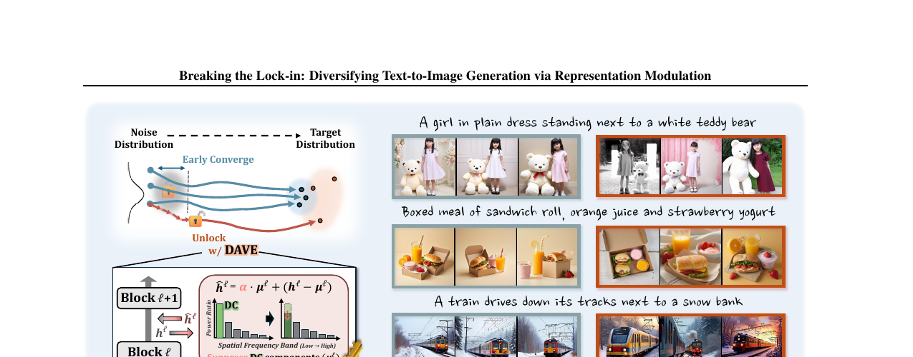
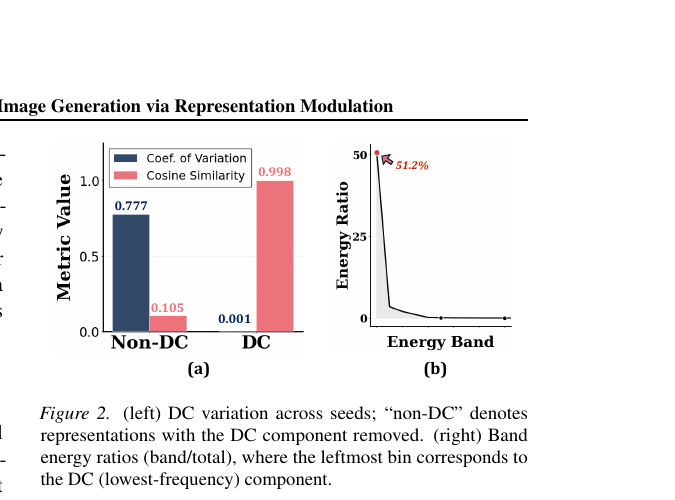
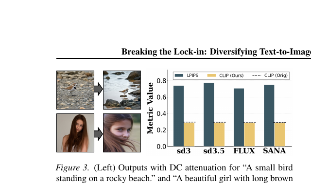
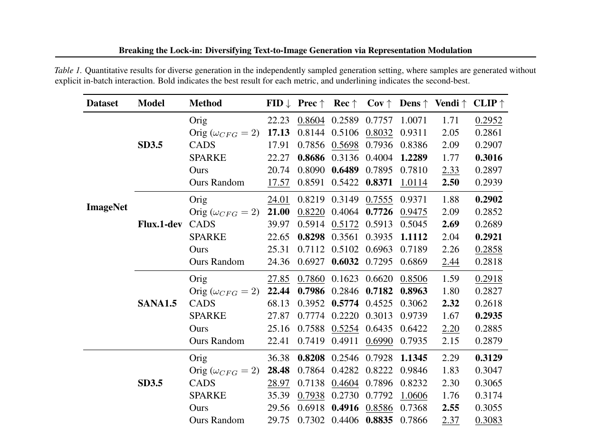
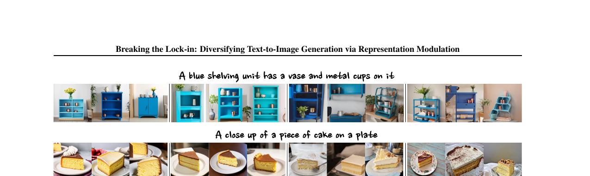

# AI Daily

## Breaking the Lock-in: Diversifying Text-to-Image Generation via Representation Modulation

### 論文基本信息
*   **論文標題**：Breaking the Lock-in: Diversifying Text-to-Image Generation via Representation Modulation
*   **作者**：Dahee Kwon, Haeun Lee, Jaesik Choi
*   **發表會議/期刊**：ICML 2026
*   **arXiv 連結**：[arXiv:2606.06813](https://arxiv.org/abs/2606.06813)
*   **代碼開源**：[GitHub](https://github.com/daheekwon/DAVE)

### 論文核心貢獻和創新點
這篇論文主要解決了當前基於 Transformer 的大規模文本到圖像（Text-to-Image, T2I）生成模型（特別是 Flow-based 模型）在給定固定提示詞時，生成的圖像樣本往往過於相似、多樣性不足的問題。現有的增強多樣性方法通常需要額外的採樣步驟或輔助優化，帶來了不可忽視的計算開銷。

**核心創新點**：
1.  **發現了「早期 DC 鎖定（Early DC Lock-in）」現象**：作者深入分析了 Transformer 的內部特徵，發現在生成的早期階段，不同隨機種子下的零頻率空間平均值（即 DC 分量）會迅速收斂。這種早期軌跡的鎖定限制了後續生成過程中的結構變化。
2.  **提出了 DAVE (DC Attenuation for diVersity Enhancement)**：這是一種**免訓練（Training-free）**的表示層干預方法。通過在生成早期選擇性地衰減 DC 分量，DAVE 能夠打破這種早期鎖定。
3.  **高效且高質量**：DAVE 在幾乎不增加計算開銷的情況下，顯著提升了與提示詞一致的多樣性，同時保持了極具競爭力的圖像質量。

*圖 1：DAVE 方法概覽。與原始模型相比，DAVE 能夠在極小計算代價下生成更多樣化的圖像。*

### 技術方法簡述

#### 1. 早期 DC 漂移（Early DC Drift）的發現
在 Flow matching 的生成過程中，Transformer block 的隱藏狀態 $h_t^{(\ell)}$ 在不同噪聲種子下表現出系統性的全局偏差。具體來說，DC 分量（零頻率分量）在跨樣本間高度對齊。

*圖 2：跨種子的 DC 變化與能量帶分佈。左圖顯示 DC 分量在不同種子間具有極高的餘弦相似度。*

這種現象源於神經網絡的頻譜偏差（Spectral Bias）——傾向於優先學習低頻信號。在早期採樣步驟（信噪比 SNR 較低）時，MSE 目標會驅使模型預測數據的條件期望。由於高頻細節在不同種子間被平均掉，DC 分量成為全局統計的穩健線索，從而過早地確立了全局佈局。

#### 2. DAVE：DC 衰減以增強多樣性
為了打破這種過早的結構承諾，DAVE 提出在早期採樣步驟中選擇性地衰減 DC 分量。

對於視覺 token 數量為 $D$、通道維度為 $C$ 的隱藏表示 $h_t^{(\ell)} \in \mathbb{R}^{D \times C}$，其 DC 分量 $\mu_t^{(\ell)}$ 可以直接通過空間平均計算得出，無需顯式的頻域變換：

$$
\mu_t^{(\ell)} = \frac{1}{D} \sum_{d=1}^{D} h_t^{(\ell)}[d, :] \in \mathbb{R}^{1 \times C}
$$

DAVE 在早期生成階段（$t < \tau$）對選定的 Transformer blocks $\ell \in \mathcal{L}$ 進行干預：

$$
\hat{h}_t^{(\ell)} = \alpha \cdot \mu_t^{(\ell)} + \left( h_t^{(\ell)} - \mu_t^{(\ell)} \right)
$$

其中，$\alpha \in (0, 1)$ 是控制衰減強度的係數。通過減弱早期的 DC 分量，DAVE 阻止了模型過早地錨定在一個共同的結構基準上，從而放大了特定種子的空間殘差的相對影響力。

*圖 3：DC 衰減對生成圖像的影響。左側為應用 DAVE 後的輸出，右側顯示其在感知變化和文本對齊方面的表現。*

### 實驗結果和性能指標

作者在 Stable Diffusion 3.5、FLUX.1-dev 和 SANA1.5 等代表性模型上驗證了 DAVE。

*   **多樣性提升**：在 ImageNet 和 MS-COCO 數據集上，DAVE 顯著提升了 Recall、Coverage 和 Vendi Score 等多樣性指標。
*   **質量保持**：與 CADS 等基線方法相比，DAVE 在提升多樣性的同時，更好地保持了 Precision 和 CLIP 分數（文本-圖像對齊度）。
*   **免訓練與低開銷**：作為一種純推理期的表示層調製方法，DAVE 不需要修改採樣 pipeline 或進行輔助優化，計算效率極高。

*表 1：獨立採樣生成設置下的定量結果比較。DAVE 在多樣性與質量的權衡上表現優異。*

*圖 4：在 Stable Diffusion 3 上的定性比較。DAVE 生成的樣本在佈局和對象外觀上變化豐富，同時嚴格遵守提示詞。*

### 相關研究背景
近年來，T2I 模型的多樣性崩塌問題受到了廣泛關注。現有的解決方案主要分為兩類：
1.  **批次內多樣化（Batch-wise diversification）**：如 Particle Guidance (PG)、DiverseFlow、SPELL 和 OSCAR。這些方法通過在批次內引入排斥力或優化多樣性目標來促使樣本發散，但通常會帶來較大的計算和內存開銷。
2.  **個體軌跡操縱（Individual trajectory manipulation）**：如 CADS，通過在早期推理中向文本條件注入噪聲來防止過度依賴提示詞。然而，這類方法往往只是採樣層面的啟發式策略，並未深入探究多樣性崩塌的內部機制。

DAVE 則屬於**內部表示分析與調製**的範疇，通過精確定位並干預導致同質化的內部特徵（早期 DC 分量），實現了高效的多樣性增強。

### 個人評價和意義
這篇 ICML 2026 的論文非常精彩。它不僅僅提出了一個 empirical 的 trick，而是深入到了 Transformer 的內部表示，找出了導致生成多樣性匱乏的「罪魁禍首」——早期 DC 分量的過早收斂（Lock-in）。

DAVE 方法的最大亮點在於其**極致的簡潔性和 Training-free 的特性**。僅僅通過一個簡單的空間平均和縮放操作（公式 5），就能在不破壞模型原有能力的情況下，釋放出噪聲種子應有的隨機性。這種「四兩撥千斤」的 Attention/Representation Modulation 思路非常值得借鑒。對於我們近期關注的 zero-shot 和 training-free 調控研究，這篇論文提供了一個極佳的範例：**理解模型的內部動態往往比設計複雜的外部約束更為有效**。
