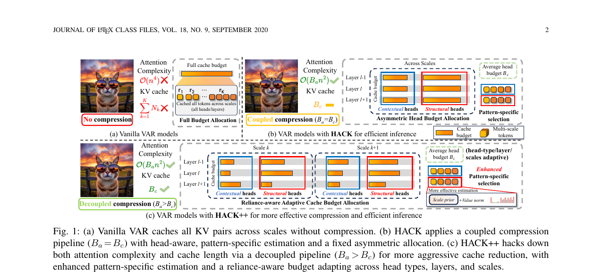
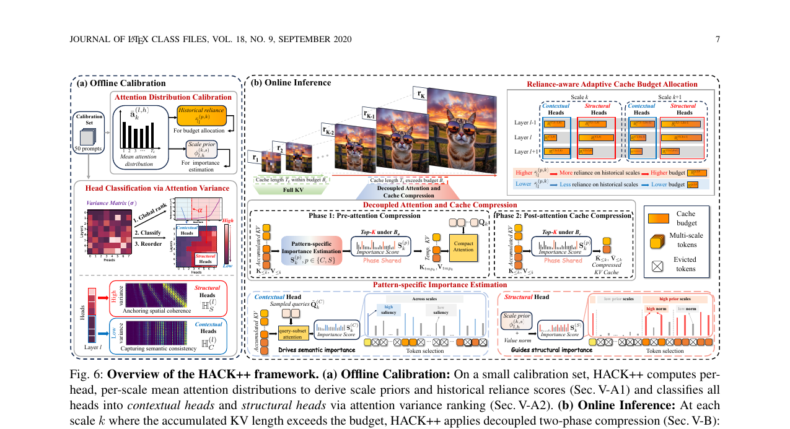
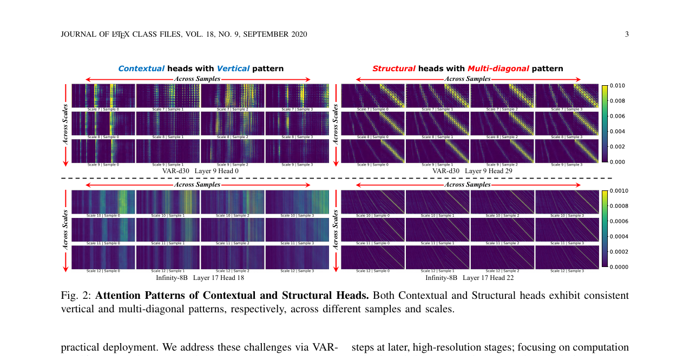
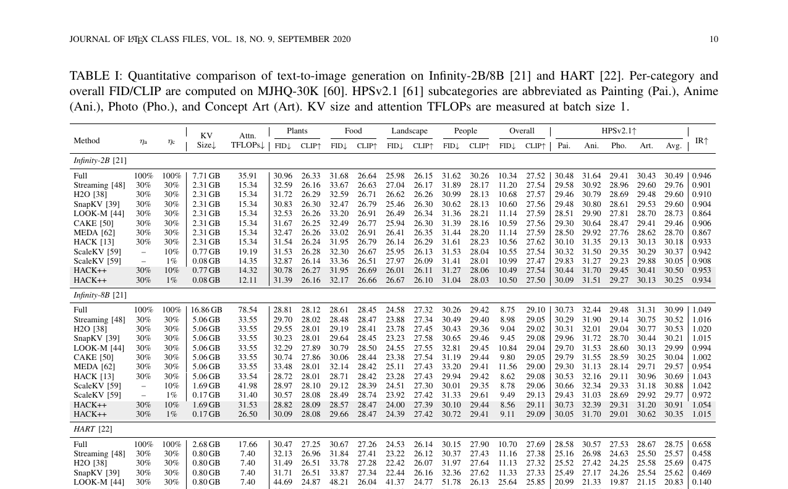

# AI Daily

## HACK++: Towards More Effective Head-Aware Key-Value Compression for Efficient Visual Autoregressive Modeling

### 論文基本信息

*   **論文標題**：HACK++: Towards More Effective Head-Aware Key-Value Compression for Efficient Visual Autoregressive Modeling
*   **作者**：Ziran Qin, Yuchen Jiang, Mingbao Lin, Youru Lv, Hang Guo, Fei Wen, Weiyao Lin
*   **機構**：上海交通大學 (SJTU)、樂天研究院 (Rakuten)、清華大學
*   **arXiv 連結**：[arXiv:2606.08302](https://arxiv.org/abs/2606.08302)
*   **發表時間**：2026-06-06（arXiv 預印本，期刊擴展版）
*   **領域**：Visual Autoregressive Modeling (VAR)、KV Cache Compression、Training-Free Acceleration

---

### 論文核心貢獻和創新點

Visual Autoregressive (VAR) 模型將圖像生成重新表述為 next-scale 預測，每一步生成一整張 token map，顯著提升了生成速度。然而，VAR 的多尺度架構需要累積跨尺度的 Key-Value (KV) cache，導致注意力計算複雜度隨尺度數 $K$ 呈 $\mathcal{O}(n^4)$ 增長，成為高解析度生成的嚴重瓶頸。現有針對 LLM 設計的 KV 壓縮方法（如 StreamingLLM、SnapKV、H2O）直接套用在 VAR 上會導致嚴重的生成質量下降，根本原因在於 VAR 的視覺注意力動態與語言模型截然不同。

本文提出 **HACK++**，一個專為 VAR 模型設計的 training-free、head-aware KV cache 壓縮框架。核心創新點包括：

1.  **揭示 VAR 注意力頭的二元性（Dichotomous Attention Heads）**：作者通過系統性分析發現，VAR 模型的注意力頭可以穩定地分為兩類功能截然不同的類型——**Contextual Heads（語境頭）** 呈現垂直條紋狀注意力模式，負責維持全局語義一致性；**Structural Heads（結構頭）** 呈現多對角線狀注意力模式，負責跨尺度的空間位置對應。這種二元性是模型訓練後的內在屬性，與任務和樣本無關。
2.  **解耦注意力與 Cache 壓縮（Decoupled Compression）**：前作 HACK 將注意力計算與 KV cache 存儲綁定在同一預算下，造成兩者相互制約。HACK++ 將二者解耦，分別使用獨立預算 $B_a$（注意力）和 $B_c$（cache），允許 cache 被更激進地壓縮（$B_c < B_a$）而不損害當前步的注意力質量。
3.  **特定模式的重要性估計（Pattern-Specific Importance Estimation）**：針對兩類頭的不同功能，設計了各自適配的 token 重要性評估策略，大幅降低計算開銷。
4.  **依賴感知的自適應預算分配（Reliance-Aware Adaptive Budget Allocation）**：根據不同頭、層、生成步驟對歷史尺度的實際依賴程度，動態分配 KV cache 預算，避免在低依賴的 cache 上浪費容量。

---

### 技術方法簡述

#### 1. VAR 注意力頭的二元性分析

作者首先通過遮蔽實驗（Head Masking）驗證了兩類頭的功能差異：遮蔽 Contextual Heads 會導致語義內容崩塌（無法生成提示詞指定的物體），而遮蔽 Structural Heads 則導致幾何變形（整體語義保留但空間結構錯亂）。

進一步分析表明，注意力的集中程度（熵）隨生成步驟遞減，且 KV cache 中大量歷史 token 對後續步驟的實際注意力貢獻遠低於其佔用的存儲比例，存在顯著的「冗餘差距（Redundancy Gap）」。這兩個觀察共同說明：注意力計算和 KV cache 存儲面臨不同程度的冗餘，應當被分別壓縮。

*圖 1：三種方案對比。(a) 原始 VAR 無壓縮，注意力複雜度 $\mathcal{O}(n^4)$；(b) HACK 耦合壓縮（$B_a = B_c$）；(c) HACK++ 解耦壓縮（$B_a > B_c$），實現更激進的 cache 縮減。*

#### 2. 解耦的兩階段壓縮

HACK++ 在每個生成步驟 $k$ 中，當累積 KV 長度 $T_k$ 超過預算時，執行兩個獨立的壓縮階段：

**Phase 1：Pre-attention Compression（注意力前壓縮）**

根據重要性分數 $\mathbf{S}_k^{(p)}$ 從累積 KV 狀態中選取 top-$B_a$ 個 token，形成一個*臨時*子集，僅用於當前尺度的注意力計算：

$$
\mathbf{K}_{tmp_k}^{(p)},\ \mathbf{V}_{tmp_k}^{(p)} = \mathrm{TopK}\!\left(\mathbf{K}_{\leq k}^{(p)},\ \mathbf{V}_{\leq k}^{(p)},\ \mathbf{S}_k^{(p)},\ B_a\right)
$$

注意力輸出為：

$$
\mathbf{O}_k^{(p)} = \mathrm{Softmax}\!\left(\mathbf{Q}_k^{(p)}\left(\mathbf{K}_{tmp_k}^{(p)}\right)^\top\right)\mathbf{V}_{tmp_k}^{(p)}
$$

此步驟將當前尺度的注意力複雜度限制在 $\mathcal{O}(B_a n^2)$，且臨時子集在計算後即丟棄，不影響 cache 存儲。

**Phase 2：Post-attention Cache Compression（注意力後 Cache 壓縮）**

注意力計算完成後，HACK++ 獨立地從累積狀態中選取 top-$B_c^{(p,l,k)}$ 個 token 作為保留給後續尺度的 cache：

$$
\bar{\mathbf{K}}_{\leq k}^{(p)},\ \bar{\mathbf{V}}_{\leq k}^{(p)} = \mathrm{TopK}\!\left(\mathbf{K}_{\leq k}^{(p)},\ \mathbf{V}_{\leq k}^{(p)},\ \mathbf{S}_k^{(p)},\ B_c^{(p,l,k)}\right)
$$

由於 $B_c < B_a$，cache 可以被更激進地壓縮。兩個階段共用同一組重要性分數 $\mathbf{S}_k^{(p)}$，無需額外計算。

*圖 2：HACK++ 完整框架。(a) 離線校準：在 50 個樣本上計算每個頭的注意力分佈，用於分類頭類型和估計歷史依賴；(b) 在線推理：兩階段解耦壓縮流程，以及 Reliance-aware 的自適應預算分配。*

#### 3. 特定模式的重要性估計

兩類頭的功能差異要求使用不同的 token 重要性評估策略：

**Contextual Heads（語境頭）**：採用 Query-Subset Attention。均勻採樣 $N_{\mathrm{obs}}$ 個 query，計算其對歷史 KV 的注意力，再通過 MaxPool 提取空間連續的語義顯著區域：

$$
\mathbf{S}_k^{(C)}[j] = \mathrm{MaxPool}\!\left(\frac{1}{N_{\mathrm{obs}}}\sum_{i=1}^{N_{\mathrm{obs}}}\tilde{\mathbf{A}}_k^{(C)}[i,j]\right)
$$

**Structural Heads（結構頭）**：結合離線校準的跨尺度先驗因子 $\phi_{l,h}^{(k,s)}$（Scale-prior）與在線的 Value norm，完全無需 query-key 注意力計算，開銷極低：

$$
\mathbf{S}_k^{(S)}[j] = \phi_{l,h}^{(k,s)}(j) \cdot \left\|\mathbf{V}_{\leq k}^{(S)}[j]\right\|_2
$$

*圖 3：Contextual Heads 與 Structural Heads 的注意力模式。Contextual Heads（左）呈垂直條紋，跨樣本和尺度高度一致；Structural Heads（右）呈多對角線，反映跨尺度的空間位置對應關係。*

#### 4. 依賴感知的自適應預算分配

不同頭對歷史信息的依賴程度隨層數和生成步驟顯著變化。HACK++ 定義歷史依賴分數 $\gamma_{l,h}^{(k)}$，衡量頭 $(l, h)$ 在步驟 $k$ 後的 cache 對後續所有步驟的平均注意力貢獻：

$$
\gamma_{l,h}^{(k)} = \sum_{k'=k+1}^{K} \frac{1}{|\mathcal{T}_{<k'}|} \sum_{j \in \mathcal{T}_{<k'}} \bar{\mathbf{a}}_{k'}^{(l,h)}[j]
$$

在離線校準階段預計算各組的平均依賴分數 $\bar{\gamma}_l^{(p,k)}$ 後，HACK++ 在推理時根據此分數自適應地分配 cache 預算 $B_c^{(p,l,k)}$，使高依賴的頭獲得更多 cache 容量：

$$
B_c^{(p,l,k)} \propto \left(\bar{\gamma}_l^{(p,k)}\right)^\tau, \quad \text{s.t.} \quad \frac{1}{LH}\sum_{l=1}^{L}\sum_{p \in \{C,S\}} |\mathbb{H}_p^{(l)}| \cdot B_c^{(p,l,k)} = B_c
$$

---

### 實驗結果和性能指標

HACK++ 在七個 VAR 模型上進行了廣泛評估，涵蓋文本到圖像（Infinity-2B/8B、HART）、類別條件生成（VAR-d24、VAR-d30）以及統一理解與生成（VARGPT-v1.1、OneCAT-3B）三個任務範式。

*表 1：在 Infinity-2B/8B 和 HART 上的文本到圖像生成定量比較。HACK++ 在所有模型和壓縮率下均取得最優的質量-效率平衡。*

主要實驗結論如下：

*   **極致的內存與計算縮減**：在 Infinity-8B 上，設置 $\eta_a = 30\%$、$\eta_c = 10\%$ 時，HACK++ 將 KV Cache 從 16.86 GB 縮減至 **1.69 GB**，Attention TFLOPs 從 78.54 降至 **31.53**，吞吐量提升 **1.52×**，內存節省 **2.04×**。
*   **極限壓縮下的近無損質量**：在 Infinity-8B 上，即便 KV cache 被壓縮至 **1%**（$\eta_c = 1\%$，僅 0.17 GB），HACK++ 仍能保持 IR = 1.015、FID = 30.05，遠優於 StreamingLLM、SnapKV、H2O 等 LLM 壓縮方法。
*   **對結構敏感任務的魯棒性**：在類別條件生成（VAR-d30）上，其他方法在高壓縮率下普遍出現幾何變形，而 HACK++ 憑借對 Structural Heads 的精準保護，有效維持了空間結構完整性。
*   **跨範式的廣泛適用性**：在統一理解與生成模型（VARGPT、OneCAT）上，HACK++ 同樣展現了強大的壓縮效果，驗證了其作為通用 VAR 壓縮框架的潛力。

---

### 相關研究背景

*   **VAR（Visual Autoregressive）Models**：以 VAR、Infinity、HART 為代表，將圖像表示為多尺度 token map 序列，採用 next-scale 預測範式。相比傳統 next-token 預測（如 VQGAN+AR），VAR 的並行解碼顯著提升了生成速度，但也帶來了跨尺度 KV cache 累積的新瓶頸。
*   **LLM KV Cache Compression**：包括基於 Token Eviction 的 StreamingLLM、H2O、SnapKV，以及基於 Token Merging 的 LOOK-M、MEDA 等。這些方法均針對 LLM 的語言注意力模式設計，無法直接遷移到 VAR 的視覺注意力動態。
*   **VAR 加速研究**：ScaleKV 是近期的並行工作，通過層級的 cache 壓縮減少內存，但其耦合設計限制了對注意力計算的優化。HACK++ 通過解耦設計同時解決了內存和計算兩個瓶頸，且在更多模型和任務上進行了驗證。

---

### 個人評價和意義

HACK++ 是一篇極具啟發性的系統級優化工作，其最精彩之處在於**「基於機制理解的精準設計」**。

**對 Attention 機制的深刻洞察**。作者沒有盲目套用 LLM 的壓縮策略，而是先花大量篇幅分析 VAR 模型中注意力頭的行為，發現了 Contextual 和 Structural 兩種截然不同的功能分化。這種「語義與空間結構解耦」的現象，與近期許多關於 Diffusion Transformer 內部機制的研究不謀而合——模型在訓練過程中自發地將不同功能分配給不同的注意力頭，這是一種普遍存在的自組織現象。這啟示我們：在設計任何 training-free 的干預方法時，必須先理解並尊重模型自發學習到的內部特徵空間劃分。

**Decoupled Compression 的通用哲學**。將「當前步的計算需求」與「長期的記憶存儲需求」解耦，這是一個非常通用的設計理念。在處理長上下文或複雜生成任務時，我們常常陷入「既要算得快又要存得少」的兩難困境，解耦設計為這類問題提供了一個優雅的解法，值得在其他架構中借鑒。

**與 Training-free Attention Modulation 的共鳴**。HACK++ 完全 training-free，僅依賴輕量級的離線校準（50 個樣本，數分鐘內完成）和巧妙的啟發式指標（value norm 和 query-subset attention）。這種通過理解模型內部動態來實現高效控制的思路，與 Energy-based Transformer 中對注意力場的分析，以及近期許多 zero-shot attention modulation 的工作有異曲同工之妙。

**對未來研究的啟發**。VAR 模型的 Structural Heads 展現出強烈的跨尺度空間對應關係，這一特性或許可以被主動利用——如果我們能直接調製 Structural Heads 的 attention map，是否就能在 VAR 架構下實現類似 Diffusion 中 ControlNet 或 Prompt-to-Prompt 的**免訓練可控生成**效果？這是一個非常值得深入探索的方向。
