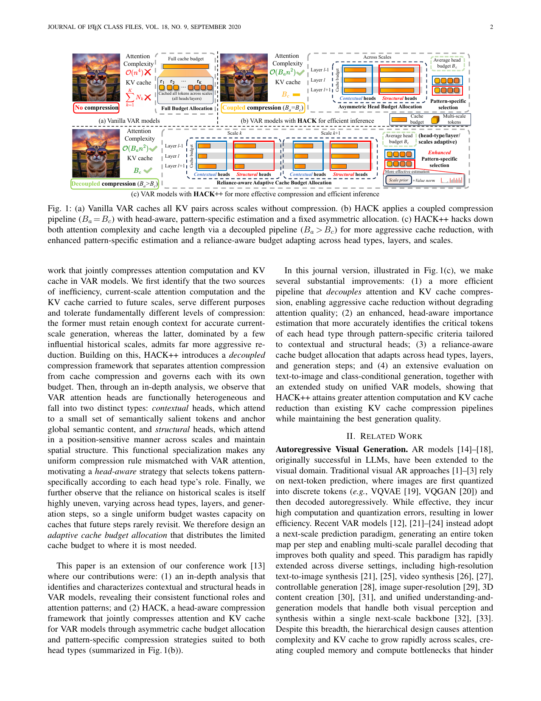
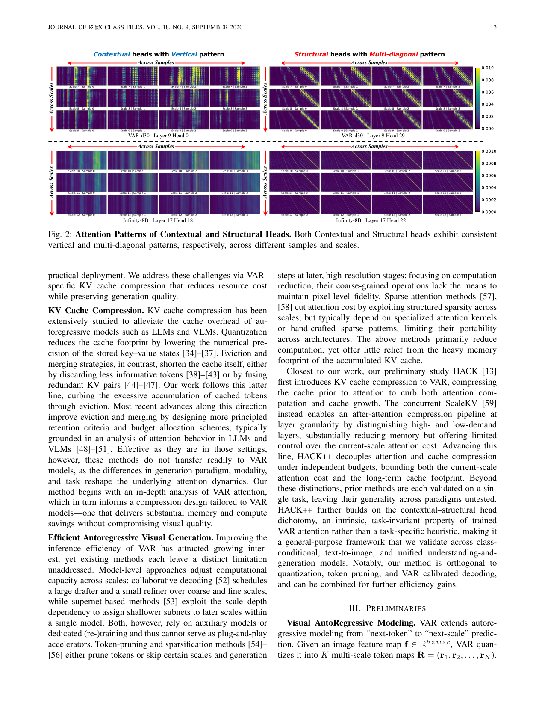

# AI Daily

## HACK++: Towards More Effective Head-Aware Key-Value Compression for Efficient Visual Autoregressive Modeling

### 論文基本信息
- **標題**: HACK++: Towards More Effective Head-Aware Key-Value Compression for Efficient Visual Autoregressive Modeling
- **作者**: Ziran Qin, Yuchen Jiang, Mingbao Lin, Youru Lv, Hang Guo, Fei Wen, Weiyao Lin (Shanghai Jiao Tong University, Rakuten, Tsinghua University)
- **機構**: 上海交通大學、樂天、清華大學
- **發表時間**: 2026-06-06 (arXiv)
- **領域**: Visual Autoregressive Modeling (VAR), KV Cache Compression, Training-free
- **論文鏈接**: [https://arxiv.org/abs/2606.08302](https://arxiv.org/abs/2606.08302)

---

### 核心貢獻和創新點

Visual Autoregressive (VAR) 模型將圖像生成轉化為 next-scale 預測，顯著減少了生成步驟。然而，VAR 累積跨尺度的 Key-Value (KV) cache 會導致嚴重的注意力計算複雜度和內存開銷。現有針對 LLM 的 KV 壓縮方法直接套用在 VAR 模型上會導致嚴重的質量下降。

本文提出了 **HACK++**，一個專為 VAR 模型設計的 training-free、head-aware 的 KV cache 壓縮框架。其核心創新點包括：

1. **揭示 VAR 注意力頭的二元性 (Dichotomous Attention Heads)**：作者發現 VAR 模型的注意力頭可以穩定地分為兩類：
   - **Contextual Heads (語境頭)**：關注少數與語義相關的 token，負責維持全局語義一致性（呈現垂直條紋狀注意力模式）。
   - **Structural Heads (結構頭)**：關注跨尺度的空間對應位置，負責維持空間連貫性（呈現多對角線狀注意力模式）。
2. **解耦注意力與 Cache 壓縮 (Decoupled Compression)**：將「當前尺度的注意力計算」與「為未來尺度保留的 KV cache」解耦，分別使用獨立的預算 ($B_a$ 和 $B_c$) 進行壓縮，從而允許對 cache 進行更激進的壓縮而不影響當前步的注意力質量。
3. **特定模式的重要性估計 (Pattern-Specific Importance Estimation)**：針對 Contextual heads 使用 query-subset attention 來動態捕捉語義；針對 Structural heads 使用離線計算的 scale-prior 結合在線的 value norm 來選擇空間錨點，大幅降低計算開銷。
4. **依賴感知的自適應預算分配 (Reliance-Aware Adaptive Budget Allocation)**：根據不同注意力頭、不同層以及不同生成步驟對歷史尺度的依賴程度，動態分配 KV cache 預算。

---

### 技術方法簡述

#### 1. 解耦的兩階段壓縮 (Decoupled Two-Phase Compression)

HACK++ 突破了前作 HACK 將注意力與 cache 壓縮綁定的限制，採用了兩階段策略：

- **Phase 1: Pre-attention compression (注意力前壓縮)**
  當累積的 KV 長度 $T_k$ 超過注意力預算 $B_a$ 時，根據重要性分數 $\mathbf{S}_k^{(p)}$ 選擇 top-$B_a$ 的 token 形成一個*臨時*的緊湊子集，僅用於當前尺度的注意力計算：
  $$ \mathbf{K}_{tmp_k}^{(p)}, \mathbf{V}_{tmp_k}^{(p)} = \text{TopK}\left(\mathbf{K}_{\leq k}^{(p)}, \mathbf{V}_{\leq k}^{(p)}, \mathbf{S}_k^{(p)}, B_a\right) $$
  這限制了當前步的計算成本為 $\mathcal{O}(B_a n^2)$。

- **Phase 2: Post-attention cache compression (注意力後 Cache 壓縮)**
  注意力計算完成後，HACK++ 獨立地從累積狀態中選擇 top-$B_c^{(p,l,k)}$ 的 token 作為保留給後續尺度的 cache：
  $$ \bar{\mathbf{K}}_{\leq k}^{(p)}, \bar{\mathbf{V}}_{\leq k}^{(p)} = \text{TopK}\left(\mathbf{K}_{\leq k}^{(p)}, \mathbf{V}_{\leq k}^{(p)}, \mathbf{S}_k^{(p)}, B_c^{(p,l,k)}\right) $$
  這使得 cache 可以被激進地壓縮（$B_c < B_a$）。

*(HACK++ 解耦壓縮與傳統 VAR 的對比)*

#### 2. 特定模式的重要性估計

- **Contextual Heads (語境頭)**：採用 Query-subset attention。均勻採樣 $N_{\text{obs}}$ 個 query，計算其對歷史 KV 的注意力，然後通過 MaxPool 提取空間連續的語義顯著區域：
  $$ \mathbf{S}_k^{(C)}[j] = \text{MaxPool}\left(\frac{1}{N_{\text{obs}}}\sum_{i=1}^{N_{\text{obs}}}\tilde{\textbf{A}}_k^{(C)}[i,j]\right) $$

- **Structural Heads (結構頭)**：結合離線校準的跨尺度先驗 (Scale-prior factor, $\omega_{l,h}^{(k)}$) 與在線的 Value norm，完全無需 query-key 注意力計算，開銷極低：
  $$ \mathbf{S}_k^{(S)}[j] = \omega_{l,h}^{(k)}(j) \cdot \|\mathbf{V}_{\leq k}^{(S)}[j]\|_2 $$

*(Contextual Heads 與 Structural Heads 的注意力模式對比)*

#### 3. 依賴感知的預算分配

不同頭對歷史信息的依賴隨層數和生成步驟變化。HACK++ 定義了歷史依賴分數 $\gamma_{l,h}^{(k)}$，衡量一個頭的 cache 在後續步驟中的平均貢獻：
$$ \gamma_{l,h}^{(k)} = \sum_{k'=k+1}^K \frac{1}{|\mathcal{T}_{<k'}|} \sum_{j \in \mathcal{T}_{<k'}} \bar{\mathbf{a}}_{k'}^{(l,h)}[j] $$
然後根據各組的平均依賴分數 $\bar{\gamma}_l^{(p,k)}$ 自適應地分配 cache 預算 $B_c^{(p,l,k)}$。

---

### 實驗結果和性能指標

HACK++ 在文本到圖像 (Infinity-2B/8B, HART)、類別條件生成 (VAR-d24, VAR-d30) 以及統一理解與生成模型 (VARGPT, OneCAT) 上均進行了廣泛評估。

- **極致的內存與計算縮減**：
  - 在 Infinity-8B 上，當設置 $\eta_a=30\%, \eta_c=10\%$ 時，HACK++ 將 KV Cache 從 16.86 GB 縮減到 **1.69 GB**，Attention TFLOPs 從 78.54 降至 **31.53**。
  - 吞吐量提升至 **1.52x**，內存節省 **2.04x**。
- **無損的生成質量**：
  - 在 Infinity-8B 上，即便 KV cache 被極限壓縮到 **1%** ($\eta_c=1\%$, 0.17 GB)，HACK++ 仍能保持極高的生成質量 (IR=1.015, FID=30.05)，遠超現有的 LLM 壓縮方法（如 StreamingLLM, SnapKV, H2O）。
  - 對於結構敏感的類別條件生成 (VAR-d30)，HACK++ 同樣展現了強大的魯棒性，避免了其他方法常見的幾何變形。

*(HACK++ 在不同壓縮率下的生成結果對比)*

---

### 相關研究背景

1. **VAR (Visual Autoregressive) Models**: 將圖像視為多尺度的 token map 序列進行自回歸生成，解決了傳統 AR 模型 (如 VQGAN) 解碼過慢的問題。代表作包括 VAR, Infinity, HART。
2. **KV Cache Compression**: 在 LLM 領域廣泛研究，包括 Token Eviction (如 StreamingLLM, SnapKV, H2O) 和 Token Merging。然而，VAR 的多尺度並行解碼和視覺特定的注意力模式使得 LLM 方法難以直接遷移。
3. **VAR 加速研究**: ScaleKV 是近期的並行工作，通過層級的 cache 壓縮減少內存，但對當前尺度的注意力計算優化有限。HACK++ 則通過解耦設計同時解決了內存和計算瓶頸。

---

### 個人評價和意義

HACK++ 是一篇非常扎實且極具啟發性的系統級優化工作。它最精彩的地方在於**「基於觀察的機制設計」**：

1. **對 Attention 機制的深刻洞察**：作者沒有盲目套用 LLM 的壓縮策略，而是仔細觀察了 VAR 模型中 Attention head 的行為，發現了 Contextual 和 Structural 兩種截然不同的頭。這種「語義與空間結構解耦」的現象，與近期許多關於 Diffusion 和 Transformer 內部機制的研究不謀而合。這啟發我們：在設計 training-free 的干預方法時，必須尊重模型自發學習到的內部特徵空間劃分。
2. **Decoupled Compression 的哲學**：將「當前步的計算需求」與「長期的記憶存儲需求」解耦，這是一個非常通用的設計理念。在處理長上下文或複雜生成任務時，我們常常陷入既要算得快又要存得少的兩難，解耦設計為這類問題提供了一個優雅的解法。
3. **與 Energy-based / Training-free 的共鳴**：HACK++ 完全是 training-free 的，依賴於輕量級的離線校準（僅需 50 個樣本）和巧妙的啟發式指標（如 value norm 和 query-subset）。這種通過理解模型內部動態來實現高效控制的思路，與 Energy-based Transformer 中對注意力場的分析，以及近期許多 zero-shot attention modulation 的工作有異曲同工之妙。

對於未來研究的啟發：VAR 模型的 Structural heads 展現出的強烈空間對應關係，或許可以被用來做更精細的**免訓練圖像編輯**或**可控生成**。如果我們能直接調製 Structural heads 的 attention map，是否就能在 VAR 架構下實現類似 Diffusion 中 ControlNet 或 Prompt-to-Prompt 的效果？這是一個非常值得探索的方向。
