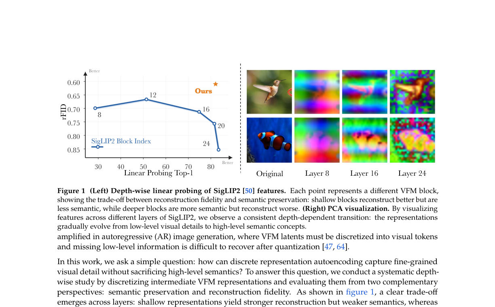
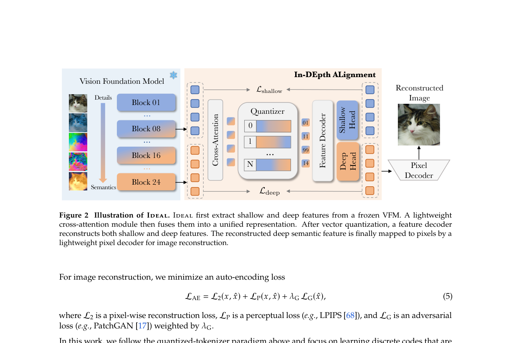
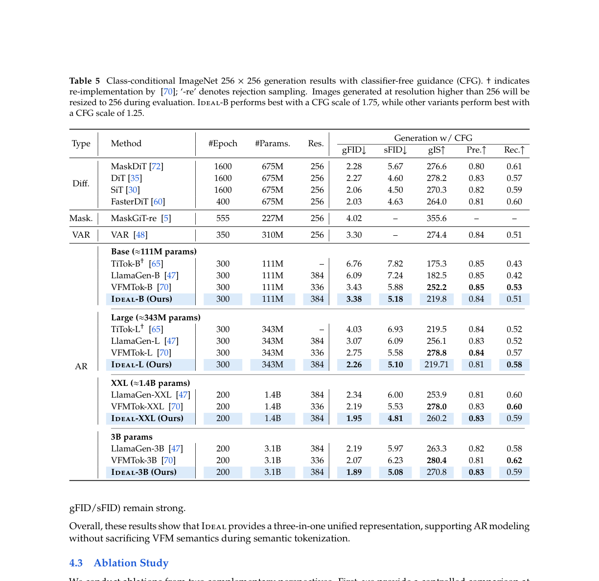

# AI Daily：IDEAL - 深度對齊打造新一代離散表示自編碼器

## 論文基本資訊

| 項目 | 內容 |
| :--- | :--- |
| **論文標題** | IDEAL: In-DEpth ALignment Makes A Discrete Representation AutoEncoder |
| **作者** | Yitong Chen, Zijie Diao, Junke Wang, Lingyu Kong, Yixuan Ren, Bo He, Yu-Gang Jiang, Zuxuan Wu |
| **研究機構** | 復旦大學 (Fudan University)、上海創新研究院 (Shanghai Innovation Institute)、馬里蘭大學 (University of Maryland) |
| **發表時間** | 2026年6月9日 |
| **論文連結** | [arXiv:2606.11096](https://arxiv.org/abs/2606.11096) |
| **程式碼** | [GitHub - Row11n/IDEAL](https://github.com/Row11n/IDEAL) |

---

## 核心貢獻與創新點

近期，基於預訓練視覺基礎模型 (Vision Foundation Models, VFMs) 的表示自編碼器 (Representation AutoEncoders, RAEs) 在構建用於圖像生成的語義豐富潛在空間方面展現出巨大潛力。然而，這些方法的重建品質往往不佳，這主要是因為深層的 VFM 特徵在離散化後，難以保留足夠的細粒度視覺細節。

為了突破這一瓶頸，本論文提出了 **IDEAL (In-DEpth ALignment)** 框架，其核心創新點如下：

1. **深度特徵互補性發現**：作者通過深度探測 (depth-wise probing) 發現，VFM 的淺層特徵保留了豐富的局部外觀和結構細節，而深層特徵則攜帶了高階語義。這兩者在深度上具有天然的互補性。
2. **淺層與深層特徵的融合與對齊**：IDEAL 摒棄了僅依賴單一層特徵進行量化的傳統做法，而是通過一個輕量級的交叉注意力模組，將淺層和深層特徵融合為統一的表示，隨後再進行向量量化。
3. **雙特徵頭解碼設計**：在解碼階段，IDEAL 引入了深層和淺層兩個對齊損失 (alignment loss)，強制離散表示在重建時同時恢復高階語義和低階細節。
4. **刷新自迴歸生成 SOTA**：在 ImageNet 256x256 解析度下，IDEAL 的 3B 參數模型實現了 **gFID 1.89** 的生成品質，創下了自迴歸 (Autoregressive, AR) 圖像生成的新紀錄。

*圖 1：SigLIP2 特徵的深度線性探測。左圖顯示淺層特徵重建效果好但語義較弱，深層特徵語義強但重建效果差。右圖的 PCA 視覺化展示了特徵從低階視覺細節到高階語義概念的演變。*

---

## 技術方法簡述

IDEAL 的架構設計旨在將高保真重建與語義保留結合於單一的離散標記 (discrete tokens) 中。

### 1. 特徵提取與融合 (Feature Extraction and Fusion)

給定輸入圖像 $x$，IDEAL 使用凍結的 VFM 編碼器 $\Phi(\cdot)$（論文中預設使用 SigLIP2-Large-384）提取淺層特徵 $f^{(s)} = \Phi_{\ell_s}(x)$ 和深層特徵 $f^{(d)} = \Phi_{\ell_d}(x)$（分別對應第 8 層和第 24 層 Transformer Block）。為了融合這兩種特徵，IDEAL 使用了一個輕量級的交叉注意力區塊 (Cross-Attention Block)，將深層特徵作為 Query，淺層特徵作為 Key 和 Value：

$$z = \text{AttnFuse}\left(f^{(d)}, f^{(s)}\right)$$

### 2. 向量量化 (Vector Quantization)

融合後的特徵 $z$ 先通過降維投影映射到低維量化空間，再通過標準的 VQ 機制進行離散化，映射到可學習的密碼本 $\mathcal{C} = \{c_k\}_{k=1}^{K}$ 中，生成離散標記索引 $y$ 以及反量化後的嵌入 $\tilde{z}$：

$$\text{VQ}(z_i) = \tilde{z}_i = c_{k_i}, \quad k_i = \arg\min_{k \in \{1,\ldots,K\}} \|z_i - c_k\|_2$$

### 3. 雙頭特徵解碼與圖像重建 (Dual Feature Heads Decoding)

IDEAL 使用 ViT 特徵解碼器 $D_{\text{feat}}$ 處理 $\tilde{z}$，得到全局特徵 $g = D_{\text{feat}}(\tilde{z})$。隨後，通過兩個輕量級的線性頭，分別重建深層特徵 $\hat{f}^{(d)}$ 和淺層特徵 $\hat{f}^{(s)}$。重建的深層特徵 $\hat{f}^{(d)}$ 被用作與文字互動的介面，並進一步送入像素解碼器 $D_{\text{pixel}}$ 重建最終圖像 $\hat{x}$：

$$\hat{x} = D_{\text{pixel}}\left(\hat{f}^{(d)}\right)$$

### 4. 損失函數 (Objectives)

除了標準的自動編碼損失 $\mathcal{L}_{\text{AE}}$（包含像素重建損失 $\mathcal{L}_2$、感知損失 $\mathcal{L}_P$ 和對抗損失 $\mathcal{L}_G$）和 VQ 損失 $\mathcal{L}_{\text{VQ}}$，IDEAL 引入了深層和淺層對齊損失，以確保重建特徵與原始 VFM 特徵的幾何結構一致：

$$\mathcal{L}_{\text{deep}} = \left\lVert\hat{f}^{(d)} - f^{(d)}\right\rVert_2^2 + \left(1 - \cos\left(\hat{f}^{(d)}, f^{(d)}\right)\right)$$

$$\mathcal{L}_{\text{shallow}} = \left\lVert\hat{f}^{(s)} - f^{(s)}\right\rVert_2^2 + \left(1 - \cos\left(\hat{f}^{(s)}, f^{(s)}\right)\right)$$

整體損失函數為：

$$\mathcal{L} = \mathcal{L}_{\text{AE}} + \mathcal{L}_{\text{VQ}} + \mathcal{L}_{\text{deep}} + \mathcal{L}_{\text{shallow}}$$

值得注意的是，對抗損失中的判別器並非傳統的 PatchGAN，而是以凍結的 DINOv1-s 模型作為判別器，提供語義層面的對抗引導，進一步提升重建品質。

### 5. 自迴歸圖像生成 (Autoregressive Image Generation)

一旦 tokenizer 訓練完成，其產生的離散標記序列 $y = (y_1, \ldots, y_T)$ 即可用於訓練標準的自迴歸 Transformer，透過 next-token prediction 進行圖像生成：

$$p_\theta(y \mid c) = \prod_{t=1}^{T} p_\theta(y_t \mid y_{<t}, c)$$

AR 模型使用 2D RoPE 位置編碼以更好地捕捉空間局部性，並採用標準的交叉熵損失進行訓練。

*圖 2：IDEAL 的整體架構。首先從凍結的 VFM 提取淺層和深層特徵並進行融合。向量量化後，特徵解碼器同時重建淺層和深層特徵，最後由像素解碼器完成圖像重建。*

---

## 實驗結果和性能指標

IDEAL 在圖像重建和自迴歸生成方面都進行了詳盡的評估。

### 1. 圖像重建品質與語義保留

在 ImageNet 驗證集上，IDEAL 達到了 **0.61 的重建 FID (rFID)**，顯著優於之前的 VQGAN (1.49) 和 VFMTok (0.89)，同時保持了 **100% 的密碼本使用率**。更重要的是，IDEAL 重建的特徵在 Zero-Shot ImageNet 分類中達到了 **80.89% 的 Top-1 準確率**，極為接近原始 SigLIP2 的 83.23%，證明其在離散化後依然完好地保留了 VFM 的原生語義空間。

此外，IDEAL 的解碼特徵在多模態理解 benchmark 上也展現出競爭力，在 RealWorldQA (52.68)、OKVQA (61.06)、SEED (68.02)、MME (1878) 等指標上均優於 DINOv2 和 SigLIP2，顯示其作為多模態視覺編碼器的潛力。

### 2. 自迴歸圖像生成

將 IDEAL 提取的離散標記用於訓練自迴歸 (AR) 模型，並採用 Classifier-Free Guidance (CFG) 進行評估。結果顯示，IDEAL 在各個參數規模下均超越了現有的主流 AR 生成模型（如 LlamaGen、VAR 和 VFMTok）。

| 模型規模 | 方法 | gFID $\downarrow$ | sFID $\downarrow$ | gIS $\uparrow$ |
| :--- | :--- | :---: | :---: | :---: |
| **Base (~111M)** | LlamaGen-B | 6.09 | 7.24 | 182.5 |
| | VFMTok-B | 3.43 | 5.88 | 252.2 |
| | **IDEAL-B** | **3.38** | **5.18** | 219.8 |
| **Large (~343M)** | LlamaGen-L | 3.07 | 6.09 | 256.1 |
| | VFMTok-L | 2.75 | 5.58 | 278.8 |
| | **IDEAL-L** | **2.26** | **5.10** | 219.7 |
| **XXL (~1.4B)** | LlamaGen-XXL | 2.34 | 6.00 | 253.9 |
| | VFMTok-XXL | 2.19 | 5.53 | 278.0 |
| | **IDEAL-XXL** | **1.95** | **4.81** | 260.2 |
| **3B** | LlamaGen-3B | 2.19 | 5.97 | 263.3 |
| | VFMTok-3B | 2.07 | 6.23 | 280.4 |
| | **IDEAL-3B** | **1.89** | **5.08** | 270.8 |

*表 5：在 ImageNet 256x256 上的 Class-conditional 生成結果（含 CFG）。IDEAL 在各個參數規模下均取得了最佳的 gFID。*

### 3. 消融實驗

消融實驗驗證了 IDEAL 各設計選擇的有效性。在融合方式上，Attention Fusion（rFID 0.61）優於 Linear Fusion（0.63）和不融合（0.85），說明注意力機制能更好地選擇性整合低階細節而不破壞語義結構。加入淺層對齊損失 $\mathcal{L}_{\text{shallow}}$ 可將 rFID 從 0.66 改善至 0.61。在 VFM 骨幹選擇上，DINOv3 的重建 rFID 最低（0.54），但作者最終選擇 SigLIP2 作為預設骨幹，因其能保留更強的語義並與文字嵌入保持兼容。

---

## 相關研究背景

IDEAL 的發展建立在幾個關鍵的研究脈絡之上。

**視覺自迴歸生成 (Visual AutoRegressive Generation)**：自 LlamaGen [arXiv:2406.06525] 和 VAR [arXiv:2404.02905, NeurIPS 2024 Best Paper] 提出以來，將大語言模型的「next-token prediction」或「next-scale prediction」範式應用於視覺生成已成為主流。然而，這些方法通常依賴於缺乏全局語義的傳統視覺 tokenizer（如 VQGAN），限制了生成品質的上限。

**基於 VFM 的 Tokenizer (VFM-based Tokenizers)**：為了賦予離散標記語義，近期研究開始直接對凍結的視覺基礎模型（如 DINOv2、SigLIP2）的深層特徵進行量化。VFMTok [arXiv:2507.08441, NeurIPS 2025] 是 IDEAL 的直接前驅，它首次系統地探索了 VFM 特徵作為 tokenizer 的有效性，在 ImageNet 上達到了 gFID 2.07。然而，VFMTok 僅使用深層特徵，導致重建細節不足。

**表示自編碼器 (Representation AutoEncoders, RAEs)**：RAE 框架（如 RAE-DiT）已在擴散模型中展示了使用高維語義特徵的優勢，但在離散化（vector quantization）後的重建品質問題在 RAE 路線中同樣存在，IDEAL 的工作為解決這一問題提供了新思路。

**SigLIP2 [arXiv:2502.14786, Google DeepMind]**：作為 IDEAL 的 VFM 骨幹，SigLIP2 是一個多語言視覺語言編碼器，通過結合對比對齊、描述生成和自蒸餾等多種預訓練目標，在語義理解和局部化方面均有顯著提升。

---

## 個人評價和意義

IDEAL 是一篇極具啟發性的研究。在過去的一兩年中，視覺生成的 tokenizer 路線一直面臨著一個兩難的抉擇：**是要「高保真重建」（使用傳統 CNN/VQGAN，但缺乏語義），還是要「強大語義」（使用 VFM 深層特徵，但細節模糊）？**

IDEAL 給出了一個優雅且直觀的解答：**既然淺層有細節，深層有語義，那就將兩者融合對齊。** 通過一個簡單的交叉注意力機制和雙頭解碼約束，IDEAL 成功地在一個統一的離散表示中保留了這兩種截然不同的資訊。這個設計思路本身就很有啟發性——它不是試圖「修復」深層特徵的重建缺陷，而是引入互補資訊來「補全」它。

這項研究對我們近期關注的幾個方向有重要意義：

**Zero-Shot 與多模態互動**：IDEAL 的解碼特徵與 SigLIP2 的文字空間保持兼容，這意味著其生成的 token 天然具備與 LLM 進行多模態互動的潛力，無需額外的對齊訓練。這對於構建統一的視覺語言生成系統（如 OmniGen-AR 路線）具有重要意義。

**對 VAR / Next-Scale 的啟發**：VAR 證明了多尺度的重要性，而 IDEAL 證明了多深度的重要性。如果能將 IDEAL 的深度特徵融合思想與 VAR 的尺度預測結合，或許能進一步突破自迴歸視覺生成的極限。更進一步，IDEAL 的「淺層細節 + 深層語義」互補框架，是否可以推廣到時間維度（短期細節 + 長期語義）或跨模態維度（視覺細節 + 語言語義）？

**Training-Free 潛力**：由於 IDEAL 完好保留了 VFM 的語義空間，未來或許可以探索基於這些 token 的 training-free 編輯或注意力調變 (attention modulation) 技術。例如，利用 IDEAL token 的語義一致性，在推理時直接對生成過程施加語義約束，而無需額外訓練。

總結來說，IDEAL 不僅在指標上刷新了 AR 圖像生成的 SOTA，更重要的是，它為如何構建更完美的視覺離散表示提供了一個非常 solid 的架構範本：**不要在深度和淺度之間做取捨，而是讓它們在量化空間中共存。**
