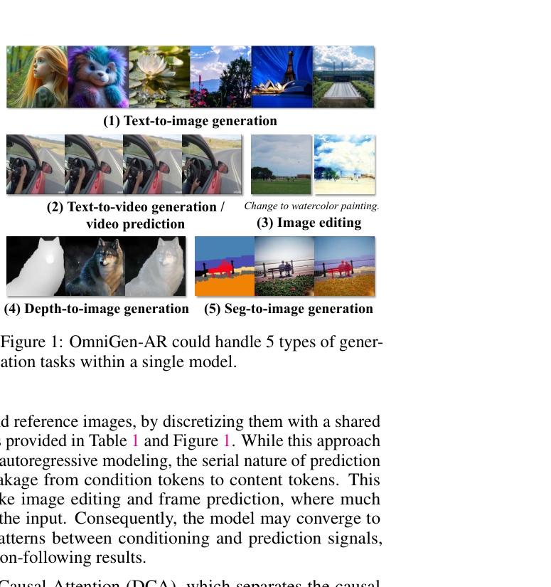
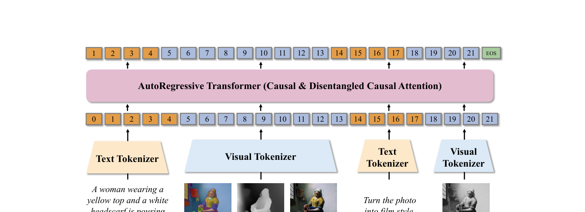
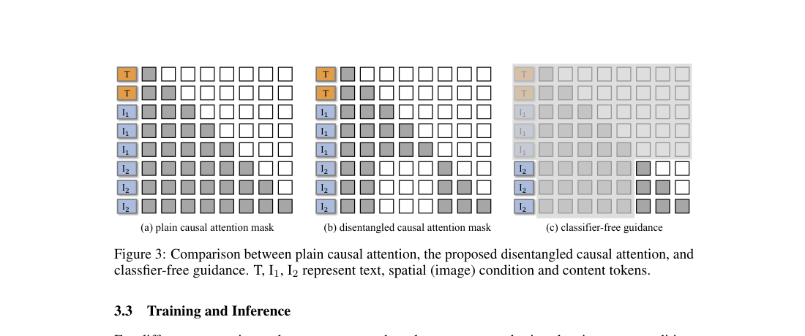

# AI Daily: OmniGen-AR 統一自迴歸多模態生成框架

## 論文基本資訊

- **論文標題**：OmniGen-AR: AutoRegressive Any-to-Image Generation
- **作者**：Junke Wang, Xun Wang, Qiushan Guo, Peize Sun, Weilin Huang, Zuxuan Wu, Yu-Gang Jiang
- **發表機構**：復旦大學 (Fudan University)、字節跳動 (ByteDance Seed)、香港大學 (The University of Hong Kong)
- **發表會議/時間**：NeurIPS 2026 Accepted (arXiv: 2026-06-08)
- **論文連結**：[arXiv:2606.09156](https://arxiv.org/abs/2606.09156)

---

## 論文核心貢獻與創新點

在視覺生成領域，自迴歸模型 (Autoregressive Models) 憑藉簡單的架構與優秀的擴展性，正逐漸成為擴散模型 (Diffusion Models) 的有力競爭者。然而，現有的自迴歸生成模型大多僅支援單一模態條件（例如純文字到圖像）。為了突破此限制，復旦大學與字節跳動的研究團隊提出了 **OmniGen-AR**，一個統一的 Any-to-Image 自迴歸生成框架。

**核心創新點包括：**

1. **統一的自迴歸生成架構**：透過共享的 Visual Tokenizer，OmniGen-AR 將深度圖 (Depth)、語意分割圖 (Segmentation)、參考圖像 (Reference Image) 以及影片影格 (Video Frames) 統一離散化為視覺 Token。這使得單一模型即可同時支援 Text-to-Image、Text-to-Video、Image Editing、Depth-to-Image 與 Seg-to-Image 等多達五種以上的任務。
2. **Disentangled Causal Attention (DCA) 解擋因果注意力機制**：在處理影像編輯或影片預測等任務時，條件影像與目標影像往往有高度重疊。標準的自迴歸因果遮罩 (Causal Mask) 容易讓模型走捷徑（Shortcut Learning），產生資訊洩漏 (Information Leakage)。DCA 透過分離條件注意力與內容注意力，成功阻斷了內容 Token 對條件 Token 的直接依賴，迫使模型更專注於指令。
3. **Training-Free Inference**：DCA 僅作為訓練階段的正規化手段 (Regularizer)，在推理階段完全不改變標準的 Next-Token Prediction 流程，保持了自迴歸模型的高效與優雅。

*圖 1：OmniGen-AR 單一模型即可處理五種以上的視覺生成任務，展現了極高的通用性。*

---

## 技術方法簡述

### 1. 視覺與文本 Token 化 (Visual and Textual Tokenization)

與以往為不同空間條件訓練獨立編碼器的方法不同，OmniGen-AR 採用單一的視覺 Tokenizer (Cosmos-DV8) 將視覺條件 $V \in \mathbb{R}^{H\times W\times 3}$ 與目標生成影像 $X \in \mathbb{R}^{H\times W\times 3}$ 轉換為離散的 Token 序列 $v \in \mathbb{R}^{N_1}$ 與 $x \in \mathbb{R}^{N_2}$。文字輸入則透過 Qwen2.5 轉換為 $t \in \mathbb{R}^M$。

### 2. Disentangled Causal Attention (DCA)

在標準的 Decoder-only Transformer 中，注意力機制定義為：

$$ \mathrm{Attention}(q,k,v) = \mathrm{softmax}\left(\frac{qk^\top}{\sqrt{d_k}} + m\right)v $$

標準的因果遮罩 $m_{i,j}$ 僅遮蔽未來位置：

$$ m_{i,j} = \begin{cases} 0, & \text{if } j \le i \\ -\infty, & \text{otherwise} \end{cases} $$

但在多模態序列 $[t, v, x]$（長度為 $L = M + N_1 + N_2$）中，這種遮罩會讓目標內容 $x$ 輕易「抄襲」條件 $v$。為此，作者設計了 **DCA 遮罩**：

$$ m_{i,j} = \begin{cases} 0, & \text{if } j \le i \text{ and } (i,j) \in A \cup B \cup C \\ -\infty, & \text{if } i \in C,\ j \in B \\ -\infty, & \text{otherwise} \end{cases} $$

其中區間定義為：
- 文字區間 $A = [0, M)$
- 條件區間 $B = [M, M+N_1)$
- 內容區間 $C = [M+N_1, M+N_1+N_2)$

這個設計的精妙之處在於：當 Query 來自內容區間 $C$、而 Key 來自條件區間 $B$ 時，強制將注意力權重設為 $-\infty$。這樣一來，內容 Token 依然能看見文字指令（區間 $A$），但無法直接複製視覺條件（區間 $B$），從而解決了資訊洩漏問題。

*圖 2：OmniGen-AR 的多模態自迴歸架構，序列由文字、視覺條件與目標內容交錯組成。*

*圖 3：(a) 標準因果遮罩，(b) 提出的 DCA 遮罩，切斷了 $I_2$ (內容) 對 $I_1$ (條件) 的依賴。*

---

## 實驗結果與性能指標

研究團隊在多個基準測試上對 OmniGen-AR 進行了廣泛評估，並證明了其優越性。

### 1. Text-to-Image (GenEval)
在 GenEval 基準測試中，0.5B 參數的 OmniGen-AR 達到了 **0.55** 的總分，超越了同等規模的 Diffusion Models (如 SDv2.1) 與 AR Models (如 LlamaGen)。當參數擴展至 1.5B 時，分數進一步提升至 **0.63**，展現了良好的 Scaling 能力。

### 2. Text-to-Video (VBench)
在 VBench 測試中，0.5B 模型取得了 **74.72** 的總分，大幅超越 9B 參數的 CogVideo (67.01)。1.5B 模型更是達到了 **80.02**，作者指出，這是**首次有基於離散 Token 的純自迴歸模型在 VBench 上突破 80 分大關**。

### 3. Image Editing 與 Spatial Control
在 Emu-Edit 測試集上，模型達到了 0.23 的 CLIP Text Similarity (CT) 與 0.84 的 CLIP Image Similarity (CI)。在 Segmentation-to-Image 任務中，取得了 35.28 的 mIoU，證明了單一模型處理細粒度空間控制的可行性。

---

## 相關研究背景

這篇論文建立在幾個重要的前沿研究方向之上：
- **Autoregressive Visual Generation**：從 VQ-VAE 到 LlamaGen、SimpleAR，AR 模型在視覺生成領域展現了強大的潛力，但過去大多侷限於單一條件。
- **Unified Generation Frameworks**：Diffusion 領域已有 ControlNet、Uni-ControlNet 以及近期的 OmniGen (CVPR 2025)，致力於統一多種控制訊號。OmniGen-AR 則是將這種大一統思想帶入了 AR 領域。
- **Attention Modulation**：為了防止條件與目標之間的 Shortcut Learning，過去有研究探討 DropCondition 或 Classifier-Free Guidance，而本文的 DCA 提供了一種從 Attention Mask 根本上解決問題的優雅方案。

---

## 個人評價與意義

1. **對 Attention Modulation 的啟發**：DCA 的設計非常契合近期火熱的 Attention Modulation 與 Zero-shot 控制方向。它證明了不需要複雜的架構修改，僅僅透過巧妙設計 Attention Mask（且僅在訓練期以 10% 機率套用），就能顯著提升模型遵循指令的能力並防止資訊洩漏。
2. **AR 模型的通用化里程碑**：這項研究打破了「AR 模型難以處理複雜空間控制」的刻板印象。使用統一的 Visual Tokenizer 處理所有視覺輸入，不僅簡化了架構，也為未來類似 JEPA (Joint-Embedding Predictive Architecture) 或 VAR (Visual Autoregressive) 的多模態統一模型提供了極佳的參考。
3. **Training-Free Inference 的優雅**：DCA 在推理時退化為標準的 Causal Attention，這意味著它完全不會增加推理時的計算負擔，這對於需要大規模部署的生成模型來說是非常實用的設計。

這篇研究強烈建議關注 Energy-based Transformer、VAR-based 以及 Training-free 控制方向的研究者深入閱讀，其對 Attention Mask 的精細操作能激發許多新的架構靈感。
