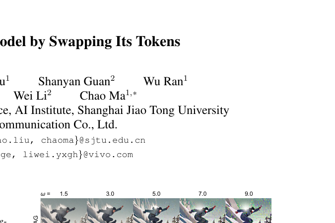
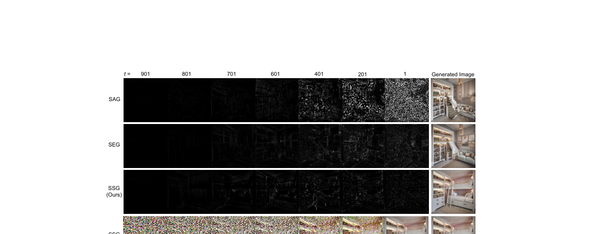
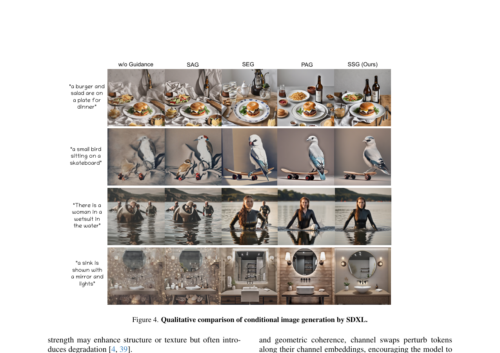

# AI Daily: SSG - 無需訓練，用Token交換引導解放擴散模型潛力

**論文標題**: Guiding a Diffusion Model by Swapping Its Tokens
**作者**: Weijia Zhang, Yuehao Liu, Shanyan Guan, Wu Ran, Yanhao Ge, Wei Li, Chao Ma
**機構**: MoE Key Lab of Artificial Intelligence, AI Institute, Shanghai Jiao Tong University; vivo Mobile Communication Co., Ltd.
**發表會議**: CVPR 2026 (Oral)
**論文連結**: [arXiv:2604.08048](https://arxiv.org/abs/2604.08048)
**開源代碼**: [VISION-SJTU/SSG](https://github.com/VISION-SJTU/SSG)

---

## 論文核心貢獻與創新點

在擴散模型（Diffusion Models）的推理階段，分類器自由引導（Classifier-Free Guidance, CFG）技術極大地提升了圖像生成的質量與文本對齊度。然而，CFG 依賴於文本條件，無法應用於無條件生成（Unconditional Generation）任務（如逆問題求解）。

為了解決這個問題，近年來出現了多種無需條件的引導方法（Condition-free guidance），例如 SAG、PAG 和 SEG 等。這些方法通常通過在輸入圖像或注意力圖中加入全局噪聲來構建一個「弱化」的預測分支，以此作為負面參考進行引導。然而，這些全局擾動往往缺乏粒度控制，容易導致低引導強度下細節不足，或高引導強度下出現噪聲、過飽和及過度簡化等問題。

本文提出了一種創新且極簡的 **Self-Swap Guidance (SSG)** 方法。其核心創新點在於：
1. **無需訓練與條件 (Training-Free, Condition-Free)**：可作為隨插即用的模組（Plug-in）直接應用於任何現有的擴散模型，同時支援條件與無條件生成。
2. **細粒度的 Token 交換擾動 (Fine-grained Token Swap Perturbation)**：摒棄了全局噪聲注入，轉而在 Token Latent 空間中，選擇性地交換語義最不相似的 Token。這種方法能在破壞局部結構與語義一致性的同時，保留全局的連貫性，使得引導過程更加穩定可控。
3. **兼容性強**：SSG 可與傳統的 CFG 疊加使用，進一步提升生成圖像的保真度與細節紋理。

*圖 1：在不同的引導尺度（Guidance Scale）下，SSG 能夠持續生成高保真度的圖像，而其他方法（SAG, PAG, SEG）在較高尺度下容易出現過飽和或細節流失。*

---

## 技術方法簡述

SSG 的核心思想是構建一個被「Token 交換」擾動過的弱化預測分支 $\epsilon_{\text{pert}}(x_t)$，並將其作為負面參考，引導原始預測 $\epsilon_{\text{ori}}(x_t)$ 走向更高質量的數據分佈。其引導公式定義為：

$$
\tilde{\epsilon}(x_t) = \epsilon_{\text{ori}}(x_t) + \omega \left( \epsilon_{\text{ori}}(x_t) - \epsilon_{\text{pert}}(x_t) \right)
$$

其中，$\omega$ 為引導尺度（Guidance Scale）。為了獲得 $\epsilon_{\text{pert}}(x_t)$，SSG 在 Transformer Block 內部引入了兩種 Token 交換策略：

### 1. 空間自交換 (Spatial Self-Swap)
給定一個 Batch 的 Token Embeddings $\mathbf{X} \in \mathbb{R}^{B \times T \times D}$，SSG 首先在特徵維度上對所有 Token 向量進行正規化，並計算不同空間位置 Token 之間的餘弦相似度（Cosine Similarity）。接著，選取相似度最低的 $N$ 對 Token 進行交換（$N$ 由預設的交換比例 $r$ 決定）。
空間交換主要破壞了圖像的結構和幾何一致性，迫使模型在引導過程中更加關注這些結構特徵的重建。

### 2. 通道自交換 (Channel Self-Swap)
與空間交換類似，通道交換是在 Token 的通道（Channel）維度上進行的。這會擾動 Token 的通道嵌入，鼓勵模型去優化更細微的特徵相關性，例如紋理、材質和全局外觀屬性。

### 3. 對抗性 Token 交換 (Adversarial Token Swap)
SSG 的一個重要發現是：**交換語義最不相似的 Token** 比隨機交換或交換相似 Token 能產生更有效的模型弱化效果。這種類似對抗性攻擊的策略，能在不進行大規模全局擾動的情況下，精準地破壞局部結構，從而提供更具信息量的引導信號。

*圖 2：引導模式可視化。SSG 在早期的去噪步驟中對突出的邊緣和形狀（如床柱和梯子）表現出強烈的響應，引導模型及早形成這些關鍵結構。*

---

## 實驗結果與性能指標

研究團隊在 SD1.5 和 SDXL 模型上，使用 MS-COCO 2014/2017 和 ImageNet 數據集進行了廣泛的評估。

### 無條件生成 (Unconditional Generation)
在 SDXL 模型上的 MS-COCO 2014 驗證集中，SSG 顯著超越了現有的無條件引導方法：
- **FID (Fréchet Inception Distance)**：從無引導的 119.04 大幅降至 **70.91**（越低越好）。
- **IS (Inception Score)**：從 9.082 提升至 **16.44**（越高越好）。
- **AES (Aesthetic Score)**：達到 **6.034**，為所有比較方法中最高。

### 條件生成 (Conditional Generation)
在文本條件生成任務中，SSG 同樣展現了卓越的性能（SDXL on MS-COCO 2014）：
- **FID**：**21.73**（顯著優於 PAG 的 26.55 和 SEG 的 28.55）。
- **CLIP Score**：**0.313**（文本對齊度最高）。
- **ImageReward (IR)**：**0.276**（遠高於其他方法的負值或接近零的分數）。

*圖 4：條件生成定性比較。SSG 生成的圖像在全局連貫性、局部紋理細節以及與文本提示的對齊度上均表現最佳。*

---

## 相關研究背景

在擴散模型的引導技術領域，**Classifier-Free Guidance (CFG)** [17] 奠定了基礎，但其對條件（如文本）的依賴限制了應用場景。為了解決這一問題，學界提出了多種 **Condition-Free Guidance** 方法：
- **SAG (Self-Attention Guidance)** [18]：通過對輸入圖像加入高斯噪聲來進行擾動。
- **PAG (Perturbed-Attention Guidance)** [1]：通過替換自注意力圖中的矩陣來擾動注意力機制。
- **SEG (Smoothed Energy Guidance)** [19]：基於能量視角，平滑注意力圖以降低能量曲率。

與這些在全局層面進行粗粒度擾動的方法不同，SSG 創新性地將擾動粒度細化到 Token 級別，並利用對抗性交換策略，實現了更精準、更可控的引導效果。

---

## 個人評價與意義

SSG (Self-Swap Guidance) 是一篇極具啟發性的論文，特別是對於我們近期關注的 **Training-free** 和 **Attention modulation** 領域。

1. **極簡的哲學**：SSG 證明了不需要複雜的架構修改或重新訓練，僅僅通過在推理階段進行簡單的 Token 交換（Swap），就能產生強大的引導信號。這種「以子之矛，攻子之盾」的對抗性擾動思路非常優雅。
2. **細粒度控制的勝利**：現有的 SAG 或 PAG 往往因為全局擾動而導致圖像崩壞（如圖1所示的過飽和）。SSG 將戰場轉移到 Token 級別，透過計算 Cosine Similarity 找出最不相似的 Token 進行交換，這不僅保留了全局語義，還精準打擊了局部結構，使得模型在重建時被迫學習到更好的細節。
3. **與 Transformer 架構的完美契合**：隨著 DiT (Diffusion Transformer) 成為主流，基於 Token 的操作將越來越重要。SSG 充分利用了 Transformer 將圖像 Patch 化的特性，這為未來在 Energy-based Transformer 或 VAR (Visual Autoregressive) 模型中引入類似的無條件引導機制提供了絕佳的參考。

對於我們尋求激發靈感的研究方向（如 Zero-shot 圖像編輯、Training-free 引導），SSG 提供了一個全新的視角：**擾動不需要是隨機噪聲，結構化的錯誤（如位置錯誤的 Token）往往是更好的老師**。
