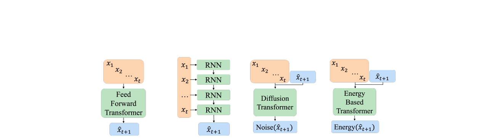
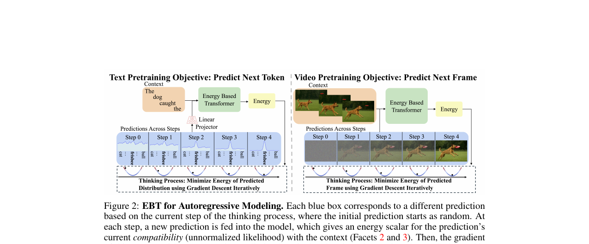
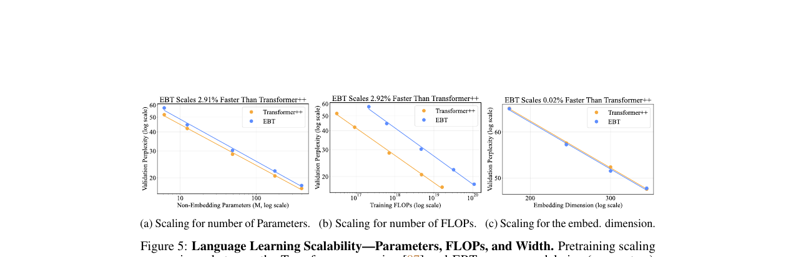
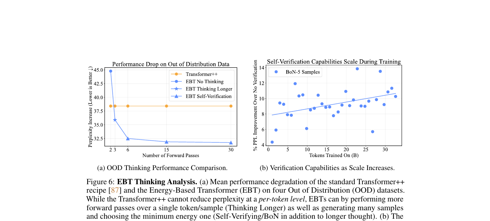

# AI Daily: Energy-Based Transformers are Scalable Learners and Thinkers

## 基本資訊

- **論文標題**：Energy-Based Transformers are Scalable Learners and Thinkers
- **作者**：Alexi Gladstone, Ganesh Nanduru, Md Mofijul Islam, Peixuan Han, Hyeonjeong Ha, Aman Chadha, Yilun Du, Heng Ji, Jundong Li, Tariq Iqbal
- **發表會議/期刊**：ICLR 2026 (Oral)
- **研究單位**：University of Virginia, UIUC, Amazon GenAI, Stanford University, Harvard University
- **論文連結**：[arXiv:2507.02092](https://arxiv.org/abs/2507.02092)
- **專案頁面**：[Project Page](https://energy-based-transformers.github.io/)
- **程式碼**：[GitHub](https://github.com/alexiglad/EBT)

---

## 核心貢獻與創新點

當前的生成模型（如標準的自迴歸 Transformer 或 Diffusion 模型）在推理時往往難以根據問題難度動態分配計算資源（System 2 Thinking），或者依賴於特定模態的強化學習（RL）與獎勵模型。這篇論文提出了一種全新的架構——**Energy-Based Transformers (EBTs)**，其核心創新在於將生成問題轉化為**能量最小化（Energy Minimization）**的最佳化問題。

主要貢獻包括：
1. **無監督的 System 2 Thinking**：EBT 能夠在不依賴任何外部獎勵模型或人類標註的情況下，純粹透過無監督學習發展出「思考」能力。模型學會評估預測的「相容性（Compatibility）」，並在推理時反覆修正預測。
2. **卓越的 Scaling 表現**：在預訓練階段，EBT 在資料量、批次大小、模型深度與參數規模上的 Scaling Rate 比標準的 Transformer++ 高出高達 35%。
3. **跨模態的通用性**：該框架不限於特定模態，論文在離散的語言建模（Text）與連續的視覺生成（Video next-frame prediction, Image denoising）上皆證明了其有效性。
4. **更強的 OOD 泛化能力**：實驗表明，當面對分佈外（Out-of-Distribution, OOD）資料時，EBT 透過增加推理時的計算量（思考更久），能顯著提升泛化表現。

---

## 技術方法簡述

EBT 的核心思想是不直接預測下一個 Token 或畫面，而是學習一個**能量函數（Energy Function）** $E_\theta(x, \hat{y})$，用來評估給定上下文 $x$ 時，候選預測 $\hat{y}$ 的合理性。能量越低，代表預測越合理（未正規化機率越高）。

### 訓練階段：Optimization-based EBM Learning

傳統的能量模型（EBMs）通常依賴對比學習（Contrastive Learning），這在高維空間中會面臨負樣本指數爆炸的問題。EBT 採用了基於最佳化的訓練方式，類似於訓練一個 Verifier。
給定初始預測 $\hat{y}_0$（通常是隨機雜訊），模型透過梯度下降尋找能量最低的預測值 $\hat{y}_{i+1}$：

$$ \hat{y}_{i+1} = \hat{y}_{i} - \alpha \nabla_{\hat{y}_{i}} E_\theta(x, \hat{y}_{i}) $$

其中 $\alpha$ 是步長（Step size）。模型將這個最佳化過程展開，並計算最終預測與真實標籤 $y$ 之間的損失（如語言模型的 Cross-entropy 或影像的 MSE）。梯度會穿過整個最佳化路徑進行反向傳播（Backpropagation through time）。

### 推理階段：System 2 Thinking as Energy Minimization

在推理時，EBT 展現出類似人類 System 2 的深思熟慮過程。模型不單次給出答案，而是根據能量地形（Energy Landscape）不斷迭代更新預測：

$$ \hat{y}_{i+1} = \hat{y}_{i} - \alpha \nabla_{\hat{y}_{i}} E_\theta(x, \hat{y}_{i}) + \eta_i, \quad \eta_i \sim \mathcal{N}(0, \sigma) $$

這裡加入了 Langevin Dynamics 的雜訊項 $\eta_i$，幫助模型跳出局部最小值，更充分地探索能量地形。這種機制允許 EBT 對於困難的問題進行更多的迭代計算（動態計算分配），直到能量收斂。

*圖示：EBT 在文本與影片預測中的思考過程。模型透過反覆梯度下降，使預測分佈逐漸收斂至能量最低點。*

---

## 實驗結果與性能指標

論文在語言模型和視覺模型上進行了廣泛的評估，證明了 EBT 的優越性。

### 語言建模（Text）
- **Scaling Rate**：在各個維度（Data, Batch size, Parameters, FLOPs）上，EBT 的 Scaling Rate 顯著優於 Transformer++。
- **Thinking 的效益**：在推理時增加思考步驟，能使語言模型的性能提升高達 **29%**。
- **OOD 泛化**：在面對 OOD 資料時，思考帶來的效益呈現線性增長。資料越偏離訓練分佈，EBT 透過思考獲得的性能提升越大。

*圖示：EBT 在參數與 FLOPs 上的 Scaling Rate 顯著高於 Transformer++。*

### 視覺生成（Image & Video）
- **影片預測**：在連續空間的影片下一幀預測任務中，EBT 同樣展現出比 Transformer++ 更陡峭的 Scaling 曲線。
- **影像去噪（Image Denoising）**：與 Diffusion Transformer (DiT) 相比，EBT 在使用 **99% 更少的 Forward Passes** 的情況下，依然取得了更好的去噪品質。
  - 在 OOD 雜訊（$\sigma=0.2$）下，EBT 的 PSNR 為 23.29，遠高於 DiT 的 19.56。
  - 在 ImageNet-1k 的線性探測（Linear Probe）中，EBT 的 Top-1 準確率達到 5.32%，而 DiT 僅為 0.31%，顯示 EBT 學習到了更優秀的視覺表徵。

*圖示：隨著資料 OOD 程度增加，EBT 透過思考獲得的性能提升也隨之增加。*

---

## 相關研究背景

本研究建立在幾個重要的前沿領域之上：
1. **System 2 Thinking in AI**：近期的模型（如 OpenAI o1, DeepSeek-R1）透過 RL 強化了數學與程式碼等領域的推理能力。然而，這些方法高度依賴明確的規則或獎勵模型。EBT 則探索了純粹無監督的替代方案。
2. **Energy-Based Models (EBMs)**：EBMs 能夠自然地模擬未正規化的機率與不確定性，但過去一直受限於高維度訓練的困難。EBT 透過 Optimization-based learning 解決了這個瓶頸。
3. **Diffusion Models 與 Continuous Generative Models**：雖然 Diffusion 模型（如 DiT）也具備迭代去噪的特性，但它們缺乏明確的驗證機制（Verifier），無法在推理時給出可靠的信心分數。EBT 將生成與驗證統一在能量框架下。

---

## 個人評價與意義

這是一篇極具啟發性的重量級研究（ICLR 2026 Oral 實至名歸）。它完美契合了當前 AI 發展的兩大趨勢：**Scaling Laws** 與 **Inference-time Compute (System 2 Thinking)**。

對於近期關注 **Energy-based transformer, JEPA, VAR-based, training-free, zero-shot** 等方向的研究者來說，這篇論文提供了幾個深刻的洞見：
1. **將生成轉化為驗證**：與其讓模型「直接猜答案」，不如訓練模型「判斷答案的好壞」。EBT 證明了，只要能量地形（Energy Landscape）被訓練得夠平滑、夠凸，模型就能透過梯度下降自己找到好答案。這與 JEPA 系列強調在潛在空間做預測、避免像素級重建的思想有異曲同工之妙。
2. **統一離散與連續空間**：EBT 不需要像傳統 Transformer 那樣依賴 Vector Quantization（VQ）來處理連續的視覺訊號，它透過能量純量（Energy Scalar）自然地表達了不確定性。這對於未來開發原生的多模態模型非常有價值。
3. **OOD 泛化的新解法**：實驗強烈暗示，真正的 OOD 泛化可能無法單靠擴大訓練資料來達成，而是需要在推理時賦予模型「思考」與「自我修正」的空間。

EBT 提供了一個極具潛力的基礎架構，未來或許能取代標準的 Feed-forward Transformer 與 DiT，成為下一代 Foundation Models 的核心基石。
