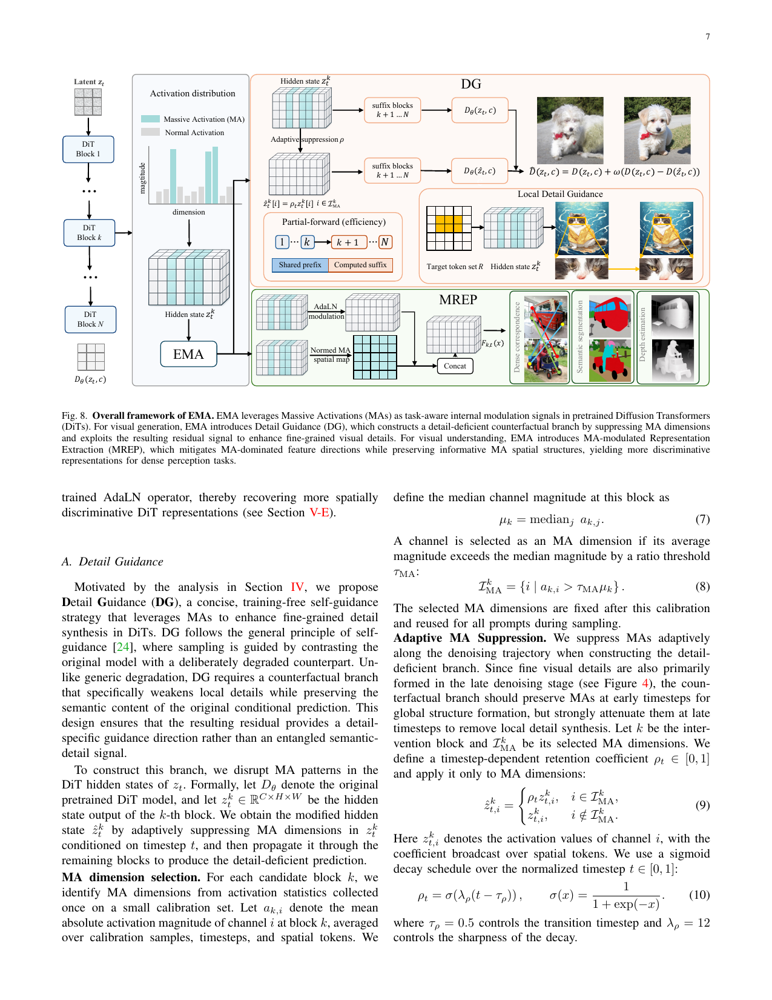
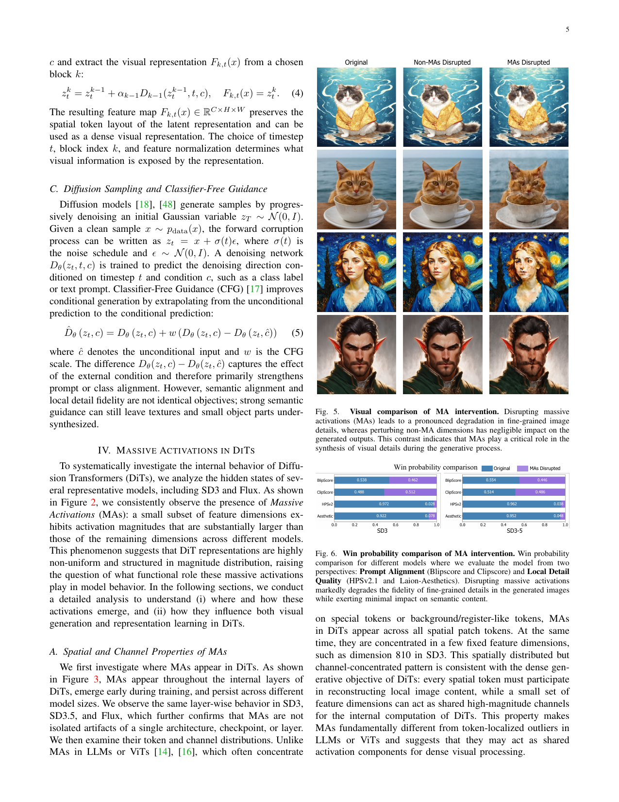

# AI Daily: Awakening Diffusion Transformers: Eliciting Stronger Generation and Understanding via Massive Activation Modulation

## 基本資訊

- **論文標題**：Awakening Diffusion Transformers: Eliciting Stronger Generation and Understanding via Massive Activation Modulation
- **作者**：Chaofan Gan, Zicheng Zhao, Yuanpeng Tu, Xi Chen, Ziran Qin, Tieyuan Chen, Supavadee Aramvith, Junhui Hou, Mehrtash Harandi, Weiyao Lin
- **發表日期**：2026-07-03
- **研究單位**：上海交通大學 (SJTU)、香港大學 (HKU)、香港城市大學 (CityU)、莫納什大學 (Monash University)、中關村研究院、朱拉隆功大學
- **論文連結**：[arXiv:2607.02968](https://arxiv.org/abs/2607.02968)

---

## 核心貢獻與創新點

當前基於 Transformer 的擴散模型（Diffusion Transformers, DiTs）如 SD3、Flux 和影片生成模型（如 Wan），在生成與視覺表徵任務中表現優異。然而，模型內部運作機理，特別是隱藏狀態中出現的「海量激活（Massive Activations, MAs）」，尚未被充分理解。本論文對 DiT 內部的 MAs 進行了系統性的機理分析，並提出了一個統一且**免訓練（Training-Free）**的框架——**EMA（Eliciting Massive Activation）**，以同時提升模型的生成品質與視覺理解能力。

主要貢獻包括：
1. **揭示 DiT 中 MAs 的特殊結構**：發現 MAs 廣泛分佈於所有的空間 Token 中，但高度集中在少數固定的特徵維度（Channels）上。這些維度與 AdaLN（自適應層歸一化）的殘差縮放因子高度對齊，且其激活幅度主要受去噪時間步（Timestep）調控，而非文字條件。
2. **發現 MAs 的雙重角色**：在生成任務中，MAs 對於合成細緻的局部細節（如紋理、毛髮）至關重要，但對全域語意影響有限；在理解任務中，MAs 共享的高幅度方向會掩蓋 Token 之間的差異，降低原始 DiT 特徵在密集預測任務（Dense Prediction）中的空間辨識度。
3. **提出 DG (Detail Guidance) 增強生成**：透過抑制 MA 維度建構一個「缺乏細節」的反事實預測分支，並利用其殘差作為引導方向，顯著提升生成影像的局部細節，且能與 CFG 完美互補。
4. **提出 MREP 提升視覺表徵**：利用預訓練的 AdaLN 調製來抑制 MA 的方向主導性，同時保留並正規化 MA 的空間響應圖，提取出更具辨識度的特徵，在語意對應（Semantic Correspondence）、分割與深度估計任務中超越原始 DiT 特徵。

*圖示：EMA 框架概覽。在生成端透過 DG (Detail Guidance) 建構缺乏細節的反事實分支來增強細節；在理解端透過 MREP (MA-modulated Representation Extraction) 減輕 MA 主導性並保留空間結構，提取更具辨識度的表徵。*

---

## 技術方法簡述

### Massive Activations (MAs) 的機理分析

在 DiT 的每一層中，隱藏狀態 $z_t^k$ 的更新公式為：
$$ z_t^k = z_t^{k-1} + \alpha_{k-1} D_{k-1}(z_t^{k-1}, t, c) $$
其中 $\alpha_k$ 是由 AdaLN 模組根據時間步 $t$ 和條件 $c$ 預測出的逐通道殘差縮放因子。作者發現，MAs 出現的維度與 $\alpha_k$ 出現峰值的維度高度重合，且其幅度隨去噪過程（從高雜訊到低雜訊）逐漸增大。

如果人為地干擾（Disrupt）這些 MA 維度，生成的影像會失去紋理和細節，但物體身份和整體佈局仍能保持。這說明 MAs 是控制局部細節生成的關鍵內部信號。

*圖示：干擾 MA 維度（右欄）會導致生成的貓毛髮與背景細節嚴重流失，但貓的整體語意與姿態不變；而干擾非 MA 維度（中欄）則幾乎沒有影響。*

### 生成端：MA-driven Detail Guidance (DG)

基於上述發現，作者提出 Detail Guidance (DG)。DG 的核心思想是：建構一個「細節受損但語意保留」的預測，並引導模型遠離這個預測。

1. **自適應 MA 抑制**：在選定的中間層 $k$，識別出 MA 維度集合 $\mathcal{I}_{\mathrm{MA}}^k$。對於這些維度，乘以一個隨時間步衰減的保留係數 $\rho_t$：
   $$ \hat{z}_{t,i}^k = \begin{cases} \rho_t z_{t,i}^k, & i \in \mathcal{I}_{\mathrm{MA}}^k \\ z_{t,i}^k, & i \notin \mathcal{I}_{\mathrm{MA}}^k \end{cases} $$
2. **細節引導公式**：將修改後的隱藏狀態 $\hat{z}_t^k$ 繼續向前傳播，得到缺乏細節的預測 $D_\theta(\hat{z}_t, c)$。最終的引導方向為：
   $$ \hat{D}_\theta(z_t, c) = D_\theta(z_t, c) + w\left(D_\theta(z_t, c) - D_\theta(\hat{z}_t, c)\right) $$
   其中 $w$ 為 DG 的引導強度。
3. **與 CFG 的互補**：CFG 主要增強語意對齊，而 DG 專注於細節生成。兩者結合可以寫為：
   $$ \hat{D}_\theta(z_t, c) = D_\theta(z_t, c) + \lambda g_{\mathrm{CFG}} + w g_{\mathrm{DG}} $$

此外，由於干擾發生在中間層，DG 支援**高效的部分前向傳遞（Partial-Forward）**，無需像 CFG 那樣從頭計算兩次完整的分支，大幅降低了推理延遲。

### 理解端：MA-modulated Representation Extraction (MREP)

為了將 DiT 作為強大的特徵提取器，直接使用原始隱藏狀態會因為 MA 的極大數值而導致所有空間 Token 的餘弦相似度過高。MREP 透過以下兩步解決此問題：

1. **AdaLN 調製**：重新利用預訓練的 AdaLN 參數 $\gamma_k, \beta_k$ 對隱藏狀態進行調製，壓抑 MA 通道的數值主導性：
   $$ \hat{z}_t^{k,\mathrm{Ada}} = (1 + \gamma_k)\operatorname{LayerNorm}(z_t^k) + \beta_k $$
2. **空間特徵拼接**：由於 MA 通道仍包含有用的空間結構響應，作者將 MA 通道的空間圖進行空間維度上的正規化 $\hat{\mathcal{M}}_{k,t}(x)$，並與調製後的特徵拼接，形成最終的視覺表徵：
   $$ \hat{F}_{k,t}(x) = \operatorname{Concat}\left(\operatorname{Norm}(\hat{z}_t^{k,\mathrm{Ada}}), \hat{\mathcal{M}}_{k,t}(x)\right) $$

---

## 實驗結果與性能指標

### 影像與影片生成 (Image & Video Generation)
- **文字到影像 (SD3, SD3.5, Flux)**：DG 在所有模型上均顯著提升了細節品質。以 SD3.5 為例，在條件生成下，BlipScore 從 70.09 提升至 83.66，Aesthetic 分數從 5.94 提升至 6.16。與 CFG 結合後，能同時獲得最佳的語意對齊與視覺美感。
- **ImageNet 條件生成 (DiT-XL/2)**：在無分類器引導的條件生成下，DG 將 FID 從 9.52 大幅降低至 **5.77**，IS 從 122.79 提升至 **179.26**，證明了 DG 是一種通用的生成增強機制。
- **影片生成 (Wan1.3B, Wan14B)**：在 VBench 評估中，DG+CFG 組合在總分、品質、語意、美感與外觀一致性上均達到了最高分，顯示 MA 調製同樣適用於時空 (Spatiotemporal) Token。

### 視覺理解 (Dense Visual Understanding)
- **語意對應 (Semantic Correspondence)**：在 PF-Pascal 資料集上，MREP 表徵達到了 **97.8%** 的 PCK (0.15 閾值)，優於原始 DiTF 的 97.6% 及 DINOv2 的 85.1%。
- **語意分割與深度估計**：在 ADE20K 上，MREP 將多尺度 mIoU 提升至 **56.1**；在 NYUv2 深度估計中，RMSE 降低至 **0.220**，REL 降至 **0.060**，顯著優於未經調製的原始 DiT 特徵。

---

## 相關研究背景

1. **Test-Time Guidance / Training-Free Modulation**：近年來，免訓練的採樣引導技術成為熱門方向。除了標準的 CFG 外，諸如 Perturbed-Attention Guidance (PAG) 或 Auto-guidance 試圖透過破壞注意力圖或降低模型能力來建構引導信號。然而，這些方法通常會混淆語意與細節。EMA 透過精確定位控制細節的 MA 維度，實現了更乾淨的細節增強。
2. **Internal Representations in Foundation Models**：大型語言模型 (LLMs) 和 Vision Transformers (ViTs) 中早已觀察到 Massive Activations 或 Outlier dimensions，通常與背景 Token、Register Tokens 或長文本上下文有關。本研究首次系統性揭示了 DiT 中的 MAs 具有跨空間 Token 分佈且受去噪階段調控的獨特結構。
3. **Diffusion Models as Representation Learners**：從 Stable Diffusion 中提取特徵 (如 DIFT) 用於密集預測任務已有多項研究。隨著 DiT 成為主流，如何有效提取 DiT 的特徵 (如 DiTF) 成為新課題。MREP 提供了一種無需微調即可解鎖 DiT 表徵潛力的優雅方案。

---

## 個人評價與意義

這篇論文在「機理可解釋性（Mechanistic Interpretability）」與「實用工程價值」之間取得了極佳的平衡。

對於近期關注 **training-free、attention/activation modulation、zero-shot enhancement** 的研究者來說，本文提供了幾個深刻的洞見：
1. **內部特徵的解耦與重用**：過去我們常將模型視為黑盒子，或者僅在 Attention map 上做文章。本文證明了隱藏狀態中極少數的異常維度（MAs）實際上是模型用來控制「局部高頻細節」的旋鈕。這種從內部特徵分佈出發的干預方式，比修改輸入或 Attention 矩陣更為精準。
2. **生成與理解的統一視角**：生成模型和理解模型長期以來被認為是兩條平行的路線（如 Diffusion vs. JEPA/DINO）。這篇論文巧妙地指出，阻礙生成模型成為好特徵提取器的罪魁禍首，正是那些對生成細節最有用的 MA 維度。透過一個簡單的 AdaLN 調製，就能在同一個模型中切換「生成模式」與「理解模式」，這對於未來開發 Unified Vision Foundation Models 極具啟發性。
3. **計算效率的優勢**：相較於需要跑兩次完整前向傳遞的 CFG，DG 透過 Partial-Forward 設計大幅節省了計算量，這在追求 Inference-time efficiency 的當下具有很高的實用價值。

總結來說，EMA 框架展示了如何透過深入理解神經網路的內部動態，以零成本（Zero-shot, Training-free）的方式榨取出基礎模型更強大的潛力，是一篇兼具理論深度與實踐價值的佳作。
