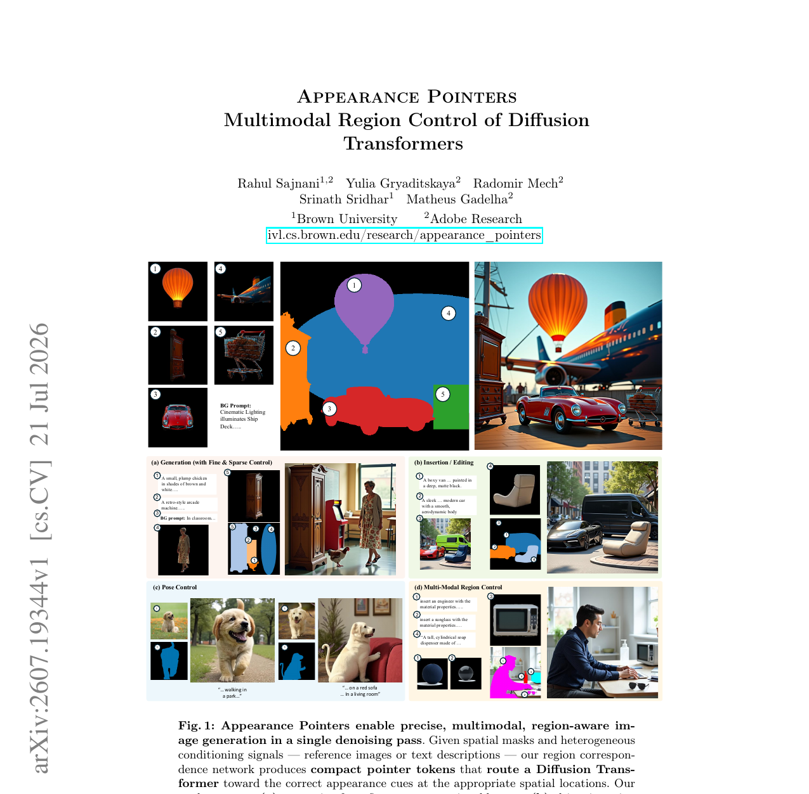
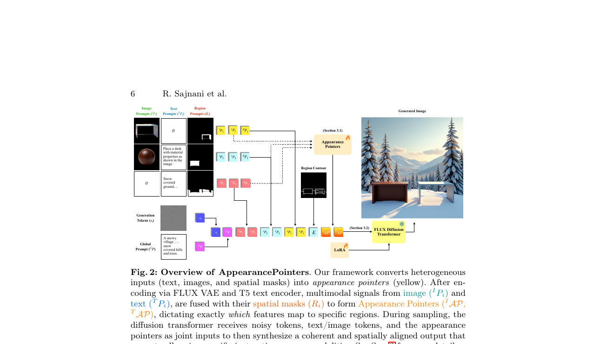
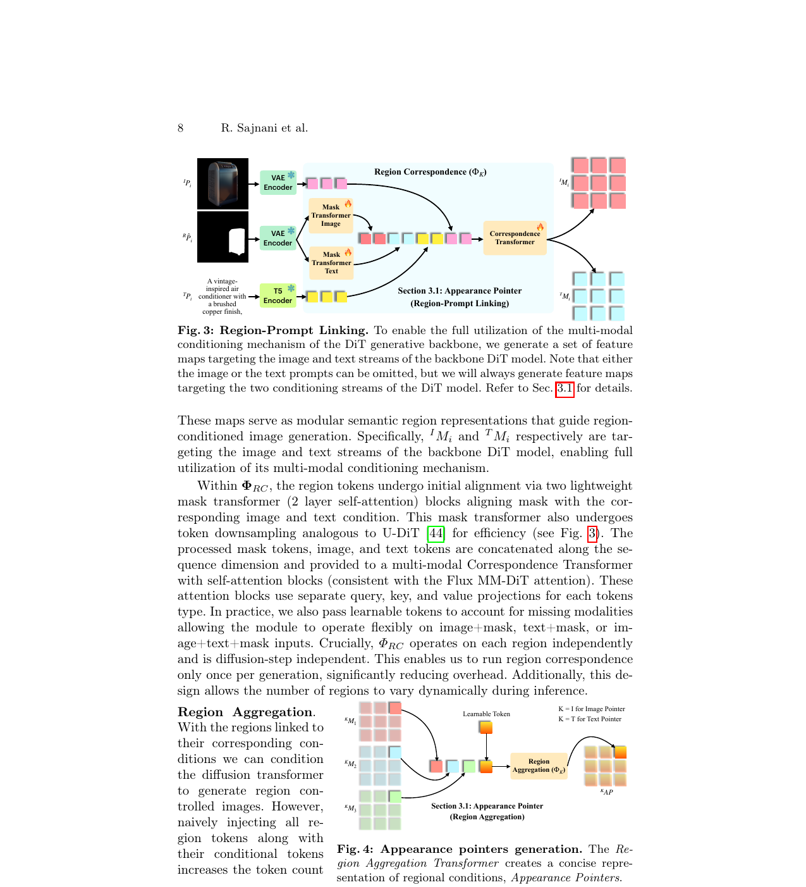

# AI Daily

## Appearance Pointers — Multimodal Region Control of Diffusion Transformers

**論文標題**：Appearance Pointers -- Multimodal Region Control of Diffusion Transformers
**作者**：Rahul Sajnani, Yulia Gryaditskaya, Radomir Mech, Srinath Sridhar, Matheus Gadelha
**發表機構**：Brown University, Adobe Research
**發表時間**：2026-07-21 (arXiv)
**論文連結**：[arXiv:2607.19344](https://arxiv.org/abs/2607.19344)
**專案頁面**：[ivl.cs.brown.edu/research/appearance_pointers](https://ivl.cs.brown.edu/research/appearance_pointers.html)

---

### 核心貢獻和創新點

在圖像生成領域中，儘管基於 Diffusion Transformer (DiT) 的模型（如 FLUX）能夠原生接收來自文本和圖像的異構 Token，但它們缺乏一種機制來決定「哪些 Token 應該在哪些空間區域發揮作用」。傳統的純文本提示難以實現精確的區域控制（如材質、物件身份、空間排列），而現有的區域控制方法多半針對舊有的 U-Net 架構設計，且通常受限於單一模態（純文本或純圖像），難以在單次生成中無縫結合多種條件 [1]。

本文提出了一種名為 **Appearance Pointers（外觀指標）** 的創新機制，其核心貢獻包括：

1. **Training-Free 級別的輕量級模組化控制**：引入一種緊湊的 Token 表示法，不直接儲存外觀資訊，而是作為「指標」引導 DiT 在正確的空間位置尋找對應的文本或圖像特徵。這使得模型能在不重新訓練 DiT 骨幹的情況下，實現精確的區域感知控制。
2. **多模態同步區域控制 (Multimodal Region Control)**：首次在單一擴散過程中，允許使用者同時使用圖像和文本來描述不同（或相同）的區域。例如，可以使用文本指定某個區域的形狀，同時使用參考圖像指定該區域的材質。
3. **高效的空間聚合機制 (Spatial Aggregation)**：透過 Region Correspondence 和 Region Aggregation 模組，將多個區域的特徵壓縮成單一畫布大小的指標 Token，有效避免了多區域生成時 Token 數量暴增導致的 $\mathcal{O}(N^2)$ 注意力計算瓶頸。
4. **AppearancePointers-37K 資料集**：構建了一個包含 3.7 萬筆數據的高品質區域控制資料集，涵蓋細粒度區域文本描述、姿態變化、材質變化和多物件場景，填補了現有開源資料集的空白。

*圖 1：Appearance Pointers 支援多種精確的區域感知圖像生成任務，包括 (a) 稀疏佈局生成、(b) 保持材質與風格的物件插入、(c) 姿態條件生成，以及 (d) 結合圖像與文本的同步多模態區域控制。*

---

### 技術方法簡述

Appearance Pointers 的核心思想是將使用者的區域意圖（Mask + 圖像/文本 Prompt）轉換為 DiT 能夠理解的路由指令。整個框架主要由兩個輕量級 Transformer 模組構成，附加於預訓練的 DiT（如 FLUX）之上。

#### 1. 區域條件編碼 (Region and Condition Encoding)

給定 $n$ 個區域條件 $\mathcal{R}=\{(R_i, P_i)\}_{i=1}^{n}$，其中 $R_i \in \{0,1\}^{H\times W}$ 為區域 Mask，$P_i$ 為對應的局部提示（文本或圖像）。
- **圖像提示**經過 VAE 編碼為圖像 Token ${}^{I}\mathcal{P}_i$。
- **文本提示**經過 T5 編碼器提取為文本 Token ${}^{T}\mathcal{P}_i$。
- **Mask** 在加入空間座標資訊後，同樣經過 VAE 編碼為帶有空間上下文的 Mask Token $\hat{{}^{R}\mathcal{P}_i}$。

#### 2. 區域-提示連結 (Region-Prompt Linking)

為了將空間約束與語義內容結合，論文設計了 **Region Correspondence Transformer ($\Phi_{RC}$)**。該模組獨立處理每個區域，將 Mask、圖像和文本 Token 對齊：

$$
{}^{I}M_i,\;{}^{T}M_i := \Phi_{RC}([\hat{{}^{R}\mathcal{P}_i},\;{}^{I}\mathcal{P}_i,\;{}^{T}\mathcal{P}_i])
$$

輸出 ${}^{I}M_i$ 和 ${}^{T}M_i$ 分別是針對 DiT 圖像流和文本流的語義特徵圖。$\Phi_{RC}$ 包含輕量級的 Mask Transformer（用於初始對齊與下採樣）和多模態 Correspondence Transformer（採用獨立的 Q, K, V 投影處理不同模態）。

*圖 2：Appearance Pointers 框架總覽。異構輸入（文本、圖像、空間 Mask）被轉換為 Appearance Pointers，引導 FLUX Diffusion Transformer 在正確的區域使用對應的特徵。*

#### 3. 區域聚合 (Region Aggregation)

如果直接將所有區域的 Token 注入 DiT，會導致計算量急劇增加。因此，論文引入 **Region Aggregation Transformer ($\Phi_A$)**，在每個空間 Patch 位置上進行跨區域的 self-attention，並使用可學習的 `[CLS]` Token 來匯總資訊，最終產生緊湊的 Appearance Pointers：

$$
{}^{T}\mathcal{AP} := \Phi_A^T([{}^{T}A, {}^{T}\mathcal{M}])
$$

$$
{}^{I}\mathcal{AP} := \Phi_A^I([{}^{I}A, {}^{I}\mathcal{M}])
$$

其中 ${}^{T}\mathcal{M}$ 和 ${}^{I}\mathcal{M}$ 是將所有區域的 ${}^{T}M_i$ 和 ${}^{I}M_i$ 堆疊而成的張量。

*圖 3：Region-Prompt Linking 與 Region Aggregation 的內部結構。透過空間下採樣與聚合，大幅降低了 DiT 的注意力計算負擔。*

#### 4. DiT 條件注入與邊緣引導

生成的 ${}^{T}\mathcal{AP}$ 和 ${}^{I}\mathcal{AP}$ 會與原始的局部提示 Token 一同作為條件輸入 DiT 的文本流和圖像流。此外，為了彌補特徵聚合過程中可能流失的細粒度邊界資訊，論文還將所有區域的邊緣提取為單一的邊界圖 (Region Contour Map)，經 VAE 編碼後一併送入 DiT。

---

### 實驗結果和性能指標

論文在自行構建的 AppearancePointers-37K 資料集上進行了廣泛的定量與定性評估。

#### 文本條件區域生成 (Text-Conditioned Region Generation)

在僅使用文本描述區域的任務中，Appearance Pointers 全面超越或媲美現有方法（如 InstanceDiffusion、DreamRenderer、Seg2Any）：
- **全域圖像品質 (CLIP-IQA)**：達到 **95.02**（最佳）。
- **區域保真度 (CLIP-I)**：達到 **90.40**（最佳）。
- **語義對齊 (DINO-I)**：達到 **56.09**（最佳）。
- **形狀一致性 (MIoU)**：達到 40.35（次佳，僅微幅落後 InstanceDiffusion 的 41.04）。

#### 圖像條件區域生成 (Image-Conditioned Region Generation)

在最具挑戰性的圖像參考區域生成任務中，Appearance Pointers 擊敗了 MS-Diffusion 與 DreamRenderer*：
- **區域保真度 (CLIP-I)**：達到 **93.29**（最佳）。
- **語義對齊 (DINO-I)**：達到 **69.31**（最佳，大幅領先 DreamRenderer* 的 64.20）。
- **形狀一致性 (MIoU)**：達到 **40.97**（最佳）。
- **全域圖像品質 (CLIP-IQA)**：達到 **95.57**（最佳）。

消融實驗（Ablation Study）進一步證實，**Region Aggregation** 對於保持物件身份（Identity Preservation）至關重要（移除後 DINO-I 從 69.31 暴跌至 54.47），而 **Region Contour Guidance** 則是維持形狀一致性的關鍵（移除後 MIoU 從 40.97 降至 35.81）。

---

### 相關研究背景

本研究立足於近期視覺自迴歸與擴散模型的快速發展。隨著 FLUX 等 DiT 架構的普及，如何進行 Training-Free 或 Low-Overhead 的 Attention Modulation 成為熱門議題。
- **早期的 Bounding Box 與 Layout 控制**（如 GLIGEN [2]）通常需要針對特定架構進行大量微調，且難以處理不規則形狀。
- **基於 Cross-Attention 操作的方法**（如 Prompt-to-Prompt）在處理多物件或多模態輸入時，容易發生特徵洩漏（Feature Leakage）或概念混淆。
- **近期的區域控制方法**（如 MS-Diffusion、Seg2Any）雖然有所改進，但往往受限於單一模態，或在處理多個圖像參考時無法在單次推理中完成。

Appearance Pointers 的設計哲學與 Energy-Based Model (EBM) 或 VAR-based 方法中強調的「精確局部能量引導」有異曲同工之妙，透過引入顯式的「指標」機制，優雅地解決了 DiT 在空間特徵路由上的盲點。

---

### 個人評價和意義

這篇來自 Adobe Research 的論文具有極高的實用價值與啟發性。在目前 DiT 模型大行其道的背景下，多數研究仍專注於全域的 prompt following，而忽略了專業創作者對「空間+多模態」精確控制的強烈需求。

**主要亮點：**
1. **架構優雅**：沒有粗暴地修改 DiT 的核心注意力機制，而是透過外部的 Correspondence 與 Aggregation Transformer 來準備「指標 Token」，這種解耦設計極大地保留了預訓練 DiT 的先驗能力。
2. **多模態同步注入**：允許「形狀用文本描述、材質用圖片指定」的組合操作，這在過往的方法中極難實現，為 AI 輔助設計（如室內設計、商品展示）打開了新大門。
3. **計算效率**：指標的計算在整個去噪過程前只需執行一次，相對於在每個 step 中修改 attention map 的方法，推理速度極快，幾乎沒有額外負擔。

**局限與未來方向：**
論文也坦承在處理極小區域或極端細節（如人臉特徵）時仍有進步空間，且當區域數量過多（大於 10 個）時，控制能力會下降。這可能暗示了目前的 Aggregation 機制在極高密度資訊下仍存在瓶頸。未來或許可以結合 JEPA (Joint-Embedding Predictive Architecture) 的局部預測思想，進一步強化模型對微小區域特徵的表徵能力。

---

### 參考文獻

[1] R. Sajnani, Y. Gryaditskaya, R. Mech, S. Sridhar, and M. Gadelha, "Appearance Pointers -- Multimodal Region Control of Diffusion Transformers," arXiv preprint arXiv:2607.19344, 2026. Available: https://arxiv.org/abs/2607.19344.
[2] Y. Li et al., "GLIGEN: Open-Set Grounded Text-to-Image Generation," in Proceedings of the IEEE/CVF Conference on Computer Vision and Pattern Recognition (CVPR), 2023.
