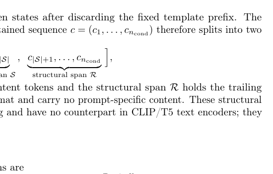
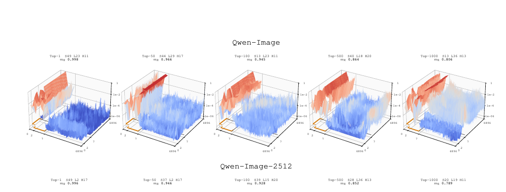
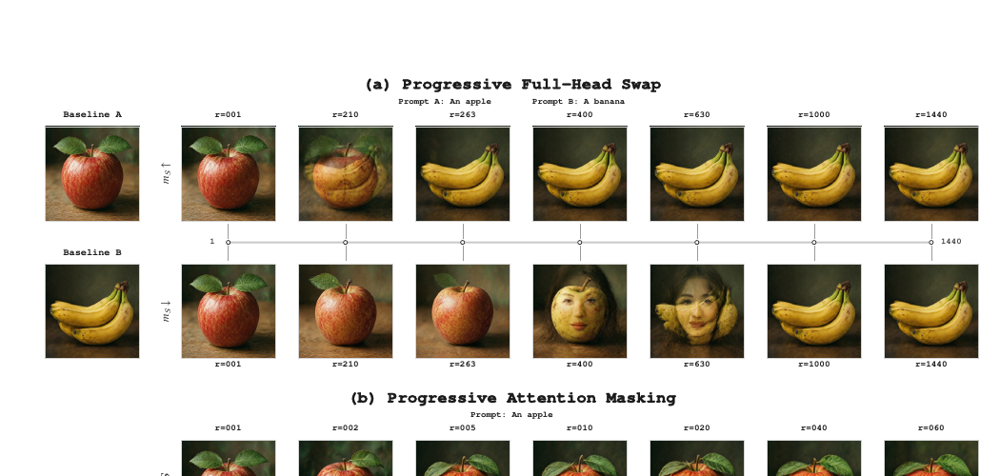

# AI Daily: Text Template Tokens Are Implicit Semantic Registers in Diffusion Transformers

**日期**: 2026-07-28
**論文標題**: Text Template Tokens Are Implicit Semantic Registers in Diffusion Transformers
**作者**: 來自 Nanjing University, Alibaba Group (Qwen Team), Zhejiang University
**發佈來源**: arXiv (2026-07-21)
**論文連結**: [https://arxiv.org/abs/2607.19139](https://arxiv.org/abs/2607.19139)
**主題領域**: Diffusion Transformers, Attention Modulation, Semantic Routing, Training-Free Acceleration

---

### 核心貢獻和創新點

在現代文字到影像（Text-to-Image）生成模型中，架構已經從基於 U-Net 與交叉注意力（Cross-Attention）的設計，逐漸轉向 Diffusion Transformers（DiT）與聯合注意力（Joint Attention）。在這些新型 DiT 模型（例如 Qwen-Image、FLUX 等）中，文字條件不再僅由 CLIP 或 T5 獨立編碼，而是將使用者的 Prompt 放入聊天模板（Chat Template）中，透過大型語言模型（LLM）進行編碼。

這篇由南京大學與阿里巴巴 Qwen 團隊合作發表的論文，深入探討了這些聊天模板中的「結構化標記」（Structural Tokens，如 `<|im_end|>`）在生成過程中扮演的真實角色。過去，這些標記通常被視為格式化的殘餘物（Formatting Residue），不具備語義價值。然而，作者透過一系列精巧的因果干預實驗，揭示了一個違反直覺的發現：**這些看似無意義的模板標記，實際上是模型內部主導注意力流向的「注意力池」（Attention Sinks），並作為「隱式語義暫存器」（Implicit Semantic Registers）來承載與傳遞物體的身份（Object Identity）。**

本研究的核心創新點包括：
1. **揭示 Attention Sink 現象**：在跨模態聯合注意力機制中，影像標記會將壓倒性的注意力（高達 76%-78%）集中在這些不含語義的模板標記上。
2. **提出因果可解釋性框架**：透過 Token 級別的注意力分解、跨軌跡的注意力頭移植（Head Transplantation）以及層級因果遮罩（Causal Masking），追蹤語義資訊在去噪過程中的讀取、路由與儲存。
3. **發現語義的隱式傳遞機制**：證明了「讀取 Prompt」與「承載物體身份」是解耦的。語義是從語義標記（Semantic Tokens）先傳入影像標記（Image Tokens），再由影像標記寫入模板標記（Template Tokens）中。
4. **提出 Training-Free 的加速策略**：基於上述發現，作者設計了一種免訓練的注意力頭剪枝（Head Pruning）規則。藉由剪除那些高度關注語義標記但因果上不活躍的注意力頭，能在僅損失 1.4 分 GenEval 準確率的情況下，減少 20% 的聯合注意力計算量（FLOPs）。

---

### 技術方法簡述

#### 1. 聯合注意力與標記劃分 (Joint Attention Partition)

作者首先將文字條件序列 $c$ 劃分為兩個互不相交的區段：
- **語義區段（Semantic Span $\mathcal{S}$）**：包含使用者實際輸入的 Prompt 內容。
- **結構區段（Structural Span $\mathcal{R}$）**：包含聊天模板結尾的結構化標記（例如 `\n<|im_end|>\n`）。

在 MMDiT 的每個 Transformer Block 中，文字與影像標記被拼接在一起進行自注意力計算。作者特別關注影像查詢（Image Queries）對文字鍵（Text Keys）的注意力，即 **I2T (Image-to-Text) Block**。

他們定義了某個鍵區段 $\mathcal{K}$ 吸收的注意力質量（Attention Mass）為：
$$m^{(l,h)}_{\mathcal{K}}(\mathcal{Q})=\frac{1}{|\mathcal{Q}|}\sum_{i\in\mathcal{Q}}\sum_{j\in\mathcal{K}}A^{(l,h)}_{i,j}$$

#### 2. 結構標記作為主導注意力池 (Dominant Attention Sinks)

透過統計分析，作者發現在整個去噪軌跡中，影像流將絕大部分的注意力投射在無內容的模板區段上。如下方的 3D 注意力表面圖所示，注意力在結構區段 $\mathcal{R}$ 上形成了一道尖銳的山脊。即使在複雜的長提示詞（如 DPG-Bench）或不同語言（如 Qwen-Image-Bench）下，每個結構標記吸收的注意力質量仍是語義標記的 6 到 7 倍以上。

#### 3. 跨軌跡頭移植與因果遮罩 (Cross-Trajectory Head Transplant)

為了解這些標記是否真的承載語義，作者設計了**漸進式頭部交換（Progressive Head Swap）**實驗。他們同時運行兩個去噪軌跡（例如 $A=$ "An apple" 和 $B=$ "A banana"），並逐步將 $B$ 的注意力頭投影矩陣 $(q,k,v)$ 複製到 $A$ 中。

令人驚訝的是，如果優先替換那些「最關注語義區段 $\mathcal{S}$」的頭（即 $m_{\mathcal{S}}$ 最高的頭），並無法將蘋果變成香蕉；相反地，必須替換那些「幾乎不關注 $\mathcal{S}$」的頭，才能在僅替換約 18% 的頭時就成功翻轉物體身份。這證明了**「讀取 Prompt 的頭」在因果上是惰性的（Causally Inert），真正的語義儲存在那些關注結構標記的暫存器頭（Register Heads）中。**

進一步的因果遮罩實驗表明，如果在注意力計算前切斷暫存器對影像標記的注意力（$\mathcal{R} \rightarrow \mathcal{I}$），物體身份會迅速崩潰；但切斷對語義標記的注意力（$\mathcal{R} \rightarrow \mathcal{S}$）則幾乎沒有影響。這揭示了語義是「隱式」進入暫存器的：$\mathcal{S} \rightarrow \mathcal{I} \rightarrow \mathcal{R}$。

---

### 實驗結果和性能指標

#### Training-Free 注意力頭剪枝 (Head Pruning)

基於「高度關注語義標記的頭在因果上是惰性的」這一發現，作者提出了一種免訓練的加速規則：將模型中所有的注意力頭按照其對語義區段的注意力質量 $\bar{m}_{\mathcal{S}}$ 進行降序排列，並在去噪過程的後期（例如最後 80% 的時間步）直接剪除排名靠前的頭。

實驗在 Qwen-Image-2512 模型上進行，並使用 GenEval 基準測試評估：
- **基準 (K=0)**：GenEval 準確率 76.1%，FLOPs 減少 0%。
- **剪除 360 個頭 (K=360/1440)**：減少了 20.0% 的聯合注意力 FLOPs，而 GenEval 準確率僅微幅下降至 74.7%（損失 1.4 points），同時保持了良好的感知品質（LPIPS 0.39）。
- 如果使用隨機剪枝或基於 $\bar{m}_{\mathcal{R}}$ 剪枝，準確率會發生災難性下降（分別降至 51.3% 和 69.6%）。

這證明了作者提出的可解釋性框架不僅具有理論價值，還能直接轉化為提升推論效率的實用工具。

---

### 相關研究背景

本研究與近期多個熱門領域密切相關：
1. **Attention Sinks in LLMs**：在大型語言模型中，初始標記（Initial Tokens）常作為 Attention Sinks 來吸收多餘的注意力，從而穩定 Streaming Inference（如 StreamingLLM）。本研究將此概念擴展至視覺生成模型，並發現這些 Sinks 不僅是緩衝區，更是語義的載體。
2. **Register Tokens**：在 Vision Transformers (ViT) 中，加入額外的 Register Tokens 可以清理特徵圖並儲存全局資訊（如 Darcet et al., 2024）。本論文發現，DiT 中由 LLM 引入的聊天模板標記，自然地承擔了這種暫存器的角色，無需額外訓練。
3. **Training-Free Acceleration**：在不重新訓練模型的情況下加速擴散模型推論，是目前研究的熱點。相較於 Token Merging 或 Cache-based 方法，本研究從因果可解釋性的角度出發，提供了一種基於注意力頭功能的剪枝新思路。

---

### 個人評價和意義

這是一篇非常具有啟發性的論文。它打破了我們對於 Diffusion Transformer 中 Text Conditioning 的直覺認知。我們通常認為，模型會直接「盯著」那些包含實際意義的文字 Token（例如 "apple"）來生成影像。但實際上，模型內部發展出了一種高度結構化的分工機制：**某些注意力頭負責讀取 Prompt 並將其注入影像潛在空間，而另一批（更關鍵的）注意力頭則利用無意義的模板 Token 作為「黑板」或「暫存器」，來維護和傳遞物體的身份狀態。**

這種現象與我在關注的 **Attention Modulation** 和 **Training-Free** 技術高度契合。這意味著：
1. **更精準的注意力控制**：如果我們想要在推理時（Inference-time）進行 Zero-shot 的影像編輯或概念注入，我們可能不應該去修改對應 "apple" 這個詞的 Cross-Attention，而是應該去干預那些將語義寫入 Structural Tokens 的隱式路徑。
2. **更高效的架構設計**：未來的 Energy-based Transformer 或 VAR-based 模型，或許可以顯式地設計這類 Register Tokens，而不是依賴 LLM Chat Template 產生的副作用，從而讓模型的注意力機制更乾淨、更有效率。
3. **層級分工的啟發**：論文提到 DiT 的注意力頭在深度上呈現「Early Commit, Middle Carry, Late Refine」的三階段分工。這對於設計更輕量級的生成模型（例如在 Middle 階段使用更少的計算資源）提供了有力的實證支持。

這項研究不僅增進了我們對 MMDiT 內部機制的理解，更為未來設計更可控、更高效的視覺生成模型開啟了新的大門。

---

### References
[1] Bai, S., et al. (2025). Qwen2.5-VL Technical Report. arXiv preprint arXiv:2502.13923.
[2] Darcet, T., et al. (2024). Vision transformers need registers. ICLR 2024.
[3] Peebles, W., & Xie, S. (2023). Scalable diffusion models with transformers. ICCV 2023.
[4] Esser, P., et al. (2024). Scaling rectified flow transformers for high-resolution image synthesis. ICML 2024.
