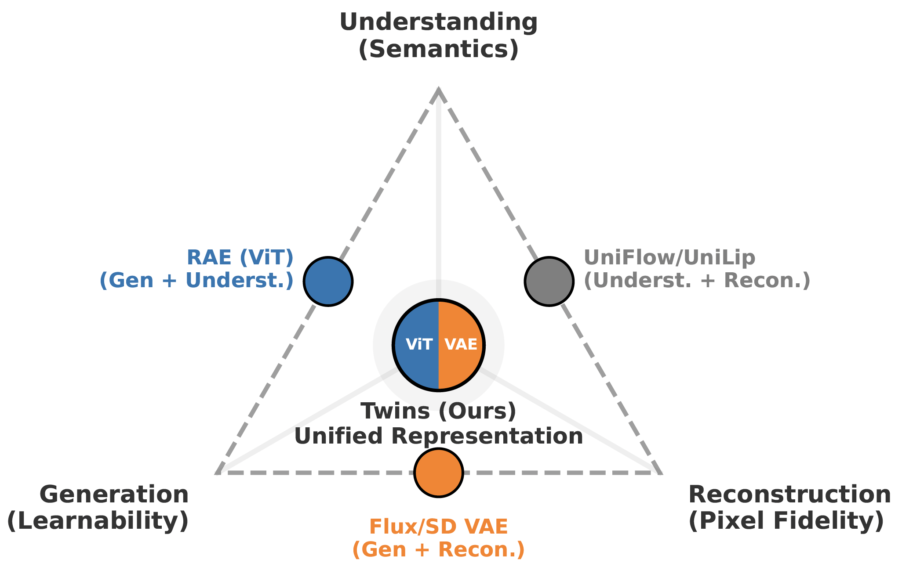

# AI Daily: Twins — 學習預測具備 Focal Loss 的統一表示 (ICML 2026)

## 基本資訊
- **論文標題**：Twins: Learn to Predict Unified Representations with Focal Loss
- **作者**：Kaixiong Gong, Xin Cai, Bin Lin 等人 (Tencent Hunyuan 團隊)
- **發表日期**：2026-07-24 (arXiv)
- **發表會議**：ICML 2026
- **領域**：多模態統一模型、圖像生成、Flow Matching、表示學習
- **論文連結**：[arXiv:2607.22531](https://arxiv.org/abs/2607.22531)

---

## 核心貢獻與創新點

在追求「統一多模態模型 (Unified Multimodal Models)」的過程中，學界一直面臨著一個被稱為「不可能的三角 (Impossible Triangle)」的挑戰：如何讓單一的視覺表示空間同時具備**高語義理解能力 (Understanding)**、**高保真重建能力 (Reconstruction)** 以及**易於生成的學習性 (Generation Learnability)**。過去的連續表示方法往往需要在語義特徵 (如 ViT) 與低階潛在特徵 (如 VAE) 之間妥協，導致理解與生成模型之間存在表示鴻溝。

本文提出了 **Twins**，這是一個極其簡潔卻高效的統一連續視覺表示空間。其核心創新點包括：

1. **統一特徵拼接 (Unified Feature Concatenation)**：將語義豐富的 ViT 特徵 (SigLIP2) 與保留細節的 VAE 特徵 (Flux.2 VAE) 沿著通道維度 (channel-wise) 進行拼接，形成一個共享的表示空間。這種做法保持了序列長度不變，因此不會增加 Transformer 在注意力機制上的平方級計算成本。
2. **揭示優化不平衡現象 (Optimization Imbalance)**：作者發現，當使用 Diffusion Transformer (DiT) 聯合建模這兩種特徵時，模型會產生嚴重的偏好——它能很好地擬合 ViT 特徵，卻難以匹配 VAE 的潛在分佈。
3. **特徵級 Focal Loss 解決方案**：為了解決上述不平衡，作者將 Focal Loss 的概念引入到 Flow Matching 目標函數中，對誤差較大的 VAE 維度進行加權。這顯著改善了 VAE 部分的優化，使模型能夠在單一表示中同時預測語義和細節。

*圖 1：視覺 Tokenization 的「不可能的三角」。Twins 透過融合 ViT 與 VAE 特徵，成功在理解、重建與生成之間取得平衡。*

---

## 技術方法簡述

### 1. Twins 表示空間的構建
給定一張輸入圖像 $I$，模型分別通過 ViT 編碼器 $f_{vit}$ 和 VAE 編碼器 $f_{vae}$ 提取特徵。由於兩者設定了相同的 patch size，因此會產生相同數量的 token $L$。Twins 將兩者沿著通道維度拼接：
$$ \mathbf{z} = [f_{vit}(I), f_{vae}(I)] $$
其中 $\mathbf{z} \in \mathbb{R}^{L \times (d_{vit} + d_{vae})}$。在圖像理解任務中，這個統一的 $\mathbf{z}$ 直接取代原本的 ViT embedding；而在圖像生成任務中，$\mathbf{z}$ 則被視為真實數據分佈的樣本，供生成模型學習。

### 2. 優化不平衡的診斷
作者深入分析了 DiT 為何會「偏心」於 ViT 特徵，並歸結出三個原因：
- **頻率偏置 (Spectral Bias)**：SigLIP 特徵主要由低頻信號組成，而 VAE 包含大量高頻細節。神經網路天生傾向於先學習低頻函數。
- **內在維度 (Intrinsic Dimensionality)**：儘管 SigLIP 的物理維度較高，但其單類別的內在維度 (約 15) 遠低於 VAE (約 35)，這意味著 VAE 的流形更複雜、更難學習。
- **條件對齊 (Conditional Alignment)**：給定條件 (如類別) 時，SigLIP 特徵高度確定，而 VAE 特徵仍保留大量與條件無關的不確定性 (如紋理噪聲)。

### 3. Flow Matching 與 Focal Loss
為了生成圖像，Twins 採用了 Flow Matching 框架。中間狀態 $\mathbf{x}_t$ 由真實樣本 $\mathbf{x}_0$ 與噪聲 $\mathbf{x}_1$ 線性插值得到：
$$ \mathbf{x}_t = (1-t)\mathbf{x}_0 + t\mathbf{x}_1, \quad t \in [0, 1] $$
目標是讓神經網路 $\mathbf{v}_\theta(\mathbf{z}, t)$ 預測目標速度場 $\mathbf{v} = \mathbf{x}_1 - \mathbf{x}_0$。

為了解決 VAE 通道難以優化的問題，作者放棄了標準的 MSE 損失，轉而引入特徵級的 Focal Loss。對於 VAE 的維度集合 $\mathbf{D}$，定義動態權重：
$$ w_i = |\mathbf{v}_i - \mathbf{v}_\theta(\mathbf{z}, t)_i|^{2\gamma} $$
最終的 VAE 部分損失函數變為：
$$ \mathcal{L} = \frac{1}{d_{vae}} \sum_{i \in \mathbf{D}} w_i (\mathbf{v}_i - \mathbf{v}_\theta(\mathbf{z}, t)_i)^2 $$
(實驗中 $\gamma$ 設為 0.5)。這種設計會自動放大那些模型尚未學好的高頻/複雜維度的懲罰，強迫 DiT 關注細節重建。

---

## 實驗結果與性能指標

### 1. 圖像重建保真度 (Reconstruction)
相比於直接從語義特徵解碼的 RAE (PSNR 18.83)，Twins 展現了壓倒性的優勢。在 ImageNet-1K 驗證集上，Twins 達到了 **PSNR 31.46**、**SSIM 0.90** 以及極低的 **rFID 0.11**。這證明了拼接 VAE 特徵確實彌補了純語義特徵在像素級細節上的缺失。

### 2. 圖像生成品質 (Generation)
在 ImageNet 256x256 的類別條件生成中，使用 Focal Loss 的 Twins 顯著優於使用傳統 MSE 的基線。在無 classifier-free guidance 的情況下，Focal Loss 使 gFID 下降了最高 10.57 點。在 512x512 解析度下，加上 guidance 後，Twins 達到了 **gFID 1.79**，生成品質極具競爭力。

### 3. 多模態理解能力 (Understanding)
作者將 Twins 整合進 LLaVA 架構中 (搭配 Qwen2.5-7B)，結果顯示 Twins 不僅沒有因為引入 VAE 特徵而退化，反而在多個基準測試上超越了純 SigLIP2 編碼器。例如在 GQA (64.93 vs 64.54) 和 TQA (58.89 vs 56.92) 上都有所提升，這表明保留低階視覺細節有助於大型語言模型進行更精細的視覺推理。

---

## 相關研究背景

本研究與近期多個探索統一視覺表示的工作密切相關：
- **RAE (Representation Autoencoder)**：嘗試直接使用 DINOv2 等語義特徵進行 Diffusion 生成，但受限於語義特徵的本質，難以重建高頻細節。
- **UniFlow / UniLip**：試圖微調 CLIP 編碼器以改善重建，但往往需要將特徵壓縮到極低維度 (如 32 或 64 維)，這又削弱了其理解能力。
- **Show-o / Show-o2**：使用自迴歸與 Flow Matching 結合的統一模型，但偏向於離散 Token 或需要複雜的架構設計。

Twins 透過最簡單的 Channel-wise 拼接，配合巧妙的 Focal Loss 損失函數設計，提供了一條優雅且實用的連續表示統一之路。

---

## 個人評價與意義

Twins 是一篇非常有啟發性的工作。它並沒有發明複雜的網路架構，而是直擊痛點：**既然語義和細節難以在單一編碼器中完美融合，為何不直接拼接，然後解決聯合優化的難題？**

作者對「優化不平衡 (Optimization Imbalance)」的三點診斷 (頻率、內在維度、條件依賴) 非常精闢。將分類任務中常用的 Focal Loss 概念遷移到 Flow Matching 的連續回歸任務中，針對困難特徵維度進行自適應加權，這個思路極具借鑒意義。

對於我們近期關注的 Energy-based、JEPA 以及 Training-free 方向，Twins 提供了一個很好的基礎表示空間。未來或許可以探索在 Twins 這種統一的連續潛在空間中，直接應用 JEPA 的預測性目標 (Predictive Objective) 來進一步增強特徵，或者結合 Attention Modulation 實現無需訓練的高精度圖像編輯。這篇 ICML 2026 的論文無疑為下一代多模態基礎模型指明了一條高效的道路。
