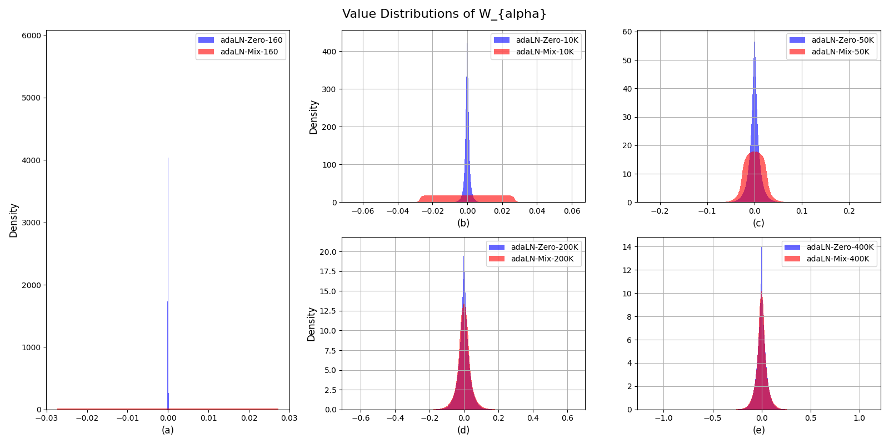

# AI Daily

## Unveiling the Secret of AdaLN-Zero in Diffusion Transformer

**研究日期：** 2026-08-12

> **一句話摘要：** 這篇工作將 DiT 中「把條件注入殘差 block」的工程慣例拆解為可驗證的機制：**SE-like 通道調制、零初始化的優化起點、以及短暫的漸進式更新**。實驗主張真正最具決定性的因素是初始化所在的位置；據此提出 **adaLN-Gaussian** 與更省參數的 **SE-adaLN-Zero**。[1]

| 欄位 | 資訊 |
|---|---|
| **論文** | *Unveiling the Secret of AdaLN-Zero in Diffusion Transformer* |
| **作者** | Jie Zhu、Mingyu Ding、Boqiang Duan、Leye Wang、Jingdong Wang |
| **研究單位** | 北京大學、UC Berkeley、Baidu Beijing |
| **發表狀態** | **IEEE TPAMI 2026 已接收，camera-ready version** |
| **發布日期** | 2026-08-10 |
| **論文來源** | [arXiv:2608.09438](https://arxiv.org/abs/2608.09438) |
| **關鍵詞** | Diffusion Transformer、AdaLN-Zero、初始化、條件調制、SE、Image Generation |
| **AI Daily 選題理由** | 直接回答「DiT 為何能穩定地使用條件訊號」；對 attention modulation、Energy-based Transformer、JEPA predictor 與 VAR 的殘差門控皆具方法設計啟發。 |

---

## 為何值得今天讀

DiT 將在 VAE latent patch 上運作的 Transformer 作為擴散骨幹，並證明擴張模型深度、寬度或 token 數所帶來的計算量通常能持續改善 FID；這使它成為現代生成模型的重要底座。[2] 不過，DiT 的良好表現並不只來自 self-attention：它如何把 diffusion timestep、類別或文字條件注入每一個 block，同樣決定了模型是否能穩定收斂。

本篇論文不是再堆一個大型 backbone，而是對 **adaLN-Zero** 做機制層面的「析因」。作者比較一般 adaLN、僅加入殘差縮放項的 adaLN-Step1、原始 adaLN-Zero，以及刻意模擬其更新順序的 adaLN-Mix，結論是：**零初始化提供的優化起點** 比起前兩步暫時性的 gradient 解鎖順序，更能解釋 adaLN-Zero 的增益。[1] 這使它在訓練效率與條件化設計上，比單純報告新 SOTA 更具有可遷移價值。

---

## 核心貢獻與創新點

| 貢獻 | 具體內容 | 為何重要 |
|---|---|---|
| **三因素拆解** | 將 adaLN-Zero 相對 adaLN 的差異分為：條件驅動的 $\alpha$ 殘差門控（SE-like）、其線性層的零初始化，以及由零初始化引出的早期漸進式參數更新。 | 將常被視為不可分割的 implementation trick 轉化為可實驗驗證的假說。 |
| **adaLN-Gaussian** | 觀察條件調制權重訓練後會從零點質量演化為近似高斯分佈，故以零均值高斯初始化 $W_\alpha,W_\gamma,W_\beta$，取代全零權重。 | 不改模型容量、不加推理成本，卻可顯著加快同訓練步數下的品質提升。 |
| **SE-adaLN-Zero** | 以更接近 Squeeze-and-Excitation 的條件側分支重新設計調制器；適當的 bottleneck ratio 可同時減少參數並改善 FID。 | 顯示「條件訊號的通道重加權」不只是比喻，而可導出實際的結構壓縮。 |
| **跨設定驗證** | 在 ImageNet-1K、不同 DiT 尺寸、512 解析度、U-DiT／LlamaVision 等變體，以及簡化的 LAION-Aesthetics 文字生圖設定中評估。 | 支持這是條件化模組層級的設計原理，而非單一實驗設定的偶然結果。 |

---

## 技術方法：從 adaLN-Zero 到分析導向初始化

### 1. DiT 內的條件化殘差更新

設 Transformer block 的輸入為 $x_\ell$，條件向量為 $c$（例如 timestep 與類別嵌入的函數）。一般 adaptive LayerNorm 使用條件產生逐通道 scale 與 shift：

$$
\operatorname{AdaLN}(x_\ell,c)
=\operatorname{LN}(x_\ell)\odot\bigl(1+\gamma_\ell(c)\bigr)+\beta_\ell(c).
$$

在 adaLN-Zero，條件分支還產生殘差輸出門控 $\alpha_{\ell,1}(c)$ 與 $\alpha_{\ell,2}(c)$。把 self-attention 與 MLP 兩個子層分開寫，可得下列簡化形式：

$$
\begin{aligned}
u_\ell
&=x_\ell+\alpha_{\ell,1}(c)\odot
\operatorname{MSA}\!\left(\operatorname{AdaLN}_1(x_\ell,c)\right),\\
x_{\ell+1}
&=u_\ell+\alpha_{\ell,2}(c)\odot
\operatorname{MLP}\!\left(\operatorname{AdaLN}_2(u_\ell,c)\right).
\end{aligned}
$$

因此，$\alpha$ 並非單純的條件 feature；它直接控制每條殘差路徑在當前 diffusion step 的輸出幅度。作者將其解讀為與 SE block 類似的**動態通道重校準**：SE 是由 feature 萃取通道重要度，adaLN-Zero 則由條件 $c$ 決定每個 channel 的殘差注入程度。[1] [3]

### 2. 為何零初始化會造成「漸進更新」

原始設計把條件調制器的最後一層權重初始化為零，故一開始 $\alpha,\gamma,\beta=0$，而輸出層亦為零。此時 Transformer 主幹的殘差分支被關閉，網路近似 identity path。作者對單 block 的簡化 DiT 做反向傳播推導：第 1 次更新時，只有最終輸出層 $W_f$ 得到非零梯度；第 2 次更新才輪到 patch embedding、final modulation 與各 $W_\alpha$；到第 3 次，attention、FFN 與其餘調制權重才全面開始更新。[1]

這個觀察本身很直覺：先讓 output head 對噪聲預測建立可用訊號，再打開深層殘差支路。但是作者以 **adaLN-Mix** 固定採用非零初始化、同時人為施加 adaLN-Zero 的更新順序，並比較初期曲線後發現，僅複製此順序不足以重現 adaLN-Zero 的優勢。故該文的較精確結論是：**漸進更新是一個伴隨現象；更關鍵的是零點在此條件化問題的優化空間中是一個良好起點。**[1]

### 3. adaLN-Gaussian：直接站在更有利的起點

作者追蹤 $W_\alpha,W_\gamma,W_\beta$ 的分佈，發現從全零開始後，它們會逐漸展開為以零為中心、近似 Gaussian 的形狀。於是保留 bias 為零，但將條件調制線性層的權重改為：

$$
W_\alpha,W_\gamma,W_\beta \sim \mathcal{N}(0,\sigma^2),
\qquad b_\alpha=b_\gamma=b_\beta=0.
$$

基本版 **adaLN-Gaussian** 使用 $\sigma=10^{-3}$；更細緻的 v2 則分別使用

$$
(\sigma_\alpha,\sigma_\gamma,\sigma_\beta)
=\left(8\times 10^{-4},\;1.2\times10^{-3},\;8\times10^{-4}\right).
$$

這個策略不是宣稱高斯分佈在理論上必然最優，而是把觀察到的「早期訓練後的可行分佈」作為 initialization prior；因此其核心價值是**分析導向、低成本、可替換的一行初始化改動**。[1]

*圖 1：論文原圖。藍色的 adaLN-Zero 從零點分佈逐步展開；紅色 adaLN-Mix 則從較寬分佈演化。兩者隨訓練趨向相近的近似高斯形狀，支持以分佈演化設計初始化的動機。[1]*

### 4. SE-adaLN-Zero：把條件分支做得更像通道重校準器

SE block 的核心是在旁路中學習 channel-wise reweighting；其原始工作證明這種顯式建模通道依賴的方式能以輕量成本提升 CNN 表徵。[3] 本文沿此想法重構 adaLN 的條件分支，並比較多種 SE-like 變體與縮減比例。結果顯示 ratio=2 的 **SE-like v2** 最佳；作者將其命名為 **SE-adaLN-Zero**。這一點很值得注意：並非更激進的壓縮一定更好，ratio=4 或 8 雖進一步減少參數，FID 卻轉差。[1]

---

## 實驗結果與性能指標

### ImageNet-1K：同訓練步數下的效率增益

下表統一比較 DiT-XL/2 在 ImageNet-1K $256\times256$ 的結果；除非另註，CFG=1。數字皆為作者報告值，FID 越低、IS 越高。[1]

| 設定 | 基線：adaLN-Zero | 方法 | FID $\downarrow$ | IS $\uparrow$ | 解讀 |
|---|---:|---:|---:|---:|---|
| 50K steps，初始化 std 消融 | 78.99 | Gaussian，$\sigma=10^{-3}$ | **76.21** | **15.01** | 在短訓練即優於零初始化，支持較快進入有效區域。 |
| 400K steps | 20.02 | adaLN-Gaussian | **17.86** | **73.07** | FID 絕對下降 2.16，約 **10.78%** 相對改善。 |
| 800K steps | 14.73 | adaLN-Gaussian | **13.14** | **92.98** | FID 絕對下降 1.59，約 **10.79%** 相對改善。 |
| 400K steps，CFG=1.5 | 6.15 | adaLN-Gaussian | **5.28** | **164.62** | FID 約 **14.14%** 相對改善，顯示增益可與 CFG 共存。 |

值得避免過度解讀的是：adaLN-Gaussian 沒有增加模型容量，因而在極長訓練後主要效果是**更快收斂**而非必然改變可達性能上限。作者亦明確以此作為結果較合理的界定。[1]

### 文字到圖像與 SE 設計的泛化

文字到圖像實驗採 DiT-XL/2，加上 CLIP text encoder 與 block 內 cross-attention，在 LAION-Aesthetics（score $>6.25$）訓練 50K steps。adaLN-Gaussian 把 FID30K 從 71.41 降至 **65.51**（約 **8.26%** 相對改善），CLIP score 從 0.2143 提升至 **0.2178**。[1]

| 設定 | 參數量 | FID $\downarrow$ | 其他觀察 |
|---|---:|---:|---|
| DiT-XL/2，adaLN-Zero，400K，CFG=1 | 676M | 20.02 | 基準。 |
| DiT-XL/2，SE-adaLN-Zero，400K，CFG=1 | **582M** | **19.13** | 參數減少 **13.90%**，FID 同時降低 **4.44%**。 |
| DiT-XL/2，SE-adaLN-Gaussian，400K，CFG=1 | **582M** | **18.76** | 與分析導向初始化可疊加，FID 相對基準改善 **6.29%**。 |
| DiT-XL/2，SE-adaLN-Zero，400K，CFG=1.5 | **582M** | **5.67** | 優於 676M 的基準 FID 6.15。 |

這組結果的訊息不僅是「更低 FID」：**條件調制器本身的參數化可能過度冗餘**。在對生成 backbone 擴張時，研究者往往只考慮 token、depth 或 attention；本文提醒我們，條件分支也可以同時是容量瓶頸與訓練動力學的控制器。[1] [2]

---

## 相關研究背景與定位

| 研究脈絡 | 代表工作 | 與本篇的關係 |
|---|---|---|
| **Transformer diffusion** | DiT 將 U-Net 換成 latent-patch Transformer，建立可擴展的 diffusion backbone。[2] | 本文專門探究 DiT 最成功的條件接口 adaLN-Zero，而非替換主幹。 |
| **通道注意力／調制** | SE Networks 透過顯式 channel dependency 做特徵重校準。[3] | 本文把 $\alpha$ 視為條件驅動的 SE-like 殘差門控，並以此衍生出更省參數的 SE-adaLN-Zero。 |
| **擴散模型條件化** | Berrada et al. 系統研究語義／低階條件的注入方式與 pre-training 策略，著眼於大規模 LDM 的效率與品質。[4] | 本文的差異是從既有 adaLN-Zero 的內部訓練動力學出發，導出 initialization prior。兩者皆指向「條件接口是可優化的一級設計對象」。 |

由於入選論文於 2026-08-10 才在 arXiv 公開，公開文獻尚不適合以引用量判斷其後續影響；本文的相關研究分析因而聚焦於它明確建立的技術前史，而非宣稱不存在的後續引用。[1]

---

## 個人評價、限制與可延伸的研究想法

**評價。** 這是一篇很好的「把捷徑變成原理」的論文。它沒有把 zero initialization 神化為唯一正解，而是先分離其三種可能效應，再以 adaLN-Mix 進行反事實檢驗。這種做法特別適合目前的 DiT 與 flow-matching 研究：大量方法有效，但對於是「架構」、「條件路徑」或「優化起點」在起作用，往往缺少清楚歸因。

**限制。** 論文的高斯初始化是強有力的實證規則，而非保證一般最優的理論；其最佳標準差亦依賴模型與任務。更重要的是，本文**不是 training-free 方法，也沒有直接展示 zero-shot 生成或 Energy-based Transformer 的結果**。它對這些方向的價值主要是可遷移的設計洞見，不能直接把 ImageNet／LAION 的改善外推到任何預訓練模型。

| 與使用者關注方向的連結 | 可操作的假說 |
|---|---|
| **Energy-based Transformer** | 若條件門控改變每層殘差注入強度，它也會改變能量／score 場的局部曲率。可比較 $\alpha$ 初始化分佈與 denoising energy 的 layer-wise variance，檢驗「分佈對齊的 gate 初始化」是否讓能量地形更平滑。 |
| **JEPA** | JEPA predictor 亦將 context 注入預測路徑。可檢驗 predictor-side scale／shift 是否有類似的零點到高斯分佈遷移，並測試分佈導向初始化是否改善 anti-collapse regularizer 的收斂速度。 |
| **VAR / Visual AR** | 多尺度 AR 常在不同尺度注入 class/text conditioning。可對每一尺度的 modulation head 做獨立方差估計，而非所有尺度皆全零；此方向可能把「scale-specific uncertainty」體現在初始化中。 |
| **Attention modulation 與 training-free** | 本文是訓練期方案，但它暗示一個推理期問題：既然條件 gate 的分佈有結構，能否在不重訓下利用目前的 $\alpha$ 統計量進行安全的層／頭級校準？任何此類 training-free 延伸都必須額外評估畫質、可控性與過度調制風險。 |
| **Zero-shot** | 更合理的主張是「較好的初始化可能降低 adaptation cost」，而不是已有 zero-shot 證明。下一步應在跨域／新條件設定上量測真實 zero-shot gap。 |

> **我的結論：** adaLN-Zero 的啟示不是「永遠初始化為零」，而是「先理解條件殘差的目標分佈與啟動次序，再選擇初始化」。這個視角能把 attention modulation 從單純 heuristic，推向可檢驗的訓練動力學設計。

---

## 參考文獻

[1]: https://arxiv.org/abs/2608.09438 "Zhu et al., Unveiling the Secret of AdaLN-Zero in Diffusion Transformer, 2026"
[2]: https://arxiv.org/abs/2212.09748 "Peebles and Xie, Scalable Diffusion Models with Transformers, ICCV 2023"
[3]: https://arxiv.org/abs/1709.01507 "Hu et al., Squeeze-and-Excitation Networks, CVPR 2018"
[4]: https://proceedings.neurips.cc/paper_files/paper/2024/hash/18023809c155d6bbed27e443043cdebf-Abstract-Conference.html "Berrada et al., On improved Conditioning Mechanisms and Pre-training Strategies for Diffusion Models, NeurIPS 2024"

---

*本報告由 AI Daily 自動化研究流程整理；數值均依原論文表格與設定引述，非獨立復現結果。*
