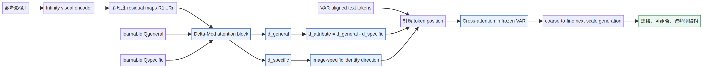

# AI Daily

## Attribute Token Arithmetic：在 VAR 的文字條件空間裡做可解耦、可連續的屬性控制

> **一句話摘要：** Attribute Token Arithmetic（ATA）發現預訓練 Visual Autoregressive Model（VAR）的文字對齊 latent space 具有類似詞向量的語義算術結構；它以單張參考影像與一組語義 prompt pair，透過只優化輕量 Delta-Mod、凍結 Infinity backbone，分離通用屬性方向與影像特定 identity 方向，再將它們注入對應文字 token，實現不需大規模 paired editing data 的連續、可組合與跨類別圖像編輯。[1] [2]

## 1. 為什麼今天選這篇？

本次先檢查 `KaiCobra/AI_Daily` 的 README、INDEX 與現有 2026 年 8 月文章。repository 已經涵蓋 **EditMod、SynVAR、VPG、UniJEPA、Orthogonal JEPA、Semantic Steering、DiffusionOPSD、Energy-Based Models、training-free attention modulation** 等鄰近方向，因此今天的主文不能只是再做一次「VAR 加一個控制模組」的摘要，而應該帶來新的表示空間觀點。現有索引未出現 ATA 或其 arXiv ID `2608.28082`，因此確認不是重複文章。

本日也瀏覽 Hugging Face Papers Trending 與 arXiv `cs.CV` 的最新投稿。Hugging Face 當日熱門列表主要由通用 agent、MoE serving 與多模態 embedding 論文構成；arXiv 8 月 31 日投稿中，ATA 是少數直接以 **Visual Autoregressive Models 的連續語義控制**為標題核心、同時又具備 ECCV 2026 官方會議頁的工作。[9] [10] 其餘候選如 LayerRecall 偏長影片記憶、Keep-or-Drop 偏影片 tokenizer、Sparse Test-Time Imagination 偏 world-action model，而 ATA 最直接連接使用者近期關注的 **VAR、zero-shot／training-free 介入、attention modulation 與可解釋 latent arithmetic**。

| 篩選面向 | 本次判斷 |
|---|---|
| 時效性 | arXiv v1 於 2026-08-28 提交；本報告於 2026-08-31 整理。[1] |
| 會議品質 | ECCV 2026 官方頁列為 Poster，主題分類為 Image Generation, Editing & Diffusion。[2] |
| 研究單位 | 五位作者均列於 Monash University Faculty of IT；其中 Jianfei Cai 與 Tien-Tsin Wong 是視覺生成與圖形領域具辨識度的研究者。[1] |
| 方法創新 | 不重訓 VAR backbone，而是在 VAR-aligned text-token space 學習 general attribute 與 image-specific identity 的可組合方向。[1] |
| 與偏好契合度 | VAR：直接建立於 Infinity；training-free：不更新 backbone，但需對每張參考影像優化輕量 Delta-Mod；attention modulation：在 cross-attention 使用的文字 token 位置注入方向；zero-shot：可把在一個物件上抽取的 attribute transfer 到另一物件類別。 |
| 去重結果 | 未發現 `Attribute Token Arithmetic`、`ATA` 或 `2608.28082` 已存在於 repository 的文章或索引中。 |

> **重要語義釐清：** ATA 並非嚴格意義上完全 training-free。作者凍結 VAR backbone，也不使用大型 paired editing dataset，但仍以單張參考影像為條件優化輕量 Delta-Mod；實驗設定為 500 steps、5 epochs、batch size 1。[1] 因此更準確的描述是 **frozen-backbone、per-reference lightweight optimization，且不需要 backbone fine-tuning**。這個區分對比較 AREdit、EditMod 等真正 inference-only 方法十分重要。

## 2. 論文基本資訊

| 欄位 | 內容 |
|---|---|
| 論文標題 | **Attribute Token Arithmetic: Disentangled and Continuous Semantic Control for Visual Autoregressive Models** |
| 方法名稱 | **ATA** |
| 作者 | Xindi Yang、Yicheng Wu、Cheng Zhang、Jianfei Cai、Tien-Tsin Wong |
| 研究單位 | Faculty of IT, Monash University [1] |
| arXiv | `2608.28082v1`，Computer Vision and Pattern Recognition，提交日 2026-08-28 [1] |
| 會議 | **ECCV 2026 Poster**；官方活動頁標示 2026-09-11、Image Generation, Editing & Diffusion [2] |
| Backbone | Infinity；bitwise、multi-scale Visual Autoregressive Model [1] [5] |
| 任務 | 參考影像的 text-guided、attribute-level、multi-attribute image editing |
| 條件形式 | 參考影像、general/specific prompt pair、需要注入的 attribute 或 identity token position |
| 核心標籤 | Visual Autoregressive Modeling、Token Arithmetic、Disentangled Representation、Continuous Control、Cross-Attention Modulation |
| 程式碼 | 論文連結至官方 repository `Madaoer/ATA`；截至本文整理時以該連結為準。[1] [8] |

## 3. 背景：為什麼 VAR 需要新的編輯座標系？

Diffusion image editor 通常沿著多步 denoising trajectory 逐步改變整張 latent，並透過 inversion、attention control、feature injection、mask 或 LoRA 盡量保留 source image。這種 global iterative refinement 擁有很強的生成品質，但也容易讓局部語義改動滲入不應變動的區域，且多次去噪不利於即時編輯。[1] [3]

VAR 則把圖像生成寫成離散 token 的序列或 next-scale prediction。Infinity 在多個解析度尺度上逐步產生 residual，粗尺度承載較大的構圖與語義，細尺度再補上局部細節；它以 bitwise token prediction、infinite-vocabulary classifier 與 bitwise self-correction 取代單一巨大離散 vocabulary，在 CVPR 2025 官方版本中報告 1024×1024 圖像約 0.8 秒生成。[5] 這種 coarse-to-fine、可解析的 token hierarchy 使 source image 不只是輸入，而可能成為一組帶有不同語義解析度的 state。

然而，VAR 的文字條件通常只提供「一個概念應該存在」的粗粒度指示，並沒有直接告訴模型「只增加一點年齡、不要改變身份」「把某個屬性的 30% 搬到另一個物件」等連續要求。ATA 的出發點是：若 VAR-aligned text-token space 真的像 word embedding 一樣保留可加減的語義方向，那麼編輯便不必重新訓練整個 editor，而可以直接在條件空間中尋找可解釋的 displacement。

*圖 1：根據 ATA 論文 Figure 3 的資料流重新繪製；圖中只保留方法必要元件，並非整頁論文截圖。原始論文與完整圖說請見 [1]。*

## 4. 核心貢獻與技術方法

### 4.1 Infinity 的 VAR 表示

令 prompt 為 \(P\)，VAR 的 frozen text encoder 與對齊 MLP 將它轉成 VAR-aligned text tokens。對參考影像 \(I\)，Infinity 的 visual encoder 產生多尺度 residual maps：

$$
\mathcal{R}(I)=\{R_1,R_2,\ldots,R_n\}.
$$

在第 \(k\) 個尺度，causal transformer 根據前面尺度的 residual 以及文字條件，預測下一個尺度的 residual；這等價於以 coarse-to-fine 的條件分佈產生圖像。每個 block 由 self-attention、cross-attention 與 feed-forward 組成，ATA 的介入點位於 **cross-attention 所讀取的文字 token**，而不是修改 VAR 權重或重新定義 visual tokenizer。[1]

這個介入位置很關鍵。若方向被加到 identity token，例如把「fat」方向注入「cat」，模型可能把屬性變成身份本身，導致物件改變；若方向被加到「ground」等不相關 token，則不會產生合理的屬性效果。作者的消融圖明確指出，**direction 的幾何內容與 token position 是綁定的**。[1]

### 4.2 直接的文字 token arithmetic

ATA 先用一個簡單實驗檢查文字 token 是否具有可加減的屬性方向。對 source prompt `A cat.` 與 target prompt `A fat cat.`，把 `cat` 視為 identity token，把與屬性相關的 token 集合分別記為 \(T_{attr}^{src}\) 與 \(T_{attr}^{tar}\)。直接的 attribute displacement 定義為

$$
\Delta T_{attr}
=\operatorname{mean}(T_{attr}^{tar})-T_{attr}^{src}.
$$

將此方向加回 source attribute token，便得到連續控制：

$$
\widehat{T}_{attr}^{src}
=T_{attr}^{src}+\gamma\Delta T_{attr},
$$

其中 \(\gamma\) 是屬性強度。\(\gamma=0\) 近似原始 source，正值增強屬性，負值則沿相反方向減弱屬性。這裡的數學形式與 NLP 中的 `king + woman - man ≈ queen` 相似，但 ATA 的觀察對象不是一般語言 embedding，而是 **經過 VAR 對齊、會被視覺 token 讀取的文字條件空間**。[1]

直接 token difference 已能產生局部或非局部的視覺改變，但作者發現它不足以完整表示「一張特定影像裡的 identity」與「一般性的 attribute」。因此 ATA 再加入 Delta-Mod，讓方向由參考影像決定，而不是完全依賴 prompt 的字面差。

### 4.3 以分佈均值拆開 general 與 specific

ATA 將一個 prompt 對應到 VAR-aligned text space 中的影像分佈。令 \(\mathcal{S}_P\) 是滿足 prompt \(P\) 的影像分佈，\(\mu(\mathcal{S}_P)\) 是該分佈在對齊 latent space 中的均值，而參考影像 \(I\) 經 visual encoder 對應到樣本點 \(\phi_I\)。作者以

$$
\vec d_P=\phi_I-\mu(\mathcal{S}_P)
$$

表示「從該 prompt 的平均狀態走向這個具體樣本」的方向。

以 `fat cat` 為例，作者建立兩個向量：

$$
\vec d_{general}
=\phi_I-\mu(\mathcal{S}_{cat}),
$$

$$
\vec d_{specific}
=\phi_I-\mu(\mathcal{S}_{fat\ cat}).
$$

前者把「一般 cat 分佈」推向目前這隻具體 cat，後者把「fat cat 子分佈」推向同一張具體影像。兩者相減後，便得到較接近通用屬性的方向：

$$
\vec d_{attribute}
=\vec d_{general}-\vec d_{specific}.
$$

直覺上，兩個向量共享的 identity／個體成分被消去，留下從一般物件分佈移向具備該屬性的子分佈的 displacement。於是，從「fat cat」抽出的方向可以嘗試移植到 chair、cake、sheep 等非原始類別。這個推導是有用的 representation hypothesis，但不應誤解成嚴格的因果分解定理；它依賴 VAR latent 中的分佈均值真的能代表對應語義子空間。

### 4.4 Delta-Mod：只訓練輕量方向抽取器

實際上，\(\mu(\mathcal{S}_P)\) 不容易直接取得，因此 ATA 使用輕量 attention block **Delta-Mod** 來學習兩個方向。對參考影像的 residual maps，作者把

$$
\{R_1,\ldots,R_n\}
$$

作為 key/value，另外提供兩個 learnable query，讓 Delta-Mod 輸出

$$
\{\vec d_{general},\vec d_{specific}\}
=\operatorname{Delta\mbox{-}Mod}(R_1,\ldots,R_n).
$$

這兩個方向沒有 ground-truth label。監督方式是把 \(\vec d_{general}\) 與 \(\vec d_{specific}\) 分別加到 general/specific prompt 的相應文字 token position，然後以 frozen VAR 重建參考影像。令 \(\mathcal{L}_{VAR}\) 為原始 VAR 的 next-scale cross-entropy，訓練目標可概念化為

$$
\min_{\phi_{\Delta}}
\mathcal{L}_{VAR}
\Big(I;P_{general}+\phi_{\Delta}^{general}(I),
P_{specific}+\phi_{\Delta}^{specific}(I)\Big),
$$

其中只有 Delta-Mod 的參數 \(\phi_{\Delta}\) 更新，Infinity backbone、visual encoder 與 text encoder 均保持 frozen。多個概念可以在同一個 Delta-Mod 中一起學習，亦可在推理時建立 offline attribute library。

### 4.5 推理時的組合與尺度介入

完成方向抽取後，ATA 有兩種主要使用方式。第一種是從不同參考影像取得 image-specific identity direction，例如一隻 dog、一位 woman 或一隻 mosaic cat，再與 glasses、hat、necklace、fog 等 attribute direction 組合。第二種是使用通用 attribute direction，把在 `fat cat` 中抽取的 `fat` 移植到 chair，把 `Sphynx` 屬性移植到 sheep，或把 `apple-shaped` 移植到 cake。

對多個方向，概念上可寫成

$$
T'_{k}
=T_k+\sum_{j=1}^{m}\alpha_j d_j,
$$

其中 \(d_j\) 可以是通用屬性或影像特定身份，\(\alpha_j\) 是各自的強度。由於 VAR 是 next-scale generation，ATA 還需要選擇在哪個 scale 將方向加入；因此它不是完全與生成層級無關的 global edit operator。這也帶來一個值得後續研究的問題：應否根據 token uncertainty、attention entropy 或 attribute energy，自動決定不同方向應介入 coarse、middle 或 fine scale？

## 5. 實驗設計與性能結果

### 5.1 Benchmark 與比較設定

作者建立一個 controlled benchmark，包含 humans 與 common objects 兩個大類，每類 15 個 prompt、每個 prompt 兩個 seed，並覆蓋六組常見或可跨類別的 attribute。每張 source image 施加兩個 attributes、三個 intensity levels，使用 VQA-Score 衡量語義對齊、LPIPS 衡量內容保存。另在 GEdit 中隨機抽取 52 個 attribute-editing samples，使用 Gemini 產生 attribute prompt pair，再以 Qwen2.5-VL-72B 作為 GEdit 評估 backbone，並增加 semantic consistency、perceptual quality 與 disentanglement 分數。[1]

比較方法包括 Concept Sliders、Qwen-Image-Edit 20B 與 VAREdit Infinity-8B。需要注意這不是所有面向都完全同質的比較：Concept Sliders 透過 SDXL LoRA 取得連續屬性方向，Qwen-Image-Edit 是大型 DiT instruction editor，而 VAREdit 是另一個 VAR instruction editor；ATA 以 frozen Infinity 加上 per-reference Delta-Mod 進行比較。所有實驗在單張 NVIDIA H100、PyTorch 2.5.1、CUDA 12.2 上進行；Delta-Mod 的實驗設定為 500 steps、5 epochs、batch size 1。[1]

### 5.2 主結果

論文 Table 2 以相對表內設定的提升百分比報告 ATA 在三個 intensity level 的結果，以下保留作者原始欄位與方向。這些是 ATA 相對 baseline 的 reported gain，不應誤讀成獨立 benchmark 的絕對分數。

| Intensity | \(\Delta\)VQA（語義位移） | I-LPIPS（內容保存） | Semantic Consistency | Perceptual Quality | Disentanglement |
|---|---:|---:|---:|---:|---:|
| Slight | **+11.44%** | +3.68% | +10.28% | +4.82% | +8.42% |
| Moderate | **+12.72%** | +5.17% | **+16.33%** | +3.16% | **+9.68%** |
| Extreme | **+14.58%** | **+7.29%** | +8.24% | +3.64% | +6.78% |

ATA 在作者的設定下同時取得較大的 attribute shift 與較好的內容保存，尤其 moderate intensity 的 GEdit semantic consistency 與 disentanglement 增益最明顯。[1] 不過，由於 Table 2 的部分列以相對百分比呈現，解讀時應回到原始表格與 baseline normalization，而不要把 `+16.33%` 當成 semantic consistency 的絕對分數。

在 GEdit 的 raw text-token baseline 消融中，直接使用
\(\operatorname{mean}(T_{attr}^{tar})-T_{attr}^{src}\) 的結果為 semantic consistency 5.048、perceptual quality 7.447、disentanglement 5.296；ATA（Infinity-2B）分別為 **5.374、7.584、5.455**。這支持作者的主要論點：learned direction 比單純的 prompt-level token difference 更能捕捉參考影像中的 attribute factor。[1]

### 5.3 User study 與同 backbone 比較

作者以 30 位參與者進行 2AFC user study，給參與者 reference image 與不同方法的 edited results，要求同時判斷目標屬性是否符合、source content 是否保留。ATA 的 image-preservation preference 為 **37%**，prompt-adherence preference 為 **43%**，均高於 Concept Slider、Qwen-Image 與 VAREdit 的對應結果。[1]

同一個 Infinity-2B backbone 的比較也具有參考價值：Infinity-2B 加 Concept Slider 的 mean \(\Delta\)VQA 與 mean I-LPIPS 為 0.532 與 0.879；ATA 為 **0.567 與 0.895**。這顯示提升不單純來自使用更強的 backbone，而與 token-direction formulation 有關。[1]

| 設定 | Mean \(\Delta\)VQA ↑ | Mean I-LPIPS ↑ |
|---|---:|---:|
| Infinity-2B + Concept Slider | 0.532 | 0.879 |
| **ATA，Infinity-2B** | **0.567** | **0.895** |
| ATA，prompt wording perturbation | 0.541 | 0.864 |

### 5.4 消融與 failure cases

ATA 的 ablation 顯示三個設計不可互換。第一，把 attribute direction 注入 identity token 會造成語義衝突與 identity 漂移；第二，把方向放入不相關 token position 不會產生預期屬性；第三，直接使用 raw token difference 雖然完全不需優化，卻在 GEdit 三項指標上低於 ATA。Prompt sensitivity 實驗中，將 `a cat` 改為 `a photo of a cat`、`a kitty` 或刪除 context 後，平均 \(\Delta\)VQA 與 I-LPIPS 降至 0.541 與 0.864，說明方法具有一定 robustness，但仍依賴 prompt 的語義分解品質。[1]

作者明確列出的限制包括：屬性強度過大時會出現 artifacts 或影響無關區域；global color transformation 較難；VAR 的 coarse-to-fine hierarchy 使局部 attribute 可能跨鄰近 token／scale entangle；若 backbone 本身不理解某個概念，ATA 不能憑空創造該概念。例如將 `cat` 概念跨到 woman 並不會自然形成具有貓式風格的女性。這些 failure cases 很重要，因為它們說明「latent vector 可加」不等於「所有語義都線性可組合」。[1]

## 6. 相關研究：ATA 位於哪一條演進線？

| 工作 | 主要路線 | 是否需 editor training | 控制介面 | ATA 的關係 |
|---|---|---:|---|---|
| **Infinity** | Bitwise VAR、infinite-vocabulary classifier、multi-scale residual | 需訓練 backbone | prompt-to-image | 提供 ATA 的 frozen backbone、bitwise／multi-scale token hierarchy；CVPR 2025 官方版本報告 1024² 約 0.8 秒生成。[5] |
| **AREdit** | Training-free VAR editing | 不需 editor training；使用 source cache | token indices、probability cache、fine-grained mask、reassembly | AREdit 是真正 inference-only 的 source-preserving 基線；ATA 則把重點移到 learned semantic direction 與連續 attribute control。[3] |
| **VAREdit** | Instruction-tuned VAR editor | 需 paired editing data 與 tuning | source features、text instruction、Scale-Aligned Reference | VAREdit 將 editing 重寫成 next-scale prediction，並以 SAR 解決 source scale mismatch；ATA 不重訓 backbone，重點是 single-reference token arithmetic。[4] |
| **Concept Sliders** | Diffusion concept control | 為每個概念優化 LoRA | continuous LoRA direction | ATA 保留「連續 slider」的使用者介面，但把控制位置從 diffusion LoRA 轉成 VAR-aligned text token space。[7] |
| **TokenVerse** | Diffusion token modulation、multi-concept personalization | 依方法設定使用 concept images／optimization | token-level modulation tree | ATA 延續 token-level semantic manipulation，但以 VAR 的 discrete／next-scale generation 與 single-image Delta-Mod 取代 diffusion token modulation。[6] |
| **EditMod** | Source-centric VAR editing | frozen VAR、inference-time differential update | source prefill、shared-context \(Q_t-Q_s\)、bitwise probability update | EditMod 著重「只建模 condition-induced edit residual」；ATA 著重「把 attribute 與 identity 分解成可重組方向」。兩者可在同一個 VAR controller 疊加。 |

VAREdit 的直接基線意義尤其清楚。它將 instruction-guided editing 重新定義成 next-scale target prediction，並在第一個 self-attention layer 注入 scale-matched source information；論文報告 512×512 編輯約 1.2 秒。[4] AREdit 則以 randomness caching、token probability 與細粒度 mask 做兩次 forward，摘要報告 1K 編輯最快 1.2 秒。[3] 相較之下，ATA 的價值不在於重新設計 source preservation pipeline，而在於把「屬性改變多少」變成一條可以加減、轉移與組合的方向。

## 7. 對 Energy-based Transformer、JEPA、Attention Modulation 的研究啟發

以下內容是根據 ATA 的表示空間與實驗限制提出的**個人研究延伸**，不是 ATA 已驗證的結果。

### 7.1 Energy-based attribute field：由 token arithmetic 走向能量差

Infinity 的 bitwise VAR 可把每個 token 或 bit 的條件機率轉成局部能量：

$$
E_\theta(b_k\mid Z_{<k},c)
=-\log p_\theta(b_k\mid Z_{<k},c).
$$

對 source 與 target condition，可定義 attribute-induced energy displacement：

$$
\Delta E_k^{attr}(b)
=E_\theta(b_k\mid Z_{<k},c_{attr})
-E_\theta(b_k\mid Z_{<k},c_{base}).
$$

若某個 bit 的 \(\Delta E_k^{attr}\) 顯著為負，代表該 bit 在 attribute condition 下更受模型偏好；若同時 identity-preservation energy 沒有惡化，便可以把 \(\Delta E\) 作為 scale-wise controller。與固定 \(\gamma\) 不同，控制強度可以由 energy margin、局部 entropy 或 source-anchor penalty 決定：

$$
\alpha_k
=\operatorname{clip}\left(
\eta\frac{|\Delta E_k^{attr}|}{H_k+\epsilon},0,\alpha_{max}
\right).
$$

這個方向能把 ATA 的「向量加法」轉成可診斷的 **energy landscape shaping**：不是問一個方向能否生成漂亮圖片，而是問它是否在不提高 identity energy 的情況下，降低目標 attribute 的條件能量。

### 7.2 JEPA predictive critic：以未來可預測性約束 identity

ATA 的 identity direction 以參考影像重建 loss 學得，但目前沒有一個獨立的 predictive state critic 去判斷「編輯後仍否保有該 identity 的可預測結構」。可以引入 frozen JEPA-style target encoder，令 source identity state 為 \(y_s\)，edited context 經 predictor 得到 \(g(z_e)\)，加入

$$
\mathcal{L}_{pred}
=\left\|g(z_e)-\operatorname{sg}(y_s)\right\|_2^2.
$$

更進一步，可將 attribute direction 投影到與 identity predictive subspace 近似正交的方向：

$$
 d_{attr}^{\perp}
=d_{attr}-\Pi_{id}(d_{attr}),
$$

其中 \(\Pi_{id}\) 是由 identity reference 的 JEPA features 建立的子空間投影。這樣便能把「attribute／identity disentanglement」從 image similarity 與 Qwen evaluator，推進到 representation-level predictive invariance。

### 7.3 Adaptive attention modulation：讓 scale 與 token position 決定介入量

ATA 已顯示 direction 必須加入正確的 attribute token position，但介入強度與 scale 仍由超參數控制。可以在第 \(k\) 個 scale 定義不需訓練的 gate：

$$
\lambda_k
=\operatorname{clip}\left(
 a\,\mathrm{Margin}_k
-b\,H(A_k)
-c\,U_k,
0,1\right),
$$

其中 \(\mathrm{Margin}_k\) 是 attribute 與 identity 的能量或語義 margin，\(H(A_k)\) 是 cross-attention entropy，\(U_k\) 是 bitwise uncertainty。接著在 token 空間使用

$$
T_k'
=T_k+\lambda_k
\left(\alpha d_{attr}+\beta d_{id}\right).
$$

若 early scale 的 attention 對 layout 特別敏感，便降低 identity-attribute mixing；若 middle scale 的 semantic margin 最大，便增加 attribute intervention；fine scale 則回到小幅度或完全不介入。這可把 ATA 的固定 scale injection 變成 **sample-adaptive、training-free attention modulation**，也能與 EditMod 的 coarse prefill／middle differential update／fine refinement schedule 對接。

### 7.4 Zero-shot benchmark：不要只測能否變胖，也測能否不改錯地方

ATA 的 qualitative examples 很有說服力，但後續 benchmark 應把能力拆成四個正交軸：第一是連續性，要求 \(\gamma\) 增加時 attribute score 單調變化；第二是 identity preservation，測 CLIP-I、DINO 或 JEPA identity similarity；第三是 disentanglement，增加 attribute A 時，attribute B 的 score 不應同步漂移；第四是 cross-category transfer，從 cat 抽出的方向轉移到 chair、cake、sheep 等新類別。

可用一組 counterfactual prompts 建立評估矩陣：固定 object 與 context，只改一個 attribute；再固定 attribute，交換 object category。報告應同時呈現 attribute adherence、identity preservation、unintended-change rate、runtime、per-reference optimization steps，以及對 prompt wording 的敏感度。如此才能區分「模型真的學到可轉移方向」與「評估器被更強烈的文字效果吸引」。

## 8. 個人評價與意義

我認為 ATA 最值得帶走的不是某一個百分比，而是它對 VAR 編輯問題的重新座標化：**把編輯從「重新生成一張符合 prompt 的圖片」改寫為「在 frozen generator 已有的語義座標中，尋找可加減的 condition displacement」**。這個觀點與 Energy-based modelling 相容，因為 direction 可以被解釋成條件能量差；與 JEPA 相容，因為 identity 可以被解釋成需要保持的 predictive state；與 attention modulation 相容，因為介入位置與 scale 直接決定方向是否生效。

ATA 也提供一個很好的研究誠實性案例。論文標題與摘要容易讓人把它歸類為 training-free，但方法實際上仍需對每張參考影像做 Delta-Mod optimization。這不是缺點本身；它是以極小的 per-reference optimization 換取連續與個人化控制。然而，若要與 AREdit、EditMod、GATO-Vid 或其他 inference-only 方法公平比較，就必須把 **backbone 是否更新、是否有 per-image optimization、是否需要 forward-time gradient、是否需要 large-scale editing data** 分別列出，而不能把所有「不 fine-tune backbone」都稱為 training-free。

另一個限制是方向的可組合性仍受 backbone prior 約束。若 Infinity 的 latent space 對顏色、跨 domain 概念或某些局部屬性不是近似線性，向量加法便會出現 artifacts、identity leakage 或 object substitution。這暗示未來不應只學一個全域 direction library，而應學 **attribute × object × scale × identity** 的條件化 energy／predictive field，並用 uncertainty 決定何時拒絕不可靠的組合。

整體而言，ATA 是一篇很適合啟發下一步想法的 ECCV 2026 工作：它沒有宣稱解決所有圖像編輯，而是把「連續屬性控制」從 UI 需求轉成可觀察的 latent geometry 問題。對想研究 Energy-based Transformer、JEPA predictive state、VAR scale-wise modelling 或 zero-shot attention controller 的研究者而言，這個接口足夠具體，也留下了明確的失敗邊界。

## 9. 結論

ATA 在 Infinity 的 VAR-aligned text-token space 中展示了三件事：第一，直接 token difference 已可能形成可理解的 attribute direction；第二，透過 Delta-Mod 從單張參考影像學得的 general／specific directions，比 raw prompt arithmetic 更能支援 identity preservation 與 disentanglement；第三，方向可以在 inference 時以不同強度、不同類別與不同身份組合。其主要價值是建立一個可解釋的 **VAR semantic control coordinate system**，而不是單純再增加一個 black-box editor。

若要把這條路線推進到下一篇研究，我會優先實作「Energy margin + JEPA predictive identity critic + scale-adaptive attention gate」三者的最小組合，並在完全不更新 backbone 的條件下，比較固定 \(\gamma\)、raw token arithmetic 與 adaptive energy controller。這將直接檢驗 ATA 最核心的假說：**真正可用的 attribute vector，不只應該讓目標屬性變強，也應該在能量、預測一致性與注意力空間中對 identity 的破壞最小。**

## References

[1]: https://arxiv.org/html/2608.28082v1 "Attribute Token Arithmetic: Disentangled and Continuous Semantic Control for Visual Autoregressive Models"

[2]: https://eccv.ecva.net/virtual/2026/poster/3951 "ECCV 2026 Poster: Attribute Token Arithmetic"

[3]: https://arxiv.org/html/2503.23897v1 "Training-Free Text-Guided Image Editing with Visual Autoregressive Model"

[4]: https://arxiv.org/html/2508.15772v1 "Visual Autoregressive Modeling for Instruction-Guided Image Editing"

[5]: https://openaccess.thecvf.com/content/CVPR2025/html/Han_Infinity_Scaling_Bitwise_AutoRegressive_Modeling_for_High-Resolution_Image_Synthesis_CVPR_2025_paper.html "Infinity: Scaling Bitwise AutoRegressive Modeling for High-Resolution Image Synthesis, CVPR 2025"

[6]: https://arxiv.org/abs/2501.12224 "TokenVerse: Versatile Multi-concept Personalization in Token Modulation Space"

[7]: https://arxiv.org/html/2311.12092v2 "Concept Sliders: LoRA Adaptors for Precise Control in Diffusion Models"

[8]: https://github.com/Madaoer/ATA "Official ATA code repository"

[9]: https://huggingface.co/papers/trending "Hugging Face Papers Trending"

[10]: https://arxiv.org/list/cs.CV/recent "arXiv Computer Vision and Pattern Recognition recent submissions"

---

**作者：Manus AI**  
**整理日期：2026-08-31（UTC）**
