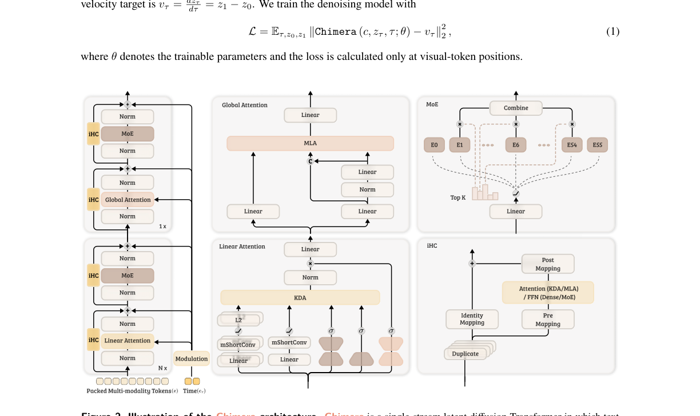
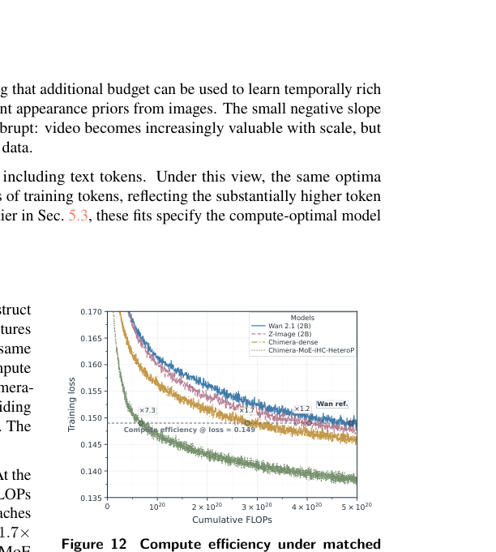
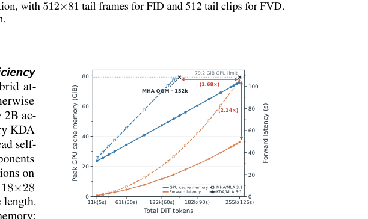
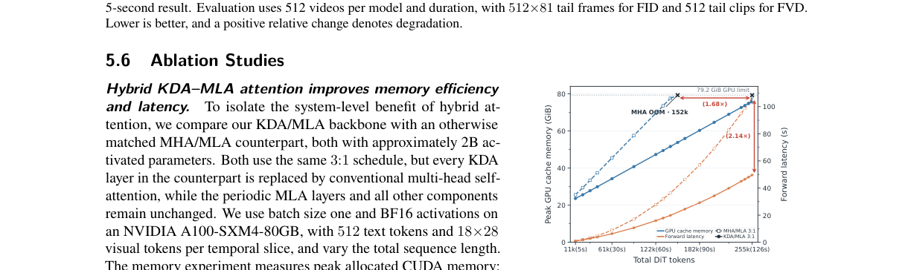

# AI Daily: Chimera - Designing and Chinchilla-Scaling Hybrid Visual Diffusion Transformers

## 基本資訊
- **論文標題**: Chimera: Designing and Chinchilla-Scaling Hybrid Visual Diffusion Transformers
- **作者**: Chongjian Ge, Hanwen Jiang, Tianyu Wang, Jiuxiang Gu, Yiran Xu, Ziwen Chen, Shaoteng Liu, Jing Shi, Yicong Hong, Zefan Cai, Hailin Jin, Hao Tan (Adobe Research)
- **發表日期**: 2026-07-30 (arXiv)
- **領域**: Computer Vision, Diffusion Models, Transformer Scaling
- **論文連結**: [arXiv:2607.28611](https://arxiv.org/abs/2607.28611)

## 核心貢獻與創新點

視覺生成正進入「Token 密集型（token-extensive）」的時代，高解析度圖像、長影片和多模態上下文使得傳統 Diffusion Transformer 中全注意力機制（full attention）的二次方計算成本變得難以承受。儘管語言模型已發展出多種解決方案，但視覺擴散模型必須保留時空局部性，並支援跨模態的雙向互動，因此無法直接套用。

Adobe Research 團隊提出了 **Chimera**，這是一個將混合視覺擴散主幹網路與系統化擴展策略（scaling recipe）共同設計的新框架。其核心貢獻包含：

1. **混合線性與全域注意力架構（Hybrid Linear and Global Attention）**：將文本、圖像和影片 token 整合為單一資料流，主要使用具有 $\mathcal{O}(N)$ 複雜度的 Kimi Delta Attention (KDA) 進行長上下文狀態追蹤，並週期性插入 Multi-head Latent Attention (MLA) 實現全域互動。
2. **無位置編碼的模態感知設計（NoPE & Modality-aware Short Convolutions）**：透過在 KDA 更新前加入模態感知的短卷積（mShortConv）來捕捉局部時空上下文，結合 KDA 的因果遞迴特性，使得模型能以單一時間優先的光柵掃描（raster-order scan）處理序列，完全捨棄了傳統的位置編碼（Positional Embeddings）。
3. **異質網路的超參數轉移（HeteroP）**：為了解決混合架構在擴展時各模組成長比例不同的問題，提出了 HeteroP，根據每個張量的功能性 fan-in 與模型深度來轉移超參數，確保從小模型到大模型（59M 至 19.3B）皆能保持最佳化穩定。
4. **視覺生成的 Chinchilla Scaling Laws**：首次為視覺擴散模型擬合了類似 Chinchilla 的計算最佳化擴展定律，探討了啟動參數大小、訓練 token 數量以及圖像/影片資料配比之間的關係。

*圖 1：Chimera 的混合主幹架構。模型將多模態 token 整合為單一序列，結合了 KDA 線性注意力、MLA 全局注意力、模態感知短卷積以及稀疏的 MoE 前饋網路。*

## 技術方法簡述

### 1. 單一資料流與混合注意力主幹
Chimera 採用 rectified-flow 框架進行 $v$-prediction 訓練，損失函數定義為：

$$
\mathcal{L}=\mathbb{E}_{\tau,z_0,z_1}\left\|\operatorname{Chimera}(c,z_\tau,\tau;\theta)-v_\tau\right\|_2^2
$$

模型將文本特徵 $c$ 與加噪的視覺特徵 $z_\tau$ 投影至共享隱藏空間並串接。為了打破全注意力機制的二次方瓶頸，Chimera 在大多數層使用 KDA，其透過細粒度的通道級狀態衰減與遞迴增量更新，實現了線性時間的長序列處理。為了彌補線性注意力在全域精確匹配上的不足，模型週期性地插入 MLA 層，透過壓縮的鍵值（KV）表示來恢復全域的 token-to-token 互動。

### 2. 模態感知短卷積與無位置編碼 (NoPE)
傳統視覺模型高度依賴位置編碼（如 RoPE 或 3D 絕對位置編碼），這限制了模型在推理時對未見過長度或解析度的外推能力。Chimera 引入了模態感知短卷積（mShortConv），在每個 KDA 狀態更新前，先沿著該模態的原生幾何軸（空間或時間）聚合局部鄰居特徵。這使得 KDA 寫入的是局部豐富的特徵而非孤立的 token。由於卷積提供了局部相對偏移的線索，加上 KDA 固有的因果遞迴順序，模型只需進行簡單的時間優先光柵掃描，即可完全免除顯式的位置編碼。

### 3. HeteroP 超參數轉移與 Scaling Laws
為確保不同規模的模型都能獲得公平且最佳的訓練設定，作者提出了 HeteroP。有別於傳統的 $\mu$P 假設所有維度以單一全域比例縮放，HeteroP 針對 KDA、MLA、MoE 等不同模組的實際計算圖，獨立計算每個參數群組的功能性 fan-in 比例，並據此調整學習率與初始化變異數。

基於這套穩定的參數化方法，作者擬合了計算最佳化（compute-optimal）的 scaling laws。研究發現：
- **圖像預訓練**：最佳的資源分配幾乎平均分配於啟動模型大小與訓練 token 數，即 $N_{\mathrm{opt}} \propto C^{0.48\text{--}0.52}$。
- **影片預訓練**：在較高計算預算下，最佳分配會適度偏向增加模型容量，即 $N_{\mathrm{opt}} \propto C^{0.53\text{--}0.56}$。

## 實驗結果和性能指標

作者基於 scaling laws 訓練了一個擁有 11B 總參數、2B 啟動參數的 Chimera 模型。

### 1. 訓練計算效率大幅提升
在相同的擴散預訓練損失（Loss = 0.149）下，Chimera 展現了驚人的計算效率。如下圖所示，相比於匹配參數量的全注意力 Wan 2.1 (2B) 基線模型，密集版（dense）的 Chimera 提升了 1.7 倍的計算效率；而結合了 MoE、iHC 與 HeteroP 的完整版 Chimera，更達到了 **7.3 倍的計算效率提升**（僅需 $6.27 \times 10^{19}$ FLOPs，而 Wan 需要 $4.29 \times 10^{20}$ FLOPs）。

*圖 2：在匹配的訓練條件下，完整版 Chimera 達到目標損失所需的 FLOPs 僅為 Wan 2.1 基線的約七分之一。*

### 2. 記憶體與延遲的長序列優勢
受惠於 KDA 的線性複雜度，在單張 80GB A100 GPU 上，Chimera 的 KDA/MLA 主幹相比於傳統 MHA/MLA 主幹，可支援 **1.68 倍更長的序列**。在處理 255K tokens 時，前向傳播延遲（forward latency）更是快了 **2.14 倍**。

*圖 3：隨著序列長度增加，Chimera (KDA/MLA) 在峰值記憶體與推理延遲上均顯著優於傳統全注意力 (MHA/MLA) 基線。*

### 3. 卓越的 Zero-Shot 長度外推能力
由於完全捨棄了位置編碼，Chimera 展現了極佳的長度外推（length extrapolation）能力。模型僅在 **5 秒**的影片片段上進行訓練，但在推理時直接生成 **30 秒**的影片，且無需任何針對長度的微調。實驗顯示，在 30 秒生成時，Chimera 的 FID 僅退化了 **6.5%**，而對照組 Wan 2.1 和 HunyuanVideo-1.5 的退化幅度分別高達 50.5% 和 53.6%。

*圖 4：Zero-shot 影片長度外推實驗。隨著生成長度從 5 秒延伸至 30 秒，Chimera (紅線) 的 FID 與 FVD 退化幅度遠低於基線模型。*

## 相關研究背景

視覺擴散模型的架構演進正經歷與大型語言模型相似的軌跡。從早期的 U-Net 轉向 Diffusion Transformers (DiT) 後，全注意力機制的二次方複雜度成為處理高解析度與長影片的瓶頸。近期的研究嘗試引入線性注意力（如 Mamba、RWKV）或稀疏注意力來解決此問題。然而，視覺數據的時空連續性使得直接套用語言模型的線性架構充滿挑戰。此外，雖然語言模型已有成熟的 Chinchilla scaling laws 指導模型擴展，但在視覺擴散領域，如何同時考量模型大小、訓練 token 數以及多模態資料（圖像與影片）的配比，仍是一個未解的難題。Chimera 正是為了填補這一架構與方法論上的雙重空白而生。

## 個人評價和意義

Chimera 是一篇極具啟發性的系統級論文。它不僅僅是提出了一個新的 backbone，更重要的是它提供了一套完整的**「架構設計 + Scaling Recipe」**。

我認為這篇論文有幾個亮點非常值得我們關注：
1. **打破位置編碼的迷思**：長期以來，視覺 Transformer 高度依賴絕對或相對位置編碼。Chimera 證明了透過「局部卷積 + 因果線性注意力」的組合，模型可以自然地學習到時空結構，並換來了驚人的 zero-shot 長影片外推能力。這對於降低長影片生成的訓練成本具有巨大潛力。
2. **為視覺擴散模型建立 Scaling Laws**：作者將圖像與影片的資料配比（image-video data ratio）納入 scaling law 的變數中，發現最佳配比是算力條件的函數（算力越高，越應增加影片比例）。這為未來多模態基礎模型的資料準備提供了量化的指導原則。
3. **實用性與工程價值**：論文中提到的 HeteroP 超參數轉移方法，解決了混合架構（包含 Dense、MoE、Linear、Global Attention）在放大時難以調參的痛點，這對於實際工程落地非常有價值。

總結來說，Chimera 展示了在算力受限的情況下（僅使用約 600 H100 Days，遠少於同級別模型的 12.4K Days），透過優秀的架構與嚴謹的 scaling 策略，依然能訓練出具有高度競爭力且在長序列推理上具備壓倒性優勢的基礎模型。這對於資源有限但追求高效生成的團隊來說，是一條非常值得借鑒的道路。
