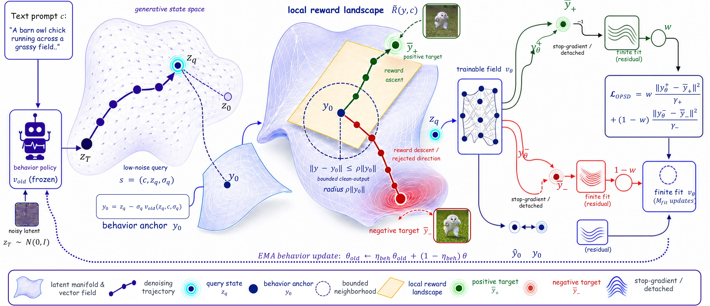
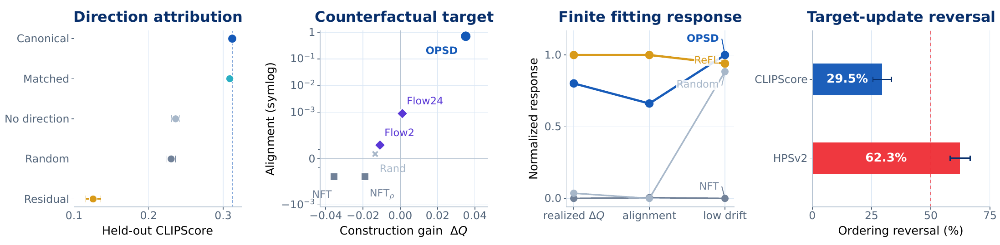

# AI Daily

**日期：2026-08-30**  
**今日主題：Diffusion Post-training、On-policy Self-distillation 與 Reward-to-target Interface**  
**作者：Manus AI**

## On-Policy Self-Distillation in Diffusion Models

今日精選 **On-Policy Self-Distillation in Diffusion Models**。論文由 ByteDance Seed、National University of Singapore、UC San Diego、University of Maryland、HKUST Guangzhou、Duke、UC Berkeley、Oxford 與 HKUST 等機構的研究者共同完成，於 **2026-08-25** 提交至 arXiv；目前 arXiv 頁面將其標示為 **Technical Report**，尚未列出 ICCV、CVPR、ICML、NeurIPS 或其他正式會議接收資訊。[1] [3]

> **一句話摘要：** DiffusionOPSD 不再讓 endpoint reward 只透過模糊的 policy gradient 或 endpoint reweighting 間接影響模型，而是在當前 behavior policy 真正走過的低噪聲 query 上，把 reward gradient 轉成有信任域限制的正／負 clean-output targets，再以 stop-gradient 的 finite fitting 反覆蒸餾回模型。

這篇工作的價值不只在於報告了 19/20 個 reward-matched 設定的最佳 held-out score，而在於它把 diffusion reward optimization 拆成兩個以往容易混在一起的問題：**target construction 是否真的產生了較好的局部目標**，以及**一次有限的參數更新是否真的把該目標實現出來**。[1] 這個拆分與目前 repository 已有的 Energy-Based、JEPA、VAR、training-free 與 attention modulation 文章並不重複；它提供的是一個可把「能量／偏好訊號」翻譯成中間生成狀態 supervision 的研究接口。

## 為什麼從候選中選它

本次先以 arXiv、Hugging Face Trending Papers 與論文官方 project page 找尋 2026 年 8 月底的候選，再檢查 `KaiCobra/AI_Daily` 的 README 與 `.existing_reports_inventory.txt`。repository 在 2026-08-29 的 README 曾標示 148 篇；本次以既有索引工具重建後，`INDEX.md` 的實際解析數為 147 篇，並已將本篇納入其中。最近幾天的內容已涵蓋 LeVJEPA、TetherMem、SynVAR、Orthogonal JEPA、Scalable Energy-Based Models、Semantic Steering、HRDiT 與其他相鄰方向。[4] [5] 因此本日不再選擇一篇僅以「另一個 training-free attention trick」重述既有內容的論文，而選擇未出現在 inventory、且直接處理 reward-to-target translation 的 DiffusionOPSD。

| 候選 | 本次判斷 | 與本 repository 的重複風險 |
|---|---|---|
| **DiffusionOPSD，arXiv:2608.24646** | **入選。** 以 on-policy query、bounded positive／negative targets、detached finite fitting 與 behavior-policy EMA 解決 diffusion post-training 的 supervision gap。[1] [2] | **低。** inventory 未發現相同標題、arXiv ID 或相同方法主軸。[4] |
| Mode Seeking meets Mean Seeking，arXiv:2602.24289 | 高新穎性的長影片生成候選；以 global flow matching 與 local distribution matching 解耦長程一致性和局部細節，但與 repository 既有影片生成／DDT 主題有部分鄰近。 | 低至中；適合後續追蹤，但不是本日最能連接使用者所關注的 reward、energy 與 zero-shot interface 的一篇。 |
| Zero-WAM，arXiv:2608.26103 | 以人類影片作為 in-context task specification，將零樣本泛化帶到 video-action robotics，HumanGen 包含 74.2K human-robot ICL pairs，RoboTwin 2.0 七個 unseen tasks 的平均成功率為 47.0%。[6] | 低，但偏向具身智能與 video-action modeling，對本日的 image generation 主線較間接。 |
| On-Policy Self-Distillation without Any Supervision，arXiv:2608.06296 | 以內部多路採樣與一致性蒸餾處理 LLM 自我改進，概念上很有啟發性，但不是影像／擴散生成主題。 | 低；保留作為後續 LLM self-improvement 閱讀。 |

## 論文基本資訊

| 欄位 | 內容 |
|---|---|
| 論文標題 | **On-Policy Self-Distillation in Diffusion Models** |
| 方法名稱 | **DiffusionOPSD** |
| 作者 | Wei Zhou、Xiongwei Zhu、Lingdong Kong、Bo Chen、Lei Zhang、Yongyuan Liang、Xiaoxia Hou、Ye Tian、Xian Sun、Yingshuo Wang、Linfeng Li、Shengqiong Wu、Leigang Qu、Feng Li、Wei Liu、Julian McAuley、Tat-Seng Chua [1] |
| 研究單位 | ByteDance Seed、NUS、UC San Diego、UMD、HKUST Guangzhou、Duke、UC Berkeley、Oxford、HKUST [3] |
| 發表狀態 | arXiv preprint；2026-08-25 submitted；Technical Report，未列正式會議接收 [1] |
| 模型／生成框架 | SD3.5-M 與 step-distilled Z-Image-Turbo；方法以 rectified-flow／flow-matching 速度場表示生成策略 [1] [3] |
| 訓練資料與評估 | Pick-a-Pic prompts 訓練；DrawBench held-out prompts 評估；七個公開 evaluator 加三個內部 preference models [1] |
| 程式碼 | [worldbench/DiffusionOPSD](https://github.com/worldbench/DiffusionOPSD) [3] |
| 論文與專案頁 | [arXiv:2608.24646](https://arxiv.org/abs/2608.24646) [1]、[DiffusionOPSD project page](https://diffusionopsd.github.io/) [2] |

## 研究背景：Diffusion RL 的 supervision gap

Diffusion 或 flow model 的一張圖像不是一次前向傳遞得到，而是由多個相互依賴的 denoising／transport predictions 組成。可是 preference、aesthetic、prompt alignment 或 task-specific reward 往往只在最後把 latent decode 成影像之後才被計算。於是模型知道「這張結果分數較高」，卻不一定知道「在中途的哪一個 query，clean-output prediction 應朝什麼方向移動」。DiffusionOPSD 把這個不對齊稱為 endpoint supervision 與 intermediate policy action 之間的結構性落差。[1]

既有方法的 reward-to-policy interface 各不相同。**ReFL／DRaFT** 直接對 sampled late-state 的 clean-output prediction 反向傳播 differentiable reward；它局部而直接，但 reward、decoder 與模型更新仍共用同一條 computation graph。[7] **Flow-GRPO** 把 deterministic ODE 轉成邊際分佈等價的 SDE，以便建立 policy-gradient 所需的隨機探索與 transition likelihood；這解決了 flow model 沒有天然 transition density 的問題，但依賴 rollout、likelihood ratio、discretization 與 group advantage。[8] **DiffusionNFT** 則在 forward process 上做 online reinforcement，避免完整 trajectory backpropagation，然而其 reward-selected endpoint 仍沒有顯式描述「目前 query 應如何改善」。[9]

DiffusionOPSD 的重點不是再增加一個 reward，而是改變 reward 的**中間表示**：先由當前 behavior policy 產生一個 anchor，再在 anchor 附近以 reward gradient 建立 explicit targets，最後丟棄 reward graph，以一般的 supervised fitting 去實現這些 targets。這使它既保留 on-policy data 的分佈一致性，也讓 target construction 與 finite realization 可以被分開量測。[1] [2]

## 核心貢獻

### 1. 將 image-level reward 轉成 query-level clean-output targets

論文在 behavior policy 自己走過的低噪聲 query 上，利用 reward 的局部梯度建立正向與負向目標。正向 target 表示「這個 clean prediction 若朝這裡移動，局部 reward 會上升」；負向 target 則在另一個 branch 中形成 repulsive reference。這比只對 endpoint 做 scalar weighting 更接近模型實際要改變的中間 action。[1]

### 2. 以 stop-gradient 分離 target construction 與 finite fitting

DiffusionOPSD 先計算 reward gradient，完成 targets 後便將 query、anchor、weights 與 targets 全部 detach。模型更新階段不保留 decoder、reward 或 rollout 的 autograd graph，而是只做 finite number of optimizer updates。這使研究者可以問兩個不同問題：target 本身是否更好，以及一次或少數幾次更新能否把它實現。[1] [3]

### 3. 以 behavior-policy EMA 反覆重建 on-policy supervision

如果 targets 永遠從同一個舊模型建立，蒸餾資料很快會變成 stale offline data。DiffusionOPSD 在每一輪完成 finite fitting 後，以 exponential moving average 更新 behavior policy；下一輪由新的 behavior policy 重新 rollout、選 query、計算 anchor、建立 targets。這是一種「模型自己產生狀態、reward 指出局部改善、模型再吸收改善」的 online self-distillation loop。[1]

## 技術方法詳解

### 1. Rectified-flow 的 clean-output coordinate

令 $v_\theta$ 為可訓練的 rectified-flow velocity field。對 prompt $\mathbf c$、噪聲 latent $z_\sigma$ 與 noise level $\sigma$，query 定義為 $s=(\mathbf c,z_\sigma,\sigma)$。在 rectified-flow path

\[
z_\sigma=(1-\sigma)y+\sigma\epsilon,
\]

其中 $y$ 是 clean latent、$\epsilon$ 是 noise，而 velocity target 為 $v=\epsilon-y$。固定 query 下，速度預測可以轉換成 clean-output prediction：

\[
\boxed{y_\theta(s)=z_\sigma-\sigma v_\theta(s)},
\qquad
v_\theta(s)=\frac{z_\sigma-y_\theta(s)}{\sigma}.
\]

因此論文不必直接在速度空間定義 reward；它可以把 $y_\theta$ decode 成影像，再計算 local reward

\[
\widetilde R(y,\mathbf c)=R(D(y),\mathbf c),
\]

其中 $D$ 是 latent decoder。需要注意這是**代數等價，不是等距幾何**：

\[
\delta y=-\sigma\delta v,
\qquad
\|\delta v\|_2=\frac{\|\delta y\|_2}{\sigma}.
\]

當 $\sigma$ 很小時，同一個 clean-output radius 對應較大的 velocity displacement。這也是為什麼本文固定在低噪聲 query 做 local target construction，而不能把 clean latent 的半徑直接理解成所有 timestep 都相同的 policy step。[1]

### 2. On-policy query 與 behavior anchor

在第 $i$ 個 outer iteration，凍結 behavior policy $v_{\theta_{\mathrm{old}}}$，對每個 prompt rollout $K$ 條 trajectory。每條 trajectory 提供 endpoint $x_0^k$、endpoint reward $r^k$，以及最接近指定 $\sigma^\star$ 的低噪聲 query：

\[
q=\arg\min_j|\sigma_j-\sigma^\star|,
\qquad
s=(\mathbf c,z_q,\sigma_q).
\]

behavior anchor 是同一 query 下舊策略的 clean prediction：

\[
y_0=z_q-\sigma_qv_{\mathrm{old}}(z_q,\mathbf c,\sigma_q).
\]

這個 anchor 有兩個作用。第一，它是 reward landscape 中的局部展開中心；第二，它讓 target 的大小可以相對於當前模型輸出的 latent norm 定義，而不是用固定絕對尺度。endpoint rewards 先在每個 prompt group 內中心化，再以整個 rollout batch 的 standard deviation 做 normalization，形成 $\omega_{\mathbf c}^k\in[0,1]$，控制正／負 branch 的相對 fitting strength：

\[
\bar r_{\mathbf c}=\frac1K\sum_{j=1}^Kr_{\mathbf c}^j,
\]

\[
\omega_{\mathbf c}^k
=\frac12+\frac12\operatorname{clip}
\left(
\frac{r_{\mathbf c}^k-\bar r_{\mathbf c}}
{c_{\mathrm{adv}}(\widehat\sigma_{\mathcal B_i}+\epsilon_Z)},-1,1
\right).
\]

此處有一個值得注意的設計：weight $\omega$ 不是 target 方向本身，而是用來決定 positive／negative fitting branch 的比例。這讓「哪裡是好方向」與「這條 sample 應多強地學習」分成兩個可分析的介面。[1] [3]

### 3. Reward gradient 建立 bounded positive／negative targets

令 $y_+^{(0)}=y_-^{(0)}=y_0$。論文以 decode 後的 local reward gradient 做 normalized ascent 與 descent：

\[
\begin{aligned}
y_+^{(m+1)}
&=y_+^{(m)}+h_{\mathrm{step}}
\frac{\nabla_y\widetilde R(y_+^{(m)},\mathbf c)}
{\|\nabla_y\widetilde R(y_+^{(m)},\mathbf c)\|_2+\epsilon_g},\\
y_-^{(m+1)}
&=y_-^{(m)}-h_{\mathrm{step}}
\frac{\nabla_y\widetilde R(y_-^{(m)},\mathbf c)}
{\|\nabla_y\widetilde R(y_-^{(m)},\mathbf c)\|_2+\epsilon_g}.
\end{aligned}
\]

其中

\[
h_{\mathrm{step}}=\frac{\eta_{\mathrm{tgt}}\rho\|y_0\|_2}{M_{\mathrm{tgt}}}.
\]

為避免 reward gradient 把 target 推到不可信的遠區域，每一步後都投影回 anchor 周圍的 trust-region ball：

\[
y_\pm^{(m+1)}\leftarrow y_0+
\Pi_{\rho\|y_0\|_2}(y_\pm^{(m+1)}-y_0),
\]

\[
\Pi_r(d)=
\begin{cases}
d,&\|d\|_2\le r,\\
r\,d/\|d\|_2,&\|d\|_2>r.
\end{cases}
\]

最後得到 detached targets

\[
\bar y_+=\operatorname{sg}(y_+^{(M_{\mathrm{tgt}})}),
\qquad
\bar y_-=\operatorname{sg}(y_-^{(M_{\mathrm{tgt}})}).
\]

對單一步驟而言，若 $g_0=\nabla_y\widetilde R(y_0,\mathbf c)$，則

\[
\widetilde R(y_\pm^{(1)},\mathbf c)-\widetilde R(y_0,\mathbf c)
=\pm h_{\mathrm{step}}
\frac{\|g_0\|_2^2}{\|g_0\|_2+\epsilon_g}
+O(h_{\mathrm{step}}^2).
\]

換句話說，正向 target 在一階近似下是 reward-improving，負向 target 是 reward-rejecting；但這只保證**target construction 的局部性質**，不保證之後有限次 model update 一定會完整實現它。[1]

### 4. Positive／negative fitting branches

可訓練策略在同一 query 得到

\[
y_\theta=z_q-\sigma_qv_\theta(s).
\]

然後建立兩個對同一輸出的 branch：

\[
y_\theta^+=\beta y_\theta+(1-\beta)y_0,
\qquad
 y_\theta^-=(1+\beta)y_0-\beta y_\theta.
\]

positive branch 把模型輸出拉向 $\bar y_+$；negative branch 透過反向的 branch geometry，使模型遠離 $\bar y_-$。為了讓不同 latent dimension 與 target distance 的 loss scale 不致失衡，論文使用 detached adaptive normalizers：

\[
\gamma_+=\max\left\{
\operatorname{sg}\big(\operatorname{mean}|y_\theta^+-\bar y_+|\big),
\epsilon_\gamma\right\},
\]

\[
\gamma_-=\max\left\{
\operatorname{sg}\big(\operatorname{mean}|y_\theta^- -\bar y_-|\big),
\epsilon_\gamma\right\}.
\]

完整 loss 為

\[
\boxed{
\mathcal L_{\mathrm{OPSD}}
=\omega\frac{\operatorname{mean}[(y_\theta^+-\bar y_+)^2]}{\gamma_+}
+(1-\omega)\frac{\operatorname{mean}[(y_\theta^- -\bar y_-)^2]}{\gamma_-}
}.
\]

實作時另外乘上 $c_{\mathrm{adv}}$。這裡的 $c_{\mathrm{adv}}$ 同時影響 reward normalization 的 clipping range 與 policy loss scale，因此不能把它單純視為 learning-rate multiplier。[1] [3]

在固定 normalizers 下，令 $\delta_\theta=y_\theta-y_0$、$d_+=\bar y_+-y_0$、$d_-=\bar y_--y_0$、$a_+=\omega/\gamma_+$、$a_-=(1-\omega)/\gamma_-$，則 branch loss 的理想 output-space minimizer 為

\[
\delta_\theta^\star
=\frac{a_+d_+-a_-d_-}{\beta(a_++a_-)}.
\]

如果 positive／negative targets 對 anchor 近似對稱，即 $d_+=\bar h u_{\mathrm{grad}}$、$d_-=-\bar h u_{\mathrm{grad}}$，則

\[
\delta_\theta^\star=\frac{\bar h}{\beta}u_{\mathrm{grad}}.
\]

這個結果很有啟發性：理想化情況下，兩個 branch 都同意沿 reward-improving direction 移動；$\omega$ 主要在 target path 或 normalizer 不對稱時改變偏好，而不是直接決定 gradient 的方向。[1]

### 5. Online self-distillation loop

| 階段 | 操作 | 是否保留 gradient graph |
|---|---|---|
| Rollout | frozen behavior policy 產生 endpoint reward 與低噪聲 query | 不保留 |
| Anchor | 在 query 以 $v_{\mathrm{old}}$ 計算 $y_0$ | detach |
| Target construction | 對 $\widetilde R(y,\mathbf c)$ 做正／負 reward-gradient steps，並套用 trust-region projection | 只在暫時的 target construction graph 中保留 |
| Dataset assembly | 儲存 $(\mathbf c,z_q,\sigma_q,\omega,\bar y_+,\bar y_-)$ | 全部 detach |
| Finite fitting | 以 $\mathcal L_{\mathrm{OPSD}}$ 更新 trainable policy $M_{\mathrm{fit}}$ 次 | 只保留 policy fitting graph |
| Behavior refresh | 以 EMA 更新 $\theta_{\mathrm{old}}$，下一輪重新 rollout | 不回傳到上一輪 |

整個 loop 可以抽象成

\[
\mathcal D_i=\{(\mathbf c,z_q,\sigma_q,\omega,\bar y_+,\bar y_-)\},
\]

\[
\theta_{i+1/2}=\operatorname{Fit}_{M_{\mathrm{fit}}}
(\theta_i;\operatorname{sg}(\mathcal D_i)),
\]

\[
\theta_{\mathrm{old}}^{i+1}
=\eta_{\mathrm{beh}}^{(u)}\theta_{\mathrm{old}}^i
+(1-\eta_{\mathrm{beh}}^{(u)})\theta_{i+1/2}.
\]

這不是「一次訓練得到固定 pseudo-label」的 offline distillation，而是 behavior distribution、anchor 與 reward-defined targets 都會隨 policy 改變的 dataset aggregation。它與 on-policy imitation learning 的關係，正是把 learner-induced states 上的 supervision 重新定義為 reward-improving local targets。[1]

*圖 1：由論文 Figure 4 的方法總覽圖轉換而成。圖中可見 positive／negative target 先在 local reward landscape 建立，之後才進入 stop-gradient fitting；這不是瀏覽器整頁截圖，而是論文 figure PDF 的局部方法圖。[1]*

## 實驗設計

| 面向 | SD3.5-M | Z-Image-Turbo |
|---|---|---|
| Backbone | Stable Diffusion 3.5 Medium | Native step-distilled Z-Image-Turbo |
| 解析度 | $512\times512$ | $1024\times1024$ |
| 訓練 rollout | CFG-free deterministic 10-step DPM-Solver++ 2M；以 guidance scale 1.0 表示 conditional prediction | Native deterministic 9-step FlowMatchEuler；guidance scale 0.0 |
| 訓練 prompts | Pick-a-Pic | Pick-a-Pic |
| Held-out evaluation | DrawBench，deterministic 40-step flow sampling | Native 9-step FlowMatchEuler |
| 可訓練參數 | LoRA rank 32、alpha 64 | LoRA adapter；同一方法流程 |
| Reward-specific updates | 100 optimizer updates | 100 optimizer updates |
| Joint reward updates | 300 updates，$\mathrm{PickScore}/26+\mathrm{CLIPScore}+\mathrm{HPSv2.1}$ | 主要表格以 reward-specific 為主 |
| Evaluators | PickScore、CLIPScore、HPSv2.1、Aesthetic、ImageReward、HPSv3、DeQA，加 AltCLIP、VLM-Pointwise、VLM-Pairwise | 同左 |

這個 protocol 的一個優點是同時測試標準的 SD3.5-M 與原生 few-step 的 Z-Image-Turbo，而不是只在單一 long-step diffusion pipeline 上顯示效果。[1] 另一方面，主表的 reward-specific row 是「每個 evaluator 各自訓練一個 checkpoint，再以 held-out score 評估」，不能把 19/20 解讀成一個單一 checkpoint 在 20 個 reward 上全部勝出。論文另以 300-update joint reward run 進行多目標 compatibility check。[1]

## 實驗結果與性能指標

### Reward-specific held-out scores

| Evaluator（越高越好） | DiffusionOPSD：SD3.5-M | DiffusionOPSD：Z-Image-Turbo |
|---|---:|---:|
| PickScore | 24.94 | 25.15 |
| CLIPScore | 0.340 | 0.320 |
| HPSv2.1 | 0.390 | 0.390 |
| Aesthetic | 12.08 | 10.74 |
| ImageReward | 1.76 | 1.79 |
| HPSv3 | 13.34 | 14.44 |
| DeQA | 4.94 | 4.78 |
| Internal AltCLIP | 0.450 | 0.451 |
| Internal VLM-Pointwise | 0.214 | 0.243 |
| Internal VLM-Pairwise | 0.465 | 0.551 |

在作者的 fully matched reward-specific protocol 中，DiffusionOPSD 在兩個 backbone、十個 evaluator 的 20 個設定中取得 19 個最佳 final held-out scores；唯一例外是 SD3.5-M 的 Aesthetic，ReFL 為 12.09，DiffusionOPSD 為 12.08。[1] 在 Z-Image-Turbo 上，DiffusionOPSD 對 Aesthetic、ImageReward、HPSv3、DeQA 與 VLM-Pairwise 相對最強 baseline 的提升分別為 9.7%、30.7%、4.9%、3.9% 與 14.6%。這些數字是 reward-specific checkpoint 的相對比較，應與其 prompt split、sampling protocol 和 evaluator scale 一起閱讀，而不宜簡化成「所有 diffusion model 都被擊敗」。

### Joint multi-reward training

在 SD3.5-M 的 300-update joint training 中，單一 DiffusionOPSD policy 同時優化 $\mathrm{PickScore}/26$、CLIPScore 與 HPSv2.1，得到 PickScore **25.51**、CLIPScore **0.333**、HPSv2.1 **0.389**；對應 DiffusionNFT 為 **23.62**、**0.294**、**0.340**。[1] 相對於 DiffusionNFT，三個分數的相對提升約為 8.0%、13.3% 與 14.4%。這一結果支持「explicit target interface 可以承載多 reward」的主張，但 300 updates 與三個 reward 權重是特定實驗設定，尚不能等同於任意多目標 preference alignment 都不會出現 trade-off。

### Training efficiency

| Backbone／方法 | 秒／optimizer update | Peak VRAM | Images／s | GPU-hours／100 updates |
|---|---:|---:|---:|---:|
| SD3.5-M DiffusionNFT | 212.4 | 47.8 GB | 5.42 | 47.2 |
| SD3.5-M ReFL | 214.8 | 未記錄 | 5.36 | 47.7 |
| SD3.5-M DiffusionOPSD | **126.9** | 50.0 GB | **9.08** | **28.2** |
| Z-Image-Turbo DiffusionNFT | 1826.2 | 49.9 GB | 0.32 | 405.8 |
| Z-Image-Turbo ReFL | 459.5 | 未記錄 | 1.25 | 102.1 |
| Z-Image-Turbo DiffusionOPSD | **674.0** | **61.5 GB** | **0.85** | **149.8** |

在作者的八 GPU profiling 中，DiffusionOPSD 相對 DiffusionNFT 的 GPU-hours 在 SD3.5-M 減少 40%，在 Z-Image-Turbo 減少 63%。原因不是完全免除 reward computation，而是 rollout 保持 detached、每個 query 只做少量 target-gradient calls，policy fitting 不需把整條 diffusion trajectory 留在 autograd graph。[1] [3]

但是效率比較有三個必須保留的限制。第一，Z-Image-Turbo 的 DiffusionOPSD peak VRAM 為 61.5 GB，高於 DiffusionNFT 的 49.9 GB。第二，ReFL 在 Z-Image-Turbo 只有 102.1 GPU-hours／100 updates，低於 DiffusionOPSD 的 149.8；DiffusionOPSD 的優勢在該 backbone 主要體現在 final held-out quality，而不是所有成本指標都最低。第三，FlowGRPO 使用 stochastic SDE-flow transition 和 log-probability，不能與 deterministic rollout 完全視為同一種 profiling 條件。[1]

### Target construction 與 finite realization 的分離

論文最值得學習的實驗不是單一 leaderboard，而是固定 query、固定 suffix 後把 target creation 和 model update 拆開。對 512 個 distinct held-out prompts，positive reward-gradient target 的 fixed-suffix reward gain 為 **+0.03511**，local reward-gradient alignment 為 **0.7094**；DiffusionNFT rollout endpoint 的 reward change 為 **−0.03551**，alignment 僅 **−0.000203**。即使把 DiffusionNFT endpoint 的 radius 調到和 DiffusionOPSD target 相同，reward change 仍為 **−0.01887**。[1]

但「target 在 construction 階段較好」不保證「一次 finite fitting 之後也較好」。在 HPSv2.1 的 same-query probe 中，reward-gradient target 的 construction gain 為 **+0.00245**，matched-radius random target 為 **−0.03251**；然而一次 fresh AdamW update 後，兩者 realized gains 分別為 **−0.000740** 與 **−0.000021**。也就是較差的 random target 反而在這個單次 update protocol 下實現了較高 reward，ordering reversal 發生於 **62.3%** 的 512 個 prompts，prompt-bootstrap 95% CI 為 58.2%–66.6%。CLIPScore 的 reversal rate 則為 **29.5%**，95% CI 為 25.6%–33.4%。[1]

*圖 2：由論文 Figure 10 的四個局部 panel 轉換而成。它直接支撐本文的核心判斷：target construction gain、finite fitting gap 與 end-to-end quality 是三個不同量，不能互相替代。[1]*

固定 query $q$、positive target $\bar y_+$ 與 finite fitting 後輸出 $\hat y_{M_{\mathrm{fit}}}$，若 $F_q$ 是同一 suffix 下的 reward，則作者用下式做 accounting：

\[
\underbrace{F_q(\hat y_{M_{\mathrm{fit}}})-F_q(y_0)}_{G_{\mathrm{realized}}}
=
\underbrace{F_q(\bar y_+)-F_q(y_0)}_{G_{\mathrm{construct}}}
-
\underbrace{[F_q(\bar y_+)-F_q(\hat y_{M_{\mathrm{fit}}})]}_{G_{\mathrm{fit}}}.
\]

$G_{\mathrm{fit}}$ 可能包含 under-realization、direction rotation 或 overshoot。這條 identity 的研究意義在於：如果新方法沒有提升最終 reward，研究者可以追問是 local target 不好，還是 target 好但模型更新沒有將它實現，而不是將所有問題都歸因於 reward model 或 policy gradient instability。[1]

### Ablation 與 human preference

| 變體／設定 | 指標 | 結果 |
|---|---|---:|
| Canonical DiffusionOPSD | SD3.5-M CLIPScore，50 updates | 0.3117 |
| No-op target | 同上 | 0.2363 |
| Random-direction target | 同上 | 0.2303 |
| Rollout-residual target | 同上 | 0.1256 |
| Forward-noised query control | 同上 | 0.3089 |
| High query noise $\sigma_q=0.90$ | 同上 | 0.2884 |
| Very small target radius $\rho=0.02$ | 同上 | 0.2959 |
| Large branch coefficient $\beta=10$ | 同上 | 0.2961 |

50-update 的 CLIPScore screening 顯示 reward-gradient direction 是最大因素；把 rollout query 換成 forward-noised control 只由 0.3117 變成 0.3089，差距遠小於 random、no-op 與 residual target。[1] 在 moderate target radius $0.08$–$0.40$ 間結果相對穩定，但高 query noise、極小 target radius 與過大的 branch coefficient 會明顯退化。這說明 trust region 不是裝飾性元件，而是 reward gradient 從 local signal 變成可蒸餾 supervision 時的穩定化邊界。

在 100 個 held-out prompts 的 blinded human preference 比較中，DiffusionOPSD 相對 base model、FlowGRPO、DiffusionNFT 與 ReFL 的偏好率分別為 **64%**、**71%**、**90%** 與 **61%**；VLM-Pointwise score 則為 0.243，高於 base 0.213、FlowGRPO 0.217、DiffusionNFT 0.166 與 ReFL 0.227。[1] 這能補充自動 reward 的結果，但樣本數為 100 prompts，且使用 frozen Z-Image-Turbo qualitative archive；它應被理解為支持性 evidence，而不是完整的人類偏好研究。

## 與相關研究的比較

| 研究 | Reward／teacher 如何進入模型 | supervision 位置 | DiffusionOPSD 的差異 |
|---|---|---|---|
| **DRaFT／ReFL** [7] | differentiable reward 直接反向傳播至模型 | sampled late-state clean-output prediction | DiffusionOPSD 也使用 clean-output coordinate，但先把 reward gradient 變成 detached targets，更新時不保留 reward graph。 |
| **Flow-GRPO** [8] | ODE-to-SDE 後使用 trajectory-level policy gradient、likelihood ratio 與 group advantage | 多步 stochastic flow trajectory | DiffusionOPSD 不依賴 per-transition likelihood ratio，而是在 on-policy low-noise query 建立 bounded local targets。 |
| **DiffusionNFT** [9] | 以 online forward-process regression 與 reward-selected samples 更新 | forward-process／endpoint-conditioned supervision | DiffusionOPSD 額外指定 reward-improving local direction，而不是只重加權 endpoint。 |
| **DanceOPD** [10] | 以外部 capability fields／teacher fields 做 on-policy generative field distillation | 一個低噪聲 student-induced state，velocity MSE | DiffusionOPSD 不要求外部更好的 teacher；teacher-like signal 由 anchor 加 reward ascent／descent 自己構造。 |
| **Flow-OPD** [11] | 先訓練多個 reward-specialist teachers，再做 two-stage task routing 與 dense trajectory supervision | 多 teacher trajectory／student distillation | DiffusionOPSD 直接做 single-stage reward-to-target loop，避免先建立完整 specialist teacher ensemble，但也更依賴 reward gradient 品質。 |
| **DiffusionOPD** [12] | 以 on-policy teacher transition mean 做 distillation | 多步 teacher transition means | DiffusionOPSD 將 target 定義為 reward-guided positive／negative clean-output targets，而非外部 teacher transition matching。 |

DiffusionOPSD 的位置因此很清楚：它不是單純的 RL、單純的 reward backpropagation，也不是傳統 teacher-student distillation。它是在三者之間增加一層 **target interface**，把 endpoint outcome、local gradient、on-policy state 與 finite supervised update 放到同一個可檢查的實驗框架中。[1] [7] [8] [9] [10] [11] [12]

## 我的評價與研究意義

我認為這篇工作真正值得追蹤的地方，是它把「alignment training 是否有效」從一個終點 leaderboard 問題，改寫成一個**局部目標如何被建立、再如何被模型吸收**的問題。這個視角與 Energy-Based Model 很接近：reward gradient 可以被視為在 latent space 中指向較低 cost／較高 preference 的局部向量場；trust-region target 則像是把這個向量場限制在模型目前可靠的 neighbourhood 內。不同之處是 DiffusionOPSD 沒有直接學一個全域 normalized energy，而是把每個 prompt、每個 query 的 local reward landscape 轉成一次可蒸餾的 supervision。

它的第二個強點是對 few-step model 的處理。Z-Image-Turbo 的 native 9-step schedule 不必然與原始 teacher 的每個 denoising transition 一一對應；DiffusionOPSD 直接從 native behavior policy 取 query，這讓 target 與實際部署時會走的 state distribution 對齊。[1] 相較於把 long-step teacher 的 trajectory 強行搬到 few-step student，這是一個更合理的 on-policy assumption。

但我不會把它稱作已經解決 diffusion alignment。第一，論文目前是 arXiv Technical Report，主要數字仍是作者自己定義的 reward suite 與 protocol；第二，target construction 需要對 decoder 與 reward 做 differentiable backward，heavy evaluator 例如 HPSv3、DeQA 會增加記憶和工程複雜度；第三，Z-Image-Turbo 的 peak VRAM 高於 baseline；第四，19/20 的主張依賴 reward-specific checkpoints，不等於一個模型對所有 preference objective 都同時 Pareto-optimal；第五，62.3% target-update reversal 說明 finite fitting 仍是一個沒有被 target quality 完全解釋的 dynamics problem。[1]

## 對使用者關注方向的延伸構想

### 1. Energy-Based Transformer：從 reward target 到 learnable energy field

可以令 Transformer 對影像或 latent token $H_\theta(x)\in\mathbb R^{N\times d}$ 產生條件 energy：

\[
E_\theta(x,\mathbf c)=-w_{\mathbf c}^{\top}g(H_\theta(x))-b_{\mathbf c}.
\]

DiffusionOPSD 的 target construction 可以改寫成

\[
y_+=y_0-\eta_+\nabla_yE_\theta(y_0,\mathbf c),
\qquad
 y_-=y_0+\eta_-\nabla_yE_\theta(y_0,\mathbf c),
\]

再以 detached finite fitting 把 energy gradient distill 回 velocity field。與其只比較 FID，不如同時量測 energy gradient norm、局部 Hessian proxy、target-update reversal rate、reward calibration 與 robustness。這會回答一個更具體的問題：**Energy-Based Transformer 的 energy landscape 是否比一般 reward model 更適合提供穩定的 intermediate target？**

### 2. JEPA：以 predictive latent 取代每次 decode 的 reward gradient

若有一個 JEPA-style encoder／predictor，令當前 observation latent 為 $z_t$，預測 latent 為 $\hat z_{t+1}$，則可定義 predictive energy：

\[
E_{\mathrm{pred}}(z_t,\hat z_{t+1},a_t)
=\lambda_{\mathrm{pred}}\|\hat z_{t+1}-z_{t+1}\|_2^2
+E_{\mathrm{task}}(z_t,a_t).
\]

對影片生成而言，positive target 不一定要先 decode 成每一張 pixel image 再求 reward gradient，而可以在 JEPA latent space 中沿著降低 predictive energy 的方向建立 $\bar z_+$。這可能降低 decoder／reward memory，也讓 reward 更關注 temporal consistency、object persistence 和 physical plausibility。研究上可比較 pixel-level reward target、V-JEPA latent target 與 hybrid target 在 long-horizon rollout、tFVD、object identity 和 human preference 上的 finite realization gap。

### 3. VAR：做 scale-wise positive／negative target construction

VAR 的生成過程不是沿連續時間 denoising，而是依序生成不同 resolution／scale 的 visual tokens。可以對第 $k$ 個 scale 的 prefix 定義 energy 或 preference score $E_k(r_{\le k},\mathbf c)$，再在 hidden state 或 logit space 建立

\[
r_k^+=r_k-\eta_k\nabla_{r_k}E_k,
\qquad
r_k^-=r_k+\eta_k\nabla_{r_k}E_k.
\]

接著把兩者轉成 detached scale-wise targets，讓 coarse scale 優先學 global composition，fine scale 再學 texture／text fidelity。這比固定只在早期或晚期插入 attention modulation 更可分析，因為每個 scale 都可以量測 construction gain、finite realization 與跨 scale interference。使用者已經在 repository 中追蹤 VPG、SynVAR、EditMod、SparsePR 等 VAR／training-free 工作；DiffusionOPSD 提供的新增問題是：**VAR 的 prefix correction 能否像 reward-guided target 一樣區分「目標方向」與「有限更新是否實現」？**

### 4. Training-free attention modulation：蒸餾 reward target，而不是反覆 backprop

DiffusionOPSD 的 target construction 本身仍需 differentiable reward，但完成 target 後不再需要 reward graph。這提示一條兩階段路線：離線先以 reward model 建立 query-level target bank，然後把 target displacement

\[
\Delta y^*=\bar y_+-y_0
\]

蒸餾成 attention modulation controller

\[
\Delta h_l=A_l(q,k,v;\mathbf c,\Delta y^*)
\]

或一個低秩 adapter。部署時 controller 只需讀取 prompt、current query 與中間 attention statistics，便能做一次 training-free／gradient-free intervention。要誠實區分兩件事：**推理時不更新參數**不等於整個 controller 無需訓練；但這種 route 可以把 heavy reward backward 成本搬到 offline stage，再以很低的 deployment cost 享受 local target 的方向訊號。

### 5. Zero-shot 與 multi-reward：從固定 trust region 走向不確定性自適應

目前 target radius 是 $\rho\|y_0\|_2$，而 ablation 顯示 $\rho$ 在 moderate range 內相對穩定、太小會 under-correct、branch coefficient 太大會 overshoot。[1] 可以進一步讓 radius 依 reward-gradient uncertainty、prompt complexity、不同 evaluator gradient cosine similarity 自適應：

\[
\rho(\mathbf c,s)=\rho_0\cdot
\operatorname{clip}\left(
\frac{\|\mathbb E_m[g_m]\|_2}
{\sqrt{\operatorname{tr}\operatorname{Cov}_m(g_m)}+\epsilon},
\rho_{\min},\rho_{\max}
\right).
\]

若多個 reward model 的梯度方向一致，trust region 可以擴大；若 HPSv2.1、CLIPScore、Aesthetic 的方向互相衝突，則縮小 radius，或將 disagreement 當成 uncertainty token，交給 attention modulation／VAR scale router 決定介入層級。這比手動調整固定 $\rho$ 更接近 zero-shot multi-objective control，也更能把 target-update reversal 轉化為可預測的 controller signal。

## 結論

DiffusionOPSD 的核心洞見可以濃縮成一句話：**不要直接把 endpoint reward 丟給整個 diffusion policy；先在 on-policy query 上把 reward 變成一個 bounded、可解釋、可 detached 的局部 target，再測量模型到底實現了多少。**

它在作者自己的 protocol 中同時展現了強的 held-out quality、few-step compatibility、較低的部分訓練成本與可診斷的 target／update separation；但也留下 heavy reward backward、顯存、reward-specific checkpoint、finite fitting reversal 與尚未經同行審查等限制。[1] 對目前關注 **Energy-Based Transformer、JEPA、VAR、training-free、attention modulation 與 zero-shot** 的研究者而言，最值得帶走的不是「19/20」這個數字，而是這個可延伸的研究問題：

> **能否把一個可靠的 energy／predictive／preference gradient，轉換成不同生成座標系中的局部 target，並用 construction gain、finite realization 與 end-to-end quality 三個層次同時驗證？**

這個問題可以自然連接 Energy-Based Transformer 的能量地形、JEPA 的 predictive latent、VAR 的 scale-wise token state，以及 training-free attention modulation 的低成本部署；相較於單純再堆疊一個更大的 backbone，它更可能形成具有方法辨識度的下一篇研究。

## References

[1]: https://arxiv.org/abs/2608.24646 "On-Policy Self-Distillation in Diffusion Models, arXiv:2608.24646"
[2]: https://diffusionopsd.github.io/ "DiffusionOPSD official project page"
[3]: https://github.com/worldbench/DiffusionOPSD "worldbench/DiffusionOPSD official code repository"
[4]: https://github.com/KaiCobra/AI_Daily "KaiCobra/AI_Daily repository"
[5]: https://huggingface.co/papers/trending "Hugging Face Trending Papers"
[6]: https://arxiv.org/abs/2608.26103 "Zero-WAM: In-Context World-Action Modeling from Human Videos for Open-Ended Task Generalization"
[7]: https://arxiv.org/html/2309.17400v2 "Directly Fine-Tuning Diffusion Models on Differentiable Rewards"
[8]: https://arxiv.org/abs/2505.05470 "Flow-GRPO: Training Flow Matching Models via Online RL"
[9]: https://iclr.cc/virtual/2026/oral/10009150 "DiffusionNFT: Online Diffusion Reinforcement with Forward Process"
[10]: https://arxiv.org/abs/2606.27377 "DanceOPD: On-Policy Generative Field Distillation"
[11]: https://arxiv.org/abs/2605.08063 "Flow-OPD: On-Policy Distillation for Flow Matching Models"
[12]: https://arxiv.org/abs/2605.15055 "DiffusionOPD: A Unified Perspective of On-Policy Distillation in Diffusion Models"
