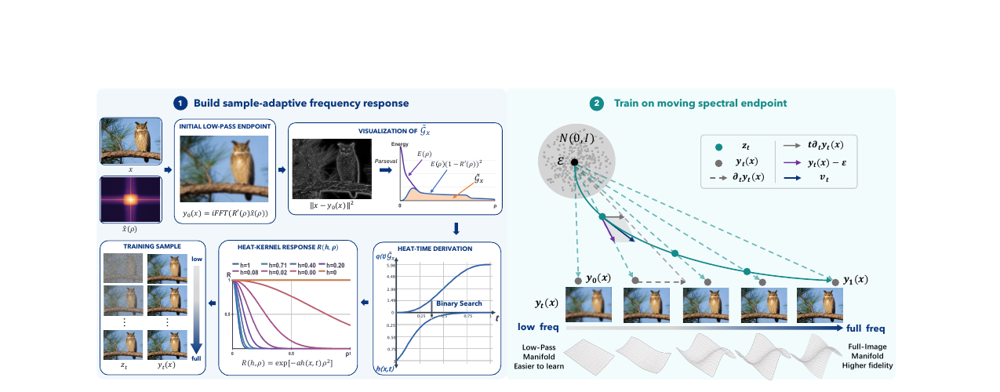
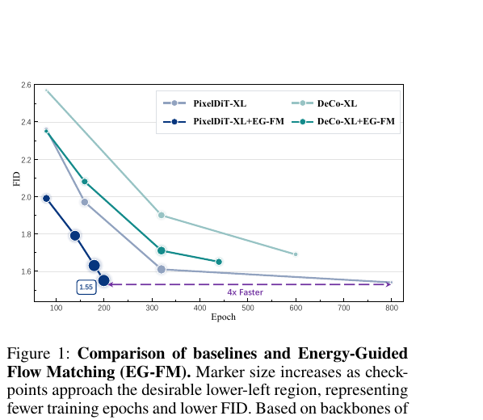

# AI Daily

## [Energy-Guided Flow Matching: 動態頻譜端點重塑像素級圖像生成軌跡](https://arxiv.org/abs/2608.05811)

**發表時間：** 2026-08-06  
**作者：** Haoyang Tong, Yu He, Fang Li, Lichen Ma, Jingling Fu, Dong Chen, Zhen Chen, Junshi Huang, Jie Cao  
**研究單位：** MAIS & NLPR, CASIA (中國科學院自動化研究所)；JD.com (京東)；Xi'an Jiaotong University (西安交通大學)  

---

### 論文核心貢獻與創新點

像素級生成模型（Pixel-space generative models）能避免潛在空間壓縮帶來的資訊損失，但在高維空間中聯合學習全局結構與高頻細節極具挑戰。標準的 Flow Matching 將噪聲直接插值到一個固定的乾淨圖像端點（fixed clean-image endpoint），將頻譜演化的過程完全交由模型隱式學習，增加了優化難度。

本文提出 **Energy-Guided Flow Matching (EG-FM)**，從能量與頻譜的視角重新設計了 Flow Matching 的生成軌跡。其核心創新在於：**引入一個會隨時間移動的頻譜端點（moving spectral endpoint）來取代固定端點**。透過基於每張圖像頻譜能量的自適應調度（sample-adaptive heat-time scheduling），EG-FM 讓生成過程顯式地遵循「由粗到細（coarse-to-fine）」的演化路徑，先建立低頻的全局結構，再逐步釋放高頻的紋理細節。此框架無需修改底層網路架構或訓練數據，能以即插即用的方式應用於現有模型，在幾乎不增加計算成本的情況下，顯著提升了訓練收斂速度與生成品質。

*圖 1：EG-FM 方法總覽。透過 heat-kernel response 動態調整目標端點，生成軌跡由低頻流形逐步過渡到全頻流形。*

---

### 技術方法簡述

#### 1. 移動頻譜端點 (Moving Spectral Endpoint)

在標準 Flow Matching 中，給定乾淨圖像 $x$ 與噪聲 $\epsilon \sim \mathcal{N}(0, I)$，中間狀態 $z_t$ 定義為：
$$ z_t = t x + (1 - t)\epsilon $$

EG-FM 將固定的目標端點 $x$ 替換為隨時間 $t$ 演化的移動端點 $y_t(x)$：
$$ z_t = t y_t(x) + (1 - t)\epsilon $$

其中，$y_t(x)$ 是一系列透過熱核濾波器（heat-kernel filter）生成的低通圖像：
$$ y_t(x) = \mathcal{F}^{-1}(R(h(x,t), \rho) * \hat{x}) $$
熱核頻率響應函數定義為 $R(h(x,t), \rho) = \exp(-a \cdot h(x,t) \cdot \rho^2)$。透過控制與圖像相關的熱時間參數（heat-time）$h(x,t)$，模型能在 $t=0$ 時給出一個極度平滑的初始低通端點 $y_0(x)$，並在 $t \to 1$ 時逐步釋放高頻訊號，直到 $h(x,1)=0$ 恢復為完整的 $x$。

#### 2. 能量引導的熱時間調度 (Energy-Guided Heat-Time Scheduling)

為了讓不同紋理複雜度的圖像在相同的時間步 $t$ 達到一致的生成進度，EG-FM 引入了基於頻譜能量的自適應調度。首先計算初始低通端點到真實圖像的總缺失能量 $\tilde{G}_x$：
$$ \tilde{G}_x = \sum_\rho E(\rho)[1 - R(1, \rho)]^2 $$
接著，強制每個樣本在時間 $t$ 恢復的能量比例與一個全域的釋放時鐘（release clock）$q(t)$ 對齊：
$$ \frac{G_x(h(x,t))}{\tilde{G}_x} = q(t) $$
這保證了紋理豐富的圖像（如動物毛髮）會比平滑圖像（如藍天）更早、更快地釋放高頻訊號，實現了真正的 sample-adaptive 軌跡控制。

#### 3. 能量引導速度 (Energy-Guided Velocity)

由於目標端點 $y_t(x)$ 是隨時間移動的，EG-FM 的訓練目標速度 $v_t$ 必須包含端點自身的運動項。對 $z_t$ 求導可得：
$$ v_t = \frac{dz_t}{dt} = y_t(x) - \epsilon + t \frac{\partial y_t(x)}{\partial t} $$
第一項 $y_t(x) - \epsilon$ 是朝向當前端點的基礎傳輸速度，第二項 $t \partial_t y_t(x)$ 則是端點移動的貢獻。模型只需將此 $v_t$ 作為回歸目標進行訓練，即可無縫整合進標準的 Flow Matching 框架中。

---

### 實驗結果和性能指標

EG-FM 在多個主流的 DiT 架構（如 PixelDiT, DeCo, HyperDiT）上進行了廣泛驗證，展現出強大的泛化能力與加速收斂特性。

**1. ImageNet 256×256 條件生成**
- **PixelDiT-XL + EG-FM** 在僅訓練 **200 epochs** 時即達到 **FID 1.55**，超越了原版訓練 800 epochs 的表現（FID 1.54），實現了近 **4倍的訓練加速**。
- 繼續訓練至 600 epochs，FID 進一步降至 **1.45**，刷新了該架構的性能上限。

*圖 2：EG-FM 在不同架構上的收斂曲線。實線代表 EG-FM，可見其能以顯著更少的 Epoch 達到更低的 FID。*

**2. 高解析度與文本到圖像生成**
- **ImageNet 512×512**：在 256 解析度基礎上微調 40 epochs，HyperDiT-H + EG-FM 達到 **FID 1.58**。
- **Text-to-Image (512×512)**：在 GenEval 基準上獲得 **0.85** 的高分，在 DPG-Bench 獲得 **83.9**，超越了 PixelDiT-T2I、OmniGen2 等近期強勢模型，證明了其在複雜語義對齊任務上的優越性。

---

### 相關研究背景

近期圖像生成領域的兩大趨勢為 **Autoregressive (AR)** 與 **Diffusion / Flow Matching** 的融合，以及對 **Training-Free** 軌跡控制的探索。
1. **Coarse-to-Fine 生成**：如 Visual Autoregressive (VAR) 模型透過「下一尺度預測」顯式地實現了由粗到細的生成。EG-FM 則是將這種思想引入到連續時間的 Flow Matching 軌跡中。
2. **Trajectory Design**：傳統 Flow Matching (如 Rectified Flow) 專注於直線軌跡。近期的研究開始探索曲線或頻率感知的軌跡（如 FourierFlow）。EG-FM 的獨特之處在於其端點是**動態移動且樣本自適應**的，這為 Energy-based model 與 Diffusion 的結合提供了新的數學框架。

---

### 個人評價和意義

EG-FM 是一篇極具啟發性的工作。它巧妙地將「能量（頻譜能量）」、「頻率演化」與「Flow Matching 軌跡」結合在一起。

1. **對 Energy-based transformer 的啟示**：這項研究證明了，與其讓強大的 Transformer 去隱式地死記硬背從純噪聲到高頻細節的映射，不如在輸入端（目標端點）給予一個符合物理與視覺直覺的「能量釋放路徑」。這種思路完全可以借鑑到 Energy-based Transformer 的能量函數設計中。
2. **Training-free 的優雅性**：EG-FM 不需要改變網路架構，僅透過修改訓練時的 Ground Truth Velocity 就達到了驚人的效果。這種對 ODE 軌跡的深刻理解，為後續設計 Inference-time 或 Training-free 的 attention modulation 提供了堅實的理論基礎。
3. **Zero-shot 泛化潛力**：由於其強迫模型先學好全局結構，這對於處理 Zero-shot 任務（如未見過的複雜 prompt 組合）時，能有效避免局部細節干擾全局語義對齊，這點從其 GenEval 的高分中得到了印證。
