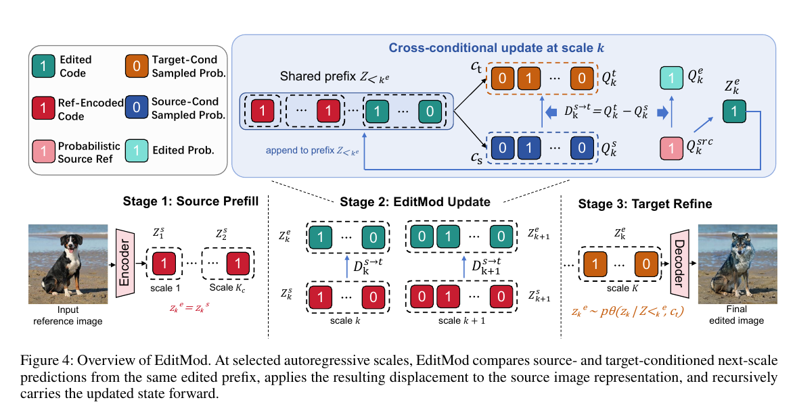

# AI Daily

## 2026-08-17：EditMod——不要重建整張圖，而是在 VAR source state 上建模「編輯差分」

> **一句話摘要：** EditMod 將 training-free text-guided image editing 重新定義為「保留 source image 的多尺度 autoregressive state，只估計 target condition 造成的 scale-wise residual change」，並在 Infinity-2B 上以 source prefill、shared-context differential update 與 target fine-scale refinement，達到單張 1K 圖像 1.57 秒的 inversion-free 編輯。[1] [2]

## 1. 為什麼今天選這篇？

本次研究先檢查 `KaiCobra/AI_Daily` 的本地索引與 README，再交叉瀏覽 Hugging Face Trending、arXiv 最新論文與相關工作。Hugging Face Trending 當日雖然將 JoyAI-Video-Edit 列為熱門視覺生成論文，但 repository 已經有 2026-08-13 的 JoyAI-Video-Edit 報告，因此排除。近期 repository 也已涵蓋 UniJEPA、EG-FM、UDT、Semantic Steering、V-RAE、SparVAR 與多篇 attention modulation／VAR 研究；因此今天需要選擇一篇**標題、arXiv ID 與研究主張都沒有重複，且能把既有方向推進一步**的論文。[8] [9]

候選中，MaViSeg 是很好的 training-free、zero-shot diffusion-transformer read-out 工作；PhyLatent 則對 JEPA world-model 的 dynamics-relevant collapse 有清楚診斷。然而，MaViSeg 主要是 open-vocabulary segmentation 後處理，PhyLatent 主要是具身世界模型，兩者都不是直接的圖像生成編輯器。EditMod 於 2026-08-10 首次提交、2026-08-13 修訂，直接處理使用者近期偏重的 **VAR、training-free、source-preserving generation 與 inference-time modulation**，且把 VAR 的 coarse-to-fine 結構提升為可解釋的編輯座標系，因此最值得作為今日主文。[1] [2]

| 篩選面向 | EditMod 的判斷 |
|---|---|
| 時效性 | arXiv v1 於 2026-08-10 提交，v2 於 2026-08-13 修訂，早於本報告日期且尚未被 repository 收錄。[2] |
| 會議／出版 | arXiv `cs.CV` 最新預印本；截至 2026-08-17，arXiv metadata 沒有列出 journal reference 或頂會接收資訊，因此不誤標為 CVPR、ICML 或 ICLR。[2] |
| 研究單位與作者背景 | arXiv metadata 列出九位作者，但未提供完整 affiliation；因此只採用論文中可驗證的 Infinity-2B／VAR editing 技術脈絡，不臆測個人職稱或機構。[1] [2] |
| 方法創新 | 將「target generation + source constraint」改成「source state + condition-induced residual」，把共享 context 的 prediction difference 變成編輯方向。[1] |
| 與近期偏好的貼合度 | 直接涉及 VAR、training-free、source-centric residual modulation、bitwise probability space，並可自然延伸至 energy-based、JEPA predictive latent 與 adaptive attention gate。 |
| 去重結果 | 本地 repository 沒有 `EditMod`、`2608.09057` 或同名文章；K2N 僅在既有 xLARD 報告的 related-work 討論出現，因此不再新增 K2N 作為主文。 |

## 2. 論文基本資訊

| 欄位 | 內容 |
|---|---|
| 論文標題 | **Model the Edit, Not the Image: Visual Autoregressive Editing from a Source-Centric Perspective** |
| 方法名稱 | **EditMod** |
| 作者 | Hongyi Fang, Chuwen Xie, Benjia Zhou, Yu-Xuan Qiu, Chenggong Hu, Zhibin Wang, Chao Chen, Jianbin Qin, Rui Mao [1] |
| 發表資訊 | arXiv:2608.09057v2；分類為 Computer Vision and Pattern Recognition；v1：2026-08-10，v2：2026-08-13 [2] |
| Backbone | Infinity-2B，bitwise visual autoregressive model，13 個 autoregressive scales [1] [3] |
| 任務 | Text-guided image editing；source image 與 source/target prompt 成對輸入 |
| Benchmark | PIE-Bench，700 張真實 source images，涵蓋 object replacement、attribute modification、pose change、style transfer、background editing 與 local semantic editing [1] |
| 主要指標 | CLIP-T：文字對齊；CLIP-I、DINO：source preservation；LPIPS、DreamSim：感知差異；runtime：單張 NVIDIA A100 端到端時間 [1] |
| 核心標籤 | Visual Autoregressive Modeling、Next-Scale Prediction、Training-Free Editing、Source-Centric Representation、Bitwise Probability Update |

## 3. 背景：VAR 為什麼適合做 source-centric editing？

傳統 diffusion 或 flow-based editor 通常先把 source image 反演到一條生成軌跡，再以 target prompt 重新生成，最後依賴 attention control、feature injection、mask 或其他 constraint 盡量保留未編輯內容。這種流程的困難在於：一旦 target-conditioned generation 已經改動了共享的結構、身份或局部紋理，後續再把 source 資訊注入回去，實際上是在重建「應該保持不變的內容」。EditMod 將問題反過來處理：source image 的 encoded representation 本來就已經存在，因此編輯的主要未知量應該是**條件改變所造成的差分**，而不是整張 target image。[1]

VAR 與 diffusion 的結構差異使這個轉換特別自然。Infinity 以 bitwise multi-scale tokenizer、Infinite-Vocabulary Classifier 與 Bitwise Self-Correction 進行逐尺度生成；coarse scales 主要承載 global structure，後續 scales 則逐步補充語義與高頻細節。[3] 這讓 source image 的 token hierarchy 不只是生成過程中的中間結果，也可以被視為具有不同語義解析度的編輯 state：早期 token 是 composition anchor，中間 token 是 semantic edit interface，後期 token 是 detail renderer。

> “Instead of constraining target-conditioned regeneration with source information, it directly preserves the scale-aligned source representation and models only the requested semantic change.” [1]

這個觀點與 AREdit、EditInfinity、VAREdit 形成清楚的研究演進。AREdit 以 randomness caching、adaptive fine-grained masking 與 token re-assembling 避免 inversion；EditInfinity 則利用 binary-quantized representation 對 inversion 提供較精確 supervision，但仍保留 inversion-based pipeline；VAREdit 是 ICLR 2026 的 training-based VAR editor，透過 Scale-Aligned Reference module 注入 scale-matched source conditioning。[4] [5] [6] EditMod 的差異不是再增加一個 constraint，而是把 source representation 本身定義為編輯狀態，讓 prediction difference 直接成為 edit direction。

## 4. 核心貢獻與創新點

### 4.1 從 generation-centric 改成 source-centric

若以 target-conditioned state 為中心，抽象流程可表示為

$$
\widehat{Z}_t + \mathcal{C}_s \longrightarrow Z_e,
$$

其中 \(\widehat{Z}_t\) 是 target generation state，\(\mathcal{C}_s\) 是由 source image 提供的 inversion、feature、attention 或 mask constraint。這個路徑必須先生成一個可能已經偏離 source 的狀態，再想辦法恢復未編輯內容。[1]

EditMod 改用

$$
Z_s + \Delta_{s\rightarrow t} \longrightarrow Z_e,
$$

其中 \(Z_s\) 是 source image 的 encoded multi-scale state，\(\Delta_{s\rightarrow t}\) 是 target condition 導致的語義變化。這個改寫將 preservation burden 從「重建高維 shared content」改成「估計較低維的 condition-related residual」。它不是宣稱所有編輯都低維，而是指出 source-centric parametrization 讓模型不必再次猜測本來已知的 layout、identity 與 texture。

### 4.2 Shared-context prediction difference

在相同的 edited prefix 下，模型分別接受 source prompt \(c_s\) 與 target prompt \(c_t\)，得到兩個 next-scale prediction。因為兩次預測共享前綴、只改變條件，所以兩者的差異可消除部分 shared response，留下較接近語義變化的方向。這是 EditMod 最重要的 representation-level modulation：它沒有學一個新的 editor，也沒有手工指定空間 mask，而是從 frozen VAR 的 conditional response 中計算 edit direction。

### 4.3 三階段 coarse-to-fine editing

作者將每個 autoregressive scale 分成三個功能區間。coarse scales 直接複用 source tokens，固定原始 composition；intermediate scales 以 source／target prediction difference 更新 source state；fine scales 轉為 target-conditioned sampling，讓模型重新生成局部紋理與邊界。這種不對稱配置反映一個實用假說：**語義改變主要在中間尺度形成，最細尺度更適合負責 detail refinement，而不是承受大幅語義位移。**

*圖 1：論文 Figure 4 的局部 PDF crop。圖中只保留方法流程與圖說，不是整頁畫面；原生圖片依指定 PDF 圖片擷取流程取得後，再裁切出必要區域。[1]*

## 5. 技術方法：從 VAR state 到 bitwise edit direction

### 5.1 Next-scale VAR preliminaries

對 source image \(x_s\)，VAR encoder 產生多尺度 token hierarchy：

$$
Z_s = \operatorname{Enc}(x_s)=\{z_1^s, z_2^s,\ldots,z_K^s\},
\qquad z_k^s\in\mathbb{R}^{h_k\times w_k\times d}.
$$

在第 \(k\) 個 scale，模型根據所有先前 scales 與文字條件 \(c\) 預測當前 scale；因為同一個 scale 的空間位置可以平行預測，其條件分佈可寫為

$$
p_\theta(z_k\mid Z_{<k},c)
=
\prod_{i=1}^{h_kw_k}p_\theta(z_{k,i}\mid Z_{<k},c).
$$

Infinity 以 binary spherical quantization 將連續 feature \(u\in\mathbb{R}^d\) 映射到 bit representation：

$$
b=\frac{1}{\sqrt d}\operatorname{sign}(u)
\in\frac{1}{\sqrt d}\{-1,+1\}^{d}.
$$

因此，模型不必直接對大小為 \(2^d\) 的超大 vocabulary 做單一分類，而是平行預測 \(d\) 個 bit 的條件機率。這個 bitwise probability space 也是 EditMod 能夠進行平滑 residual update 的原因；若直接在離散 code 上硬切換，微小改動可能造成過大的 token jump。[1] [3]

### 5.2 理想的 source-to-target displacement

作者將 source 與理想 target representation 分解成共享成分與條件相關成分：

$$
z_k^s=A_k+R_k^s,
\qquad
z_{k,t}^{*}=A_k+R_k^t.
$$

理想 edit direction 因而是

$$
\Delta_{k,s\rightarrow t}^{*}
=z_{k,t}^{*}-z_k^s
=R_k^t-R_k^s.
$$

這個式子表達了一個很重要的歸納偏置：共享內容 \(A_k\) 應該被保留，真正需要改動的是 source／target condition 的差異。

### 5.3 Cross-conditional approximation

在實際情況下，理想 target representation \(z_{k,t}^{*}\) 不可得。EditMod 讓 source／target prompt 在相同 edited context \(Z_{<k}^{e}\) 下產生兩個 prediction：

$$
\Phi_k^s=\Phi_k(Z_{<k}^{e},c_s),
\qquad
\Phi_k^t=\Phi_k(Z_{<k}^{e},c_t).
$$

將兩者概念上分解為 shared response 與 condition-sensitive response：

$$
\Phi_k^s=\widehat A_k+\widehat R_k^s,
\qquad
\Phi_k^t=\widehat A_k+\widehat R_k^t.
$$

相減後，shared response 被消掉：

$$
\widehat\Delta_{k,s\rightarrow t}
=\Phi_k^t-\Phi_k^s
=\widehat R_k^t-\widehat R_k^s.
$$

最基本的 EditMod state update 是

$$
z_k^e=z_k^s+\widehat\Delta_{k,s\rightarrow t}.
$$

若 source-conditioned response 能近似 source semantics，即 \(\widehat R_k^s\approx R_k^s\)，便有

$$
z_k^e\approx A_k+\widehat R_k^t,
$$

也就是保留 source/target 共享內容，同時將條件相關成分推向 target-consistent realization。這不是嚴格的因果分解定理，而是用來解釋為什麼 shared-context difference 能成為合理 edit direction 的分析模型。[1]

### 5.4 在 bitwise probability space 執行更新

由於 Infinity 的 source representation 是 binary code，論文先把 source code 轉成每一個 bit 的 probability tensor。令 source bit label 為 \(b_{kij}^s\in\{-1,+1\}\)，且 source-label confidence 為 \(p>0.5\)，則

$$
Q_{kij}^{src}=
\begin{cases}
 p,& b_{kij}^s=+1,\\
 1-p,& b_{kij}^s=-1.
\end{cases}
$$

在相同 edited prefix 下，取得 source／target 條件的 bit probability：

$$
Q_k^s=p_\theta(b_k\mid Z_{<k}^e,c_s),
\qquad
Q_k^t=p_\theta(b_k\mid Z_{<k}^e,c_t).
$$

EditMod 定義概率空間的 edit direction：

$$
D_{k,s\rightarrow t}=Q_k^t-Q_k^s.
$$

然後將該方向加回 source reference，再限制到合法機率區間：

$$
Q_k^e=\operatorname{clip}
\left(Q_k^{src}+D_{k,s\rightarrow t},0,1\right).
$$

最後從 \(Q_k^e\) 取樣或取最大機率 bit，得到新的 edited code：

$$
z_k^e=\mathcal{B}(Q_k^e).
$$

這個設計比直接對離散 bit 做 deterministic replacement 更平滑，因為 source confidence、target preference 與 prediction difference 都在同一個 bounded probability space 中結合。也因此，EditMod 具有可解釋的「source anchor + condition difference」結構，而不是只能以黑盒 sampling 結果判斷編輯是否成功。

### 5.5 三階段 schedule 的形式化

令 \(K_c\) 為 source prefill 結束尺度，\(K_f\) 為 differential editing 結束尺度，完整 schedule 為

$$
z_k^e=
\begin{cases}
 z_k^s,& k\le K_c,\\
 \mathcal{B}(Q_k^e),& K_c<k\le K_f,\\
 z_k\sim p_\theta(z_k\mid Z_{<k}^e,c_t),& k>K_f.
\end{cases}
$$

在論文設定中，EditMod-P 使用 \(K_c=3,K_f=8\)，偏向 source preservation；EditMod-T 使用 \(K_c=2,K_f=7\)，偏向 text alignment。這種超參數本身提供一個可研究的 interface：如果能根據 token uncertainty、attention entropy 或 semantic energy 自動選擇 \(K_c,K_f\)，就能把固定 schedule 轉成 sample-adaptive editing policy。

## 6. 實驗結果與性能指標

### 6.1 主結果：PIE-Bench

PIE-Bench 包含 700 張真實 source image，且每張具有 source prompt 與 target prompt。論文以兩個 operating points 分別呈現文字對齊與 source preservation：EditMod-T 的 coarse boundary 偏向較早進入 edit，EditMod-P 則保留更多 coarse source scales。[1]

| 設定／方法 | Runtime (s) ↓ | CLIP-T ↑ | CLIP-I ↑ | LPIPS ↓ | DINO ↑ | DreamSim ↓ |
|---|---:|---:|---:|---:|---:|---:|
| FlowEdit（Flow） | 2.82 | 0.3232 | 0.8695 | 0.2748 | 0.7505 | 0.2279 |
| BitResEdit（VAR） | 5.35 | 0.3234 | 0.8551 | 0.3879 | 0.6906 | 0.3025 |
| EditInfinity（VAR） | 212.31 | 0.3167 | 0.8664 | 0.3703 | 0.7188 | 0.2742 |
| **EditMod-T（VAR）** | **1.57** | **0.3181** | **0.8762** | **0.3046** | **0.7889** | **0.1958** |
| AREdit（VAR） | 3.00 | 0.3080 | 0.9104 | 0.2609 | 0.8440 | 0.1376 |
| **EditMod-P（VAR）** | **1.57** | **0.3096** | **0.9120** | **0.2212** | **0.8641** | **0.1261** |

在 text-alignment block，EditMod-T 的優勢主要是速度與 source fidelity 的平衡；在 source-preservation block，EditMod-P 的 CLIP-I、DINO、LPIPS 與 DreamSim 均優於 AREdit，並以 1.57 秒完成端到端編輯。這裡需要精確理解比較方式：不同方法採用各自論文或官方設定，EditMod-T 與 EditMod-P 是兩個 trade-off operating points，而不是同一個單一 scalar score。[1]

### 6.2 Coarse source prefill 消融

| 設定 | CLIP-T ↑ | CLIP-I ↑ | LPIPS ↓ | DINO ↑ | DreamSim ↓ |
|---|---:|---:|---:|---:|---:|
| w/o prefill | 0.3170 | 0.8537 | 0.3570 | 0.7402 | 0.2464 |
| w/ prefill | 0.3096 | **0.9120** | **0.2212** | **0.8641** | **0.1261** |
| Relative change | −2.3% | +6.8% | −38.0% | +16.7% | −48.8% |

Source prefill 只讓 CLIP-T 下降 2.3%，卻讓 CLIP-I 提升 6.8%、DINO 提升 16.7%，並大幅降低 LPIPS 與 DreamSim。這支持作者對 scale semantics 的解讀：early scales 主要提供 global geometry 與 spatial layout，因此直接保留它們能以很小的 text-alignment 代價換來顯著的 source preservation。[1]

### 6.3 Intermediate operation 消融

| 中間尺度操作 | CLIP-T ↑ | CLIP-I ↑ | LPIPS ↓ | DINO ↑ | DreamSim ↓ |
|---|---:|---:|---:|---:|---:|
| Source-conditioned sampling | 0.3010 | 0.8678 | 0.5137 | 0.7100 | 0.2661 |
| Target-conditioned sampling | **0.3236** | 0.8351 | 0.5237 | 0.6602 | 0.3117 |
| **Differential update（EditMod）** | 0.3096 | **0.9120** | **0.2212** | **0.8641** | **0.1261** |

Target sampling 雖然取得最高 CLIP-T，卻傷害 source preservation；source sampling 則無法充分完成 semantic edit。Differential update 同時改善 CLIP-I、DINO、LPIPS 與 DreamSim，說明它不是簡單地在 source sampling 與 target sampling 之間插值，而是利用 shared-context cancellation 將主要條件差異搬移到 source state 上。[1]

### 6.4 Tail refinement

論文的 qualitative 與消融分析指出，semantic change 主要在 intermediate scales 形成；若在最後階段仍持續做 differential update，局部紋理與物體邊界較不穩定。因此 EditMod 在 fine scales 切換回乾淨的 target-conditioned branch，讓最後幾層專注於高頻 detail synthesis。這是方法中很實用但容易被忽略的工程判斷：**同一種 edit operator 不必貫穿整條 generation path。** [1]

## 7. 相關研究分析：EditMod 位於哪一條演進線上？

| 工作 | 路線 | 主要介入 | 是否需訓練／反演 | 與 EditMod 的關係 |
|---|---|---|---|---|
| Infinity | Bitwise VAR backbone | Multi-scale bitwise tokenizer、Infinite-Vocabulary Classifier、self-correction | 生成 backbone 需要訓練；不是 editor | 提供 EditMod 的 13-scale source state 與 bitwise probability space。[3] |
| AREdit | Training-free VAR editor | Randomness cache、distribution difference、adaptive fine-grained mask、token re-assembling | 不需 editor training；不走 diffusion inversion | 以 cache／mask 保護 source；EditMod 改成 shared-context residual，不依賴 mask。[4] |
| EditInfinity | Binary-quantized editing | Exact quantized supervision、prompt correction、image style preservation、smoothing | 需要 image inversion／prompt optimization | 利用量化 representation 讓 inversion 更精確；EditMod 完全跳過 per-image inversion。[5] |
| VAREdit | ICLR 2026 training-based VAR editing | Scale-Aligned Reference module，注入 scale-matched source conditioning | 需要訓練 VAR editor | 將 source conditioning 做成可學模組；EditMod 將 conditional displacement 直接由 frozen model 計算。[6] |
| EditMod | Source-centric training-free VAR editing | Source prefill、shared-context `Q_t−Q_s`、target tail refinement | 不需 training、inversion、mask、attention control 或 per-image optimization | 將 VAR scale hierarchy 重新定義為 edit coordinate system。[1] |
| K2N | VAR super-resolution | LR-conditioned coarse prefix + frozen VAR fine continuation | 需要 coarse-prefix prediction training；且 repository 已在 xLARD related work 討論 | 與 EditMod 共用「可靠 coarse state、後續 detail continuation」直覺，但任務是超解析度，不是 text-guided editing。[7] |

這條演進線的核心轉變是：早期方法把 source image 當成需要被回收的 constraint；後續方法開始把 source token、distribution 或 scale-aligned feature 視為可直接利用的 state；EditMod 再往前一步，將「condition switch」造成的 prediction displacement 明確定義成 editing signal。這個改寫對研究設計很重要，因為它使編輯方向、source preservation 與 computation budget 都能在同一個 scale-wise state space 中量化。

## 8. 個人評價：真正值得帶走的思想

我認為 EditMod 最有價值的部分不是單一的 1.57 秒 runtime，而是它提出了一個可搬移的問題分解：**generator 不必負責重新發明 source image；它只需要在已有 state 上估計 condition-induced change。** 這種 source-centric view 對 VAR 特別自然，但並不只限於 VAR。對 diffusion transformer，可以研究在 latent、attention output 或 intermediate representation 上建立 source／target paired prediction difference；對 video model，可以要求差分只修改 semantic state，並用 temporal predictor 限制未編輯內容的 drift。

第二個重要訊息是「差分應該在共享 context 下計算」。如果 source 與 target prediction 來自不同 prefix，差異會混合 context drift 與 condition change；EditMod 先固定 edited prefix，再改變 prompt，等於對 edit direction 做一種局部對照實驗。這個想法可以延伸成 counterfactual attention analysis：固定同一個 state，只替換一個條件因素，再量化 representation displacement。

第三，EditMod 用 coarse／middle／fine 三段 schedule 表達了生成模型內部的功能分工，但目前的邊界仍是手工設定。這既是限制，也是很清楚的研究入口：可以讓每個 scale 根據 uncertainty、semantic energy、attention entropy 或 JEPA predictive consistency 自動決定要保留、差分更新或重新採樣。

## 9. 給 Energy-based Transformer、JEPA 與 Attention Modulation 的延伸假說

以下不是 EditMod 論文已驗證的結果，而是根據其 `Q_t−Q_s` 與 source-centric state 所提出的可實驗研究方向。

### 9.1 Energy-based scale-wise editing

對每個 bitwise scale 定義條件能量

$$
E_k(b;Z_{<k},c)=-\log p_\theta(b_k\mid Z_{<k},c).
$$

source／target 的 energy difference 可寫成

$$
\Delta E_k=E_k(b;Z_{<k},c_t)-E_k(b;Z_{<k},c_s).
$$

EditMod 目前在 probability space 使用 \(Q_k^t-Q_k^s\)。下一步可以比較三種 edit force：probability difference、logit difference 與 energy gradient，並以 trust region 限制更新量：

$$
q_k^{e}=\Pi_{[0,1]}
\left(q_k^{src}-\eta\nabla_{q_k}\Delta E_k\right).
$$

這樣的 Energy-based Transformer editor 能將「為什麼某個 token 被改動」轉成可檢查的 energy contribution，而不只是觀察最終影像是否符合 prompt。

### 9.2 JEPA predictive latent 作為 semantic critic

若有 source encoder \(E\) 與 action／condition-conditioned predictor \(F\)，可將 source image 的 latent state 寫成 \(z_s=E(x_s)\)，並比較 target condition 下的 predictive latent：

$$
\widehat z_{t+\Delta}^{\,s}=F(z_s,c_s),
\qquad
\widehat z_{t+\Delta}^{\,t}=F(z_s,c_t).
$$

以

$$
\Delta z_{s\rightarrow t}
=\widehat z_{t+\Delta}^{\,t}-\widehat z_{t+\Delta}^{\,s}
$$

作為高階 semantic edit direction，再把它投影回 VAR 的 intermediate scales。這會把 EditMod 的 conditional difference 從 pixel/token distribution 擴展到 predictive representation，並可用 JEPA consistency loss 檢查「改完之後，未來 latent 是否仍然可預測」。對影片編輯而言，這比只看單幀 CLIP-I 更可能捕捉 temporal identity 與 motion continuity。

### 9.3 Adaptive scale schedule

令第 \(k\) 個 scale 的 source／target uncertainty 為 bit entropy 的平均：

$$
H_k=-\frac{1}{d h_k w_k}
\sum_{i,j}
\left[q_{kij}\log q_{kij}+(1-q_{kij})\log(1-q_{kij})\right].
$$

再令 semantic displacement 為

$$
M_k=\left\|Q_k^t-Q_k^s\right\|_1.
$$

可用 \((H_k,M_k)\) 決定 schedule：當 \(M_k\) 高且 \(H_k\) 低時，模型對 edit direction 有信心，適合 differential update；當 \(H_k\) 高時，應保留 source 或延後到更細尺度；當 \(M_k\) 低且 source confidence 高時，直接 source prefill 可能最安全。這比固定 \(K_c,K_f\) 更接近 sample-adaptive controller。

### 9.4 Selective attention modulation

如果將 source／target displacement 投影到 attention output 或 token hidden state，可令 gate 依據 semantic alignment 與 uncertainty 共同決定：

$$
 g_{k,i}=\sigma\left(\beta M_{k,i}-\gamma H_{k,i}-\tau\right),
$$

並使用

$$
 h_{k,i}'=h_{k,i}+g_{k,i}v_{k,i}^{edit}.
$$

這個 gate 只有在 target condition 真正改變當前 token，且模型對方向具有足夠信心時才啟用；它可將 EditMod 與 attention modulation、ConceptAttention、MaViSeg 的 feature geometry 統一到同一個 inference-time read/write framework 中。[10] [11]

## 10. 限制、可重現性與需要保留的疑問

首先，EditMod 仍依賴預先設定的 coarse／intermediate／fine boundaries；論文自己也指出，adaptive、fine-grained、semantics-aware cross-scale control 尚未解決。[1] 其次，training-free 不等於單次 forward：每個 differential scale 需要在相同 prefix 下取得 source 與 target condition 的 prediction，因此必須明確核算額外 forward 次數與 cache reuse 策略。第三，主結果集中於 Infinity-2B 與 PIE-Bench，尚不能直接推論到其他 VAR tokenizer、不同 bit dimension、影片 VAR 或 non-bitwise next-scale model。[1]

此外，論文的優勢主要在 source preservation、runtime 與不需要 per-image preparation；對於需要大幅改變 global composition 的任務，過度保留 coarse source token 可能反而限制 edit strength。最後，arXiv metadata 沒有確認頂會收錄，因此本文把它定位為**非常新的、值得追蹤的 arXiv method paper**，而不是已完成同行評審的頂會成果。[2]

## 11. 結論

EditMod 將 VAR image editing 從「如何在 target generation 中盡量保留 source」改寫成「如何在 source state 上只加入 target condition 造成的變化」。其方法由三個互相配合的部件構成：coarse-scale source prefill 固定結構，中間尺度 shared-context differential update 注入語義，fine-scale target refine 補足局部細節。實驗顯示，這個簡潔的 source-centric design 在 PIE-Bench 上以 1.57 秒完成 1K image editing，並在 source-preservation operating point 達到 CLIP-I 0.9120、DINO 0.8641、LPIPS 0.2212、DreamSim 0.1261。[1]

對今日關注的方向而言，最值得延伸的不是把 EditMod 原封不動套用到另一個模型，而是抽象出它的三個接口：**state anchor、condition displacement、adaptive schedule**。前者可以由 VAR token、JEPA latent 或 diffusion intermediate feature 實現；中者可以由 probability difference、logit difference 或 energy gradient 實現；後者可以由 uncertainty、attention entropy 或 predictive consistency 決定。這使 EditMod 成為一個很好的研究起點：它把 generation、editing、energy-based control、JEPA prediction 與 attention modulation 放到同一個可量化的 representation-space 問題裡。

## References

[1]: https://arxiv.org/html/2608.09057v2 "Model the Edit, Not the Image: Visual Autoregressive Editing from a Source-Centric Perspective"
[2]: https://arxiv.org/abs/2608.09057 "arXiv:2608.09057 metadata and submission history"
[3]: https://foundationvision.github.io/infinity.project/ "Infinity: Scaling Bitwise AutoRegressive Modeling for High-Resolution Image Synthesis"
[4]: https://arxiv.org/html/2503.23897v1 "Training-Free Text-Guided Image Editing with Visual Autoregressive Model"
[5]: https://arxiv.org/html/2510.20217v1 "EditInfinity: Image Editing with Binary-Quantized Generative Models"
[6]: https://proceedings.iclr.cc/paper_files/paper/2026/hash/8a0501a7e57e3669849e0ecf6f1a6295-Abstract-Conference.html "Visual Autoregressive Modeling for Instruction-Guided Image Editing (ICLR 2026)"
[7]: https://arxiv.org/html/2608.01823v2 "Detail Continuation over a Trustworthy Coarse Scale for Autoregressive Super-Resolution"
[8]: https://github.com/KaiCobra/AI_Daily "KaiCobra/AI_Daily repository"
[9]: https://huggingface.co/papers/trending "Hugging Face Trending Papers"
[10]: https://arxiv.org/html/2502.04320v1 "ConceptAttention: Diffusion Transformers Learn Highly Interpretable Features"
[11]: https://arxiv.org/html/2608.05878 "MaViSeg: Manifold Propagation and Visual Prototypes for Zero-Shot Open-Vocabulary Segmentation in Diffusion Transformers"
