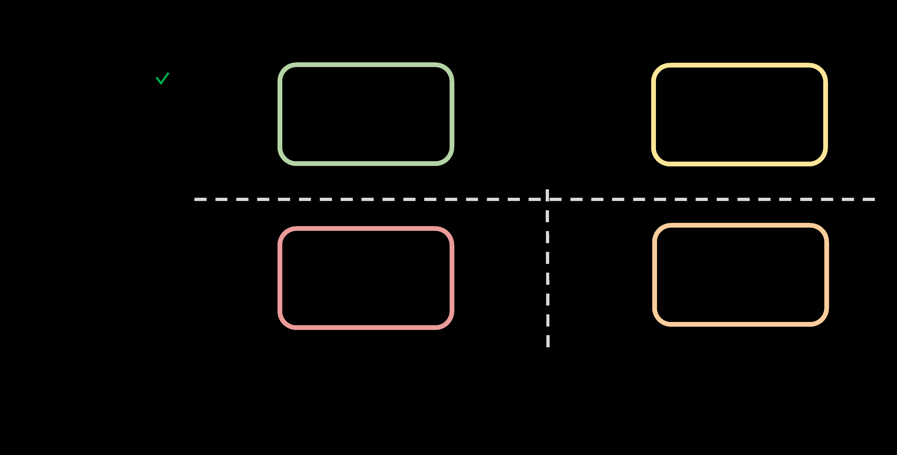
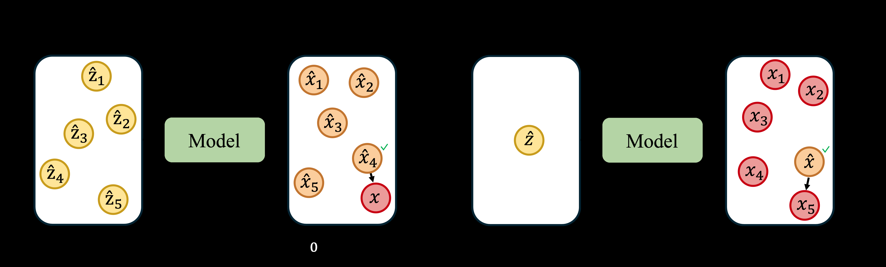
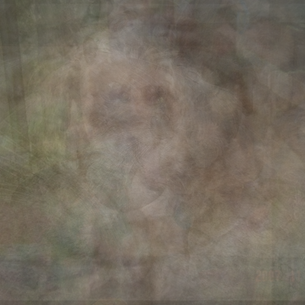

# AI Daily

## Explorative Modeling: Unlocking a Third Pretraining Axis and End-to-End Generation

**論文標題**：Explorative Modeling: Unlocking a Third Pretraining Axis and End-to-End Generation  
**作者**：Alexi Gladstone (UIUC), Heng Ji (UIUC), Yilun Du (Harvard)  
**發表時間**：2026-07-29 (arXiv:2607.27372)  
**領域**：Generative Modeling, Deep Learning, Image Generation, Video Generation, Language Modeling  

### 論文核心貢獻和創新點

自 AlexNet 以來，深度學習的革命告訴我們：端到端（End-to-End）訓練勝過將問題分解為手工設計的階段。然而，生成式建模（Generative Modeling）卻一直是個例外。儘管現今的生成模型能力驚人，但它們並非端到端訓練。這主要是因為生成式建模的核心在於處理具有多個眾數（Modes）的分佈。現有的可擴展方法（如 Autoregressive、Diffusion 或 Flow Matching）都是透過分解「生成過程（Generation Procedure）」來處理這種多眾數性，這反而阻礙了端到端生成。

本文提出了一個顛覆性的新範式——**探索式建模（Explorative Modeling, XM）**。作者不分解生成過程，而是分解「訓練迴圈（Training Loop）」。具體而言，在訓練時，模型會探索 $K$ 個可能的生成結果與資料之間的匹配，並只對最佳的匹配進行訓練。這樣一來，預測結果會致力於擬合特定的眾數，而不是將它們模糊化。

本論文的核心貢獻可歸納為以下幾點：
1. **提出第三個預訓練軸**：在現有的「參數（Parameters）」和「資料（Data）」之外，引入了「探索（Exploration）」作為現有生成模型的第三個擴展軸。
2. **全面的效能提升**：增加探索能單調提升連續與離散領域（影像、影片、語言）的效能。
3. **擴展效率倍增**：探索帶來的增益會隨著規模擴大而增加。FLOP 效率提升 4.1 倍，樣本效率提升 6.2 倍，參數效率提升 47%。在 ImageNet 256×256 影像生成上，無引導的 FID 達到近乎 SOTA 的 1.43。
4. **實現端到端生成**：作為獨立的生成範式，XM 實現了端到端重建生成，在控制任務上匹配了 Diffusion 的表現，但推理步驟減少了 16 到 256 倍。

*圖 1：生成式建模的分解軸。傳統方法分解生成過程（X軸），而 Explorative Modeling 分解訓練迴圈（Y軸）。*

### 技術方法簡述

生成式建模的核心難題在於我們事先不知道哪一個潛在變數（如噪聲）應該對應到哪一個資料點。如果隨機配對，模型會被迫重建許多不同的有效目標，導致單一預測只能給出這些目標的平均值，這通常是模糊且不真實的。

Explorative Modeling 透過在訓練時搜尋最適合的配對來解決這個問題。論文提出了兩種主要的探索方向：

#### 1. Forward XM（前向探索）

Forward XM 固定一個資料目標，並探索模型自己的生成結果。它會抽取 $K$ 個候選生成，並只將最接近目標的那個用於訓練。目標函數定義為：

$$ \mathcal{L}_{\text{Forward}}(\theta) = \min_{i\in\{1,\ldots,K\}} J(\hat{y}_{i}, x) $$

其中 $x \sim \mathcal{D}$ 是真實資料，$\hat{y}_{1}, \ldots, \hat{y}_{K} \sim G_{\theta}$ 是模型的生成結果，$J$ 是重建損失（如平方誤差）。

因為每個資料點都會拉近與其最接近的生成結果，沒有任何資料會被忽略，所以 Forward XM 具有**質量覆蓋（Mass-covering）**的特性，偏向於提高召回率（Recall）。

#### 2. Reverse XM（反向探索）

Reverse XM 則是固定一個模型生成的樣本，並在資料中搜尋。它抽取一個生成樣本 $\hat{y} \sim G_{\theta}$，並將其訓練向 $K$ 個資料目標 $x_{1}, \dots, x_{K} \sim \mathcal{D}$ 中最接近的一個。目標函數為：

$$ \mathcal{L}_{\text{Reverse}}(\theta) = \min_{i\in\{1,\dots,K\}} J(\hat{y}, x_{i}) $$

這會將每個生成結果拉到資料流形上，因此 Reverse XM 偏向於提高精確度（Precision）。而且它的計算成本很低，因為它在資料上搜尋，每次損失計算只需一次生成前向傳遞。

*圖 2：Forward XM（左）與 Reverse XM（右）的概念示意圖。Forward XM 探索多個生成候選以匹配固定資料；Reverse XM 搜尋多個資料點以匹配固定生成。*

#### 理論視角：避免 Mode Averaging

在沒有探索（$K=1$）的情況下，模型只能預測所有樣本的平均值。下圖展示了這個問題：XM-1（無探索）會產生模糊的影像，因為它試圖平均多個可能的真實影像。當探索數量增加（如 XM-50），模型能夠捕捉到特定的眾數，生成清晰的影像。

| XM-1 (無探索：模糊平均) | XM-50 (高探索：清晰眾數) |
| :---: | :---: |
|  |  |

### 實驗結果和性能指標

論文在多個領域進行了廣泛的實驗，證明了 Explorative Modeling 作為新擴展軸的有效性：

1. **影像生成 (ImageNet 256×256)**：
   - 將探索加入到當時的 SOTA 方案 RAE (Representation Autoencoder) 中。
   - 達到相同的基準效能只需 **6.2 倍更少的資料**和 **4.1 倍更少的 FLOPs**。
   - 最終模型（XRAE XM-2）在無引導情況下達到 **gFID 1.43**。

2. **跨模態與擴展性**：
   - 在影像 (FID) 和影片 (FVD) 生成上，增加探索模式數量（$K$）會單調提升效能。
   - 在 Masked Diffusion Language Modeling (MDLM) 中，加入探索也顯著改善了 Perplexity-Entropy 邊界。
   - **關鍵發現**：探索帶來的增益隨著資料量和模型大小的增加而擴大。當資料量擴展時，增益從 7% 升至 36%；當模型變大時，增益從 13% 升至 23%。

3. **端到端生成 (Robotics Control)**：
   - **Explorative Policy** 在 Robomimic 任務上匹配了 Diffusion Policy 的表現，但推理只需 **1 次前向傳遞**（NFE: 1），而 Diffusion Policy 需要 100 次。
   - **Explorative World Model** 在 Maze2D 任務上匹配了 Diffuser，推理計算量減少了 **16 到 256 倍**。

### 相關研究背景

*   **Mode Forcing**：近期的研究指出，現代生成式建模的藝術在於設計一個重建目標，使其損失最小化者能夠捕捉眾數而不是平均它們。現有方法（Diffusion, Autoregressive）透過分解生成步驟來實現，而本論文則提出分解訓練迴圈。
*   **Energy-Based Transformers (EBTs)**：EBT 是一種強大的架構，但在端到端生成和處理高度多眾數分佈時面臨挑戰。本論文明確指出，將 XMs 與 EBTs 結合是一個極具潛力的未來方向。
*   **JEPA (Joint-Embedding Predictive Architecture)**：JEPA 學習世界模型，但在非確定性環境中進行下一步預測和軌跡規劃是多眾數的。特徵迴歸會模糊這些眾數，而探索（Exploration）則能捕捉它們。

### 個人評價和意義

這是一篇極具啟發性的重量級論文。它跳脫了現有生成模型（如 Diffusion 和 Autoregressive）在「生成步驟」上做文章的窠臼，直接從「訓練迴圈」切入，優雅地解決了 Mode Collapse 和 Exposure Bias 的問題。

將「生成式表達力（Generative Expressivity）」正式定義為與參數和資料並列的第三個 Scaling Axis，為未來的模型訓練指明了新方向。更令人振奮的是，這種 Training-Free（在推理階段）的特性，使得它能在保持極高品質的同時，將推理成本降低數十甚至數百倍。

對於近期關注 Energy-Based Transformer、JEPA 和 Training-Free 方法的研究者來說，這篇論文提供了一個完美的交集點。它不僅在理論上解釋了為何單純的迴歸會失敗，更在工程上提供了一個簡單（只需一個 for loop）卻極其強大的解決方案。這極有可能是下一代端到端視覺與多模態基礎模型的核心組件。
