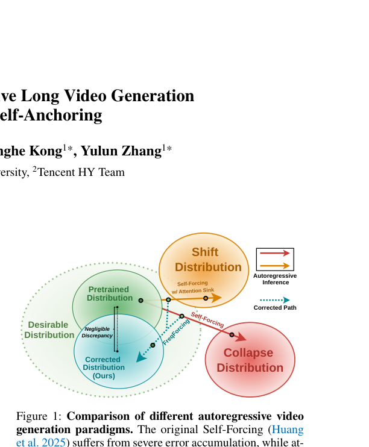
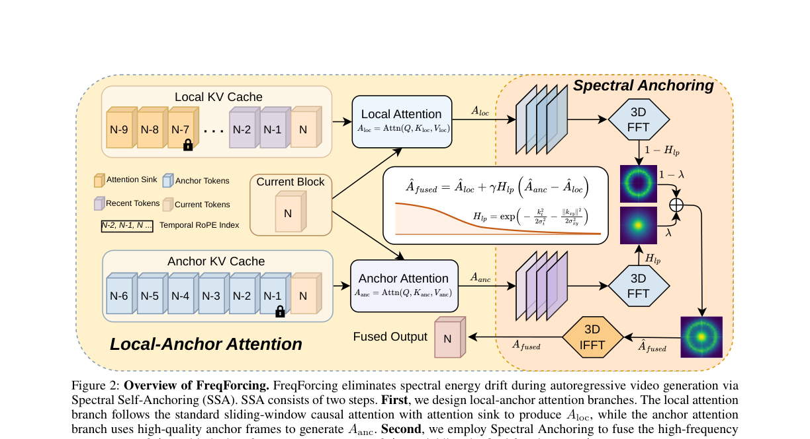
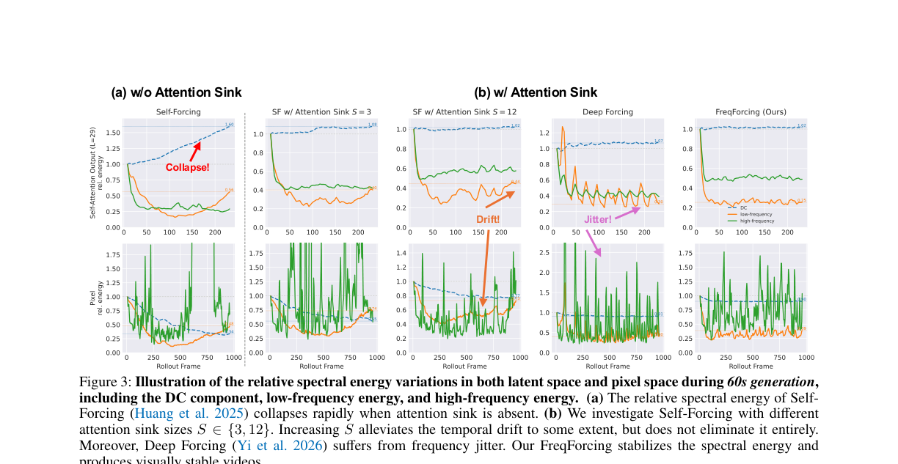
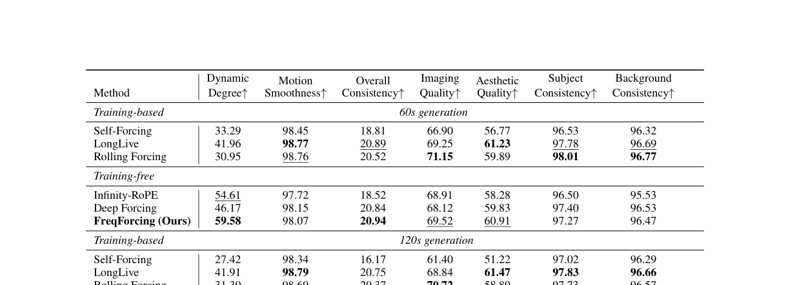
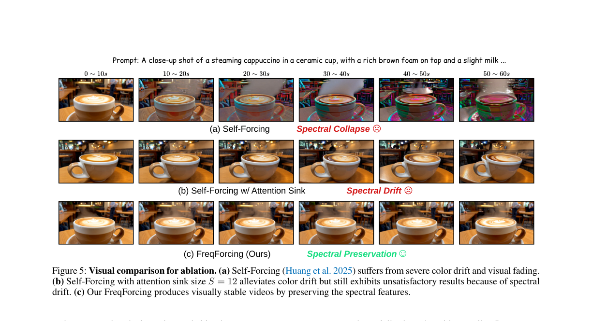

# AI Daily

## FreqForcing: Autoregressive Long Video Generation via Spectral Self-Anchoring

**論文標題**：FreqForcing: Autoregressive Long Video Generation via Spectral Self-Anchoring
**作者**：Jiatong Li, Leo Liang, Linghe Kong, Yulun Zhang (Shanghai Jiao Tong University, Tencent HY Team)
**發表時間**：2026-07-29
**論文連結**：[arXiv:2607.27110](https://arxiv.org/abs/2607.27110)
**程式碼**：[GitHub - FreqForcing](https://github.com/jiatongli2024/FreqForcing)

---

### 1. 核心貢獻與創新點

在自迴歸影片擴散模型（Autoregressive Video Diffusion Models）中，模型透過重複使用先前的快取狀態（KV Cache）來逐幀生成影片。然而，由於推理時使用的歷史幀是模型自己生成的「不完美」預測，誤差會隨著生成長度不斷累積，最終導致顏色漂移、運動停滯，甚至畫面完全崩壞（Visual Collapse）。

這篇論文的**核心創新在於從「頻域（Frequency Domain）」的視角重新定義了這個長時序誤差累積的問題**。作者發現，影片崩壞的本質是**頻譜能量的漂移（Spectral Energy Drift）**，特別是在直流（DC）與低頻頻段的能量流失。

基於這個深刻的觀察，論文提出了 **FreqForcing**，這是一個**完全免訓練（Training-Free）**的推理時介入框架。它透過 **Spectral Self-Anchoring (SSA)** 機制，在頻域上將高頻的動態細節與低頻的穩定錨點進行融合，成功將僅在 5 秒片段上預訓練的模型，**Zero-Shot 外推（Extrapolate）至 2 分鐘的長影片生成（24倍外推）**，同時保持極高的畫面穩定性與時序一致性。

*圖 1：不同自迴歸影片生成範式的比較。Self-Forcing 會逐漸偏離分佈導致崩壞，Attention Sink 僅能部分緩解，而 FreqForcing 透過頻域自錨定將生成軌跡拉回理想分佈。*

---

### 2. 技術方法簡述

FreqForcing 的核心是 **Spectral Self-Anchoring (SSA)** 模組。在自迴歸生成的推理階段，模型採用雙分支注意力機制：

#### 2.1 局部-錨點雙分支注意力 (Local-Anchor Attention Branches)

1. **局部注意力分支 (Local Attention)**：
   使用標準的滑動窗口因果注意力（Sliding-window Causal Attention），並配備 Attention Sink（保留最初的幾個 token 以穩定注意力分佈）。這部分負責捕捉近期的動態變化與高頻細節。
   $$ A_{\mathrm{loc}} = \text{Softmax}\left(\frac{QK_{\mathrm{loc}}^\top}{\sqrt{d}}\right)V_{\mathrm{loc}} $$

2. **錨點注意力分支 (Anchor Attention)**：
   維護一個固定容量的 Anchor Cache（例如 6 幀）。這些錨點幀是從模型在「預訓練長度範圍內」生成的高品質幀中均勻採樣得來。當生成長度超過預訓練範圍時，模型會計算相對於這些高品質錨點的注意力輸出。
   $$ A_{\mathrm{anc}} = \text{Softmax}\left(\frac{QK_{\mathrm{anc}}^\top}{\sqrt{d}}\right)V_{\mathrm{anc}} $$

*圖 2：FreqForcing 方法總覽。局部注意力提供高頻動態，錨點注意力提供低頻穩定性，兩者在頻域進行融合。*

#### 2.2 頻域錨定融合 (Spectral Anchoring)

為了在不損失局部動態（高頻）的情況下維持長時序的視覺穩定性（低頻），論文將這兩個注意力輸出轉換到頻域進行融合。

首先，對兩個注意力輸出進行 3D 快速傅立葉變換（3D FFT）：
$$ \hat{A}_{\mathrm{loc}} = \mathcal{F}_{\text{3D}}(A_{\mathrm{loc}}), \quad \hat{A}_{\mathrm{anc}} = \mathcal{F}_{\text{3D}}(A_{\mathrm{anc}}) $$

接著，使用一個時空高斯低通濾波器（Spatial-temporal Gaussian Low-pass Filter）$H_{\mathrm{lp}}$ 來提取錨點注意力的低頻成分，並將其注入到局部注意力中：
$$ \hat{A}_{\mathrm{fused}} = \hat{A}_{\mathrm{loc}} + \lambda H_{\mathrm{lp}}(\hat{A}_{\mathrm{anc}} - \hat{A}_{\mathrm{loc}}) $$

這裡的 $\lambda$ 是一個控制錨定強度的係數。這個公式非常優雅：它保留了局部注意力的所有高頻成分，但將其低頻成分強制「錨定」到高品質歷史幀的低頻分佈上。最後，透過 3D IFFT 將融合後的特徵轉換回原始空間。

---

### 3. 實驗結果與性能指標

論文對頻譜能量變化進行了深入分析，並在 VBench-Long 基準上進行了全面的定量評估。

#### 3.1 頻譜能量漂移分析

*圖 3：60秒生成過程中的相對頻譜能量變化。無 Attention Sink 時能量迅速崩潰；加入 Attention Sink 後仍有漂移；Deep Forcing 產生嚴重的頻率抖動（Jitter）；而 FreqForcing 則完美維持了頻譜能量的穩定。*

#### 3.2 定量評估 (VBench-Long)

在 60 秒和 120 秒的影片生成測試中，FreqForcing 在所有 Training-Free 方法中表現最佳，甚至能與需要大量計算資源的 Training-based 方法（如 LongLive, Rolling Forcing）匹敵。

*表 1：VBench-Long 定量比較。FreqForcing 在 Dynamic Degree (58.97) 和 Overall Consistency (20.98) 上均取得 Training-Free 方法中的最佳成績。*

#### 3.3 視覺消融實驗

*圖 5：視覺消融比較。在生成一杯咖啡的長影片時，Self-Forcing 發生了嚴重的顏色漂移（Spectral Collapse）；加入 Attention Sink 後雖然延緩了崩壞，但仍出現顏色異常（Spectral Drift）；只有 FreqForcing 成功保持了長達 60 秒的完美一致性。*

---

### 4. 相關研究背景

這項研究巧妙地結合了幾個熱門的 AI 研究領域：
1. **Autoregressive Video Generation**：如 Self-Forcing、Deep Forcing 等，旨在解決即時串流影片生成的問題。
2. **Attention Sink**：最初在 LLM（如 StreamingLLM）中被發現，近期被證明對穩定視覺自迴歸模型同樣重要。
3. **Frequency-Domain Guidance**：如 FreeU、FreeInit、FreeLong 等方法，利用頻域操作來提升擴散模型的生成品質。FreqForcing 首次將頻域調製與自迴歸推理的 KV Cache 管理結合。

### 5. 個人評價與意義

這是一篇非常具有啟發性的論文，完美契合了近期 **Training-Free**、**Attention Modulation** 與 **Zero-Shot 外推** 的研究趨勢。

**最亮眼的洞見在於將「長時序退化」重新定義為「頻域能量漂移」**。過去許多研究試圖透過修改位置編碼（RoPE）或複雜的 KV Cache 壓縮來解決這個問題，但這篇論文指出：**Attention Sink 本身只是緩解器，真正需要的是顯式地對低頻成分進行錨定約束**。

這種在推理階段直接調製 Attention 特徵頻譜（Representation Modulation）的手法，極具優雅性且計算成本低。這種「注入推理時歸納偏置（Inference-time Inductive Bias Injection）」的思想，未來非常有潛力被應用到其他領域，例如：
- 互動式世界模型（Interactive World Models）的長期 Rollout 穩定化
- 基於 JEPA 架構的視覺表徵在長期預測中的特徵漂移修正
- Energy-based Transformer 中的零樣本控制與引導

對於專注於無需訓練即可提升模型能力的開發者而言，這提供了一個強大且易於實作的新工具。
