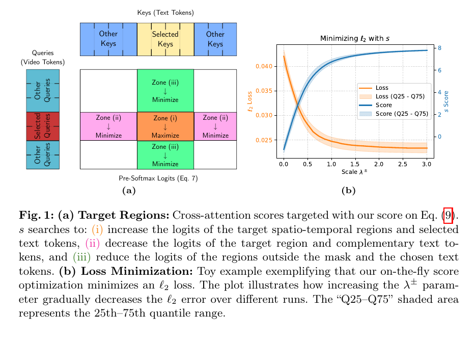
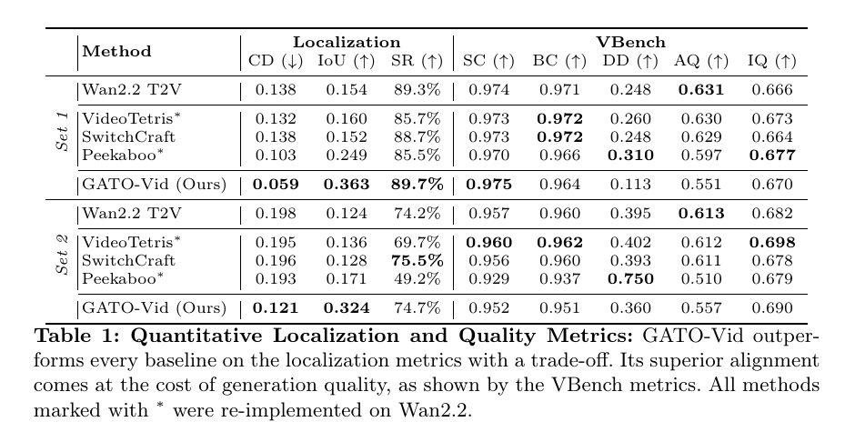
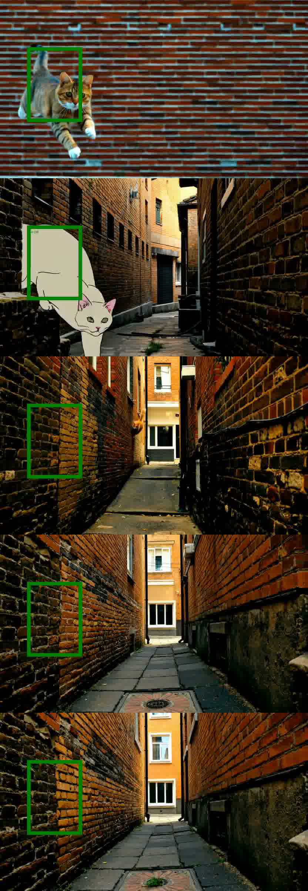

# AI Daily

## 今日精選：GATO-Vid——以解析式、免梯度推理控制影片中的物件位置

**日期：2026-08-19**　　**作者：Manus AI**

> 本日精選論文：**Spatially-Grounded Text-to-Video Generation via Inference-Time Gradient-Free Optimization**。作者把「在影片生成時將指定物件放入指定區域」重新表述為一個可在 cross-attention logit 空間中解析求解的問題，從而以極低的額外成本取代 inference-time backpropagation。論文的正式專案頁標示為 **ECCV 2026**，arXiv v2 發布於 2026-08-14。[1] [2]

## 論文基本資訊

| 欄位 | 內容 |
|---|---|
| 論文標題 | Spatially-Grounded Text-to-Video Generation via Inference-Time Gradient-Free Optimization |
| 中文摘要題 | 以推理時免梯度最佳化實現空間定位的文字轉影片生成 |
| 作者 | Guillaume Jeanneret、Mathis Koroglu、Hugo Caselles-Dupré、Arnaud Dapogny、Matthieu Cord |
| 研究單位 | Sorbonne Université、CNRS/ISIR、Obvious Research、Valeo.ai，Paris |
| 發表資訊 | 官方專案頁標示 ECCV 2026；arXiv:2608.13037v2，2026-08-14 |
| 任務 | Spatially-grounded text-to-video：依照文字與每幀空間約束生成物件軌跡 |
| 基礎模型 | Wan2.2，影片長度 81 frames、解析度 480×832、30 flow-matching steps |
| 關鍵詞 | Training-free、gradient-free、cross-attention modulation、closed-form steering、DiT、zero-shot control |
| 論文與程式碼 | [arXiv HTML][1]、[官方專案頁][2]、[GitHub 程式碼][3] |

### 為什麼今天選它

本次搜尋先排除了 `KaiCobra/AI_Daily` 已經發布的 Scalable EBM、EditMod、Semantic Steering、FreqForcing、SANA-Video 2.0 及其他既有文章。Concept Guidance 是另一篇高度相關的候選，它以 layer skipping 進行 image-level、training-free concept guidance，但 GATO-Vid 更直接命中本週研究偏好的 **training-free、attention modulation、zero-shot/inference-time control**，同時具備明確的閉式解、公開程式碼、ECCV 2026 標示，以及對 VRAM 與延遲的實證比較。[4]

這篇論文值得讀的原因，不只是它「不反向傳播」；更重要的是，它將生成控制從反覆試探的 optimization loop 改寫成**幾何方向的直接注入**。這種轉換為 Energy-based Transformer、JEPA latent critic 與 VAR 的 scale-wise control 提供了一個可移植的設計模式：先定義控制能量或相似度，再直接求解最有利的表示方向，最後將更新投影回模型原有的表示流形。

## 相關研究背景

### 從 flow matching 到 DiT 影片生成

GATO-Vid 建立在 flow-matching 生成器上。令影片 latent 為 $x_t$、文字 token embedding 為 $\tau$，模型輸出速度場 $v_t=f_\theta(x_t,\tau,t)$，再由 flow scheduler 更新 latent：

$$
v_t=f_\theta(x_t,\tau,t),\qquad x_{t+\Delta t}=\operatorname{FlowSch}(x_t,v_t,t).
$$

Flow Matching 以條件向量場學習從簡單分佈到資料分佈的連續運輸路徑，免除傳統 diffusion 對離散噪聲鏈的依賴；其理論與實務已成為 Rectified Flow、SiT 與高解析度 DiT 的重要基礎。[5] [6] 在影片 DiT 中，文字與時空 video tokens 透過 cross-attention 互動；因此，文字 token 對空間位置的影響可以成為不修改模型權重的控制介面。

### 空間 grounding 的既有路線

早期 grounded generation 工作，例如 GLIGEN，通常加入可學習的 grounding module，將區域或框的位置訊息注入生成模型；Spatext、Zero-shot layout conditioning、training-free cross-attention guidance 與 regional prompting 則嘗試在不重新訓練完整 backbone 的前提下控制物件布局。[7] [8] [9] [10] 對影片而言，Peekaboo 以 masked-diffusion 進行互動式影片生成，其他方法也嘗試把 image-level layout control 延伸至影片軌跡。[11]

這些方法的共同觀察是：**cross-attention map 大致承擔文字概念與空間位置的對齊**。然而，對現代大型 DiT 直接計算 attention map loss 並對 latent 反向傳播，會把一次前向生成變成包含完整 backward graph 的昂貴最佳化程序。GATO-Vid 的問題是：能否在不顯式建立完整 attention map、不計算 latent gradient 的情況下，直接找到可改善空間對齊的 query 方向？

## 核心貢獻與創新點

| 貢獻 | 核心意義 |
|---|---|
| Analytical surrogate score | 將 cross-attention 的非線性 softmax 控制，改寫成 pre-softmax logit 的三項線性內積分數。 |
| Closed-form query steering | 對 foreground 與 background 分別推導單位方向 $b^+$、$b^-$，不需要 gradient descent 或多次 trial-and-error。 |
| RMSNorm-aware injection | 將 bias 加回 query 後重新投影到 RMSNorm 產生的 hyper-ellipsoid，降低對原模型表示分佈的破壞。 |
| Foreground/background 雙向控制 | 不只在目標框內提高目標文字注意力，也在框外抑制目標文字，避免物件漂移或重複出現。 |
| Gaussian spatial modulation | 以每幀 bounding box 的 normalized 2D Gaussian 調制 foreground strength，避免框內 attention 變成不自然的均勻平面。 |
| Training-free、gradient-free | 不修改模型權重、不需要額外訓練或外部模型；在 Wan2.2 上額外 runtime 約 0.4%。 |

## 技術方法詳解

### 1. Cross-attention 與傳統 gradient-based guidance

在第 $i$ 個 Transformer block 中，video query、text key 與 text value 分別為 $Q_i\in\mathbb{R}^{THW\times d}$、$K_i\in\mathbb{R}^{|\tau|\times d}$、$V_i\in\mathbb{R}^{|\tau|\times d}$。標準 cross-attention 為

$$
A(Q_i,K_i)=\operatorname{softmax}\left(\frac{Q_iK_i^\top}{\sqrt d}\right),\qquad \operatorname{cross\text{-}attn}(Q_i,K_i,V_i)=A(Q_i,K_i)V_i.
$$

令 $M$ 表示物件在時空體積中的目標區域，$T$ 表示 prompt 中描述該物件的文字 token，$M^c$ 與 $T^c$ 為補集。傳統方法通常先平均所有 block 的 attention map，再以 Dice 或 $\ell_2$ loss 比較 attention 與目標 mask，最後對初始 latent 做

$$
x_t'=x_t-\mu\nabla_{x_t}\ell(\bar A,M,T).
$$

這條路線直觀，但它需要保存大型時空 attention、通過整個生成器反向傳播，對 Wan2.2 這類雙 Transformer 影片模型十分昂貴。[1]

### 2. 由 softmax 改用可解析的 logit surrogate

softmax 的非線性歸一化使得直接求解困難。作者利用一個單調性觀察：若要提升 query $q_j$ 對目標 key $k_l$ 的注意力，可以在 pre-softmax 空間中提升內積 $q_j\cdot k_l$；若要壓低非目標 key，則降低相應內積即可。於是使用

$$
A'(Q,K)=QK^\top
$$

作為 attention 的 proxy，並定義三部分 score：

$$
\begin{aligned}
s={}&\underbrace{\frac{1}{|M||T|}\sum_{j\in M}\sum_{l\in T}q_j\cdot k_l}_{\text{目標區域與目標詞：maximize}}\\
&-\underbrace{\frac{1}{|M||T^c|}\sum_{j\in M}\sum_{l\in T^c}q_j\cdot k_l}_{\text{目標區域與非目標詞：minimize}}\\
&-\underbrace{\frac{1}{|M^c||T|}\sum_{j\in M^c}\sum_{l\in T}q_j\cdot k_l}_{\text{背景區域與目標詞：minimize}}.
\end{aligned}
$$

第一項讓框內 query 靠近目標文字，第二項避免框內被其他文字 key 搶走，第三項則把目標文字從框外背景排除。令區域平均 query 與 token 平均 key 為

$$
\mathcal{Q}(M)=\frac{1}{|M|}\sum_{j\in M}q_j,\qquad \mathcal{K}(T)=\frac{1}{|T|}\sum_{l\in T}k_l,
$$

則 score 可因式分解為

$$
 s=\mathcal{Q}(M)\cdot\bigl(\mathcal{K}(T)-\mathcal{K}(T^c)\bigr)-\mathcal{Q}(M^c)\cdot\mathcal{K}(T).
$$

這個步驟把原本需要顯式建立 $|Q|\times|K|$ attention map 的計算，化成三個向量內積；論文因此主張其控制分數可避免完整 attention map，計算複雜度由 $O(|Q||K|)$ 降到向量級的三次 dot products。[1]

> **圖 1。** 左圖把控制拆成三個區域：框內對目標詞的 logit 增強、框內對其他詞的抑制、框外對目標詞的抑制；右圖顯示提高 steering scale 時，$\ell_2$ localization loss 在 toy experiment 中下降。圖片取自論文 Fig. 1，並以 PDF 局部裁切方式保存。[1]

### 3. Closed-form bias 與 query injection

若把框內與框外的平均 query 分別以單位向量 $b^+$、$b^-$ 取代，score 最大化的方向直接是

$$
 b^+=\frac{\mathcal{K}(T)-\mathcal{K}(T^c)}{\|\mathcal{K}(T)-\mathcal{K}(T^c)\|},
 \qquad
 b^-=-\frac{\mathcal{K}(T)}{\|\mathcal{K}(T)\|}.
$$

其中 $b^+$ 是 foreground 的正向 steering，$b^-$ 是 background 的負向 steering。這是本論文最簡潔也最值得移植的地方：**控制方向不由反向傳播估計，而由 prompt key 的幾何差異直接決定**。

不過，直接把 $q_j$ 替換成 $b^+$ 或 $b^-$，或單純做 $q_j\gets q_j+b^\pm$，會造成 query magnitude 與模型內部分佈不匹配。作者因此讓 bias 按照原 query norm 加權，再以 RMSNorm 對應的尺度重新投影：

$$
q_j\leftarrow
\frac{\sqrt d\,\bigl(\lambda_+\|q_j\|b^++q_j\bigr)}
{\|\bigl(\lambda_+\|q_j\|b^++q_j\bigr)\oslash\gamma\|}
\quad (j\in M),
$$

$$
q_j\leftarrow
\frac{\sqrt d\,\bigl(\lambda_-\|q_j\|b^-+q_j\bigr)}
{\|\bigl(\lambda_-\|q_j\|b^-+q_j\bigr)\oslash\gamma\|}
\quad (j\in M^c),
$$

其中 $\oslash$ 是 element-wise division，$\gamma$ 是 RMSNorm 的可學習尺度向量。對背景 query，作者進一步使用相對於原 query 的正交投影

$$
P(a,b)=a-\frac{a\cdot b}{\|b\|}\frac{b}{\|b\|},
$$

只注入與原 query 正交的 negative component，避免把背景既有語義完全覆蓋。這裡的關鍵不是「加一個更大的 bias」，而是**在不離開原表示流形的前提下改變方向**。

### 4. Gaussian modulation 與推理時機

若在整個 bounding box 內使用相同的 $\lambda_+$，attention 容易變成一個均勻平面，而真實物件的 cross-attention 通常在語義中心較強、邊界較弱。GATO-Vid 對每幀 box 擬合 normalized 2D Gaussian，讓 $\lambda_+$ 隨空間位置變化，在維持局部化的同時保留較自然的物件內部結構。

實作上，作者只在 Wan2.2 Transformer 的前 20 個 blocks 注入 bias，約對應前 15% 的 sampling iterations；$\lambda_\pm$ 初始設定為 1.5 並線性衰減。[1] 這個時間設計也很有啟發性：空間位置在生成早期先確立，後期則盡量把自由度留給原始模型完成紋理與動態細化。

## 實驗設定與性能指標

| 項目 | 設定 |
|---|---|
| Backbone | Wan2.2，單張 NVIDIA H100 80GB |
| 生成設定 | 81 frames、480×832、30 flow-matching steps |
| Set 1 | Gemini 產生 25 個 diverse prompts；每個 prompt 以 Wan2.2 生成 4 個 ground-truth videos，再以 SAM 3 擷取 reference boxes；4 個 random seeds，共 400 videos |
| Set 2 | ChatGPT 產生 100 個 prompts 與 synthetic boxes，涵蓋 linear、spiral、circular、Z/N-shaped trajectories；4 個 seeds，共 400 videos |
| 定位指標 | Center Distance（CD，越低越好）、IoU（越高越好）、Success Rate（SR，越高越好） |
| 品質指標 | VBench 的 Subject Consistency、Background Consistency、Dynamic Degree、Aesthetic Quality、Imaging Quality；均越高越好。[12] |
| 比較方法 | Vanilla Wan2.2、VideoTetris、SwitchCraft、Peekaboo；基線皆調整至 Wan2.2 以公平比較 |

CD 衡量生成物件中心與目標框中心的正規化歐氏距離；IoU 衡量生成物件框與目標框的交集比例；SR 衡量影片中是否成功生成可由 SAM 3 偵測到的目標物件。這種拆分很重要，因為單看 IoU 可能把「根本沒有生成物件」與「有物件但位置偏移」混在一起。

## 實驗結果

### 定位能力：明顯超越既有免訓練基線

下表整理 GATO-Vid 與最具代表性的 baseline。論文完整 Table 1 已另存為圖表資產，讀者可直接對照所有方法與 VBench 欄位。

| Dataset | Method | CD ↓ | IoU ↑ | SR ↑ | SC ↑ | BC ↑ | DD ↑ | AQ ↑ | IQ ↑ |
|---|---|---:|---:|---:|---:|---:|---:|---:|---:|
| Set 1 | Wan2.2 T2V | 0.138 | 0.154 | 89.3% | 0.974 | 0.971 | 0.248 | 0.631 | 0.666 |
| Set 1 | Peekaboo（最佳 baseline IoU） | 0.103 | 0.249 | 85.5% | 0.970 | 0.966 | 0.310 | 0.597 | **0.677** |
| Set 1 | **GATO-Vid** | **0.059** | **0.363** | **89.7%** | **0.975** | 0.964 | 0.113 | 0.551 | 0.670 |
| Set 2 | Wan2.2 T2V | 0.198 | 0.124 | 74.2% | 0.957 | 0.960 | 0.395 | **0.613** | 0.682 |
| Set 2 | SwitchCraft（最佳 baseline SR） | 0.196 | 0.128 | **75.5%** | 0.956 | 0.960 | 0.393 | 0.611 | **0.678** |
| Set 2 | **GATO-Vid** | **0.121** | **0.324** | 74.7% | 0.952 | 0.951 | 0.360 | 0.557 | **0.690** |

在 Set 1，GATO-Vid 將 IoU 從 vanilla Wan2.2 的 0.154 提高至 0.363，CD 從 0.138 降至 0.059；在更困難的 Set 2，IoU 從 0.124 提高至 0.324，CD 從 0.198 降至 0.121。這代表模型不只是更常「生成一個物件」，而是更能把物件放入指定位置。SR 則大致維持與 vanilla 相近：Set 1 為 89.7%，Set 2 為 74.7%。

> **圖 2。** 論文 Table 1 的局部裁切。粗體欄位是各組比較中的最佳值；GATO-Vid 在 localization 指標上最穩定，但 DD/AQ/部分 BC 下降，明確呈現控制強度與生成品質之間的 trade-off。[1]

### 控制品質的代價：更準確，但更靜態、更不美觀

GATO-Vid 的主要弱點也很清楚。Set 1 的 Dynamic Degree 從 vanilla 的 0.248 降至 0.113，Aesthetic Quality 從 0.631 降至 0.551；Set 2 的 DD 從 0.395 降至 0.360，AQ 從 0.613 降至 0.557。作者將其歸因於強迫空間約束造成背景退化與場景動態下降。這不是可以忽略的副作用：若目標是電影式影片生成，單純追求 bounding-box IoU 可能會讓場景變得僵硬。

### 推理成本：免反傳的系統優勢

在 50 次平均推理時間測試中，GATO-Vid 相對 vanilla Wan2.2 的 runtime overhead 僅 **0.4%**；VideoTetris、SwitchCraft、Peekaboo 分別增加 **6.20%、32.80%、92.13%**。相較之下，在 Wan2.2 的其中一個 Transformer 做一次 backpropagation，就會使 inference time 增加 **300.31%**，並增加 **26 GB VRAM**，在僅載入一個 Transformer 的條件下總需求達 59 GB。即使使用 80GB GPU 計算顯式 attention map loss，作者仍遇到 out-of-memory。這使 GATO-Vid 對消費級或受限 VRAM 的 inference-time control 特別有吸引力，但仍應注意影片本身的基礎生成成本並未消失。

### 元件消融：正負方向與流形投影各有作用

論文的 ablation 顯示，移除 ellipsoid projection、Gaussian fitting、foreground bias 或 background bias 都會造成不同程度的定位或品質退化。特別是移除正向或負向 bias 時，localization 指標下降最明顯；這驗證了「框內增強」與「框外抑制」必須同時存在。另一方面，移除 projection 或 Gaussian 對單純 IoU 的影響不一定最大，卻會更明顯傷害 SR、Dynamic Degree、Aesthetic Quality 與 Imaging Quality，說明它們負責的是控制的穩定性與視覺自然度，而不只是位置本身。

## 定性觀察

> **圖 3。** PDF 透過指定圖片資產擷取出的定性案例。綠框表示目標空間區域；這類案例顯示 GATO-Vid 能將貓、兔子或其他物件拉回指定位置，但也可觀察到背景與動態可能因強控制而受影響。[1]

論文 Fig. 2 使用相同 random seed 比較 GATO-Vid、Peekaboo、VideoTetris、SwitchCraft 與 vanilla Wan2.2。作者的觀察是：vanilla、VideoTetris 與 SwitchCraft 維持較自然的畫面，但空間 steering 不足；Peekaboo 的定位較好，卻可能因 hard masking 產生局部 artifact；GATO-Vid 最能把目標物件放進指定區域，但其代價是部分背景品質下降。[1]

## 相關研究分析

| 研究方向 | 代表工作 | 與 GATO-Vid 的關係 | 對後續研究的啟發 |
|---|---|---|---|
| Flow matching | Flow Matching for Generative Modeling | 提供連續向量場與 ODE-like sampling 基礎 | 可把控制 energy 直接寫入速度場或 query geometry，而不是依賴離散 timestep 的反覆 gradient update。[5] |
| Grounded generation | GLIGEN、Spatext | 以 learned grounding 或語義—空間對齊解決布局控制 | GATO-Vid 說明在 frozen backbone 上，仍可用 prompt key 幾何做 inference-time grounding。[7] [8] |
| Training-free layout control | Training-free regional prompting、cross-attention guidance | 以 attention 或 prompt 分區控制圖像生成 | GATO-Vid 將控制從 image attention map 延伸到 video 時空 mask，並以解析 surrogate 避免反傳。[9] [10] |
| Video interaction | Peekaboo | masked-diffusion 透過區域操作控制影片內容 | GATO-Vid 以 foreground/background 雙向 bias 取代硬遮罩，減少額外的 mask-based generation loop，但品質 trade-off 仍存在。[11] |
| Universal guidance | Universal Guidance for Diffusion Models | 將外部可微目標整合進 diffusion sampling | GATO-Vid 的差異是移除 backward pass，將 guidance objective 壓縮為可解析的 key/query 方向。[13] |
| Concept-specific guidance | Concept Guidance | layer-wise mutual information 找到概念相關層，對 T2I 做 training-free guidance | 可與 GATO-Vid 合併：先用 layer relevance 選 block，再用 spatial bias 施加控制，形成 concept-aware spatial steering。[4] |
| 評估 | VBench | 同時評估影片一致性、動態、美學與影像品質 | 提醒我們不能只報 IoU；空間控制方法必須同時報告 DD、AQ、IQ 等副作用。[12] |

GATO-Vid 最接近的研究傳統是 training-free cross-attention guidance，但它的真正區別在於**把一次 inference-time optimization 變成一個閉式幾何操作**。在這個意義下，論文與使用者關注的 Energy-based、JEPA、VAR 並不是同一條文獻線上的直接延續，而是共享「表示空間中的可控方向」這個抽象介面。

## 個人評價與研究意義

### 我認為最有價值的設計：控制方向與模型流形分離

GATO-Vid 並沒有把「要去哪裡」硬編碼成新的網路權重，而是由 prompt keys 建立目標方向，再在 RMSNorm 所定義的表示流形上做小幅、可解釋的 query 偏移。這讓方法保留了三個優點：方向由條件決定、強度可調、原模型仍負責最後的生成細節。這種設計比單純將 attention map 乘上一個 mask 更容易分析，也比較容易移植到其他 token-based generator。

### 對 Energy-based Transformer 的直接想法

可將 GATO-Vid 的三項 score 視為一個局部控制能量的負值。例如定義

$$
E_{\text{spatial}}(q)= -\mathcal{Q}(M)\cdot\bigl(\mathcal{K}(T)-\mathcal{K}(T^c)\bigr)+\mathcal{Q}(M^c)\cdot\mathcal{K}(T).
$$

若模型本身已有 energy $E_\theta(x,t)$，便可以把空間條件寫成

$$
E(x,t)=E_\theta(x,t)+\beta_t E_{\text{spatial}}(x,t).
$$

GATO-Vid 提供的是一個不必計算完整 $\nabla_xE$ 的近似：在 query 子空間中直接取最有利的閉式方向，再做 manifold-preserving projection。值得測試的問題是：這個解析方向是否可以作為 EBM 的 proposal、contrastive negative direction 或 one-step proximal update？如果答案是肯定的，便可把「能量地形控制」從 expensive sampling 轉化為 token-level geometry。

### 對 JEPA 的直接想法

JEPA 的核心是預測 latent，而非直接重建 pixel。若以 V-JEPA 或其他 predictive encoder 產生 target object 的 future latent prototype，可把 $\mathcal{K}(T)$ 替換成一個 predictive target key，把 spatial mask 與未來狀態共同寫入 score：

$$
 s_{\text{JEPA}}=\operatorname{sim}(z_{M}^{\text{pred}},z_{\text{target}})-\operatorname{sim}(z_{M^c}^{\text{pred}},z_{\text{target}}).
$$

在影片長期 rollout 中，這可能比每一幀都依賴文字 token 更穩健：文字負責高層語義，JEPA latent 負責物件身份、運動方向與未來一致性。研究上可以比較 text-key steering、JEPA-key steering 及兩者加權的 drift、ID consistency 與 VBench。

### 對 VAR 與 attention modulation 的直接想法

VAR 不是以 diffusion timestep，而是以 coarse-to-fine scale 逐層預測視覺 token。GATO-Vid 的「早期建立空間位置、後期減弱控制」可改寫成 scale schedule：在 coarse scales 強化 box-level positional energy，在 middle scales 以 source/target key difference 做 residual steering，在 fine scales 只保留低強度 Gaussian modulation。這與 image VAR 的 source-centric editing、attention modulation 和 zero-shot layout control 都可形成交叉實驗。

一個具體的 VAR 版本可以是：對第 $k$ 個尺度的 query $q^{(k)}$，使用

$$
q^{(k)}\leftarrow\Pi_{\mathcal{M}_k}\left(q^{(k)}+\lambda_k b^{(k)}_{\text{spatial}}\right),
\qquad
\lambda_1>\lambda_2>\cdots>\lambda_K,
$$

其中 $\Pi_{\mathcal{M}_k}$ 是該尺度 token normalization manifold 的投影，$b^{(k)}_{\text{spatial}}$ 可由文字、source image 或 JEPA future latent 的 key 差異構成。這個方向可在不重訓整個 VAR 的情況下測試 training-free spatial editing。

### 重要限制與我對結果的保留意見

第一，論文的主要實驗是 Wan2.2 上的 T2V spatial grounding，尚不能直接推論對所有 DiT、T2I 或 autoregressive generator 都同樣有效。第二，兩個 evaluation set 都使用 Gemini/ChatGPT 生成 prompt 或 box，且物件偵測依賴 SAM 3；這使資料具有效率與可擴展性，但仍需要真實影片或人工標註 benchmark 交叉驗證。第三，方法的定位改進伴隨 DD、AQ、BC 的下降，說明「更強 steering」不等於更好的整體生成。第四，Gaussian box 調制與前 20 blocks/前 15% iterations 的設定仍帶有經驗性，跨模型移植時可能需要重新校準。

因此，我不會把 GATO-Vid 解讀成「已解決 controllable video generation」，而是把它視為一個很好的**推理時控制原語**：它證明在合適的 attention geometry 下，許多原本需要反傳的空間控制可以被近似成閉式方向。後續若能將它與 energy regularization、predictive latent、scale-wise VAR 及更嚴格的真實資料 benchmark 結合，研究價值會比單純再增加一個 steering coefficient 更高。

## 可重現性與閱讀重點

若要重現本論文，最值得先驗證的不是完整 81-frame 生成，而是三個逐級實驗。第一，固定一個 cross-attention block，以 Eq. (9) 的三項 score 檢查 $b^+$、$b^-$ 是否確實改善 mask 對齊；第二，分別移除 RMSNorm projection、Gaussian modulation、foreground bias 與 background bias，量測定位與品質的分離影響；第三，在同一個 Wan2.2 sampling setup 中對比 forward-only steering、single-step backprop 與 multi-step backprop 的 VRAM、延遲與 IoU。這樣可把論文的主要 claim 拆解為可診斷的幾何、系統與生成品質問題。

## 總結

GATO-Vid 的核心不是一個複雜的新 backbone，而是一個很清楚的問題重寫：**如果 cross-attention 的 spatial grounding 目標可以在 logit 空間中被線性近似，那麼 inference-time control 就不一定需要 gradient descent。** 作者由此得到 closed-form bias，並透過 RMSNorm-aware projection、foreground/background 雙向控制與 Gaussian spatial modulation，將它穩定地放回 DiT 的 query stream。

就目前證據而言，GATO-Vid 在 Wan2.2 上大幅改善 CD/IoU，runtime overhead 只有 0.4%，但也犧牲一部分動態與美學品質。對 AI 研究者而言，最值得帶走的不是單一數字，而是「**解析控制方向 + 表示流形投影 + 早期強、後期弱的 schedule**」這組可移植原則。它很適合成為 Energy-based Transformer、JEPA predictive steering、VAR scale-wise modulation 以及 zero-shot visual editing 的下一個實驗起點。

## References

[1]: https://arxiv.org/html/2608.13037 "Spatially-Grounded Text-to-Video Generation via Inference-Time Gradient-Free Optimization"
[2]: https://gato-vid.github.io/ "GATO-Vid official project page"
[3]: https://github.com/guillaumejs2403/GATO-Vid "GATO-Vid official code repository"
[4]: https://arxiv.org/html/2608.14172 "Concept Guidance: Precise, Training-Free Latent Control for Text-to-Image Generation"
[5]: https://openreview.net/forum?id=PqvMRDCJT9t "Flow Matching for Generative Modeling"
[6]: https://arxiv.org/abs/2403.03206 "Scaling Rectified Flow Transformers for High-Resolution Image Synthesis"
[7]: https://arxiv.org/abs/2301.07093 "GLIGEN: Open-Set Grounded Text-to-Image Generation"
[8]: https://arxiv.org/abs/2211.14305 "SpaText: Spatio-Textual Representation for Controllable Image Generation"
[9]: https://arxiv.org/abs/2304.03373 "Training-Free Layout Control with Cross-Attention Guidance"
[10]: https://arxiv.org/abs/2411.02395 "Training-Free Regional Prompting for Diffusion Transformers"
[11]: https://arxiv.org/abs/2312.07509 "Peekaboo: Interactive Video Generation via Masked-Diffusion"
[12]: https://arxiv.org/abs/2311.17982 "VBench: Comprehensive Benchmark Suite for Video Generative Models"
[13]: https://arxiv.org/abs/2302.12131 "Universal Guidance for Diffusion Models"
