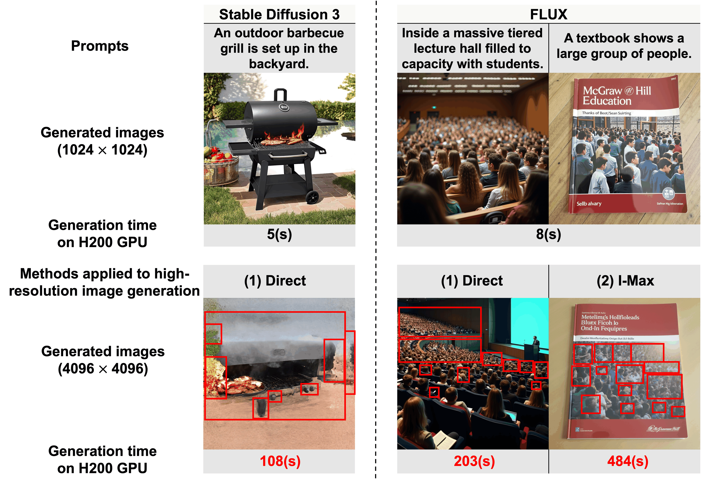
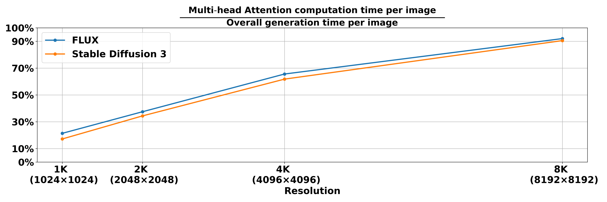
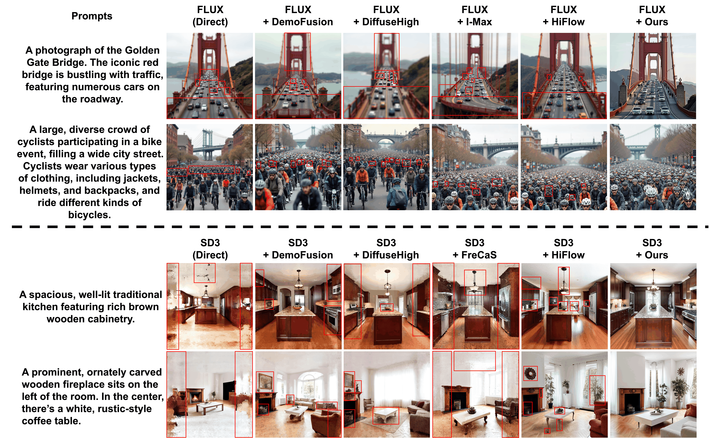

# AI Daily — 2026-08-10

## HRDiT: Training-Free High-Resolution Image Generation with Off-the-Shelf Diffusion Transformer Models

**論文基本資訊**
- **標題**: HRDiT: Training-Free High-Resolution Image Generation with Off-the-Shelf Diffusion Transformer Models
- **作者**: Yu Xue, Haoxuan Qu, Zhuoling Li, Hongbin Xu, Jianxiong Yin, Simon See, Hossein Rahmani, Jun Liu
- **研究單位**: Lancaster University, South China University of Technology, NVIDIA AI Tech Centre
- **發表會議**: ECCV 2026
- **論文連結**: [arXiv:2608.07003](https://arxiv.org/abs/2608.07003)

---

### 1. 論文核心貢獻和創新點

隨著 Diffusion Transformer (DiT) 架構（如 FLUX、Stable Diffusion 3）在文本到圖像生成領域展現出超越傳統 U-Net 的強大性能，如何將這些在低解析度（如 $1024 \times 1024$）預訓練的現成（off-the-shelf）DiT 模型，在**免訓練（Training-Free）**的情況下擴展至高解析度（如 4K、8K）生成，成為一個重要且具挑戰性的課題。

本論文指出了現有免訓練方法在應用於 DiT 模型時面臨的兩大關鍵挑戰：
1. **空間混亂（Spatial Disorder）**：直接生成高解析度圖像會導致物體重複、結構破碎等空間不連貫問題。
2. **生成時間過長（Long Generation Time）**：由於注意力機制的二次方複雜度，高解析度下的多頭注意力計算佔據了超過 90% 的生成時間。

針對這兩大痛點，作者提出了 **HRDiT** 框架，其核心創新包含兩個即插即用的模組：
- **空間位置對齊（Spatial Position Alignment, SPA）**：透過 Bundle 和 Slide 操作，重新調整位置編碼機制的輸入，恢復高解析度下的空間辨識能力。
- **自適應頭部注意力剪枝（Head-adaptive Attention Pruning, HAP）**：利用泰勒展開式在單次前向傳播中估估計各注意力頭的最佳局部窗口大小，在不損失品質的前提下大幅削減冗餘計算。

*圖 1：直接將現成 DiT 模型擴展至高解析度（4K）時，會面臨嚴重的空間混亂與生成時間過長問題。*

---

### 2. 技術方法簡述

#### 2.1 空間位置對齊 (Spatial Position Alignment, SPA)
作者透過偽維度（pseudo-dimension）理論分析指出，空間混亂的根源在於高解析度下 Token 數量 $T$ 劇增，導致位置編碼機制無法有效區分所有成對的位置信號（Pairwise positional signals）。

為了解決此問題，SPA 提出了兩種互補的 Token 索引操作：
1. **Bundle 操作**：將相鄰的 Token 索引分組為一個個 Bundle，並將 Bundle 索引而非原始 Token 索引輸入至位置函數 $f_{pe}$ 中。這降低了輸入的多樣性，使得模型能更好地維持宏觀的空間秩序。
2. **Slide 操作**：單純的 Bundle 會抹除同一組內 Token 的位置差異。Slide 操作透過改變第一個 Bundle 的大小 $N_1$（從 $1$ 變動至 $N$），建立 $N$ 種邊界滑動的映射函數 $\phi_{bundle}^{(N_1=n)}$。

最終的注意力貢獻 $\mathbf{c^{SPA}_{i,j}}$ 是 $N$ 種滑動映射下計算結果的平均值：
$$ \mathbf{c^{SPA}_{i,j}} = \frac{1}{N} \sum_{n=1}^{N} g\left(\mathbf{x_i}, \mathbf{x_j}, f_{pe}\left(\phi_{bundle}^{(N_1=n)}(i), \phi_{bundle}^{(N_1=n)}(j)\right)\right) $$
這種設計在免訓練的前提下，既恢復了全局的空間秩序，又保留了細粒度的局部辨識能力。

#### 2.2 自適應頭部注意力剪枝 (Head-adaptive Attention Pruning, HAP)
在高解析度下，注意力機制的計算時間呈指數級增長（見圖 2）。HAP 的目標是為每個注意力頭分配最適合的局部窗口大小（Attention Scope），以剔除冗餘計算。

*圖 2：隨著解析度提升，多頭注意力計算時間佔據了整體生成時間的絕大部分。*

HAP 包含兩個準備步驟（僅需在推理前執行一次）：
1. **候選窗口適應度量化**：利用泰勒展開式（Taylor expansion），只需一次完整注意力範圍的模型前向傳播，即可估算出採用特定縮減窗口對最終生成損失 $L$ 造成的品質下降 $I_q$：
   $$ I_q(n_{\text{head}}, n_{\text{scope}}) \approx \sum_{(u,v) \in S_{\text{omit}}} \left( \frac{\partial L}{\partial A(u,v)} (-A(u,v)) + \dots \right) $$
2. **最佳窗口分配**：將問題轉化為在給定計算量預算 $r_c$ 下，最小化整體品質下降的整數規劃問題，並使用線性求解器（如 Gurobi）快速求解。

---

### 3. 實驗結果和性能指標

HRDiT 在 FLUX 和 Stable Diffusion 3 (SD3) 上進行了廣泛的測試，涵蓋 2K、4K 甚至 8K 解析度。

- **生成品質**：在 4K 解析度下，搭載 HRDiT 的 FLUX 達到了 **FID 64.91**，大幅優於直接擴展的 75.68 以及現有最佳方法 DemoFusion (71.18) 和 I-Max (70.11)。
- **生成速度**：在 NVIDIA H200 GPU 上生成 4K 圖像，HRDiT 將 FLUX 的推理時間從 203 秒縮短至 **116 秒**；SD3 則從 108 秒縮短至 **58 秒**。
- **8K 極限生成**：在 8K 解析度下，HRDiT 展現出驚人的擴展性，FLUX 的生成時間從 1708 秒銳減至 827 秒，同時 FID 從 78.47 降至 65.73。

*圖 3：與其他 SOTA 免訓練方法相比，HRDiT 在高解析度下能生成空間結構更合理、細節更豐富的圖像。*

---

### 4. 相關研究背景

免訓練高解析度圖像生成（Training-free Text-to-high-resolution Image Generation）近期備受關注。早期的方法主要針對 U-Net 架構：
- **ScaleCrafter**：透過空洞卷積（Dilation）擴大感受野。
- **FreeScale**：結合受限空洞卷積與多尺度融合。
- **DemoFusion** / **DiffuseHigh**：著重於修改擴散過程的採樣策略。

隨著 DiT 成為新一代主流，針對 DiT 的免訓練擴展方法開始萌芽（如 I-Max），但仍未能有效解決位置編碼在高解析度下失效（導致空間混亂）以及 Transformer 注意力計算量爆炸的問題。HRDiT 是首批深入 DiT 內部機制（位置編碼與注意力頭分工）來解決這兩大痛點的先驅研究之一。

---

### 5. 個人評價和意義

**啟發與思考：**
1. **理論與實踐的完美結合**：這篇論文最讓我驚豔的是其對 Spatial Disorder 的根源分析。作者沒有盲目設計 heuristic 的模塊，而是借用 pseudo-dimension 理論，數學化地證明了高解析度下位置信號多樣性超出模型表達能力上限的問題，進而推導出 Bundle + Slide 這種優雅的解法。
2. **Training-free 的極致發揮**：在無法微調模型權重的前提下，HAP 模組利用單次前向傳播的梯度（Taylor expansion）來評估各個 Attention Head 的重要性，並將資源分配轉化為整數規劃問題。這種將模型內部「知識」提取出來進行自我調控（Self-modulation）的思路，對於我們探索 Zero-shot 或 Training-free 的視覺生成/編輯任務極具啟發性。
3. **對未來研究的指引**：近期我特別關注 Energy-based models、VAR 以及 Attention modulation。HRDiT 的 HAP 模組本質上就是一種高效的 Attention modulation。這提示我們，與其將注意力視為一個黑盒子，不如將其拆解為不同頻率/感受野的專家（Experts），在推理階段根據需求進行動態路由或剪枝，這可能是未來實現即時（Real-time）高解析度生成的關鍵。

這項來自 NVIDIA 和 Lancaster University 的 ECCV 2026 研究，無疑為 DiT 時代的高解析度生成立下了一個堅實的 baseline。
