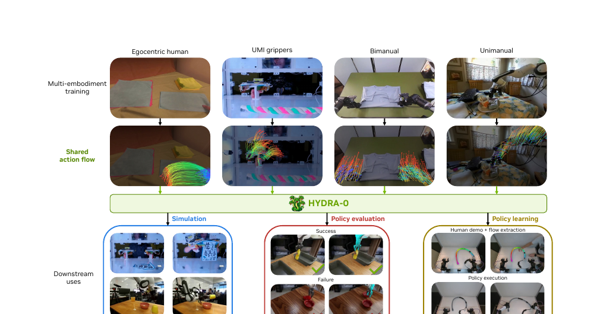
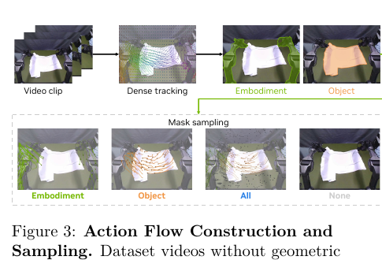
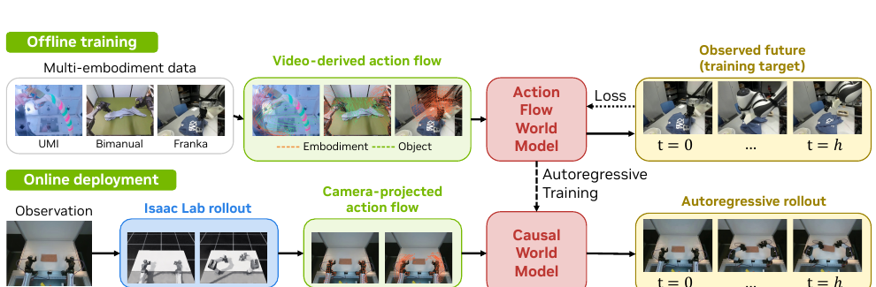

# AI Daily

> **研究日期：** 2026-08-21　　**整理：** Manus AI　　**主題：** Action Flow、視覺世界模型、影片生成、跨 embodiment transfer、zero-shot control

## Hydra-0：Action Flow for Generalist World Modeling and Control

## 一、論文基本資訊

| 欄位 | 內容 |
|---|---|
| 論文標題 | *Hydra-0: Action Flow for Generalist World Modeling and Control* |
| 作者 | Hongyu Li、Bowen Wen、Xinghao Zhu、Yixuan Wang、Yilun Du、Yunzhu Li、George Konidaris、Stan Birchfield、Soha Pouya、Chenran Li、Yan Chang |
| 研究單位 | NVIDIA、Brown University、Columbia University、Harvard University |
| 發表狀態 | arXiv:2608.18077v1；2026-08-18；目前為預印本，論文頁面未標示已接收的會議或期刊 |
| 論文頁面 | [arXiv HTML][1]／[arXiv abstract][2]／[PDF][3] |
| 官方專案頁 | [NVIDIA Isaac Hydra-0 project page][4] |
| 研究任務 | 多 embodiment 視覺世界模型、action-conditioned video generation、open-loop policy evaluation、inverse robot control |
| 主要結果 | 相對 action-conditioned baseline，robot-motion error 降低 90.4%、object-motion error 降低 60.2%；RoboLab replayed/reference success rates 的 Pearson correlation 為 $r=0.96$ |

Hydra-0 是本日從近期 arXiv 與 Hugging Face Papers Trending 線索中篩選出的新研究。repository 已經收錄 EBT、Scalable EBM、UniJEPA、LeJEPA、VAR 與多篇 training-free attention modulation，因此本次刻意排除同題重複工作，選擇一篇把**視覺生成、世界模型、跨 embodiment 控制與 zero-shot transfer** 接在同一個介面上的論文。論文雖然屬於 robotics 類別而不是純圖像生成，但其核心模型直接建立在 Cosmos 2.5 與 Wan2.2 等影片生成 backbone 上，並把 robot command 轉成可被生成模型理解的 pixel motion。[1] [3]

本報告中的圖片只擷取論文 PDF 內的 Figure 1–3 局部圖示，沒有使用整個瀏覽器畫面；圖像經 PDF image extraction workflow 與頁面局部裁切後，放置於 repository 的 `asset/` 資料夾。

## 二、為什麼值得讀：把 Robot Action 改寫成視覺語言

傳統 action-conditioned world model 通常直接把 joint-space command 或 end-effector command 餵給模型。這種表示方式把 robot embodiment 的機械結構綁進條件空間：相同的末端執行器命令，在不同機械臂上可能對應完全不同的 joint trajectory、link motion 與影像結果。模型因此必須額外學習「native action space → visible motion」的 embodiment-specific mapping，跨機器人資料難以共享。[1]

Hydra-0 的反轉是：不讓模型先理解每一種機器人的控制座標，而是把 action 轉成**觀測平面上的稀疏軌跡與可見性**。一條 action flow 只描述「畫面中可見的 robot surface point 或 object point 要往哪裡移動」，因此 human hand、單臂、雙臂、UMI gripper 都能被投影到同一種 pixel-aligned interface。NVIDIA 官方頁面更將整體系統描述為 hybrid simulator：physics engine 負責把命令轉成 robot motion，learned video model 則預測世界如何回應。[4]

> **核心觀念：** Hydra-0 不直接學習每個 embodiment 的 action semantics，而是學習「某個可執行 motion 在視覺世界中會造成什麼後果」。

Figure 1 將方法的研究視角濃縮成三層：多種 interaction data 先被轉成共同的 shared action flow；接著由 Hydra-0 學習視覺動力；最後同一介面可以用於 forward simulation、open-loop policy evaluation，以及從人類示範的 object flow 反推出 robot action 的 inverse control。[1]

## 三、核心貢獻與創新點

### 3.1 Kinematically grounded action flow

論文把 action flow 定義為 camera-plane trajectory set，而不是單一的 command vector。這使得 training-time 的 video-only tracker 與 deployment-time 的 robot controller/physics rollout 可以產生相同格式的條件，前者不需要 privileged robot metadata，後者又能保留 command 的可執行性。

### 3.2 同一條介面支援 forward 與 inverse

在 forward mode，模型接受由 candidate robot command 產生的 gripper/embodiment flow，預測該命令造成的未來影片；在 inverse mode，模型只接受 desired object flow，從 latent dynamics 中推導相容的 robot motion，再由輕量 action head 轉成 executable action。這讓 task specification 可以由 object motion 表達，而不必從另一個 embodiment 的 expert robot demonstration 重新學一套控制策略。[1] [4]

### 3.3 從 bidirectional video model 轉成 causal world model

Hydra-0 不是只展示一個單次 video prediction adapter，而是把完整 horizon 拆成 temporal chunks，利用先前生成的 clean history 與 KV cache 做 autoregressive rollout。再以 DMD2-style few-step distillation 把每個 chunk 壓到四個 denoising steps，讓視覺世界模型具備更接近 real-time robotics deployment 的速度。

### 3.4 多 embodiment mid-training 具備 data-efficient transfer

作者以七個來源組成跨 embodiment corpus，包含 single-arm、bimanual arms、human hands 與 handheld grippers。這個中間訓練階段的目的不是把資料混在一起而已，而是把 motion condition 統一到 image plane，使新 task 在尚未看到 target-task data 時仍可繼承其它 embodiment 的 interaction dynamics。[1]

## 四、技術方法與數學細節

### 4.1 Action flow 的表示

令預測 horizon 為 $H$，追蹤 $N$ 個 visible points。第 $n$ 個點在時間 $t$ 的影像平面位置與可見性分別為

$$
\mathbf{x}_{n,t}=(u_{n,t},v_{n,t}),\qquad m_{n,t}\in\{0,1\}.
$$

Hydra-0 將 action flow 寫成

$$
\mathcal{F}=\{\tau_n\}_{n=1}^{N},\qquad
\tau_n=\{(\mathbf{x}_{n,t},m_{n,t})\}_{t=0}^{H}.
$$

其中 $m_{n,t}=0$ 表示點在該時間不可見或投影無效。這個 visibility label 很重要：如果 trajectory 在 source frame 或 destination frame 沒有可靠的可見位置，該點不應該在 feature propagation 中提供錯誤條件。

### 4.2 Geometry-aware route：由 command 投影到 camera plane

當 robot geometry 與 camera calibration 可用時，Isaac Lab 先執行 candidate command，得到每一個時間點的 robot configuration $\\mathbf q_t$ 與 link transform。令 $\overline{\mathbf X}_n$ 是位於 robot link $\ell(n)$ 座標系中的 homogeneous surface point，camera intrinsics 為 $\mathbf K$，extrinsics 為 $\mathbf T_{CW}$，則其 camera-plane projection 為

$$
\mathbf{x}_{n,t}
=\pi\left(\mathbf K
\begin{bmatrix}
\mathbf I_3 & \mathbf 0
\end{bmatrix}
\mathbf T_{CW}
\mathbf T_{\ell(n)}(\mathbf q_t)
\overline{\mathbf X}_n\right).
$$

只有當 projected point 具有正 camera depth、位於 image bounds 內，且與 rendered depth buffer 在容許誤差內一致時，才令 $m_{n,t}=1$。因此，action flow 不是任意 user-drawn trajectory，而是由 controller、physics、robot geometry 與 camera calibration 共同約束的**可執行視覺條件**。

### 4.3 Video-only route 與四種 sampling mode

大量 interaction video 沒有 robot description file 或 camera calibration。對這類資料，Hydra-0 使用 dense flow tracker 取得 image-plane trajectories，再用 grounded mask 把 tracks 分成 embodiment、manipulated object 或 unassigned scene tracks，從而建構同一種 $\mathcal F$。在訓練時，作者以四種 mode 隨機取樣：Embodiment、Object、All 與 None。前兩者分別強化 robot motion 與 desired object motion；All 是 grounding 不完整時的 fallback；None 則是 conditioning dropout，使模型仍能使用 text/image context 進行預測。[1]

### 4.4 Motion feature propagation

首先把 initial encoded state $\mathbf s_0=e_\phi(\mathbf o_0)$ 中的 source feature 以 bilinear sampling 取出：

$$
\mathbf h_n=\mathbf s_0(\widetilde{\mathbf x}_{n,0}).
$$

對 latent time $k$ 與 normalized latent-grid location $\widetilde{\mathbf p}$，作者用 Gaussian locality 將 source appearance 沿 trajectory 傳到未來位置：

$$
M_k(\widetilde{\mathbf p})
=\sum_{n\in\mathcal N_K(\widetilde{\mathbf p},k)}
\widetilde w_{n,k}(\widetilde{\mathbf p})\mathbf h_n,
$$

$$
\widetilde w_{n,k}(\widetilde{\mathbf p})
=\widetilde m_{n,0}\widetilde m_{n,k}
\exp\left(-\beta\left\|\widetilde{\mathbf p}-\widetilde{\mathbf x}_{n,k}\right\|_2^2\right).
$$

其中 $\mathcal N_K$ 只保留 Gaussian weight 最大的 $K$ 條 trajectory，$\beta$ 是 locality 的 inverse-temperature。除此之外，模型計算 presence gate：

$$
 g_k(\widetilde{\mathbf p})
=\operatorname{clip}_{[0,1]}
\left(\sum_{n\in\mathcal N_K(\widetilde{\mathbf p},k)}
\widetilde w_{n,k}(\widetilde{\mathbf p})\right).
$$

完整的 motion condition 是 $C_{\mathrm{motion}}=(M,g)$。$M$ 提供沿軌跡傳播的 appearance feature，而 $g$ 告訴 backbone 這個位置是否真的受到 trajectory condition 影響，避免模型把未被 action flow 覆蓋的 background 當成 motion evidence。

### 4.5 Flow-matching video prediction

令 $Z_t$ 是 diffusion time $t$ 的 noised target-video latent，$c$ 是 pretrained text-and-image context，$v_t^\star$ 是 flow-matching target velocity。Hydra-0 在 motion condition 下最小化標準 flow-matching objective：

$$
\mathcal L(\theta)
=\mathbb E_{\mathbf o_0:H,\mathcal F,t,\epsilon}
\left[
\left\|
 v_\theta(Z_t,t,c,C_{\mathrm{motion}})-v_t^\star
\right\|_2^2
\right].
$$

作者凍結 pretrained video backbone，只訓練 DiT patch embedding，以及 rank-64 LoRA；LoRA 套用到 $Q/K/V/O$ attention projections 與兩個 feed-forward projections。這個設計把 Hydra-0 定位成「視覺條件介面與 parameter-efficient adaptation」，而不是重新訓練一個完整 video generator。

### 4.6 Causal autoregressive rollout

完整 horizon 的 bidirectional denoising 需要一次處理所有 future latent，推理時會反覆支付 full-window cost。Hydra-0 將 latent sequence 拆成 chunks $\mathcal C_1,\ldots,\mathcal C_J$，並以 causal factorization 表示：

$$
 p_\theta(\mathbf s_{1:H}\mid\mathbf s_0,C_{\mathrm{motion}})
 =\prod_{j=1}^{J}
 p_\theta\left(
 \mathbf s_{\mathcal C_j}
 \mid \mathbf s_{\mathcal C_{<j}},\mathbf s_0,
 C_{\mathrm{motion}},\mathcal C_j
 \right).
$$

生成 chunk 會取代 clean history，並透過 KV cache 重複使用。關鍵實作是：$C_{\mathrm{motion}}$ 先在完整 window 座標中計算，再按 absolute chunk offset 切片，而不是在每個 chunk 重新把 trajectory anchor 到局部起點。這個細節直接避免長期 rollout 中的 action-flow drift。

### 4.7 Inverse world action model

在 inverse mode，輸入是 desired object flow $\mathcal F_{obj}$，而不是 embodiment/gripper flow。模型的 clean DiT token features 經過 mean-pooled 與 single-query attention-pooled spatial tokens，接上 layer normalization 與兩層 GELU MLP，分別輸出 action 與 state。訓練目標為

$$
\mathcal L_{\mathrm{WAM}}
=\mathcal L_{\mathrm{flow}}
+\lambda_h\left(
\mathcal L_{\mathrm{act}}+\mathcal L_{\mathrm{state}}
+\lambda_v\mathcal L_{\mathrm{vel}}
\right),
$$

其中 $\mathcal L_{\mathrm{act}}$ 與 $\mathcal L_{\mathrm{state}}$ 是 normalized per-dimension masked Huber loss，$\mathcal L_{\mathrm{vel}}$ 是連續 action difference 的 masked $L_1$ loss，作者使用 $\lambda_h=\lambda_v=0.1$。值得注意的是，state head 只提供 auxiliary supervision，不會 feedback 回 video model；部署時也直接從 denoised latent block 的 transformer features 讀出 action，不必先 decode 成 pixel。

## 五、資料、實驗設計與性能

### 5.1 Multi-embodiment corpus

| 資料來源 | Embodiment | Filtering 後 windows | 時數 |
|---|---|---:|---:|
| DROID | single arm | 223,075 | 313.7 |
| ABC-130k | bimanual arms | 1,048,681 | 1,474.7 |
| MolmoAct2 | bimanual arms | 126,335 | 177.7 |
| EgoDex | human hands | 89,380 | 125.7 |
| Deform360 | handheld grippers | 60,315 | 84.8 |
| XVLA-Soft-Fold | bimanual arms | 17,772 | 25.0 |
| H1-Fold-Clothes | bimanual arms | 76 | 0.1 |
| **合計** | — | **1,565,634** | **2,201.7** |

每個 window 為 81 frames，重採樣至 480p、16 fps。主要研究範圍是 cloth、cable、rope、bag 與 paper 等 deformable-object interaction。模型以 Cosmos 2.5 2B、Wan2.2 TI2V-5B 與 Wan2.2 I2V-A14B 作為 video backbones；Wan2.2 I2V-A14B 的 multi-embodiment mid-training 使用 32 張 H100、40,000 steps、約五天。[1]

### 5.2 五個 validation sets 的平均結果

下表是 Table 2 的 Average block。PSNR、SSIM 越高越好；object/gripper endpoint error、FID、FVD 越低越好；VLM 是 1–5 分數。這裡保留論文的 point estimates，不將其誤寫成統計顯著性結論。[1]

| 模型 | PSNR ↑ | SSIM ↑ | Obj. EPE ↓ | Grip. EPE ↓ | FID ↓ | FVD ↓ | VLM ↑ |
|---|---:|---:|---:|---:|---:|---:|---:|
| ATI | 17.01 | 0.700 | 23.19 | 4.62 | 36.4 | 444.2 | 3.14 |
| Wan-Move | 16.35 | 0.688 | 21.53 | 4.67 | 34.4 | 408.3 | 3.71 |
| Hydra Cosmos 2.5 2B | 18.41 | 0.725 | 6.27 | 13.80 | 32.4 | 277.4 | 3.83 |
| Hydra Wan2.2 5B | 19.64 | 0.770 | 6.61 | 3.88 | 24.1 | 248.8 | 3.90 |
| Hydra Wan2.2 A14B | 20.76 | 0.805 | 6.00 | 3.83 | 20.7 | 193.7 | 3.98 |
| **Hydra Wan2.2 A14B 4-step** | **21.84** | **0.830** | **5.27** | **3.29** | **18.7** | **155.9** | **4.23** |

在同一 Cosmos 2.5 backbone 內，將 native relative 6D end-effector action 換成 action flow 後，Hydra 版本在五個 validation sets 的 PSNR、SSIM、gripper-flow EPE、FID、FVD，以及有可靠 object mask 的資料集之 object-flow EPE，皆取得更好的 displayed point estimates。這個 controlled comparison 支持「image-space actionable flow 比 native 6D action 更容易被影片生成模型理解」的論點。[1]

不過 VLM score 並非所有設定都同步改善。作者明確指出，VLM 評估同時混合 physical plausibility、temporal consistency、object permanence 與 motion realism，而 flow EPE 則直接測量 trajectory following，因此兩者可能出現 trade-off。這也是為什麼 Hydra-0 的核心證據應以 motion error、FVD、cross-backbone transfer 與 policy correlation 一起閱讀，不能只挑單一視覺品質指標。

### 5.3 Data-efficient transfer

在六個 Interactive World Simulator task 上，multi-embodiment mid-training 的 Hydra variant 在 0% target-task adaptation 已比只從 pretrained Wan2.2 初始化的 variant 取得更好的 LPIPS、object-flow EPE 與 FVD point estimates。當 target-task data 增加到 20% 後，多數收益已接近平台；從 20% 增加到 100%，每個 task 的 LPIPS、flow EPE、FVD 變化上限分別約為 3.4%、6.7%、6.8%。作者同時提醒 FVD 每個點只由 40 clips 估計，且存在高 variance，因此這項結果應被視為 data-efficiency evidence，而非嚴格的 scaling law。[1]

### 5.4 推理速度

| 階段 | 時間 / clip | FPS | 相對 bidirectional teacher |
|---|---:|---:|---:|
| Bidirectional teacher，50 steps | 20.92 s | 3.87 | 1.0× |
| Causal autoregressive teacher | 12.48 s | 6.49 | 1.68× |
| Few-step student，4 steps | 1.31 s | 61.98 | 16.0× |

測試環境為單張 80 GB H100、bfloat16、batch size 1，生成 81 frames、480×832；guidance 與 VAE decoding 均排除在計時之外。因此 16× 是**generation-only speedup**，不是完整端到端 latency。這個評估口徑反而是優點：論文沒有把 VAE、guidance 與資料搬移時間隱藏在模糊的 throughput 宣稱中。[1]

### 5.5 Open-loop policy evaluation 與 inverse control

在 RoboLab，Hydra-0 對五個 pretrained policies、六個 tasks、共 300 episodes 做 open-loop replay。模型接收 recorded robot end-effector trajectory 產生 action flow，而 policy 不會在 generated observations 上重新執行；因此測量的是 learned simulator 能否保留已知 episode outcome，不是「模型預測一個尚未執行的 policy command 是否成功」。結果為 Pearson $r=0.96$、Spearman $\rho=0.93$、success-rate MAE 5.7 percentage points，並重現五個 policies 的 task-level ranking。[1] [4]

Inverse control 則從一段 held-out human demonstration 抽取 desired object flow，排除 embodiment flow，讓 Hydra-0 預測相容的 robot motion，再以 action-output head 在 flexible-pipe-bending task 上輸出 executable actions。這是一個很有啟發性的 proof of concept，但不是完整的 closed-loop general-purpose robot policy；論文也承認目前的 grasp precision、depth awareness 與 contact-state disambiguation 仍有限。

## 六、相關研究分析

| 研究 | 主要條件表示 | 是否直接改動 backbone | Hydra-0 的差異 |
|---|---|---|---|
| **ATI** [5] | 使用者指定的 sparse/dense point trajectories | 以 lightweight motion injector 投影到 latent | Hydra-0 把 trajectory 綁定到 executable command、robot geometry 與 camera calibration，並支援 cross-embodiment training |
| **Wan-Move** [6] | dense object trajectories，將第一幀 feature 沿軌跡傳播 | 不增加 auxiliary motion encoder，直接更新 I2V condition | Hydra-0 沿用 latent trajectory propagation，但加入 visibility-aware robot surface tracks、multi-embodiment mid-training 與 inverse world-action mode |
| **DINO-WM** [7] | pretrained visual features 的 latent dynamics | 以 latent prediction 支援 zero-shot planning | Hydra-0 以可視化 video generation 為主，能做 open-loop simulator 與 real-robot proof of concept，但目前未提供同等的 closed-loop planning 證據 |
| **LongLive-2.0** [8] | causal chunks、sequence-parallel AR training、NVFP4 | 系統/訓練與推理基礎設施優化 | Hydra-0 借用 AR conversion + KV cache 的 rollout 邏輯，再將 motion condition 按 absolute offset slicing，並以 DMD2 做 4-step student |
| **Motion Prompting** [9] | motion trajectories 作為 video condition | trajectory-conditioned generation | Hydra-0 將一般 motion prompt 推進到 kinematically grounded、可執行且可反向讀出 action 的介面 |

ATI 的重要貢獻是把 camera、object 與 local motion 統一成 trajectory-based condition；Wan-Move 則證明將第一幀 appearance feature 沿 latent trajectory 傳播，可以在不增加專門 motion encoder 的情況下擴展到大型 I2V backbone。[5] [6] Hydra-0 的新意不在單獨重新發明 Gaussian propagation，而在於把這個視覺控制原語與 robot command、physics rollout、跨 embodiment data mixture 以及 inverse action readout 接成一個閉合的接口。

與 latent-only 的 JEPA/DINO-WM 路線比較，Hydra-0 的優勢是 generated future 可被人直接檢查，因此適合 policy evaluation、failure visualization 與 human-in-the-loop debugging；代價則是要支付 video latent prediction 與解碼成本，且目前只做 open-loop evaluation。這種互補性很值得注意：未來可以由 JEPA latent 負責長期 prediction/planning，再以 Hydra-style video decoder 只在需要解釋或驗證時生成像素。[7]

與 LongLive-2.0 的關係則主要在 causal rollout，而非條件建模。LongLive-2.0 著重 NVFP4、Balanced SP、quantized KV cache 與 asynchronous VAE decoding，摘要報告最高 2.15× training、1.84× inference speedup，5B 模型達 45.7 FPS；Hydra-0 則把 chunking 的主要風險放在 action-flow alignment，必須避免每個 chunk 重新 anchor trajectory。[8] 兩者可以組成互補的系統研究問題：action semantics 由 flow interface 統一，long-context throughput 由 NVFP4/SP infrastructure 支撐。

## 七、個人評價與研究意義

### 7.1 我認為最重要的洞見

Hydra-0 最有價值的地方不是「用 flow 來控制影片」這句話本身，而是它把**任務意圖、embodiment 執行、視覺結果**拆成三個可以重新組合的對象。Object flow 可以作為 task intent；camera-projected embodiment flow 連接 physics command 與 visual dynamics；latent action head 再把 visual dynamics 轉回 robot action。這種分解讓 heterogeneous data 不必共享 joint-space semantics，卻仍能共享 consequence modeling。

### 7.2 對 Energy-based Transformer 的啟發

可以將 action compatibility 改寫成 energy function，而不是只用單一 conditional likelihood。令 $z_{0:H}$ 是 latent rollout、$\mathcal F_{obj}^{\star}$ 是 desired object flow、$\widehat{\mathcal F}_{obj}(z)$ 是從生成 latent 解碼或 tracker 取得的 predicted object flow，則可以定義

$$
E_\phi(z_{0:H},\mathcal F^{\star}_{obj})
=\lambda_{flow}D\left(\widehat{\mathcal F}_{obj}(z),\mathcal F^{\star}_{obj}\right)
+\lambda_{dyn}E_{dyn}(z)
+\lambda_{contact}E_{contact}(z).
$$

第一項保證 desired motion 的一致性，第二項懲罰不符合 learned physical dynamics 的 latent transition，第三項則約束 grasp/contact 的可行性。如此一來，Energy-based Transformer 可以在多個 candidate action flows 之間做 inference-time reranking，或以低成本 energy gradient 修正 action-flow condition。這不是 Hydra-0 已完成的功能，而是由其 forward/inverse duality 自然導出的研究接口。

### 7.3 對 JEPA 與 latent world model 的啟發

Hydra-0 的 action flow 可以直接作為 JEPA predictor 的 action token 或 spatially grounded target。與其要求 JEPA 直接重建 pixel，不妨預測下一時刻的 latent state 與 flow-induced displacement：

$$
\widehat z_{t+1}=g_\theta(z_t,\mathcal F_t),
\qquad
\mathcal L_{JEPA}=\left\|\widehat z_{t+1}-\operatorname{sg}(z_{t+1})\right\|_2^2
+\lambda_{flow}\mathcal L_{disp}.
$$

這會把「latent predictive representation」與「可觀測、可執行的 motion coordinate」接起來。相較只做 forward prediction，額外的 flow displacement loss 能迫使 latent 保留對 planning 真正有用的 physical state change；相較純 pixel world model，它又可以把長期 rollout 留在低維 latent space，只有在需要 policy evaluation 或人類檢查時才呼叫 video decoder。

### 7.4 對 VAR、attention modulation 與 zero-shot control 的啟發

Hydra-0 的 causal chunks 顯示，長期 autoregressive generation 的關鍵不只是 cache，而是 condition 是否在絕對座標中保持一致。對 VAR，可以把 action flow 依 scale 分解：coarse scale 先指定 object/embodiment 的 global displacement，fine scale 再注入 local appearance-preserving flow。對 training-free attention modulation，可以將 $M$ 與 $g$ 視為 external spatial control field，在不更新 backbone 的情況下調整 cross-attention 或 self-attention 的 value pathway；若已有 trajectory-conditioned video model，甚至可以只在 inference time 以 zero-shot flow condition 做 task transfer。

這裡真正值得延伸的問題是：**flow condition 應該只被當作 feature injection，還是應該變成每一個 attention head 的 routing prior？** 例如，可令 action-flow occupancy $g_k(p)$ 產生 head-specific modulation

$$
A'_{ij}=A_{ij}+\alpha_h\,\Gamma_h(g_i,g_j),
$$

其中 $\Gamma_h$ 可以偏好同一 motion tube 內的 token interaction，並對 background token 使用較弱的 modulation。這會把 Hydra-0 與使用者關注的 attention modulation、training-free routing、Energy-based token compatibility 接成一個清楚的實驗方向。

## 八、限制、風險與閱讀時應避免的誤解

第一，Hydra-0 的 16× 速度不是完整端到端速度；它排除 guidance 與 VAE decoding，只測 generation-only throughput。第二，RoboLab 的 $r=0.96$ 來自 open-loop replay，policy 不會在模型生成的 observation 上再次決策，因此不能解讀成 closed-loop policy success prediction。第三，inverse world action model 目前是 real-robot proof of concept，存在 centimeter-scale grasp imprecision、depth ambiguity 與 contact-state uncertainty。第四，模型依賴 camera calibration 或 training-time tracking；部署時若 geometry projection 有大幅誤差，pixel-space action flow 會失去 spatial correspondence。第五，Table 2 多數結果是 point estimates，部分 FVD 僅以 40 clips 估計，應避免把小幅差異宣稱為穩健的統計優勢。

## 九、結論

Hydra-0 將 robot action 從 embodiment-specific command vector 轉成 pixel-aligned action flow，並以同一種表示串接多 embodiment training、flow-matching video prediction、causal autoregressive rollout、open-loop policy evaluation 與 inverse robot control。其最強的實驗證據包括跨 Cosmos/Wan backbone 的 motion error 改善、multi-embodiment data-efficient transfer、Wan2.2 A14B 4-step 的 61.98 FPS generation-only throughput，以及 RoboLab 的 $r=0.96$ policy outcome correlation。[1] [4]

對今日偏重的研究方向而言，這篇論文提供三個很具體的接口：以 action flow 作為 JEPA 的 physical-state grounding；以 energy function 評估 latent rollout 與 desired motion 的相容性；以 absolute-coordinate flow field 做 VAR scale-wise routing 或 training-free attention modulation。它尚未解決 closed-loop planning、contact-aware dynamics 與端到端 latency，但正因為介面定義清晰，適合被拿來做下一步研究，而不只是作為一個完成度很高的 robotics demo。

## References

[1]: https://arxiv.org/html/2608.18077v1 "Hydra-0: Action Flow for Generalist World Modeling and Control — HTML"

[2]: https://arxiv.org/abs/2608.18077 "Hydra-0: Action Flow for Generalist World Modeling and Control — arXiv abstract"

[3]: https://arxiv.org/pdf/2608.18077 "Hydra-0 PDF"

[4]: https://nvidia-isaac.github.io/video_to_data/hydra-0/ "NVIDIA Isaac official Hydra-0 project page"

[5]: https://arxiv.org/abs/2505.22944 "ATI: Any Trajectory Instruction for Controllable Video Generation"

[6]: https://arxiv.org/abs/2512.08765 "Wan-Move: Motion-controllable Video Generation via Latent Trajectory Guidance"

[7]: https://openreview.net/forum?id=D5RNACOZEI "DINO-WM: World Models on Pre-trained Visual Features enable Zero-shot Planning"

[8]: https://arxiv.org/abs/2605.18739 "LongLive-2.0: An NVFP4 Parallel Infrastructure for Long Video Generation"

[9]: https://arxiv.org/abs/2412.02700 "Motion Prompting: Controlling Video Generation with Motion Trajectories"

[10]: https://arxiv.org/abs/2603.08546 "Interactive World Simulator for Robot Policy Training and Evaluation"

[11]: https://arxiv.org/abs/2604.09860 "RoboLab: A High-Fidelity Simulation Benchmark for Analysis of Task Generalist Policies"
