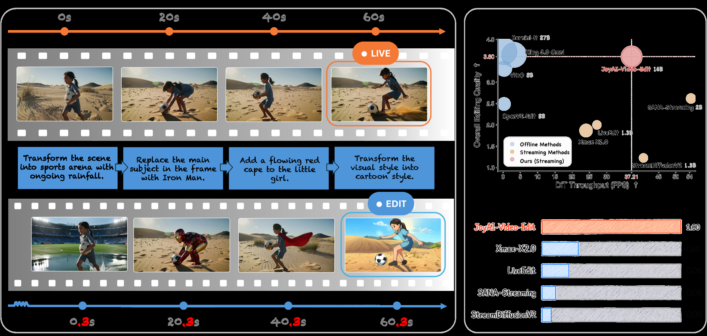

# AI Daily — 2026-08-13

## JoyAI-Video-Edit：以自迴歸擴散實現即時、開放式串流影片編輯

> **一句話結論**：JoyAI-Video-Edit 將「無限長、即時、可編輯」視為同一個自迴歸控制問題：用固定長度的 causal chunk state 限制成本，再把文字指令、當前來源片段與自生成歷史的衝突，透過 **source-anchored distillation** 和長時程 rollout 訓練顯式處理。[1]

## 論文基本資訊

| 欄位 | 內容 |
|---|---|
| 論文 | *JoyAI-Video-Edit: Real-Time Open-Ended Video Editing with Autoregressive Diffusion* |
| 作者 | Yicheng Xiao、Wenxun Dai、Xinran Qin、Lin Song、Maoquan Zhang、Hang Xu、Yukang Chen、Yitong Li、Guohui Zhang、Yuan Zhang、Xuying Zhang、Tommy Zhang、Jianlong Yuan、Peihao Li、Shuai Lu、Siming Fu、Chuyang Zhao、Xin Han、Jie Huang、Wenbo Li、Guoqing Ma、Wei Huang、Xiaojuan Qi、Haoyang Huang、Nan Duan |
| 研究單位 | Joy Future Academy, JD（京東） |
| 發表狀態 | arXiv 預印本，2026-08-04；**目前官方頁面未列頂會接受資訊** |
| 論文與程式碼 | [arXiv:2608.03974][1]；[官方程式碼庫][2] |
| 入選理由 | 熱門榜單出現、16B 工業級影片擴散模型、直接結合 **autoregressive diffusion、長序列穩定性、蒸餾與即時部署**；並已比對儲存庫，未與既有 AI Daily 重複。 |

## 核心貢獻：把「能編輯影片」推到「可持續編輯串流」

傳統高品質影片編輯器多以固定長度片段為單位，使用雙向或全域時間注意力來換取短片段的一致性。此設計在直播、視訊通話與互動內容中並不成立：系統不能等待未來畫格、KV cache 與 activation 不應隨影片長度無界成長，並且每個新片段都必須延續既有編輯、同時忠於剛輸入的來源畫面。[1]

JoyAI-Video-Edit 的第一個貢獻是把強大的雙向 editor 因果化。它以 **chunk 內雙向、chunk 間因果** 的注意力遮罩生成編輯後 latent，保留首個 chunk 作為 global sink，並只保留固定數量的近期 chunks。因此，串流長度增加時，單步 attention context、KV cache 與每 chunk 計算皆維持有界。第二個貢獻是 SA-DMD，將多步 diffusion 蒸餾為兩步生成，卻避免自生成歷史將影像外觀逐步拉離來源片段。第三個貢獻是 LHAD（Long-Horizon Autoregressive Distillation），把短 rollout 看不到的長期漂移直接納入訓練。[1]

*圖 1：官方 Figure 1。左側展示影片持續輸入時仍可在不同時間點改變場景、主體與風格；右側將其放在品質與吞吐的 Pareto 圖上。[1]*

| 模組 | 解決的瓶頸 | 關鍵設計 |
|---|---|---|
| Chunk-wise AR adaptation | 未來畫格不可用、長序列計算無界 | chunk 內雙向／chunk 間因果；sliding window 加第一個 chunk sink；以 resampling forcing 讓歷史分佈接近部署狀態。 |
| SA-DMD | 少步生成時的 source drift | 在 teacher 端把文字遵從與來源保真度拆為兩個 CFG 軸，將 source-aware 控制蒸餾至 student。 |
| LHAD | 長期誤差只在深度 rollout 才顯現 | 將長軌跡分段反向傳播、累積梯度後才更新，避免保留整段計算圖造成 OOM。 |
| 部署共設計 | 16B 模型難以達成端到端即時 | 兩步 DiT、bounded KV cache、FP8、operator fusion、圖編譯與最佳化 VAE pipeline。 |

## 技術方法：從 flow matching 到 source-anchored few-step generator

### 1. 基礎模型與因果 chunk 表示

模型由 MLLM condition encoder、causal video VAE 與 multimodal DiT 組成。VAE 的時間／空間壓縮率為 $8\times24\times24$，即一個 latent frame 對應八個影格。對來源影片 $x_s$、條件 token $c$、可選 reference 與編輯目標 $x_t$，令 $z_s,z_r,z_0$ 為相應 latent。其 flow-matching 噪聲路徑與速度目標為：[1]

$$
 z_\sigma=(1-\sigma)z_0+\sigma\epsilon,
 \qquad
 v^\star=\epsilon-z_0,
 \qquad \epsilon\sim\mathcal N(0,I).
$$

初始雙向 editor 的監督可寫為

$$
\mathcal L_{\mathrm{V2V}}
=
\mathbb E\left[
\left\|v_{\theta}^{\mathrm{bi}}(z_\sigma,\sigma,c,z_s,z_r)-v^\star\right\|_2^2
\right].
$$

然後將時間軸切為固定大小、相互對齊的 source／target chunks。對第 $t$ 個 active chunk，模型可看見當前來源 $S_t$、條件 $C_t$、可選 reference $R$、窗口內歷史 $H_{<t}$ 與第一個 sink chunk，但完全遮蔽未來 chunks。乾淨歷史 teacher forcing 雖容易收斂，卻與部署時必須讀取自身預測不符；作者遂用 detached 的 one-step 重生成歷史取代乾淨歷史，讓訓練中見到的條件分佈向推論時靠攏。[1]

### 2. SA-DMD：將「遵從指令」與「忠於來源」視為兩條獨立引導軸

一般 DMD 用 real-score teacher 和 fake-score model 壓縮多步採樣，然而在影片編輯的自迴歸 rollout 中，只有文字 CFG 並不能阻止模型逐步遺失來源的人物身份、背景與幾何。JoyAI-Video-Edit 的關鍵改寫是：對 frozen real-score model 同時做 text 與 aligned-source 的 CFG，定義引導速度為 [1]

$$
 v_\phi^{g}=v_\phi^{\mathrm{cond}}
 +w_{\mathrm{txt}}\left(v_\phi^{\mathrm{cond}}-v_\phi^{-\mathrm{txt}}\right)
 +w_{\mathrm{src}}\left(v_\phi^{\mathrm{cond}}-v_\phi^{-\mathrm{src}}\right).
$$

其中 $v_\phi^{-\mathrm{txt}}$ 移除文字條件，$v_\phi^{-\mathrm{src}}$ 移除與當前時間對齊的來源 latent $S_k$。$w_{\mathrm{src}}$ 因而不是一般的 prompt-strength 旋鈕，而是「相信 AR 歷史的連續性」與「拉回當前原始輸入」之間的控制係數。作者只在 **distillation target** 使用這個雙軸 teacher，部署模型仍採用單一條件分支；換言之，昂貴的 source-aware 多分支引導被訓練時吸收進兩步 student。[1]

> **值得注意的觀念轉換**：過去長影片方法常以 anchor cache 維持「過去生成畫面的穩定」；SA-DMD 則使用每個時間點剛抵達的來源 chunk 當作外部錨點，防止模型對錯誤的自生成歷史過度自信。這是一種以觀測為錨的 autoregressive diffusion control，而不是單純增加記憶長度。

### 3. LHAD：用分段反傳把長期 rollout 的錯誤納入目標

短片段的 DMD 可能在局部品質良好，卻無法看到經多次 history reuse 後才出現的顏色偏移、identity drift 或編輯衰退。作者對 $m$ 個 chunks 的長 rollout 做 segmented optimization：每段執行 SA-DMD backward、釋放該段計算圖，再繼續生成下一段；最後累積各段梯度，以單次 optimizer step 更新。這使模型能接收長 horizon 訊號而不需同時保留整段圖。[1]

當預定 rollout 超過來源影片長度時，論文採用 forward／reverse 交替的 dynamic mirror looping 來延展條件，而非直接週期複製，藉此降低片段交界的語義突變。此做法結合 bounded-window attention，使訓練與部署都能在可控記憶體內處理更長串流。[1]

## 實驗結果：30 FPS 並非只靠縮小模型

作者以 OpenVE-Bench 評估短片段編輯，另建立含 229 項一分鐘任務的 LongV2VBench，將背景變換、全域風格、局部新增、局部修改與局部移除都納入長期測試。[1] 下表保留最能反映「即時性與品質同時成立」的結果；各方法解析度不同，因此不宜將分數解讀為完全控制變因下的純架構比較。

| 評測 | JoyAI-Video-Edit | 最強既有串流基線（表中） | 解讀 |
|---|---:|---:|---|
| OpenVE-Bench overall（1–5） | **3.60** @ 720×1280 | SANA-Streaming 2.62；XMax-X2.0 1.87 | 在五類中有四類為串流方法最佳；局部修改 4.47，局部移除 4.06。 |
| LongV2VBench overall（1–5） | **3.30** @ 720×1280 | XMax-X2.0 1.71 | 一分鐘維度中五個類別皆為串流方法最高，較 XMax 高 1.59。 |
| LongV2VBench full throughput | **30.19 FPS** | XMax-X2.0 20.90 FPS | 作者報告高 44.4%；在可比的 SANA-Streaming 704×1280 設定下，為 14.51 FPS 的兩倍以上。 |
| 81-frame full-pipeline latency | **2.68 s** | StreamDiffusionV2 4.48 s；SANA-Streaming 5.58 s | 指標涵蓋 encode、DiT、decode，而非僅計 DiT。 |

對單一 B200 的端到端帳本尤其清楚：VAE encode、兩步 DiT denoise、VAE decode 分別為 22、185、19 ms，request-to-response 為 226 ms；加上 clean KV cache 建構與 pseudo encoding 的 31 與 9 ms，完整 cycle 為 266 ms／八影格，即約 30.1 FPS。[1] 這說明即時性來自**模型蒸餾、因果 cache 與系統最佳化的乘法效果**，而非單一 kernel 的局部加速。

| LongV2VBench 消融 | Overall | 關鍵觀察 |
|---|---:|---|
| 基礎 few-step AR model | 2.81 | 長期 source drift 明顯。 |
| 僅 SA-DMD | 3.23 | 最大單模組增益；global style 由 3.61 升至 4.24，local change 由 3.43 升至 4.00。 |
| 僅 LHAD | 3.06 | 對背景變更與局部移除有補益，對應其處理晚期累積誤差的目的。 |
| SA-DMD + LHAD | **3.30** | 兩者互補；局部新增、修改與移除皆為最佳。 |

## 相關研究脈絡：它站在三條研究線的交會處

| 研究線 | 代表工作 | 與本文的關係 |
|---|---|---|
| Exposure bias 與 AR rollout | **Self Forcing** 以自生成歷史、video-level loss 與 rolling KV cache 縮小訓練—推論落差，並獲 NeurIPS 2025 Spotlight。[3] | JoyAI-Video-Edit 延續 on-policy history 的精神，但新增來源影片這個外生觀測條件；它要處理的不只是「預測會不會越走越歪」，還有「編輯結果會不會越來越不像正在輸入的影片」。 |
| AR diffusion distillation | **Causal Forcing** 指出把雙向 teacher 直接 ODE-distill 至因果 student 存在架構落差，轉以 AR teacher 初始化再使用 DMD，並獲 ICML 2026。[4] | JoyAI-Video-Edit 在 few-step distillation 的共同問題上，提出 source-anchored dual-axis guidance，特化於串流 V2V editing 的保真需求。 |
| Streaming video editing | LiveEdit、SANA-Streaming、XMax-X2.0 等將影片編輯轉為因果或遞增運算。[1] | 本文主張 16B 容量、兩步蒸餾和 bounded-history deployment 可以縮小 streaming 與 offline 品質差距；其評測亦直接包含這些串流基線。 |

## 個人評價與可延伸的研究想法

**第一，source anchor 可以被重新理解為條件化能量校正。** SA-DMD 並非直接在推論期反覆做 guidance，而是在教師目標中調整「滿足文字、來源與自生成歷史」的偏好，再蒸餾給學生。若將來源相符性寫成能量 $E_{\mathrm{src}}(z_t,S_t)$，自生成歷史寫成連續性項 $E_{\mathrm{hist}}(z_t,H_{<t})$，未來可研究以可學習的 energy / preference model 自動調節 $w_{\mathrm{src}}$，使快動作、遮擋或場景切換時不必採用固定權重。這是**基於本文的研究假設**，不是作者已驗證的結論。

**第二，JEPA 可以成為長 horizon 的 latent critic。** LHAD 透過延長 rollout 來「看見」累積誤差，但其監督仍以生成與編輯品質為主。另一條路是用 JEPA 式 predictor 估計未來 source-aligned representation，並把 prediction residual 作為長期漂移訊號。這可能將 video editing 的長期一致性從像素／偏好分數，改為可規劃的表徵動力學問題。

**第三，attention modulation 應從『剪 token』轉向『依訊息來源調配信任』。** 本文的 global sink 加 sliding-window 主要控制時間可見範圍；SA-DMD 則在教師端控制兩種訊息來源的相對可信度。值得探索每層、每頭、每個 diffusion timestep 都使用不同的 source/history gate，並由不確定性或跨 chunk 變化率驅動。這可能同時連結 training-free attention modulation、zero-shot video editing 與能量式信賴度估計。

**限制與解讀邊界。** 這是一篇極新的 arXiv 預印本，尚未在官方頁面列出會議接受資訊；30 FPS 的結果也依賴單張 B200、FP8、圖編譯與完整部署管線，不能外推為一般 GPU 上 16B 模型的預期速度。[1] 部分基準方法使用不同解析度，且 OpenVE-Bench 與 LongV2VBench 分數依賴 Gemini judge，因此「絕對品質」與跨系統的公平性仍需更多公開重現。即便如此，它最有價值的地方不是單一排行榜數字，而是將 **causal model、few-step distillation、source fidelity 與系統工程** 放到同一個可優化框架中。

## 參考文獻

[1]: https://arxiv.org/abs/2608.03974 "JoyAI-Video-Edit: Real-Time Open-Ended Video Editing with Autoregressive Diffusion — arXiv"
[2]: https://github.com/jd-opensource/JoyAI-Video-Edit "JD Open Source — JoyAI-Video-Edit"
[3]: https://arxiv.org/abs/2506.08009 "Self Forcing: Bridging the Train-Test Gap in Autoregressive Video Diffusion — arXiv"
[4]: https://arxiv.org/abs/2602.02214 "Causal Forcing: Autoregressive Diffusion Distillation Done Right for High-Quality Real-Time Interactive Video Generation — arXiv"
