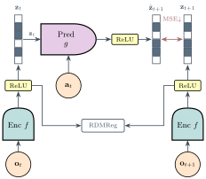
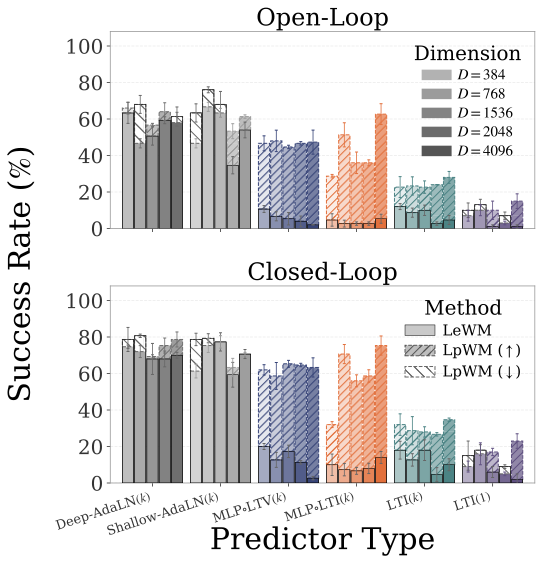
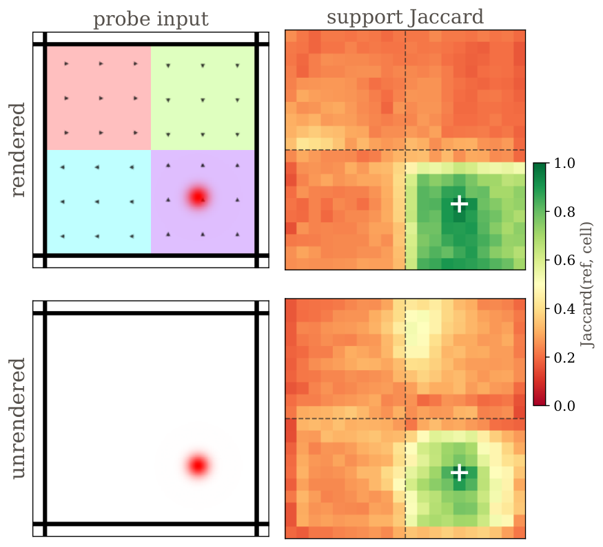

# AI Daily

## 今日精選：LpWM——讓 JEPA 的世界模型學會「稀疏地表示動力學」

**研究日期：** 2026-09-05　　**作者：** Manus AI　　**論文日期：** 2026-08-24　　**來源：** arXiv:2608.22764v1 [cs.LG] [1]

> 本日精選 **LpWM: A Case for Sparse Representations in World Models**。這篇工作不再把 JEPA 的 dense latent 當成理所當然，而是提出一個更根本的問題：如果世界模型的 latent 只在少數座標上啟動，是否能用更低容量的 predictor 學會 action-conditioned dynamics？作者的答案是，在 PushT 等較困難的控制環境中，稀疏表示確實可以降低成功規劃所需的 predictor 複雜度，並讓 latent 的 binary support 與 feature magnitude 自然分工。[1]

這不是一篇 image-generation benchmark 論文，也不是已確認的頂會錄用論文；截至本報告研究日，原始頁面只標示 arXiv v1，未列出 ICCV、CVPR、ICML、NeurIPS 或其他正式會議資訊。[1] 然而，它非常符合本期希望激發的研究方向：**JEPA、latent geometry、energy-style compatibility、可解釋表示、低容量 dynamics、zero-shot planning，以及將稀疏結構接到 VAR 或 attention modulation 的可能性**。尤其值得注意的是，作者群包含 Yann LeCun，且論文把抽象的表示幾何問題連結到可驗證的 predictor-capacity 實驗。[1]

## 一、為什麼選這篇？

本次先檢查 `KaiCobra/AI_Daily` 既有文章與 README 索引，已排除 repository 中已有的 Energy-Guided Flow Matching、ChebBooster、DiverseVAR、VISTA、SolarWM、SynVAR 與 MeRoPE 等候選。近期搜尋也顯示 JEPA、世界模型、next-scale autoregression 與 DiT 調制仍是 2026 年 8 月至 9 月的重要研究軸線；LpWM 以較少被充分討論的「表示幾何」切入，能補足既有文章偏重架構與推理技巧的視角。[7]

| 篩選面向 | 本文判斷 | 評價 |
|---|---|---|
| 時效性 | arXiv v1 於 2026-08-24 提交 | 高 |
| 作者與研究單位 | Yilun Kuang、Yash Dagade、Quentin Le Lidec、Lucas Maes、Randall Balestriero、Yann LeCun；NYU、Duke、Mila、Brown、AMI Labs | 高 |
| 核心問題 | 稀疏 latent geometry 是否能讓 action-conditioned dynamics 更容易學習 | 高 |
| 技術深度 | RDMReg、RepReLU、one-hot 線性化命題、predictor-capacity ladder、Jaccard support 分析 | 高 |
| 實驗完整性 | Wall、PushT、Piecewise、OGBench-Cube；包含 open-loop、closed-loop、random-goal 與 temporal prior 分析 | 中高 |
| 會議狀態 | 目前為 arXiv preprint，未看到正式會議錄用資訊 | 中；需保守表述 |
| 與本期偏好的吻合 | 直接對應 JEPA、zero-shot/goal-conditioned planning 與 latent energy；可延伸至 VAR、EBT 與 training-free attention modulation | 高 |

這篇論文最值得讀的地方，不是單純把 ReLU 加進 encoder，而是它把「表示空間應該長什麼樣子」提升成世界模型的核心設計變數。LeJEPA 與 LeWM 類方法偏向使用 dense、近似 isotropic Gaussian 的 latent；LpWM 則問：對受控動力學而言，密集且每一維都非零的表示，是否反而把 predictor 的任務變得更難？[1] [5]

## 二、論文基本資訊

| 欄位 | 內容 |
|---|---|
| 論文標題 | LpWM: A Case for Sparse Representations in World Models |
| 作者 | Yilun Kuang、Yash Dagade、Quentin Le Lidec、Lucas Maes、Randall Balestriero、Yann LeCun |
| 研究機構 | NYU、Duke University、Mila、Brown University、AMI Labs |
| 發表狀態 | arXiv:2608.22764v1，2026-08-24；目前為預印本 |
| 研究領域 | Machine Learning（cs.LG） |
| 核心任務 | 以 action-conditioned JEPA latent dynamics 進行 model-predictive control |
| 主要方法 | RDMReg、非負稀疏 code、RepReLU、低容量 predictor、support/magnitude 分析 |
| 官方程式碼 | [YilunKuang/lpworldmodel](https://github.com/YilunKuang/lpworldmodel) [2] |
| 本報告資產 | `asset/LpWM/`；方法圖、PushT 比較圖、Piecewise support heatmap、規劃曲線 |

論文的工作假設可以濃縮成一句話：**如果 latent 的 support 負責表示「現在處於哪個動力學 regime」，而非零值的 magnitude 負責表示「該 regime 內的連續狀態」，那麼 predictor 就不必用同等容量同時處理離散切換與連續變化。** 這個假設不等同於「稀疏一定更好」；論文的結果顯示，優勢依賴 predictor capacity 與環境 dynamics complexity 的相對關係。[1]

## 三、相關背景：從 JEPA、DINO-WM 到稀疏 latent geometry

JEPA 的基本路線是在 representation space 預測未來或被遮蔽的狀態，而不是把所有像素細節重建出來。I-JEPA 將可見 image block 映射到隱藏 block 的表徵預測；V-JEPA 2 則把這種思路擴展到大規模視頻預訓練、action-conditioned world model 與 zero-shot robot planning。[3] [8]

DINO-WM 展示了另一個重要觀點：只要視覺 encoder 的 patch features 足以表達可預測狀態，世界模型可以在 latent space 中學 dynamics，再以 goal-feature distance 配合 CEM/MPC 進行 test-time planning，而不必在訓練與推理時完整重建影像。[4] LpWM 延續這個 representation-space planning 設定，但將研究焦點從「預訓練特徵是否可用」推進到「latent geometry 是否讓 transition map 更簡單」。

| 研究 | 表示分佈或狀態形式 | 主要關注 | LpWM 的承接與差異 |
|---|---|---|---|
| I-JEPA | context view → target view 的 latent prediction | 在表示空間學習可預測內容 | LpWM 延續 latent prediction，但把 geometry 改成可控稀疏 |
| V-JEPA 2 | web-scale video latent 與 action-conditioned future state | understanding、prediction、planning | LpWM 不追求規模，而是研究 predictor capacity 與 state geometry [3] |
| DINO-WM | 預訓練 DINOv2 patch feature 的 latent dynamics | offline、goal-conditioned、zero-shot planning | LpWM 延續 CEM/MPC，但比較 sparse 與 dense representation [4] |
| LeJEPA / LeWM | dense isotropic Gaussian-like latent | 用 distribution matching 防止 collapse | LpWM 將目標分佈改成 rectified、non-negative、sparse [5] |
| Rectified LpJEPA | RGG 與 RDMReg 的一般表示學習框架 | 稀疏與 maximum-entropy representation | LpWM 將 RDMReg 放入 action-conditioned world model，並量測規劃與可解釋 dynamics [6] |
| LpWM | distributed non-negative sparse latent | 低容量 predictor 與 mode-factored dynamics | 本文方法 |

從這個脈絡看，LpWM 並沒有否定 dense representation 的一般價值；它提出的是更具體的控制問題：**在需要學 action-conditioned transition 的 latent space 中，dense geometry 是否把本來具有 regime structure 的 dynamics 混合得太複雜？**

## 四、方法詳解：RDMReg 如何把 JEPA 變成稀疏世界模型

### 4.1 Action-conditioned JEPA 的基本目標

令 $x_t$ 為時間 $t$ 的觀察、$a_t\in\mathbb R^{d_a}$ 為動作、$f_\theta$ 為 encoder、$g_\phi$ 為 predictor。LpWM 將當前觀察與下一觀察分別映射為

$$
z_{t+1}=f_\theta(x_{t+1})\in\mathbb R^D,
\qquad
\hat z_{t+1}=g_\phi(z_t,a_t).
$$

基本的 action-conditioned JEPA 目標為

$$
\min_{\theta,\phi}
\left\|\hat z_{t+1}-z_{t+1}\right\|_2^2
+\lambda_{\mathrm{RDMReg}}\,\mathcal R(z_{t+1}),
$$

其中第一項使 predictor 能從目前 latent 與動作預測下一 latent，第二項則防止 collapse，並同時規定 encoder 輸出的幾何形狀。[1]

架構上，encoder 是 ViT，其 CLS token 經過三層 MLP projector；predictor 是帶有 AdaLN-zero action conditioning 的 Transformer，最後再以三層 MLP projector 預測下一 latent。LpWM 的關鍵差異在於 encoder 與 predictor projector 的輸出通過 RepReLU，而不是普通 identity link。[1]

### 4.2 RDMReg：從 dense Gaussian 改成 rectified generalized Gaussian

RDMReg 對輸出 latent 的隨機投影分佈做 matching。令 $c$ 均勻取自 $\mathbb S_2^{D-1}$，令 $y$ 服從由 rectified generalized Gaussian 組成的目標分佈，則正則化項寫成

$$
\mathcal R(z)
=
\mathbb E_{c\sim\mathrm{Unif}(\mathbb S_2^{D-1})}
\left[
\mathcal L\left(\mathbb P_{c^\top z}\,\middle\|\,\mathbb P_{c^\top y}\right)
\right],
$$

其中論文使用 $2$-Wasserstein distance 作為 $\mathcal L$，而目標向量的每一維可寫成

$$
 y_i\sim \operatorname{ReLU}\left(\mathcal{GN}_p(\mu,\sigma)\right),
 \qquad i=1,\ldots,D.
$$

LpWM 的預設設定是 $\mu=0$、$\sigma=1/2$、$p=1$，因此得到 rectified Laplace 類的稀疏目標。當 $\mu=0$、$\sigma=1$、$p=2$ 且不使用 ReLU 時，則回到 LeWM 所採用的 dense isotropic Gaussian 特例。[1]

這裡有一個重要的概念：一般 generalized Gaussian 是在 expected $\ell_p$-norm constraint 下的 maximum-entropy 分佈；加入 rectification 後，模型同時得到非負座標與可控制的零值比例。換句話說，LpWM 不是用一個任意的 $\ell_1$ penalty 把表示壓到稀疏，而是將稀疏性嵌入 anti-collapse target distribution 中。[1] [6]

### 4.3 RepReLU：前向精確稀疏、反向避免 dying ReLU

LpWM 使用重新參數化的 ReLU：

$$
\operatorname{RepReLU}(x)
=
\operatorname{sg}(\operatorname{ReLU}(x))
+\operatorname{GeLU}(x)
-\operatorname{sg}(\operatorname{GeLU}(x)),
$$

其中 $\operatorname{sg}(\cdot)$ 表示 stop-gradient。前向計算時，兩個 stop-gradient 項相減，因此輸出等同於 $\operatorname{ReLU}(x)$，會產生精確的零；反向計算時，梯度則沿著 GeLU 路徑傳播，以降低普通 ReLU 造成 dead neuron 的風險。[1]

這個細節也界定了論文的理論與實驗解讀：RDMReg 才是防 collapse 與誘導稀疏分佈的核心，RepReLU 是 optimization safeguard，而不是唯一能產生稀疏表示的原因。作者指出，普通 ReLU 搭配 RDMReg 也能避免 collapse 並得到 exact sparsity。[1]

**圖一。** 這是論文提供的完整方法示意圖。左側與右側 encoder 分別處理 $o_t$ 與 $o_{t+1}$；中間 predictor 依 $a_t$ 進行 latent prediction，RDMReg 作用在表示分佈上。圖檔由論文 HTML/PDF 資產抽取，沒有使用整頁螢幕截圖。[1]

### 4.4 Predictor-capacity ladder

LpWM 的核心實驗不是只比較一個大模型，而是把 predictor 按複雜度排成 ladder，以檢驗同一個 dynamics 在 sparse 與 dense geometry 下是否需要不同模型容量。$k$ 表示 history length；LTI 是 linear time-invariant predictor，LTV 是 state-dependent linear time-varying predictor，AdaLN predictor 則是 Transformer/DiT 類模型。[1]

| Predictor | 形式 | $D=384$ 參數量 | $D=1536$ 參數量 | 直觀含義 |
|---|---|---:|---:|---|
| Deep-AdaLN($k$) | 6-block Transformer | 25.8M | 166.9M | 高容量、非線性 |
| Shallow-AdaLN($k$) | 1-block Transformer | 5.6M | 33.1M | 較輕量 Transformer |
| MLP$\circ$LTV($k$) | state-dependent linear core + MLP | 0.81M | 12.1M | 中等容量、可隨狀態改變 |
| MLP$\circ$LTI($k$) | fixed linear core + MLP | 0.74M | 11.8M | 中低容量 |
| LTI($k$) | fixed linear state-space map | 0.59M | 9.44M | 最簡單的多步線性模型 |
| LTI(1) | 單步 fixed linear map | 0.30M | 4.72M | 最嚴格的低容量測試 |

對 LpWM 而言，$\operatorname{RepReLU}$ output link 仍然存在，因此表中的 LTI 並不代表完整模型在稀疏 latent 上是嚴格線性的；更準確地說，核心 transition map 是線性的，但最後的稀疏非線性 link 仍會影響實際函數形式。[1]

### 4.5 從規劃角度看 latent geometry

測試時，世界模型先將 current observation 與 goal observation 編碼為 $z_0$ 與 $z_g$，再搜尋一段 action sequence，使預測 rollout $\hat z_T$ 接近目標。規劃成本為

$$
\mathcal C=\left\|\hat z_T-z_g\right\|_2^2,
$$

其中

$$
\hat z_{t+1}=g_\phi(\hat z_t,a_t),
\qquad
\hat z_0=f_\theta(x_0),
\qquad
z_g=f_\theta(x_g).
$$

LpWM 使用 Cross-Entropy Method（CEM）搜尋 action sequence；每一輪採樣 300 條 candidate sequences，保留前 30 條，執行 30 個 CEM iterations，規劃 horizon 為 $H=5$。Wall 與 PushT 的 frameskip 為 5，因此 goal observation 約位於 25 個 raw environment steps 之後。[1]

## 五、理論洞見：稀疏 one-hot 表示為何能線性化 dynamics？

LpWM 的理論不是聲稱實際 ViT 一定會學出完美 one-hot code，而是先展示一個理想化建構，說明稀疏 geometry 具有潛在線性化能力。

令狀態空間 $\mathcal X\subset\mathbb R^d$ 與動作空間 $\mathcal A\subset\mathbb R^p$ 都是 compact，且真實 dynamics

$$
 x_{t+1}=f(x_t,a_t)
$$

對 state 變數滿足 uniformly Lipschitz 條件：

$$
\left\|f(x,a)-f(y,a)\right\|_2
\le L\left\|x-y\right\|_2,
\qquad \forall x,y\in\mathcal X,\ a\in\mathcal A.
$$

對任意 $\varepsilon>0$，作者以有限個代表點 $c_1,\ldots,c_N$ 覆蓋 $\mathcal X$，建立 one-hot encoder

$$
E_\varepsilon(x)=e_{Q_\varepsilon(x)}\in\mathbb R^N,
$$

其中 $Q_\varepsilon(x)$ 將狀態分派到距離不超過 $\varepsilon$ 的代表 cell，$e_i$ 是第 $i$ 個 standard basis vector。decoder 則令 $D_\varepsilon(e_i)=c_i$。對固定動作 $a$，把代表狀態 $c_i$ 經過真實 dynamics 後再量化到某個 cell $\tau_a(i)$，並建構矩陣

$$
P_\varepsilon(a)e_i=e_{\tau_a(i)}.
$$

因此 latent dynamics 可以精確寫成線性形式

$$
 z_{t+1}=P_\varepsilon(a_t)z_t,
$$

而解碼後的一步誤差滿足

$$
\sup_{x_t,a_t}
\left\|
 f(x_t,a_t)-D_\varepsilon\big(P_\varepsilon(a_t)E_\varepsilon(x_t)\big)
\right\|_2
\le (L+1)\varepsilon.
$$

對 $\mathcal X=[0,1]^d$ 且每個座標切成 $n$ 段時，cell 數量為 $N=n^d$，covering radius 為

$$
\varepsilon_N=\frac{\sqrt d}{2}N^{-1/d},
$$

所以 one-step error 是 $O(N^{-1/d})$；固定 rollout horizon $H$ 下，誤差可由

$$
\left\|x_H-\hat x_H\right\|_2
\le
\frac{\sqrt d}{2}(L+1)N^{-1/d}
\sum_{k=0}^{H}L^k
$$

控制，並在 $N\to\infty$ 時趨近於零。[1]

這個結果同時揭示了方法的代價：在高維狀態空間中，$N=n^d$ 帶來明顯的 curse of dimensionality，完美 one-hot 並不實用。因此，LpWM 實際上學的是 distributed sparse code，將 one-hot 的理想線性化能力放鬆成「只有一部分座標啟動，但仍保留分散式資訊」的可學習版本。[1]

## 六、實驗結果：稀疏性何時真正有幫助？

### 6.1 Wall 與 PushT：優勢集中在中等 predictor capacity

在 Wall 環境中，dense LeWM 與 sparse LpWM 即使使用最簡單的 LTI(1) predictor，也能達到接近 100% 的 closed-loop CEM success；這表示 Wall dynamics 本身已經足夠簡單，沒有留下太多讓 sparse geometry 發揮的空間。[1]

PushT 則較困難。在 predictor capacity 足夠高時，Deep-AdaLN 與 Shallow-AdaLN 可以讓 sparse 與 dense representation 都接近飽和，因此差距縮小。真正的差異出現在中等容量：LpWM 相對 LeWM 的規劃成功率提升如下。[1]

| Predictor 類型 | LpWM 相對 LeWM 的 success-rate 增益 | 解讀 |
|---|---:|---|
| MLP$\circ$LTI($k$) | 24%–57% | 稀疏 geometry 對中低容量 predictor 最有利 |
| MLP$\circ$LTV($k$) | 36%–45% | 即使 predictor 可依狀態改變線性算子，稀疏仍有優勢 |
| LTI($k$) | 11%–23% | 固定線性核心也能從稀疏 latent 獲得收益 |
| Deep-AdaLN($k$) | 差距縮小 | 高容量 predictor 可自行吸收較複雜的 dense dynamics |

**圖二。** 圖中上半部為 open-loop、下半部為 closed-loop；斜線柱代表 LpWM 相對 dense LeWM 的差異。最重要的閱讀方式不是找一個單獨的 SOTA 數字，而是觀察：當 predictor capacity 位於中間區間，稀疏表示使模型在相同或更低參數量下更容易規劃。[1]

論文也以 VICReg 替代 SIGReg，形成另一個 dense baseline。LpWM 在 Deep-AdaLN、MLP$\circ$LTV 與 MLP$\circ$LTI 等 predictor 上仍維持優勢，說明結果不只是在比較 RDMReg 與某一種 Gaussian matching，而是對 dense representation family 具有一定穩健性。[1]

### 6.2 稀疏度統計：實際 code 確實不是「名義上的稀疏」

在目標分佈 $\mu=0$、$\sigma=1/2$、$p=1$ 的設定下，LpWM encoder 的 active fraction 約為 30%–65%，而 dense LeWM 按照構造 active fraction 為 1.0。這代表 LpWM 的結果不是僅由數值縮小造成，而是大量座標在前向輸出中真正成為零。[1]

### 6.3 Piecewise：support 可以恢復離散動力學 regime

在 Piecewise 環境中，不同區域具有不同 force field。作者將環境離散成 $20\times20$ grid，對每個位置取得 latent support，並用 Jaccard index 比較 support 的重疊程度：

$$
J(x,y)=
\frac{\sum_i\mathbf 1[x_i=1\land y_i=1]}
{\sum_i\mathbf 1[x_i=1\lor y_i=1]}.
$$

如果 support 真正捕捉了 regime，固定參考 cell 與同一 zone 內 cell 的 Jaccard 應較高，而跨 zone 邊界時快速下降。這種分區結構即使在 zone 沒有視覺線索的版本中仍然存在，表示 support 主要由 action-conditioned prediction 學得，而不是單純辨識背景顏色。[1]

| Piecewise 設定 | LpWM | LpWM + temporal Jaccard | LeWM |
|---|---:|---:|---:|
| $2\times2$，random goals，$H=5,R=5$ | 59.33% ± 2.31 | **68.67% ± 4.62** | 36.00% ± 3.46 |
| $2\times2$，evaluation goals，$H=5,R=1$ | **84.67% ± 4.16** | 82.67% ± 5.03 | 65.33% ± 4.16 |
| $3\times3$，random goals，$H=5,R=5$ | 56.00% ± 4.00 | **58.00% ± 5.29** | 47.33% ± 6.11 |

`R` 是 receding-horizon 設定；結果為 3 個 seeds 的 mean ± std，Table 4 每個情境以 50 個 test samples 評估。[1] 值得注意的是，Temporal-Jaccard 並非所有設定都提升 success；它主要是用來控制 support 的時間穩定性，因此不應被誤解成普遍有效的 performance booster。

**圖三。** 完整 heatmap 顯示 support Jaccard 在參考 zone 內形成高相似區域，跨越虛線 regime boundary 後快速下降；下排的 unrendered 版本說明即使移除直接視覺線索，support 仍能恢復部分動力學分區。[1]

### 6.4 OGBench-Cube：稀疏 support 不會自動等於語義因素

在 contact-rich manipulation 中，vanilla LpWM 的 support instability 可能先學成「快速運動偵測器」，而不一定對應人們想要的接觸事件。沒有 temporal prior 時，support instability 與 effector motion 的相關係數約為 $0.87$，但與 gripper contact 的相關係數僅約為 $0.05$。[1]

作者因此加入 optional Temporal-Jaccard loss：

$$
\mathcal L_{\mathrm{TJ}}
=
\frac{1}{B(T-1)}
\sum_{b=1}^{B}\sum_{t=1}^{T-1}
\left[1-J_S\big(Z_{b,t,:},Z_{b,t+1,:}\big)\right],
$$

其中 $J_S$ 是對非負向量的 soft Jaccard relaxation。最小化此項會鼓勵相鄰時間的 support 平滑變化，但不會改變 RDMReg 所提供的全局稀疏邊際約束。[1]

加入 TJ 後，support instability 與 effector motion 的關聯下降到約 $0.40$，與 cube motion 的關聯上升到約 $0.80$，與 contact 的關聯也由約 $0.05$ 上升到約 $0.61$。[1] 這個結果同時是亮點與警告：**稀疏性本身不保證可解釋性；要讓 support 對應慢變且具物理意義的 regime，仍需要額外的 temporal inductive bias。**

## 七、與 Energy-based Transformer、VAR、Attention Modulation 與 Zero-shot 的連結

### 7.1 Energy-based interpretation：把 prediction residual 當成 compatibility energy

LpWM 論文本身是 JEPA regression 與 MPC，不是明確提出的 scalar Energy-Based Model，也沒有使用 Langevin sampling、contrastive negative sampling 或 equilibrium inference。因此，下式是**我的研究性重寫，不是論文聲稱的方法**：

$$
E(z_t,a_t,z')
=
\left\|g_\phi(z_t,a_t)-z'\right\|_2^2
+\beta\,\mathcal R(z').
$$

在這個觀點下，第一項表示候選下一狀態 $z'$ 與 predictor 預測的相容性，第二項則使候選 latent 遵守 sparse/non-negative geometry。更進一步，可以令 $s'=\mathbf 1[z'>0]$ 表示 support、$m'=z'$ 表示 magnitude，將能量拆成

$$
E=E_{\mathrm{support}}(s'\mid z_t,a_t)
+E_{\mathrm{magnitude}}(m'\mid s',z_t,a_t).
$$

這提供了一條由 JEPA 走向 EBT 的乾淨路線：先用 support energy 選擇下一個 dynamics regime，再用 magnitude energy 描述 regime 內的連續狀態；規劃時可比較 CEM、gradient-based optimization、Langevin 或 flow matching 的取樣效率。這是待驗證的研究假說，不應當作 LpWM 已完成的 EBM 結果。

### 7.2 對 VAR / image generation 的啟發

LpWM 沒有直接測試 image generation、FID、CLIP score 或 VAR next-scale likelihood；因此以下是跨領域延伸構想。若將視覺生成的 latent token 分解為 support 與 magnitude，可以嘗試讓 support 先負責回答「哪一種結構或物件關係在下一個尺度被啟用」，再讓 magnitude 負責紋理、姿態與細節強度。對 next-scale autoregressive model 而言，可能的架構是

$$
 p(r_k\mid r_{<k},c)
 =p(s_k\mid r_{<k},c)\,p(m_k\mid s_k,r_{<k},c),
$$

其中 $s_k$ 是 sparse support token、$m_k$ 是其非零幅度。這樣的 factorization 有機會把 layout/identity 與 texture/detail 分開建模，並讓不同尺度使用不同的 support budget；但它也會引入 support-to-token alignment、離散誤差累積與 codebook collapse 等新問題。

### 7.3 Training-free attention modulation

LpWM 的 support instability 或 prediction residual 可以被轉成 frozen inference 時的 confidence signal。假設已經透過某種 alignment 得到 token group $\mathcal G_k$，可在 attention logits 上加入

$$
A'_{q,j}=A_{q,j}+\eta_k\mathbf 1[j\in\mathcal G_k],
\qquad
\eta_k=\rho[\tau-c_k]_+,
$$

其中 $c_k$ 是第 $k$ 個 factor 的預測信心。當某個 support factor 的 residual 變大，模型便只提高相關 token group 的讀取權重，而不是像 CFG 或全局 attention scaling 一樣對所有 token 統一施力。這個構想特別適合測試以下問題：局部調制是否能修復一個特定物體的 identity；support energy 是否能預測下一尺度最可能失真的區域；以及過強調制是否造成 mode collapse。再次強調，這是基於 LpWM 結構的後續研究設計，不是本文已提出的 training-free 方法。

### 7.4 更嚴格的 zero-shot protocol

DINO-WM 的核心示範是 offline visual dynamics 與 test-time zero-shot planning；LpWM 則是在訓練後以 encoded goal 進行 planning，並沒有宣稱一個跨環境的 zero-shot foundation model。[4] 對 LpWM 最有價值的下一步，是把 zero-shot 定義得更嚴格：凍結 encoder 與 sparse basis，只在新 dynamics regime、新 goal distribution、新 support–operation combination 或新 camera appearance 上測試 planner；再比較 dense LeWM、sparse LpWM 與 sparse-plus-energy controller 的性能下降幅度。

如果 sparse support 真的是可重用的 predictive coordinate，而非只對訓練環境的 shortcut，那麼在 unseen regime 上應該保留較好的 support consistency；如果 support 只是快速 motion detector，則在 contact-rich OOD task 中會迅速失效。這個 protocol 能把「可解釋」從視覺化敘事變成可被反駁的泛化測試。

## 八、個人評價與限制

我給 LpWM **8.7/10**。它最有價值的地方，是把「latent geometry」從 representation learning 的背景設定，變成可以透過 predictor complexity、planning success、support Jaccard 與 temporal correlations 共同檢驗的研究假說。尤其在 PushT 的中等容量區間，sparse representation 讓較簡單的 predictor 取得 dense representation 做不到的規劃能力；在 Piecewise 與 OGBench-Cube 中，support/magnitude 的 mode factorization 也提供了比單純 latent distance 更可分析的狀態介面。[1]

但這篇論文不能被誇大成「稀疏表示已經全面取代 dense JEPA」。第一，one-hot 線性化理論依賴 compact state、uniform Lipschitz dynamics 與有限量化覆蓋，且 $N=n^d$ 明確暴露 curse of dimensionality；它是存在性建構，不是大規模視覺模型的可直接訓練演算法。第二，主要實驗集中在 Wall、PushT、Piecewise 與 OGBench-Cube 等受控或短 horizon 環境，尚未提供 real-robot、長視頻、多模態未來或 image-generation fidelity 的證據。[1]

第三，作者對每個 predictor 與 latent dimension sweep RDMReg weight 和 $\mu_P$ learning rate，報告 tuned-best cell；這是合理的研究流程，但讀者仍應關注不同模型的調參成本是否完全對等。[1] 第四，LpWM+TJ 的結果顯示 support 的語義並非由 sparsity 自動保證；沒有 temporal prior 時，support 可能主要追蹤最快的 effector motion，而非 contact 或真正的 regime transition。第五，OGBench-Cube 的評估 horizon 只涵蓋 25 個 raw steps，論文自己也指出短 horizon 可能造成 performance saturation，長 horizon 與更大 frameskip 仍待測試。[1]

因此，最準確的定位是：**LpWM 提供了一個具有理論動機、實驗支撐與可解釋診斷工具的 sparse latent interface；它尚不是通用世界模型，也不是 image-generation SOTA。**

## 九、今天最值得帶走的研究問題

LpWM 最值得延伸成一個三段式研究計畫。第一段以 RDMReg 或其他 sparse maximum-entropy target 建立可控制的 support/magnitude latent；第二段把 predictor residual 轉成 factorized energy，測試 energy-based planning 或 flow matching 是否能表達多模態 future；第三段把各 factor 的 confidence 接到 VAR/DiT 的 training-free attention modulation，讓模型只對預測不確定或即將失真的結構增加計算。

真正需要驗證的核心假說是：**如果 sparse support 真的代表可重用的離散 dynamics regime，而 magnitude 代表 regime 內連續狀態，那麼 support energy 應該能在生成或規劃之前預測「哪一類結構將失真」，並讓後續模型只在該局部結構上增加注意力與採樣計算。** 這會把 JEPA 的抽象預測、EBT 的能量評分、VAR 的 coarse-to-fine generation，以及 zero-shot frozen transfer 串成一個可以逐步 ablate 的研究方向。

## References

[1]: <https://arxiv.org/html/2608.22764> "LpWM: A Case for Sparse Representations in World Models"

[2]: <https://github.com/YilunKuang/lpworldmodel> "Official LpWM implementation"

[3]: <https://arxiv.org/html/2506.09985> "V-JEPA 2: Self-Supervised Video Models Enable Understanding, Prediction and Planning"

[4]: <https://arxiv.org/html/2411.04983> "DINO-WM: World Models on Pre-trained Visual Features enable Zero-shot Planning"

[5]: <https://arxiv.org/html/2511.08544> "LeJEPA: Provable and Scalable Self-Supervised Learning Without the Heuristics"

[6]: <https://arxiv.org/html/2602.01456> "Rectified LpJEPA: Joint-Embedding Predictive Architectures with Sparse and Maximum-Entropy Representations"

[7]: <https://huggingface.co/papers/trending> "Hugging Face Trending Papers"

[8]: <https://arxiv.org/abs/2301.08243> "Self-Supervised Learning from Images with a Joint-Embedding Predictive Architecture"

---

**資料與資產備註：** 本文的圖表優先採用 LpWM 原始 HTML/PDF 提供的完整資產，而非整頁瀏覽器截圖；PDF 內嵌圖片亦依照論文圖片擷取流程分類檢查。完整資產均放置於 repository 的 `asset/LpWM/`，其中 `lpwm_teaser.svg`、`fig1_pusht_capacity.svg`、`fig2_piecewise_support_jaccard.png` 與 `fig2_piecewise_planning.svg` 僅用於輔助理解，定量結果仍以論文正文與表格為準。[1]
