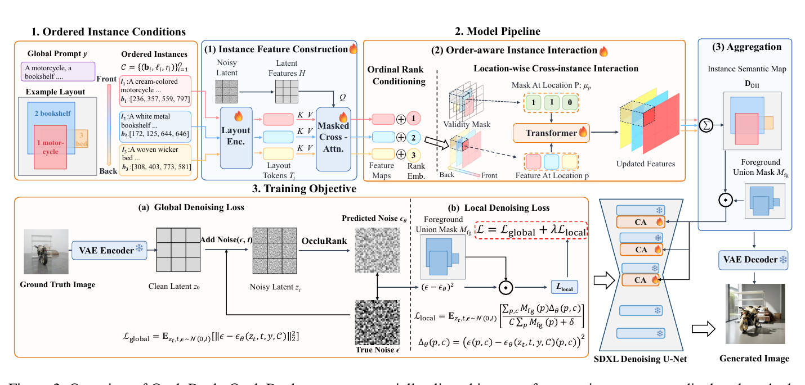
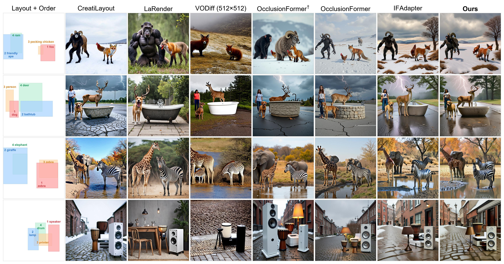

# AI Daily

> **日期**：2026-08-25（UTC）
> **作者**：Manus AI
> **今日主題**：OccluRank——只為每個 bounding box 增加一個 ordinal rank，就能控制 layout-to-image 生成中的物件前後遮擋順序。

## 今日結論

今日最值得深入閱讀的論文是 **OccluRank: Controllable Occlusion-Aware Layout-to-Image Generation by Adding Just an Ordinal Rank**。它把一個長期被當成「生成器偶然學會的視覺先驗」的問題——重疊物件究竟誰在前、誰被遮住——改寫成明確的條件控制問題：每個 instance 只附加一個前後順序 rank，然後在特徵融合之前，於每一個重疊 latent location 上讓 instance representations 彼此互動。這個設計不需要 depth map、camera parameter、3D scene condition 或 inference-time latent optimization，卻在作者建立的遮擋基準上顯著改善 strict occlusion metrics。[1]

我選它還有第二個理由：它與近期 repository 已有的 training-free attention steering、VAR editing、JEPA 與 energy-based generation 文章形成互補。OccluRank 本身不是 training-free，也不是 JEPA 或 VAR 模型；但它提供了一個非常乾淨的研究接口，讓「相對順序」「局部競爭」「結構化條件」能被移植到 Energy-based Transformer、JEPA critic 或 visual autoregressive scale conditioning 中。

## 1. 候選篩選與去重

本次先檢查 `KaiCobra/AI_Daily` 目前已收錄的 2026 年 8 月文章，再搜尋 Hugging Face Papers Trending、arXiv 最新 Computer Vision submissions 與相關正式論文頁。儲存庫中已存在 UniJEPA、Orthogonal JEPA、V-RAE、EditMod、Semantic Steering、SparsePR、Scalable EBM 等近期主題，因此排除了同名或研究問題高度重複的文章。OccluRank、2608.21229、ES-VP 與 ProWorld 均未在儲存庫全文中出現。

| 候選 | 研究方向 | 取捨判斷 |
|---|---|---|
| **OccluRank** [1] | 最新 arXiv image generation、layout control、occlusion order、instance interaction | 直接命中圖像生成，方法簡潔而有完整資料集、表格和消融；選為今日主題 |
| **Anchoring Instruction Outside Mask** [6] | Diffusion Transformer、reference K/V caching、attention mask、image editing | 五張 reference 可達 3.92× 加速，但需要 velocity distillation 與 on-policy distillation，並非 training-free |
| **ES-VP** [7] | Energy-shaped dynamic visual prompting、parameter-efficient adaptation | energy-shaped 與使用者偏好相符，但主要是分類/模型適應，不是圖像生成 |
| **ProWorld** [5] | JEPA、雙曲 latent geometry、長期 goal-reaching | JEPA 數學與研究延伸性很強，但較偏視覺世界模型與規劃，非圖像生成 |

這個選擇也保留了論文分級的誠實性：OccluRank 的摘要頁目前只標示 **arXiv preprint**，沒有正式會議接收資訊，因此本文不把它宣稱為 CVPR、ICCV、ICML 或 NeurIPS 論文。相對地，報告會把 CVPR 2025 的 VODiff、ICCV 2025 的 IFAdapter、ICML 2026 的 OcclusionFormer 等已在原文中作為 baseline 或 related work 的研究單獨標明。[1] [2] [3] [4]

## 2. 論文基本資訊

| 欄位 | 內容 |
|---|---|
| 論文標題 | *OccluRank: Controllable Occlusion-Aware Layout-to-Image Generation by Adding Just an Ordinal Rank* |
| 作者 | Wenyang Hong、Yuan Wang、Yanbin Hao、Lanqing Xue、Ke Wang、Xiang Wang、Kuien Liu、Richang Hong |
| 發表狀態 | arXiv:2608.20932v1；提交於 2026-08-21；目前為 arXiv preprint |
| 研究單位 | Hefei University of Technology；University of Science and Technology of China；LCFC；ByteDance Inc.；Institute of Software, Chinese Academy of Sciences |
| Backbone | Stable Diffusion XL（SDXL）；預訓練 diffusion backbone 維持 frozen |
| 任務 | 輸入 global prompt、instance text、amodal bounding box 與 front-to-back rank，生成遵守位置、屬性與遮擋順序的圖像 |
| 代碼 | [作者公開的 OccluRank GitHub repository][8] |

> **作者摘要的核心主張**：layout-to-image 的 bounding boxes 能指定 instance 位置，卻無法表達 occlusion order；OccluRank 以一個 ordinal rank 和 Order-aware Instance Interaction（OII）模組，在 aggregation 前更新重疊 instance representations。[1]

## 3. 問題背景：bounding box 不是遮擋關係

一般 layout-to-image 系統把條件寫成「這個物件要出現在這個 box」，但兩個 box 發生空間重疊時，仍然缺少一個重要的非對稱關係：哪一個 instance 應該在前景，哪一個應該退到背景。沒有這個資訊，模型可能把兩個物件融合、漏掉其中一個，或產生與使用者意圖相反的 visibility boundary。OccluRank 將此任務稱為 **occlusion-aware layout-to-image generation**，目標同時包括 instance presence、位置、attribute consistency 和前後遮擋順序。[1]

既有方法大致可分成四類。第一類是從 attention 或 denoising trajectory 直接做 inference-time control，例如 BoxDiff、LoCo、Bounded Attention 與 VODiff；第二類需要額外幾何條件，例如 SeeThrough3D；第三類加入 point、box、mask 或 layer 等多重條件，例如 DC-ControlNet；第四類以 rendering 或 volumetric composition 建立前景優先權，例如 LaRender 與 OcclusionFormer。[1] [2] [4] 這些方法分別在控制精度、輸入複雜度、額外推理成本和訓練需求之間作取捨。

OccluRank 的設計重點不是重新發明一個更大的 generator，而是把順序資訊放在 **instance feature fusion 的正確時機**。IFAdapter 先分別建立 instance feature map，再以 location-dependent scalar gate 聚合；這能改善定位，卻沒有顯式告知模型哪個 instance 是 foreground。OccluRank 因此採用 interaction-before-aggregation：先讓同一 latent location 上互相競爭的 instance tokens 交換資訊，最後才聚合成 Instance Semantic Map（ISM）。[1] [3]

## 4. 方法總覽

*圖 1。OccluRank 的方法流程。論文原圖 Figure 2 經 PDF 局部裁切，保留方法流程並排除整頁正文。[1]*

### 4.1 有序的 instance condition

令 global prompt 為 \(y\)，共有 \(O\) 個 instance。OccluRank 將 layout condition 寫成

$$ \mathcal{C}=\left\{(\mathbf b_i,\ell_i,r_i)\right\}_{i=1}^{O}, \qquad \{r_i\}_{i=1}^{O}=\{1,2,\ldots,O\}, $$

其中 \(\mathbf b_i=(x_{i0},y_{i0},x_{i1},y_{i1})\) 是 instance \(i\) 的 2D **amodal** bounding box，\(\ell_i\) 是 instance description，\(r_i\) 是 front-to-back ordinal rank。論文採用較小 rank 表示較前景的位置，因此若兩個 instance 的 box 重疊，\(r_i<r_j\) 代表 \(i\) 應出現在 \(j\) 前方並遮住 \(j\) 的一部分。[1]

這裡的 rank 是相對次序，不是公制深度。這個區分很重要：模型不需要知道兩個物件相距幾公分，只需要知道在重疊區域誰享有 visibility priority。

### 4.2 Per-instance feature construction

先由 layout encoder 把每個 box 與文字 description 轉成 layout tokens：

$$ \mathbf T_i=\Phi_{\mathrm{layout}}(\mathbf b_i,\ell_i)\in\mathbb R^{L_T\times C}. $$

令當前圖像 latent feature 為 \(\mathbf H\in\mathbb R^{N\times C}\)，其中 \(N\) 是 latent spatial locations 數量。對 instance \(i\)，圖像 feature 提供 query，layout tokens 提供 key 與 value，並以 box 產生的 spatial mask 限制其作用範圍：

$$ \mathbf F_i=\mathrm{MaskAttn} \left(\mathbf H\mathbf W_Q, \mathbf T_i\mathbf W_K, \mathbf T_i\mathbf W_V;\mathbf M_i\right). $$

若 \(\Omega(\mathbf b_i)\) 是 box 覆蓋的 latent locations，則 additive mask 可寫成

$$ M_i(p,q)= \begin{cases} 0, & p\in\Omega(\mathbf b_i),\\ -\infty, & p\notin\Omega(\mathbf b_i). \end{cases} $$

因此每個 instance 先取得保留自身語義與空間 support 的 feature map，而不是在一開始就把所有 instance 混成一張 feature map。

### 4.3 Ordinal rank conditioning

模型學習一個 rank embedding table \(\mathbf E_{\mathrm{rank}}\in\mathbb R^{O_{\max}\times C}\)，將 instance 的 ordinal rank 轉成

$$ \mathbf e_i^r=\mathbf E_{\mathrm{rank}}[r_i]. $$

令 \(\mu_i(p)\in\{0,1\}\) 表示 instance \(i\) 是否覆蓋 latent location \(p\)，則 rank-conditioned feature 為

$$ \mathbf X_i(p)=\mu_i(p)\left(\mathbf F_i(p)+\mathbf e_i^r\right). $$

這個公式的精髓是：rank embedding 不是最後才拿來調整 scalar weight，而是先加入每一個 instance feature，讓後續 Transformer 能根據「誰在前、誰在後」改變 feature content。

### 4.4 OII：在每個 latent location 上做 instance-wise Transformer

對某個 latent location \(p\)，收集所有覆蓋該位置的 instance slots：

$$ \mathbf X_p=\left[\mathbf X_1(p);\ldots;\mathbf X_O(p)\right]. $$

這些 row 不是不同空間 token，而是 **同一空間位置上的不同 instance token**。OII 使用一個沿 instance dimension 運作的 Transformer block：

$$ \widetilde{\mathbf X}_p =\mathrm{TransformerBlock}(\mathbf X_p;\boldsymbol\mu_p), \qquad \boldsymbol\mu_p=[\mu_1(p),\ldots,\mu_O(p)]. $$

因此，當一個位置同時被 zebra 與 giraffe 的 box 覆蓋時，兩個 instance representation 可以在仍保持分離的狀態下互相讀取。前景 instance 可根據背景 instance 的語義與 rank 調整自己的 channel-level representation；這比只在最後乘上一個 scalar gate 更有表達力。

接著把更新後的 instance feature 聚合成 ISM：

$$ \mathbf D_{\mathrm{OII}}(p) =\sum_{i=1}^{O}\mu_i(p)\widetilde{\mathbf X}_i(p). $$

最後只在所有 instance 的 union region 注入 gated residual：

$$ \mathbf H' =\mathbf H+\gamma\,\mathbf M_{\mathrm{fg}}\odot\mathbf D_{\mathrm{OII}}, \qquad \gamma=s\tanh(\alpha), $$

其中 \(\mathbf M_{\mathrm{fg}}\) 是所有 instance region 的 union mask，\(s\) 是 adapter scale，\(\alpha\) 是 learnable residual gate。這讓 order-aware signal 只影響 layout-conditioned region，不會無限制地改寫整張圖像的背景先驗。[1]

### 4.5 Global + local denoising objective

OccluRank 沒有只使用標準 global diffusion loss。令 \(z_t\) 是 timestep \(t\) 的 noisy latent，\(\epsilon\) 是加入的高斯噪聲，global denoising loss 為

$$ \mathcal L_{\mathrm{global}} =\mathbb E_{z_t,t,\epsilon\sim\mathcal N(0,I)} \left[ \left\|\epsilon- \epsilon_\theta(z_t,t,y,\mathcal C) \right\|_2^2 \right]. $$

由於物件和遮擋邊界只佔整張 latent 的一小部分，作者另外定義 foreground-union region 的 local denoising loss。令每個位置與 channel 的誤差為

$$ \Delta_\theta(p,c)= \left( \epsilon(p,c)- \epsilon_\theta(z_t,t,y,\mathcal C)(p,c) \right)^2, $$

則

$$ \mathcal L_{\mathrm{local}} =\mathbb E \left[ \frac{\sum_{p,c}M_{\mathrm{fg}}(p)\Delta_\theta(p,c)} {C\sum_pM_{\mathrm{fg}}(p)+\delta} \right]. $$

完整目標為

$$ \mathcal L =\mathcal L_{\mathrm{global}} +\lambda\mathcal L_{\mathrm{local}}. $$

作者的解釋是，global loss 維持整體圖像品質，而 local loss 讓 instance structure 與 visibility boundary 得到足夠 supervision。實作中 \(\lambda=2.0\)、\(\delta=10^{-8}\)。[1]

### 4.6 訓練與推理設定

SDXL backbone 保持 frozen，只訓練 layout-conditioning pathway、ordinal rank embedding、OII block 與 residual injection parameters。每個 instance 由 SDXL text encoder 的三個 hidden-state layers 和每層四個 Resampler query tokens 建立，共得到 \(L_T=13\) 個 layout tokens；最多支援 \(O_{\max}=5\) 個 instance。OII 是一層沿 instance dimension 運作的 Transformer，並只注入 SDXL middle block 與最低解析度 upsampling block 的指定 cross-attention layers。[1]

訓練在 1024×1024 resolution、單張 NVIDIA RTX PRO 6000 GPU 上進行，AdamW learning rate 為 \(10^{-4}\)，effective batch size 為 160，共 1,500 optimization steps，使用 bf16 mixed precision。推理時採 30 個 denoising steps、classifier-free guidance scale 7.5、1024×1024 resolution。[1] 因此要嚴格區分：**frozen backbone 不等於 training-free**；OccluRank 仍需要在 OccluLayout 上訓練一個新的 adapter 與 OII 模組。

## 5. OccluLayout 與 OccluLayout-Bench

作者以 Blender 建立可控制的 3D scenes，使用 71 個常見物件類別，每個 scene 隨機放置 2–5 個物件，改變 position、scale、orientation 與 camera viewpoint，再排除物理互相穿透的場景。每個 accepted scene 產生 1024×1024 RGB image；amodal mask 透過隱藏其他物件後單獨渲染取得，front-to-back order 則直接由 camera-coordinate 中的相對位置推導，而不是從部分遮擋的 RGB image 反推。[1]

為提高背景與 appearance diversity，作者再用 FLUX.2 4B 編輯背景與部分物件的顏色/texture，並用 Qwen3-VL-235B-A22B-Instruct 驗證物件是否仍在 box 內、生成 global caption 和 instance-level descriptions。為避免語義洩漏，instance description 不包含 contact、support、containment 或 occlusion 等物件間關係。[1]

| Split | Images | Instances | Avg. instances/image | Images with box overlap | Mean max pairwise box IoU |
|---|---:|---:|---:|---:|---:|
| Train | 33,496 | 114,047 | 3.40 | 78.8% | 0.2215 |
| OccluLayout-Bench | 1,000 | 3,386 | 3.39 | 77.2% | 0.2190 |

完整資料集共有 34,496 images 與 117,433 instances。OccluLayout-Bench 的 1,000 images 中，有 772 張包含至少一個 overlapping pair，共 1,762 個重疊 pairs；其中 503 張至少含兩個重疊 pair。[1]

評測不只問「遮擋順序對不對」，而是同時衡量五個面向：**Presence**、**Box mIoU**、**Color/Texture**、**Strict Pair/Strict Image** 與 **FID**。Presence、Box mIoU、Color、Texture 由 MLLM 依 instance 評估；Strict Pair 要求兩個 instance 都被辨識且前後關係正確；Strict Image 則要求同一張圖中的所有 overlapping pairs 都正確；FID 衡量整體圖像分布品質。作者用 Qwen3-VL-235B-A22B、Qwen3-VL-32B 與 GLM-4.6V 三個 evaluator 分開回報，避免把單一 MLLM 的絕對分數誤當成唯一真值。[1]

## 6. 實驗結果

### 6.1 主要比較：MLLM 評測

下表整理論文 Table 1 中 OccluRank（Ours）與直接架構 baseline IFAdapter 的結果；MLLM 指標為百分比，FID 越低越好。三個 evaluator 都顯示 OII + rank conditioning 在 Strict Pair 與 Strict Image 上有明顯改善，而整體 FID 仍與 baseline 接近。[1]

| Evaluator | Method | Presence ↑ | Box mIoU ↑ | Color ↑ | Texture ↑ | Strict Pair ↑ | Strict Image ↑ | FID ↓ |
|---|---|---:|---:|---:|---:|---:|---:|---:|
| Qwen3-VL-235B-A22B | IFAdapter | 90.17 | 60.80 | 83.46 | 74.84 | 66.06 | 51.55 | 62.923 |
| Qwen3-VL-235B-A22B | OccluRank | **91.58** | **63.20** | **85.23** | **76.02** | **76.45** | **62.44** | 62.746 |
| Qwen3-VL-32B | IFAdapter | 91.44 | 60.87 | 82.59 | 73.19 | 66.46 | 51.42 | 62.923 |
| Qwen3-VL-32B | OccluRank | **92.50** | **64.23** | **83.92** | 72.92 | **77.07** | **62.82** | 62.746 |
| GLM-4.6V | IFAdapter | 91.79 | 61.68 | 86.64 | 72.13 | 59.93 | 44.69 | 62.923 |
| GLM-4.6V | OccluRank | **92.85** | **64.13** | **87.79** | **73.23** | **67.31** | **52.46** | 62.746 |

作者指出，相對 IFAdapter，OccluRank 的 Strict Pair 提升 7.38–10.61 percentage points，Strict Image 提升 7.77–11.40 points；這個 controlled comparison 支持「先 interaction、後 aggregation」比單純重加權更能處理 overlapping conditions。[1]

定性結果也呈現相同趨勢：LaRender、VODiff 和 OcclusionFormer 在部分案例會漏掉 instance；CreatiLayout 與 IFAdapter 通常能生成較合理的 composition，但在密集重疊時仍可能出現 instance confusion 或 ordering error。OccluRank 較能保留指定物件、遵守 box 並建立連貫的 visibility boundary。[1]

*圖 2。相同 Layout + Order 條件下的定性比較。左側是輸入 layout/order，右側依序為各 baseline 與 OccluRank；圖中可觀察到物件保留、位置遵循與前後遮擋差異。[1]*

### 6.2 專用的 occlusion/depth order 指標

為降低對 MLLM 的依賴，作者再用 SAM 3 取得 visible instance masks，交由 InstaOrderNet 與 InstaDepthNet 預測 pairwise occlusion/depth relation。Occ. 是 occlusion-order F1，越高越好；Dep. 是 depth-order WHDR，越低越好。[1]

| Method | Venue | Occ. F1 ↑ | Dep. WHDR ↓ |
|---|---|---:|---:|
| CreatiLayout | ICCV 2025 | 0.7552 | 0.2244 |
| LaRender | ICCV 2025 | 0.5908 | 0.4392 |
| OcclusionFormer† | ICML 2026 | 0.8184 | 0.2126 |
| OcclusionFormer（reproduced） | ICML 2026 | 0.7531 | 0.2423 |
| VODiff | CVPR 2025 | 0.7065 | 0.2548 |
| IFAdapter | ICCV 2025 | 0.7987 | 0.1993 |
| **OccluRank** | arXiv preprint | **0.8577** | **0.1844** |

OccluRank 在這兩個專用指標都排名第一，但不能把這個結果直接解讀為全面超越所有方法：VODiff 在 512×512 評估，其他多數方法在 1024×1024；OcclusionFormer 的官方訓練代碼不可用，作者採 best-effort reproduction，並另列未在 OccluLayout 上訓練的官方 checkpoint（†）。這些 protocol 差異應在閱讀表格時保留。[1] [2]

### 6.3 消融：rank、interaction 與 local loss 各自做了什麼

| Variant | Occ. F1 ↑ | Dep. WHDR ↓ |
|---|---:|---:|
| IFAdapter | 0.7987 | 0.1993 |
| Scalar Reweight（以 scalar weight 取代 OII） | 0.8127 | 0.2073 |
| w/o Local Loss | 0.8400 | 0.1866 |
| w/o Rank Embedding | 0.8279 | 0.1859 |
| **OccluRank** | **0.8577** | **0.1844** |

把 OII 換成 scalar reweight 仍比 IFAdapter 好，表示顯式加入順序資訊有用；但 full OII 更好，因為它更新的是 high-dimensional instance representation，而非只改變每個 feature 的貢獻比例。移除 local loss 對 Box mIoU 影響不大，卻使 Strict Pair 下降 1.48–5.56 points、Strict Image 下降 1.55–8.03 points；這表示 local objective 主要改善 instance structure 與 coherent boundaries。移除 rank embedding 後，Strict Pair 下降 2.33–3.86 points、Strict Image 下降 2.20–5.95 points，因為 instance-wise Transformer 雖然仍能交換語義，卻沒有明確的前後非對稱訊號。[1]

更有說服力的控制實驗是 **reversed-order test**：保持 global prompt、instance descriptions 和 bounding boxes 不變，只把 front-to-back order 反轉。完整 OccluRank 會跟著輸入順序反轉可見性關係，而移除 rank embedding 的模型產生幾乎不變的 occlusion pattern。這說明模型不是只依賴「某些語義通常在前景」的資料先驗，而是真的讀取 rank condition。[1]

## 7. 相關研究定位

| 研究 | 核心控制訊號 | 是否 training-free | 與 OccluRank 的差異 |
|---|---|---:|---|
| GLIGEN、LayoutDiffusion [1] | box/layout grounding | 否／依模型而定 | 解決位置與語義 grounding，但一般不顯式表示 z-order |
| BoxDiff、LoCo、Bounded Attention [1] | inference-time attention 或 box constraint | 是 | 不需訓練，但控制通常依賴 attention manipulation；遮擋交互未必被學成 feature-level relation |
| VODiff [2] | Sequential Denoising Process + Visibility-Order-Aware attention loss | **是** | 以多階段去噪與 attention-map optimization 控制 visibility order，另有 200-sample VOBench |
| IFAdapter [3] | instance semantic map + location-dependent gated aggregation | 否 | 是 OccluRank 的直接架構 baseline，但缺少 explicit order 與 cross-instance interaction |
| SeeThrough3D [1] | 3D scene representation、camera geometry、hidden-region cues | 否／需複雜條件 | 控制訊號更豐富，但輸入與 preprocessing 更重 |
| OcclusionFormer [4] | learned density、opacity、transmittance、Z-order | 否 | 以 volumetric composition 建模遮擋；OccluRank 只需 rank，並以 OII 在 aggregation 前互動 |
| **OccluRank** [1] | bounding box + one ordinal rank + OII | **否** | 把相對順序作為輕量條件，避免額外 depth/3D condition，代價是需訓練 adapter |

這條研究脈絡顯示 OccluRank 的真正新意不是「第一個控制遮擋」，而是用一個很小的 discrete relational condition，將 visibility order 放進 instance representation interaction。它在輸入簡潔性與 feature expressiveness 之間找到一個合理折衷。

## 8. 個人評價與可激發的研究方向

### 8.1 優點：把「順序」從 scalar gate 升級成關係建模

OccluRank 最值得保留的抽象不是 rank embedding 本身，而是 **interaction-before-aggregation**。若先聚合，模型只能在一張混合 feature map 上猜測誰應該被保留；若先互動，模型仍保有 instance identity，能讓每個 channel 根據其他 competing instance 的語義與順序改變。這是從「feature weighting」走向「relation-conditioned feature rewriting」的差異。

第二個優點是資料與評測設計相對完整。OccluLayout 把 z-order、amodal box 和 amodal mask 由同一個 3D scene geometry 產生，避免事後由部分可見影像估計隱藏區域；OccluLayout-Bench 又把 presence、layout、attribute、order 和 FID 分開，降低只追逐單一 order score 的風險。[1]

### 8.2 限制：不是 training-free，且 synthetic benchmark 仍可能有偏差

第一，模型需要在 33,496 張 synthetic training images 上訓練 adapter，且每次 inference 仍要建構 per-instance features、執行 OII 和注入 SDXL attention。因此不能把它與 VODiff、BoxDiff 或其他 inference-only 方法直接視為同一類 training-free 方法。[1] [2]

第二，OccluLayout 雖然幾何標註一致，卻仍是 Blender scene 加 FLUX.2 appearance editing 的合成資料；Qwen3-VL 也同時參與資料驗證、caption 生成和一部分 benchmark 評估。多個 MLLM evaluator 能降低單一評測器偏差，但無法完全排除 evaluator 與資料生成器共享的語義偏差。[1]

第三，baseline 的 backbone、resolution、sampling protocol 並不完全一致。VODiff 在 512×512 生成，其他方法多為 1024×1024；OcclusionFormer 需要作者自行 reproduction。這不否定 OccluRank 的控制效果，但意味著比較更適合解讀為「在作者定義的 protocol 下，結構化 order metrics 最佳」，而不是無條件宣稱整體生成品質 SOTA。[1] [2]

第四，unseen-category generalization 目前主要以 qualitative examples 呈現。作者確實展示 training categories 以外的物件仍能遵循指定遮擋關係，但尚未提供像 Strict Pair、Strict Image 那樣完整的 category-disjoint quantitative table。[1] 這正是後續工作應補上的實驗。

### 8.3 與 Energy-based Transformer 的連接：把 rank 變成 pairwise energy

可以把 OII 改寫成一個局部的 pairwise energy minimization。對在 location \(p\) 重疊的 instance pair \(i,j\)，令 \(r_i<r_j\) 表示 \(i\) 應在前方，定義一個順序能量：

$$ E_{\mathrm{occ}}(i,j;p) =\mathrm{softplus} \left( m + s_\phi(\mathbf X_j(p),\mathbf X_i(p)) - s_\phi(\mathbf X_i(p),\mathbf X_j(p)) \right), $$

其中 \(s_\phi(\mathbf X_i,\mathbf X_j)\) 是「\(i\) 應該覆蓋 \(j\)」的 compatibility score，\(m\) 是 margin。總能量可寫成

$$ E(\mathbf X;\mathbf r) =E_{\mathrm{denoise}}(\mathbf X) +\beta\sum_{p} \sum_{(i,j)\in\mathcal P(p)} \mathbf 1[r_i<r_j]E_{\mathrm{occ}}(i,j;p). $$

這不是 OccluRank 論文提出的公式，而是基於其 rank-conditioned interaction 的研究延伸。它提供一個可測試的假說：如果 visibility order 被當成局部 energy constraint，是否能在不重新訓練完整 SDXL 的情況下，用 Langevin、gradient guidance 或 contrastive energy correction 修正局部遮擋？這也能連接到 repository 既有的 Scalable EBM，但必須實驗驗證，不能把 speculative energy 寫法當成本文方法。

### 8.4 與 JEPA 的連接：用 predictive critic 判斷遮擋是否「走向正確狀態」

JEPA 的核心優勢是比較 latent state，而不是要求每一步都在 pixel space 重建。可以令 \(h_t\) 表示 denoising timestep \(t\) 的 layout-conditioned latent，建立一個預測器

$$ \widehat h_{t+\Delta} =g_\psi(h_t,\mathbf r,\mathcal C), $$

再用一個 order-aware target encoder 產生期望的 \(h^{\star}_{t+\Delta}\)。訓練時加入

$$ \mathcal L_{\mathrm{JEPA-occ}} =\left\| \operatorname{sg}(h^{\star}_{t+\Delta}) -\widehat h_{t+\Delta} \right\|_2^2 +\eta E_{\mathrm{occ}}(\widehat h_{t+\Delta};\mathbf r). $$

在推理時，這個 critic 可以檢查目前 latent 是否仍然保留「foreground instance 逐步壓過 background instance」的結構，而不是只看當前 attention map。它特別適合 long denoising trajectory 或 video editing：若遮擋關係在中途 drift，critic 可在下一步調整 rank-conditioned residual。這個方向把 OccluRank 的靜態 order control，連接到 ProWorld、UniJEPA 和 Orthogonal JEPA 所關注的 latent dynamics，但目前只是研究假說。[5]

### 8.5 與 VAR 的連接：把 ordinal rank 變成 scale-wise causal condition

如果把 OccluRank 的思想移植到 visual autoregressive model，可以在 coarse-to-fine token hierarchy 中加入 rank token。對第 \(s\) 個 scale 的 token \(x_{s,k}\)，令 \(e(r_i)\) 是 object rank embedding，並以

$$ q_{s,k}=W_Qx_{s,k}, \qquad k_{s,k}=W_K[x_{s,k};e(r_i)], $$

讓 attention score 具備 order condition：

$$ A_{s,k}(i,j) =\frac{q_{s,k}^{\top}k_{s,k}(j)}{\sqrt d} +\alpha_s\,\phi(r_i,r_j). $$

在 coarse scale，rank token 可以先決定大致的 front/back composition；到 fine scale，OII-like interaction 只在重疊 region 的 token subset 上運作。若第 \(p\) 個位置有 \(k_p\) 個 active instances，instance-wise attention 的額外成本約為

$$ O\left(\sum_p k_p^2 C\right), $$

而不是對所有 image tokens 做全域 instance interaction。這種稀疏性可能與 VAR 的 cross-scale attention reuse、KV compression 或 sparse attention 研究互相補強。

### 8.6 Training-free 與 zero-shot 的可驗證路線

若目標是 training-free，可先保留 frozen SDXL/DiT，從現有 instance attention map 估計每個 overlapping pair 的 order margin，再以 rank-conditioned residual 做 closed-form steering，而不是訓練 OII。實驗應該直接比較：純 scalar reweight、attention-map steering、OII adapter 與完整 training-free energy guidance，並固定 backbone、resolution、scheduler 和 denoising steps。

若目標是 zero-shot，則不能只展示幾張 unseen-category 圖。應把 71 個類別拆成 category-disjoint train/test，再新增完全未見的 object combinations、未見的 overlap depth、未見的 rank permutation，回報 Presence、Strict Pair、Strict Image、FID 和 calibration error。尤其要測試「相同 box、相同語義、只反轉 rank」的 paired counterfactual set，確認模型真的因 rank 改變，而不是依賴某個 category 的 appearance prior。

## 9. 最終評價

OccluRank 的技術貢獻不在於使用一個複雜的大模型，而在於提出一個清晰的 relational inductive bias：**遮擋順序應在 instance representations 仍然分離時被建模，然後才進行 aggregation**。實驗中 rank embedding、OII 與 local denoising objective 的消融趨勢一致支持這個設計；專用 order metrics 也比單純 FID 更能捕捉它真正解決的問題。[1]

我的總評是：這是一篇值得納入研究者閱讀清單的近期 arXiv 圖像生成論文，尤其適合思考「如何把相對關係變成生成模型的局部條件」這個問題。它目前的主要不足是需要額外訓練、資料與評測仍帶有 synthetic/MLLM bias，而且與 training-free 方法的 protocol 尚未完全公平對齊。若把 ordinal rank 從 learned embedding 推進成 energy、JEPA predictive critic 或 VAR scale-wise causal signal，可能會得到比單純再加一個 control branch 更有研究價值的下一步。

## References

[1]: https://arxiv.org/html/2608.20932v1 "OccluRank: Controllable Occlusion-Aware Layout-to-Image Generation by Adding Just an Ordinal Rank"
[2]: https://openaccess.thecvf.com/content/CVPR2025/html/Liang_VODiff_Controlling_Object_Visibility_Order_in_Text-to-Image_Generation_CVPR_2025_paper.html "VODiff: Controlling Object Visibility Order in Text-to-Image Generation, CVPR 2025 Open Access"
[3]: https://arxiv.org/abs/2409.08240 "IFAdapter: Instance Feature Control for Grounded Text-to-Image Generation"
[4]: https://arxiv.org/abs/2605.21343 "Arranging Z-Order for Layout-Grounded Image Generation"
[5]: https://arxiv.org/abs/2608.01926 "ProWorld: Progress-Aware Hyperbolic World Models for Long-Horizon Visual Goal Reaching"
[6]: https://arxiv.org/abs/2608.21229 "Anchoring Instruction Outside Mask: Exact Reference Caching for Efficient In-Context Diffusion Transformers"
[7]: https://arxiv.org/abs/2608.21194 "ES-VP: Energy-Shaped Dynamic Visual Prompting for Efficient Model Adaptation"
[8]: https://github.com/Wenyang-hong/OccluRank "Official OccluRank code repository"
