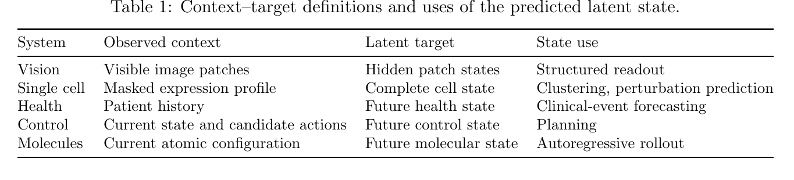
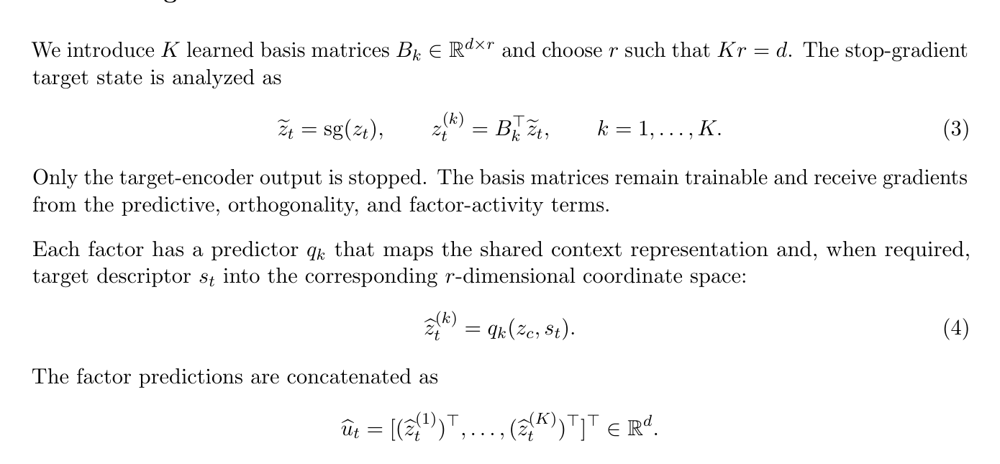

# AI Daily

## 今日精選：Orthogonal JEPA

**研究日期：** 2026-08-24　　**作者：** Manus AI　　**論文日期：** 2026-08-20　　**來源：** arXiv:2608.20065v1 [cs.LG] [1] [2]

> 本日精選 **Orthogonal JEPA: Factorized Predictive States for Latent World Models**。它沒有再把 JEPA 的 target state 當成一個不可分割的向量，而是將 target latent 分解成多個由 learned basis 定義的 predictive factors，再為每個 factor 配置獨立的 prediction branch，最後重新合成完整狀態。[1]

這篇工作特別值得閱讀，原因是它直接命中近期值得追蹤的三條線：**JEPA 的世界模型化、energy-based latent compatibility，以及將模型內部表徵拆成可控制結構**。它不是圖像生成模型，也不是 training-free inference 方法；但是，它提供了一個能接到 image generation、VAR、attention modulation 與 zero-shot evaluation 的「中介狀態介面」。更重要的是，論文把「單一路徑被高變異或容易預測的訊號主導」重新表述成 **predictive capacity allocation** 問題。[1]

## 一、為什麼選這篇？

本次先檢查 `KaiCobra/AI_Daily` 的既有文章與索引，排除了已經收錄的 HRDiT、Energy-Guided Flow Matching、GATO-Vid、JoyAI-Video-Edit 等候選；Orthogonal JEPA 雖然曾在既有 WithEveryone 報告中作為相關工作被提到，但 repo 尚沒有它的獨立 AI Daily 文章。與單純追逐最新生成模型相比，本篇更符合本期想激發 **JEPA、Energy-based Transformer 與可組合 latent state** 想法的目標。

| 篩選面向 | 判斷 | 評價 |
|---|---|---|
| 時效性 | arXiv v1 於 2026-08-20 提交，距研究日期四天 | 高 |
| 作者與研究單位 | Taoyong Cui、Pheng-Ann Heng、Wanli Ouyang；arXiv 頁面標示 CUHK | 高 |
| 研究問題 | 以多個結構化 predictive factors 取代單一 JEPA target pathway | 高 |
| 會議狀態 | arXiv 摘要頁只有 cs.LG 分類與 v1，未列出會議或期刊錄用資訊 | 中；須如實稱為預印本 |
| 與近期偏好的吻合 | 直接對應 JEPA 與 energy-based latent prediction；可延伸至 VAR、attention modulation、zero-shot，但不是 training-free | 高 |
| 可延伸性 | 同一介面被測試於視覺、單細胞、健康、控制與分子動力學 | 高 |

作者背景也增加了這篇工作的可信度與跨領域價值。CUHK 官方資料顯示，Wanli Ouyang 的研究涵蓋 AI for Science、computer vision、pattern recognition 與 machine learning，並曾參與 ImageNet 與 COCO detection 的高水平研究；Pheng-Ann Heng 則是 CUHK 工程學院研究副院長、電腦科學與工程學講座教授，研究包含 medical image analysis、AI、visualization 與 extended reality。[7] [8] 這些背景支持作者團隊具有視覺與跨領域 representation learning 經驗，但不等同於本論文已獲頂會接收。

## 二、論文基本資訊

| 欄位 | 內容 |
|---|---|
| 論文標題 | Orthogonal JEPA: Factorized Predictive States for Latent World Models |
| 作者 | Taoyong Cui、Pheng-Ann Heng、Wanli Ouyang |
| 研究機構 | The Chinese University of Hong Kong（CUHK） |
| 發表狀態 | arXiv:2608.20065v1，2026-08-20；目前為預印本 |
| 研究領域 | Machine Learning（cs.LG） |
| 核心任務 | 從 context representation 預測可分解的 target latent state |
| 評估範圍 | controlled vision、single-cell transcriptomics、longitudinal health、continuous control、molecular dynamics |
| 主要方法 | learned basis matrices、factor-specific predictors、orthogonality、factor activity 與 online variance regularization |

論文的研究主張可以用一句話概括：**讓 JEPA 不只預測「下一個 latent」，而是預測一組方向彼此分離、幅度可重建、可被下游讀取的 latent components。** 它的 target 可以是時間上的未來狀態，也可以是被遮蔽的空間 patch、完整細胞狀態或分子系統的下一狀態；因此作者所謂的 world model 並不限定為 pixel generation 或顯式 simulator。[1]

## 三、相關背景：從 I-JEPA、V-JEPA 到 Orthogonal JEPA

I-JEPA 的原始構想是從單一 context block 預測同一張影像中多個 target block 的表示，而不是重建像素；作者特別強調 target block 要有足夠的尺度以承載語義，context 也要在空間上提供足夠資訊。[3] V-JEPA 將相同思路延伸至視頻：以時空遮罩迫使模型預測抽象的 video representation，避免把不可預測的逐像素細節當成學習目標。[4] V-JEPA 2 再把這條路線推向 web-scale video pretraining、action anticipation 與 latent action-conditioned robotic planning。[5]

Orthogonal JEPA 的增量不在於重新發明 context–target prediction，而在於重新設計 **target interface**。Cell-JEPA 已經展示從部分基因表達預測 cell-level latent embedding，可降低對稀疏技術噪聲的依賴；Orthogonal JEPA 進一步把這個 monolithic embedding 拆成多個 factor，並在同一個 Cell-JEPA 設定中觀察到更好的 zero-shot clustering 與 perturbation prediction。[6]

| 研究 | Context–target 關係 | 主要狀態形式 | Orthogonal JEPA 的關係 |
|---|---|---|---|
| I-JEPA，ICCV 2023 | 可見 image block → 隱藏 image block | 單一或整體 latent target | O-JEPA 將 target direction 分配給多個 predictor [3] |
| V-JEPA | 可見 video tubelet → 隱藏時空區域 | 抽象 video representation | O-JEPA 保留 latent prediction，增加 factorized target geometry [4] |
| V-JEPA 2 | 網路影片與少量 robot video → future/action-conditioned state | 視覺世界模型與 planning state | O-JEPA 更聚焦於 state capacity allocation，而非規模或 robotics deployment [5] |
| Cell-JEPA | 部分基因表達 → 完整 cell-level state | dropout-robust latent embedding | O-JEPA 將單一 embedding 改成 factorized embedding [6] |
| Orthogonal JEPA | visible/partial/current context → hidden/future target | 可合成、可讀出、可規劃的多 factor latent state | 本文方法 |

## 四、方法詳解：把 target state 拆成可預測因子

### 4.1 統一的 predictive-state interface

令 $\delta$ 表示一個 domain，原始觀測為 $x\sim\mathcal D_\delta$。domain adapter $\mathcal A_\delta$ 將觀測轉成 content tokens $H=\{h_i\}_{i\in\Omega}$，以及可選的結構描述 $S=\{s_i\}_{i\in\Omega}$。$s_i$ 可以代表 patch coordinate、timestamp、entity identity 或 target specification。view sampler $\mathcal V_\delta$ 再選出 context index $C$ 與 target index $T$：

$$
x\xrightarrow{\mathcal A_\delta}(H,S)\xrightarrow{\mathcal V_\delta}(H_C,S_C,T,S_T).
$$

online encoder 產生 context representation：

$$
z_c=f_\theta(H_C,S_C),
$$

target encoder 產生每一個 target 的表示：

$$
z_t=f_{\bar\theta}(H,S)_t\in\mathbb R^d,
$$

並以 exponential moving average 更新 target encoder：

$$
\bar\theta\leftarrow m\bar\theta+(1-m)\theta,
\qquad 0\le m<1.
$$

target encoder 不接收梯度，這保留了 JEPA 中 online encoder、EMA target encoder 與 representation prediction 的基本穩定性。[1]

**圖一。** 論文 PDF 第 3 頁的 Table 1 局部擷取。它顯示同一個介面如何被實例化為 hidden patch prediction、complete cell state、future health state、future control state 與 autoregressive molecular rollout；圖片是聚焦裁切，不是整頁截圖。[1]

### 4.2 Orthogonal predictive factorization

本文學習 $K$ 個 basis matrices：

$$
B_k\in\mathbb R^{d\times r},
\qquad Kr=d.
$$

對 stop-gradient 的 target state $\tilde z_t=\operatorname{sg}(z_t)$，第 $k$ 個 factor 的坐標為

$$
z_t^{(k)}=B_k^\top\tilde z_t,
\qquad k=1,\ldots,K.
$$

每一個 factor 擁有自己的 predictor $q_k$，由共享 context representation 與 target descriptor 預測該 factor：

$$
\hat z_t^{(k)}=q_k(z_c,s_t)\in\mathbb R^r.
$$

將所有 factor 串接成 $d$ 維向量：

$$
\hat u_t=\left[(\hat z_t^{(1)})^\top,\ldots,(\hat z_t^{(K)})^\top\right]^\top\in\mathbb R^d.
$$

再透過 analysis map 的 Moore–Penrose pseudoinverse 合成完整預測狀態：

$$
\hat z_t=(B^\top)^\dagger\hat u_t,
\qquad B=[B_1,\ldots,B_K].
$$

當 $B$ 真正正交時，$(B^\top)^\dagger=B$，因此

$$
\hat z_t=\sum_{k=1}^{K}B_k\hat z_t^{(k)}.
$$

這裡的要點不是把 hidden dimension 任意切成幾段，而是讓每一段都成為一個有明確座標系、可單獨預測、最後又能保留原始 state 幅度的 component。相比先將 embedding 做 normalization 再使用 cosine loss，本文的 factor regression 直接保留方向與 magnitude，避免合成 state 時遺失尺度資訊。[1]

**圖二。** 論文 PDF 第 3 頁第 2.2 節的局部擷取，包含 $Kr=d$、式 (3) 的 factor analysis、式 (4) 的 factor-specific predictor 與 concatenation；它用來輔助理解本文的核心資料流。[1]

### 4.3 損失函數與防崩潰設計

首先，factor prediction loss 直接回歸每個 target factor：

$$
\mathcal L_{\mathrm{pred}}
=\frac{1}{K|T|r}
\sum_{t\in T}\sum_{k=1}^{K}
\left\|\hat z_t^{(k)}-z_t^{(k)}\right\|_2^2.
$$

正交損失同時約束單一 factor 內的 basis columns 正交，以及不同 factors 之間的方向分離：

$$
\mathcal L_{\mathrm{orth}}
=\sum_{k=1}^{K}\left\|B_k^\top B_k-I_r\right\|_F^2
+\sum_{1\le i<j\le K}\left\|B_i^\top B_j\right\|_F^2.
$$

只要求 basis 正交仍不夠，因為某個 factor 可能在所有樣本上幾乎不變。因此，作者對 projected target coordinates 加入 factor-activity regularization；對 online encoder 的每一個 coordinate 則加入 variance regularization：

$$
\mathcal L_{\mathrm{fac}}
=\frac{1}{Kr}\sum_{k=1}^{K}\sum_{j=1}^{r}
\max\left(0,\gamma_{\mathrm{fac}}-\sigma^{\mathrm{fac}}_{k,j}\right),
$$

$$
\mathcal L_{\mathrm{enc}}
=\frac{1}{d}\sum_{j=1}^{d}
\max\left(0,\gamma_{\mathrm{enc}}-\sigma^{\mathrm{enc}}_{j}\right).
$$

完整核心目標為

$$
\mathcal L_{\mathrm{OJEPA}}
=\mathcal L_{\mathrm{pred}}
+\lambda_{\mathrm{orth}}\mathcal L_{\mathrm{orth}}
+\lambda_{\mathrm{fac}}\mathcal L_{\mathrm{fac}}
+\lambda_{\mathrm{enc}}\mathcal L_{\mathrm{enc}}.
$$

若某個 domain 本來就有標準 auxiliary loss，則再加入 $\lambda_{\mathrm{aux}}\mathcal L_{\mathrm{aux}}$。因此本文的防崩潰策略可以分成三層：**EMA target encoder** 提供穩定目標、**orthogonality** 避免不同 branch 重複相同方向，以及 **activity/variance** 避免某些方向或 coordinate 死亡。[1]

作者給出一個 exact orthogonal decomposition proposition：若 $B_i^\top B_j=0$（$i\ne j$）、$B_k^\top B_k=I_r$ 且 $Kr=d$，則對任意 $z\in\mathbb R^d$，

$$
\|B^\top z\|_2^2
=\sum_{k=1}^{K}\|B_k^\top z\|_2^2
=\|z\|_2^2,
\qquad
z=\sum_{k=1}^{K}B_kB_k^\top z.
$$

但這個命題只保證幾何分解，不保證 statistical independence、causal modularity 或 semantic disentanglement。這是閱讀本文時最重要的技術界線：**正交不等於語義已經被正確解耦。** [1]

## 五、實驗結果

作者在五類系統上固定 adapter、encoder family、context–target sampler、資料切分、optimization budget 與下游 readout，主要比較 monolithic JEPA target 和 factorized Orthogonal JEPA target。[1]

### 5.1 Controlled visual binding

在 controlled vision 任務中，模型要同時保留視覺變化發生的位置與變化操作，並在 readout 時測試訓練中未出現的 support–operation 組合。INJ 越高越好，collapse rate 越低越好，grid recovery 越高越好。

| Backbone | Model | INJ ↑ | Collapse ↓ | Recovery ↑ |
|---|---|---:|---:|---:|
| DINOv3 | Standard JEPA | 0.572 | 0.426 | 0.645 |
| DINOv3 | **Orthogonal JEPA** | **0.581** | **0.417** | **0.659** |
| SigLIP2 | Standard JEPA | 0.483 | 0.514 | 0.679 |
| SigLIP2 | **Orthogonal JEPA** | **0.490** | **0.503** | **0.688** |

增益不算巨大，但方向一致：在兩個 visual backbone 上，factorized target 都提升 held-out binding 與 grid recovery，同時降低 collapse。這比較像是「改善表徵幾何與容量分配」的證據，而非宣稱 O-JEPA 直接創造全新的視覺 backbone。[1]

### 5.2 Single-cell、health、control 與 molecular rollout

| 系統／指標 | Monolithic baseline | Orthogonal JEPA | 解讀 |
|---|---:|---:|---|
| PBMC zero-shot AvgBIO | Cell-JEPA 0.7194 | **0.7452** | factorized latent 提升 zero-shot clustering |
| PBMC finetuned AvgBIO | Cell-JEPA 0.7830 | **0.8001** | 表徵品質提升延續到 finetuning |
| Norman Pearson | 0.787 | **0.798** | perturbation absolute-state prediction 小幅改善 |
| Adamson Pearson | 0.937 | **0.942** | 同樣保持小幅提升 |
| Health mean PRAUC | 0.711 | **0.718** | 超過 1,000 個 clinical events 的 future-state prediction |

控制任務的差距更顯著。Walker2d 的 CEM planning return 從 Standard JEPA 的 $4.9\pm12.6$ 提升到 **$45.1\pm11.2$**；HalfCheetah 從 $-11.2\pm0.8$ 改善到 **$-8.5\pm0.6$**；InvertedPendulum 從 $18.1\pm2.3$ 提升到 **$30.6\pm3.8$**。[1]

在 force-free molecular dynamics 中，O-JEPA 也在四個系統上降低 one-step displacement MAE 與 100-step free autoregressive rollout 的 final-position RMSD。以 water 為例，MAE 由 0.00452 降至 **0.00376**，RMSD 由 2.536 Å 降至 **2.459 Å**；在 quartz、paracetamol 與 benzene 上也呈現一致但較小的改善。[1]

| 分子 | TrajCast-JEPA MAE / RMSD | Orthogonal JEPA MAE / RMSD |
|---|---:|---:|
| Water | 0.00452 / 2.536 Å | **0.00376 / 2.459 Å** |
| Quartz | 0.01043 / 1.912 Å | **0.01011 / 1.877 Å** |
| Paracetamol | 0.00777 / 1.868 Å | **0.00765 / 1.846 Å** |
| Benzene | $7.77\times10^{-5}$ / 0.0701 Å | **$7.65\times10^{-5}$ / 0.0699 Å** |

整體結果支持一個較保守但重要的結論：factorization 對 representation quality、forecasting、planning 與 long-horizon stability 都有正向訊號；其中 control planning 的改善最大，視覺與生醫任務則多為穩定的小幅增益。這也提醒我們不能只看單一 headline metric，應該把它視為一個通用 state interface 的設計研究。[1]

## 六、與 Energy-based Transformer、VAR、Attention Modulation 的連結

### 6.1 JEPA 可以被讀成 latent compatibility 或 energy landscape

I-JEPA 與後續 JEPA 工作通常在 representation space 進行 prediction，而不是還原所有觀測細節；這使它自然接近 energy-based learning 的觀點：context 與 target 的相容性可以用 latent prediction residual 表示。[1] [3] 對 Orthogonal JEPA 而言，一個方便的重新詮釋是

$$
E(z_c,z_t)
=\sum_{k=1}^{K}
\left\|q_k(z_c,s_t)-B_k^\top z_t\right\|_2^2
+\lambda_{\mathrm{orth}}\mathcal R_{\mathrm{orth}}(B)
+\lambda_{\mathrm{act}}\mathcal R_{\mathrm{act}}.
$$

這個式子是**我的研究性重寫，不是論文額外宣稱的 scalar EBM**。它把 O-JEPA 的 factor residual 視為一個可分析的 compatibility energy，但本文實際上仍是以 supervised latent regression 與 regularization 訓練，沒有提出對 energy 做 Langevin sampling、contrastive negative sampling 或 iterative equilibrium inference。因此，不應把 Orthogonal JEPA 直接稱為已完成的 Energy-Based Transformer；更精確的說法是，它提供了讓 EBT head 可以對不同 predictive factors 分別評分的幾何介面。

### 6.2 對 VAR 與圖像生成的啟發

本文沒有直接測試 image generation，也沒有報告 VAR benchmark；然而，Table 1 已明確保留 autoregressive rollout 的 state use。對 VAR 而言，可以把 learned factors 先解讀成粗粒度結構、物體關係、局部紋理或不確定性方向，再讓 next-scale predictor 依照 factor-specific budget 生成不同尺度的 token。這個方向比「對所有 token 使用同一個 KV/cache 或同一個 guidance」更接近結構化 autoregression，但必須額外設計 factor-to-token alignment，因為 O-JEPA 的 orthogonal basis 目前並不保證對應到人類可命名的語義。

### 6.3 對 training-free attention modulation 與 zero-shot 的啟發

Orthogonal JEPA 本身**不是 training-free**：它需要訓練 basis matrices、factor predictors，以及 activity/variance regularizers。可是，若模型已經得到一組 factorized predictive state，就可以在 frozen inference 時使用各 factor 的 prediction residual 作為 confidence signal。研究上可以測試下列介入：對第 $k$ 個 factor 的信心 $c_k$，在對應 token group 的 attention logit 加入

$$
A'_{q,j}=A_{q,j}+\eta_k\mathbf 1[j\in\mathcal G_k],
\qquad
\eta_k=\rho[\tau-c_k]_+,
$$

其中 $\mathcal G_k$ 是經過 factor-to-token alignment 得到的 token group。這個 attention modulation 是**未來研究構想，不是本論文方法**；它可以檢驗「某個 predictive factor 被忽略時，是否只需要調高其讀取權重」以及「提升 factor confidence 是否會導致過度控制或 mode collapse」。

zero-shot 評估則可以採用更嚴格的 protocol：凍結 online encoder 與 basis，只訓練線性 readout；在 visual binding 中留出新的 support–operation 組合，在 VAR 中留出新的 resolution/scale 組合，在 world model 中留出新的 dynamics regime。若 factorization 真正學到的是可重用的 predictive coordinates，而不是只對某個 benchmark 做額外容量擬合，這些 held-out compositional splits 應該會比 monolithic JEPA 更穩定。

## 七、批判性評價與限制

我給 Orthogonal JEPA **8.6/10**。最有價值的不是「用了 orthogonal loss」本身，而是作者把 latent target 的設計提升到模型架構層級：一個共享 context 可以服務多個 factor-specific prediction branch，而完整 state 又能被下游 readout、planner 或 autoregressive rollout 直接消費。這是一個相對乾淨的 interface-level idea，能跨越影像、醫療、控制與 AI for Science 任務。[1]

但技術上必須保持克制。第一，論文目前是 arXiv v1 預印本，沒有在 arXiv metadata 中列出 ICCV、CVPR、ICML、NeurIPS 或其他會議錄用資訊。[2] 第二，orthogonality 只保證幾何方向分離，不保證每個 factor 對應單一因果因素；作者自己也指出 variance regularization 不保證 covariance full rank。第三，predictor 是 deterministic，沒有明確表示 multimodal futures；對真實世界的多分支未來，單一均值式預測可能仍會模糊化不確定性。[1]

第四，實驗雖然跨領域，但尚未涵蓋 pixel-based closed-loop control、stochastic futures、continuous physical fields，以及具有已知 causal factors 的測試。尤其在視覺生成讀者最關心的 image fidelity、FID、CLIP score、VAR next-scale likelihood 或 diffusion sampling quality 上，本文沒有直接證據。因此，本篇應被視為**一個可接到生成模型的 latent predictive-state 設計**，而不是已經驗證的 image-generation SOTA。

## 八、結論：今天最值得帶走的研究問題

Orthogonal JEPA 的核心訊息是：當一個 latent state 同時包含局部與全局結構、多個互動實體、時間變化與不同難度的預測訊號時，將所有內容交給一個 monolithic prediction pathway 可能不是最好的容量分配方式。學習 basis、分開預測、再合成 state，讓 representation learning 具備了可診斷、可正則化、可接續下游模組的結構。

對接下來的研究，我最想測試的是一個三段式系統：先以 O-JEPA 式 factorization 建立 identity/layout/pose 或 object/scene/motion 的 predictive state；再把 factor residual 轉成 energy-based compatibility score；最後在 VAR 或 diffusion transformer inference 時，依照 factor confidence 做 training-free attention modulation。這個方向把 **JEPA 的抽象預測、EBT 的能量評分、VAR 的 coarse-to-fine 生成，以及 zero-shot 的 frozen transfer** 串在同一個可驗證假說上：**若模型能在生成前預測「哪一類結構將失真」，推理階段就不必對所有 attention 統一施力。**

## References

[1]: <https://arxiv.org/html/2608.20065> "Orthogonal JEPA: Factorized Predictive States for Latent World Models"

[2]: <https://arxiv.org/abs/2608.20065> "Orthogonal JEPA arXiv metadata and submission history"

[3]: <https://arxiv.org/abs/2301.08243> "Self-Supervised Learning from Images with a Joint-Embedding Predictive Architecture"

[4]: <https://ai.meta.com/blog/v-jepa-yann-lecun-ai-model-video-joint-embedding-predictive-architecture/> "V-JEPA: The next step toward advanced machine intelligence"

[5]: <https://arxiv.org/abs/2506.09985> "V-JEPA 2: Self-Supervised Video Models Enable Understanding, Prediction and Planning"

[6]: <https://arxiv.org/abs/2602.02093> "Cell-JEPA: Latent Representation Learning for Single-Cell Transcriptomics"

[7]: <https://research.cuhk.edu.hk/en/persons/wanli-ouyang/> "Wanli Ouyang — The Chinese University of Hong Kong"

[8]: <https://research.cuhk.edu.hk/en/persons/pheng-ann-heng/> "Pheng Ann Heng — The Chinese University of Hong Kong"

---

**資料與資產備註：** 本文的兩張圖片由 Orthogonal JEPA PDF 依 `/home/ubuntu/skills/pdf-image-extractor/` 規範嘗試抽取；因論文 PDF 主要是文字與向量排版，原生圖片抽取結果為 0 張，故改以 PDF 頁面渲染後裁切成聚焦圖片，均放置於 repository 的 `asset/Orthogonal-JEPA/`。圖片僅作為方法理解輔助，不替代表格中的定量證據。
