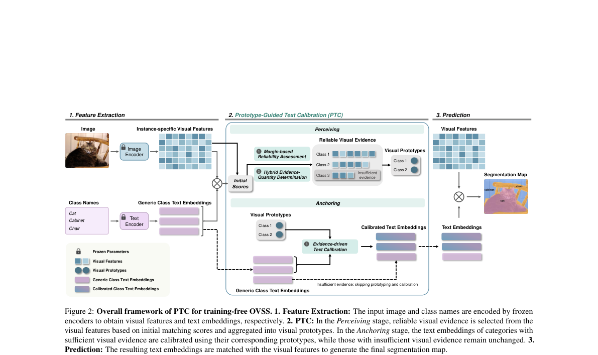
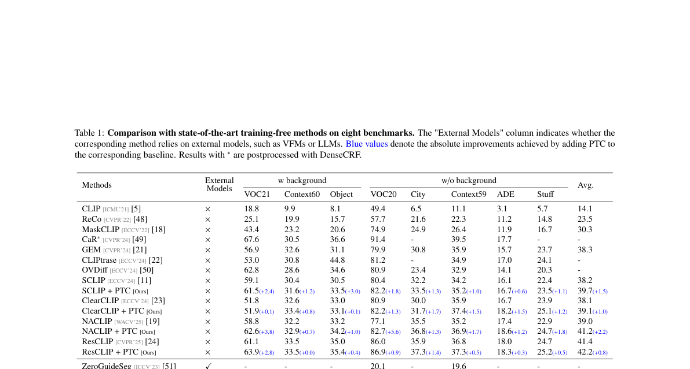
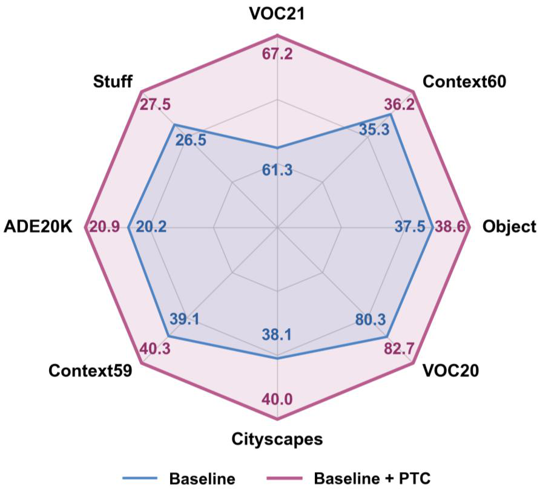

# AI Daily

## 論文基本資訊

| 項目 | 內容 |
|------|------|
| **論文標題** | Perceptual Anchoring: Prototype-Guided Text Calibration for Training-free Open-Vocabulary Semantic Segmentation |
| **作者** | Wanli Ma, Jiangwen Lu, Qinmu Peng, Xinge You |
| **研究單位** | 華中科技大學（HUST）、杭州電子科技大學 |
| **arXiv** | [2608.03991](https://arxiv.org/abs/2608.03991) |
| **發表時間** | 2026-08-04 |
| **領域** | Training-Free Open-Vocabulary Semantic Segmentation |
| **代碼** | [github.com/Valeria-MaW/PTC](https://github.com/Valeria-MaW/PTC) |

---

## 論文核心貢獻和創新點

在免訓練開放詞彙語義分割（Training-free OVSS）領域，現有方法大多專注於修改視覺特徵（Visual Representations）的提取過程，例如透過改進自注意力機制或引入外部視覺基礎模型（如 SAM、DINOv2）來增強局部感知與空間一致性。然而，這些方法普遍將由大型語言模型（LLMs）生成的類別文本嵌入（Text Embeddings）視為固定不變的分類參考標準。

本文作者敏銳地指出，這種做法忽略了一個關鍵的**語義鴻溝（Semantic Gap）**：預訓練語言模型生成的文本嵌入編碼的是「通用的類別概念（Generic Category Concepts）」，而輸入圖像提取出的視覺特徵則代表了「特定實例的視覺外觀（Instance-specific Visual Representations）」。直接將通用概念與特定實例特徵進行匹配，往往會導致分割遮罩不完整（僅激活最具代表性的局部區域），或是對背景與共現類別產生錯誤的響應。

為了解決這個問題，本文從認知機器人學中的「感知錨定（Perceptual Anchoring）」概念汲取靈感，提出了 **Prototype-Guided Text Calibration (PTC)** 框架。其核心創新點可以概括如下：

1. **首創文本端的實例感知校準**：不依賴任何額外訓練或外部模型，直接從當前輸入圖像中提取可靠的視覺證據來構建類別特定的視覺原型（Visual Prototypes）。
2. **證據驅動的自適應校準（Evidence-Driven Adaptive Calibration）**：利用這些視覺原型來動態校準原本的通用文本嵌入，使其在保留通用語義的同時，精確對齊當前圖像中目標實例的具體外觀。
3. **即插即用（Plug-and-Play）**：PTC 作為一個輕量級模組，可以無縫整合到各種現有的 Training-free OVSS 基準模型中，全面提升其分割效能。

---

## 技術方法簡述

PTC 的運作流程主要分為兩個階段：**感知（Perceiving）**與**錨定（Anchoring）**。

*圖 1：PTC 的整體方法框架。包含特徵提取（Feature Extraction）、感知（Perceiving）與錨定（Anchoring）三個階段。*

### 1. 感知階段：構建可靠的視覺原型

首先，給定輸入圖像的視覺特徵矩陣 $F \in \mathbb{R}^{N \times D}$ 以及通用的類別文本嵌入 $T \in \mathbb{R}^{C \times D}$，計算初始的餘弦相似度得分矩陣：

$$S = \cos(F, T), \quad S_{i,c} = \frac{f_i^\top t_c}{\|f_i\|_2 \|t_c\|_2}$$

對於每個視覺 token $i$，其初始預測類別為 $\hat{c}_i = \arg\max_c S_{i,c}$，類別 $c$ 的候選 token 集合定義為 $\Omega_c = \{i \mid \hat{c}_i = c\}$。

為了從充滿雜訊的初始預測中提取可靠的視覺證據，PTC 引入了**得分邊距（Score Margin）**來評估可靠性：

$$\Delta_i = S_{i,\hat{c}_i} - \max_{c' \neq \hat{c}_i} S_{i,c'}$$

$\Delta_i$ 越大，表示該 token 屬於預測類別的確定性越高，歧義越小。相比絕對置信度，得分邊距是一個相對度量，能有效過濾掉對多個類別都有高響應的歧義 token。

接著，為了適應不同目標的尺度變化，PTC 採用了**混合證據數量決定策略（Hybrid Evidence-Quantity Determination）**：

$$K_c = \min\left(N_c, \max\left(K_{\min}, \lfloor \rho N_c \rfloor\right)\right)$$

其中 $K_{\min}$ 是保證原型代表性的最小 token 數量，$\rho$ 是比例係數（預設為 0.1）。如果 $N_c < K_{\min}$，則認為該類別證據不足，跳過後續的校準過程。

對於證據充足的類別，PTC 挑選出 $\Delta_i$ 最大的 $K_c$ 個 token 構成證據集合 $\mathcal{E}_c$，並以 $\Delta_i$ 為權重進行加權聚合，生成該類別的視覺原型 $V_c^{\mathrm{proto}}$：

$$V_c^{\mathrm{proto}} = \sum_{i\in\mathcal{E}_c} w_i f_i, \quad w_i = \frac{\Delta_i}{\sum_{j\in\mathcal{E}_c}\Delta_j + \epsilon}$$

### 2. 錨定階段：證據驅動的文本校準

在獲得視覺原型後，PTC 將其用於校準對應的文本嵌入。為了避免過度依賴少數視覺證據而導致語義偏移，PTC 設計了自適應的校準強度 $\mu_c$：

$$\mu_c = \mu \cdot \alpha_c, \quad \alpha_c = \min\left(1, \frac{\log(1 + n_c^{\text{ev}})}{\log(1 + \lambda K_{\min})}\right)$$

其中 $n_c^{\text{ev}} = |\mathcal{E}_c|$ 是實際的證據數量，$\mu$ 是全局校準強度的上限，$\lambda$ 控制校準強度達到上限所需的證據量。當證據數量增加時，校準強度對數增長；當證據非常充足時，校準強度達到飽和，防止文本嵌入完全失去原本的通用類別語義。

最終，校準後的文本嵌入 $t_c^{\text{cal}}$ 計算如下：

$$t_c^{\text{cal}} = \begin{cases} (1 - \mu_c) t_c + \mu_c V_c^{\mathrm{proto}}, & c \in C_{\text{valid}} \\ t_c, & c \notin C_{\text{valid}} \end{cases}$$

利用校準後的文本嵌入 $T_{\text{cal}}$ 重新與視覺特徵 $F$ 進行匹配，即可得到更精確的最終分割結果：

$$S_{\text{new}} = \cos(F, T_{\text{cal}}), \quad \mathcal{M}_{\text{new}} = \arg\max_c S_{\text{new}}$$

---

## 實驗結果和性能指標

作者在八個標準的語義分割數據集上進行了廣泛的評估，分為兩組：

| 組別 | 數據集 |
|------|--------|
| **含背景類別（w/ background）** | PASCAL VOC21、PASCAL Context60、COCO-Object |
| **不含背景類別（w/o background）** | PASCAL VOC20、Cityscapes、PASCAL Context59、ADE20K-150、COCO-Stuff |

實驗將 PTC 整合到六個代表性的 Training-free OVSS 基準模型中（SCLIP、ClearCLIP、NACLIP、ResCLIP、ProxyCLIP、CorrCLIP），並在單張 NVIDIA RTX 4090 GPU 上完成所有實驗。

*表 1：在八個基準測試上與最先進的 training-free 方法的比較（mIoU %）。藍色數值表示加入 PTC 後的絕對提升。*

實驗結果顯示，PTC 作為即插即用模組，能夠**一致性地提升所有基準模型的效能**：

| 基準模型 | 原始 Avg. mIoU | + PTC Avg. mIoU | 提升 |
|----------|----------------|-----------------|------|
| SCLIP | 38.2 | 39.7 | +1.5 |
| ClearCLIP | 38.1 | 39.1 | +1.0 |
| NACLIP | 39.0 | 41.2 | +2.2 |
| ResCLIP | 41.4 | 42.2 | +0.8 |
| ProxyCLIP | 42.3 | 44.2 | +1.9 |
| CorrCLIP | 51.0 | 51.9 | +0.9 |

*圖 2：ProxyCLIP 結合 PTC 前後在八個數據集上的效能雷達圖，顯示了全面的提升。*

在定性結果方面，PTC 顯著改善了基準模型容易只關注物體最具代表性局部（例如只分割出狗的頭部）的缺陷，實現了更完整的實例覆蓋。同時，透過引入具體的視覺特徵校準，PTC 也大幅減少了背景干擾和相似類別之間的混淆。

---

## 相關研究背景

開放詞彙語義分割（OVSS）是近年來計算機視覺的熱門方向。早期的 Training-free 方法如 **MaskCLIP** 揭示了 CLIP 潛在的定位能力，隨後的研究如 **SCLIP**、**NACLIP**、**CLIP Surgery**、**GEM** 等，致力於修改自注意力機制以增強局部特徵的空間一致性。另一派方法如 **ProxyCLIP** 則引入 SAM 或 DINO 等外部視覺基礎模型來輔助定位。

在文本端，雖然有 **LLM-Supervision** 透過生成子類別描述來豐富文本，或 **FreeCP** 透過過濾候選類別來減少混淆，但它們依然依賴靜態的通用文本嵌入。**FreeDA** 和 **FOSSIL** 則嘗試從外部生成視覺參考來做視覺-視覺匹配，但這些外部生成的參考本質上仍是通用的類別視覺模式，而非當前圖像中的實例特定外觀。

PTC 填補了這一空白，首次提出在推理階段動態利用圖像內部的視覺證據來校準文本嵌入，實現了真正的實例感知（Instance-aware）文本端適應。

---

## 個人評價和意義

這篇發表於 2026 年 8 月的論文，為 Training-free OVSS 提供了一個極具啟發性的新視角。在過去的研究大多陷入「如何讓 CLIP 的視覺特徵更適合密集預測」的內捲時，本文跳出框架，指出了通用文本與特定實例之間的「語義鴻溝」，並以一種極為輕量的方式加以解決。

**亮點評價：**

從哲學視角來看，借用「感知錨定（Perceptual Anchoring）」的概念，將抽象符號（文本）與具體感知（視覺特徵）綁定，這個切入點非常優雅且具有說服力。在工程層面，PTC 不需要微調任何參數，不需要呼叫龐大的外部模型（如 Stable Diffusion 或 LLM），僅靠矩陣運算與簡單的得分過濾，就能實現顯著的效能提升。這種 Training-free 且 Plug-and-Play 的特性在實際工程應用中極具價值。

**對 Attention Modulation 的啟發：**

雖然本文是在特徵層面進行校準，但這種「利用視覺證據反向調製文本條件」的思路，完全可以延伸到 Diffusion Models 的 Cross-Attention Modulation 中。例如，在 Text-to-Image 生成或 Image Editing 場景下，如果能夠動態地根據當前生成的視覺狀態來調整 text condition，可能可以解決 semantic neglect 或 attribute binding 等問題，為未來的 Zero-shot 圖像生成或編輯提供新的靈感。

總結來說，PTC 是一篇兼具理論深度與實用價值的優秀工作，值得在多模態對齊與免訓練適應領域深入借鑒。

---

## References

[1] W. Ma, J. Lu, Q. Peng, and X. You, "Perceptual Anchoring: Prototype-Guided Text Calibration for Training-free Open-Vocabulary Semantic Segmentation," arXiv:2608.03991, 2026. https://arxiv.org/abs/2608.03991

[2] C. Dong et al., "MaskCLIP: Masked Self-Attention for Vision-Language Representation Learning," ECCV, 2022.

[3] H. Wang et al., "SCLIP: Rethinking Self-Attention for Dense Vision-Language Inference," ECCV, 2024.

[4] J. Li et al., "Pay attention to your neighbours: training-free open-vocabulary semantic segmentation," CVPR, 2024.

[5] Y. Li et al., "CLIP Surgery for Better Explainability with Enhancement in Open-Vocabulary Tasks," CVPR, 2023.

[6] Z. Chen et al., "ProxyCLIP: proxy attention improves CLIP for open-vocabulary segmentation," CVPR, 2024.

[7] J. Wu et al., "Training-free semantic segmentation via llm-supervision," CVPR, 2024.

[8] S. Zhang et al., "Training-free class purification for open-vocabulary semantic segmentation," CVPR, 2024.
