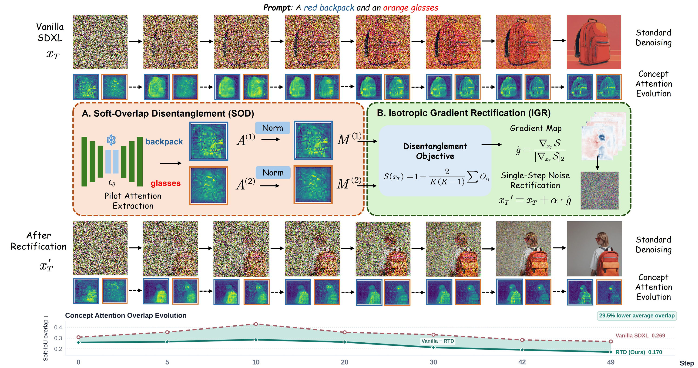
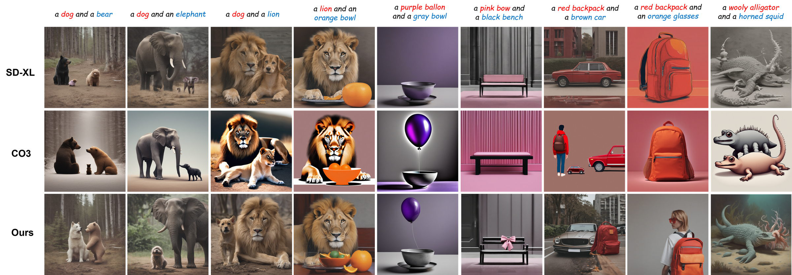
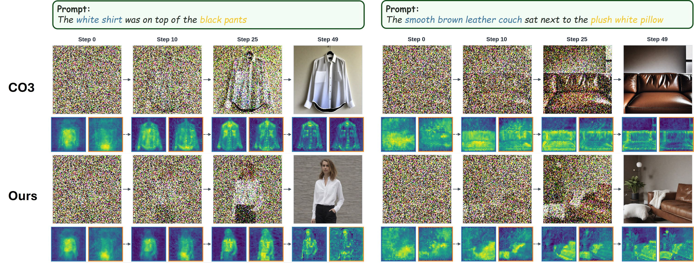
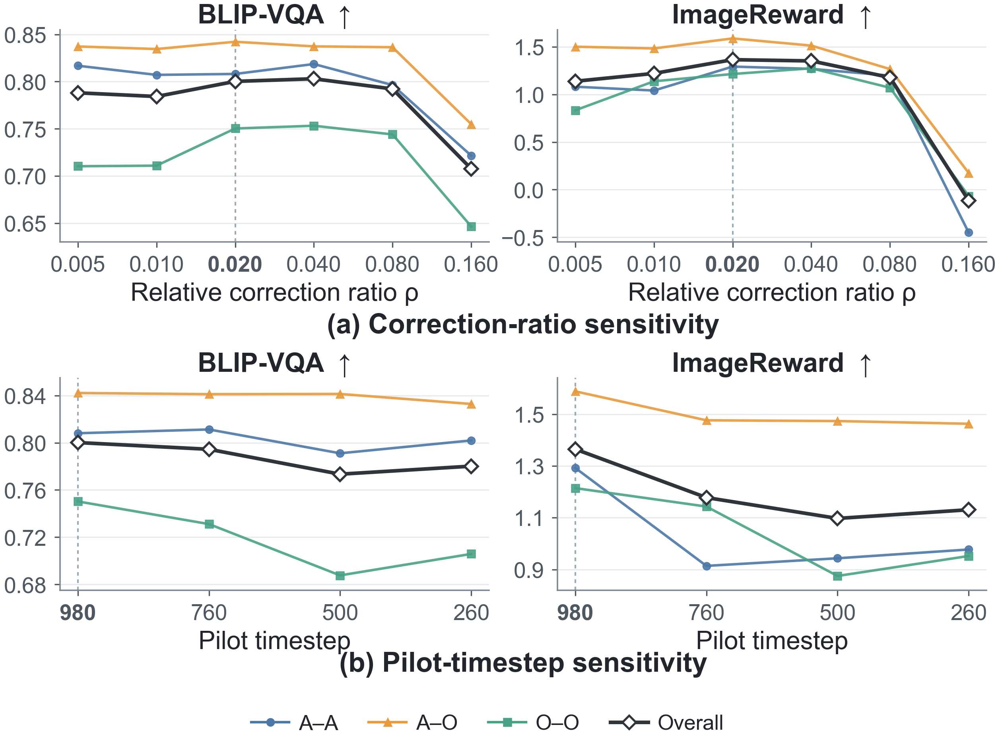

# AI Daily — 2026-08-07

## Rectify Then Diffuse: Disentangling Concepts Before Denoising Trajectory Unfolds

**arXiv:** [2608.03135](https://arxiv.org/abs/2608.03135) | **提交日期：** 2026-08-04 | **狀態：** Preprint under review

**作者：** Ning Zhu, An Chen, Mengfei Zhao, Juntao Xu, Jingze Liang, Boyuan Gu, Liang-Jian Deng (University of Electronic Science and Technology of China)

**關鍵詞：** Training-Free · Compositional Generation · Attention Modulation · Initial Latent Rectification · Text-to-Image Diffusion

---

## 一、論文核心貢獻

多概念文本到圖像生成（Multi-Concept Compositional Generation）是 Diffusion Model 領域長期存在的挑戰：給定「a cat and a dog」這樣的 prompt，模型往往只生成其中一個動物、將兩者融合成奇異混種，或將屬性（顏色、形狀）錯誤地分配給對方。現有的 training-free 解法（如 Attend-and-Excite、SynGen、CO3）幾乎都在**去噪過程中**反覆干預 attention map 或修正 score，屬於「軌跡控制」策略。

本文提出一個截然不同的視角：**多概念生成失敗的根本原因，是去噪開始前初始 latent 對各概念的空間分配（spatial allocation）就已經重疊**。一旦多個概念在高噪聲時刻的 attention map 就集中在同一區域，後續去噪過程中它們的 attention 將持續耦合，最終導致 omission 或 semantic fusion。因此，作者將問題重新定義為**邊界條件問題（boundary-condition problem）**，而非軌跡控制問題，並提出 **Rectify-then-Diffuse（RTD）**——一個在去噪開始前只做**一次**初始 latent 修正的 training-free 框架。

RTD 的核心優勢在於：

| 特性 | 說明 |
|------|------|
| **Training-Free** | 完全不修改模型參數，即插即用 |
| **One-Shot Intervention** | 只在 $x_T$ 上做一次修正，之後完全回到原始 sampler |
| **Sampler Compatible** | 與 DDIM、DPM-Solver 等任意 sampler 相容 |
| **Bounded Cost** | 僅增加一次 forward + backward pass，推理開銷增加 6.3% |
| **Model-Agnostic** | 可應用於 SDXL、SD 1.5 等不同 backbone |

---

## 二、技術方法詳解

### 2.1 核心假說：Early Allocation Bottleneck

RTD 的出發點是一個可量化的觀察：在高噪聲 timestep 下，cross-attention map 雖然尚未呈現可識別的圖像結構，但已具有 prompt-dependent 的空間組織。若多個概念在此時的 attention 高度重疊，則去噪過程中它們的空間支持（spatial support）難以分離，最終導致生成失敗。



*圖：RTD 方法概覽。上半部展示 Vanilla SDXL 在 prompt「a red backpack and an orange glasses」中，兩概念 attention 長時間重疊，最終只剩 backpack。RTD 透過 SOD 計算 pairwise overlap 並以 IGR 對初始噪聲做單步修正，使 attention 更早分離，最終成功生成兩個物件。圖中標示 RTD 的平均 overlap 較 Vanilla SDXL 降低 29.5%（0.269 → 0.170）。*

### 2.2 Pilot Attention Extraction

給定 prompt $C$ 包含 $K$ 個目標概念 $\mathcal{C}=\{c_k\}_{k=1}^K$，標準生成流程為：

$$x_0 = \Phi_\theta(x_T, C), \quad x_T \sim \mathcal{N}(0, \sigma_T^2 I)$$

RTD 在採樣前插入一個修正算子：

$$x_T' = \mathcal{R}_\theta(x_T, C), \qquad x_0' = \Phi_\theta(x_T', C) \tag{1}$$

修正信號來自 cross-attention。對一個 cross-attention head，attention matrix 為：

$$A = \operatorname{softmax}\!\left(\frac{QK_C^\top}{\sqrt{d}}\right) \in \mathbb{R}^{(hw) \times L} \tag{2}$$

其中 $Q \in \mathbb{R}^{(hw) \times d}$ 為空間 queries，$K_C \in \mathbb{R}^{L \times d}$ 為 $L$ 個 prompt token 的 keys。對每個概念 $c_k$，將其對應 token 的 attention map 加總並跨 head/layer 平均，得到概念級 attention map $A^{(k)} \in \mathbb{R}^{h \times w}$。

此 pilot pass 在高噪聲 timestep $t_\text{pilot}$（預設 980）進行，**不推進 sampler、不改變 latent**，純粹作為診斷用途。

### 2.3 Soft-Overlap Disentanglement (SOD)

為了量化概念間的空間衝突，先對每個 $A^{(k)}$ 做 max-min normalization，得到 soft occupancy map $M^{(k)} \in [0,1]^{h \times w}$。概念對 $(c_i, c_j)$ 的 soft overlap 定義為：

$$\mathrm{O}_{ij} = \frac{\langle M^{(i)}, M^{(j)} \rangle}{\|M^{(i)}\|_1 + \|M^{(j)}\|_1 - \langle M^{(i)}, M^{(j)} \rangle + \epsilon} \tag{3}$$

這是一個可微的 soft IoU，當兩個概念的 attention 集中在相同位置時趨近 1，支持區域完全不重疊時趨近 0。整體分離目標為：

$$\mathcal{S}(x_T) = 1 - \frac{2}{K(K-1)} \sum_{1 \leq i < j \leq K} \mathrm{O}_{ij} \tag{4}$$

最大化 $\mathcal{S}$ 等價於最小化所有概念對的平均 soft overlap。SOD 的關鍵設計是**不指定目標坐標或物件大小**，只要求不同概念的空間支持更加分離，保留了原始模型的 layout prior。

### 2.4 Isotropic Gradient Rectification (IGR)

令 $g = \nabla_{x_T} \mathcal{S}$ 為對初始 latent 反傳的梯度。直接使用 $x_T + \eta g$ 會因不同 prompt / seed 下梯度 norm 差異懸殊而效果不穩定。IGR 將修正方向與幅度解耦：

$$\hat{g} = \frac{g}{\max(\|g\|_2, \epsilon)}, \qquad x_T' = x_T + \rho \|x_T\|_2 \hat{g} \tag{5}$$

其中無量綱參數 $\rho$（預設 0.02）控制修正幅度相對於 latent norm 的比例。由於約束對 latent space 各方向等效，稱為「各向同性（isotropic）」修正。IGR 使得相同 $\rho$ 在不同 prompt 和 seed 下具有一致的語義效果。

### 2.5 RTD 完整算法

```
Input: Prompt C, concepts {c_k}, frozen network ε_θ, sampler Φ_θ, t_pilot, ρ
1. x_T ~ N(0, σ_T² I)
2. {A^(k)} ← PilotAttention(x_T, t_pilot, C, ε_θ)
3. M^(k) ← Normalize(A^(k))  for all k
4. Compute O_ij for all pairs (i, j)
5. S ← 1 - (2 / K(K-1)) * Σ O_ij
6. g ← ∇_{x_T} S
7. x_T' ← x_T + ρ ||x_T||_2 * g / max(||g||_2, ε)
8. x_0' ← Φ_θ(x_T', C)
Output: x_0'
```

---

## 三、實驗結果

### 3.1 定量結果

**AE-Bench（Animal-Animal, Animal-Object, Object-Object 三類）**

| Method | Training-Free | Model-Agnostic | S-IoU₅ ↓ | A-A BLIP-VQA ↑ | A-O BLIP-VQA ↑ | O-O BLIP-VQA ↑ | O-O ImageReward ↑ |
|--------|:---:|:---:|:---:|:---:|:---:|:---:|:---:|
| SDXL | ✓ | — | 0.2917 | 0.6950 | 0.8654 | 0.4926 | 0.6789 |
| Attend-and-Excite | ✓ | ✗ | 0.2734 | 0.6980 | 0.7865 | 0.5155 | 0.8741 |
| InitNO | ✓ | ✓ | 0.2521 | 0.7264 | 0.7998 | 0.5406 | 1.1383 |
| CO3 | ✓ | ✓ | 0.2396 | 0.7441 | 0.8878 | 0.5146 | 1.0158 |
| **RTD (Ours)** | ✓ | ✓ | **0.2113** | **0.8081** | 0.8422 | **0.7503** | **1.2144** |

RTD 在最具挑戰性的 Object-Object 子集上，BLIP-VQA 達到 **0.7503**，較 CO3 提升 **45.8%**；ImageReward 達到 **1.2144**，提升 **19.6%**。

**T2I-CompBench 與 RareBench**

| Method | T2I-CompBench IR ↑ | T2I-CompBench HE ↑ | S-IoU₅ ↓ |
|--------|:---:|:---:|:---:|
| SDXL | 0.3083 | 0.4678 | 0.2831 |
| CO3 | 0.4406 | 0.6278 | 0.2369 |
| **RTD (Ours)** | **0.4661** | **0.6615** | **0.2146** |

### 3.2 定性結果



*圖：RTD（下排）與 SDXL（上排）、CO3（中排）的定性對比。RTD 在多個 prompt 上更能同時保留兩個物件與對應屬性，而 SDXL 常只生成其中一個，CO3 則有時出現比例或屬性錯配。*

### 3.3 Attention Evolution 分析



*圖：CO3（上）與 RTD（下）在兩個 prompt 上的 attention evolution。RTD 的概念 attention 從更早的 denoising step 就開始分離，而 CO3 在後期仍有明顯 coupling，導致最終只保留主要物件。*

### 3.4 超參數敏感性



*圖：(a) 相對修正比例 $\rho$ 的敏感性：最佳值約為 0.02，過大（0.16）會顯著破壞生成品質。(b) Pilot timestep 的敏感性：高噪聲區域（$t_\text{pilot}=980$）效果最佳，支持「應在圖像結構尚未成形前處理 allocation conflict」的核心假說。*

---

## 四、相關研究背景

### 4.1 Training-Free Compositional Generation

現有 training-free 方法可分為三類。**Attention guidance** 方法（Attend-and-Excite、SynGen、Divide & Bind、Magnet）在去噪過程中反覆強化被忽略的概念或分離 attention map，但每個步驟都需要干預，計算成本隨 step 數增加。**Corrective sampling** 方法（CO3）在去噪軌跡上反覆修正 score 或 latent，雖然效果更強，但速度更慢（RTD 比 CO3 快 2.3×）。**Initial noise optimization** 方法（InitNO）最接近 RTD 的思路，但它使用多個 attention 評估標準並迭代搜索，而 RTD 只需一次 forward + backward。

### 4.2 Attention Map 在生成中的角色

Prompt-to-Prompt（Hertz et al., 2023）最早系統性地揭示 cross-attention map 在 diffusion 生成中的語義角色，奠定了後續 attention manipulation 研究的基礎。Prompt-to-Prompt 的核心觀察——attention map 決定了「哪個 token 影響哪個空間位置」——正是 RTD 利用 pilot attention 作為診斷信號的理論依據。

### 4.3 與 Energy-Based / JEPA 視角的連結

RTD 的 SOD 目標函數 $\mathcal{S}(x_T)$ 本質上是對初始 latent 定義了一個**概念分離能量函數**：能量越低（overlap 越大），生成越容易失敗；能量越高（overlap 越小），生成越容易成功。這與 Energy-Based Model（EBM）的思路高度相似——不是直接生成圖像，而是先找到一個「更好的初始條件」，再讓生成模型自然展開。

從 JEPA 的角度看，RTD 的 pilot pass 類似於 JEPA 的 context encoder：在不完整信息（高噪聲 latent）下預測概念的空間支持，並以此作為後續生成的 prior。這種「先預測空間分佈，再生成」的兩階段思路，與 I-JEPA 和 V-JEPA 的 latent prediction 框架有深刻的結構相似性。

---

## 五、個人評價與啟發

RTD 最值得記住的不只是它的性能數字，而是**問題重新表述的方式**。把多概念生成失敗看成「初始條件的空間分配衝突」，而非「去噪過程中每一步都需要救火」，這個視角轉換使得解法變得極其簡潔：只需一次 one-shot 修正，之後完全信任原始模型。

這種思路對以下研究方向有直接啟發：

**對 VAR / next-scale prediction 的啟發：** VAR 的 coarse-to-fine 生成過程中，粗粒度 token 的分配是否也存在類似的「early allocation bottleneck」？是否可以在最粗尺度的 token 生成前，先做一次 concept-aware allocation rectification？

**對 attention modulation 研究的啟發：** RTD 展示了 attention 不只是可以在去噪過程中被「調製」，也可以在去噪前被「診斷」並用來修正初始條件。這開啟了一個新的 attention modulation 範式：pre-denoising diagnosis + one-shot boundary correction。

**對 Energy-Based Transformer 的啟發：** RTD 的 SOD 目標函數可以被視為一個針對初始 latent 的 energy function。如果把 EBT 的 energy landscape 思路引入，是否可以學習一個更通用的「concept separation energy」，而不只是 soft IoU？

**對 training-free zero-shot 生成的啟發：** RTD 完全不需要任何訓練，也不需要 layout 標注或 bounding box，只需要 prompt 本身。這種純粹依賴模型內部 attention 信號的 zero-shot 方法，代表了 training-free 研究的一個重要方向：充分挖掘預訓練模型中已有的結構信息，而非引入外部先驗。

---

## 六、論文資訊摘要

| 項目 | 內容 |
|------|------|
| **論文標題** | Rectify Then Diffuse: Disentangling Concepts Before Denoising Trajectory Unfolds |
| **arXiv ID** | 2608.03135 |
| **提交日期** | 2026-08-04 |
| **作者** | Ning Zhu, An Chen, Mengfei Zhao, Juntao Xu, Jingze Liang, Boyuan Gu, Liang-Jian Deng |
| **機構** | University of Electronic Science and Technology of China (UESTC) |
| **方向** | Training-Free Compositional Text-to-Image Generation |
| **核心方法** | SOD (Soft-Overlap Disentanglement) + IGR (Isotropic Gradient Rectification) |
| **基礎模型** | SDXL (主要)，可泛化至 SD 1.5 等 |
| **主要 Benchmark** | AE-Bench, T2I-CompBench, RareBench |
| **代碼** | [github.com/Z-yiwei/rectify-then-diffuse](https://github.com/Z-yiwei/rectify-then-diffuse) |
| **關鍵數字** | O-O BLIP-VQA 0.7503（+45.8% vs CO3），推理開銷 +6.3%，比 CO3 快 2.3× |

---

*AI Daily 由自動化工作流程生成，每日更新。*
