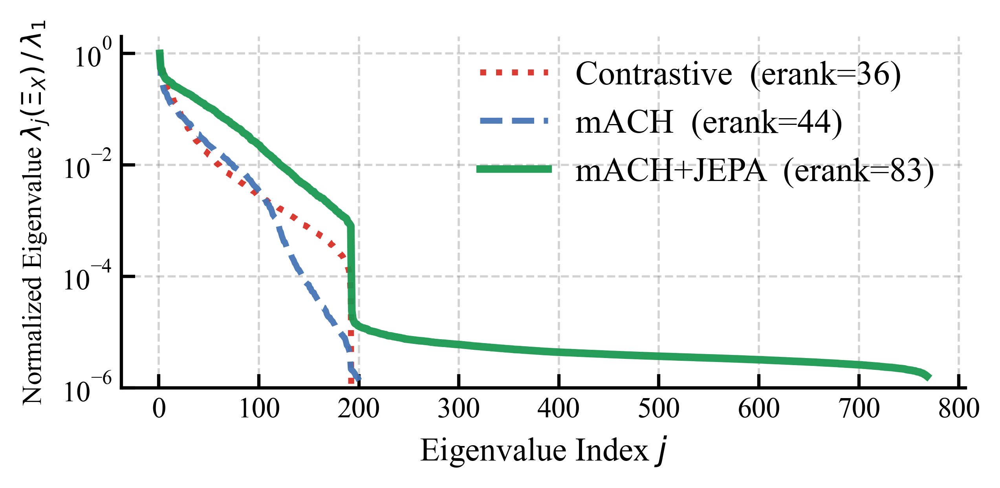
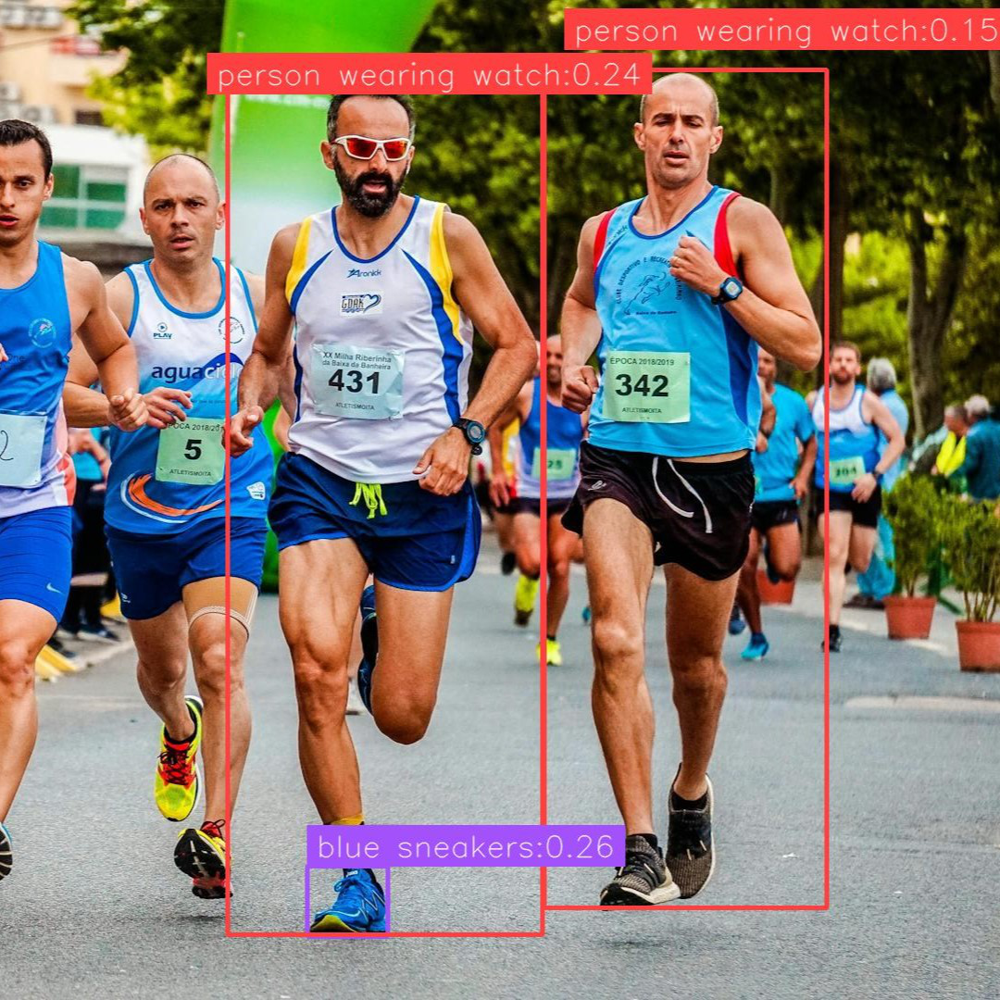

# AI Daily

## 今日精選：Scaling Representation Diversity

> **日期：2026-08-27**　**作者：Manus AI**

今天選讀的論文是 **“Scaling Representation Diversity: Modulated Attention and Reconstructive Regularization for Visual Grounding”**。論文於 2026 年 8 月 13 日以 arXiv:2608.12748 v1 發表，研究團隊來自清華大學、電子科技大學、中鋁數智、Linsulabs 與中國石油西南油氣田公司。[1] 這不是一篇新的圖像生成模型，而是針對 **unified open-vocabulary referring expression comprehension（REC）** 的視覺 grounding 研究；它之所以值得放在今天的 AI Daily，原因在於作者把近期非常重要的三條線索接在一起：**token-level attention modulation、JEPA 式 latent prediction，以及 zero-shot generalist scaling**。

本次檢索已與 repository 既有文章及 arXiv 編號交叉比對；`2608.12748` 未出現在既有索引或文章目錄中，因此不與目前的 SynVAR、Orthogonal JEPA、Scalable EBM、SparVAR 等文章重複。相較於同日找到的其他候選，這篇工作在「JEPA 如何作為訓練期的 representation regularizer」以及「如何用光譜觀點診斷多模態表示退化」上，與目前關注的 Energy-based Transformer、JEPA、attention modulation、training-free 與 zero-shot 問題最直接相連。

## 一、論文基本資訊

| 項目 | 內容 |
|---|---|
| 論文標題 | Scaling Representation Diversity: Modulated Attention and Reconstructive Regularization for Visual Grounding |
| 作者 | Junyi Hu, Tian Bai, Fengyi Wu, Yian Huang, Wei Wen, Zaoli Li, Junli Lin, Xingchen Li, Zhenming Peng, Yi Zhang |
| 研究單位 | Tsinghua University；University of Electronic Science and Technology of China；Chinalco Digital Intelligence；Linsulabs；PetroChina Southwest Oil and Gas Field Company, CNPC |
| 發表狀態 | arXiv preprint，arXiv:2608.12748v1，2026-08-13；目前頁面未標示頂會接受資訊 [1] |
| 任務 | 統一 open-vocabulary referring expression comprehension / visual grounding |
| 核心元件 | Modulated Attention-Contrastive Head（mACH）、text-conditioned JEPA auxiliary stream、Objects365-Caption |
| 主要模型 | 75M DINOv3 ConvNeXt-Tiny visual backbone；Qwen3-VL-Embedding-2B text encoder |
| 公開資源 | [官方程式碼](https://github.com/inlmouse/MACH)、[Objects365-Caption 資料集](https://huggingface.co/datasets/EndlessnessSoul/Objects365_captions) |
| 授權 | 論文 HTML 顯示 CC BY-NC-SA 4.0 [1] |

### 為什麼這篇值得讀？

傳統 REC 通常對每個 benchmark 個別 fine-tune，因此模型雖然能在單一資料集取得高分，卻不容易以同一個 checkpoint 泛化到不同資料分佈。這篇論文提出的核心診斷是：當大量不同語言描述共同監督同一組視覺特徵時，純 contrastive 或 discriminative objective 可能把有效訊號壓縮到低秩子空間，造成某些語義方向變成 **alignment-blind**。另一方面，Objects365 具有大量 bounding boxes，卻只有離散類別名稱，缺乏「穿藍鞋、站在右側、拿著紅球」這類能描述視覺關係的語言多樣性。

作者因此採取 **data-model co-design**：在模型端以 mACH 擴大 token-level cross-modal supervision，再以訓練期間存在、推理期間移除的 JEPA 分支提供互補的 latent reconstruction gradient；在資料端則把 Objects365 的離散類別升級為 context-aware referring expressions。這個想法的重點不是單純堆加一個 auxiliary loss，而是把「表示是否保留足夠多的可對齊方向」視為可分析、可量測、可擴展的設計目標。

## 二、核心貢獻與創新點

| 貢獻 | 具體內容 | 對研究的啟發 |
|---|---|---|
| mACH | 將多個文字 query 廣播到同一份 visual feature map，透過 token-level cross-attention 同時完成對齊與 grounding | 把多 query 的成本從重複視覺前向，改成共享視覺流、平行文字互動 |
| JEPA auxiliary stream | 以 masked visual feature prediction 補足純語言監督的梯度子空間；teacher 使用 EMA 更新 | JEPA 不只可作 foundation pretraining，也可作任務模型的 training-only representation regularizer |
| Objects365-Caption | 將 638K images、9.6M annotations 的離散 detection labels 轉成 context-aware language descriptions | 語言 supervision 的 entropy 與組合性本身就是 representation scaling 的一部分 |
| Representation-diversity theory | 以 covariance eigenspectrum 與 directional alignment capacity 描述哪些 feature directions 仍可被語言對齊 | 讓 representation collapse 從定性觀察變成可檢驗的光譜與梯度子空間問題 |
| Zero-shot unified checkpoint | 不針對 RefCOCO、RefCOCO+、RefCOCOg 各自調整權重，使用單一 checkpoint 評估 | 更接近實際 open-world grounding，而不是只追求單 benchmark 最佳化 |

需要特別指出的是，作者並沒有把 mACH 宣稱成全新的 attention operator。論文明確說明，mACH 是一種以 broadcast topology 實作 standard cross-attention 的高效率 head，創新主要在於 **如何將它與 JEPA 互補監督及資料重構共同用來保存表示多樣性**，而非重新發明 softmax attention。[1]

## 三、方法詳解

### 3.1 問題設定與共享視覺表示

給定一張影像與多個 referring expressions，視覺 backbone 產生多尺度 feature map。以下先考慮一個 feature level，將空間位置攤平後記為

$$
X\in\mathbb{R}^{B\times M\times C},
$$

其中 $B$ 是 batch size，$M$ 是空間位置數量，$C$ 是 visual feature dimension。每張影像有 $N_c$ 個 referring expressions；文字 encoder 產生 token sequence，整理成

$$
W\in\mathbb{R}^{B N_c\times L\times C},
$$

其中 $L$ 是文字 token 長度，而 $B N_c$ 是把每一張影像複製到每個 query 後的 expanded batch。

### 3.2 Modulated Attention-Contrastive Head（mACH）

mACH 的第一個工程重點是 **visual feature broadcasting**。令

$$
Q=\operatorname{Broadcast}(X)\in\mathbb{R}^{B N_c\times M\times C},
$$

如此每個 query 都可以共用同一份視覺前向結果，再由文字 embedding 經過線性投影得到 key 與 value：

$$
K,V=\operatorname{Linear}(W).
$$

視覺位置與文字 token 的互動使用 scaled dot-product attention：

$$
O=\operatorname{Softmax}\left(\frac{QK^{\top}}{\sqrt{C}}\right)V,
$$

其中 $O\in\mathbb{R}^{B N_c\times M\times C}$ 是 language-conditioned visual representation。實作上，作者結合 multi-head attention 與 variable-length FlashAttention-2，以避免 padded text tokens 帶來的無效計算。[1]

接著由輕量 grounding head $\psi(\cdot)$ 將每個空間位置映射成 score：

$$
S=\psi(O)\cdot \exp(\tau)+b,
$$

其中 $\tau$ 是可學習的 logit scale，$b$ 是可學習 bias，最後以 ground-truth grounding map $Y$ 進行 binary cross-entropy：

$$
\mathcal{L}_{\mathrm{mACH}}=\mathcal{L}_{\mathrm{BCE}}(S,Y).
$$

這個設計的主要收益是視覺流只需計算一次；query 數量增加時，新增成本主要落在文字與 cross-attention，而非完整 backbone。它因此同時具備高效率與 open-vocabulary query 的彈性。

### 3.3 Text-conditioned JEPA auxiliary stream

僅以 grounding loss 訓練時，視覺特徵可能逐漸集中到容易被文字分類的少數方向。作者在同一份 $X$ 上增加非對稱 online-target 架構：student projection head 記為 $\mathcal{P}_{\theta}$，teacher projection head 記為 $\mathcal{P}_{\mathrm{EMA}}$。teacher 參數不由當前 batch 的梯度直接更新，而是使用 exponential moving average：

$$
\mathcal{P}_{\mathrm{EMA}}(t+1)
=\lambda_{\mathrm{ema}}\mathcal{P}_{\mathrm{EMA}}(t)
+(1-\lambda_{\mathrm{ema}})\mathcal{P}_{\theta}(t).
$$

接著，作者在 ground-truth bounding boxes 對應的 spatial regions 進行隨機 masking。student 的 masked features 被 learnable mask token 取代，teacher 則提供較穩定的 latent target。與原始 I-JEPA 不同的是，這裡的 predictor 額外接收 referring expression 的文字 embedding $W$，因此它不是無條件重建，而是要求模型回答：「在這個文字條件下，被遮住的視覺區域應該具有什麼 latent semantics？」

若 $\Omega$ 表示 masked spatial locations，language-conditioned predictor 可寫成

$$
\widehat{Z}_{\Omega}=\mathcal{F}_{\phi}(Z_{\mathrm{stu}}^{\mathrm{masked}},W)_{\Omega}.
$$

在將預測 latent 與 teacher latent 做 $\ell_2$ normalization 後，JEPA loss 為 cosine distance 與 SmoothL1 的混合：

$$
\mathcal{L}_{\mathrm{JEPA}}
=\frac{1}{|\Omega|}\sum_{m\in\Omega}
\left(1-\left\langle\bar{\hat z}_m,\bar z_{\mathrm{target},m}\right\rangle\right)
+\frac{\beta}{|\Omega|}\sum_{m\in\Omega}
\operatorname{SmoothL1}
\left(\bar{\hat z}_m,\bar z_{\mathrm{target},m}\right).
$$

總訓練目標是

$$
\mathcal{L}_{\mathrm{Total}}
=\mathcal{L}_{\mathrm{mACH}}
+\alpha\mathcal{L}_{\mathrm{JEPA}}.
$$

JEPA 分支在訓練結束後被移除，因此不增加部署時的 backbone 或 predictor 計算。這裡的關鍵不是讓模型生成像素，而是讓 representation 在被語言對齊的同時，仍保留足夠多可預測、可重建的視覺結構。這種「訓練期加入 predictive pressure、推理期只保留 discriminative model」的分離，也使它與使用大型生成式 world model 的方法有所區別。

### 3.4 Objects365-Caption

作者將 Objects365 的離散類別標籤轉成 context-aware captions，流程包含三個階段。第一階段以輕量 Qwen3-VL-2B 做 coarse-to-fine disambiguation；第二階段以 32B MLLM 產生結合物件類別、視覺屬性與空間關係的描述；第三階段透過機器翻譯擴展跨語言評估。論文報告這個資料集包含 638K 張影像、9.6M annotations、平均 caption 長度 4.2、597K unique phrases，以及低於 0.1% 的人工抽查錯誤率。[1]

這個資料設計具有一個容易被忽略的含義：即使模型架構相同，若大型 detection corpus 只提供「dog」「person」「chair」等 noun-only labels，模型所接收的語言方向仍然非常低熵。把類別標籤升級為帶有顏色、位置、姿態與關係的描述，等於在資料層面擴大可被視覺表示捕捉的語義方向。

## 四、Representation Diversity 的理論觀點

論文對 representation diversity 的定義不是「embedding 看起來是否分散」，而是：**有多少 feature directions 能持續接收 alignment supervision，並對文字 query 產生可用的空間差異**。

對空間位置 $m$ 的共享 visual token $x_m\in\mathbb{R}^{C}$，以及單位文字方向 $k$，attention logit 為 $a_m=x_m^{\top}k$。作者把文字方向 $k$ 的 directional alignment capacity 定義為

$$
\operatorname{cap}(k)
:=\operatorname{Var}_{m}(x_m^{\top}k)
=k^{\top}\Xi_X k,
$$

其中 $\Xi_X$ 是所有 visual tokens 的 covariance matrix。若 $\operatorname{cap}(k)=0$，代表沿著 $k$ 方向的空間變異消失，該方向形成 **alignment-blind subspace**；即使文字 query 需要這個語義，模型也很難靠 spatial score 將它找出來。

接著，作者把不同訓練目標能覆蓋的 gradient subspace 做比較。令 $N_c$ 為每張影像的 expression 數量，$N$ 為文字 token 總數，$C$ 為 feature dimension，在 $N_c<N/2$ 與 $N-N_c<C$ 的條件下，論文給出上界關係：

$$
\underbrace{N_c}_{\text{contrastive}}
<
\underbrace{N-N_c}_{\text{mACH}}
<
\underbrace{C}_{\text{mACH+JEPA}}.
$$

其直覺如下。傳統 contrastive objective 多半只利用每個 expression 的 pooled direction；mACH 透過 token-level interaction 擴展至 centered token subspace，但 softmax invariance 仍會消除每個 expression 的一個 common-mode direction；JEPA 則從 visual latent prediction 提供不依賴於文字分類的互補梯度，理論上能把支援面擴展到幾乎整個 ambient feature space。

這個理論最值得注意的地方，是它把「representation collapse」重新描述成 **梯度長期沒有覆蓋到的方向，在 weight decay 下逐漸失去 covariance capacity**。因此，JEPA 的角色不是神秘地讓 embedding 變得更語義，而是提供一組與 mACH 不同的梯度方向，使共享 visual representation 不會只剩下少數 language-alignment axes。

## 五、實驗結果

### 5.1 Zero-shot unified generalist

實驗使用經清理的 RefCOCO、RefCOCO+ 與 RefCOCOg splits。預測 bounding box 與 ground truth 的 IoU 大於 0.5 即視為正確，主要指標為 Top-1 accuracy。[1]

| 設定 | RefCOCO val | RefCOCO testA | RefCOCO testB | RefCOCO+ val | RefCOCO+ testA | RefCOCO+ testB | RefCOCOg val | RefCOCOg test |
|---|---:|---:|---:|---:|---:|---:|---:|---:|
| **Ours, 75M, zero-shot** | **85.3** | **89.0** | **82.5** | **71.8** | **78.2** | **62.7** | **76.3** | **75.8** |
| GDINO-T, 172M, zero-shot | 74.0 | 74.9 | 59.3 | 66.8 | 69.9 | 56.1 | 71.1 | 72.1 |
| LISA++-L2, 13B, zero-shot | 85.9 | 88.8 | 81.7 | 74.5 | 80.6 | 68.3 | 80.1 | 81.3 |
| GSVA, 7B, zero-shot | 86.3 | 89.2 | 83.8 | 72.8 | 78.8 | 68.0 | 81.6 | 81.8 |

75M 模型在 RefCOCO 上以 640×640 輸入達到 85.3/89.0/82.5，明顯超過 172M 的 GDINO-T；在 RefCOCO+ 和 RefCOCOg 也維持 71.8/78.2/62.7 與 76.3/75.8。需要保持判斷上的精確性：它雖然接近大型 MLLM，但並沒有在所有資料集、所有指標上勝過 7B 或 13B 模型，因此最合理的解讀是 **以小模型取得強泛化與低部署成本**，而不是全面超越所有大型模型。

### 5.2 Fine-tuning 與資料品質

| 設定 | RefCOCO val/testA/testB | RefCOCO+ val/testA/testB | RefCOCOg val/test |
|---|---|---|---|
| **Ours，fine-tuned** | **91.7 / 93.0 / 90.2** | **83.5 / 87.5 / 76.9** | **85.1 / 86.0** |
| GDINO-T，fine-tuned | 89.2 / 91.9 / 86.0 | 81.1 / 87.4 / 74.7 | 84.2 / 84.9 |
| PropVG，fine-tuned | 89.0 / 91.6 / 85.7 | 83.7 / 88.0 / 76.6 | 83.5 / 84.4 |

資料消融顯示，在相同 head architecture 下，將 GoldG/O365 替換為 GoldG-f/O365-C 後，RefCOCO val 從 77.0 提升到 85.3；這個 +8.3 個百分點的結果，說明語言 supervision 的豐富度本身就是 unified grounding 的主要瓶頸之一。[1]

### 5.3 Head 與 JEPA 消融

| Head configuration | RefCOCO val | RefCOCO testA | RefCOCO testB | RefCOCO+ val | RefCOCOg val |
|---|---:|---:|---:|---:|---:|
| Contrastive only | 78.6 | 80.3 | 73.8 | 61.0 | 72.7 |
| mACH | 83.9 | 87.5 | 79.3 | 68.5 | 74.8 |
| **mACH + JEPA** | **85.3** | **89.0** | **82.5** | **71.8** | **76.3** |

從 contrastive 到 mACH，RefCOCO val 提升 5.3 個百分點；加入 JEPA 後再提升 1.4 個百分點。這個結果支持「token-level language interaction 擴大 supervised directions，而 latent reconstruction 提供互補 gradient support」的解釋，但也提醒我們：**JEPA 的效益是 incremental regularization，而非單獨造成全部提升的魔法模組**。

在 auxiliary weight 上，$\alpha=0.1$ 最佳；$\alpha=0.2$ 略為下降，作者將其解釋為 over-regularization。這表示 predictive reconstruction 與 task-specific grounding 之間存在 trade-off：JEPA 若過強，模型可能把容量用於重建對任務不必要的細節。

### 5.4 Backbone scalability 與推理效率

| Backbone | Feature dimension | RefCOCO val/testA/testB | RefCOCO+ testA | RefCOCOg test |
|---|---:|---|---:|---:|
| ConvNeXt-Tiny | 768 | 85.3 / 89.0 / 82.5 | 78.2 | 75.8 |
| ConvNeXt-Small | 768 | 86.1 / 89.1 / 82.6 | 79.3 | 76.1 |
| ConvNeXt-Base | 1024 | 86.3 / 89.8 / 83.8 | 81.1 | 77.2 |

在單張 RTX 4090、batch size 1 下，當每張影像的 text queries 由 1 增加到 10，contrastive head 的 latency 為 21/23/24 ms，mACH 為 26/26/27 ms；mACH 的 peak memory 為 1.13/1.26/1.35 GB。[1] 這個結果支持共享 visual stream 的工程優勢，但不應解讀成完全與 query 數量無關；memory 仍會增加，且跨資料集部署時 text encoder、CUDA kernel 與 query 長度都會影響實際 latency。

### 5.5 光譜證據

*圖 1：從論文 PDF 提取的 Figure 5 聚焦圖。Contrastive 與 mACH 在約 $j\approx200$ 處出現明顯 spectral cliff；mACH+JEPA 則保留延伸到 $C=768$ 的非零 spectral tail。圖片來源：[論文 HTML Figure 5](https://arxiv.org/html/2608.12748v1)。*

作者以 empirical feature covariance $\Xi_X$ 的 eigenvalue spectrum 衡量 representation diversity，並用 effective rank 壓縮成單一統計量：

$$
\operatorname{erank}(\Xi_X)
=\exp\left(-\sum_j p_j\log p_j\right),
\qquad
p_j=\frac{\lambda_j}{\sum_k\lambda_k}.
$$

結果為 contrastive **36**、mACH **44**、mACH+JEPA **83**。圖中 contrastive 與 mACH 在約 $j=200$ 後跌至接近數值底線，而 mACH+JEPA 在全 768 維仍保留約 $10^{-5}$ 等級的尾部變異。這是整篇最有說服力的視覺證據，因為它把性能增益與「更多可用方向」連結起來，而不只是報告一個額外 loss 帶來的 accuracy +1.4。

### 5.6 定性結果

*圖 2：從論文 PDF 提取的定性 grounding 局部圖。模型同時處理 “person wearing watch” 與 “blue sneakers” 等自然語言 query；這是 qualitative example，不代表獨立的 benchmark 統計。圖片來源：[論文 HTML Figure 4](https://arxiv.org/html/2608.12748v1)。*

這張圖展示多個相似人物同時出現在畫面時，文字條件可以把不同語義屬性對應到不同 bounding boxes。它特別適合用來理解 mACH 的任務形態：模型不是只判斷「畫面有沒有 person」，而是要在共享 visual map 上為每個 query 產生不同的空間 score map。

## 六、相關研究與研究脈絡

| 相關工作 | 核心想法 | 與本文的關係 |
|---|---|---|
| I-JEPA（ICCV 2023） | 從 context block 預測同一影像中 masked target blocks 的 abstract representations，而不是重建像素 [2] | 本文沿用 masked latent prediction 的精神，但將 predictor 加入 referring-expression conditioning，並把 JEPA 變成 grounding 的 auxiliary regularizer |
| V-JEPA（Meta） | 在影片的 masked spatio-temporal regions 上預測 latent representations，主張非生成式、可做 frozen evaluation [3] | 提供「預測任務相關抽象資訊、丟棄不可預測細節」的概念背景；本文則縮小成 2D visual feature regularization |
| VL-JEPA（ICLR 2026） | 直接預測連續 text embeddings，而非 autoregressive token generation；支援 selective decoding 與多種 discriminative tasks [4] | VL-JEPA 把 JEPA 當作完整 VLM 的主體；本文把 JEPA 放在 task model 內作 training-only branch，部署後只留 grounding head |
| A Closer Look at Multimodal Representation Collapse（ICML 2025 Spotlight） | 指出 noisy 與 predictive modality features 在共享 fusion neurons 中互相糾纏，造成 rank bottleneck；提出 explicit basis reallocation [5] | 與本文共同關心 rank、collapse 與有效表示方向，但本文選擇 complementary gradient support，而非 explicit basis reallocation |
| RefCOCO 評估重訪（CVPR 2025 workshop） | 重新檢查 REC 在大型多模態模型時代的 annotation noise 與 spatial ambiguity [6] | 本文使用 cleaned splits，並以 GoldG-f 等資料清理設計減少標註噪聲干擾 |

從這條脈絡來看，本文的定位很清楚：它不是提出另一個更大的 VLM，而是問一個更基礎的 scaling 問題——**當不同任務與語言 supervision 共享同一個 visual representation 時，哪些維度仍然有機會被未來的 query 使用？** I-JEPA/V-JEPA 提供 latent prediction 的學習哲學，ICML 2025 的 collapse 工作提供 rank bottleneck 的診斷，而本文把兩者落到可部署的 visual grounding pipeline。

## 七、個人評價與意義

### 優點

第一，這篇論文把方法、資料與理論連在一起。若只提出 JEPA auxiliary loss，容易被批評為又一個 regularization trick；但作者同時指出 O365 的語言貧乏是資料瓶頸，再以 O365-Caption 修正，並用 covariance spectrum 與 effective rank 檢查是否真的保留更多方向，論證鏈條比單純 ablation 更完整。

第二，zero-shot unified evaluation 的設定比「每個 benchmark 個別 fine-tune」更接近產品型 open-vocabulary grounding。75M checkpoint 能在不同語言長度、屬性密度與資料分佈上維持競爭力，對 edge deployment 與 proposal generation 都具有實際價值。

第三，作者對限制的描述相對誠實。官方實作 README 指出，dual-stream objective 保存的是 representational capacity，不等同於自動得到可靠 confidence；陌生類別可能定位正確但分數偏低，需要更低 threshold。官方 README 也明確說明 theory covers representation，而不直接涵蓋 optimization、supervision quality 或 score calibration。[3]

### 需要保留的疑問

第一，本文目前仍是 arXiv preprint，且主要數據與理論都來自作者自己的 pipeline。尤其 O365-Caption 使用 Qwen3-VL-2B、32B MLLM 與機器翻譯自動生成，雖然作者報告人工抽查錯誤率低於 0.1%，但這不是獨立審計結果；caption bias、prompt template bias 與語言模型的既有視覺偏見仍可能影響結果。

第二，representation diversity 的理論描述的是 gradient subspace 與 covariance capacity，不是 task accuracy 的充分條件。即使 spectral tail 被保留，如果 tail 方向是噪聲、校準錯誤或難以由 downstream head 讀取，仍不保證 open-world grounding 會改善。這也是為什麼官方實作把 confidence calibration 列為重要 future work。

第三，mACH 的 latency 優勢建立在共享視覺流與固定輸入條件上。當 query 很長、語言 encoder 未快取、影像尺寸改變，或需要大量候選 expression 時，cross-attention 和 memory bandwidth 仍然會成為瓶頸。因此，這篇論文的 efficiency claim 最適合理解為「避免重複 backbone 計算」，而不是宣稱整個系統對任意 query 數量都具有常數成本。

## 八、對 Energy-based Transformer、VAR 與 Training-Free 的研究發想

以下方向是基於本文結果提出的研究假設，不是論文已完成的實驗；它們的價值在於把本文的 representation spectrum 觀點接到目前更關注的生成模型問題。

| 方向 | 可驗證假設 | 初步形式化與實驗設計 |
|---|---|---|
| Energy-based representation floor | 只用 JEPA 讓 eigenspectrum 變寬仍未必控制哪一個方向重要；可將 alignment energy 與 spectral floor 聯合最佳化 | 對 token covariance $\Xi$ 加入 $\mathcal{L}_{\mathrm{floor}}=-\log\det(\Xi+\epsilon I)$，再以 query-conditioned energy $E(x,k)$ 重新排序 grounding candidates；比較 mACH+JEPA 與 mACH+JEPA+energy floor 的 OOD calibration、effective rank 與 accuracy |
| VAR 的 scale-wise JEPA | VAR 早期 coarse scales 決定物件與佈局，後期 fine scales 補紋理；JEPA 若只施加在 coarse visual tokens，可能比全尺度重建更穩定 | 在 VAR/visual autoregressive tokenizer 的 coarse token 上做 masked latent prediction，使用 future-scale token 或 frozen V-JEPA target；測試 multi-object binding、attribute counting 與長序列 token rollout |
| Training-free spectrum-aware attention modulation | 若 collapse 在推理時表現為少數主方向過度主導，可不重訓 backbone 而在中間層做 covariance-aware reweighting | 對 frozen visual tokens 做 $X'=XU\,\operatorname{diag}(g(\lambda_j))U^\top$，其中 $U$ 是 token covariance eigenvectors，$g$ 對 spectral tail 做 bounded boost；以 zero-shot grounding、image editing 或 VAR layout consistency 測量品質與穩定性 |
| JEPA predictive disagreement as uncertainty | representation tail 不代表一定可靠；masked prediction 的 disagreement 可能是比 raw grounding score 更好的 OOD signal | 使用多個 masked views 得到 $\{\hat z^{(r)}\}$，以平均 pairwise cosine disagreement 作 uncertainty；將它用於 open-set threshold、energy-based reranking 與 selective prediction |
| Cross-modal basis reallocation + JEPA | ICML 2025 的 explicit basis reallocation 與本文 complementary gradients 可能互補，而非互斥 | 在同一 visual backbone 上比較 contrastive、mACH、JEPA、basis reallocation 及兩者合併，觀察 effective rank、missing-modality robustness、zero-shot grounding 與 training stability |

我最推薦優先做的是 **VAR coarse-scale JEPA + training-free tail-aware attention modulation**。理由是本文已經提供兩個可操作的診斷量：一是 directional alignment capacity，二是 eigenspectrum/effective rank。若把它們搬到 VAR 的 scale-wise token state，就可以回答一個具體問題：**早期 scale 的表示多樣性，是否能預測後期生成中的 spatial binding、attribute fidelity 與長序列退化？** 這比單純把 JEPA 當作額外 loss 更容易形成可反駁的研究假設。

## 九、結論

這篇論文的真正貢獻不是「在 REC benchmark 上多拿幾個百分點」，而是提出一個可延伸的 scaling 原則：**多模態模型的能力上限，不只由參數量決定，也由訓練目標長期保留了多少 alignment-active directions 決定。** mACH 擴展文字與空間 token 的互動，JEPA 提供互補的 latent predictive gradient，O365-Caption 則在資料層面補回語言組合性；三者共同將 unified grounding 從 benchmark-specific specialist 推向 single-checkpoint generalist。

對目前的研究方向而言，最值得帶走的訊息是：Energy-based model 可以提供「哪些方向應該低能量」的判準，JEPA 可以提供不依賴像素重建的 predictive supervision，VAR 可以把 representation capacity 問題拆到不同生成尺度，而 training-free attention modulation 則可能把這些診斷轉成不必重訓 backbone 的推理控制。這篇論文把這幾條線索尚未完全接起來，但它提供了足夠清楚的數學語言與實驗接口，值得作為後續研究的起點。

## References

[1]: https://arxiv.org/html/2608.12748v1 "Scaling Representation Diversity: Modulated Attention and Reconstructive Regularization for Visual Grounding"

[2]: https://arxiv.org/abs/2301.08243 "Self-Supervised Learning from Images with a Joint-Embedding Predictive Architecture"

[3]: https://ai.meta.com/blog/v-jepa-yann-lecun-ai-model-video-joint-embedding-predictive-architecture/ "V-JEPA: The next step toward advanced machine intelligence"

[4]: https://proceedings.iclr.cc/paper_files/paper/2026/hash/9144aded4e536bc5fb7bfc660a2d7a3d-Abstract-Conference.html "VL-JEPA: Joint Embedding Predictive Architecture for Vision-language"

[5]: https://icml.cc/virtual/2025/poster/45060 "A Closer Look at Multimodal Representation Collapse"

[6]: https://openaccess.thecvf.com/content/CVPR2025W/BEAM/html/Chen_Revisiting_Referring_Expression_Comprehension_Evaluation_in_the_Era_of_Large_CVPRW_2025_paper.html "Revisiting Referring Expression Comprehension Evaluation in the Era of Large Multimodal Models"

[7]: https://github.com/inlmouse/MACH "Official MACH implementation"

[8]: https://huggingface.co/datasets/EndlessnessSoul/Objects365_captions "Objects365-Caption dataset"
