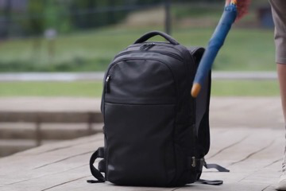

# AI Daily

> **研究日期：** 2026-08-22　　**整理：** Manus AI　　**主題：** Training-free、MLLM feedback、diffusion trajectory correction、attention modulation、zero-shot video generation

## MLLM-Guided Semantic Correction for Text-to-Video Generation：讓擴散模型在生成途中自我檢查

## 一、論文基本資訊

| 欄位 | 內容 |
|---|---|
| 論文標題 | *MLLM-Guided Semantic Correction for Text-to-Video Generation* |
| 作者 | Junhao Chen、Zheqi Lv、Keting Yin、Shengyu Zhang、Zhou Zhao、Feiyang Chen、Xinyu Duan、Baoxing Huai、Fei Wu |
| 研究單位 | Zhejiang University；Huawei Cloud Computing Technology Co., Ltd. 的 AI System Innovation Lab |
| 發表狀態 | arXiv:2608.16513v1，2026-08-17 提交；官方頁面目前未標示已接收的會議或期刊 |
| 論文頁面 | [arXiv HTML][1]／[arXiv 摘要][2]／[PDF][3] |
| 方法名稱 | SASMA：Semantic Assessment Supervisor and Semantic Modification Assistant |
| 研究任務 | Text-to-video generation 中的中途語義評估、latent trajectory correction 與 temporal consistency |
| 核心定位 | 不更新 T2V generator 參數的 training-free、plug-and-play inference framework |
| 實驗平台 | NVIDIA RTX 3090；DDIM 50 steps；VBench、ChronoMagic-Bench |

SASMA 是本日重新檢查 `AI_Daily` 既有文章後選出的未收錄研究。原先同樣符合 JEPA／zero-shot 偏好的 UniJEPA 已經存在於 repository，因此本次排除重複選題，改讀一篇更直接連結**圖像／影片生成、training-free inference、MLLM feedback 與 attention-level semantic control**的新工作。論文來自浙江大學與 Huawei Cloud，提交日期距今很近，但目前仍應被嚴謹地表述為 arXiv 預印本，而不是已通過 ICCV、CVPR、ICML 或 NeurIPS 審查的論文。[1] [2]

論文的核心主張是：影片生成不必等到最後才檢查結果，也不應只在初始 noise 或 prompt 上做一次性修正；模型可以在 diffusion trajectory 中間，以「preview → MLLM diagnosis → semantic intervention → resume」的閉迴路反覆修正。[1]

> **一句話摘要：** SASMA 把 MLLM 從生成前的 prompt planner 或生成後的 evaluator，改造成 diffusion sampling loop 內的中途語義監督器；它不重新訓練影片生成器，但用額外的 preview decoding 與 conditional/unconditional trajectory manipulation 讓生成過程具備 self-reflection。

## 二、為什麼值得讀：把「生成」改成可檢查的閉迴路

文字到影片模型已經能生成高保真內容，但複合 prompt 仍容易出現漏掉物件、屬性錯置、動作不合、空間關係錯誤或長時間語意漂移。單純提高 classifier-free guidance（CFG）可能提高 prompt adherence，卻也可能犧牲視覺品質、動態多樣性，並放大已累積的錯誤。[1] SASMA 對此提出的切入點不是再訓練一個更大的 generator，而是讓外部 MLLM 週期性讀取中途狀態，將錯誤轉成可解釋的診斷與修正指令。

這個問題設定與 repository 既有的 training-free attention modulation、VAR token guidance、JEPA latent prediction 具有很好的互補性。前者通常直接改 attention 或 latent；後者通常在 latent space 做 prediction 或 planning。SASMA 提供另一個值得借用的介面：由語言／視覺模型產生語義 residual，再把 residual 映射回 diffusion condition 或 token routing，而不是把所有控制都硬編碼成一個固定的 guidance scalar。

## 三、核心貢獻與創新點

### 3.1 Semantic Assessment Supervisor：只評估可讀的 clean preview

直接把 noisy latent $x_t$ 解碼成影像再交給 MLLM，早期步驟幾乎沒有可讀語義。SASMA 因此使用 diffusion model 在每一個 timestep 內部已經計算的 clean estimate，先解碼成 low-fidelity 但語義較清楚的 preview，再讓 MLLM 回答是否存在 semantic deviation。[1]

MLLM 輸出三類資訊：結構化的 diagnostic signal $f_t$、描述應該補強內容的 positive prompt $p_t^+$，以及描述應該排除內容的 negative／constraint prompt $p_t^-$. 這三種訊號被分工處理，讓「知道哪裡錯」、「要加入什麼」與「要壓制什麼」不再混成一個難以追蹤的 scalar reward。

### 3.2 Semantic Modification Assistant：先稀釋，再注入，最後恢復

SASMA 不直接把新 prompt 疊加在目前的 latent 上。它先以 unconditional reverse diffusion 將已累積的 conditional bias 稀釋到中間狀態，再以 MLLM 產生的 semantic deltas 做 conditional denoising，最後回到原始 prompt 的正常軌跡。這個三段式操作的直覺是：如果目前的錯誤已經沿著 trajectory 累積，單純加入更強 guidance 可能把錯誤與修正一起放大；先回到較中性的 anchor，才能讓修正有空間發揮。

### 3.3 Mid-generation correction 與既有 correction 路線的差異

既有方法可以依修正發生的時間分成三類。固定 CFG 不會自我檢查；FreeInit 類方法在 sampling 前調整 initial noise；VideoRepair 與 NeuS-E 類方法多在生成完成後進行 refinement。SASMA 的創新不是提出另一個 post-hoc editor，而是把 semantic evaluation 放入正在進行的 trajectory，並保留原 generator 的 prior。[1] [4] [5]

## 四、技術方法與數學細節

### 4.1 DDIM 生成與中途語義評估

令文字 prompt 為 $p$，文字編碼器為 $E$，則 condition embedding 為

$$
c=E(p).
$$

初始 latent 從高斯分佈取樣：

$$
x_T\sim\mathcal{N}(0,I),
$$

並用 DDIM 式更新逐步得到乾淨 latent $x_0$。令 $ar\alpha_t$ 為 noise schedule 的 cumulative coefficient，論文將 model 的 clean estimate 寫成

$$
\hat{x}_0(x_t,t,c,\theta)
=\frac{x_t-\sqrt{1-\bar\alpha_t}\,\epsilon_\theta(x_t,t,c)}{\sqrt{\bar\alpha_t}},
$$

而標準的單步更新可以簡寫為

$$
 x_{t-1}
 =\sqrt{\bar\alpha_{t-1}}\,\hat{x}_0(x_t,t,c,\theta)
 +\sqrt{1-\bar\alpha_{t-1}}\,\epsilon_\theta(x_t,t,c).
$$

在預先設定的時間集合

$$
\mathcal{T}=\{t_{\mathrm{start}}+k\Delta\mid k=0,1,\ldots\}
$$

上，SASMA 不直接解碼 noisy latent $x_t$，而是解碼

$$
 v_t^{\mathrm{pvw}}=D\big(\hat{x}_0(x_t,t,c,\theta)\big),
$$

其中 $D$ 是影片 decoder。這個 preview 對 MLLM 而言比較接近可理解的影片狀態；如果 MLLM 先判定 preview 已經與 prompt 一致，流程可以 early stop，不再執行後續 semantic injection。[1]

### 4.2 MLLM 回饋與 condition residual

令 $M$ 為 MLLM，則其 feedback 可表示為

$$
S_t=(f_t,p_t^+,p_t^-)=M(v_t^{\mathrm{pvw}},p).
$$

其中 $f_t$ 是對物件、屬性、動作或空間關係的診斷；$p_t^+$ 是需要加強的語義；$p_t^-$ 是應該抑制的錯誤語義。將 prompt 再編碼後得到

$$
\Delta c_t^+=E(p_t^+),\qquad
\Delta c_t^-=E(p_t^-).
$$

值得注意的是，$\Delta c_t^\pm$ 並不是一個由 generator 反向傳播得到的 gradient。它是由 MLLM 產生的語言層 correction，經文字 encoder 映射到原有 condition space，因而保留了 training-free 的性質；代價則是語義修正品質取決於 MLLM 是否能正確解讀低保真 preview。

### 4.3 三步 Semantic Injection

第一步是 **semantic dilution**。從上一步 latent $x_{t-1}$ 出發，利用 unconditional noise prediction $\epsilon_\theta(\cdot,\phi)$ 做受控的反向／加噪操作，得到中間狀態 $\tilde{x}_t$：

$$
\tilde{x}_t
=\sqrt{\frac{\bar\alpha_t}{\bar\alpha_{t-1}}}\,x_{t-1}
+\lambda_t\,\epsilon_\theta(x_{t-1},t-1,\phi),
$$

$$
\lambda_t
=\frac{1-\bar\alpha_t-\bar\alpha_t/\bar\alpha_{t-1}}
{\sqrt{1-\bar\alpha_{t-1}}}.
$$

$\phi$ 表示 unconditional case。這一步不是重新抽一個獨立 noise，而是利用目前 trajectory 的 state 建立較中性的 anchor，讓先前錯誤的 conditional influence 減弱。

第二步是 **semantic injection**。在 $\tilde{x}_t$ 上使用 corrective condition $\Delta c_t^\pm$ 做 conditional denoising：

$$
\tilde{x}_{t-1}
=\sqrt{\bar\alpha_{t-1}}\,
\hat{x}_0(\tilde{x}_t,t,\Delta c_t^\pm,\theta)
+\sqrt{1-\bar\alpha_{t-1}}\,
\epsilon_\theta(\tilde{x}_t,t,\Delta c_t^\pm).
$$

第三步是 **trajectory resumption**。修正後的 latent 不會永久切換到新 prompt，而是回到原本的 condition $c$ 繼續正常去噪：

$$
 x_{t-2}
=\sqrt{\bar\alpha_{t-2}}\,
 \hat{x}_0(\tilde{x}_{t-1},t-1,c,\theta)
 +\sqrt{1-\bar\alpha_{t-2}}\,
 \epsilon_\theta(\tilde{x}_{t-1},t-1,c).
$$

這使 semantic correction 成為局部 intervention，而不是將 MLLM 的語言輸出永久覆寫成 generator 的新條件。

### 4.4 理論上的 denoising error reduction 條件

論文把三步操作代數化後，得到相對於 standard DDIM 的四項分解。忽略只依 noise schedule 的係數定義細節，核心形式為

$$
 x_{t-2}
 =\eta_1x_{t-1}
 +\eta_4\epsilon_\theta(\tilde{x}_{t-1},t-1,c)
 +\eta_3\left[
 \epsilon_\theta(\tilde{x}_t,t,\Delta c_t^\pm)
 -\epsilon_\theta(x_{t-1},t-1,\phi)
 \right].
$$

其中額外的第三項正是 SASMA 相對 DDIM 多出的 semantic correction term。令真實 noise 為 $\epsilon$，標準 DDIM denoising error 可寫成

$$
\delta_{\mathrm{DDIM}}
=|\eta_4|\left\|
\epsilon_\theta(x_{t-1},t-1,c)-\epsilon
\right\|.
$$

而 SASMA 的誤差包含新的 semantic correction magnitude：

$$
C_{\mathrm{sem}}
=\left\|
\epsilon_\theta(\tilde{x}_t,t,\Delta c_t^\pm)
-\epsilon_\theta(x_{t-1},t-1,\phi)
\right\|.
$$

令 $\Delta_{\mathrm{state}}$ 表示 semantic dilution 後對 state prediction error 的改善量，論文以 triangle inequality 得到一個充分條件：

$$
|\eta_3|C_{\mathrm{sem}}
<|\eta_4|\Delta_{\mathrm{state}}
\quad\Longrightarrow\quad
\delta_{\mathrm{SASMA}}<\delta_{\mathrm{DDIM}}.
$$

這個結果的研究意義是：semantic feedback 並非「只要加入就一定更好」。它必須同時做到兩件事：一方面 correction signal 要足夠精準，使 $C_{\mathrm{sem}}$ 不過大；另一方面 dilution 要確實移除已累積的 state error，使 $\Delta_{\mathrm{state}}$ 足以抵消額外 intervention 的代價。這也是我認為閱讀本文時最重要的批判點：理論是條件式上界與充分條件，而不是對所有 prompt、MLLM 與 diffusion backbone 的無條件改善保證。

## 五、實驗設計與性能指標

### 5.1 實驗設定

作者在 VBench 與 ChronoMagic-Bench 上評估 SASMA，並以 CogVideoX1.5、HunyuanVideo、AnimateDiff 三個影片生成 backbone 作為 baseline。主實驗使用 NVIDIA RTX 3090、DDIM 50 steps；semantic injection 的檢查區間為 $t_s=0.1T$ 至 $t_e=0.9T$，預設每 $\Delta=5$ steps 評估一次。官方實驗採用 VideoLLaMA3-7B 作為 MLLM，並對所有比較方法固定 random seeds 與 diffusion hyperparameters。[1] [8]

| Backbone | $T$ | CFG | 影格數 | FPS | 影片長度 |
|---|---:|---:|---:|---:|---:|
| CogVideoX1.5 | 50 | 6.0 | 41 | 8 | 5 秒 |
| HunyuanVideo | 30 | 6.0 | 41 | 8 | 5 秒 |
| AnimateDiff | 50 | 7.5 | 16 | 8 | 2 秒 |

### 5.2 VBench per-dimension 結果

下表保留論文 Table I 的 point estimates。箭頭表示指標方向；不同影片 backbone 的絕對分數不能直接視為同一尺度上的 model ranking。[1]

| 模型／方法 | Subject Cons. ↑ | Aesthetic ↑ | Imaging ↑ | Human Act. ↑ | Spatial Rel. ↑ | Scene ↑ | Overall Cons. ↑ |
|---|---:|---:|---:|---:|---:|---:|---:|
| CogVideoX1.5 Standard | 0.9088 | 0.5435 | 0.5624 | 0.8200 | 0.4328 | 0.3343 | 0.2483 |
| CogVideoX1.5 SASMA | **0.9410** | **0.5633** | **0.5857** | **0.8440** | **0.4738** | **0.3894** | **0.2536** |
| HunyuanVideo Standard | **0.9625** | 0.6012 | 0.6179 | 0.8840 | 0.5307 | 0.3581 | 0.2619 |
| HunyuanVideo SASMA | 0.9604 | **0.6038** | **0.6323** | **0.9020** | **0.5803** | **0.3728** | **0.2643** |
| AnimateDiff Standard | 0.9524 | 0.5938 | 0.6161 | 0.9240 | 0.5196 | 0.4987 | **0.2720** |
| AnimateDiff SASMA | **0.9569** | **0.6066** | **0.6463** | **0.9460** | **0.5355** | **0.5259** | 0.2713 |

SASMA 在 CogVideoX1.5 的 Overall Consistency 從 0.2483 增加至 0.2536，絕對提升 0.0053；HunyuanVideo 從 0.2619 增加至 0.2643，提升 0.0024；AnimateDiff 則從 0.2720 變成 0.2713，下降 0.0007。這種結果比「全部指標全面上升」更值得分析：SASMA 對較弱的 CogVideoX1.5 改善最大，對 HunyuanVideo 是細粒度語義修正，而在 AnimateDiff 的 aggregate consistency 上出現極小退化，說明 external feedback 可能在不同 backbone 的 temporal prior 上產生不同 trade-off。[1]

### 5.3 Aggregated VBench 結果

| 模型 | 方法 | Quality ↑ | Semantic ↑ | Total ↑ |
|---|---|---:|---:|---:|
| CogVideoX1.5 | Standard | 0.7717 | 0.6419 | 0.7457 |
| CogVideoX1.5 | SASMA | **0.7982** | **0.6689** | **0.7723** |
| HunyuanVideo | Standard | 0.8171 | 0.6975 | 0.7932 |
| HunyuanVideo | SASMA | **0.8201** | **0.7048** | **0.7970** |
| AnimateDiff | Standard | 0.8087 | 0.7195 | 0.7909 |
| AnimateDiff | SASMA | **0.8136** | **0.7277** | **0.7963** |

Aggregated Total 的絕對提升分別為 CogVideoX1.5 的 $+0.0266$、HunyuanVideo 的 $+0.0038$ 與 AnimateDiff 的 $+0.0054$；相對於各自 baseline 約為 $+3.57\%$、$+0.48\%$ 與 $+0.68\%$。Semantic Score 在三者都提升，分別為 $+0.0270$、$+0.0073$ 與 $+0.0082$。[1] 這支持「SASMA 的主要收益在語義 alignment」的解讀，但不應把小數點後的 improvement 脫離評估 variance 或 prompt 組成，宣稱具有普遍的 statistical significance。

### 5.4 模組消融：Preview 比 feedback 本身更關鍵

在 ChronoMagic-Bench-150、CogVideoX1.5 上，論文逐步加入 Semantic Injection、Evaluation Module 與 Preview Module：[1]

| 方法 | UMT-FVD ↓ | UMTScore ↑ | MTScore ↑ | CHScore ↑ |
|---|---:|---:|---:|---:|
| Standard | 216.68 | 2.8485 | 0.3420 | 45.566 |
| + Semantic Injection | 213.26 | 2.8619 | 0.3476 | 59.187 |
| + Evaluation Module | 212.50 | 2.8771 | 0.3452 | 60.578 |
| + Preview Module | 213.18 | 2.8653 | **0.3486** | **61.784** |

這個 ablation 的訊息不是「MLLM 越強越好」這麼簡單，而是**MLLM 看什麼**比「MLLM 是否存在」更重要。直接 decode noisy latent 會讓 semantic judgment 失效；clean estimate preview 提供了足夠的結構與 temporal cue，才能把外部語義 supervision 轉成可用的 trajectory correction。[1]

### 5.5 評估輪數與時間排程

在 CogVideoX1.5 上，1、2、3 rounds 的結果顯示，2 rounds 在 Subject Consistency、Aesthetic 與 Imaging 上較強；3 rounds 的 Overall Consistency 為 0.2536，並提供較平衡的 refinement，因此作者採用三輪配置。[1]

| 配置 | Motion Smooth. ↑ | Dynamic Deg. ↓ | Subject Cons. ↑ | Aesthetic ↑ | Imaging ↑ | Overall Cons. ↑ |
|---|---:|---:|---:|---:|---:|---:|
| Standard | 0.9561 | 0.6639 | 0.9088 | 0.5435 | 0.5624 | 0.2483 |
| SASMA 1 round | 0.9812 | 0.4944 | 0.9396 | 0.5530 | 0.5745 | 0.2511 |
| SASMA 2 rounds | **0.9817** | **0.4167** | **0.9485** | **0.5668** | **0.6004** | 0.2531 |
| SASMA 3 rounds | 0.9812 | 0.5111 | 0.9410 | 0.5633 | 0.5857 | **0.2536** |

在 50-step sampling 中，早期 steps 1–24 使用 interval=3 對 subject、motion smoothness 與 aesthetic 較有利；晚期 steps 25–49 對 frequency 較不敏感；全程 steps 1–49 採 interval=5 是效果與成本的折衷，因此成為預設配置。[1]

### 5.6 Preview 的必要性與 MLLM 可靠度

論文比較 raw decoding 與 clean-preview decoding。raw decoding 在 $t/T\approx0.5$ 前的 MATCH ratio 幾乎為零；preview 在 $t/T=0.14$ 時已達約 65%，$t/T=0.24$ 後超過 90%。這表示 MLLM 可以較早判斷「是否已經符合 prompt」，但前提是它看到的是 model 的 clean hypothesis，而不是仍被 noise 主導的狀態。[1]

作者也比較三個 7B／8B 級 MLLM 產生的 diagnostic、corrective prompt 與 constraint prompt，並讓 Qwen2.5-VL-72B 做 verifier。diagnostic signal 與 positive corrective prompt 的 agreement 較高；constraint prompt agreement 較低，顯示「應該加入什麼」通常比「應該精確壓制什麼」更容易被不同 MLLM 一致理解。[1]

### 5.7 推理成本：training-free 不等於低成本

| 配置（CogVideoX1.5-5B／單 RTX 3090） | Overall Cons. | Time (s) | MLLM Calls | 原表 VRAM 數字 |
|---|---:|---:|---:|---:|
| Standard | 0.2483 | 254.43 | 0 | 13.7 |
| SASMA 1 round | 0.2511 | 579.28 | 4.631 | 30.9 |
| SASMA 2 rounds | 0.2531 | 588.95 | 3.289 | 30.9 |
| SASMA 3 rounds | 0.2536 | 590.04 | 3.168 | 30.9 |

SASMA 的三輪設定約比 standard 需要更長的推理時間，並把峰值記憶體從原表列出的 13.7 提升到 30.9。原文的表格欄位標成 `VRAM (GB)`，但 13.7、30.9 與後續 MLLM scale 表中的 9,290、17,142、155,354 更像是不同單位或記憶體統計口徑，報告應忠實稱作「原表列出的 VRAM 數字」，而不要自行把所有數字解讀成 GB。[1]

Early stopping 是重要的成本控制：34.96% 的 VBench samples 在一次評估內停止，66.95% 在兩次內停止，78.79% 在三次內停止，平均 MLLM calls 為 3.168。[1] 在 component-wise breakdown 中，MLLM inference 佔 19.68%，intermediate preview 佔 38.59%，semantic injection 佔 41.73%。因此這是一個**不需訓練參數、但需額外推理計算**的 framework；若要做線上影片生成，真正優先的加速方向可能是低解析度 preview、輕量 decoder 或更少的 semantic injection，而不只是換更小的 MLLM。

## 六、相關研究分析

| 研究 | 修正發生時間 | 控制／評估訊號 | 與 SASMA 的關鍵差異 |
|---|---|---|---|
| FreeInit [4] | Sampling 前 | 初始 latent 的時空低頻成分 | 修正 initialization gap，沒有 MLLM semantic diagnosis，也不在生成中途反應 |
| Free-Bloom [6] | Sampling 前 | LLM director、prompt／script planning | LLM 主要負責事前規劃，不能看到後續 trajectory 的實際偏移 |
| VideoRepair [7] | 生成後／refinement | MLLM misalignment detection、region-preserving localized refinement | SASMA 不局部重繪成品，而是在 latent trajectory 中途介入 |
| NeuS-E [5] | 生成後 | Formal video representation + neuro-symbolic feedback | SASMA 使用 MLLM 直接讀 preview，且以 bidirectional latent injection 恢復原軌跡 |
| Text2Video-Zero [8] | 生成期間的特徵／注意力操作 | 預訓練 T2I model 的 motion與 cross-frame consistency | SASMA 額外引入可解釋 MLLM semantic feedback，控制訊號更高階但成本更高 |
| VBench [9] | 評估框架 | 多維度 video quality、alignment 與 consistency | SASMA 以 VBench 作為外部評估；VBench 分數不是方法本身的內部 reward |

FreeInit 的啟發是：影片品質可能由 trajectory 開始時的低頻結構支配，因此 sampling 前的 latent 修正仍然有價值。[4] VideoRepair 則提供另一個重要觀察：即便影片存在錯誤，已正確生成的 region 也應保留，而不是整段重建。[7] NeuS-E 進一步把影片轉成 formal representation，以 neuro-symbolic feedback 做後處理。[5] SASMA 的新位置是在這些方法之間：它不只修 initial state，也不等到 final output；它讓外部語義 evaluator 進入正在進行的 diffusion dynamics。

不過，SASMA 的「中途」設計也帶來新風險。VideoRepair 可以在最終畫面上直接定位錯誤區域；SASMA 看到的是低保真 preview，因此可能在資訊不足時過早修正，甚至把合理的生成多樣性誤判為 semantic error。論文的 early stopping 與多輪 progressive correction 是降低風險的工程答案，但不等於從根本上解決 MLLM hallucination 或 verifier bias。[1] [7]

## 七、對你關注方向的研究延伸

### 7.1 Energy-based Transformer：把 MLLM feedback 變成可比較的 energy

SASMA 目前把 MLLM 的 positive／negative prompt encode 成 condition delta，再交給 diffusion model 隱式處理。如果改成 Energy-based Transformer，可以讓每一個 candidate latent trajectory 都得到一個可比較的 semantic-dynamics energy。令 $z_{0:H}$ 是候選 latent rollout，$q$ 是文字 prompt，$\hat{s}(z_{0:H})$ 是由 MLLM 或小型 semantic verifier 取得的診斷分數，則可定義

$$
E_\phi(z_{0:H},q)
=\lambda_{sem}E_{\mathrm{sem}}(z_{0:H},q)
+\lambda_{dyn}E_{\mathrm{dyn}}(z_{0:H})
+\lambda_{temp}E_{\mathrm{temp}}(z_{0:H}).
$$

$E_{\mathrm{sem}}$ 衡量物件、屬性、動作與空間關係是否符合 prompt；$E_{\mathrm{dyn}}$ 約束 candidate 是否落在 backbone 熟悉的 motion manifold；$E_{\mathrm{temp}}$ 則懲罰跨 frame 的 identity drift。與 SASMA 的 hard intervention 相比，EBT 可以在多個 correction candidates 之間做 inference-time reranking，或讓 transformer 直接學習

$$
P(z_{t-1}\mid z_t,q)\propto\exp\big(-E_\phi(z_{t-1},z_t,q)\big).
$$

這能避免「一個 MLLM prompt delta 立即改變 trajectory」的脆弱性，並把 semantic correction 轉成可解釋的 energy decomposition。真正值得實驗的問題是：$E_{\mathrm{sem}}$ 應由 MLLM 提供絕對分數，還是只提供 pairwise preference，讓 EBT 學習哪一條 trajectory 比較好？後者可能比直接相信 MLLM 的 1–5 分數更穩定。

### 7.2 JEPA：用 latent prediction 做低成本的 preview critic

SASMA 的主要成本之一是將 intermediate clean estimate decode 成影片，再呼叫 MLLM。如果已有 JEPA 或其他 joint-embedding predictive model，可以先在 latent space 中預測下一狀態或 semantic target，再只在不確定度高時呼叫 MLLM。令 $h_t=f_\phi(x_t)$、$\hat h_{t+1}=g_\psi(h_t,a_t)$，可以加入一個 semantic consistency residual：

$$
 r_t=\left\|\hat h_{t+1}-\operatorname{sg}(h_{t+1}^{\mathrm{target}})\right\|_2^2.
$$

當 $r_t$ 高於 threshold，才觸發 SASMA preview 與 MLLM feedback；當 $r_t$ 低時，沿原 trajectory 繼續。此做法把 MLLM 從每一個 scheduled checkpoint 的 evaluator 變成稀疏的 high-cost expert，把 JEPA 變成 fast semantic monitor。它也能與 repository 已有的 UniJEPA、LeJEPA 與 JEPA-Guided-Diffusion 方向連接：同一個 predictor 可以同時預測 photometric／temporal latent change，再將語義偏差轉成 correction trigger。

### 7.3 VAR：用 scale-wise token correction 取代 diffusion-time injection

SASMA 的 condition delta 可以移植到 visual autoregressive model。對 VAR 而言，不是沿 diffusion timestep 從 $T$ 到 $0$ 修正，而是沿 coarse-to-fine scale $s=1,\ldots,S$ 生成 token。令 $\ell_{s,i}$ 為第 $s$ 個尺度第 $i$ 個 token 的 logit，$m_{s,i}$ 是由 MLLM 診斷產生的語義 mask 或 object-role score，可以使用

$$
\ell'_{s,i}
=\ell_{s,i}
+\beta_s m_{s,i}
-\gamma_s n_{s,i},
$$

其中 $m_{s,i}$ 是應被補強的 token compatibility，$n_{s,i}$ 是應被抑制的錯誤 token。coarse scale 先修正物件數量、空間佈局與 action relation；fine scale 再處理 texture 與局部 appearance。這與 diffusion 的中途 preview 有同一個概念，但將「trajectory correction」改寫為「scale-wise token routing」。

### 7.4 Training-free attention modulation：把 semantic delta 變成 head-specific routing prior

如果不希望將 MLLM feedback 只放進 text condition，可以把診斷產生的 token-level semantic relation 轉成 attention bias。對 self-attention logits $A_{ij}^{(h)}$，令 $r_i$ 為第 $i$ 個 visual token 與被診斷物件／區域的關聯度，則可以使用

$$
A_{ij}^{(h)\prime}
=A_{ij}^{(h)}
+\alpha_h\,\Gamma_h(r_i,r_j),
$$

或在 cross-attention 的 value pathway 使用

$$
V_i' = V_i + \rho_i W_r\Delta c_t,
$$

其中 $\rho_i$ 只在與錯誤物件相關的 token 上開啟。這比全域 CFG 更細粒度，也比重新訓練 spatial controller 更接近 training-free inference。需要特別防止的是 negative prompt 把 background token 過度壓制，因為論文已顯示 constraint prompt 的 agreement 較低；一個可行方案是只讓 negative signal 改 attention logits，不直接改 value features，並以 temporal consistency energy 作為安全閥。

### 7.5 Zero-shot：從 single-shot correction 變成 test-time agent

SASMA 的 early stopping 暗示一個更一般的 test-time agent 介面：每一次 semantic assessment 都同時決定「是否已達標」、「應該修正哪個子目標」與「下一次何時再看」。可以把 feedback loop 寫成

$$
\pi_{\mathrm{test}}(o_t,p)
\rightarrow
\{\texttt{stop},\texttt{inject}(\Delta c_t),\texttt{reschedule}(\Delta)\}.
$$

這個 policy 不更新 generator，卻能在不同 backbone 上以 zero-shot 方式改變 inference strategy。若加入 EBT energy 或 JEPA residual，便可讓 MLLM 不必每次都重新生成完整語言解釋，而只在 uncertainty、energy spike 或 latent prediction failure 時介入。這可能是比「每隔固定 5 steps 呼叫一次 MLLM」更具泛化能力的下一步。

## 八、個人評價、意義與批判

### 8.1 我認為最重要的洞見

SASMA 的真正新意不是「用 MLLM 來看影片」，而是把**語義評估、生成軌跡與修正時機**拆成三個可重組的介面。這種分離讓研究者可以獨立替換 MLLM、semantic injection operator 或 backbone；也讓 failure analysis 變得比較清楚：錯在 preview 不可讀、MLLM 判斷錯、condition delta 不合適，還是 trajectory resumption 破壞了 temporal prior？

### 8.2 最有說服力的證據

我認為最有說服力的是 preview ablation 與 early stopping，而不是單一 VBench aggregate score。Preview 讓早期 MATCH ratio 從幾乎不可用提升到可判讀，直接回答了「MLLM 是否能看懂中途 latent」這個關鍵問題；early stopping 則證明框架不是每個 sample 都需要完整三輪修正。[1] 如果沒有這兩項，SASMA 很容易只是把一個高成本 MLLM 串接到 generator 外面。

### 8.3 最大限制

第一，training-free 只表示不更新 T2V generator 參數，不表示 inference-free 或低成本；實驗中 SASMA 約把 CogVideoX1.5 的時間從 254.43 秒提高到約 590 秒，峰值記憶體也增加。[1] 第二，MLLM 的判斷依賴低保真 preview，且 constraint prompt 的可靠度較低。第三，理論改善需要 $|\eta_3|C_{\mathrm{sem}}<|\eta_4|\Delta_{\mathrm{state}}$，但實際系統沒有直接估計這兩項量，因此理論與 runtime controller 之間仍有一段距離。第四，主實驗只涵蓋三個 backbone、兩個 benchmark 與單一 GPU 設定，對更長影片、更複雜互動或最新大模型的泛化仍需驗證。[1]

### 8.4 最值得做的後續實驗

如果要把本文變成一個更有研究深度的 project，我會優先做三個 controlled experiments。第一，固定同一個 video backbone，只替換 CFG、SASMA、VideoRepair 與 JEPA-critic，分離「semantic alignment gain」與「video quality gain」。第二，建立一個 uncertainty-aware scheduler，對比固定 interval=5 與由 JEPA residual／EBT energy 決定的 adaptive evaluation。第三，將 MLLM feedback 分成 positive-only、negative-only 與 pairwise preference，驗證 constraint prompt 是否真的值得保留在同一個 correction operator 中。

## 九、結論

SASMA 提出一個清楚而具啟發性的 training-free T2V inference 框架：在中途將 diffusion clean estimate 轉成 MLLM 可讀的 preview，取得 diagnostic／positive／negative feedback，透過 semantic dilution、semantic injection 與 trajectory resumption 修正 latent，再回到原始 prompt 的生成路徑。它在 CogVideoX1.5、HunyuanVideo 與 AnimateDiff 上普遍提高 aggregated semantic／quality 分數，但不是每一個 per-dimension 指標都改善，也付出了顯著的時間與記憶體成本。[1]

對目前關注的 Energy-based Transformer、JEPA、VAR、training-free、attention modulation 與 zero-shot 方向而言，本文最值得帶走的不是一個固定的 SASMA pipeline，而是「**讓外部語義監督以 residual、energy 或 routing prior 的形式進入生成軌跡**」這個介面。JEPA 可以負責便宜的 latent preview critic，EBT 可以負責 candidate trajectory reranking，VAR 可以沿 scale hierarchy 做 token correction，attention modulation 則可以把 MLLM 的高階語義局部化到正確的 head 與 visual tokens。這些組合有機會把昂貴的 MLLM self-reflection 從一個單純的補丁，提升為可解釋、可選擇觸發、可泛化的 zero-shot generation controller。

## 論文局部圖像

以下圖片只擷取自官方 PDF 的局部 figure／frame，並存放於 repository 的 `asset/SASMA/`；沒有使用整個瀏覽器畫面截圖。因 PDF extractor 將部分複合定性圖拆成逐幀影像，caption 僅把它們當作論文案例中的示意 frame，不把單幀誤寫成完整 before／after 結論。[1] [3]

*圖 1：官方 PDF Figure 3 定性案例中的清晰背包 frame；此圖用於說明可解讀的生成內容，不單獨代表整個 correction pipeline。*

*圖 2：同一類官方 PDF 定性案例中的較模糊 frame；它可以直觀提醒讀者，MLLM 若直接讀取早期 noisy decode，語義判讀會比 clean preview 困難。*

## References

[1]: https://arxiv.org/html/2608.16513v1 "MLLM-Guided Semantic Correction for Text-to-Video Generation — official HTML"

[2]: https://arxiv.org/abs/2608.16513 "MLLM-Guided Semantic Correction for Text-to-Video Generation — arXiv abstract"

[3]: https://arxiv.org/pdf/2608.16513 "MLLM-Guided Semantic Correction for Text-to-Video Generation — PDF"

[4]: https://arxiv.org/abs/2312.07537 "FreeInit: Bridging Initialization Gap in Video Diffusion Models"

[5]: https://arxiv.org/abs/2504.17180 "We'll Fix it in Post: Improving Text-to-Video Generation with Neuro-Symbolic Feedback"

[6]: https://arxiv.org/abs/2309.17444 "LLM-Grounded Video Diffusion Models"

[7]: https://arxiv.org/abs/2411.15115 "Self-Correcting Text-to-Video Generation with Misalignment Detection and Localized Refinement / VideoRepair"

[8]: https://arxiv.org/abs/2303.13439 "Text2Video-Zero: Text-to-Image Diffusion Models are Zero-Shot Video Generators"

[9]: https://arxiv.org/abs/2311.17982 "VBench: Comprehensive Benchmark Suite for Video Generative Models"

[10]: https://arxiv.org/abs/2010.02502 "Denoising Diffusion Implicit Models"

[11]: https://arxiv.org/abs/2501.13106 "VideoLLaMA 3: Frontier Multimodal Foundation Models for Image and Video Understanding"

[12]: https://arxiv.org/abs/2408.06072 "CogVideoX: Text-to-Video Diffusion Models with an Expert Transformer"

[13]: https://arxiv.org/abs/2412.03603 "HunyuanVideo: A Systematic Framework for Large Video Generative Models"

[14]: https://arxiv.org/abs/2307.04725 "AnimateDiff: Animate Your Personalized Text-to-Image Diffusion Models without Specific Tuning"

[15]: https://arxiv.org/abs/2406.18522 "ChronoMagic-Bench: A Benchmark for Metamorphic Evaluation of Text-to-Time-lapse Video Generation"

---

**發布備註：** 本文為 2026-08-22 的 AI Daily 新增研究；選題前已對本地 `AI_Daily` 既有文章與 arXiv ID 做重複檢查，確認 SASMA（arXiv:2608.16513）未被收錄。研究來源以官方 arXiv HTML／摘要／PDF 為主，相關研究以其官方 arXiv 或公開會議頁面交叉核對。
