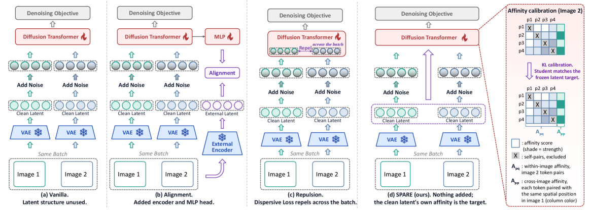
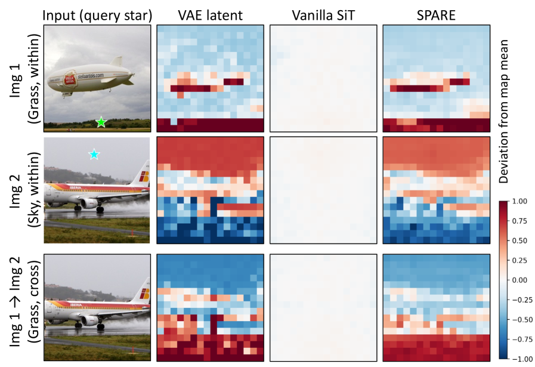

# AI Daily

## 今日閱讀
**[SPARE: Structural Parameter-Free Affinity Regularization for Flow Matching](https://arxiv.org/abs/2608.01990)**

### 論文基本信息
- **標題**: SPARE: Structural Parameter-Free Affinity Regularization for Flow Matching
- **作者**: Zong-Wei Hong, Jinglun Li, Shen Zhang, Yuhan Liu, Linze Li, Yao Tang
- **發表日期**: 2026-08-03
- **來源**: arXiv:2608.01990

### 核心貢獻和創新點
本文提出 **SPARE (Structural Parameter-Free Affinity Regularization)**，一種針對 Flow Matching 與 Diffusion Transformers (DiT) 的免參數（Parameter-Free）結構性親和力正則化方法。現有加速 DiT 訓練的表示正則化（Representation Regularization）方法分為兩派：
1. **Target-based（基於目標）**：如 REPA、SRA，需引入外部編碼器（如 DINOv2）與可訓練的 MLP 投影頭來對齊特徵，增加訓練成本。
2. **Target-free（無目標）**：如 Dispersive Loss，不需外部特徵，僅透過排斥同批次（Batch）內的樣本特徵來增加多樣性，但完全忽略了資料本身的空間結構。

SPARE 的核心洞見在於：**乾淨的資料潛在特徵（Clean Data Latent）本身就蘊含了豐富的空間與語義結構，且這些結構可以透過「親和力（Affinity，即 Token 間的相似度）」來表示**。親和力是一個純量，無需投影頭即可跨特徵空間比較。SPARE 透過計算中間層 Token 的成對親和力，並將其與乾淨潛在特徵的親和力分佈進行 KL 散度對齊，成功在**零額外參數**與極低內存開銷（僅增 0.08 GB）下，實現了強大的生成加速效果。

### 技術方法簡述
SPARE 將正則化分為兩個層次，並統一在一個分佈匹配的損失函數中：

1. **圖像內親和力（Within-Image Affinity）**：
   對於任意特徵矩陣 $\mathbf{u}$，計算其第 $p$ 個與第 $q$ 個 Token 之間的餘弦相似度：
   $$A_{pq}(\mathbf{u},\mathbf{u}') = \langle\hat{\mathbf{u}}^p, \hat{\mathbf{u}}'^q\rangle$$
   SPARE 將模型中間層特徵 $\mathbf{h}_i$ 的圖像內親和力 $A_{pq}(\mathbf{h}_i, \mathbf{h}_i)$，對齊到 VAE 乾淨潛在特徵 $\mathbf{v}_i$ 的親和力 $A_{pq}(\mathbf{v}_i, \mathbf{v}_i)$。這使得模型能學習到物件邊界與空間佈局。

2. **跨圖像親和力（Cross-Image Affinity）**：
   有別於 Dispersive Loss 盲目排斥批次內的所有樣本，SPARE 發現不同圖像在**相同空間位置**（Same-position）上往往具有一致的結構分佈（如天空在上方，草地在下方）。因此，SPARE 將跨圖像的同位置親和力 $A_{pp}(\mathbf{h}_i, \mathrm{sg}[\mathbf{h}_{i'}])$ 也納入對齊目標，其中 $\mathrm{sg}[\cdot]$ 為停止梯度操作。

**統一的訓練目標**：
將每個 Token 視為錨點（Anchor），構建候選集合 $\mathcal{C}(i,p)$（包含同圖其他位置與他圖同位置）。模型計算預測分數 $s_{i,p}$，乾淨潛在特徵計算目標分數 $t_{i,p}$，經過溫度 $\tau$ 的 Softmax 後，計算 KL 散度：
$$\mathcal{L}_{\mathrm{SPARE}} = \frac{1}{|\mathcal{B}| P} \sum_{i,p} D_{\mathrm{KL}}\bigl(\sigma_\tau(t_{i,p}) \,\|\, \sigma_\tau(s_{i,p})\bigr)$$
最終損失為 Flow Matching 損失與 $\mathcal{L}_{\mathrm{SPARE}}$ 的加權和。

### 實驗結果和性能指標
在 ImageNet $256 \times 256$ 且訓練預算對齊為 400K 迭代的設定下：
- **免參數方法最佳**：SPARE 在 SiT-B/2 與 SiT-XL/2 上，全面超越 Dispersive Loss 等免參數方法。SiT-XL/2 的 FID 達到 **13.86**（無 CFG），優於 Dispersive Loss 的 15.54。
- **與 REPA 互補**：SPARE 可直接疊加於需參數的 REPA 之上。組合後，SiT-XL/2 在 400K 迭代的 FID 從 7.90 降至 **7.49**；在 1M 迭代且使用 CFG ($w=1.35$) 時，FID 達到 **1.90**（REPA 為 1.96）。
- **極致的訓練效率**：SPARE 不增加任何參數與前向計算量（FLOPs），內存僅增加 0.08 GB，訓練速度與 Baseline 幾乎一致。

### 相關研究背景
近年來，Diffusion Transformers (DiT) 的訓練加速主要依賴 Representation Alignment（表示對齊）。
- **REPA (2024)**：首創將 DiT 中間層對齊 DINOv2，大幅加速收斂，但依賴外部模型。
- **SRA (2025) / SRA2 (2026)**：移除 DINOv2，改對齊 EMA 教師或 VAE 特徵，但仍需 MLP 投影頭。
- **Dispersive Loss (2025)**：提出完全免參數的批次內特徵排斥，但效果受限。
SPARE 巧妙地將 VAE 潛在特徵的**親和力結構**作為免費的監督信號，填補了免參數與結構對齊之間的空白。

### 個人評價和意義
SPARE 是一篇非常優雅且實用的論文。它點出了一個常被忽略的事實：**VAE 提取的 Latent 本身就具備極強的空間幾何先驗**。與其用複雜的 MLP 將模型特徵映射到 VAE 空間（如 SRA2），不如直接在特徵內部計算 Token-to-Token 的親和力（Cosine Similarity），這不僅繞過了維度不匹配的問題，還能完美保留幾何結構。

更令人驚艷的是其對「跨圖像（Cross-Image）關係」的重新審視。過去的 Target-free 方法（如 Dispersive Loss）認為 Batch 內的樣本應盡量排斥以增加多樣性；但 SPARE 證明，自然圖像在特定位置（如天空、地面）有其統計一致性，盲目排斥反而有害。這種「將關係作為目標」的 Training-Free 思想，對未來設計更高效的 Flow Matching / DiT 訓練框架，甚至是將其推廣至 Video Generation 或 3D Generation，都有著極大的啟發意義。
