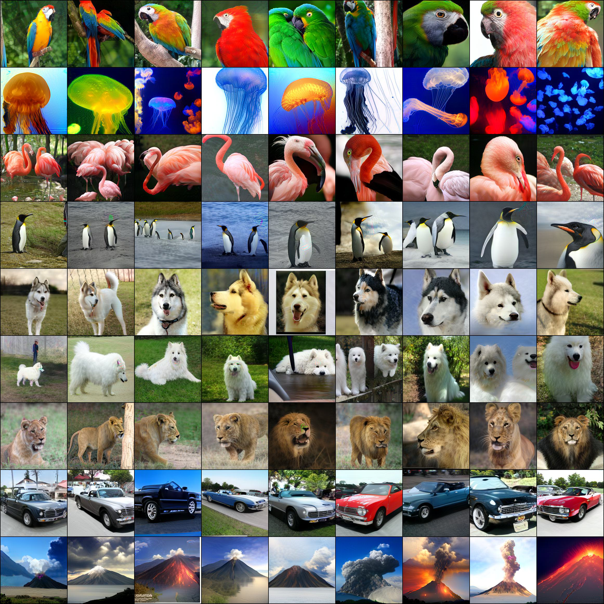

# AI Daily

**日期：2026-08-18**  
**今日主題：Energy-Based Models、對抗式訓練與可擴展圖像生成**  
**作者：Manus AI**

## Scalable Energy-Based Models via Adversarial Training: Unifying Discrimination and Generation

今日選擇 **Scalable Energy-Based Models via Adversarial Training: Unifying Discrimination and Generation**。論文由 Xuwang Yin、Claire Zhang、Julie Steele、Nir Shavit 與 Tony T. Wang 撰寫，正式收錄於 **ICLR 2026**；作者單位包括 MIT／CSAIL 與 Independent。[1] [2] 這篇工作特別值得閱讀，因為它不是再提出一個更大的 diffusion backbone，而是重新處理 Energy-Based Model（EBM）長期存在的訓練穩定性與可擴展性問題：把 JEM 依賴的 SGLD 近似，改成由 PGD 對比樣本驅動的 adversarial training，並將分類 robustness 與生成能力放進同一個 energy landscape 中學習。

> **一句話摘要：** DAT 將「模型如何判斷一張圖像」與「模型如何生成一張圖像」統一為同一個能量函數的兩種梯度用途，再以雙重對抗訓練讓這個能量函數從 CIFAR 級的 JEM 擴展到 ImageNet 256×256。

## 為什麼從候選中選它

本次先從 arXiv、ICLR／CVPR 官方頁面與 Hugging Face Trending Papers 搜尋近期研究，再以頂會層級、作者／研究單位、方法原創性、公式完整度、實驗可比性與既有文章重複風險進行篩選。repository 目前已經有 UniJEPA、MVAR、EG-FM、Semantic Steering、EditMod 等相鄰主題，因此下列同名或同方法論文被排除；今日選文則未在 `AI_Daily` 中找到相同標題、arXiv ID `2510.13872` 或 Dual Adversarial Training（DAT）的既有文章。[3] [4] [5]

| 候選 | 篩選結果 | 原因 |
|---|---|---|
| **Scalable EBM / DAT** | **入選** | ICLR 2026 正式收錄；直接命中 Energy-Based、image generation 與 robustness，且在 ImageNet 256×256 提供完整效率與消融結果。[1] |
| Concept Guidance | 保留為高價值候選 | 以逐層 concept mutual information 做 training-free diffusion guidance，與 attention／中間層調制高度相關；但不是 EBM、JEPA 或 VAR 主題。[6] |
| One-to-More / O2MAG | 排除本日 | CVPR 2026 的 training-free attention control 很有價值，但研究問題集中在 industrial anomaly synthesis，普適性略低於 DAT。[7] |
| UniJEPA | 排除重複 | repository 已有 `papers/2026/2026-08/UniJEPA/` 的完整文章。 |
| MVAR | 排除重複 | repository 已有同一篇 ICLR 2026 論文的完整文章，不能再次發布。 |
| DiFA | 保留為後續候選 | training-free diffusion inference-time alignment 的方法新穎，但目前是 arXiv 預印本，且不直接命中 EBM／JEPA／VAR。[8] |

## 研究背景：從分類器到能量函數

EBM 不直接以 normalized probability density 的形式描述資料，而是學習一個能量函數 $E_	heta(x)$；低能量代表樣本更符合模型所學到的資料分佈。對應的機率可寫成

\[
p_\theta(x)=\frac{\exp\left(-E_\theta(x)\right)}{Z(\theta)},
\]

其中 $Z(\theta)$ 是通常難以直接計算的 partition function。JEM 的關鍵洞見是：若分類器輸出 logits $f_\theta(x)\in\mathbb{R}^{K}$，便可以把標準分類器重新解釋為 joint distribution $p_\theta(x,y)$ 的 EBM。對類別 $y$ 而言，其聯合能量為

\[
E_\theta(x,y)=-f_\theta(x)[y],
\]

而將 label 邊際化後，輸入 $x$ 的能量可以寫成

\[
E_\theta(x)=-\log\sum_{y=1}^{K}\exp\big(f_\theta(x)[y]\big).
\]

如此一來，forward pass 可以用於分類，對輸入的 energy gradient 則可用於生成、OOD detection 或 counterfactual。JEM 論文展示了同一混合模型在分類、校準、robustness 與生成上的潛力，但其生成訓練需要從模型分佈取負樣本，通常依賴 SGLD／MCMC，造成高解析度訓練不穩定與計算成本高的瓶頸。[9]

後續的 AT-EBM 證明 adversarial training 可以替代部分 MCMC 式 EBM learning，並學習描述資料 support 的特殊 energy function；然而該方向主要處理無條件生成，且仍需要額外的梯度正則化設計。[10] EGC 則以 diffusion process 與 Fisher divergence 估計 noised-data score，讓同一網路的 forward pass 做分類、backward score 做生成；它代表另一條「以 diffusion 穩定 EBM」的路線。[11]

## 核心貢獻

第一，論文提出 **Dual Adversarial Training（DAT）**，在同一個 JEM 架構中對生成項與分類項同時採用 adversarial training。生成端不再使用 SGLD 近似 $p_\theta(x)$，而以 PGD 從 OOD 或隨機初始化影像產生 contrastive samples，再用 BCE 學習能量分界；分類端則使用標準 adversarial classification loss，讓 energy landscape 同時具備生成與分類 robustness。

第二，DAT 以 **two-stage training** 解決 normalization 與初始化不穩定。Stage 1 先使用 standard adversarial training checkpoint；Stage 2 再從該 checkpoint 開始 joint training。對 ResNet／WRN，作者在第二階段固定 BatchNorm 的統計模式；對生成項則使用較基本的 augmentation，避免強分類 augmentation 將資料分佈扭曲成不適合生成的樣子。[2]

第三，作者將方法推進至 **ImageNet 256×256**，並同時報告 clean accuracy、robust accuracy、FID、IS、參數量、採樣步數、訓練 overhead 與 throughput。這使 DAT 不只是一個「生成品質尚可的 robust classifier」，而是一個可以和 VAR、ADM、LDM 等專用生成模型直接比較的 hybrid model。

## 技術方法詳解

### 1. JEM 的標準目標與瓶頸

JEM 對 joint log-likelihood 做 factorization：

\[
\log p_\theta(x,y)=\log p_\theta(y\mid x)+\log p_\theta(x).
\]

第一項可以用標準 cross-entropy 最佳化；第二項的 EBM gradient 則是

\[
\nabla_\theta\mathbb{E}_{x\sim p_{\mathrm{data}}}
\left[\log p_\theta(x)\right]
=
\mathbb{E}_{x\sim p_{\mathrm{data}}}
\left[-\nabla_\theta E_\theta(x)\right]
-
\mathbb{E}_{x\sim p_\theta}
\left[-\nabla_\theta E_\theta(x)\right].
\]

第一個期望降低真實資料的能量，第二個期望提高模型樣本的能量。問題在於第二個期望需要從 $p_\theta$ 取樣；傳統 SGLD 更新為

\[
x_{t+1}=x_t-\frac{\alpha}{2}\nabla_xE_\theta(x_t)+\xi_t,
\qquad
\xi_t\sim\mathcal{N}(0,\alpha I),
\]

而高維影像中的短鏈 SGLD 往往未能充分混合，長鏈則帶來顯著訓練成本與不穩定性。[2] [9]

### 2. 以 BCE 取代 SGLD 式 energy learning

DAT 將原本無界的 energy gradient 改寫為帶有 data-dependent scaling 的形式。令 $\sigma$ 為 logistic sigmoid，則真實資料與 contrastive samples 的梯度權重分別為

\[
\alpha(x)=1-\sigma\left(-E_\theta(x)\right),
\qquad
\beta(x)=\sigma\left(-E_\theta(x)\right).
\]

當 $-E_\theta(x)$ 變得極端時，sigmoid saturation 會把對應梯度壓低，避免能量值無限制爆炸。其對應的生成損失是 Binary Cross-Entropy：

\[
\begin{aligned}
\mathcal{L}_{\mathrm{BCE}}(\theta)=
&-\mathbb{E}_{x\sim p_{\mathrm{data}}}
\left[\log\sigma\left(-E_\theta(x)\right)\right]\\
&-\mathbb{E}_{x\sim p_\theta}
\left[\log\left(1-\sigma\left(-E_\theta(x)\right)\right)\right].
\end{aligned}
\]

直觀地說，模型被要求讓真實資料具有較低 energy、讓 contrastive samples 具有較高 energy；但是它不必精確計算 partition function，也不必把 SGLD 當成完整的 negative-phase sampler。論文的理論分析指出，這個 BCE 目標的最優解主要學習 $p_{\mathrm{data}}$ 的 support，而不是完整密度；這是穩定性換取的表達限制，也是閱讀 DAT 時不能忽略的 caveat。[2]

### 3. PGD contrastive sampling

DAT 使用 auxiliary OOD data 作為 PGD 初始化。對 CIFAR，作者使用 80 Million Tiny Images；對 ImageNet，從 Open Images training set 中抽取與 ImageNet 類別不重疊的影像，形成約 300K training samples 與 50K FID evaluation samples。[2] PGD 的 normalized gradient update 為

\[
x_{t+1}=x_t-
\eta\frac{\nabla_xE_\theta(x_t)}{\left\|\nabla_xE_\theta(x_t)\right\|_2},
\qquad t=0,1,\ldots,T-1.
\]

生成時若指定類別 $y$，則沿著降低 joint energy 的方向更新：

\[
x_{t+1}=x_t+
\eta\frac{\nabla_x\left(-E_\theta(x_t,y)\right)}
{\left\|\nabla_x\left(-E_\theta(x_t,y)\right)\right\|_2}.
\]

這個操作既是訓練期間的 contrastive sample proposal，也是推論期間的 generator。作者另外示範純 random noise 初始化仍能訓練 DAT，代表 auxiliary dataset 並非理論上的必要條件，但 OOD initialization 在生成品質上通常更好。[2]

### 4. 分類端的 adversarial training 與雙重目標

對真實樣本 $(x,y)$，先在 $\ell_p$ ball $B(x,\epsilon)$ 內尋找最容易造成分類錯誤的 adversarial example：

\[
x_{\mathrm{adv}}=
\arg\max_{x'\in B(x,\epsilon)}
\mathcal{L}_{\mathrm{CE}}(\theta,x',y).
\]

分類端損失為

\[
\mathcal{L}_{\mathrm{AT\text{-}CE}}(\theta)=
\mathbb{E}_{(x,y)\sim p_{\mathrm{data}}}
\left[-\log p_\theta(y\mid x_{\mathrm{adv}})\right].
\]

DAT 的完整 joint objective 是

\[
\mathcal{L}(\theta)=
\mathcal{L}_{\mathrm{AT\text{-}CE}}(\theta)+
\mathcal{L}_{\mathrm{BCE}}(\theta).
\]

這個加總不是任意 multi-task loss，而是對應 JEM 的 joint log-likelihood factorization。分類端的 AT 除了提高 robust accuracy，也對 energy gradient 提供隱式 $R_1$ regularization，因此作者不再需要 AT-EBM 中的顯式梯度懲罰。[2] [10]

## 實驗結果

作者在 CIFAR-10、CIFAR-100 與 ImageNet 256×256 評估 DAT。分類指標包含 clean accuracy 與 AutoAttack robust accuracy；生成指標包含 FID 與 IS。FID／IS 的主要結果以 50K class-balanced generated samples 計算，ImageNet 的 robust accuracy 使用 $\ell_2$ attack budget $\epsilon=3.0$。[2]

### CIFAR 結果

| Dataset / model | Clean Acc. ↑ | Robust Acc. ↑ | IS ↑ | FID ↓ |
|---|---:|---:|---:|---:|
| CIFAR-10 DAT, $T=40$ | 91.92 | 75.75 | 9.92 | 9.12 |
| CIFAR-10 DAT, $T=50$ | 90.72 | 74.65 | 9.86 | **7.57** |
| CIFAR-10 Standard AT | 92.43 | 75.73 | 9.58 | 28.41 |
| CIFAR-10 JEM | 92.90 | 40.50 | 8.76 | 38.40 |
| CIFAR-100 DAT, $T=50$ | 60.12 | 42.55 | 11.12 | **9.53** |

表中可見，增加 PGD steps $T$ 往往改善生成 FID，卻會犧牲部分 clean／robust accuracy；這不是單純的「steps 越多越好」，而是 generative–discriminative trade-off。CIFAR-10 上，DAT $T=50$ 將 FID 從 standard AT 的 28.41 降至 7.57，同時 robust accuracy 維持在 74.65%。[2]

### ImageNet 256×256 結果

*圖 1：從論文 PDF 提取的 DAT ConvNeXt-L-CvSt ImageNet conditional samples。原文將這些樣本作為代表性視覺結果；它們用於說明類別條件生成的外觀品質，不取代 FID／IS 等定量評估。*

| Model | Clean Acc. ↑ | Robust Acc. ↑ | FID ↓ | IS ↑ | Params | Sampling steps |
|---|---:|---:|---:|---:|---:|---:|
| DAT ResNet-50, $T=30$ | 55.96 | 37.14 | 5.28 | 319.3 | 26M | 14 |
| DAT WRN-50-4, $T=65$ | 58.78 | 40.74 | 4.94 | 358.0 | 223M | 19 |
| **DAT ConvNeXt-L-CvSt, $T=110$** | **75.78** | **56.40** | **3.29** | 310.2 | **198M** | 36 |
| ADM-G | — | — | 4.59 | 186.7 | 608M | 250 |
| LDM-4-G | — | — | 3.60 | 247.7 | 400M | 250 |
| DiT-XL/2-G | — | — | **2.27** | 278.2 | 675M | 250 |
| VAR-d16 | — | — | 3.30 | 274.4 | 310M | 10 |

DAT ConvNeXt-L 的 FID 3.29 幾乎匹配 VAR-d16 的 3.30，且參數量較少；相較 ADM-G 與 LDM-4-G，DAT 也有較低 FID 與大幅較少的 sampling steps。[2] 但需要精確解讀：同一張表中的 DiT-XL/2-G FID 為 2.27，低於 DAT 的 3.29，因此不能把 DAT 宣稱為「勝過所有 diffusion models」。更準確的說法是：DAT 以 hybrid EBM 的身份擊敗表中的 ADM-G／LDM-4-G，接近 VAR-d16，並在較少 sampling steps 下取得具競爭力的品質；它仍落後於該表的 DiT-XL/2-G 與更大型 VAR-d30-re。

### 效率與推理成本

DAT ConvNeXt-L 的 Stage 2 training overhead 為 standard AT 的 **1.36×**，Stage 2 約使用 8 張 MI300、20 wall-clock hours；生成 throughput 為約 **5 images/s**。相較之下，作者表中 ADM-G 約為 0.17 images/s、LDM-4-G 約為 0.96 images/s，因此 DAT 約為 ADM-G 的 29 倍、LDM-4-G 的 5 倍 throughput。[2] 這裡的效率優勢不是「無迭代」，而是 EBM 的 PGD 生成只需 13–36 steps，而 diffusion baseline 使用約 250 steps；VAR-d16 則以 10 steps 生成，因此仍有不同的效率路線。

### Counterfactual generation 與失敗分析

DAT 的一個獨特用途是 visual counterfactual explanation。由於分類與生成共用同一個 joint energy，對 $E_\theta(x,y)$ 做輸入梯度下降，可以在不依賴外部 diffusion model 或額外 robust classifier 的前提下，將影像推向另一個目標類別。論文報告，在相近的 target-class confidence 下，RATIO 在 $\epsilon=8$、confidence 0.89 時的 counterfactual FID 為 43.18；DAT 在 $\epsilon=4$、相近 confidence 下的 FID 為 25.53。[2]

不過作者也誠實報告，DAT 在 OOD detection 通常不如 RATIO，且 calibration 依資料集而異：CIFAR-10 的 calibration 較好，但 CIFAR-100 與 ImageNet 會出現較高 overconfidence。這說明 generative loss、robustness、OOD detection 與 calibration 並不會因共享 energy function 而自動同時最優。[2]

## 與相關研究的差異

| 研究 | 能量學習方式 | 生成方式 | 主要優勢 | DAT 的差異 |
|---|---|---|---|---|
| JEM | 分類 logits 重新解釋為 joint energy；負相依賴 SGLD／MCMC | SGLD／energy gradient | 統一分類與生成 | DAT 以 PGD+BCE 取代不穩定的 SGLD，並把 robustness 納入 joint training。[9] |
| AT-EBM | Binary adversarial training | PGD-based energy generation | 穩定、robust、可生成 | DAT 把 AT-EBM 的 energy learning 放入 conditional JEM，加入 discriminative AT、two-stage training 與高解析度 ImageNet。[10] |
| EGC | Diffusion process、Fisher divergence 與 score learning | diffusion／score gradient | 同一網路做分類與 diffusion generation | EGC 偏向 noised-data score matching；DAT 偏向 PGD contrastive support learning 與 adversarial robustness。[11] |
| VAR | Next-scale autoregressive token prediction | 多尺度 token generation | 低 sampling steps、強生成品質 | DAT 不是 VAR 架構，但在 ImageNet 256×256 以 FID 3.29 接近 VAR-d16 的 3.30；兩者可互相啟發 energy-guided scale-wise generation。[2] |

## 我的評價與研究意義

我認為 DAT 最值得重視的地方不是單一 FID，而是它重新定義了「energy-based generator 的訓練樣本從哪裡來」。傳統 EBM 的核心困難是 negative phase：模型必須從自己定義的分佈取樣，然後用這些樣本修正能量。DAT 將這個問題改寫成一個對抗式 support-shaping 問題：從 OOD 或 noise 出發，用輸入梯度把樣本推向低能量區，再以 BCE 將真實資料和 contrastive samples 分開。這個替代使 energy gradient 同時具有生成方向、分類解釋性與 adversarial robustness 的意義。

但 DAT 也不是「EBM 已經全面取代 diffusion／VAR」。首先，BCE 目標學習的是 data support，而非完整 likelihood；其次，生成仍需多步 PGD，並且對 OOD initialization、PGD steps、augmentation 和 loss balance 敏感；第三，作者的 ImageNet 表格顯示 DAT 在 FID 上接近 VAR-d16、優於 ADM-G／LDM-4-G，但不優於 DiT-XL/2-G。因此更合理的定位是：DAT 提供了一個**可與 Transformer、VAR 或 diffusion backbone 組合的 energy-learning interface**，而不是一個已在所有生成指標上勝出的單一架構。

## 對 Energy-Based Transformer、JEPA、VAR 與 Training-Free 的延伸想法

### 1. DAT 與 Energy-Based Transformer

可以把 JEM 的 classifier logit $f_\theta(x)[y]$ 換成 token-level Transformer energy，例如令最後層 hidden states 為 $H\in\mathbb{R}^{N\times d}$，用一個 permutation-aware pooling $g(H)$ 定義

\[
E_\theta(x,y)=-w_y^\top g(H_\theta(x))-b_y.
\]

關鍵研究問題不是「Transformer 能否當 classifier」，而是 attention 的全域互動是否會讓 PGD energy gradient 變得過度尖銳。可以比較 pre-norm、RMSNorm、局部 attention 與 global attention 對 $\|\nabla_xE\|$、energy Hessian proxy、FID 與 robust accuracy 的影響；這會把既有 Energy-based Transformer 的架構討論，轉成可測量的能量地形問題。

### 2. DAT 與 VAR 的 scale-wise energy guidance

VAR 在不同 scale 逐步生成 visual tokens。可以為每個 prefix 定義條件能量 $E_k(r_{\le k},y)$，再在 token logits 或 latent representation 上施加 energy gradient：

\[
r_k' = r_k-\eta_k\nabla_{r_k}E_k(r_{\le k},y).
\]

這個方向讓 DAT 的 energy function 成為 VAR 的 scale-wise critic：coarse scale 先保證類別與全局語義，fine scale 再用較小的 energy correction 修正局部語義。應實驗比較「直接更新 token latent」、「更新 logits 前的 hidden state」與「只在早期 scale 更新」三種介入方式，並同時報告 FID、GenEval、sampling latency 與 token-level calibration。

### 3. DAT 與 JEPA 的 latent energy

JEPA 預測的是 representation，而不是像素。可以讓 energy 同時衡量 observation latent 與 predicted latent 的一致性：

\[
E_{\mathrm{JEPA}}(z_t,\hat z_{t+1},a_t)=
\lambda_{\mathrm{pred}}\|\hat z_{t+1}-z_{t+1}\|_2^2
+E_{\mathrm{task}}(z_t,a_t).
\]

在這個視角下，PGD 不一定直接修改 pixel，而可以在 latent world model 中尋找低能量的 future state。這可能把 DAT 的「由 energy gradient 產生 counterfactual」延伸成「由 predictive energy 產生可規劃的 counterfactual rollout」，並自然連接已有 JEPA 的 temporal prediction 與 physical grounding 研究。

### 4. Training-free inference-time energy steering

DAT 本身需要訓練，但其生成端提供一個很清楚的 inference-time interface：只要能計算 $\nabla_xE(x,y)$，就可以做 energy-guided refinement。下一步可以凍結既有 DAT／robust classifier，把它當成 external energy critic，對另一個 diffusion、flow matching 或 VAR generator 做少量 one-shot correction。這種方法必須嚴格區分「energy critic 已預訓練」與「整個流程 training-free」：後者只代表推理期不更新參數，不代表取得 critic 不需要訓練。

## 結論

Scalable EBM 的主要價值，是證明 EBM 的困難不必只能透過更長的 MCMC chain 或更大的生成 backbone 解決；改變 negative-sample construction 與 training objective，同樣可能把分類與生成重新拉回同一個可計算的 energy landscape。DAT 以 PGD、BCE、adversarial classification 與 two-stage training 組成一個簡潔而有延展性的接口，讓 EBM hybrid 首次以較可信的方式進入 ImageNet 256×256 的規模。

對目前關注 **Energy-based Transformer、JEPA、VAR、training-free、attention modulation 與 zero-shot** 的研究者而言，最值得帶走的不是「DAT 的 FID 是多少」，而是下面這個研究問題：**能否把一個可解釋的 energy gradient，轉成 Transformer token、JEPA latent 或 VAR scale 的局部控制訊號，同時維持生成品質、穩定性與可校準性？** 這個問題比單純追逐新的 backbone 更可能形成下一篇具有方法辨識度的研究。

## References

[1]: https://proceedings.iclr.cc/paper_files/paper/2026/hash/6fcb1afcc1e9c2c82c8ddddf03bcf0f6-Abstract-Conference.html "ICLR 2026 Proceedings: Scalable Energy-Based Models via Adversarial Training"
[2]: https://arxiv.org/html/2510.13872v4 "Scalable Energy-Based Models via Adversarial Training: Unifying Discrimination and Generation, arXiv v4"
[3]: https://github.com/KaiCobra/AI_Daily "KaiCobra/AI_Daily repository"
[4]: https://huggingface.co/papers/trending "Hugging Face Trending Papers"
[5]: https://github.com/KaiCobra/AI_Daily/blob/main/.existing_reports_inventory.txt "AI_Daily existing reports inventory"
[6]: https://arxiv.org/html/2608.14172v1 "Concept Guidance: Precise, Training-Free Latent Control for Text-to-Image Generation"
[7]: https://openaccess.thecvf.com/content/CVPR2026/html/Rao_One-to-More_High-Fidelity_Training-Free_Anomaly_Generation_with_Attention_Control_CVPR_2026_paper.html "One-to-More: High-Fidelity Training-Free Anomaly Generation with Attention Control"
[8]: https://arxiv.org/html/2607.17972v1 "DiFA: Inference-Time Forward-Process Alignment for Diffusion Models"
[9]: https://arxiv.org/abs/1912.03263 "Your Classifier is Secretly an Energy Based Model and You Should Treat it Like One"
[10]: https://arxiv.org/abs/2012.06568 "Learning Energy-Based Models With Adversarial Training"
[11]: https://guoqiushan.github.io/egc.github.io/ "EGC: Image Generation and Classification via a Diffusion Energy-Based Model"
