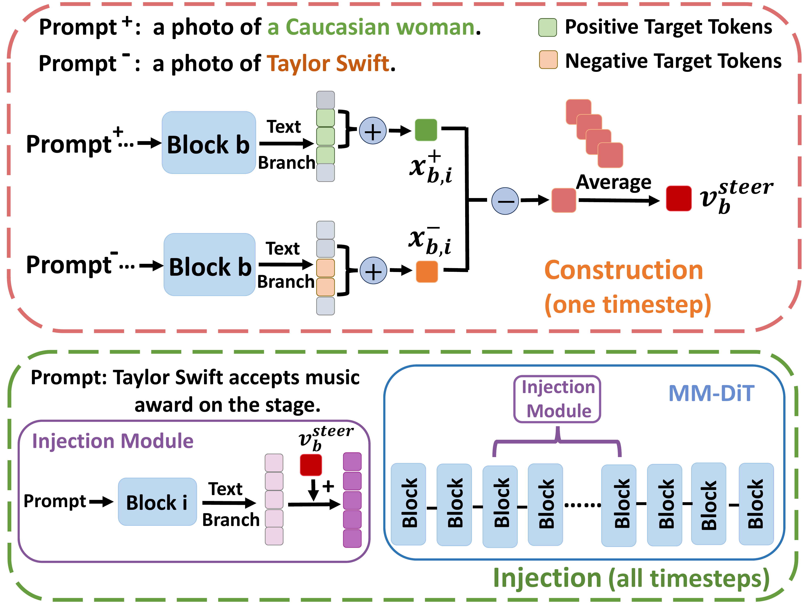
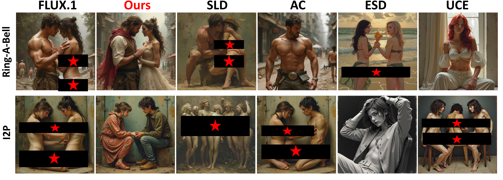

# AI Daily

## 2026-08-16：Semantic Steering——在 MM-DiT 內部以單一語義向量實現 Training-Free Concept Erasure

> **一句話摘要：** Semantic Steering 不修改模型權重，也不依賴逐 timestep 的 prompt engineering；它先在 Multimodal Diffusion Transformer（MM-DiT）的中間 block、text branch 中，以「不安全概念 ↔ 安全替代概念」的 paired prompts 建立語義差向量，再把同一個 steering vector 注入連續的 early+middle blocks，讓 SDv3.5 與 FLUX.1 在推理時完成概念移除、風格轉換與對抗提示防禦。[1] [2]

## 1. 為什麼今天選這篇？

本次先檢查 `KaiCobra/AI_Daily` 既有文章與索引，再搜尋 arXiv 最新論文、Hugging Face Trending 與相關研究。儲存庫截至 2026-08-15 已收錄 xLARD，且近期已涵蓋 V-RAE、JoyAI-Video-Edit、AdaLN-Zero、EG-FM、UDT、RTD、FreqForcing、UniGen-AR 等工作；因此已發布的 JoyAI-Video-Edit 等候選被排除。Hugging Face Trending 頁面當日仍將 JoyAI-Video-Edit 列為熱門論文，但它已經存在於本儲存庫中，不能再次作為今日新增文章。[8]

Semantic Steering 於 2026-08-13 提交 arXiv，論文頁面標示 **Accepted to ACM MM 2026**，而論文前置資訊列出其將收錄於第 34 屆 ACM International Conference on Multimedia（MM ’26）。[1] [2] 它與近期 AI Daily 關注的 **training-free、attention/representation modulation、zero-shot controllability** 高度吻合，但切入點不是再設計 sampler，而是回答一個更基礎的問題：**MM-DiT 的哪一段內部表徵真正承載「概念」？**

| 篩選面向 | 判斷 |
|---|---|
| 時效性 | 2026-08-13 提交，晚於近期已收錄的多數 8 月論文。 |
| 會議/出版 | 論文頁面標示 ACM MM 2026 接收，屬使用者指定的優先會議。 |
| 研究單位 | 中國科學院信息工程研究所與中國科學院大學；論文由國家重點研發計畫支持。[1] |
| 技術方向 | Frozen MM-DiT、training-free inference、內部 activation steering、rectified flow、對抗提示防禦。 |
| 與既有文章差異 | 既有文章多從 attention map、latent、頻域或 sampler 操作；本作以中間 block 的 text-branch semantic difference 建立單一跨 block 向量。 |

## 2. 論文基本資訊

| 欄位 | 內容 |
|---|---|
| 論文標題 | **Semantic Steering for Controllable Generation: Tuning-Free Concept Erasure in Multimodal Diffusion Transformers** |
| 作者 | Qiao Li, Xiaomeng Fu, Yuanshu Zhao, Qipeng Wang, Jiao Dai, Jizhong Han |
| 研究單位 | Institute of Information Engineering, Chinese Academy of Sciences；School of Cyber Security, University of Chinese Academy of Sciences |
| 發表資訊 | arXiv:2608.12829；頁面標示 ACM MM 2026；DOI: 10.1145/3767308.3835565 [1] [2] |
| 模型 | Stable Diffusion-v3.5-medium、FLUX.1[DEV] |
| 評估概念 | Celebrity、art style、nudity；正常影像以 COCO-30K 評估，robustness 使用 Ring-A-Bell、MMA-Diffusion、I2P、P4D [1] |
| 核心標籤 | Multimodal Diffusion Transformer、concept erasure、activation steering、training-free |

## 3. 背景：為什麼大型 MM-DiT 不能只靠 Negative Prompt？

Stable Diffusion 3 與 FLUX 類模型將 image tokens 與 text tokens 放入共同的 multimodal Transformer block，透過 joint attention 讓文字與視覺表徵雙向互動。以 SDv3.5 為例，論文分析的 1024×1024 設定有 4096 個 image tokens，而 text branch 約有 154 或 333 個 tokens；兩者形成的資訊量極不對稱。[1]

傳統的 concept erasure 大致有兩條路線。第一條是修改權重，例如 UCE、ESD、MACE 或其他 fine-tuning 方法；這些方法可能達到較強的永久性移除，但需要重新訓練、權重編輯或額外 adapter，並可能傷害未相關概念。第二條是推理時 guidance，例如 Negative Prompt、Safe Latent Diffusion（SLD）與 TraSCE；它們不改模型權重，但仍主要在 prompt 或 latent trajectory 層面介入。[3] [4]

對大型 MM-DiT 而言，僅修改 prompt 有三個問題。第一，概念可能已經深埋在模型的 multimodal representation 中，不會因為 prompt 出現一個 negative term 就消失。第二，概念通常不是單一 token，而是包含同義詞、間接描述與情境依賴的廣義語義空間。第三，T5-XXL 等 sentence-level text encoder 產生的條件表徵不一定具有簡單的 token-level 線性可分性。[1]

> **關鍵問題：** 如果「Taylor Swift」或某種藝術風格的資訊已經被 text branch 與 image branch 共同加工，應該在文字進入模型之前改 prompt，還是直接在模型內部找到概念形成的位置？

## 4. 核心貢獻與創新點

### 4.1 中間 block 是概念語義的高密度區域

作者將高斯噪聲注入不同 Transformer block 的輸出，觀察生成結果的變化。Early blocks 主要影響整體布局；late blocks 主要細化局部紋理；而 middle blocks 的擾動會顯著改變主要物體、人物身份與藝術風格。進一步觀察 target-related token 的 T2I attention map，也顯示概念對應的主體在 middle blocks 最清楚。[1]

這個發現把「Transformer 深度」從單純的計算堆疊，重新解釋成一種具有語義分工的生成階段：early 負責 global structure，middle 負責 semantic commitment，late 負責 fine-grained refinement。對 attention modulation 而言，這比在所有 layers 等強度調制更有結構性。

### 4.2 只用稀疏 text-branch token，避免 4096 個 image tokens 的冗餘

作者沒有直接從龐大的 image branch 建立 steering vector，而是只聚合 paired prompts 中真正不同的 text tokens。這帶來兩個好處。其一，向量建構成本低；其二，向量更容易被解釋成「把 target concept 推向 safe concept 的方向」，而不是混入場景布局、紋理與隨機 latent 的差異。

### 4.3 用同一支向量跨多個 block、所有 denoising steps 注入

單獨修改 middle block 太弱，只改 early blocks 則容易破壞布局；因此作者選擇連續 early+middle blocks（SDv3.5 的實驗設定為 \(b=3,\ldots,10\)）累積 steering signal。向量在中間 timestep 建立，然後在 rectified flow 的整段去噪過程中重複使用。這個設計將「語義方向」與「生成時序」分開：方向只需估計一次，但作用貫穿整條採樣軌跡。

### 4.4 不只移除，也可以定向做 style transformation

與只追求「概念消失」的安全方法不同，Semantic Steering 將 safe prompt 換成不同的 desired target，就能把 Monet 導向 pixel art、photorealism 或 monochrome，也能把 Van Gogh 導向 cartoon、watercolor 或 ink wash。[1] 因此它同時是 concept erasure 與 controllable generation 的介面。

## 5. 技術方法：從 paired prompts 到 MM-DiT injection

### 5.1 MM-DiT 與 rectified flow 設定

論文以 text/image joint attention 為例，將兩種模態的 query、key、value 串接：

$$
Q=[Q_{text};Q_{image}],\qquad K=[K_{text};K_{image}],\qquad V=[V_{text};V_{image}].
$$

因此每一個 block 同時存在 T2I、I2T、I2I 與 T2T 互動。Stable Diffusion 3 類模型採用 rectified-flow 式的 straight transport。令 \(D_0\sim\pi_0\) 是 noise、\(D_1\sim\pi_1\) 是 data，前向插值為

$$
D_t=tD_1+(1-t)D_0.
$$

模型學習 velocity field \(V(D_t,t)\)，在離散 timestep 上以

$$
Z_{t_{i-1}}=Z_{t_i}+(t_{i-1}-t_i)V(Z_{t_i},t_i),
\qquad i=T,\ldots,1
$$

逐步從 noise 推向資料分佈。[1] 在這種較直的 trajectory 下，中間 timestep 取得的語義方向可以跨去噪步驟重用；這也是本方法能以單一向量維持一致控制的關鍵假設。

### 5.2 Steering vector 的建構

令 \(C_i^-\) 是含有待移除概念的 prompt，\(C_i^+\) 是只把該概念替換成安全目標的 prompt。例如：

$$
C_i^- = \text{“a photo of Taylor Swift”},\qquad
C_i^+ = \text{“a photo of a Caucasian woman”}.
$$

在中間 block \(b\) 與中間 timestep，分別取得兩個 prompt 的 text-branch hidden states。只聚合 paired prompts 中不同的 target tokens，得到 \(x_{b,i}^-\) 與 \(x_{b,i}^+\)，再對 \(n\) 組 paired prompts 取平均差：

$$
 v_b=\frac{1}{n}\sum_{i=1}^{n}\left(x_{b,i}^{+}-x_{b,i}^{-}\right).
$$

最後以 \(\ell\) 控制強度並正規化：

$$
 v_b^{\mathrm{steer}}=\ell\frac{v_b}{\lVert v_b\rVert_2}.
$$

因此，\(v_b^{\mathrm{steer}}\) 不是一個重新訓練得到的 parameter，而是從 frozen model 的內部表徵中計算出來的 inference-time direction。報告中所稱的 **training-free**，精確地說是「不更新 MM-DiT 權重」，並不等於完全不需要任何離線 prompt pair 準備。

*圖 1：論文原始方法流程圖的 PNG 轉換版。上半部在一個 timestep 建構 paired-prompt semantic difference，下半部把同一支向量注入多個 MM-DiT blocks，並在所有 timesteps 使用。圖像由論文 PDF 原生圖表擷取，非整頁截圖。[1]*

### 5.3 為什麼是 early+middle，而不是所有 blocks？

若只注入 single middle block，訊號通常不足以改變已形成的生成狀態；若只注入多個 early blocks，又會過度改變 global layout，造成結構扭曲。作者因此將向量注入連續的 early+middle blocks，讓結構與語義共同受到漸進式偏移，而略過最早幾個只負責粗布局的 block 與 late detail blocks。[1]

消融結果也支持這個選擇。只在 single early block 注入時，celebrity GIPHY 為 0.395；single middle 與 single late 分別為 0.625 與 0.686，表示概念幾乎沒有被有效移除。相較之下，Ours 的 multiple early+middle injection 將 GIPHY 降至 0.020，並維持 5.522 的 aesthetic score。對 art style，Ours 的 Gram score 為 0.137，而 single middle 為 0.541。

### 5.4 Steering strength 與穩定區間

作者觀察到 celebrity erasure 在 \(\ell=10\) 至 \(60\) 間快速改善，之後進入穩定區間；art style 則約在 \(\ell=30\) 後收益放緩。論文選擇 celebrity \(\ell=70\)、art style \(\ell=40\)，以平衡移除效果與 aesthetic quality。這顯示向量的方向比精確的強度更重要，但過大的 \(\ell\) 仍可能把 style 的全局資訊一併破壞。[1]

## 6. 實驗結果

### 6.1 主結果：SDv3.5-medium 與 FLUX.1

下表整理論文 Table 1 的主要數值。GIPHY、LLaVA、NudeNet、Gram 越低越好；LPIPS、Aesthetic、CLIP 越高越好；FID 越低越好。數值均來自論文在 celebrity、art style、nudity 三個概念類別上的實驗。[1]

| 模型與任務 | 指標 | Base | Ours | 解讀 |
|---|---:|---:|---:|---|
| SDv3.5 celebrity | GIPHY ↓ / LLaVA ↓ | 0.602 / 0.524 | **0.020 / 0.002** | 概念移除大幅增強。 |
| SDv3.5 celebrity | Aesthetic ↑ / FID ↓ | 5.621 / 17.85 | **5.522 / 18.34** | 以極小正常影像品質代價換取移除。 |
| SDv3.5 art style | Gram ↓ / LPIPS ↑ | 1.000 / 0.000 | **0.137 / 0.636** | 風格表徵顯著被改寫。 |
| SDv3.5 nudity | NudeNet ↓ | 0.739 | **0.220** | 敏感概念顯著下降。 |
| FLUX.1 celebrity | GIPHY ↓ / LLaVA ↓ | 0.613 / 0.602 | **0.014 / 0.004** | 在更大型 MM-DiT 上仍有效。 |
| FLUX.1 celebrity | Aesthetic ↑ / FID ↓ | 5.989 / 19.83 | **6.248 / 19.92** | Aesthetic 反而提升，FID 幾乎不變。 |
| FLUX.1 art style | Gram ↓ / LPIPS ↑ | 1.000 / 0.000 | **0.192 / 0.729** | 風格移除與細節保留兼顧。 |
| FLUX.1 nudity | NudeNet ↓ | 0.359 | **0.023** | 對敏感概念有最明顯改善。 |

### 6.2 對抗提示 robustness

在 FLUX.1 上，作者使用 Ring-A-Bell、I2P、MMA-Diffusion 與 P4D 四類 adversarial prompts，全部以 NudeNet score 評估。Ours 的分數為 **0.057 / 0.014 / 0.016 / 0.013**，分別低於 ESD 的 0.127 / 0.065 / 0.021 / 0.071，以及其他 baseline。[1]

*圖 2：論文原始 robustness 圖的局部資產。Ours 欄位保留論文原有黑條與紅星遮罩；本報告不解除或重建敏感內容。它主要用來說明：同一組 adversarial prompt 下，推理期 representation steering 可以將輸出推向安全替代結果。[1]*

### 6.3 一個重要但容易被忽略的 trade-off

Art-style erasure 的 aesthetic score 不一定是越高越好。若方法只做很弱的 style suppression，生成結果仍然接近原始風格，反而可能在 aesthetic predictor 上得到較高分；Semantic Steering 進行更完整的 style transformation 後，若目標 style 不在 predictor 的主要分佈中，分數可能下降。因此，評估 concept erasure 時，不能只看 aesthetic score，還要同時看 Gram、LPIPS、概念 detector 與正常影像 FID/CLIP。[1]

## 7. 與相關研究的定位

| 工作 | 介入位置 | 是否訓練/改權重 | 主要優點 | 與 Semantic Steering 的差異 |
|---|---|---|---|---|
| Safe Latent Diffusion（SLD, CVPR 2023）[3] | Prompt/latent denoising guidance | 不需額外訓練 | 建立 I2P 與推理期安全抑制基線。 | 主要依賴 negative guidance，未直接讀取大型 MM-DiT 的中間語義表徵。 |
| TraSCE（2025）[4] | Diffusion trajectory | 不訓練、不改權重、不需 training prompts/images | 以 modified negative prompting 加 localized loss 反制 adversarial prompts。 | 直接修正 latent trajectory；Semantic Steering 改為修改 text-branch hidden representation。 |
| UCE / ESD / MACE / CA [1] | Cross-attention 或模型權重 | 需要權重編輯、fine-tuning 或 adapter | 可做較永久性的 concept removal。 | 部署成本與模型專用性較高；Semantic Steering 保留 frozen backbone 與可切換的 inference policy。 |
| CASteer（2026 v5）[5] | 每個 cross-attention layer、每個 timestep、image patches | 不訓練；離線建構 concept vectors | 以 dot-product 與 positive clipping 實現 context-aware、局部 suppression。 | Semantic Steering 只需中間 block text-branch paired vector，再跨 early+middle blocks 重用，推理介入更簡潔但對 prompt pair 依賴更強。 |
| SAeUron（ICML 2025）[6] | Diffusion intermediate activations | 需要訓練 sparse autoencoder | Feature 可解釋，能同時移除多概念並處理 adversarial attack。 | Semantic Steering 不需額外 SAE 訓練，但可解釋性來自 paired prompt 與 block hierarchy，而非 learned dictionary。 |

SLD 的 CVPR 版本明確指出其可在 diffusion process 中抑制 inappropriate image parts、無需額外訓練且不傷害整體品質；TraSCE 則將問題提升到 adversarial prompt 能否繞過 negative prompt 的層次。[3] [4] CASteer 進一步把 suppression 做成 cross-attention activation 的局部投影，SAeUron 則把可解釋性帶入 sparse autoencoder feature。Semantic Steering 的新意在於利用 **MM-DiT 特有的 block-wise semantic stratification**，用較低成本的 text-branch vector 取代 per-layer/per-timestep 的大量 activation probes。[5] [6]

## 8. 個人評價：這篇論文真正值得帶走的思想

我認為這篇論文最有價值的不是「把概念刪掉」這個應用本身，而是它提出了一個相當可移植的實驗範式：**先用受控擾動找出概念最敏感的深度區域，再在該區域學一個可解釋的方向，最後把方向以最少的介入範圍送回生成器。** 這個範式可以超越 safety，延伸到 style transfer、identity editing、prompt adherence、long-horizon consistency 與 controllable generation。

不過，論文也應該被精確地描述為 **training-free inference-time steering**，而不是永久的 model unlearning。它仍需要為每個目標概念準備 paired prompts，而且作者的 vector construction、block selection 與 \(\ell\) 都需要 concept-specific calibration。若 safe target 選得不恰當，模型可能不是「忘記」原概念，而是被推到某個特定 surrogate distribution；這對安全性、版權與身份概念的外推仍需更大規模測試。

此外，robustness 結果很亮眼，但主要集中在 nudity 與既定 adversarial prompt datasets。下一步應測試更廣泛的 compositional jailbreak、跨語言 prompt、圖像條件攻擊與多概念同時出現的情境；也要測量對 unrelated concept 的局部損害，而不只看整體 FID/CLIP。對實際部署而言，最重要的指標可能是 **Pareto frontier：erasure strength、normal prompt fidelity、latency、memory overhead、以及可逆性**，而不是單一 detector score。

## 9. 給 Energy-based Transformer、JEPA、VAR 研究的延伸問題

### 9.1 Energy-based semantic steering

可把 Semantic Steering 的向量視為一階近似的「安全方向」，再將它改寫成能量最小化問題。令 \(h_b\) 是 MM-DiT 第 \(b\) 個 block 的 text-branch representation，定義一個 target/safe energy difference：

$$
E_{safe}(h_b)=\frac{1}{2}\lVert h_b-h_b^+\rVert_2^2-
\frac{1}{2}\lVert h_b-h_b^-\rVert_2^2.
$$

在推理時可做小步更新

$$
 h_b' = h_b-\eta\nabla_{h_b}E_{safe}(h_b),
$$

再以 projection 或 trust-region 限制更新不傷害 unrelated semantics。這會把目前的固定向量 \(v_b^{\mathrm{steer}}\) 推廣成 **state-dependent energy gradient**：當概念在當前 latent 中越強，能量梯度越大；當概念沒有出現，調制自然接近零。這與 CASteer 的 positive clipping 具有概念上的連接，但可進一步加入多概念能量、互斥項與安全邊界。[5]

### 9.2 JEPA：用 predictive latent 取代文字 surrogate

Semantic Steering 使用 safe text prompt 來指定目標分佈；JEPA 可以提供另一種更穩定的條件。假設 encoder 將影像或影片片段映射至 latent \(z\)，predictor 估計未來 latent \(\hat z_{t+\Delta}\)。可以用 JEPA latent prototype 建構

$$
 v_b^{JEPA}=\mathbb{E}[z^+_{t+\Delta}-z^-_{t+\Delta}],
$$

並將 steering 目標從「替換文字概念」改成「把當前狀態推向可預測、物理一致或語義安全的 latent」。這可能讓 concept erasure 不再只依賴 prompt wording，而是依賴一個更平滑的 predictive representation；對影片生成，還能要求 steering 後的 latent rollout 具備 temporal consistency。

### 9.3 VAR：在 scale-wise generation 中做早期 commitment control

VAR 模型按 coarse-to-fine scale 生成 visual tokens。Semantic Steering 的 middle-block semantic commitment 可以對應到 VAR 的 early scale：在低解析度 token scale 先做概念方向調制，再讓高解析度 scale 只負責局部細節。可研究一個 scale-dependent vector

$$
 v_k=\alpha_k v_{semantic}+\beta_k v_{detail},
$$

其中 coarse scales 提高 \(\alpha_k\)，fine scales 提高 \(\beta_k\)。這也能檢驗一個重要假說：**概念移除越早完成，後續 autoregressive refinement 是否越不需要反覆 intervention？**

### 9.4 Attention modulation 的 selective gate

目前 Semantic Steering 對連續 blocks 與所有 timesteps 注入固定向量，簡潔但可能過度介入。可以結合 activation score 建立 gate：

$$
 g_{b,k,t}=\sigma\!\left(\beta\left\langle h_{b,k,t},v_b\right\rangle-\tau\right),
\qquad
h'_{b,k,t}=h_{b,k,t}+g_{b,k,t}v_b.
$$

當 token 或區域與概念方向的相似度低於 threshold \(\tau\) 時，\(g\) 接近 0；只有真正承載目標概念的 token 才受到調制。這可在不改模型權重的情況下，同時降低 collateral damage 與計算成本，並建立與 CASteer 的局部 projection、與 attention map modulation 的統一視角。[5]

## 10. 研究限制與可重現性注意事項

本論文的結果具有說服力，但讀者重現時應留意幾點。第一，論文主實驗使用 GPT-4o 生成每個概念 100 個 test prompts，且 paired prompt dataset 的細節與 prompt curation 對向量品質可能很重要。[1] 第二，表格同時混用 concept-specific detector、aesthetic predictor 與 COCO-30K FID/CLIP，不能把不同欄位直接視為同一個 quality scale。第三，作者展示了 SDv3.5 與 FLUX.1，但對更多 MMDiT、不同 text encoder、不同 scheduler、跨語言概念與圖像條件輸入的泛化仍缺乏證據。第四，方法可逆且不改權重是一項部署優點，也意味著安全策略本身不是永久性的；若使用者能取得未受 steering 的原始 checkpoint，概念仍然存在。

## 11. 結論

Semantic Steering 將 MM-DiT 的概念移除重新定義成一個 **representation geometry + inference-time control** 問題：先用 block-wise intervention 找出中間語義區域，再以 paired prompts 的平均差建立安全方向，最後以 early+middle multi-block injection 沿 rectified-flow trajectory 持續推動生成。它在 SDv3.5 與 FLUX.1 的 celebrity、art style、nudity 及 adversarial prompt 測試中取得一致改善，並以極低介入成本保留了 frozen backbone 的可逆性。[1]

對我而言，最值得延伸的方向是把固定 semantic vector 升級為 **Energy-based、state-dependent、JEPA-predictive 的 selective modulation**，再與 VAR 的 scale-wise early commitment 結合。這條路線有機會把「安全概念移除」推廣為更一般的 **可解釋生成控制器**：它不必重新訓練整個生成器，也不必在每個 timestep 盲目施力，而是根據當前內部狀態，對真正需要修正的語義能量做局部、可逆、可測量的調制。

## References

[1]: https://arxiv.org/abs/2608.12829 "Semantic Steering for Controllable Generation: Tuning-Free Concept Erasure in Multimodal Diffusion Transformers"
[2]: https://doi.org/10.1145/3767308.3835565 "Semantic Steering, ACM MM 2026 DOI"
[3]: https://openaccess.thecvf.com/content/CVPR2023/html/Schramowski_Safe_Latent_Diffusion_Mitigating_Inappropriate_Degeneration_in_Diffusion_Models_CVPR_2023_paper.html "Safe Latent Diffusion: Mitigating Inappropriate Degeneration in Diffusion Models"
[4]: https://arxiv.org/html/2412.07658v2 "TraSCE: Trajectory Steering for Concept Erasure"
[5]: https://arxiv.org/html/2503.09630v5 "CASteer: Cross-Attention Steering for Controllable Concept Erasure"
[6]: https://arxiv.org/abs/2501.18052 "SAeUron: Interpretable Concept Unlearning in Diffusion Models with Sparse Autoencoders"
[7]: https://huggingface.co/papers/trending "Hugging Face Trending Papers"
