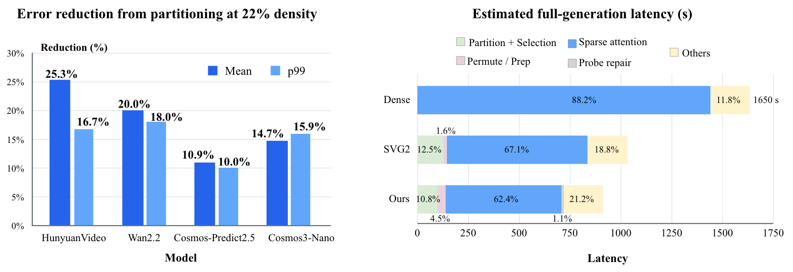

# AI Daily：SparsePR——把「可執行稀疏性」拆成 Support Partition 與 Residual Reconstruction

> **研究日期：** 2026-08-20　　**整理：** Manus AI　　**主題：** Training-free sparse attention、video generation、world models、attention modulation

## 一、論文基本資訊

| 欄位 | 內容 |
|---|---|
| 論文標題 | *Partition the Support, Reconstruct the Residual: Training-Free Sparse Attention for Video Generation and World Models* |
| 作者 | Pardis Taghavi、Reza Langari、Gaurav Pandey |
| 研究單位 | Texas A&M University |
| 發表狀態 | arXiv:2608.18484v1；2026-08-19；22 pages、5 figures；目前頁面未標示已接收之會議或期刊 |
| 論文頁面 | [arXiv HTML][1]／[arXiv abstract][2]／[PDF][3] |
| Project page | [SparsePR project page][4] |
| 研究任務 | HunyuanVideo-13B、Wan2.2-I2V-A14B、Cosmos-Predict2.5-14B、Cosmos3-Nano-16B |
| 主要結果 | 只執行 21.92%–25.96% 的 query–key pairs，仍維持生成品質，端到端加速 1.48×–2.61× |

本篇是本日從 2026-08-20 的 arXiv Computer Vision 最新投稿中篩選的論文。它不是單純再提出一個 top-k mask，而是問了一個更底層、也更適合延伸到 **Energy-based Transformer、JEPA latent dynamics、VAR scale-wise routing 與 zero-shot attention modulation** 的問題：當多個 query 必須共享一個硬體可執行的 block route 時，如何同時處理「哪些 token 應被保留」與「被跳過的 interaction 會留下什麼 residual」？[1] [5]

本篇報告中的圖表只擷取論文 PDF 的關鍵局部圖示，沒有使用整個瀏覽器畫面；圖像由 PDF image extraction workflow 取得，並放置於 repository 的 `asset/` 資料夾。

## 二、為什麼值得讀：從 Row-wise Sparsity 走向 Executable Sparsity

影片 Diffusion Transformer 與 video world model 的 token 序列同時具有時間與空間維度，因此 self-attention 的成本隨 token 數量呈平方成長。過去的 training-free sparse attention 工作已經觀察到 video attention 存在結構性稀疏：例如 Sparse VideoGen 將 head 分成偏 spatial 或偏 temporal 的類型，再用 online profiling 找出可省略的 interactions。[6] HEART 則進一步利用不同 head 的 mask 穩定性與 sparsification sensitivity，透過 Temporal Mask Reuse 與 Error-guided Budgeted Calibration 調整 mask refresh 和 threshold。[7]

SparsePR 指出，這些方法仍可能把「每一列 query 很集中」誤當作「一個共享 block route 很稀疏」。設想八個 query 各自只需 6.2% 的 key support，但它們需要的 support 幾乎不重疊；當八個 query 被迫共用一條 route 時，聯集可能擴大至 22.9%。反過來，即使 retained attention mass 很高，被留下與被省略的 value 所形成的輸出方向差異仍可能很大，因此單看 retained mass 不能預測 post-softmax error。[1]

> **核心觀念：** 稀疏 attention 的實際問題不是「每個 query 能不能少看一些 key」，而是「一組共享 route 的 query 能否共用一組 key/value blocks，並且能否從少量 exact observations 重建被省略 interactions 的輸出」。

## 三、核心貢獻與創新點

### 3.1 Response-Coupled Partitioning：按 response geometry 分群

SparsePR 不直接在原始 query/key activation space 做 clustering，而是用當前 attention call 產生的 response geometry。先抽樣一小部分 query rows，利用它們對不同 key 的反應建立 paired K/V groups；再用這些 K/V groups 的 centroid 建立 query response space，最後形成可共享 route 的 query groups。這是一個 **asymmetric but coupled** 的單向流程，不需要在 query partition 與 K/V partition 之間反覆 alternating refinement。[1]

### 3.2 Probe-Fitted Residual Reconstruction：以少量 exact rows 校正 sparse output

對每個 attention call，SparsePR 保留少量 query rows 做完整 dense attention，直接觀察 hard-drop sparse output 與 dense output 的差異。它把 residual 視為 sparse output 的一個 call-specific affine function，透過 weighted ridge regression 擬合，再以 probe residual 的 output subspace 限制預測方向，避免在未觀察到的方向上任意外插。[1]

### 3.3 評估口徑更接近部署

作者不只報告 retained attention mass，而是以實際執行的 query–key pairs 計算 density，並將 partition construction、routing、token permutation、probe evaluation、ridge fitting、residual correction 與 output restoration 全部放進 end-to-end latency。這點很重要，因為稀疏理論 FLOPs 若沒有把 online overhead 算進去，常會高估真實加速。[1]

## 四、技術方法與數學細節

### 4.1 Dense attention 與可執行 block-sparse operator

對單一 attention head，令

$$
Q\in\mathbb{R}^{N_q\times d},\qquad K\in\mathbb{R}^{N_k\times d},\qquad V\in\mathbb{R}^{N_k\times d_v}.
$$

Dense attention 為

$$
A=\operatorname{softmax}\left(\frac{QK^\top}{\sqrt d}\right),\qquad O^{\mathrm{dense}}=AV.
$$

SparsePR 將 query 分成 $\mathcal{G}^{Q}=\{G_a^Q\}_{a=1}^{C_q}$，將 paired key/value 分成 $\mathcal{G}^{KV}=\{G_b^{KV}\}_{b=1}^{C_k}$。每一個 $G_a^Q\times G_b^{KV}$ 是一個可以交給 sparse kernel 的 cell，以 $z_{ab}\in\{0,1\}$ 表示該 cell 是否精確計算。考慮 group size 不相等時，route density 定義為

$$
\rho_{\mathrm{route}}
=
\frac{1}{N_qN_k}
\sum_{a=1}^{C_q}\sum_{b=1}^{C_k}
 z_{ab}|G_a^Q|\,|G_b^{KV}|.
$$

對於 $i\in G_a^Q$，令 $K_a,V_a$ 收集 route 選中的 K/V rows，採用 renormalized hard drop 後的 sparse output 為

$$
O_i^{\mathrm{sp}}
=
\operatorname{softmax}\left(\frac{q_iK_a^\top}{\sqrt d}\right)V_a,
\qquad
R_i=O_i^{\mathrm{dense}}-O_i^{\mathrm{sp}}.
$$

這裡的重點是：只省略 interaction 並重新 normalization，會讓 residual 成為 output-level error，而不只是少了一些 scalar attention mass。

### 4.2 三個結構性觀察

#### O1：Per-query support 不等於 shared-route support

對 query $i$，令 $D_i(\alpha)$ 是累積 attention mass 達到 $\alpha$ 所需的最小 key 集合。單列 support density 與同一 query group 內 $m$ 個 query 的 pooled support 分別為

$$
\tau_i(\alpha)=\frac{|D_i(\alpha)|}{N_k},
\qquad
\gamma_a^{(m)}(\alpha)=
\frac{\left|\bigcup_{r=1}^{m}D_{i_r}(\alpha)\right|}{N_k}.
$$

在 $\alpha=0.9$、八個 query pooled 的分析中，Wan2.2 的 median support 從單列 6.2% 擴張到 22.9%；Cosmos-Predict2.5 則由 56.5% 增加到 77.7%。因此，執行層面的稀疏度由兩件事共同決定：單列 attention 的集中程度，以及同一 route 中不同 query 的 support overlap。[1]

#### O2：Retained mass 不等於 output fidelity

令 $U_a$ 為被省略的 key 集合，$p_{U,i}$ 為 query $i$ 在 omitted keys 上的 dense attention mass，$O_{U,i}$ 為只在 omitted keys 上重新 normalization 所得到的 value output。則 residual 可寫成

$$
R_i
=
O_i^{\mathrm{dense}}-O_i^{\mathrm{sp}}
=
 p_{U,i}\left(O_{U,i}-O_i^{\mathrm{sp}}\right).
$$

即使 $p_{U,i}$ 很小，$O_{U,i}-O_i^{\mathrm{sp}}$ 仍可能很大；所以同樣的 retained mass 可能對應不同的 output error。這個分解也指出一個與 Energy-based inference 相近的研究接口：省略 interactions 的「風險」不是單純的 scalar mass，而是 omitted 與 retained value distribution 之間的方向性差異。

#### O3：Partition geometry 會影響 residual 是否可預測

對某一組 partition，令 $O_g^{\mathrm{sp}}$ 與 residual $R_g$ 為矩陣，建立 affine feature matrix

$$
X_g=[\mathbf{1},O_g^{\mathrm{sp}}].
$$

令 $P_{X_g}$ 是投影到 $\operatorname{col}(X_g)$ 的正交投影，則

$$
R_g
=
\underbrace{P_{X_g}R_g}_{\text{affine-explainable component}}
+
\underbrace{(I-P_{X_g})R_g}_{\text{affine-orthogonal residual}}.
$$

在 matched group count、route 與 realized density 下，response-coupled partition 比 semantic partition 提高 3.2–14.9 個百分點的 affine-explainable residual fraction，並將 affine-orthogonal energy 降到 baseline 的 0.285×–0.653×。[1]

### 4.3 Response-Coupled Partitioning

先從當前 attention call 抽樣 $M_s$ 個 query rows，組成 $Q_s\in\mathbb{R}^{M_s\times d}$，定義 key-response metric

$$
M_K=\frac{1}{M_s}Q_s^\top Q_s.
$$

對兩個 keys $k_j,k_\ell$，有

$$
(k_j-k_\ell)^\top M_K(k_j-k_\ell)
=
\frac{1}{M_s}\left\|Q_s(k_j-k_\ell)\right\|_2^2.
$$

因此，在 $M_K$ 度量下接近的 keys，代表它們在 sampled queries 下誘發相近的 pre-softmax response profile。令 $F_K$ 為 $M_K$ 前 $r_K$ 個 eigenvectors，將 key 映射為

$$
\phi_K(k_j)=F_K^\top k_j\in\mathbb{R}^{r_K},
$$

再對 $\phi_K(k_j)$ 做 $k$-means，形成 paired K/V groups，且每一個 value 沿用其 paired key 的群組。

接著以 K/V group centroids 組成 $\widetilde K$，定義 query-response metric

$$
M_Q=\frac{\widetilde K^\top\widetilde K}{C_kd}.
$$

令 $F_Q$ 為 $M_Q$ 的前 $r_Q$ 個 eigenvectors，query coordinate 為

$$
\phi_Q(q_i)=
\frac{F_Q^\top q_i}
{\max\left(\sqrt{\|F_Q^\top q_i\|_2^2/r_Q},\epsilon\right)}.
$$

這個 row-wise RMS normalization 使 k-means 更側重 response direction，而不是 query activation 的 overall scale。最後在 $\phi_Q(q_i)$ 上做 k-means，即得到共享 routing 的 query groups。作者在實驗中使用 $r_K=48$、$r_Q=64$。[1]

### 4.4 Probe-Fitted Residual Reconstruction

對每一個 query head 選擇 $M\ll N_q$ 個、且跨 query groups 分層抽樣的 probe rows。對 probe row 做 dense attention，得到 exact residual。令

$$
 x_i=O_i^{\mathrm{sp}}\in\mathbb{R}^{d_v},
\qquad
 R_i\approx b+x_iB.
$$

在 probe rows 上以 weighted ridge regression 求解

$$
B_\lambda
=
\arg\min_B
\left\|
W^{1/2}
\left(\bar R_{\mathcal P}-\bar X_{\mathcal P}B\right)
\right\|_F^2
+
\lambda\|B\|_F^2.
$$

為了避免 affine map 在 probe 未觀察到的 output directions 上不穩定外插，作者對加權且中心化的 probe residual matrix 做 SVD，令 $\Psi_r$ 為前 $r$ 個 right singular vectors，對未 probe query 預測

$$
\widehat R_i
=
\mu_R+\bar x_iB_\lambda\Psi_r\Psi_r^\top.
$$

最終輸出是

$$
\widehat O_i=
\begin{cases}
O_i^{\mathrm{dense}}, & i\in\mathcal P,\\
O_i^{\mathrm{sp}}+\widehat R_i, & i\notin\mathcal P.
\end{cases}
$$

這個設計的直覺不是假設完整 residual globally low-rank，而是只限制「由 sparse output 驅動的可預測 correction」落在 probe residual 曾觀察到的 output subspace。實驗設定為每個 query head $M=64$ 個 exact rows、output rank $r=16$、ridge coefficient $\lambda=0.1$。[1]

### 4.5 Sparse execution 與真正 density

SparsePR 將 $Q,K,V$ 重新排列為 group-major layout，使 paired key 與 value 相鄰，再把選中的 ragged cells 交給 variable-block sparse attention primitive。Exact probe rows 仍需對完整 keys 計算，因此總 executed-pair density 為

$$
\rho_{\mathrm{exec}}
=
\rho_{\mathrm{route}}+\frac{M}{N_q}.
$$

這個定義避免把「只算了少量 route pairs」誤報成整體 end-to-end 稀疏度，因為 probe、partition、permutation、fit 與 correction 都會產生實際成本。[1]

## 五、實驗結果

### 5.1 實驗設定

所有實驗以 BF16 在單張 NVIDIA H100 上執行。作者評估四個異質模型，分別涵蓋 text-to-video、image-to-video 與 image-to-world / physical-world prediction。Dense 與 sparse runs 使用相同的 conditioning、preprocessing、random seeds、sampling schedule、inference steps、guidance、resolution 與 frame count，以便把差異歸因於 attention operator。[1]

| 模型 | 任務與解析度 | SparsePR executed density | PSNR ↑ | SSIM ↑ | LPIPS ↓ | ImgQual ↑ | SubCons ↑ | PBench Quality ↑ | E2E speedup |
|---|---|---:|---:|---:|---:|---:|---:|---:|---:|
| HunyuanVideo-13B | text-to-video, 720p | 21.92% | 31.844 | 0.932 | 0.087 | 0.850 | 0.976 | — | **2.61×** |
| Wan2.2-I2V-A14B | image-to-video, 720p | 21.97% | 30.658 | 0.907 | 0.044 | 0.687 | 0.973 | — | **1.80×** |
| Cosmos-Predict2.5-14B | image-to-world, 720p | 22.14% | 26.328 | 0.942 | 0.068 | 0.714 | 0.976 | 77.75 | **1.51×** |
| Cosmos3-Nano-16B | image-to-world, 720p | 25.96% | 24.417 | 0.801 | 0.176 | 0.699 | 0.949 | 77.30 | **1.48×** |

表中的 speedup 是包含 online overhead 的 end-to-end 結果，不是只計算 sparse matrix multiplication 的理論倍率。以 Wan2.2 為例，完整生成 latency 從 1650 秒降至 917 秒；probe repair 僅佔 1.1% latency，表示以少量 exact rows 換取 residual fidelity 的成本相對有限。[1]

### 5.2 消融與 error reconstruction

在 22% density 的比較中，SparsePR 相對於 semantic partition + probe repair 的 normalized attention-output error 已經顯著下降。四個模型的 mean / p99 error 分別為 HunyuanVideo **0.0330 / 0.2285**、Wan2.2 **0.0707 / 0.4305**、Cosmos-Predict2.5 **0.0954 / 0.5769**、Cosmos3-Nano **0.0822 / 0.4951**。[1]

| 消融觀察 | 代表數據 | 解讀 |
|---|---:|---|
| Response-coupled partition 對 hard drop 的改善 | HunyuanVideo mean error 0.0887 → 0.0736；Cosmos3-Nano 0.3590 → 0.3315 | response geometry 先減少 shared-route support mismatch，但單靠 partition 的收益有限 |
| 加入 probe repair | HunyuanVideo 0.0736 → 0.0330；Cosmos-Predict2.5 0.7617 → 0.0954 | exact probe + affine residual reconstruction 是主要 fidelity 來源 |
| Probe selection | query-group-stratified 優於 random 與 uniform spatiotemporal probes | probe 應覆蓋 route population，而不只是均勻抽 frame/time |
| Output-subspace projection | Ridge only 再加入 probe-residual subspace 後四模型均有小幅改善 | 限制 correction direction 可降低有限 probe 的外插風險 |

作者在 Cosmos3-Nano 上做 12%、17%、22%、28%、35% executed density sweep；SparsePR 的 mean / p99 error 分別為 **0.1274 / 0.7245**、**0.0990 / 0.5771**、**0.0822 / 0.4951**、**0.0681 / 0.4222**、**0.0567 / 0.3669**。這表示方法不是只在單一 operating point 有效，而是在不同 quality–efficiency trade-off 上都優於對應的 semantic partition + hard drop 或 probe repair baseline。[1]

### 5.3 PDF 圖表：error reduction 與 latency

下圖為從論文 PDF 提取的局部圖表，左側展示 22% density 下的 mean / p99 error reduction，右側展示 Wan2.2 full-generation latency 的組成。它比單獨報告 speedup 更有資訊量，因為可以看到 SparsePR 的主要成本仍在 sparse attention 與其他 execution path，而 probe repair 只佔很小部分。

*圖 1。摘自 SparsePR 論文 Table 4 / Figure 4 的局部圖表；原始來源：[arXiv HTML][1]。*

## 六、與相關研究的比較

| 方法 | 核心稀疏訊號 | 是否訓練 | 主要誤差處理 | 與 SparsePR 的差異 |
|---|---|---:|---|---|
| Sparse VideoGen / SVG | online profiling，辨識 spatial / temporal head pattern | 否 | 依 pattern 與 kernel 執行稀疏 attention | 強在 head pattern 與硬體 layout；沒有以 exact probe 直接重建 post-softmax residual |
| SVG2 | semantic-aware permutation 與 block selection | 否 | 以可執行 block route 保留重要 interactions | SparsePR 將 partition 從 semantic activation space 改成 response-coupled space，並另外學習 call-specific residual correction |
| HEART | per-head mask drift、mask reuse、error-guided threshold calibration | 否 | 以 threshold 與 refresh policy 控制 sparsity | HEART 主要處理跨 timestep mask reuse 與 head heterogeneity；SparsePR 主要處理單一 attention call 的 shared support 與 output residual |
| XAttention | antidiagonal scoring 的 block-sparse route | 否 | 依 scoring 保留 block | SparsePR 的 novelty 不只是 route selection，而是以 probe rows 建立 output-level affine repair |
| SparsePR | response-coupled partition + probe-fitted residual | 否 | 對 skipped interactions 做 affine residual reconstruction | 把 executable sparsity 與 residual fidelity 放在同一個 inference-time operator 裡 |

Sparse VideoGen 的 spatial/temporal head 分類證明了 video DiT 存在可利用的結構性稀疏；SVG2 將這類稀疏進一步變成 semantic-aware、硬體可執行的 block pattern；HEART 則提醒我們不同 head 的 mask 穩定性與誤差敏感度並不相同。[6] [7] [8] SparsePR 的位置更接近「稀疏 operator 的 error-correcting layer」：它承認 hard drop 必然留下 residual，然後用少量 exact observations 建立一個當前 call 的 correction model。這也是它相對於只報告 retained mass 或 theoretical FLOPs 的概念差異。

## 七、對 Energy-based、JEPA、VAR 與 Zero-shot 研究的啟發

### 7.1 Energy-based Transformer：將 residual risk 變成可學習的局部能量

SparsePR 的 residual norm 可以被視為一種局部 interaction risk。對 query $i$，可定義

$$
E_i^{\mathrm{skip}}
=\left\|\widehat R_i\right\|_2^2
\quad\text{或}\quad
E_i^{\mathrm{uncertainty}}
=\left\|R_i-\widehat R_i\right\|_2^2.
$$

如果某個 query group 的 probe residual 在 output subspace 中難以由 sparse output 解釋，該 group 就具有較高的 local energy / uncertainty；系統可以動態增加 route density，而不是對所有 token 使用固定 sparsity。這會把 Energy-based Transformer 的 energy landscape 從「全局 score」推到「每一個 attention call、每一個 group 的 skipped-interaction risk」。需要注意的是，原論文沒有宣稱自己是 EBM；這是基於其 residual decomposition 的研究延伸，而非論文已驗證結論。

### 7.2 JEPA：在 predictive latent space 中做 probe repair

JEPA 的主要精神是預測 latent target，而不是重建每個 pixel。若將 SparsePR 的 probe rows 從 DiT output 改為 JEPA latent predictor 的 output，則可以比較兩種 correction：一種只追求 pixel/video fidelity，另一種追求 latent dynamics consistency。對 world model 而言，更有意義的 probe loss 可能是

$$
\mathcal{L}_{\mathrm{probe-JEPA}}
=
\left\|
\widehat z_{t+1}^{\mathrm{sparse}}-z_{t+1}^{\mathrm{dense}}
\right\|_2^2
+
\beta\,\left\|
\widehat z_{t+1}^{\mathrm{sparse}}-z_{t+1}^{\mathrm{target}}
\right\|_2^2,
$$

其中第一項保留 dense model 的 teacher consistency，第二項則鼓勵 sparse operator 保持 JEPA 的 predictive target geometry。這個方向可能比 pixel-level residual 更適合長期 rollout，因為稀疏化所需保留的不是所有高頻細節，而是會影響未來狀態的 latent directions。

### 7.3 VAR：每一個 scale 建立不同的 response route

Visual Autoregressive Models 以 coarse-to-fine scales 逐級生成 visual tokens。SparsePR 的 response-coupled partition 可以自然改成 scale-conditioned partition：在 coarse scale，以較低 density 保留語義 anchor；在 fine scale，根據 residual uncertainty 增加局部高頻 route。可定義 scale-wise budget

$$
\rho_k
=\rho_{\min}
+\eta\cdot
\operatorname{Norm}\left(
\mathbb{E}_{i\in\text{scale }k}
\left[\|\widehat R_i\|_2^2\right]
\right),
$$

讓注意力資源集中到「稀疏 output 無法可靠重建」的 scale。這比固定每一 scale 使用相同 token ratio 更接近 VAR 的 coarse semantic commitment / fine detail refinement 結構。

### 7.4 Training-free zero-shot attention modulation

SparsePR 沒有修改模型權重，也沒有額外 training。它提供一個可直接插在 frozen video transformer 上的 inference-time interface：先用當前 $Q,K,V$ 建立 response geometry，再用少量 exact rows 取得 local calibration。若進一步把 probe residual 的方向轉成 attention logit modulation，便可以形成 zero-shot 的 correction rule，例如

$$
S_{ij}^{\mathrm{mod}}
=
S_{ij}
+\alpha\,u_i^\top v_j,
$$

其中 $u_i$ 代表 query group 的 residual-risk embedding，$v_j$ 代表 K/V group 的 response direction。這會把「少算哪些 pairs」與「哪些 skipped pairs 可能重要」統一為一個 inference-time control problem。此公式是本報告提出的延伸構想，不是 SparsePR 原文的已驗證模組。

## 八、我的評價：強項、限制與可重現性風險

### 強項

第一，SparsePR 的問題定義比「attention mass 很集中，所以可以剪枝」更嚴謹。它明確區分 per-query support、shared-route support、post-softmax residual 與 end-to-end executed density，補上了從統計稀疏到硬體可執行稀疏之間的缺口。第二，probe repair 是一個簡潔但具有普適性的 idea：它不需要再訓練 backbone，也不需要假設完整 residual 全球低秩，而是讓當前 attention call 自己提供校正資料。第三，作者在四個異質 video / world model 上驗證，且將 online overhead 納入 latency，讓 1.48×–2.61× 的 speedup 比只報告 kernel throughput 更可信。[1]

### 限制

第一，這仍是一篇 2026-08-19 的 arXiv v1，頁面沒有標示 peer-reviewed conference 或 journal acceptance；因此目前應將結果視為新近但尚待外部重現的研究，而不是已被頂會審查的定論。[2] 第二，實驗主要在單張 H100、BF16、固定 resolution / frame count / seed / schedule 下進行；在不同 GPU、不同 sparse backend、較長影片或更高解析度上，partition 和 probe 的 online overhead 可能改變 Pareto frontier。第三，SparsePR 需要 exact probe rows，且每個 query head 使用 64 probes；當 query length 很短，或 model 的 attention head 數量極大時，probe 成本未必仍是 1.1%。第四，affine residual mapping 對當前 call 有效，不代表它能在跨 timestep、跨 prompt、跨 model rollout 中穩定重用；這也是它和 temporal mask reuse 類方法的重要差別。

### 可重現性檢查清單

| 重現項目 | 需要確認的細節 |
|---|---|
| Sparse backend | FlashInfer variable-block sparse attention 的版本、kernel 設定、ragged offset 格式 |
| Probe policy | query-group-stratified sampling 的具體實作、probe rows 是否每個 timestep 重抽 |
| Clustering | $k$-means 初始化、群組數 $C_q/C_k$、response feature rank 與 normalization |
| Timing | partition、permutation、probe、ridge fit、correction 是否全部同步計時 |
| Quality | 相同 seed、same conditioning、same sampler，並分開報告 dense-reference 與 generation metrics |

## 九、結論

SparsePR 最值得帶走的不是「21.92% density 能達到 2.61× speedup」這個單一數字，而是它重新定義了 training-free sparse attention 的正確拆法：**先用 response geometry 建立可共享的 support，再用少量 exact observations 重建被跳過的 output residual**。這個視角使 sparsity 從靜態 mask selection 變成一個有校正、有 uncertainty、可按 call / head / scale 動態調節的 inference operator。

對我而言，最有研究價值的下一步是將三個訊號合併：以 Energy-based uncertainty 決定 route budget，以 JEPA latent prediction 定義 residual fidelity，再以 VAR scale-wise schedule 分配 attention；若能在不重訓 backbone 的情況下，於 image/video/world model 中驗證這個共同框架，便可能形成一條從 **training-free attention modulation → latent predictive correction → energy-adaptive sparse generation** 的研究路線。

## References

[1]: https://arxiv.org/html/2608.18484 "Partition the Support, Reconstruct the Residual: Training-Free Sparse Attention for Video Generation and World Models"
[2]: https://arxiv.org/abs/2608.18484 "arXiv abstract and metadata for SparsePR"
[3]: https://arxiv.org/pdf/2608.18484v1 "SparsePR PDF"
[4]: https://pardistaghavi.github.io/SparsePR-website/ "SparsePR project page"
[5]: https://arxiv.org/list/cs.CV/new "arXiv cs.CV latest submissions, 20 August 2026"
[6]: https://arxiv.org/abs/2502.01776 "Sparse VideoGen: Accelerating Video Diffusion Transformers with Spatial-Temporal Sparsity"
[7]: https://arxiv.org/abs/2605.14513 "HEART: Exploiting Head Heterogeneity in Sparse Attention for Video Diffusion"
[8]: https://arxiv.org/abs/2505.18875 "Sparse VideoGen2: Accelerate Video Generation with Sparse Attention via Semantic-Aware Permutation"
