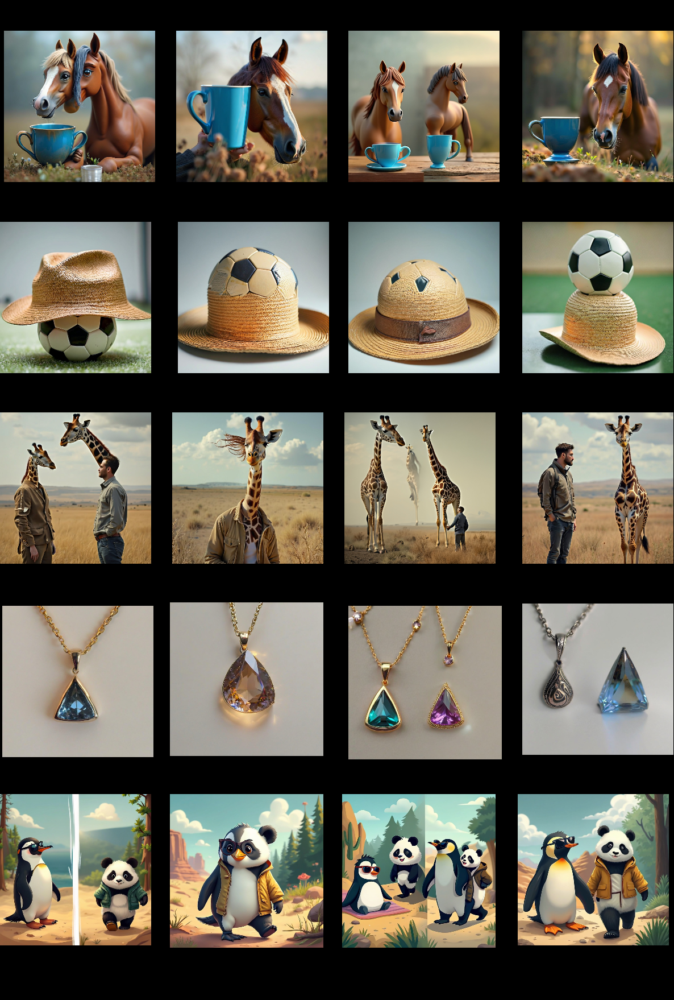

# AI Daily: SynVAR——以空間—語義協同調制，讓 Visual Autoregressive 生成不再累積早期錯誤

> **研究日期：** 2026-08-26　｜　**整理：** Manus AI　｜　**主題：** Visual Autoregressive、training-free、attention modulation、複雜場景生成

## 今日結論

今天選讀 **SynVAR: Synergizing Spatial and Semantic Alignment in Visual Autoregressive Model**。這篇論文不是再訓練一個更大的生成器，而是把 VAR 的錯誤來源拆成三個具有時間結構的問題：低解析度階段的空間配置、相鄰物體之間的語義干擾，以及後期細節不足。作者據此在現成 VAR 模型的推理過程中，分別插入 **Global Guidance（GG）**、**Receptive Field Constraint（RFC）** 與 **High-Frequency Compensation（HFC）**，形成一個不需微調、可 plug-and-play 的增強框架。論文標示為 **ECCV 2026 accepted paper**，並在 Infinity 與 Switti 上展示改善。[1] [2] [3]

它最值得記住的觀點是：**VAR 的 coarse-to-fine 優勢同時也是其脆弱點**。早期尺度做出的錯誤決策會被後續尺度當成條件持續引用，因此泛用的 diffusion attention refinement 不一定能直接搬過來。SynVAR 的價值不只在於分數上升，更在於它把 inference-time control 的介入位置與介入對象分開：cross-attention 負責「概念應該出現在哪裡」，self-attention 負責「不同區域不要互相污染」，頻域操作則負責「補回高頻細節」。[2]

## 一、為什麼今天選它？

本次先以近期 arXiv、ECCV/CVPR/NeurIPS 論文及研究團隊公開資源廣泛篩選，再與 `KaiCobra/AI_Daily` 的現有 `README.md` 與 `INDEX.md` 對照。WithEveryone、GATO-Vid 與 UniJEPA 已經在 repository 中出現，因此排除；SynVAR 則尚未收錄，且比其他候選更直接地同時命中你近期關注的 **VAR、training-free 與 attention modulation**。它也具備明確的頂會狀態，而不是只有一個尚未經審查的標題。[1] [3]

| 候選方向 | Repo 狀態 | 新鮮度/會議狀態 | 與本次偏好的契合度 | 選擇判斷 |
|---|---|---|---|---|
| SynVAR | 未收錄 | arXiv 2026-08-08；ECCV 2026 accepted | 很高：VAR、training-free、self/cross-attention modulation | **選入** |
| WithEveryone | 已收錄 | arXiv 2026-08-20 | 高：zero-shot identity/layout，但主題已發布 | 排除重複 |
| GATO-Vid | 已收錄 | arXiv 2026-08-14；training-free video grounding | 高，但 repo 已有文章 | 排除重複 |
| UniJEPA | 已收錄 | arXiv 2026-08；JEPA/world model | 很高，但 repo 已有文章 | 排除重複 |
| DAVET | 未收錄 | arXiv 2026-08；diffusion evidence allocation | 高：training-free，但較偏 VLM/diffusion | 保留為後續候選 |
| E-AdaPrune | 未收錄 | arXiv 2026-03、2026-07 revised | 高：energy-driven token pruning | 保留為後續候選 |

## 二、論文基本資訊與作者背景

| 欄位 | 資訊 |
|---|---|
| 論文標題 | SynVAR: Synergizing Spatial and Semantic Alignment in Visual Autoregressive Model |
| 作者 | Zhennan Chen、Tianxing Shi、Pengcheng Xu、Kepan Nan、Qian Wang、Zili Yi、Jian Yang、Ying Tai |
| 研究機構 | Nanjing University State Key Laboratory for Novel Software Technology、Western University、JIUTIAN Research/China Mobile Communications Group |
| 發表狀態 | arXiv:2608.07948v1；2026-08-08 提交；arXiv comments 標示 Accepted by ECCV 2026 |
| 官方實作 | [NJU-PCALab/SynVAR](https://github.com/NJU-PCALab/SynVAR)；官方 README 稱其為 ECCV 2026 implementation |
| 基礎模型 | Infinity 與 Switti，皆為 scale-wise/visual autoregressive generation 系列 |
| 主要 benchmark | Geneval 與 T2I-CompBench |
| 硬體與 runtime | 論文實驗使用單張 A6000；完整 SynVAR 單圖約 3.10 秒，SynVAR + FastVAR 約 2.27 秒 |

作者團隊的組成也很有代表性：Nanjing University 的視覺生成研究群組負責主要方法與實作，Western University 與 JIUTIAN Research 共同參與，且官方 repository 已公開 Infinity/Switti 的修改版推理程式、示例場景與 Python API。這使 SynVAR 比只提供概念圖的 training-free 方法更接近可驗證的 inference patch；不過模型 checkpoint 仍需使用外部資源。[1] [3]

## 三、背景：VAR 為何會放大早期錯誤？

原始 Visual Autoregressive Modeling（VAR）將圖像從單一 raster token 序列改寫成由低解析度到高解析度的 **next-scale prediction**。給定尺度 token map $r_0,r_1,\ldots,r_S$，其條件分解可寫成

$$
p(r_0,\ldots,r_S)=p(r_0)\prod_{s=1}^{S}p(r_s\mid r_0,\ldots,r_{s-1}).
$$

每一個尺度不只預測一個 token，而是預測該解析度下的整張 token map。若 $\phi$ 表示將前一尺度上採樣至 $(h_s,w_s)$，VAR 的累積 feature 可寫成

$$
f_s=f_{s-1}+\phi\!\left(r_{s-1},(h_s,w_s)\right).
$$

這種設計提高了生成效率與全局一致性，但也造成一個與 diffusion 不同的誤差機制：在 diffusion 中，模型通常沿著連續 denoising state 逐步修正；在 VAR 中，後續尺度會直接以先前尺度形成的累積狀態為條件。於是，早期「左邊應該有紅蘋果、右邊應該有藍碗」的配置錯誤，可能一路影響後續尺度；某個區域的語義混淆也可能被當作下一尺度的視覺先驗。[2] [4]

這正是 SynVAR 的設計出發點：不是在每一個階段無差別地加強文字條件，而是判斷哪一種錯誤應該由哪一個 attention/feature channel 處理。

## 四、SynVAR 的核心方法

### 4.1 整體推理流程

SynVAR 將輸入 prompt 拆成 concepts $\{c^i\}_{i=1}^{N}$，並為每個 concept 指定一個 global region $(h^i,w^i)$。每一個尺度都會進行 HFC；只有在選定的早期 step 才執行 RFC 與 GG。作者在主要實驗中使用 `step=2`、$\sigma=0.5$、$\delta=0.01$。[2]

| 介入位置 | 模組 | 主要問題 | 作用時間 | 核心操作 |
|---|---|---|---|---|
| Cross-attention | Global Guidance | 物體位置與概念綁定不準 | 早期 step | 將 concept-specific cross-attention response 裁剪後放回指定 region |
| Self-attention | Receptive Field Constraint | 鄰近物體互相污染、語義混淆 | 早期 step | 以 region-aware Gaussian bias 調制 attention logits |
| Transformer feature | High-Frequency Compensation | 細節與紋理在後期不足 | 全部尺度 | 在頻域提升高頻分量 |

### 4.2 Global Guidance：把每個 concept 放回自己的空間區域

令文字編碼器將第 $i$ 個 concept 轉為 $y^i$，並經線性投影得到 key/value；同時從前一尺度 token map $r_{s-1}$ 取得 query：

$$
Q^i=\ell_Q(r_{s-1}),\qquad K^i=\ell_K(y^i),\qquad V^i=\ell_V(y^i).
$$

第 $i$ 個 concept 的 cross-attention response 為

$$
r^i_{s-1}=\operatorname{Softmax}\!\left(\frac{Q^iK^{i\top}}{\sqrt d}\right)V^i.
$$

接著，SynVAR 依照該 concept 的 global region 做裁剪，再將各 concept 的局部 response 串接：

$$
r^i_{s-1}(h^i,w^i)=\operatorname{Crop}\!\left(r^i_{s-1},(h^i,w^i)\right),
$$

$$
r^{\mathrm{cat}}_{s-1}=\operatorname{Concat}_{i=1}^{N}\left(r^i_{s-1}(h^i,w^i)\right).
$$

最後以此空間化的 response 更新尺度 feature：

$$
f_s=f_{s-1}+\phi\!\left(r^{\mathrm{cat}}_{s-1},(h_s,w_s)\right).
$$

直觀上，GG 將「紅蘋果」與「藍碗」的語義 response 分別放回兩個指定區域，而不是讓所有概念在整張低解析度 feature map 上競爭。它更接近 **region-routed conditioning**，而不是傳統 CFG 的全局放大。

### 4.3 Receptive Field Constraint：在 self-attention 中降低跨區域干擾

作者觀察到，多物體 prompt 中相鄰區域的 token 仍有很高 attention dependency，這會使不同物體互相借用語義線索。對 query token $q$ 與 key token $k$ 的 feature-map 座標 $p_q$、$q_k$，先計算 Gaussian 距離項：

$$
\operatorname{Bias}[q,k]=\exp\!\left(-\frac{\lVert p_q-q_k\rVert_2^2}{\sigma^2}\right).
$$

若 $\mathcal I_m$ 是第 $m$ 個 region 所包含的 token index 集合，論文 source 定義 region relation binary mask 為

$$
R[q,k]=\mathbb{I}\!\left(\forall m,\;q\notin\mathcal I_m\;\vee\;k\notin\mathcal I_m\right).
$$

再以該項調制 self-attention：

$$
A'=\operatorname{Softmax}\!\left(\frac{QK^\top+\left(R\odot\operatorname{Bias}\right)}{\sqrt d}\right).
$$

作者的文字解釋是：保留必要的全局 context，同時讓距離越遠的跨區域 interaction 衰減，從而達到 semantic decoupling。[2] 這裡值得保留一個研究者的警覺：source 中的 $R$ 條件與正向 Gaussian bias 的組合，在直覺上不如常見的負 bias/masking 寫法直接，因此若要復現或改進，應以官方 code 逐行核對實際 broadcasting、region index 與 bias sign，而不能只看排版後的公式自行改寫。

### 4.4 High-Frequency Compensation：用頻域控制恢復細節

VAR 的早期尺度主要負責粗結構，後期尺度才逐步增加紋理與細節。SynVAR 對每個 transformer layer 的輸入 feature map $\mathbf F$ 做 2D Fourier transform，使用與頻率中心距離成正比的 high-pass gain。

頻譜距離為

$$
D(u,v)=\sqrt{(u-u_0)^2+(v-v_0)^2},
$$

其中 $(u_0,v_0)$ 通常是頻譜中心。給定強度係數 $\delta$，高頻增益為

$$
HF(u,v)=1+\delta D(u,v).
$$

因此，濾波後的 feature 是

$$
\widetilde{\mathbf F}=\mathcal F^{-1}\!\left[\mathcal F[\mathbf F]\cdot HF\right],
$$

其中 $\mathcal F$ 與 $\mathcal F^{-1}$ 分別是 2D Fourier 與 inverse Fourier transform。$\delta$ 太大會將細節與 artifact 一起放大，所以論文選擇很小的 $\delta=0.01$。[2]

## 五、實驗結果：位置、語義與細節是否真的同時改善？

### 5.1 主要 benchmark 結果

論文以 Infinity 與 Switti 作為 VAR backbone，使用 Geneval 與 T2I-CompBench 評估複雜 compositional text-to-image。論文指出，大多數 diffusion-oriented enhancement baseline 反而會使 VAR 下降；SynVAR 則在兩個 backbone 上都提升整體分數。[2]

| Backbone + 方法 | Geneval Counting | Geneval Position | Geneval Attribute Binding | Geneval Overall | T2I-CompBench Spatial | T2I-CompBench Overall |
|---|---:|---:|---:|---:|---:|---:|
| Infinity | 58.13 | 26.00 | 58.00 | 55.48 | 24.13 | 49.90 |
| Infinity + SynVAR | **58.25** | **63.00** | **70.00** | **70.79** | **46.00** | **55.66** |
| Switti | 48.12 | 14.25 | 28.00 | 41.09 | 19.09 | 49.61 |
| Switti + SynVAR | **49.06** | **16.25** | **40.50** | **45.27** | **22.14** | **52.44** |

在 Infinity 上，Geneval Overall 由 55.48 升至 70.79，增加 15.31 個百分點，論文以相對增幅計算約 **27.6%**；在 Switti 上由 41.09 升至 45.27，增加 4.18 個百分點，約 **10.2%**。Infinity 的 Position 由 26.00 升至 63.00，是最醒目的空間控制改善；Switti 的 Attribute Binding 由 28.00 升至 40.50，則顯示語義綁定也受益。[2]

T2I-CompBench 的變化較溫和但方向一致：Infinity Overall 從 49.90 到 55.66，Switti 從 49.61 到 52.44。這種差異也提醒我們，SynVAR 的主戰場是複雜場景的空間/語義協調，不應只用單一總分宣稱「所有生成品質都全面提升」。

### 5.2 消融實驗：哪一個模組最重要？

| 變體 | Two-object | Counting | Position | Attribute Binding | Overall |
|---|---:|---:|---:|---:|---:|
| w/o Global Guidance | 74.49 | 66.25 | 23.75 | 49.00 | 53.37 |
| w/o Receptive Field Constraint | 80.30 | 21.25 | 36.25 | 58.25 | 49.01 |
| w/o High-Frequency Compensation | 86.38 | 55.81 | 59.50 | 62.75 | 66.11 |
| SynVAR | **91.92** | **58.25** | **63.00** | **70.00** | **70.79** |

消融結果提供一個很清楚的功能分工。移除 GG 後 Position 從 63.00 降到 23.75，說明明確的 global spatial prior 是空間配置的主要來源；移除 RFC 後 Counting 從 58.25 降到 21.25，反映區域解耦對避免物體混淆尤其重要；移除 HFC 對 Overall 的影響較小，但作者指出細節與美學仍有可見差異。[2]

RFC 的衰減係數 $\sigma$ 也呈現非單調關係：$\sigma=0.1,0.3,0.5,0.7,1.0$ 時 Geneval Overall 分別為 54.76、65.46、70.79、68.98、67.48，最佳點為 0.5。HFC 的 $\delta=0.002,0.005,0.01,0.02,0.03$ 對應 Overall 為 67.24、68.47、70.79、69.76、68.04，過強的高頻增益會引入 artifact。[2]

### 5.3 介入時間與推理成本

只在 `step=2` 介入 GG/RFC 的表現最好：Geneval Overall 為 70.79，高於 step 1 的 63.43 與 step 3 的 57.69；將多個步驟一起介入通常下降。這支持 SynVAR 的核心假設：VAR 存在一個很短的 **critical decision window**，太早介入時空間表徵尚未穩定，太晚則錯誤已經傳播。[2]

| 設定 | 秒/圖 |
|---|---:|
| Vanilla VAR | 2.60 |
| + Global Guidance | 2.61 |
| + Receptive Field Constraint | 2.61 |
| + High-Frequency Compensation | 3.08 |
| 完整 SynVAR | 3.10 |
| SynVAR + FastVAR | **2.27** |

GG 與 RFC 的開銷幾乎可忽略，HFC 因 FFT/IFFT 增加主要成本。值得注意的是，與 FastVAR 結合後，SynVAR + FastVAR 的報告時間反而低於 Vanilla VAR；但這是該論文設定下的單圖 benchmark，不應直接推廣成所有硬體與解析度下的普遍結論。[2] [8]

### 5.4 人類偏好與可重現性

作者從 Geneval 與 T2I-CompBench 隨機挑選 20 個 prompt 做 user study，超過 68% 的使用者在 aesthetic quality 與 text-image alignment 兩項都選擇 SynVAR 生成結果。官方 GitHub 也提供 Infinity/Switti backend、demo cases、scene plan、CLI 與 Python API；模型 checkpoint 則仍由使用者另外準備。[2] [3]

## 六、相關研究脈絡

### 6.1 從 VAR 到可擴展的 next-scale generation

原始 VAR 將圖像生成改寫成 next-scale prediction，並以 coarse-to-fine 的尺度序列取代逐像素或單一 raster token 的 AR 路徑，這是 SynVAR 需要處理的基本生成幾何。[4] 其後的 **Infinity** 將視覺 AR 推向 bitwise autoregressive modeling，強調高解析度與 photorealistic synthesis；**Switti** 則研究 scale-wise transformer design。SynVAR 並未重新定義 tokenizer 或 backbone，而是針對這些現成 VAR 的推理 dynamics 加上控制器。[5] [6]

### 6.2 與 training-free attention control 的差異

Training-free layout control 的代表工作通常在 diffusion cross-attention map 上加 guidance，使文字概念與 bounding box 對齊；Dense text-to-image generation with attention modulation 也沿著 attention manipulation 改善多物件生成。[9] [10] SynVAR 借用了「不改 backbone、直接調制 attention」的研究哲學，但它不是把 diffusion 方法平移到 VAR：GG 依賴 VAR 的 scale-wise coarse map，RFC 針對早期 self-attention 的 region coupling，HFC 則直接處理 feature spectrum。這個差異是本文最重要的技術定位。

### 6.3 與 FastVAR、training-free VAR editing 的關係

FastVAR 以 cached token pruning 追求 visual autoregressive inference acceleration，主要目標是減少計算；SynVAR 主要目標是提升 spatial/semantic alignment。兩者因此可以沿著 quality-latency Pareto 方向組合，而不是互斥的替代品。[8] 另一條相關路線是 training-free text-guided VAR editing，它試圖在不重新訓練的情況下操控 VAR 的生成或編輯路徑；SynVAR 則更偏向通用複雜場景 text-to-image correction。[11]

### 6.4 與你的 Energy-based / JEPA 想法的接口

SynVAR 本身不是 energy-based model，也沒有使用 JEPA loss；它的控制訊號是由概念區域、attention geometry 與頻率距離構成。不過，這使它很適合成為下一步研究的「可插拔 intervention scaffold」。

第一個方向是把 GG 的 region response 轉成 concept-wise energy：若 $E_i(r_s)$ 衡量第 $i$ 個 concept 在目標 region 的 mismatch，便可在早期尺度以 $r_s\leftarrow r_s-\eta\nabla E_i$ 或 closed-form logit correction 做 selective steering，而不必對整個模型反傳。第二個方向是將 RFC 的 region attention consistency 與 JEPA predictive latent 接起來：若相鄰尺度的 latent prediction 對同一組概念產生不一致，可將 disagreement 當作 early-warning signal，自動決定是否在 step 2 或 step 3 啟用 RFC。第三個方向是讓 HFC 的 $\delta$ 由 sample-adaptive spectral uncertainty 決定，而不是固定 0.01；這會把「所有圖像使用同一個高頻增益」改成依據紋理能量或生成不確定性動態調整。

| 可延伸問題 | SynVAR 現有做法 | 可測試的新假設 |
|---|---|---|
| 何時介入？ | 經驗設定 step=2 | 以 attention entropy、scale-wise energy 或 JEPA disagreement 自動選 step |
| 如何衡量概念錯誤？ | 以 global region 與 attention response 修正 | 以 concept-wise energy 或 predictive-latent consistency 量化 |
| 如何避免跨區域污染？ | Gaussian receptive-field bias | 以 scene graph/region graph attention 取代單純 Euclidean distance |
| 如何恢復細節？ | 固定 $\delta=0.01$ 的線性 high-pass | 以樣本頻譜能量、局部 uncertainty 或可學習 controller 自適應 |
| 如何兼顧速度？ | 可與 FastVAR 組合 | 評估 SynVAR + FastVAR/SparVAR/HACK++ 的 quality-latency Pareto |

## 七、個人評價、限制與研究意義

我的評價是 **方法洞見強於工程複雜度，且非常適合作為可重現的 inference-time research baseline**。三個模組各自很簡潔：GG 是區域化 cross-attention response，RFC 是帶空間先驗的 attention logit，HFC 是頻域增益。真正有價值的是作者把它們放在 VAR 的生成時間軸上，提出「早期結構、早期解耦、全程細節」的協同策略，而不是堆疊更多訓練參數。

但不應把它解讀成「training-free 等於沒有成本」。HFC 使完整 SynVAR 從 2.60 秒增加到 3.10 秒，且 GG 需要概念與區域資訊；論文在大規模評估中借助 MLLM 做 concept/region division，雖然作者明確說 framework 本身 MLLM-free，但實際部署時仍需決定 region plan。[2] 此外，最佳 step 以實驗與經驗設定，還沒有做到每張圖自動選擇；如果基礎 VAR 先驗根本漏掉某個 concept 或對空間關係有系統性偏誤，SynVAR 也只能修正已存在的表示，無法創造 backbone 沒有的知識。[2]

另外，RFC 的數學式值得在實作層重新核對。論文文字宣稱距離越遠衰減越強，但 source 中 binary relation 與正向 Gaussian bias 的寫法不如常見的 negative bias 直觀；這不是足以否定方法的理由，卻是復現時必須以官方 code、單元測試與 attention heatmap 驗證的地方。對研究者而言，這反而是一個很好的切入點：把 RFC 改成可學習的 signed energy field，並以生成後的 region consistency 或 JEPA latent prediction 做驗證。

總體而言，SynVAR 的意義在於把 **VAR 的粗到細因果結構轉化成 inference-time control 介面**。它提醒我們，訓練無關研究不一定要從 CFG 或反覆梯度優化出發；也可以直接分析模型在不同尺度、不同 attention branch 與不同頻率上的資訊流，再只在「真正能改變最終結果」的窗口施加小而精準的控制。這正是 Energy-based Transformer、JEPA predictive critic、zero-shot controller 與 VAR scale-wise routing 可以交會的地方。

## 八、關鍵圖像：SynVAR qualitative results

下圖為從論文 PDF 擷取的 Figure 8 主要 qualitative results 局部素材，展示馬匹/杯子、帽子/足球、長頸鹿/人物、飾品、企鵝/熊貓等多物件與多關係場景。它適合搭配閱讀「空間配置、語義綁定與細節恢復」三個問題；不應把單張 qualitative figure 當成統計證據，數值結論仍以 Geneval、T2I-CompBench 與消融表為準。[2]

*圖 1。由 SynVAR 論文 PDF 擷取的 Figure 8 qualitative results；來源為 [arXiv:2608.07948v1](https://arxiv.org/html/2608.07948v1)，論文頁標示 CC BY-NC-SA 4.0。素材經 PDF image extractor 提取後放入本 repository 的 `asset/synvar/`。*

## 九、總結

SynVAR 可以濃縮成一句話：**先在 VAR 最早的關鍵尺度修正「概念應該去哪裡」與「不同概念如何不要互相干擾」，再以頻域操作補回最後的細節。** 它的結果在 Infinity 上尤其顯著，Geneval Overall 提升 15.31 個百分點、Position 提升 37 個百分點；同時官方實作讓後續做 energy steering、JEPA critic、adaptive step selection 與 acceleration composition 變得具體可行。[2] [3]

對你目前的研究方向，最值得立即實作的 follow-up 是：在 Infinity 或 Switti 上記錄每個 scale 的 cross-attention entropy、region overlap 與 frequency energy，建立一個不需訓練的 intervention score；當某個 concept 的 spatial/semantic energy 超過門檻時，只在該 scale 啟用 RFC/GG，並比較固定 step=2 與 adaptive step 的 quality-latency Pareto。這會把 SynVAR 從一個固定 heuristic，推進成更接近 **energy-aware, JEPA-informed, training-free VAR controller** 的研究原型。

## References

[1]: https://arxiv.org/abs/2608.07948 "SynVAR arXiv abstract"
[2]: https://arxiv.org/html/2608.07948v1 "SynVAR full HTML paper"
[3]: https://github.com/NJU-PCALab/SynVAR "Official SynVAR ECCV 2026 implementation"
[4]: https://arxiv.org/abs/2404.02905 "Visual Autoregressive Modeling: Scalable Image Generation via Next-Scale Prediction"
[5]: https://arxiv.org/abs/2412.04431 "Infinity: Scaling Bitwise AutoRegressive Modeling for High-Resolution Image Synthesis"
[6]: https://arxiv.org/abs/2412.01819 "Switti: Designing Scale-Wise Transformers for Text-to-Image Synthesis"
[7]: https://neurips.cc/virtual/2024/poster/94115 "VAR NeurIPS 2024 conference page"
[8]: https://arxiv.org/abs/2503.23367 "FastVAR: Linear Visual Autoregressive Modeling via Cached Token Pruning"
[9]: https://arxiv.org/abs/2304.03373 "Training-Free Layout Control with Cross-Attention Guidance"
[10]: https://openaccess.thecvf.com/content/ICCV2023/html/Kim_Dense_Text-to-Image_Generation_with_Attention_Modulation_ICCV_2023_paper.html "Dense Text-to-Image Generation with Attention Modulation"
[11]: https://arxiv.org/abs/2503.23897 "Training-Free Text-Guided Image Editing with Visual Autoregressive Model"
