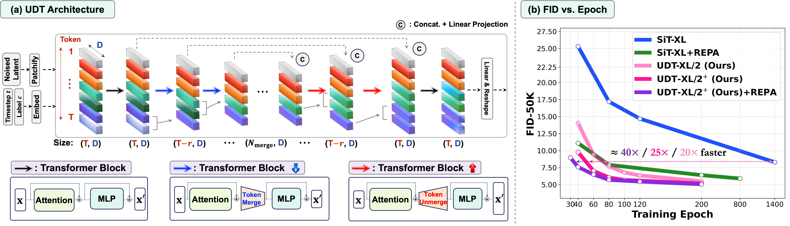
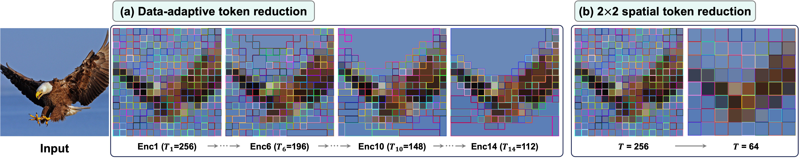
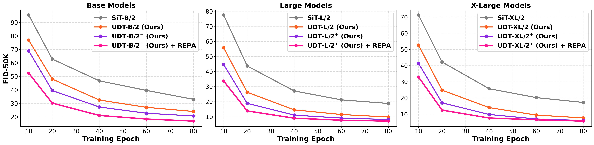
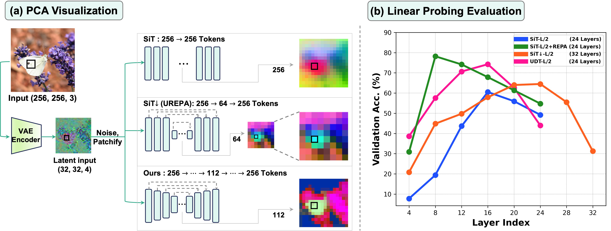

# AI Daily: UDT - Reconciling U-Nets and Diffusion Transformers with Data-Adaptive Token Reduction

## 基本資訊
- **論文標題**: UDT: Reconciling U-Nets and Diffusion Transformers with Data-Adaptive Token Reduction
- **作者**: Junno Yun, Yaşar Utku Alçalar, Mehmet Akçakaya (University of Minnesota)
- **發表日期**: 2026-08-02 (arXiv:2608.01298)
- **領域**: Computer Vision, Generative Modeling, Diffusion Transformers, Attention Modulation
- **論文連結**: [arXiv:2608.01298](https://arxiv.org/abs/2608.01298)
- **程式碼**: [GitHub](https://github.com/JN-Yun/UDT)

## 論文核心貢獻和創新點
Diffusion Transformers (DiTs) 憑藉其強大的擴展性已成為生成模型的主流架構。然而，DiT 由等向性（isotropic）的 Transformer 區塊組成，其表徵學習過程存在一個根本缺陷：隨著網路加深，模型為了滿足去噪目標，會將注意力轉移到高頻細節的重建上，導致深層的語義表徵品質下降。這形成了一種「編碼器-解碼器不平衡」的現象——編碼階段過長，而有效的解碼階段過短。

為了加速收斂並改善這種不平衡，近期的 U-Net DiTs（如 U-DiT、SiT↓）引入了多尺度的 U-Net 架構。但它們依賴傳統的 $2\times2$ 空間網格下採樣（spatial downsampling），這種基於固定局部鄰域的壓縮方式，破壞了 Transformer 處理全域依賴的優勢，並會模糊細微的空間細節。

本論文提出了 **UDT (U-Net Diffusion Transformer)**，一項 Training-Free 且優雅的架構創新，核心貢獻包括：
1. **Data-Adaptive Token Reduction**：放棄了降低通道維度（channel dimension）的空間下採樣，改為使用基於二分軟匹配（bipartite soft matching）的 **Token Merging (ToMe)** 技術。它能根據特徵相似度，自適應地合併語義相近的 token（如背景），從而保留重要的細節與結構。
2. **保持 Token 維度不變**：整個 U-Net 結構中，token 的特徵維度 $D$ 始終保持不變，這使得 UDT 能完美相容於跨注意力機制（Cross-Attention，如 T2I 生成）和表徵對齊（Representation Alignment，如 REPA）等技術。
3. **極致的收斂速度與 SOTA 性能**：在不增加任何正則化或修改 VAE 的情況下，UDT-XL/2 在 ImageNet 256×256 上僅需 80 epochs 即可達到 FID 7.7，超越了基準 SiT-XL 訓練 1400 epochs 的表現（加速約 20 倍）。結合 REPA 後，更能在 **40 epochs** 內達到 FID 7.6（加速約 40 倍）。最終在使用 CFG 的情況下，分別達到 FID 1.38 (SD-VAE) 和 1.35 (VA-VAE)。

## 技術方法簡述

### 1. 架構設計與 Token Merge/Unmerge
UDT 將網路對稱地分為 Encoder、Bottleneck 和 Decoder 三個階段：
- **Encoder**：從第二個區塊開始，逐步應用 Token Merging。給定兩個特徵向量 $\mathbf{x}_1, \mathbf{x}_2 \in \mathbb{R}^D$，基於其 key 的相似度進行匹配，並使用加權平均合併：
  $$ \mathbf{x}_{1,2}^{\text{m}} = \frac{\text{s}_1\mathbf{x}_1 + \text{s}_2\mathbf{x}_2}{\text{s}_1 + \text{s}_2} $$
  其中 $\text{s}_1, \text{s}_2$ 分別代表每個 token 所包含的原始 patch 數量。
- **Attention Modulation**：為了修正合併後 token 代表不同數量 patch 所帶來的偏差，在計算自注意力時加入了比例修正：
  $$ \text{softmax}\left(\frac{\mathbf{Q}\mathbf{K}^T}{\sqrt{d}} + \log \mathbf{s}\right) $$
- **Decoder**：利用在 Encoder 階段記錄的 merge indices，精確地將 token unmerge 回原始空間位置，並透過 Skip Connection 補充下採樣過程中可能遺失的高頻資訊。

*(圖：UDT 架構圖。保持隱藏維度不變，透過資料自適應的 token merge 和 unmerge 逐步縮減和恢復序列長度，實現極速收斂。)*

### 2. 為什麼比 Spatial Downsampling 更好？
傳統的 $2\times2$ 空間下採樣強制將空間上相鄰的四個 token 壓縮為一個，這會導致邊緣和細小結構的丟失。而 UDT 的 Data-Adaptive 方法會優先合併背景等冗餘區域，將計算資源保留給包含複雜紋理的 token，這不僅維持了 Transformer 的全域互動能力，還大幅提升了生成圖像的銳利度。

*(圖：資料自適應 token 縮減（左）與傳統空間下採樣（右）的對比。UDT 能更好地保留老鷹邊緣的細節。)*

## 實驗結果和性能指標

### 1. 極速收斂與生成品質
在 ImageNet 256×256 基準測試中，UDT 展現了驚人的訓練效率：
- **無 CFG (Classifier-Free Guidance)**：
  - SiT-XL/2 (1400 epochs): FID 7.9
  - UDT-XL/2 (80 epochs): FID 7.7
  - UDT-XL/2 + REPA (40 epochs): FID 7.6
- **使用 CFG**：
  - UDT-XL/2 + SD-VAE (320 epochs): FID 1.38
  - UDT-XL/2 + VA-VAE (500 epochs): FID 1.35

*(圖：不同模型規模下的 FID-50K 與訓練 Epoch 的關係。UDT 系列模型在極少期的訓練下即可達到收斂。)*

### 2. 表徵分析 (Representation Analysis)
作者透過 PCA 和 Linear Probing 分析了中間層的特徵表示。結果顯示，與 SiT 和傳統 U-Net DiT 相比，UDT 的瓶頸層（bottleneck）能形成更清晰的語義分群。線性探測（Linear Probing）準確率曲線也表明，UDT 能在更早的層級形成強大的語義表徵，從而將更多的深層網路容量留給去噪重建。

*(圖：PCA 視覺化與 Linear Probing 評估，證明 UDT 擁有更優異的層級表徵學習能力。)*

## 相關研究背景
近年來，為了解決 DiT 的表徵退化問題，研究界提出了兩條主要路線：
1. **Representation Alignment (如 REPA)**：利用 DINOv2 等外部預訓練編碼器，強迫 DiT 的早期層與其對齊。
2. **U-Net 架構引入 (如 U-DiT, UREPA)**：引入空間下採樣構建階層式特徵。
UDT 巧妙地結合了這兩者的優勢。它本身提供了強大的架構先驗（Architectural Prior），同時因為保留了 Token 維度，使得它能完美、無縫地與 REPA 結合，無需像 UREPA 那樣設計複雜的維度轉換模組。

## 個人評價和意義
UDT 是一篇極具實用價值與啟發性的論文，特別切中目前生成式 AI 對 **Training-Free** 最佳化與 **Attention Modulation** 的關注。

1. **優雅的工程設計**：將 Token Merging 這種原本用於分類模型加速的技術，巧妙地轉化為生成模型的 U-Net 下採樣機制，解決了 Transformer 與傳統 CNN 下採樣的相容性問題。
2. **對 Zero-Shot 與長文本/高解析度生成的啟發**：這種基於語義相似度的 token 壓縮，對於未來處理超高解析度圖像或超長影片（Video Generation）的計算瓶頸提供了極佳的思路。
3. **基礎模型的潛力**：由於 UDT 完全沒有改變 DiT 的基礎配置（hidden dimension 不變），它可以作為一個 "Drop-in Replacement"，直接替換掉現有 Text-to-Image (如 MMDiT) 或 Flow Matching 框架中的 Backbone，有望成為下一代視覺基礎模型的標準配置。

對於關注 VAR、Energy-Based Transformer 或 JEPA 的研究者而言，UDT 展示了「如何設計更符合 Transformer 本性的階層式架構」，這對構建更穩定的世界模型（World Models）同樣具有深遠的參考價值。
